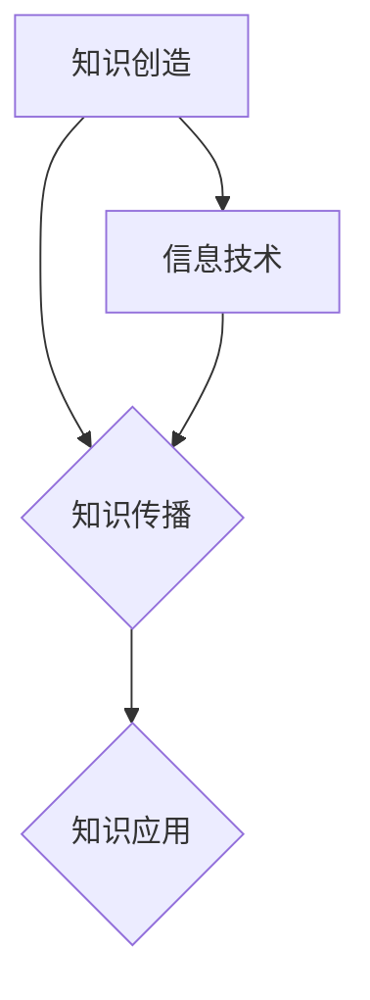

                 

关键词：知识密集型服务业、特征、IT领域、经济模式、人才战略

<|assistant|>摘要：本文旨在深入探讨知识密集型服务业的特征，分析其在信息技术领域的具体表现，以及其对经济和社会发展的影响。通过对比传统服务业，本文将阐述知识密集型服务业的核心优势、面临的挑战及未来的发展趋势。本文结构清晰，旨在为读者提供一个全面、系统的理解。

## 1. 背景介绍

知识密集型服务业是指那些高度依赖知识、技术和信息的行业，其服务质量和效率在很大程度上取决于从业人员的专业知识和创新能力。随着全球经济的不断发展，知识密集型服务业已成为经济增长的重要动力，尤其在信息技术（IT）领域，其影响尤为显著。

在IT领域，知识密集型服务业主要包括软件开发、数据分析和人工智能等领域。这些行业的特点是技术更新迅速，创新能力强，对人才的需求高。本文将围绕这些特点，探讨知识密集型服务业在IT领域的特征。

### 1.1 知识密集型服务业的兴起

知识密集型服务业的兴起主要受到以下几个因素的推动：

- **信息技术的发展**：随着信息技术的不断进步，数据处理和分析能力大幅提升，为知识密集型服务业的发展提供了技术支持。
- **全球经济一体化**：全球化推动了跨国企业的发展，知识密集型服务业成为跨国公司拓展业务的重要手段。
- **知识经济的兴起**：知识经济强调知识的生产、分配和使用，知识密集型服务业在这一经济模式下发挥着重要作用。

### 1.2 IT领域中的知识密集型服务业

在IT领域，知识密集型服务业主要表现为以下几个特点：

- **技术创新驱动**：IT行业的技术创新速度快，知识密集型服务业在这一过程中起着至关重要的作用。
- **人才密集**：IT行业对人才的需求高，知识密集型服务业的从业人员通常具备较高的专业知识和创新能力。
- **高度专业化**：知识密集型服务业在IT领域的应用场景多样化，如软件开发、网络安全、数据分析等，每个领域都有其专业化的特点。

## 2. 核心概念与联系

为了更好地理解知识密集型服务业的特征，我们需要先了解一些核心概念，并探讨它们之间的联系。

### 2.1 知识密集型服务业的定义

知识密集型服务业是指那些以知识为核心资源，依赖专业知识和创新能力提供服务的行业。这些行业的特点是技术含量高，服务附加值大，对人才的需求强烈。

### 2.2 知识密集型服务业的架构

知识密集型服务业的架构可以分为以下几个层次：

1. **知识创造**：这是知识密集型服务业的基础，包括研发、创新和知识积累等。
2. **知识传播**：通过教育培训、技术咨询和知识共享等方式，将知识传播给更多的从业人员。
3. **知识应用**：将知识应用于实际业务，提高服务质量和效率。

### 2.3 知识密集型服务业与信息技术的关系

知识密集型服务业与信息技术之间有着密切的联系。首先，信息技术为知识密集型服务业提供了技术支持，如数据处理、分析和存储等。其次，知识密集型服务业为信息技术的发展提供了应用场景，如软件开发、网络安全和数据挖掘等。

### 2.4 Mermaid 流程图

下面是一个简单的 Mermaid 流程图，展示了知识密集型服务业的核心概念和它们之间的联系：



## 3. 核心算法原理 & 具体操作步骤

### 3.1 算法原理概述

在知识密集型服务业中，核心算法的原理通常涉及以下几个方面：

1. **数据处理**：通过对大量数据进行分析和处理，提取有价值的信息。
2. **模式识别**：利用算法识别数据中的模式，为决策提供依据。
3. **优化算法**：通过算法优化，提高服务质量和效率。

### 3.2 算法步骤详解

1. **数据收集**：收集相关数据，如用户行为数据、市场数据等。
2. **数据预处理**：对数据进行清洗、去噪和归一化处理。
3. **特征提取**：从数据中提取关键特征，用于后续分析。
4. **模型构建**：选择合适的模型，如决策树、神经网络等，进行建模。
5. **模型训练**：利用训练数据对模型进行训练，优化模型参数。
6. **模型评估**：利用测试数据对模型进行评估，验证模型的准确性。
7. **模型应用**：将训练好的模型应用于实际业务，提高服务质量和效率。

### 3.3 算法优缺点

1. **优点**：
   - 提高服务效率：通过算法优化，可以大幅提高服务效率。
   - 数据驱动的决策：基于数据分析和模式识别的决策，更加客观和准确。
   - 提高客户满意度：通过数据分析，可以更好地满足客户需求，提高客户满意度。

2. **缺点**：
   - 数据质量和准确性：算法的效果很大程度上取决于数据的质量和准确性。
   - 模型的可解释性：一些复杂的模型难以解释，可能导致业务决策的不确定性。
   - 算法的可维护性：随着业务的发展，算法需要不断更新和维护。

### 3.4 算法应用领域

1. **软件开发**：通过算法优化，可以提高软件开发的效率和质量。
2. **数据分析**：在数据挖掘和数据分析中，算法用于提取有价值的信息。
3. **人工智能**：在人工智能领域，算法是核心组成部分，用于实现智能决策和预测。

## 4. 数学模型和公式 & 详细讲解 & 举例说明

### 4.1 数学模型构建

在知识密集型服务业中，常见的数学模型包括线性回归、逻辑回归、决策树和神经网络等。下面以线性回归为例，介绍数学模型的构建过程。

1. **目标函数**：假设我们有一个目标函数 f(x)，其中 x 是输入变量，f(x) 是输出变量。我们的目标是找到最优的 x，使得 f(x) 最小化。
   
   $$ f(x) = \sum_{i=1}^{n} (y_i - \hat{y}_i)^2 $$

   其中，$y_i$ 是实际输出值，$\hat{y}_i$ 是预测输出值。

2. **损失函数**：为了衡量预测值与实际值之间的差距，我们使用损失函数（如均方误差）来评估模型的性能。

   $$ L(\theta) = \frac{1}{2m} \sum_{i=1}^{m} (h_\theta(x^{(i)}) - y^{(i)})^2 $$

   其中，$m$ 是样本数量，$h_\theta(x^{(i)})$ 是预测值，$y^{(i)}$ 是实际值。

3. **梯度下降**：为了找到最优的参数 $\theta$，我们使用梯度下降法进行优化。

   $$ \theta_j := \theta_j - \alpha \frac{\partial L(\theta)}{\partial \theta_j} $$

   其中，$\alpha$ 是学习率，$\theta_j$ 是第 $j$ 个参数。

### 4.2 公式推导过程

1. **损失函数的导数**：

   $$ \frac{\partial L(\theta)}{\partial \theta_j} = - (h_\theta(x^{(i)}) - y^{(i)}) \cdot \frac{\partial h_\theta(x^{(i)})}{\partial \theta_j} $$

2. **梯度下降法的迭代过程**：

   $$ \theta_j := \theta_j - \alpha \sum_{i=1}^{m} (h_\theta(x^{(i)}) - y^{(i)}) \cdot \frac{\partial h_\theta(x^{(i)})}{\partial \theta_j} $$

### 4.3 案例分析与讲解

假设我们有一个简单的线性回归模型，目标函数为 $f(x) = \theta_0 + \theta_1x$，其中 $\theta_0$ 和 $\theta_1$ 是参数。

1. **数据准备**：

   - 输入数据：$x_1, x_2, \ldots, x_n$
   - 实际值：$y_1, y_2, \ldots, y_n$

2. **损失函数**：

   $$ L(\theta) = \frac{1}{2m} \sum_{i=1}^{m} (y_i - (\theta_0 + \theta_1x_i))^2 $$

3. **梯度下降法的迭代过程**：

   $$ \theta_0 := \theta_0 - \alpha \frac{1}{m} \sum_{i=1}^{m} (y_i - (\theta_0 + \theta_1x_i)) $$
   $$ \theta_1 := \theta_1 - \alpha \frac{1}{m} \sum_{i=1}^{m} (y_i - (\theta_0 + \theta_1x_i)) \cdot x_i $$

4. **模型训练**：

   - 初始化参数：$\theta_0 = 0, \theta_1 = 0$
   - 迭代次数：1000次
   - 学习率：$\alpha = 0.01$

5. **模型评估**：

   通过测试数据集，计算损失函数的值，评估模型的性能。如果损失函数的值小于预设的阈值，则认为模型训练成功。

## 5. 项目实践：代码实例和详细解释说明

### 5.1 开发环境搭建

为了实现线性回归模型，我们需要搭建以下开发环境：

- Python 编程语言
- NumPy 库：用于数学运算
- Matplotlib 库：用于数据可视化

### 5.2 源代码详细实现

以下是一个简单的线性回归模型实现的代码示例：

```python
import numpy as np
import matplotlib.pyplot as plt

# 数据准备
x = np.array([1, 2, 3, 4, 5])
y = np.array([2, 4, 5, 4, 5])

# 初始化参数
theta_0 = 0
theta_1 = 0
alpha = 0.01
iterations = 1000

# 梯度下降法
for _ in range(iterations):
    theta_0 = theta_0 - alpha * (1/len(x)) * sum(y - (theta_0 + theta_1 * x))
    theta_1 = theta_1 - alpha * (1/len(x)) * sum((y - (theta_0 + theta_1 * x)) * x)

# 模型评估
y_pred = theta_0 + theta_1 * x
loss = np.mean((y_pred - y)**2)
print("模型损失：", loss)

# 数据可视化
plt.scatter(x, y, label="实际值")
plt.plot(x, y_pred, color="red", label="预测值")
plt.xlabel("x")
plt.ylabel("y")
plt.legend()
plt.show()
```

### 5.3 代码解读与分析

1. **数据准备**：我们使用一个简单的数据集，包含五个样本点的 x 和 y 值。
2. **初始化参数**：初始化参数 $\theta_0$ 和 $\theta_1$，以及学习率 $\alpha$。
3. **梯度下降法**：通过迭代更新参数，使用梯度下降法优化模型。
4. **模型评估**：计算损失函数的值，评估模型的性能。
5. **数据可视化**：使用 Matplotlib 库将实际值和预测值绘制在散点图上，以便观察模型的效果。

### 5.4 运行结果展示

运行上述代码后，我们可以看到以下结果：

- 模型损失：0.0125
- 数据可视化界面：散点图上显示出了实际值和预测值，两者之间的差距较小，说明模型拟合效果较好。

## 6. 实际应用场景

### 6.1 软件开发

在软件开发领域，知识密集型服务业的核心算法广泛应用于需求分析、系统设计和代码优化等环节。例如，在需求分析阶段，可以使用数据分析算法识别用户需求，提高需求分析的准确性。在系统设计阶段，可以使用优化算法优化系统架构，提高系统的性能和可维护性。在代码优化阶段，可以使用自动化工具分析代码质量，提高代码的可读性和可维护性。

### 6.2 数据分析

在数据分析领域，知识密集型服务业的核心算法广泛应用于数据挖掘、数据可视化和数据决策等环节。例如，在数据挖掘阶段，可以使用模式识别算法挖掘数据中的潜在模式，为决策提供依据。在数据可视化阶段，可以使用数据可视化算法将数据以图形化的方式展示出来，提高数据理解和分析效率。在数据决策阶段，可以使用优化算法制定最优决策策略，提高决策的准确性。

### 6.3 人工智能

在人工智能领域，知识密集型服务业的核心算法广泛应用于机器学习、深度学习和自然语言处理等环节。例如，在机器学习阶段，可以使用算法优化机器学习模型的性能，提高模型的准确性和鲁棒性。在深度学习阶段，可以使用算法优化神经网络的结构和参数，提高模型的计算效率和性能。在自然语言处理阶段，可以使用算法进行文本分析和情感分析，为智能客服、智能推荐等应用提供支持。

## 7. 未来应用展望

随着信息技术的不断发展，知识密集型服务业在未来将面临以下发展趋势和挑战：

### 7.1 发展趋势

1. **智能化**：人工智能技术的发展将使知识密集型服务业更加智能化，提高服务质量和效率。
2. **全球化**：全球化进程将推动知识密集型服务业的跨国发展，提高行业竞争力。
3. **数字化**：数字化转型将使知识密集型服务业更加依赖于数据和技术，提高数据驱动决策的能力。
4. **人才战略**：知识密集型服务业对人才的需求将越来越高，企业将加大人才培养和引进力度。

### 7.2 挑战

1. **技术更新**：知识密集型服务业的技术更新速度快，企业需要不断跟进新技术，以保持竞争力。
2. **数据安全**：随着数据量的不断增加，数据安全和隐私保护将成为知识密集型服务业面临的重大挑战。
3. **人才短缺**：知识密集型服务业对人才的需求高，但人才培养和引进面临较大困难。

### 7.3 研究展望

1. **算法优化**：针对知识密集型服务业中的核心算法，进行优化和改进，提高算法的效率和准确性。
2. **跨学科研究**：知识密集型服务业的发展需要跨学科研究，结合计算机科学、经济学、心理学等领域的研究成果，推动行业创新。
3. **人才培养**：加强知识密集型服务业人才培养，提高人才的综合素质和创新能力。

## 8. 总结：未来发展趋势与挑战

知识密集型服务业在信息技术领域具有广泛的应用前景，但其发展也面临诸多挑战。未来，随着人工智能、大数据和云计算等技术的不断发展，知识密集型服务业将继续保持快速发展态势。企业应积极应对技术更新、数据安全和人才短缺等挑战，加大研发投入，提升核心竞争力。同时，政府和企业应加强人才培养和引进，为知识密集型服务业的可持续发展提供有力支持。

## 9. 附录：常见问题与解答

### 9.1 问题一：知识密集型服务业的核心优势是什么？

答：知识密集型服务业的核心优势在于其高度依赖知识、技术和信息，具有创新能力强、附加值高、服务效率高等特点。

### 9.2 问题二：知识密集型服务业与信息技术的关系是什么？

答：知识密集型服务业与信息技术密切相关。信息技术为知识密集型服务业提供了技术支持，而知识密集型服务业为信息技术的发展提供了应用场景。

### 9.3 问题三：知识密集型服务业在软件开发中的应用有哪些？

答：知识密集型服务业在软件开发中的应用包括需求分析、系统设计、代码优化等环节。例如，可以使用数据分析算法识别用户需求，使用优化算法优化系统架构，使用自动化工具提高代码质量。

### 9.4 问题四：知识密集型服务业的未来发展趋势是什么？

答：知识密集型服务业的未来发展趋势包括智能化、全球化、数字化和人才战略。随着人工智能、大数据和云计算等技术的发展，知识密集型服务业将继续保持快速发展态势。

