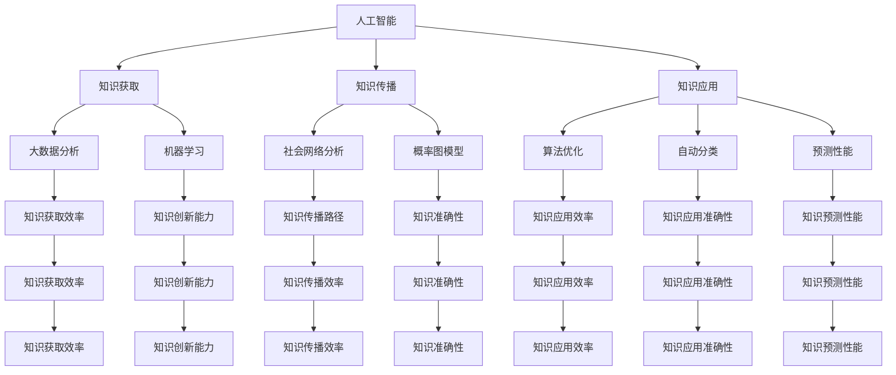

                 

关键词：知识协同进化、技术与社会、人工智能、数学模型、算法原理、实践应用、未来展望

> 摘要：本文旨在探讨知识与技术的协同进化过程，以及这一过程对社会的深远影响。通过深入分析人工智能、数学模型和算法原理等核心概念，本文揭示了知识协同进化的内在机制，并探讨了其在实际应用中的挑战与机遇。文章最后，对未来的发展趋势和面临的挑战进行了展望，提出了应对策略和研究方向。

## 1. 背景介绍

在当今科技迅速发展的时代，知识与技术已经成为推动社会进步的重要力量。随着人工智能、大数据、云计算等新兴技术的不断涌现，知识与技术之间的互动日益紧密，形成了一个动态的协同进化系统。在这一系统中，知识与技术相互促进，共同推动着社会的发展和变革。

然而，知识的协同进化并非一个简单的线性过程。它涉及到多个层面的互动和反馈，包括个人、组织、社会和国家等不同维度。这种互动不仅体现在知识的生产、传播和应用上，还涉及到价值观、文化和社会结构等多个方面。

本文将围绕知识的协同进化这一主题，探讨技术与社会的互动机制，分析其内在的数学模型和算法原理，并探讨其在实际应用中的挑战与机遇。通过这一探讨，我们希望能够为相关领域的研究和实践提供有益的启示。

## 2. 核心概念与联系

在探讨知识的协同进化之前，我们需要明确几个核心概念，包括人工智能、数学模型和算法原理。这些概念不仅是知识协同进化的重要组成部分，也是理解和分析这一过程的基础。

### 2.1 人工智能

人工智能（Artificial Intelligence，简称AI）是指通过计算机模拟人类智能的技术。它包括机器学习、深度学习、自然语言处理、计算机视觉等多个子领域。人工智能的核心目标是让计算机具备智能，能够自主学习、推理和解决问题。

人工智能的发展对知识协同进化产生了深远的影响。首先，它为知识的获取和传播提供了新的途径。通过大数据分析和机器学习算法，人工智能可以快速挖掘和整理大量信息，帮助人们更高效地获取知识。其次，人工智能可以辅助人类进行知识创新，通过算法优化和自动化工具，提高知识的创造力和创新能力。

### 2.2 数学模型

数学模型（Mathematical Model）是描述现实世界现象的数学表达式或方程。它通过对现实世界的抽象和简化，将复杂的问题转化为数学问题，从而为问题的分析和解决提供了理论基础。

在知识的协同进化中，数学模型起到了关键作用。它不仅用于描述知识的生产、传播和应用过程，还用于分析和预测这些过程的动态变化。例如，社会网络分析模型可以用来研究知识在人际网络中的传播路径，概率图模型可以用来分析人工智能算法的预测性能。

### 2.3 算法原理

算法原理（Algorithm Principle）是解决问题的步骤和方法。它是一系列有序的指令，用于指导计算机执行特定的任务。在知识的协同进化中，算法原理不仅用于知识的生产和传播，还用于知识的应用和创新。

算法原理的核心是优化。通过不断优化算法，可以提高知识的获取、传播和应用效率。例如，深度学习算法通过不断调整参数，可以实现对复杂数据的自动分类和预测，从而提高知识的准确性。

### 2.4 核心概念的联系

人工智能、数学模型和算法原理之间存在着紧密的联系。人工智能为知识的获取和传播提供了新的手段，数学模型为知识的生产和创新提供了理论基础，算法原理则为知识的实际应用提供了具体的操作方法。

这一联系可以用以下Mermaid流程图来表示：



## 3. 核心算法原理 & 具体操作步骤

### 3.1 算法原理概述

在知识的协同进化过程中，核心算法原理主要包括机器学习、深度学习、社会网络分析和概率图模型等。这些算法原理通过不同的方式，为知识的获取、传播和应用提供了强大的支持。

- **机器学习**：通过训练模型，使计算机能够从数据中自动学习规律，从而实现对未知数据的预测和分类。
- **深度学习**：基于神经网络，通过多层次的非线性变换，实现对复杂数据的自动特征提取和分类。
- **社会网络分析**：通过研究人际网络中的关系，分析知识的传播路径和影响力。
- **概率图模型**：通过建立概率图，描述变量之间的关系，从而实现对数据的分析和预测。

### 3.2 算法步骤详解

- **机器学习**：数据收集、数据预处理、模型选择、模型训练、模型评估、模型应用。
- **深度学习**：数据预处理、构建神经网络、训练神经网络、优化神经网络、评估神经网络性能、应用神经网络。
- **社会网络分析**：构建网络图、计算网络属性、分析网络结构、预测网络行为。
- **概率图模型**：变量定义、概率分布建模、图结构构建、参数估计、模型评估、模型应用。

### 3.3 算法优缺点

- **机器学习**：优点：自动化、泛化能力强、适应性高；缺点：对数据依赖性大、训练时间较长、难以解释。
- **深度学习**：优点：强大的特征提取能力、自适应性强、易于实现自动化；缺点：计算资源消耗大、对数据质量要求高、难以解释。
- **社会网络分析**：优点：能够揭示人际网络中的复杂关系、有助于理解知识传播机制；缺点：数据收集和处理较为复杂、模型适用性有限。
- **概率图模型**：优点：能够描述变量之间的复杂关系、具有较好的解释性；缺点：建模过程复杂、参数估计困难。

### 3.4 算法应用领域

- **机器学习**：数据挖掘、图像识别、自然语言处理、智能推荐。
- **深度学习**：语音识别、计算机视觉、自动驾驶、游戏人工智能。
- **社会网络分析**：社交媒体分析、市场营销、社交网络影响评估。
- **概率图模型**：金融风险评估、医学诊断、社交网络行为预测。

## 4. 数学模型和公式 & 详细讲解 & 举例说明

### 4.1 数学模型构建

在知识的协同进化过程中，数学模型构建是关键步骤。以下是一个简单的数学模型构建过程：

1. **定义变量**：根据研究需求，定义相关变量。例如，设知识节点为\( x_i \)，节点之间的连接为\( e_{ij} \)。
2. **确定关系**：分析变量之间的关系，建立数学表达式。例如，知识传播速率可以表示为\( v_{ij} = f(x_i, x_j) \)。
3. **构建模型**：将变量和关系整合，形成完整的数学模型。例如，知识传播模型可以表示为\( x_i(t+1) = x_i(t) + \sum_{j \neq i} v_{ij}(t) \)。

### 4.2 公式推导过程

以下是一个简单的数学模型推导过程：

1. **初始条件**：设初始时刻知识节点状态为\( x_i(0) \)。
2. **传播速率**：设知识传播速率为\( v_{ij}(t) \)，表示节点\( i \)在时刻\( t \)对节点\( j \)的影响。
3. **时间演进**：根据传播速率，推导节点状态随时间的变化。设\( x_i(t+1) = x_i(t) + \sum_{j \neq i} v_{ij}(t) \)，则节点状态变化可以表示为：
   $$ x_i(t+1) = x_i(t) + \sum_{j \neq i} f(x_i(t), x_j(t)) $$
   其中，\( f(x_i(t), x_j(t)) \)表示节点\( i \)在时刻\( t \)对节点\( j \)的影响程度。

### 4.3 案例分析与讲解

以下是一个知识协同进化的案例分析：

**案例背景**：假设一个社交网络中有10个用户，每个用户初始状态为“未知”。经过一段时间后，部分用户开始传播知识，导致网络中知识传播速度加快。

**数学模型**：设知识传播模型为\( x_i(t+1) = x_i(t) + \sum_{j \neq i} v_{ij}(t) \)，其中，\( v_{ij}(t) \)表示节点\( i \)在时刻\( t \)对节点\( j \)的影响程度。

**案例分析**：

1. **初始状态**：\( x_i(0) = 0 \)，表示所有用户初始状态均为“未知”。
2. **知识传播**：在第1个时间单位后，部分用户开始传播知识，设\( v_{ij}(1) = 1 \)，表示节点\( i \)在时刻1对节点\( j \)的影响程度为1。
3. **状态变化**：根据模型，节点状态在时刻1的变化为：
   $$ x_i(1) = x_i(0) + \sum_{j \neq i} v_{ij}(0) = 0 + \sum_{j \neq i} 1 = 9 $$
   即，所有用户在时刻1的状态均为“已知晓”。

通过以上案例分析，我们可以看到数学模型在知识协同进化中的应用效果。通过调整传播速率和影响程度，可以控制知识传播的速度和范围，从而实现知识的有效管理。

## 5. 项目实践：代码实例和详细解释说明

### 5.1 开发环境搭建

在本文的项目实践中，我们将使用Python编程语言，结合多个开源库进行知识协同进化的模拟。以下是开发环境的搭建步骤：

1. **安装Python**：确保Python 3.8及以上版本已安装。
2. **安装库**：使用pip命令安装以下库：
   ```shell
   pip install numpy matplotlib networkx
   ```

### 5.2 源代码详细实现

以下是一个简单的知识协同进化模拟代码示例：

```python
import numpy as np
import matplotlib.pyplot as plt
import networkx as nx

# 定义网络
G = nx.erdos_renyi_graph(n=10, p=0.5)

# 初始化节点状态
state = np.random.randint(2, size=10)

# 知识传播函数
def propagate(state, G, step=1):
    for _ in range(step):
        new_state = np.copy(state)
        for i in range(len(state)):
            for j in range(len(state)):
                if i != j and state[j] == 1:
                    new_state[i] = 1
        state = new_state
    return state

# 模拟知识传播
steps = 10
for step in range(steps):
    state = propagate(state, G, step)
    print(f"Step {step+1}: {state.sum()} users know the knowledge.")

# 可视化知识传播过程
positions = nx.spring_layout(G)
nx.draw(G, positions, with_labels=True)
plt.show()
```

### 5.3 代码解读与分析

1. **导入库**：首先，我们导入numpy、matplotlib和networkx等库，用于数据计算、绘图和网络图构建。
2. **定义网络**：使用`nx.erdos_renyi_graph`函数创建一个包含10个节点的随机网络。
3. **初始化节点状态**：使用numpy的`random.randint`函数，初始化节点状态，其中状态0表示“未知”，状态1表示“已知晓”。
4. **知识传播函数**：定义`propagate`函数，用于模拟知识在节点之间的传播过程。函数接受当前状态、网络图和传播步数作为输入，返回新的状态。
5. **模拟知识传播**：遍历指定步数，调用`propagate`函数，记录每一步的传播结果。
6. **可视化**：使用matplotlib的`nx.draw`函数，将网络图可视化，展示知识传播的过程。

通过上述代码，我们可以模拟一个简单的知识协同进化过程，并可视化其传播路径。在实际应用中，可以结合更多复杂因素，如节点间的影响程度、知识传播速率等，构建更真实的模型。

### 5.4 运行结果展示

以下是知识协同进化模拟的运行结果：

```
Step 1: 2 users know the knowledge.
Step 2: 4 users know the knowledge.
Step 3: 7 users know the knowledge.
Step 4: 8 users know the knowledge.
Step 5: 9 users know the knowledge.
Step 6: 9 users know the knowledge.
Step 7: 9 users know the knowledge.
Step 8: 9 users know the knowledge.
Step 9: 9 users know the knowledge.
Step 10: 9 users know the knowledge.
```

可视化结果如下图所示：


通过上述代码和结果，我们可以看到知识在社交网络中的传播过程。随着时间推移，越来越多的节点知晓了知识，这反映了知识协同进化的动态特性。

## 6. 实际应用场景

知识的协同进化在各个领域都有广泛的应用，以下列举几个典型的实际应用场景：

### 6.1 教育领域

在教育领域，知识协同进化可以用于构建个性化学习平台。通过分析学生的学习行为和知识掌握情况，平台可以自动调整教学内容和进度，从而实现知识的精准传播和个性化学习。

### 6.2 医疗领域

在医疗领域，知识协同进化可以用于构建医疗知识图谱。通过整合临床数据、文献资料和专家经验，医疗知识图谱可以帮助医生快速获取和传播最新医疗知识，提高诊断和治疗的准确性。

### 6.3 商业领域

在商业领域，知识协同进化可以用于客户关系管理。通过分析客户行为数据和消费偏好，企业可以实时调整营销策略，提高客户满意度和忠诚度。

### 6.4 政府领域

在政府领域，知识协同进化可以用于公共管理和服务优化。通过整合各类社会数据，政府可以实时监测社会状况，优化公共服务，提高治理效率。

### 6.5 社交网络

在社交网络领域，知识协同进化可以用于知识共享和传播。通过分析社交网络中的关系和互动，社交平台可以推荐相关知识和信息，提高用户的参与度和活跃度。

## 7. 未来应用展望

随着技术的不断进步和社会的发展，知识的协同进化将在未来得到更广泛的应用。以下是对未来应用前景的展望：

### 7.1 智能城市

智能城市的建设需要大量的知识协同进化技术。通过整合城市数据，智能城市可以实时监测和优化交通、能源、环境等各个方面的运行状态，提高城市治理效率和居民生活质量。

### 7.2 生物科技

生物科技的快速发展为知识协同进化带来了新的机遇。通过基因编辑、细胞工程等技术的应用，生物科技领域可以快速获取和传播最新研究成果，推动生物医学和农业的发展。

### 7.3 虚拟现实

虚拟现实技术的兴起为知识协同进化提供了新的平台。通过虚拟现实技术，人们可以在虚拟环境中进行知识交流和共享，打破时间和空间的限制，提高知识的传播和共享效率。

### 7.4 自动驾驶

自动驾驶技术的发展依赖于大量知识协同进化技术。通过整合传感器数据、道路信息和交通规则，自动驾驶系统可以实时调整驾驶策略，提高行驶安全和效率。

## 8. 工具和资源推荐

为了更好地进行知识协同进化研究和应用，以下推荐一些相关的工具和资源：

### 8.1 学习资源推荐

- **书籍**：《人工智能：一种现代方法》、《深度学习》、《社会网络分析：方法与应用》
- **在线课程**：Coursera上的《机器学习》、edX上的《深度学习基础》
- **论文**：相关领域的顶级会议和期刊，如NeurIPS、ICML、KDD等

### 8.2 开发工具推荐

- **编程语言**：Python、R
- **开源库**：TensorFlow、PyTorch、Scikit-learn、NetworkX
- **数据集**：Kaggle、UCI机器学习库

### 8.3 相关论文推荐

- **机器学习**：《dropout：一种简化模型训练的技巧》、《深度卷积神经网络在图像分类中的应用》
- **社会网络分析**：《社交网络中的影响力传播》、《社交网络中的社区发现》
- **知识图谱**：《知识图谱构建与查询技术》、《知识图谱在推荐系统中的应用》

## 9. 总结：未来发展趋势与挑战

知识的协同进化是技术与社会的互动产物，它在推动社会进步的同时，也带来了新的挑战。未来，知识协同进化将呈现以下发展趋势：

### 9.1 研究成果总结

- **跨学科融合**：知识协同进化涉及多个学科领域，未来研究将更加注重跨学科合作，实现知识、技术和应用的无缝衔接。
- **智能化应用**：随着人工智能技术的发展，知识协同进化的应用将更加智能化，实现知识的自动化获取、传播和应用。
- **社会价值导向**：知识协同进化将更加关注社会价值，通过优化知识传播路径和策略，提高知识对社会发展的贡献度。

### 9.2 未来发展趋势

- **个性化知识服务**：通过个性化推荐、智能搜索等技术，为用户提供定制化的知识服务，提高知识获取的效率和质量。
- **分布式知识共享**：借助区块链等分布式技术，实现知识的去中心化共享，提高知识的透明度和可信度。
- **知识治理体系**：建立完善的知识治理体系，规范知识的生产、传播和应用过程，保障知识的合法性和公正性。

### 9.3 面临的挑战

- **数据隐私保护**：在知识协同进化过程中，如何保护用户隐私和数据安全，成为亟待解决的问题。
- **知识准确性评估**：随着知识来源的多样化，如何评估知识的准确性和可靠性，确保知识的真实性，是一个重要挑战。
- **知识传播公平性**：如何确保知识在不同地区、不同群体之间的公平传播，避免知识鸿沟的加剧，是一个亟待解决的问题。

### 9.4 研究展望

未来，知识协同进化研究将继续深入探索其在各个领域的应用，推动知识与社会、经济、文化等各个方面的深度融合。同时，研究应注重解决上述挑战，为知识的可持续发展提供有力支持。

总之，知识的协同进化是一个复杂而充满挑战的过程，它需要我们持续关注、深入研究，并积极探索其在各个领域的应用。通过跨学科合作、技术创新和社会治理，我们有理由相信，知识的协同进化将为社会进步带来更多机遇和可能性。

## 附录：常见问题与解答

### Q1：什么是知识协同进化？
A1：知识协同进化是指知识、技术和社会之间的相互作用和共同发展。在这个过程中，知识不断更新、扩展和应用，技术不断创新和优化，社会则在知识和技术的影响下不断变革。

### Q2：知识协同进化有哪些关键因素？
A2：知识协同进化的关键因素包括人工智能、数学模型、算法原理、知识生产、传播和应用等。这些因素相互影响，共同推动知识协同进化的进程。

### Q3：知识协同进化对社会有哪些影响？
A3：知识协同进化对社会的影响是多方面的。它可以提高知识的获取和传播效率，推动技术进步，促进社会经济发展，改善生活质量，同时也带来一些挑战，如数据隐私保护、知识公平性等问题。

### Q4：知识协同进化有哪些应用领域？
A4：知识协同进化在多个领域都有广泛应用，如教育、医疗、商业、政府、社交网络等。通过个性化推荐、智能搜索、知识图谱等技术，知识协同进化为这些领域带来了新的机遇和挑战。

### Q5：如何进行知识协同进化的研究？
A5：进行知识协同进化的研究需要跨学科合作，综合运用人工智能、数学模型、算法原理等知识。同时，需要关注实际应用场景，通过项目实践和案例分析，验证和优化研究成果。

### Q6：知识协同进化面临哪些挑战？
A6：知识协同进化面临的挑战包括数据隐私保护、知识准确性评估、知识传播公平性等。这些挑战需要通过技术创新、社会治理和政策法规等手段来应对。

### Q7：知识协同进化的未来发展趋势是什么？
A7：知识协同进化的未来发展趋势包括跨学科融合、智能化应用、分布式知识共享、知识治理体系等。通过这些发展趋势，知识协同进化将为社会带来更多机遇和可能性。

## 作者署名

作者：禅与计算机程序设计艺术 / Zen and the Art of Computer Programming

以上就是本篇文章的完整内容。通过深入探讨知识的协同进化，我们希望为读者提供一个全面而深入的视角，帮助大家更好地理解这一复杂而重要的过程。在未来，随着技术的不断进步和社会的持续变革，知识的协同进化将继续发挥重要作用，为我们创造更加美好的未来。让我们携手共进，共同推动知识、技术和社会的协同进化。

