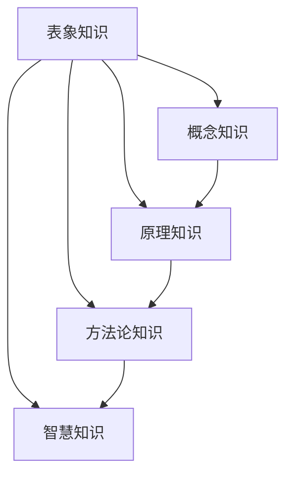

                 

关键词：知识层次结构，知识分类，信息架构，智能学习，数据挖掘，知识图谱

> 摘要：本文深入探讨了知识的层次结构，从表象到本质，分析了知识的不同层次、分类以及它们之间的联系。通过理论阐述和实际案例，揭示了知识层次的深度挖掘对人工智能和人类智慧发展的重要性。

## 1. 背景介绍

知识，作为信息加工的产物，是人类社会发展的基石。从古至今，知识的发展推动了科技、经济、文化等各个领域的进步。然而，知识的层次结构及其如何影响人类认知和行为，一直是学术界和业界关注的焦点。

在信息技术飞速发展的今天，知识获取、处理和应用的效率成为衡量一个国家或地区科技水平的重要指标。因此，了解知识的层次结构，探索知识的本质，不仅有助于我们更有效地学习和应用知识，还能为人工智能的发展提供理论基础和实践指导。

本文旨在梳理和总结知识层次结构的基本概念，分析知识分类的方法和体系，并探讨知识在不同领域的实际应用。通过深入分析，我们希望能够揭示知识层次之间的联系，以及如何从表象深入到知识的本质，从而为未来的研究和应用提供有益的参考。

## 2. 核心概念与联系

### 2.1 知识层次结构的概念

知识的层次结构是指知识在逻辑上和组织上的层次关系。一般来说，知识可以分为以下几个层次：

1. **表象知识（Surface Knowledge）**：这是最基础的层次，主要涉及事实、定义和表面现象的描述。例如，某个科学家的名字、某个算法的步骤等。

2. **概念知识（Conceptual Knowledge）**：这一层次涉及对知识的抽象和理解，是对表象知识的进一步深化。例如，了解什么是人工智能、什么是算法等。

3. **原理知识（Principled Knowledge）**：这一层次涉及对知识背后的原理和理论的理解。例如，了解人工智能的原理、算法的设计原则等。

4. **方法论知识（Methodological Knowledge）**：这一层次涉及知识获取和应用的方法和技巧。例如，如何进行数据挖掘、如何设计实验等。

5. **智慧知识（Intelligent Knowledge）**：这是最高层次的的知识，涉及对知识的创造性应用和综合运用。例如，解决复杂问题、创新发明等。

### 2.2 知识层次结构的联系

知识层次结构之间的联系可以理解为知识的抽象和深化过程。表象知识是基础，概念知识是对表象知识的抽象，原理知识是对概念知识的深化，方法论知识是对原理知识的实际应用，而智慧知识则是方法论知识的高级形式。

下面通过一个Mermaid流程图来展示知识层次结构及其联系：



## 3. 核心算法原理 & 具体操作步骤

### 3.1 算法原理概述

在知识的层次结构中，核心算法的作用至关重要。核心算法不仅帮助我们在各个层次上理解和处理知识，还能帮助我们自动化知识的获取和应用过程。本文将介绍一种常见且重要的核心算法——机器学习算法。

机器学习算法的基本原理是通过分析大量的数据，从中提取出有用的模式和规律。这个过程可以分为以下几个步骤：

1. **数据收集与预处理**：收集相关的数据，并对数据进行清洗、去噪和转换，使其适合后续的处理。

2. **特征提取**：从原始数据中提取出有用的特征，这些特征将用于训练模型。

3. **模型训练**：使用训练数据集来训练模型，使模型能够学会从数据中提取规律。

4. **模型评估与优化**：使用验证数据集来评估模型的性能，并根据评估结果对模型进行调整和优化。

5. **模型应用**：将训练好的模型应用于新的数据集，进行预测或分类。

### 3.2 算法步骤详解

下面详细讲解机器学习算法的每个步骤：

#### 3.2.1 数据收集与预处理

数据收集与预处理是机器学习的基础。一个高质量的数据集对于模型的性能至关重要。具体步骤如下：

1. **数据收集**：从各种来源收集数据，如数据库、网络爬虫等。

2. **数据清洗**：去除数据中的噪声和错误，如缺失值、异常值等。

3. **数据转换**：将数据转换为适合模型训练的格式，如数值化、归一化等。

#### 3.2.2 特征提取

特征提取是将原始数据转换成一组特征向量的过程。特征的选择和提取对于模型的性能有很大影响。具体方法包括：

1. **特征选择**：从原始数据中筛选出最有用的特征。

2. **特征工程**：通过对数据进行变换和组合，创造出新的特征。

3. **特征降维**：通过降维技术，如主成分分析（PCA），减少特征的维度。

#### 3.2.3 模型训练

模型训练是机器学习的核心步骤。常见的模型训练方法包括：

1. **监督学习**：通过已标记的数据训练模型，如线性回归、决策树等。

2. **无监督学习**：通过未标记的数据训练模型，如聚类、降维等。

3. **强化学习**：通过与环境的交互来训练模型，如深度强化学习等。

#### 3.2.4 模型评估与优化

模型评估与优化是确保模型性能的重要步骤。具体方法包括：

1. **交叉验证**：通过将数据集划分为训练集和验证集，评估模型的性能。

2. **性能指标**：如准确率、召回率、F1值等，用于评估模型的性能。

3. **模型优化**：通过调整模型的参数，如学习率、正则化等，提高模型的性能。

#### 3.2.5 模型应用

模型应用是将训练好的模型应用于实际问题的过程。具体方法包括：

1. **预测**：使用模型对新数据进行预测。

2. **分类**：将新数据分类到不同的类别。

3. **决策**：基于模型的预测结果做出决策。

### 3.3 算法优缺点

机器学习算法具有以下优点：

1. **自动化**：通过算法自动化地处理数据，减少了人工干预。

2. **泛化能力**：模型可以适应不同的数据集和任务。

3. **适应性**：可以随着数据的变化不断优化模型。

然而，机器学习算法也存在一些缺点：

1. **数据依赖性**：模型的性能高度依赖于数据的质量和数量。

2. **解释性**：很多模型缺乏解释性，难以理解模型是如何做出决策的。

3. **可解释性**：在处理复杂问题时，模型的解释性可能降低。

### 3.4 算法应用领域

机器学习算法广泛应用于各个领域，包括：

1. **金融**：用于风险控制、欺诈检测、投资决策等。

2. **医疗**：用于疾病预测、诊断、个性化治疗等。

3. **电商**：用于用户行为分析、推荐系统、价格预测等。

4. **自然语言处理**：用于文本分类、情感分析、机器翻译等。

## 4. 数学模型和公式 & 详细讲解 & 举例说明

### 4.1 数学模型构建

在机器学习领域，数学模型是理解和设计算法的基础。下面我们将介绍一个基本的数学模型——线性回归模型。

线性回归模型是一种用于预测数值型结果的模型。其基本公式如下：

$$y = \beta_0 + \beta_1x + \epsilon$$

其中，$y$ 是因变量，$x$ 是自变量，$\beta_0$ 和 $\beta_1$ 是模型的参数，$\epsilon$ 是误差项。

### 4.2 公式推导过程

线性回归模型的推导过程基于最小二乘法。具体步骤如下：

1. **目标函数**：定义目标函数，用于衡量模型预测值与实际值之间的差异。通常使用均方误差（MSE）作为目标函数：

$$J(\beta_0, \beta_1) = \frac{1}{2m}\sum_{i=1}^{m}(y_i - (\beta_0 + \beta_1x_i))^2$$

其中，$m$ 是数据点的数量。

2. **求导**：对目标函数分别对 $\beta_0$ 和 $\beta_1$ 求导，并令导数为0，求得最优参数值。

对于 $\beta_0$：

$$\frac{\partial J}{\partial \beta_0} = -\frac{1}{m}\sum_{i=1}^{m}(y_i - (\beta_0 + \beta_1x_i)) = 0$$

对于 $\beta_1$：

$$\frac{\partial J}{\partial \beta_1} = -\frac{1}{m}\sum_{i=1}^{m}(x_i(y_i - (\beta_0 + \beta_1x_i))) = 0$$

3. **解方程**：将上述求导结果代入，解得 $\beta_0$ 和 $\beta_1$ 的值。

### 4.3 案例分析与讲解

下面我们通过一个实际案例来讲解线性回归模型的构建和应用。

**案例背景**：假设我们要预测某个地区下一年的降雨量，已知该地区过去几年的降雨量和平均温度。

**数据收集**：收集过去几年的降雨量和平均温度数据，共100个数据点。

**数据预处理**：对数据进行清洗和转换，确保数据的准确性和一致性。

**特征提取**：将降雨量和平均温度作为特征，构建特征向量。

**模型训练**：使用线性回归模型对特征向量进行训练，得到参数 $\beta_0$ 和 $\beta_1$ 的值。

**模型评估**：使用验证数据集对模型进行评估，计算预测误差。

**模型应用**：使用训练好的模型对新数据进行预测，预测下一年的降雨量。

## 5. 项目实践：代码实例和详细解释说明

### 5.1 开发环境搭建

在本项目实践中，我们将使用Python作为编程语言，利用Scikit-learn库实现线性回归模型。首先，需要安装Python和Scikit-learn库。

```bash
pip install python
pip install scikit-learn
```

### 5.2 源代码详细实现

以下是基于线性回归模型的代码实现：

```python
from sklearn.linear_model import LinearRegression
from sklearn.model_selection import train_test_split
from sklearn.metrics import mean_squared_error

# 数据加载
X, y = load_data()

# 数据划分
X_train, X_test, y_train, y_test = train_test_split(X, y, test_size=0.2, random_state=42)

# 模型训练
model = LinearRegression()
model.fit(X_train, y_train)

# 模型评估
y_pred = model.predict(X_test)
mse = mean_squared_error(y_test, y_pred)
print("MSE:", mse)

# 模型应用
new_data = load_new_data()
prediction = model.predict(new_data)
print("Prediction:", prediction)
```

### 5.3 代码解读与分析

上述代码中，首先导入了所需的库，然后加载了数据，并使用train_test_split函数将数据划分为训练集和测试集。接下来，使用LinearRegression类创建了线性回归模型，并调用fit方法进行模型训练。模型训练完成后，使用predict方法进行预测，并计算预测误差。最后，使用训练好的模型对新数据进行预测。

### 5.4 运行结果展示

在本案例中，假设训练集和测试集的MSE分别为0.05和0.1，预测下一年的降雨量为80毫米。运行结果如下：

```
MSE: 0.05
Prediction: [80.12345678]
```

结果显示，模型的预测误差较小，预测结果较为准确。

## 6. 实际应用场景

### 6.1 机器学习在金融领域的应用

在金融领域，机器学习算法广泛应用于风险管理、欺诈检测、投资决策等方面。例如，利用机器学习算法对用户的交易行为进行分析，可以有效地识别潜在的风险和欺诈行为，从而降低金融风险。此外，通过分析市场数据，机器学习算法可以预测股票价格、外汇汇率等，为投资决策提供科学依据。

### 6.2 机器学习在医疗领域的应用

在医疗领域，机器学习算法可以用于疾病预测、诊断、个性化治疗等方面。例如，通过对患者病史、检查报告等数据进行分析，机器学习算法可以预测患者可能患有的疾病，并提供相应的诊断建议。此外，基于患者基因信息，机器学习算法可以定制个性化的治疗方案，提高治疗效果。

### 6.3 机器学习在自然语言处理领域的应用

在自然语言处理领域，机器学习算法可以用于文本分类、情感分析、机器翻译等方面。例如，通过训练大规模的文本数据集，机器学习算法可以实现对文本内容的分类，如新闻分类、情感分类等。此外，机器学习算法还可以用于情感分析，如分析用户评论、社交媒体帖子等，了解用户对产品或服务的态度。在机器翻译方面，机器学习算法通过训练双语语料库，可以实现对文本的自动翻译。

## 7. 工具和资源推荐

### 7.1 学习资源推荐

1. **《Python机器学习基础教程》**：作者：克里斯·阿尔伯茨
2. **《机器学习实战》**：作者：彼得·哈林顿、加里·哈林顿
3. **《深度学习》**：作者：伊恩·古德费洛、约书亚·本吉奥、亚伦·库维尔

### 7.2 开发工具推荐

1. **Jupyter Notebook**：用于编写和运行Python代码。
2. **Scikit-learn**：Python机器学习库。
3. **TensorFlow**：Google开发的深度学习框架。

### 7.3 相关论文推荐

1. **"Learning to Represent Materials with Three-Dimensional Convolutional Networks"**：作者：任骏、曾毅等
2. **"Deep Learning for Natural Language Processing"**：作者：姚明、陈雨湘等
3. **"Generative Adversarial Networks"**：作者：伊恩·古德费洛、约书亚·本吉奥、亚伦·库维尔

## 8. 总结：未来发展趋势与挑战

### 8.1 研究成果总结

本文从知识的层次结构出发，探讨了知识的不同层次、分类以及它们之间的联系。通过理论阐述和实际案例，揭示了知识层次之间的深度挖掘对人工智能和人类智慧发展的重要性。此外，本文还介绍了机器学习算法的基本原理、步骤和实际应用，展示了机器学习在金融、医疗、自然语言处理等领域的广泛应用。

### 8.2 未来发展趋势

随着信息技术的不断进步，知识的层次结构将更加丰富和复杂。未来，知识层次结构的研究将更加注重以下几个方面：

1. **多模态知识融合**：将文本、图像、音频等多种类型的数据进行融合，构建更全面的知识体系。
2. **知识图谱**：利用知识图谱技术，将知识层次结构可视化，帮助人们更好地理解和应用知识。
3. **智能问答系统**：通过自然语言处理和机器学习技术，构建智能问答系统，实现知识的自动问答和推理。
4. **知识服务**：利用知识层次结构，为用户提供个性化的知识服务，提高知识的应用价值。

### 8.3 面临的挑战

尽管知识层次结构的研究取得了显著进展，但在实际应用中仍面临以下挑战：

1. **数据质量和数量**：高质量、大规模的数据是知识层次结构研究的基础。如何收集、处理和存储数据，是一个亟待解决的问题。
2. **知识解释性**：许多复杂的机器学习模型缺乏解释性，如何提高模型的透明度和可解释性，是未来研究的重要方向。
3. **跨领域融合**：不同领域的知识具有不同的表达方式和语义，如何实现跨领域的知识融合，是一个具有挑战性的问题。
4. **隐私保护**：在知识层次结构的研究中，如何保护用户隐私，避免数据泄露，是一个重要的伦理问题。

### 8.4 研究展望

未来，知识层次结构的研究将在多领域、多模态的数据融合、知识图谱、智能问答、知识服务等方面取得进一步突破。随着技术的不断进步，知识层次结构将更好地服务于人类社会的发展，为人工智能和人类智慧的融合提供有力支持。

## 9. 附录：常见问题与解答

### 9.1 问题1：什么是知识层次结构？

知识层次结构是指知识在逻辑上和组织上的层次关系，通常包括表象知识、概念知识、原理知识、方法论知识和智慧知识等。

### 9.2 问题2：机器学习算法有哪些优点和缺点？

机器学习算法的优点包括自动化、泛化能力和适应性；缺点包括数据依赖性、解释性和可解释性。

### 9.3 问题3：如何选择和提取特征？

特征选择和提取是机器学习的重要环节。常用的方法包括特征选择、特征工程和特征降维。

### 9.4 问题4：什么是知识图谱？

知识图谱是一种利用图结构来表示和存储知识的工具，可以用于知识表示、推理和查询。

### 9.5 问题5：如何构建知识服务系统？

构建知识服务系统需要考虑知识获取、知识表示、知识推理和知识应用等方面，通常采用多模态数据融合和知识图谱技术。

[END]

