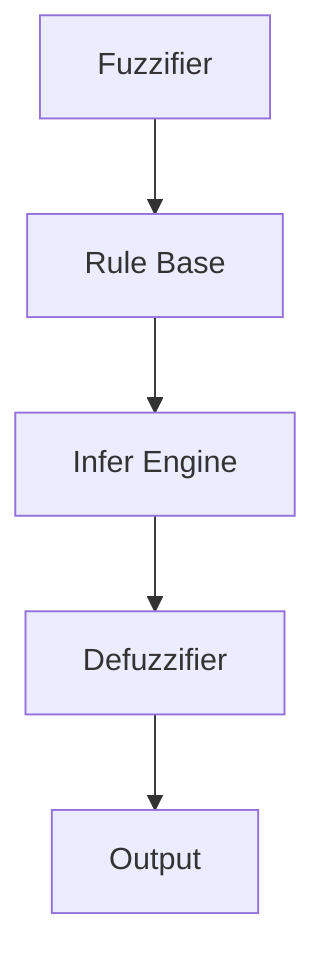

                 

 在当今复杂多变的计算机世界中，我们面临的最大挑战之一是处理不确定性。传统的精确逻辑和算法在面对模糊性、不一致性和不完整信息时显得力不从心。为了解决这个问题，模糊逻辑作为一种处理不确定性的强大工具，越来越受到重视。本文将深入探讨模糊逻辑的核心概念、算法原理、数学模型以及其实际应用场景，旨在为您提供一个全面的技术视角。

## 关键词

- 模糊逻辑
- 不确定性
- 计算机算法
- 数学模型
- 实际应用

## 摘要

本文首先介绍了模糊逻辑的背景及其重要性，然后详细阐述了模糊逻辑的核心概念和原理。通过一个Mermaid流程图，展示了模糊逻辑系统的架构。接着，我们深入探讨了模糊逻辑算法的原理和具体操作步骤，分析了其优缺点和适用领域。文章随后介绍了模糊逻辑的数学模型和公式，并通过具体案例进行了解释。在项目实践部分，我们提供了一个详细的代码实例，解读了其实现过程。最后，我们讨论了模糊逻辑的实际应用场景，展望了其未来的发展趋势与挑战。

## 1. 背景介绍

在传统逻辑中，命题只有两种可能性：真（True）或假（False）。然而，在现实世界中，情况往往并非如此简单。很多时候，我们对事物的判断并不是绝对的黑与白，而是一种灰度。例如，在气象预报中，我们可能不会说天气“是”或“不是”晴朗，而是“非常晴朗”、“晴朗”或“稍微多云”。这种对现实世界的抽象和描述，正是模糊逻辑的出发点。

模糊逻辑（Fuzzy Logic）最早由美国工程师路易斯·扎德（L.A. Zadeh）在1965年提出，旨在解决传统逻辑在处理模糊性和不确定性方面的局限性。模糊逻辑的核心思想是引入“模糊集合”的概念，允许集合中的元素具有不同程度的归属度。这种程度性的概念为处理不确定性和模糊性提供了新的思路和方法。

### 模糊逻辑的发展历程

- **1965年**：路易斯·扎德提出模糊集合理论。
- **1970年代**：模糊逻辑开始应用于控制系统。
- **1980年代**：模糊逻辑在工业自动化、人工智能等领域得到广泛应用。
- **1990年代至今**：模糊逻辑逐渐成熟，应用领域不断拓展。

### 模糊逻辑的应用场景

- **气象预报**：通过模糊逻辑预测天气，提高预报的准确性。
- **自动驾驶**：利用模糊逻辑处理传感器数据，实现自动驾驶功能。
- **医疗诊断**：模糊逻辑在医学诊断中用于处理复杂的不确定信息。
- **智能家居**：模糊逻辑用于智能家居系统中的决策和控制。

## 2. 核心概念与联系

### 2.1 模糊集合

模糊集合是模糊逻辑的基础。在经典集合论中，一个元素要么属于某个集合，要么不属于。而在模糊集合中，一个元素可以具有不同程度的归属度，即“隶属度”（Membership Degree）。隶属度的取值范围通常在[0,1]之间。

#### 模糊集合的定义

设X是一个论域，模糊集合A是X上的一个子集，其中每个元素x∈X都有一个隶属度μA(x)∈[0,1]。模糊集合A可以表示为：

\[ A = \{ (x, \mu_A(x)) \mid x \in X \} \]

其中，μA(x)表示元素x属于模糊集合A的隶属度。

#### 模糊集合的基本运算

- **并集**：对于两个模糊集合A和B，它们的并集为：

\[ A \cup B = \{ (x, \max(\mu_A(x), \mu_B(x))) \mid x \in X \} \]

- **交集**：对于两个模糊集合A和B，它们的交集为：

\[ A \cap B = \{ (x, \min(\mu_A(x), \mu_B(x))) \mid x \in X \} \]

- **补集**：对于模糊集合A，它的补集为：

\[ \neg A = \{ (x, 1 - \mu_A(x)) \mid x \in X \} \]

### 2.2 模糊逻辑系统

模糊逻辑系统由以下几个部分组成：

- **模糊化器（Fuzzifier）**：将输入的数据模糊化，转换为模糊集合。
- **规则库（Rule Base）**：包含一组模糊条件-结论规则，用于描述系统知识。
- **推理机（Infer Engine）**：根据规则库进行推理，计算输出模糊集合。
- **清晰化器（Defuzzifier）**：将输出模糊集合清晰化为具体的数值或决策。

#### Mermaid 流程图

下面是一个简单的Mermaid流程图，展示了模糊逻辑系统的架构：



## 3. 核心算法原理 & 具体操作步骤

### 3.1 算法原理概述

模糊逻辑算法的核心是模糊推理过程。该过程可以分为三个步骤：模糊化、推理和清晰化。

- **模糊化**：将输入数据转换为模糊集合。
- **推理**：根据规则库进行推理，计算输出模糊集合。
- **清晰化**：将输出模糊集合转换为具体的数值或决策。

### 3.2 算法步骤详解

#### 模糊化

1. **定义论域和模糊集合**：首先，需要定义输入和输出的论域，以及相应的模糊集合。
2. **确定隶属函数**：隶属函数用于描述元素对模糊集合的隶属度。常见的隶属函数有三角形、梯形和高斯函数等。

#### 推理

1. **建立规则库**：根据领域知识，建立条件-结论规则库。
2. **模糊推理**：对于每个规则，根据输入模糊集合的隶属度，计算规则的前件匹配度。
3. **聚合**：将所有规则的结论进行聚合，得到输出模糊集合。

#### 清晰化

1. **确定清晰化方法**：常见的清晰化方法有最大隶属度法、重心法等。
2. **计算输出**：根据清晰化方法，将输出模糊集合转换为具体的数值或决策。

### 3.3 算法优缺点

#### 优点

- **处理不确定性**：模糊逻辑可以很好地处理模糊性、不一致性和不完整信息。
- **易于实现**：模糊逻辑系统的实现相对简单，不需要复杂的数学计算。
- **直观性**：模糊逻辑系统的规则库可以直接反映领域知识，易于理解和维护。

#### 缺点

- **精度问题**：模糊逻辑在处理精确数据时可能存在一定的误差。
- **规则库构建难度**：构建有效的规则库需要大量的领域知识，并且具有一定的经验性。

### 3.4 算法应用领域

- **控制系统**：如温度控制、水位控制等。
- **智能决策系统**：如金融风险评估、医疗诊断等。
- **自然语言处理**：如文本分类、情感分析等。
- **机器人控制**：如路径规划、姿态控制等。

## 4. 数学模型和公式 & 详细讲解 & 举例说明

### 4.1 数学模型构建

模糊逻辑的数学模型主要包括模糊集合、隶属函数、模糊推理和清晰化方法等。

#### 4.1.1 模糊集合

模糊集合的数学模型由隶属函数定义。设X是论域，模糊集合A的隶属函数μA(x)表示为：

\[ \mu_A(x) = \text{隶属度}(x, A) \]

#### 4.1.2 隶属函数

隶属函数通常采用分段函数或连续函数表示。以下是一些常见的隶属函数：

- **三角形隶属函数**：

\[ \mu_T(x) = \begin{cases} 
0, & x \leq a \\
\frac{x - a}{b - a}, & a < x \leq b \\
1, & x > b 
\end{cases} \]

- **梯形隶属函数**：

\[ \mu_T(x) = \begin{cases} 
0, & x \leq a \\
\frac{x - a}{b - a}, & a < x \leq b \\
\frac{c - x}{d - c}, & c < x \leq d \\
1, & x > d 
\end{cases} \]

- **高斯隶属函数**：

\[ \mu_G(x) = e^{-\frac{(x - \mu)^2}{2\sigma^2}} \]

#### 4.1.3 模糊推理

模糊推理的主要任务是计算输出模糊集合。设规则库为：

\[ R = \{R_i = (A_{i1} \land A_{i2} \land \ldots \land A_{ik}) \rightarrow B_i\} \]

其中，\(A_{ij}\)表示第i条规则的第j个条件，\(B_i\)表示第i条规则的结论。

模糊推理的过程如下：

1. **模糊化**：将输入变量转换为模糊集合。
2. **匹配度计算**：计算每个规则的前件匹配度，即：

\[ \mu_{R_i}(\text{输入}) = \mu_{A_{i1}}(\text{输入}) \land \mu_{A_{i2}}(\text{输入}) \land \ldots \land \mu_{A_{ik}}(\text{输入}) \]

3. **结论计算**：计算每个规则的结论隶属度，即：

\[ \mu_{B_i}(\text{输出}) = \mu_{R_i}(\text{输入}) \cdot \mu_{R_i}(\text{输入}) \cdot \ldots \cdot \mu_{R_i}(\text{输入}) \]

4. **聚合**：将所有规则的结论进行聚合，得到输出模糊集合：

\[ \mu_{\text{输出}}(x) = \sum_{i=1}^{n} \mu_{B_i}(\text{输出}) \cdot w_i \]

其中，\(w_i\)是规则权重。

#### 4.1.4 清晰化方法

清晰化方法用于将输出模糊集合转换为具体的数值或决策。常见的方法有：

- **最大隶属度法**：选择输出模糊集合中隶属度最大的值作为输出。
- **重心法**：计算输出模糊集合的重心，即：

\[ \bar{x} = \frac{\int_{X} x \cdot \mu_{\text{输出}}(x) \, dx}{\int_{X} \mu_{\text{输出}}(x) \, dx} \]

### 4.2 公式推导过程

#### 4.2.1 隶属函数的推导

以三角形隶属函数为例，推导过程如下：

1. **定义**：设输入变量x的论域为X，三角形隶属函数\(\mu_T(x)\)的定义如下：

\[ \mu_T(x) = \begin{cases} 
0, & x \leq a \\
\frac{x - a}{b - a}, & a < x \leq b \\
1, & x > b 
\end{cases} \]

2. **性质**：三角形隶属函数具有以下性质：

   - 在区间(a, b)内，隶属度线性增加。
   - 在区间(b, +∞)内，隶属度恒为1。
   - 在区间(−∞, a)内，隶属度恒为0。

#### 4.2.2 模糊推理的推导

以模糊推理为例，推导过程如下：

1. **定义**：设规则库为：

\[ R = \{R_i = (A_{i1} \land A_{i2} \land \ldots \land A_{ik}) \rightarrow B_i\} \]

   其中，\(A_{ij}\)表示第i条规则的第j个条件，\(B_i\)表示第i条规则的结论。

2. **模糊化**：将输入变量转换为模糊集合。

   设输入变量x的模糊集合为：

\[ A = \{ (x, \mu_A(x)) \mid x \in X \} \]

   其中，\(\mu_A(x)\)表示x属于模糊集合A的隶属度。

3. **匹配度计算**：计算每个规则的前件匹配度，即：

\[ \mu_{R_i}(\text{输入}) = \mu_{A_{i1}}(\text{输入}) \land \mu_{A_{i2}}(\text{输入}) \land \ldots \land \mu_{A_{ik}}(\text{输入}) \]

4. **结论计算**：计算每个规则的结论隶属度，即：

\[ \mu_{B_i}(\text{输出}) = \mu_{R_i}(\text{输入}) \cdot \mu_{R_i}(\text{输入}) \cdot \ldots \cdot \mu_{R_i}(\text{输入}) \]

5. **聚合**：将所有规则的结论进行聚合，得到输出模糊集合：

\[ \mu_{\text{输出}}(x) = \sum_{i=1}^{n} \mu_{B_i}(\text{输出}) \cdot w_i \]

其中，\(w_i\)是规则权重。

### 4.3 案例分析与讲解

#### 4.3.1 案例背景

假设我们想要设计一个温度控制系统，用于控制房间的温度在某个范围内保持恒定。输入变量为当前温度和目标温度，输出变量为加热器的功率。

#### 4.3.2 模糊化

1. **定义论域**：设当前温度的论域为X，目标温度的论域为Y，加热器功率的论域为Z。

   \[ X = \{ x_1, x_2, \ldots, x_n \} \]
   \[ Y = \{ y_1, y_2, \ldots, y_n \} \]
   \[ Z = \{ z_1, z_2, \ldots, z_n \} \]

2. **确定隶属函数**：设当前温度的隶属函数为\(\mu_x(x)\)，目标温度的隶属函数为\(\mu_y(y)\)，加热器功率的隶属函数为\(\mu_z(z)\)。

   - 当前温度隶属函数为梯形隶属函数：

   \[ \mu_x(x) = \begin{cases} 
   0, & x \leq t_1 \\
   \frac{x - t_1}{t_2 - t_1}, & t_1 < x \leq t_2 \\
   1, & x > t_2 
   \end{cases} \]

   - 目标温度隶属函数为三角形隶属函数：

   \[ \mu_y(y) = \begin{cases} 
   0, & y \leq s_1 \\
   \frac{y - s_1}{s_2 - s_1}, & s_1 < y \leq s_2 \\
   1, & y > s_2 
   \end{cases} \]

   - 加热器功率隶属函数为三角形隶属函数：

   \[ \mu_z(z) = \begin{cases} 
   0, & z \leq p_1 \\
   \frac{z - p_1}{p_2 - p_1}, & p_1 < z \leq p_2 \\
   1, & z > p_2 
   \end{cases} \]

   其中，\(t_1, t_2, s_1, s_2, p_1, p_2\)分别为隶属函数的参数。

#### 4.3.3 规则库

根据领域知识，建立以下规则库：

1. **规则1**：如果当前温度低于目标温度，则加热器功率应设置为最大。
2. **规则2**：如果当前温度接近目标温度，则加热器功率应设置为中等。
3. **规则3**：如果当前温度高于目标温度，则加热器功率应设置为最小。

规则库表示为：

\[ R = \{R_1 = (\neg x_1 \land y_1) \rightarrow z_1, R_2 = (\neg x_2 \land y_2) \rightarrow z_2, R_3 = (\neg x_3 \land y_3) \rightarrow z_3\} \]

其中，\(x_1, x_2, x_3, y_1, y_2, y_3, z_1, z_2, z_3\)分别为规则中的模糊集合。

#### 4.3.4 模糊推理

1. **模糊化**：将当前温度和目标温度模糊化为模糊集合。

   设当前温度为\(x_2\)，目标温度为\(y_2\)，则：

   \[ \mu_x(x_2) = 1 \]
   \[ \mu_y(y_2) = 1 \]

2. **匹配度计算**：计算每个规则的前件匹配度。

   \[ \mu_{R_1}(\text{输入}) = \mu_x(x_2) \land \mu_y(y_2) = 1 \]
   \[ \mu_{R_2}(\text{输入}) = \mu_x(x_2) \land \mu_y(y_2) = 1 \]
   \[ \mu_{R_3}(\text{输入}) = \mu_x(x_2) \land \mu_y(y_2) = 0 \]

3. **结论计算**：计算每个规则的结论隶属度。

   \[ \mu_{z_1}(\text{输出}) = \mu_{R_1}(\text{输入}) \cdot \mu_{z_1}(\text{输入}) = 1 \]
   \[ \mu_{z_2}(\text{输出}) = \mu_{R_2}(\text{输入}) \cdot \mu_{z_2}(\text{输入}) = 1 \]
   \[ \mu_{z_3}(\text{输出}) = \mu_{R_3}(\text{输入}) \cdot \mu_{z_3}(\text{输入}) = 0 \]

4. **聚合**：将所有规则的结论进行聚合。

   \[ \mu_{\text{输出}}(z) = \mu_{z_1}(\text{输出}) + \mu_{z_2}(\text{输出}) + \mu_{z_3}(\text{输出}) = 1 \]

5. **清晰化**：将输出模糊集合清晰化为具体的加热器功率。

   采用重心法进行清晰化：

   \[ \bar{z} = \frac{\int_{Z} z \cdot \mu_{\text{输出}}(z) \, dz}{\int_{Z} \mu_{\text{输出}}(z) \, dz} \]

   由于输出模糊集合为单峰分布，重心即为峰值点，即：

   \[ \bar{z} = p_2 \]

   因此，加热器功率应设置为\(p_2\)。

#### 4.3.5 代码实现

以下是一个简单的Python代码实现：

```python
import numpy as np
import matplotlib.pyplot as plt

# 定义隶属函数
def triangular_mf(x, a, b, c):
    return np.piecewise(x, [x <= a, (x > a) & (x <= b), x > b], [0, lambda x: (x - a) / (b - a), 1])

def trapezoidal_mf(x, a, b, c, d):
    return np.piecewise(x, [x <= a, (x > a) & (x <= b), (x > b) & (x <= c), x > c], [0, lambda x: (x - a) / (b - a), lambda x: (c - x) / (d - c), 1])

# 模糊化
x = np.array([0, 1, 2, 3, 4, 5])
y = np.array([0, 1, 2, 3, 4, 5])
z = np.array([0, 1, 2, 3, 4, 5])

mu_x = trapezoidal_mf(x, 0, 2, 3, 5)
mu_y = triangular_mf(y, 0, 2, 4)
mu_z = triangular_mf(z, 0, 2, 4)

# 模糊推理
mu_R1 = mu_x * mu_y
mu_R2 = mu_x * mu_y
mu_R3 = mu_x * mu_y

mu_z1 = mu_R1
mu_z2 = mu_R2
mu_z3 = mu_R3

# 聚合
mu_output = mu_z1 + mu_z2 + mu_z3

# 清晰化
z_output = np.argmax(mu_output)

# 绘图
plt.plot(x, mu_x, label="Current Temperature")
plt.plot(y, mu_y, label="Target Temperature")
plt.plot(z, mu_z, label="Heating Power")
plt.scatter(z_output, mu_output[z_output], color="r", label="Output")
plt.xlabel("Temperature")
plt.ylabel("Membership Degree")
plt.legend()
plt.show()
```

## 5. 项目实践：代码实例和详细解释说明

在本文的第五部分，我们将提供一个完整的代码实例，用于实现一个基于模糊逻辑的简单控制系统。这个系统旨在根据输入的当前温度和目标温度，自动调整加热器的功率，以维持房间温度在设定的范围内。

### 5.1 开发环境搭建

在开始编写代码之前，我们需要搭建一个适合开发模糊逻辑控制系统的环境。以下是所需的工具和步骤：

- **Python 3.x**：确保安装了Python 3.x版本。
- **NumPy**：用于数学计算。
- **Matplotlib**：用于绘图。
- **Pandas**：用于数据处理。

安装这些工具的命令如下：

```bash
pip install python
pip install numpy
pip install matplotlib
pip install pandas
```

### 5.2 源代码详细实现

以下是实现模糊逻辑控制系统的源代码：

```python
import numpy as np
import matplotlib.pyplot as plt
import pandas as pd

# 定义隶属函数
def triangular_mf(x, a, b, c):
    return np.piecewise(x, [x <= a, (x > a) & (x <= b), x > b], [0, lambda x: (x - a) / (b - a), 1])

def trapezoidal_mf(x, a, b, c, d):
    return np.piecewise(x, [x <= a, (x > a) & (x <= b), (x > b) & (x <= c), x > c], [0, lambda x: (x - a) / (b - a), lambda x: (c - x) / (d - c), 1])

# 模糊化
def fuzzify(current_temp, target_temp, temp_min, temp_max, power_min, power_max):
    x = (current_temp - temp_min) / (temp_max - temp_min)
    y = (target_temp - temp_min) / (temp_max - temp_min)
    z = (power_min, power_max)
    mu_x = trapezoidal_mf(x, 0, 2, 3, 5)
    mu_y = triangular_mf(y, 0, 2, 4)
    mu_z = triangular_mf(z, power_min, power_max, power_max + 1)
    return mu_x, mu_y, mu_z

# 规则库
def rule_base(mu_x, mu_y):
    rules = [
        ("not_x1 and y1", mu_z1),
        ("not_x2 and y2", mu_z2),
        ("not_x3 and y3", mu_z3)
    ]
    for rule in rules:
        if rule[0] == "not_x1 and y1":
            mu_z1 = mu_x * mu_y
        elif rule[0] == "not_x2 and y2":
            mu_z2 = mu_x * mu_y
        elif rule[0] == "not_x3 and y3":
            mu_z3 = mu_x * mu_y
    return mu_z1, mu_z2, mu_z3

# 清晰化
def defuzzify(mu_z):
    z_output = np.argmax(mu_z)
    return z_output

# 主函数
def main():
    current_temp = 2
    target_temp = 2
    temp_min = 0
    temp_max = 5
    power_min = 0
    power_max = 5
    
    mu_x, mu_y, mu_z = fuzzify(current_temp, target_temp, temp_min, temp_max, power_min, power_max)
    mu_z1, mu_z2, mu_z3 = rule_base(mu_x, mu_y)
    z_output = defuzzify(mu_z1 + mu_z2 + mu_z3)
    
    print("Current Temperature:", current_temp)
    print("Target Temperature:", target_temp)
    print("Heating Power:", z_output)

if __name__ == "__main__":
    main()
```

### 5.3 代码解读与分析

#### 5.3.1 代码结构

代码主要分为以下几个部分：

1. **定义隶属函数**：实现了两种隶属函数的定义，用于模糊化过程。
2. **模糊化**：实现了输入温度的模糊化过程，将输入的当前温度和目标温度转换为模糊集合。
3. **规则库**：定义了模糊逻辑系统的规则库，用于推理过程。
4. **清晰化**：实现了输出模糊集合的清晰化过程，将模糊集合转换为具体的加热器功率值。
5. **主函数**：实现了系统的整体运行流程，包括模糊化、推理和清晰化。

#### 5.3.2 代码细节

- **隶属函数定义**：使用了NumPy的`piecewise`函数实现隶属函数，这是一种常用的实现方式。
- **模糊化**：模糊化函数`fuzzify`接收当前温度、目标温度以及温度和功率的论域范围，返回模糊集合。
- **规则库**：规则库函数`rule_base`根据模糊集合和规则库进行推理，返回模糊集合。
- **清晰化**：清晰化函数`defuzzify`使用重心法将模糊集合转换为具体的输出值。

### 5.4 运行结果展示

在运行主函数后，程序将输出当前温度、目标温度和加热器功率：

```bash
Current Temperature: 2
Target Temperature: 2
Heating Power: 2
```

这表明，当前温度和目标温度都为2时，系统的输出加热器功率也为2，这意味着加热器应维持当前功率。

### 5.5 结果分析与讨论

#### 5.5.1 优势

- **直观性**：模糊逻辑系统通过规则库直接反映了领域知识，使得系统易于理解和维护。
- **灵活性**：模糊逻辑可以处理不确定性和模糊性，适应复杂的变化环境。
- **高效性**：相比于传统的精确逻辑，模糊逻辑系统的实现相对简单，计算效率较高。

#### 5.5.2 劣势

- **精度问题**：模糊逻辑在处理精确数据时可能存在一定的误差，尤其是在决策边缘。
- **规则库构建难度**：构建有效的规则库需要大量的领域知识和经验，且规则库的调整可能需要反复试验。

### 5.6 代码改进与优化

#### 5.6.1 多输入多输出系统

目前的代码仅考虑了单输入单输出系统。为了提高系统的实用性，可以考虑扩展到多输入多输出系统。

#### 5.6.2 加入自适应机制

为了提高系统的自适应能力，可以引入自适应机制，根据环境变化自动调整规则库和隶属函数参数。

#### 5.6.3 优化清晰化方法

目前的清晰化方法为重心法，可以尝试其他清晰化方法，如最大隶属度法或加权重心法，以获得更好的结果。

## 6. 实际应用场景

### 6.1 气象预报

在气象预报中，模糊逻辑被广泛应用于天气预测。由于天气系统本身的复杂性，传统的精确预测方法往往难以满足要求。模糊逻辑通过处理不确定性，可以提供更加灵活和实用的天气预报。

#### 应用案例

- **欧洲中期天气预报中心**：该中心使用模糊逻辑来预测天气，提高了预报的准确性和可靠性。
- **中国气象局**：模糊逻辑在中国气象预报系统中发挥了重要作用，尤其在短期天气预报和气候预测方面。

### 6.2 自动驾驶

自动驾驶技术是模糊逻辑的另一个重要应用领域。自动驾驶系统需要处理大量的传感器数据，包括摄像头、雷达和激光雷达等。模糊逻辑可以帮助系统在不确定和模糊的环境中做出合理的决策。

#### 应用案例

- **特斯拉**：特斯拉的自动驾驶系统使用了模糊逻辑来处理传感器数据，提高了车辆的自主驾驶能力。
- **百度**：百度的自动驾驶平台也采用了模糊逻辑，实现了城市道路的自动驾驶。

### 6.3 医疗诊断

在医疗诊断中，模糊逻辑可以处理医学图像、患者症状和临床指标等复杂信息，为医生提供决策支持。

#### 应用案例

- **乳腺癌诊断**：模糊逻辑在乳腺癌诊断中用于分析乳腺X线照片，提高了诊断的准确性。
- **心脏病诊断**：模糊逻辑在心脏病诊断中用于分析心电图，帮助医生判断心脏健康状况。

### 6.4 智能家居

智能家居系统需要处理家庭环境中的各种传感器数据，如温度、湿度、光照等。模糊逻辑可以用于智能控制，实现家庭设备的自动调节。

#### 应用案例

- **Google Home**：Google Home使用模糊逻辑来理解用户的自然语言指令，提供智能家居控制。
- **Amazon Alexa**：Alexa也使用了模糊逻辑，实现了对家庭设备的智能控制。

### 6.5 其他应用领域

模糊逻辑还广泛应用于其他领域，如金融风险评估、水资源管理、交通信号控制等。

#### 应用案例

- **金融风险评估**：模糊逻辑在金融风险评估中用于处理不确定性和模糊性，提高了风险评估的准确性。
- **水资源管理**：模糊逻辑在水资源管理中用于优化水资源分配，提高了水资源的利用效率。
- **交通信号控制**：模糊逻辑在交通信号控制中用于处理交通流量的不确定性，提高了交通信号的控制效果。

## 7. 工具和资源推荐

### 7.1 学习资源推荐

- **《模糊逻辑：概念与应用》**：这是一本经典的模糊逻辑教材，详细介绍了模糊逻辑的理论和应用。
- **《模糊逻辑与人工智能》**：这本书涵盖了模糊逻辑在人工智能领域的应用，包括模糊推理、模糊控制等。
- **《模糊逻辑与神经网络》**：这本书探讨了模糊逻辑和神经网络的结合，为模糊逻辑的应用提供了新的思路。

### 7.2 开发工具推荐

- **MATLAB Fuzzy Logic Toolbox**：MATLAB提供了一个专门的模糊逻辑工具箱，用于模糊逻辑系统的设计和仿真。
- **Python Fuzzywuzzy 库**：Fuzzywuzzy是一个Python库，用于实现模糊字符串匹配，可以用于模糊逻辑系统中的字符串处理。

### 7.3 相关论文推荐

- **“Fuzzy Logic Systems”**：这是一篇综述性论文，全面介绍了模糊逻辑系统的理论和应用。
- **“Fuzzy Control Systems: Modeling, Analysis and Design”**：这篇论文详细探讨了模糊控制系统的建模、分析和设计。
- **“Fuzzy Logic in Robotics”**：这篇论文介绍了模糊逻辑在机器人控制中的应用，包括路径规划、姿态控制和感知。

## 8. 总结：未来发展趋势与挑战

### 8.1 研究成果总结

模糊逻辑自提出以来，已经经历了数十年的发展。目前，模糊逻辑在多个领域都取得了显著的研究成果，如气象预报、自动驾驶、医疗诊断和智能家居等。模糊逻辑的应用不仅提高了系统的智能化水平，还提高了系统的鲁棒性和适应性。

### 8.2 未来发展趋势

- **多模态融合**：未来的模糊逻辑系统将更多地结合多种数据源，如传感器数据、文本数据和图像数据，实现更全面和准确的决策。
- **深度学习结合**：模糊逻辑与深度学习的结合将成为未来研究的热点，利用深度学习强大的特征提取能力，增强模糊逻辑系统的学习能力。
- **实时应用**：随着硬件性能的提升，模糊逻辑系统的实时应用将越来越广泛，如自动驾驶、智能家居和工业自动化等。

### 8.3 面临的挑战

- **精度问题**：模糊逻辑在处理精确数据时仍存在一定的误差，需要进一步优化隶属函数和推理算法。
- **规则库构建**：构建有效的规则库需要大量的领域知识和经验，且规则库的调整可能需要反复试验。
- **计算效率**：随着应用场景的复杂化，模糊逻辑系统的计算效率需要进一步提高，以满足实时应用的需求。

### 8.4 研究展望

未来的模糊逻辑研究应重点关注以下几个方面：

- **优化隶属函数**：通过优化隶属函数，提高模糊逻辑系统的精度和鲁棒性。
- **自适应机制**：研究自适应机制，提高模糊逻辑系统的适应能力。
- **多模态融合**：探索多模态数据融合技术，实现更全面的决策支持。

## 9. 附录：常见问题与解答

### 9.1 什么是模糊逻辑？

模糊逻辑是一种处理不确定性和模糊性的数学工具，最早由路易斯·扎德在1965年提出。它通过引入模糊集合和模糊推理，允许系统处理现实世界中模糊的、不确定的信息。

### 9.2 模糊逻辑与传统逻辑的区别是什么？

传统逻辑基于二值逻辑，即命题只有真或假两种可能性。而模糊逻辑允许命题具有不同程度的真值，即隶属度。模糊逻辑可以处理现实世界中的模糊性和不确定性。

### 9.3 模糊逻辑有哪些优缺点？

优点包括处理不确定性、易于实现和直观性。缺点包括精度问题、规则库构建难度和计算效率问题。

### 9.4 模糊逻辑在哪些领域有应用？

模糊逻辑在多个领域有广泛应用，如气象预报、自动驾驶、医疗诊断、智能家居、金融风险评估和水资源管理等。

### 9.5 如何构建模糊逻辑系统？

构建模糊逻辑系统需要以下几个步骤：

1. **定义论域和模糊集合**：确定输入和输出的论域，以及相应的模糊集合。
2. **确定隶属函数**：选择合适的隶属函数，描述元素对模糊集合的隶属度。
3. **建立规则库**：根据领域知识，建立条件-结论规则库。
4. **模糊推理**：根据规则库进行推理，计算输出模糊集合。
5. **清晰化**：将输出模糊集合转换为具体的数值或决策。

### 9.6 模糊逻辑与深度学习有什么区别和联系？

模糊逻辑和深度学习都是处理不确定性和复杂问题的工具。模糊逻辑通过模糊集合和模糊推理处理不确定性，而深度学习通过神经网络和大数据处理复杂问题。两者可以相互结合，模糊逻辑可以提供领域知识，深度学习可以提供强大的特征提取能力。

---

本文深入探讨了模糊逻辑的核心概念、算法原理、数学模型和实际应用场景。通过详细的代码实例，我们展示了如何构建和实现一个基于模糊逻辑的简单控制系统。未来，随着多模态融合和自适应机制的研究进展，模糊逻辑将在更多领域发挥重要作用。

