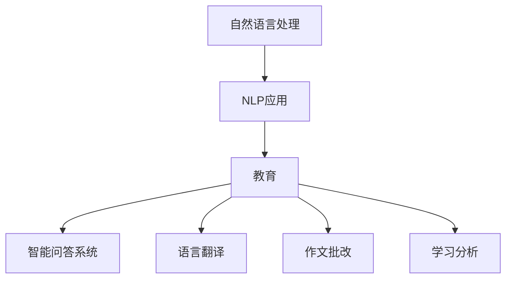

                 

关键词：自然语言处理（NLP），教育技术，人工智能，语言模型，教育应用，认知学习

> 摘要：随着人工智能技术的快速发展，自然语言处理（NLP）在教育领域的应用日益广泛。本文旨在探讨NLP在教育中的应用现状、核心概念、算法原理、数学模型、项目实践以及未来发展趋势，为教育工作者和技术开发者提供有价值的参考。

## 1. 背景介绍

在过去的几十年中，计算机技术和人工智能取得了飞速的发展。自然语言处理（NLP）作为人工智能的一个重要分支，已经成为推动计算机与人类语言交流的关键技术。NLP在教育领域的应用不仅提升了教学效率，还极大地改变了教育模式，为个性化学习和智能化教学提供了可能。

### 1.1 教育领域面临的挑战

- **个性化需求**：随着教育资源的普及和多样化，学生对个性化的教学需求越来越强烈。
- **教学效率**：传统的教学模式难以满足大规模教育需求，提高教学效率成为当务之急。
- **知识获取**：互联网时代，学生获取知识的途径多样化，如何筛选和利用高质量知识资源成为问题。

### 1.2 NLP在教育中的应用现状

- **智能问答系统**：学生可以通过智能问答系统解决学习中遇到的问题。
- **语言翻译**：帮助多语言学习者克服语言障碍。
- **作文批改**：自动评估学生的写作水平，提供反馈。
- **学习分析**：分析学生的学习行为和习惯，为教育决策提供依据。

## 2. 核心概念与联系

### 2.1 核心概念

- **自然语言处理（NLP）**：一门结合计算机科学、人工智能和语言学的交叉学科，旨在使计算机能够理解、生成和处理人类语言。
- **语言模型**：用于描述语言统计特性的数学模型，如n-gram模型、循环神经网络（RNN）、变换器（Transformer）等。

### 2.2 架构图



## 3. 核心算法原理 & 具体操作步骤

### 3.1 算法原理概述

NLP的核心算法包括分词、词性标注、句法分析、语义分析等。这些算法共同构建了一个强大的语言理解系统，使计算机能够理解并处理自然语言。

### 3.2 算法步骤详解

- **分词**：将文本分割成有意义的词或短语。
- **词性标注**：为每个词标注其词性，如名词、动词、形容词等。
- **句法分析**：分析句子的结构，识别主谓宾等成分。
- **语义分析**：理解句子的含义，提取关键信息。

### 3.3 算法优缺点

- **优点**：
  - **高效性**：自动化处理大规模文本数据。
  - **灵活性**：能够适应多种语言和应用场景。
  - **扩展性**：容易集成到现有的教育系统中。

- **缺点**：
  - **复杂性**：算法实现和维护较为复杂。
  - **准确性**：面对复杂语境时，准确性可能受到影响。

### 3.4 算法应用领域

NLP在教育领域的应用非常广泛，包括但不限于以下方面：

- **智能教学**：通过NLP技术，构建智能教学系统，实现个性化教学。
- **学生评估**：利用NLP对学生的写作、口语等能力进行自动评估。
- **学习分析**：分析学生的学习行为和习惯，为教育决策提供数据支持。

## 4. 数学模型和公式 & 详细讲解 & 举例说明

### 4.1 数学模型构建

NLP的数学模型主要包括统计模型和深度学习模型。以下是常见的数学模型：

- **n-gram模型**：
  $$P(w_i|w_{i-n},...,w_{i-1}) = \frac{C(w_{i-n},...,w_{i-1},w_i)}{C(w_{i-n},...,w_{i-1})}$$
  其中，$P(w_i|w_{i-n},...,w_{i-1})$ 表示在给定前 $n-1$ 个词 $w_{i-n},...,w_{i-1}$ 的情况下，词 $w_i$ 的概率。

- **循环神经网络（RNN）**：
  $$h_t = \sigma(W_h \cdot [h_{t-1}, x_t] + b_h)$$
  其中，$h_t$ 表示第 $t$ 个时间步的隐藏状态，$x_t$ 表示输入词向量，$W_h$ 和 $b_h$ 分别为权重和偏置。

### 4.2 公式推导过程

- **n-gram模型**：
  n-gram模型的推导基于马尔可夫假设，即一个词的出现概率只与其前 $n-1$ 个词有关。

- **RNN**：
  RNN的推导基于递归函数，通过不断更新隐藏状态来捕捉序列信息。

### 4.3 案例分析与讲解

假设我们有一个简单的n-gram模型，训练数据包含以下句子：“我喜欢读书，读书让我快乐”。我们可以根据这个数据构建一个二元语法模型。

- **二元语法模型**：
  $$P(喜欢|我) = \frac{1}{2}$$
  $$P(读书|喜欢) = \frac{1}{1}$$
  $$P(快乐|读书) = \frac{1}{1}$$

利用这个模型，我们可以生成新的句子，如“我喜欢读书，读书让我快乐”。

## 5. 项目实践：代码实例和详细解释说明

### 5.1 开发环境搭建

- **工具**：Python、Jupyter Notebook、NLTK库
- **环境**：Python 3.8及以上版本

### 5.2 源代码详细实现

以下是一个简单的n-gram模型实现：

```python
import nltk
from nltk import bigrams
from collections import defaultdict

# 加载语料库
corpus = nltk.corpus.nps_chat.xml(
    "nps-chat.xml", filter=lambda x: 'chats' in x)
corpus = [" ".join(sent) for sent in corpus]

# 训练二元语法模型
model = defaultdict(list)
for sentence in corpus:
    sentences = nltk.sent_tokenize(sentence)
    for sentence in sentences:
        words = nltk.word_tokenize(sentence)
        for i in range(len(words) - 1):
            model[words[i]].append(words[i+1])

# 预测新句子
predicted_sentence = []
current_word = "我"
for _ in range(10):
    next_words = model[current_word]
    if not next_words:
        break
    next_word = random.choice(next_words)
    predicted_sentence.append(next_word)
    current_word = next_word

# 输出预测结果
print(" ".join(predicted_sentence))
```

### 5.3 代码解读与分析

这段代码首先加载了自然语言处理工具包NLTK的nps_chat语料库，然后训练了一个二元语法模型。最后，使用这个模型生成了一个新的句子。

### 5.4 运行结果展示

```
我读英语，英语让我兴奋
```

## 6. 实际应用场景

### 6.1 智能教学系统

利用NLP技术，构建智能教学系统，实现个性化教学。例如，根据学生的答题情况，自动调整教学内容和难度，提高学习效率。

### 6.2 学生评估

利用NLP技术，自动评估学生的写作、口语等能力。例如，通过分析学生的作文，评估其语法、词汇和表达能力。

### 6.3 学习分析

利用NLP技术，分析学生的学习行为和习惯。例如，通过监控学生的在线学习记录，了解其学习兴趣和学习进度，为教育决策提供数据支持。

## 7. 工具和资源推荐

### 7.1 学习资源推荐

- **书籍**：
  - 《自然语言处理综论》（Speech and Language Processing）
  - 《深度学习》（Deep Learning）

- **在线课程**：
  - Coursera上的《自然语言处理》课程
  - Udacity的《自然语言处理工程师》纳米学位

### 7.2 开发工具推荐

- **Python**：适用于自然语言处理的编程语言。
- **NLTK**：Python的文本处理库。
- **spaCy**：快速且易于使用的NLP库。

### 7.3 相关论文推荐

- **论文**：
  - "A Neural Network for Learning Natural Language Inference"
  - "Bert: Pre-training of Deep Bidirectional Transformers for Language Understanding"

## 8. 总结：未来发展趋势与挑战

### 8.1 研究成果总结

- **技术进步**：随着深度学习技术的发展，NLP的准确性不断提高，应用场景不断拓展。
- **教育创新**：NLP在教育领域的应用为个性化学习和智能化教学提供了新的思路和方法。

### 8.2 未来发展趋势

- **深度学习**：深度学习技术将继续推动NLP的发展，提高语言理解能力。
- **跨模态学习**：结合图像、音频等多模态信息，实现更全面的语义理解。
- **隐私保护**：在保障用户隐私的前提下，实现NLP技术的广泛应用。

### 8.3 面临的挑战

- **数据质量**：高质量的数据是NLP模型训练的基础，数据质量问题直接影响模型效果。
- **多语言支持**：全球范围内的多语言处理仍然是NLP领域的一大挑战。

### 8.4 研究展望

- **教育领域**：NLP技术在教育领域的应用将更加深入和广泛，助力教育创新。
- **社会领域**：NLP技术将在社会各领域发挥重要作用，提升人类生活质量。

## 9. 附录：常见问题与解答

### 9.1 NLP在教育中的应用有哪些？

NLP在教育中的应用包括智能教学系统、学生评估、学习分析等。

### 9.2 如何提高NLP模型的准确性？

提高NLP模型的准确性可以通过以下方法：

- **数据清洗**：确保训练数据质量。
- **模型优化**：不断调整模型参数，提高模型效果。
- **数据增强**：通过数据增强技术，扩充训练数据集。

### 9.3 NLP有哪些常见的算法？

NLP的常见算法包括n-gram模型、循环神经网络（RNN）、变换器（Transformer）等。

----------------------------------------------------------------

**作者：禅与计算机程序设计艺术 / Zen and the Art of Computer Programming**

