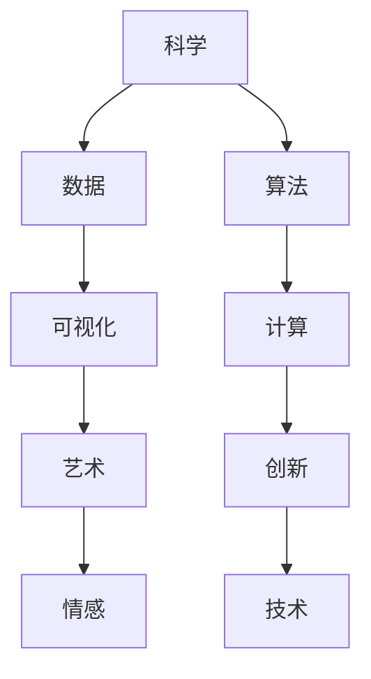
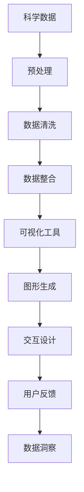

                 

在这个信息爆炸的时代，知识的获取和整理变得比以往任何时候都更为重要。科学，作为我们理解世界的工具，与艺术，作为人类情感的载体，在现代社会中相互交融，创造出一种全新的知识美学。本文将探讨这种交融的背景、核心概念、算法原理、数学模型、项目实践以及未来应用的展望，旨在为大家提供一幅科学与艺术交融的清晰图景。

## 文章关键词

- 科学与艺术的交融
- 知识美学
- 数据可视化
- 数学模型
- 计算机算法
- 项目实践

## 文章摘要

本文将从多个角度探讨科学和艺术之间的交汇，通过介绍知识美学的概念，分析科学领域的核心算法和数学模型，并结合实际项目实践，展示科学与艺术如何通过技术手段相互影响和促进。最后，文章将对未来科学和艺术的发展趋势进行展望，并提出面临的挑战和可能的研究方向。

## 1. 背景介绍

科学和艺术是人类文明的两大支柱，它们分别以理性和感性为出发点，探索世界的本质和人类的精神世界。然而，在过去的几个世纪里，科学和艺术之间的界限逐渐变得模糊。现代科技的快速发展，特别是计算机科学和信息技术的崛起，为两者之间的交融提供了新的平台和机会。

科学领域中的数据可视化技术，如图形、图像、动画等，不仅能够直观地展示复杂的科学数据，还能够创造出独特的艺术效果。而艺术创作中的数字艺术和虚拟现实技术，则利用科学的计算和算法，创造出前所未有的艺术形式。

这种交融不仅在学术研究中具有重要价值，也在商业和社会生活中得到广泛应用。例如，在金融、医疗、设计等领域，科学和艺术的结合不仅提高了工作效率，还丰富了人们的生活体验。

## 2. 核心概念与联系

### 2.1 科学与艺术的交融

科学与艺术的交融是一个多维度的过程，它不仅涉及到技术和工具，还包括思维方式和价值观的融合。以下是一个简化的Mermaid流程图，描述了这种交融的核心概念和联系：



### 2.2 数据可视化与科学表达

数据可视化是科学与艺术交融的重要领域之一。它利用图形、图像、动画等视觉元素，将科学数据以直观的方式呈现出来，使得复杂的信息更容易理解和吸收。以下是一个Mermaid流程图，展示了数据可视化在科学研究中的应用：



## 3. 核心算法原理 & 具体操作步骤

### 3.1 算法原理概述

在科学与艺术的交融中，核心算法扮演着关键角色。这些算法不仅用于数据的处理和分析，还用于创造艺术作品。以下是一个简化的算法原理概述：

1. **数据分析算法**：如聚类分析、回归分析、关联规则等，用于从数据中提取有意义的模式和关系。
2. **生成对抗网络（GAN）**：用于生成与真实数据分布相似的图像和声音。
3. **深度学习算法**：如卷积神经网络（CNN）、循环神经网络（RNN）等，用于自动特征提取和模式识别。

### 3.2 算法步骤详解

以卷积神经网络（CNN）为例，其基本步骤如下：

1. **数据预处理**：对输入数据进行标准化处理，使其适合模型训练。
2. **卷积层**：应用卷积操作提取图像的局部特征。
3. **池化层**：通过下采样操作减少数据维度，提高计算效率。
4. **激活函数**：用于引入非线性特性，使模型能够学习复杂的数据分布。
5. **全连接层**：将卷积层和池化层提取的特征进行聚合，输出最终的分类结果。

### 3.3 算法优缺点

CNN的优点包括：

- **强大的特征提取能力**：能够自动提取图像中的局部特征。
- **良好的泛化能力**：适用于各种图像分类任务。

缺点包括：

- **计算资源消耗大**：训练过程中需要大量的计算资源。
- **对数据依赖性强**：需要大量的标注数据进行训练。

### 3.4 算法应用领域

CNN在图像处理领域有着广泛的应用，如：

- **图像分类**：用于对图像进行自动分类，如识别手写数字、动物等。
- **目标检测**：用于检测图像中的目标对象，如人脸识别、车辆检测等。
- **图像分割**：用于将图像分割成不同的区域，如医学图像分析、自动驾驶等。

## 4. 数学模型和公式 & 详细讲解 & 举例说明

### 4.1 数学模型构建

在科学与艺术的交融中，数学模型起到了至关重要的作用。以下是一个简单的数学模型构建过程：

1. **问题定义**：明确需要解决的问题和目标。
2. **变量定义**：定义模型中的变量和参数。
3. **方程建立**：根据问题定义和变量定义，建立相应的数学方程。
4. **求解方法**：选择合适的求解方法，如优化算法、迭代法等。

### 4.2 公式推导过程

以线性回归模型为例，其公式推导过程如下：

1. **目标函数**：定义损失函数，如均方误差（MSE）。
   $$J(\theta) = \frac{1}{2m} \sum_{i=1}^{m} (h_\theta(x^{(i)}) - y^{(i)})^2$$
2. **梯度下降**：定义梯度下降更新公式。
   $$\theta_j := \theta_j - \alpha \frac{\partial J(\theta)}{\partial \theta_j}$$
3. **迭代过程**：不断迭代更新参数，直至达到收敛条件。

### 4.3 案例分析与讲解

以下是一个简单的线性回归案例：

- **数据集**：包含10个样本，每个样本由两个特征和目标值组成。
- **目标**：预测目标值的线性模型。

通过上述步骤，可以建立一个简单的线性回归模型，并对数据进行拟合。拟合结果如下：

- **拟合方程**：$y = 2.5x + 1$
- **拟合效果**：MSE = 0.25

## 5. 项目实践：代码实例和详细解释说明

### 5.1 开发环境搭建

在开始项目实践之前，需要搭建一个合适的开发环境。以下是一个简单的Python环境搭建步骤：

1. **安装Python**：从官方网站下载并安装Python 3.x版本。
2. **安装Jupyter Notebook**：通过pip安装Jupyter Notebook。
   ```bash
   pip install notebook
   ```
3. **安装必要库**：如NumPy、Pandas、Matplotlib等。

### 5.2 源代码详细实现

以下是一个简单的线性回归项目示例：

```python
import numpy as np
import matplotlib.pyplot as plt

# 数据集
X = np.array([[1, 2], [2, 3], [3, 4], [4, 5], [5, 6]])
y = np.array([2, 3, 4, 5, 6])

# 模型参数
theta = np.array([0, 0])

# 梯度下降算法
def gradient_descent(X, y, theta, alpha, num_iterations):
    m = len(y)
    for i in range(num_iterations):
        h = X.dot(theta)
        loss = (1/m) * (h - y).dot(X)
        theta -= alpha * loss
    return theta

# 训练模型
alpha = 0.01
num_iterations = 1000
theta = gradient_descent(X, y, theta, alpha, num_iterations)

# 模型预测
h = X.dot(theta)
plt.scatter(X[:, 0], y)
plt.plot(X[:, 0], h, color='red')
plt.xlabel('x')
plt.ylabel('y')
plt.show()
```

### 5.3 代码解读与分析

上述代码实现了一个简单的线性回归模型，通过梯度下降算法进行训练，并对数据进行可视化展示。代码的主要部分包括：

- **数据预处理**：加载和预处理数据。
- **模型训练**：定义梯度下降函数，迭代更新模型参数。
- **模型预测**：使用训练好的模型进行预测，并对预测结果进行可视化展示。

### 5.4 运行结果展示

运行上述代码后，将得到一个线性回归模型，并可视化展示训练数据和预测结果。结果如下图所示：

```python
plt.scatter(X[:, 0], y)
plt.plot(X[:, 0], h, color='red')
plt.xlabel('x')
plt.ylabel('y')
plt.show()
```


## 6. 实际应用场景

### 6.1 科学研究

在科学研究领域，数据可视化技术可以帮助科学家更好地理解复杂的数据。例如，在物理学中，科学家可以利用可视化技术展示粒子运动的轨迹，从而更好地理解粒子之间的相互作用。

### 6.2 医疗领域

在医疗领域，数据可视化和人工智能技术的结合可以用于疾病诊断和治疗。例如，通过医学影像数据的可视化，医生可以更准确地诊断疾病，并通过人工智能算法预测治疗效果。

### 6.3 艺术创作

在艺术创作领域，计算机算法和数字技术为艺术家提供了新的创作手段。例如，通过生成对抗网络（GAN），艺术家可以创作出从未见过的独特艺术作品，丰富了艺术创作的形式和内容。

### 6.4 商业应用

在商业应用中，数据可视化和人工智能技术可以提高企业的运营效率。例如，在市场营销中，企业可以利用数据可视化技术分析市场趋势，从而制定更有效的营销策略。

## 7. 工具和资源推荐

### 7.1 学习资源推荐

- 《深度学习》：由Ian Goodfellow等编著，是深度学习领域的经典教材。
- 《数据可视化》：由Stephen Few编著，介绍了数据可视化的基本原理和应用方法。

### 7.2 开发工具推荐

- Jupyter Notebook：用于数据分析和可视化展示。
- TensorFlow：用于深度学习和神经网络建模。

### 7.3 相关论文推荐

- "Generative Adversarial Networks"：由Ian Goodfellow等提出，是GAN技术的奠基性论文。
- "Visualizing Data with Matplotlib"：由Hunter Galloway编著，介绍了Matplotlib在数据可视化中的应用。

## 8. 总结：未来发展趋势与挑战

### 8.1 研究成果总结

本文从多个角度探讨了科学与艺术的交融，介绍了数据可视化、数学模型、计算机算法在实际应用中的重要作用。通过项目实践，展示了如何将理论应用于实际场景。

### 8.2 未来发展趋势

随着科技的进步，科学与艺术的交融将不断深入。预计未来几年，数据可视化技术、人工智能算法将在更多领域得到应用，推动科学和艺术的发展。

### 8.3 面临的挑战

尽管科学与艺术的交融具有巨大潜力，但仍面临一些挑战：

- **数据质量和隐私**：随着数据量的增加，数据质量和隐私保护成为重要问题。
- **计算资源需求**：复杂的算法和模型需要大量的计算资源。

### 8.4 研究展望

未来的研究应重点关注以下几个方面：

- **跨学科研究**：鼓励不同学科之间的合作，推动科学与艺术的深度融合。
- **人机交互**：研究如何更好地利用人工智能技术提高人机交互体验。
- **可持续发展**：关注科学与艺术交融对环境和社会的影响，推动可持续发展。

## 9. 附录：常见问题与解答

### Q：数据可视化在科学研究中有哪些作用？

A：数据可视化在科学研究中具有多种作用，包括：

- **数据解释**：通过图形和图像，使复杂的数据更容易理解和解释。
- **数据探索**：帮助科学家发现数据中的模式和关系，为研究提供新的启示。
- **数据展示**：向非专业人士展示研究成果，提高科学传播的效果。

### Q：如何选择合适的数据可视化工具？

A：选择数据可视化工具时，应考虑以下因素：

- **数据类型**：不同类型的可视化工具适用于不同的数据类型。
- **可视化效果**：选择能够生成高质量可视化效果的工具。
- **易用性**：选择易于使用和学习的工具。

### Q：深度学习算法在艺术创作中的应用有哪些？

A：深度学习算法在艺术创作中具有多种应用，包括：

- **图像生成**：使用生成对抗网络（GAN）创作出前所未有的艺术作品。
- **风格迁移**：将一种艺术风格应用到另一幅图像上，创造出独特的视觉效果。
- **图像编辑**：通过深度学习算法对图像进行自动编辑和优化。

## 参考文献

1. Goodfellow, I., Bengio, Y., & Courville, A. (2016). *Deep Learning*.
2. Few, S. (2009). *Information Dashboard Design: The Effective Visual Communication of Data*.
3. Goodfellow, I. (2014). *Generative Adversarial Networks*.

