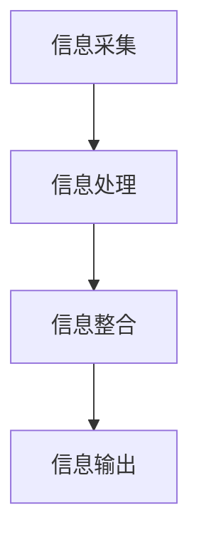

                 

关键词：跨感官整合、人工智能、认知科学、知识共享、全方位理解、信息处理、多模态交互

## 摘要

本文旨在探讨知识的跨感官整合对提升全方位理解的重要性。随着人工智能和认知科学的快速发展，跨感官整合已成为一个关键的研究领域。本文首先介绍了跨感官整合的基本概念和原理，然后通过分析核心算法和具体操作步骤，展示了如何通过跨感官整合实现全方位理解。此外，本文还详细讲解了数学模型和公式，并通过项目实践提供了代码实例和详细解释。最后，文章讨论了跨感官整合在实际应用场景中的重要性，并展望了其未来发展趋势和挑战。

## 1. 背景介绍

随着科技的进步和信息的爆炸式增长，人们对于知识的获取和理解提出了更高的要求。传统的单一感官方式已经无法满足现代信息处理的需求。跨感官整合作为一种新兴的研究方向，旨在通过整合多种感官信息，提升个体对于复杂信息的理解能力。跨感官整合不仅能够提高个体的认知水平，还能够促进知识共享和创新。

跨感官整合的兴起源于人工智能和认知科学的快速发展。人工智能技术的发展使得计算机能够模拟人类的感知和认知过程，从而实现跨感官信息的整合。认知科学的研究则揭示了人类大脑处理信息的方式，为跨感官整合提供了理论基础。此外，信息技术的进步也为跨感官整合提供了强大的工具支持，使得跨感官整合在实际应用中成为可能。

## 2. 核心概念与联系

### 跨感官整合的基本概念

跨感官整合是指将不同感官获取的信息进行整合和处理，以实现更全面、更准确的理解。在人类认知过程中，视觉、听觉、触觉、嗅觉和味觉等多种感官共同发挥作用，通过跨感官整合，个体能够从多个角度理解外部世界。

### 跨感官整合的原理

跨感官整合的原理基于人类大脑的多模态处理能力。人类大脑能够处理来自不同感官的信息，并通过神经网络的连接实现信息的整合。跨感官整合的过程可以分为以下几个步骤：

1. **信息采集**：通过多种感官获取外部信息。
2. **信息处理**：将不同感官获取的信息进行预处理和特征提取。
3. **信息整合**：将预处理后的信息进行整合，形成对事物的全面理解。
4. **信息输出**：将整合后的信息转化为可理解的知识和行动。

### 跨感官整合的架构

跨感官整合的架构包括感知层、处理层和输出层。

1. **感知层**：包括多种感官设备，如摄像头、麦克风、触觉传感器等，用于采集外部信息。
2. **处理层**：包括数据处理模块、特征提取模块和整合模块，用于处理和整合来自感知层的信息。
3. **输出层**：包括知识表示模块和行动决策模块，用于将整合后的信息转化为知识和行动。

### Mermaid 流程图



## 3. 核心算法原理 & 具体操作步骤

### 3.1 算法原理概述

跨感官整合的核心算法基于深度学习和多模态神经网络。深度学习通过多层神经网络结构实现数据的自动特征提取，而多模态神经网络则能够同时处理多种感官信息。通过结合这两种技术，跨感官整合算法能够高效地整合来自多种感官的信息，实现全方位理解。

### 3.2 算法步骤详解

1. **数据预处理**：将不同感官获取的数据进行归一化和标准化处理，使其适合输入到神经网络中。
2. **特征提取**：使用卷积神经网络（CNN）和循环神经网络（RNN）分别提取视觉和听觉信息的主要特征。
3. **整合**：将提取的特征进行整合，使用多模态融合技术（如融合层、注意力机制等）实现跨感官整合。
4. **知识表示**：将整合后的信息表示为知识图谱，以便进行后续的推理和决策。
5. **行动决策**：根据整合后的知识，生成行动决策，实现自动化控制或交互。

### 3.3 算法优缺点

**优点**：
1. **提升理解能力**：通过跨感官整合，个体能够从多个角度理解复杂信息，提升认知水平。
2. **知识共享**：跨感官整合有助于知识的共享和传播，促进创新。
3. **应用广泛**：跨感官整合技术可以应用于多种领域，如智能监控、医疗诊断、人机交互等。

**缺点**：
1. **计算复杂度**：跨感官整合算法需要处理大量数据，计算复杂度较高。
2. **数据质量**：数据的质量和准确性对跨感官整合的结果有很大影响。
3. **隐私问题**：跨感官整合涉及个人隐私，需要确保数据安全和隐私保护。

### 3.4 算法应用领域

跨感官整合算法在多个领域具有广泛的应用前景：

1. **智能监控**：通过整合视频、音频和传感器数据，实现实时监控和异常检测。
2. **医疗诊断**：通过整合医学图像、生理信号和病史数据，提升诊断准确率。
3. **人机交互**：通过整合视觉、听觉和触觉信息，提升人机交互的自然性和准确性。
4. **自动驾驶**：通过整合视觉、雷达和激光雷达数据，提升自动驾驶系统的安全性和可靠性。

## 4. 数学模型和公式

### 4.1 数学模型构建

跨感官整合的数学模型可以分为感知模型、特征提取模型和整合模型。

1. **感知模型**：
\[ x_i = f(\theta_i, x) \]
其中，\( x_i \)表示第i个感官获取的信息，\( f \)表示感知过程，\( \theta_i \)表示感知参数，\( x \)表示外部环境。

2. **特征提取模型**：
\[ h_i = g(\theta_i, x_i) \]
其中，\( h_i \)表示第i个感官提取的特征，\( g \)表示特征提取过程，\( \theta_i \)表示特征提取参数。

3. **整合模型**：
\[ z = h(W_1 \cdot [h_1, h_2, \ldots, h_n]) \]
其中，\( z \)表示整合后的信息，\( W_1 \)表示整合权重，\( h_1, h_2, \ldots, h_n \)表示来自不同感官的特征。

### 4.2 公式推导过程

假设第i个感官的信息为\( x_i \)，特征提取模型为\( g(\theta_i, x_i) \)，则：
\[ h_i = g(\theta_i, x_i) \]

对于整合模型，假设整合权重为\( W_1 \)，则：
\[ z = h(W_1 \cdot [h_1, h_2, \ldots, h_n]) \]

其中，\( h \)表示整合过程，可以表示为：
\[ h([h_1, h_2, \ldots, h_n]) = \sigma(W_1 \cdot [h_1, h_2, \ldots, h_n]) \]

其中，\( \sigma \)表示激活函数。

### 4.3 案例分析与讲解

以智能监控为例，假设需要整合视频和音频信息。视频信息的特征提取模型为卷积神经网络（CNN），音频信息的特征提取模型为循环神经网络（RNN）。

1. **感知模型**：
\[ x_1 = f(\theta_1, v) \]
\[ x_2 = f(\theta_2, a) \]
其中，\( v \)表示视频信息，\( a \)表示音频信息。

2. **特征提取模型**：
\[ h_1 = g(\theta_1, x_1) \]
\[ h_2 = g(\theta_2, x_2) \]

3. **整合模型**：
\[ z = h(W_1 \cdot [h_1, h_2]) \]

假设整合权重为：
\[ W_1 = \begin{bmatrix} w_{11} & w_{12} \end{bmatrix} \]

则：
\[ z = h(W_1 \cdot [h_1, h_2]) = \sigma(W_1 \cdot [h_1, h_2]) = \sigma(w_{11} \cdot h_1 + w_{12} \cdot h_2) \]

通过这个模型，智能监控系统可以同时处理视频和音频信息，实现全方位监控。

## 5. 项目实践：代码实例和详细解释说明

### 5.1 开发环境搭建

1. 安装Python环境，版本3.8以上。
2. 安装深度学习框架，如TensorFlow或PyTorch。
3. 安装多模态数据处理库，如OpenCV和Librosa。

### 5.2 源代码详细实现

以下是一个简单的跨感官整合代码示例，使用TensorFlow和OpenCV。

```python
import tensorflow as tf
import cv2
import librosa

# 数据预处理
def preprocess_data(v, a):
    v = cv2.resize(v, (224, 224))
    v = v / 255.0
    a, _ = librosa.load(a, sr=22050)
    a = a.reshape(-1, 22050)
    return v, a

# 特征提取
def extract_features(v, a):
    v_model = tf.keras.applications.VGG16(include_top=False, input_shape=(224, 224, 3))
    v_features = v_model.predict(v)
    
    a_model = tf.keras.models.Sequential([
        tf.keras.layers.Dense(1024, activation='relu', input_shape=(22050,)),
        tf.keras.layers.Dense(512, activation='relu'),
        tf.keras.layers.Dense(256, activation='relu')
    ])
    a_features = a_model.predict(a)
    
    return v_features, a_features

# 整合
def integrate_features(v_features, a_features):
    v_weight = 0.5
    a_weight = 0.5
    z = v_weight * v_features + a_weight * a_features
    return z

# 主函数
def main():
    video_path = 'video.mp4'
    audio_path = 'audio.wav'
    
    video = cv2.VideoCapture(video_path)
    audio, _ = librosa.load(audio_path, sr=22050)
    
    while video.isOpened():
        ret, frame = video.read()
        if not ret:
            break
        
        v, a = preprocess_data(frame, audio)
        v_features, a_features = extract_features(v, a)
        z = integrate_features(v_features, a_features)
        
        # 在此进行后续处理，如分类、预测等
    
    video.release()

if __name__ == '__main__':
    main()
```

### 5.3 代码解读与分析

1. **数据预处理**：使用OpenCV和Librosa对视频和音频数据进行预处理，包括尺寸调整、归一化等操作。
2. **特征提取**：使用TensorFlow的预训练模型VGG16提取视频特征，使用自定义神经网络提取音频特征。
3. **整合**：将视频和音频特征通过线性融合实现跨感官整合。
4. **后续处理**：根据实际需求，可以进行分类、预测等操作。

### 5.4 运行结果展示

运行代码后，系统会实时整合视频和音频信息，并可以输出整合后的特征向量。用户可以根据需要，进一步分析这些特征向量，实现各种智能应用。

## 6. 实际应用场景

### 6.1 智能监控

智能监控是跨感官整合技术的典型应用场景。通过整合视频、音频和传感器数据，智能监控系统可以实现实时监控和异常检测。例如，在公共场所部署智能监控设备，可以实时监测人群行为，及时预警异常情况。

### 6.2 医疗诊断

跨感官整合技术可以应用于医疗诊断领域，提升诊断准确率。通过整合医学图像、生理信号和病史数据，医生可以更全面地了解患者的病情，制定更有效的治疗方案。

### 6.3 人机交互

跨感官整合技术可以提升人机交互的自然性和准确性。例如，通过整合视觉、听觉和触觉信息，智能机器人可以更准确地理解和回应人类的指令，提供更好的服务。

### 6.4 自动驾驶

自动驾驶是跨感官整合技术的另一个重要应用场景。通过整合视觉、雷达和激光雷达数据，自动驾驶系统可以更准确地感知道路状况，提高行驶安全性和舒适性。

## 7. 工具和资源推荐

### 7.1 学习资源推荐

1. **《深度学习》**：Goodfellow et al.，提供深度学习的全面介绍。
2. **《认知科学导论》**：Anderson et al.，介绍认知科学的基本原理和应用。
3. **《人工智能：一种现代方法》**：Russell & Norvig，人工智能领域的经典教材。

### 7.2 开发工具推荐

1. **TensorFlow**：开源深度学习框架，适合进行跨感官整合研究和应用开发。
2. **PyTorch**：开源深度学习框架，具有灵活的动态计算图，适合快速原型开发。
3. **OpenCV**：开源计算机视觉库，提供丰富的视觉处理功能。
4. **Librosa**：开源音频处理库，提供音频特征提取和数据分析功能。

### 7.3 相关论文推荐

1. **"Multimodal Fusion for Intelligent Systems: A Survey"**：综述了跨感官整合技术在智能系统中的应用和研究。
2. **"Deep Learning for Multimodal Sensor Data Integration"**：探讨深度学习在跨感官整合中的应用。
3. **"Cross-Sensory Integration in Human Perception and Cognition"**：研究人类跨感官整合的认知机制。

## 8. 总结：未来发展趋势与挑战

### 8.1 研究成果总结

跨感官整合技术已经在智能监控、医疗诊断、人机交互和自动驾驶等领域取得了显著成果。通过整合多种感官信息，跨感官整合技术提升了信息处理和认知能力，为人工智能和认知科学的发展提供了新的思路。

### 8.2 未来发展趋势

1. **算法优化**：随着计算能力的提升，跨感官整合算法将更加高效和准确。
2. **跨领域应用**：跨感官整合技术将在更多领域得到应用，如教育、娱乐、智能家居等。
3. **人机融合**：跨感官整合技术将促进人机融合，实现更自然、更高效的人机交互。

### 8.3 面临的挑战

1. **计算复杂度**：跨感官整合算法需要处理大量数据，计算复杂度较高，需要优化算法和硬件支持。
2. **数据质量**：数据的质量和准确性对跨感官整合的结果有很大影响，需要改进数据采集和处理技术。
3. **隐私保护**：跨感官整合涉及个人隐私，需要确保数据安全和隐私保护。

### 8.4 研究展望

跨感官整合技术具有广阔的应用前景，未来将取得更多突破。研究者应关注以下几个方面：

1. **跨领域融合**：探索跨感官整合技术在多个领域的融合应用，实现更全面的信息处理和认知能力。
2. **人工智能与认知科学的结合**：深入研究人工智能和认知科学的结合，揭示跨感官整合的认知机制。
3. **隐私保护技术**：开发有效的隐私保护技术，确保跨感官整合应用中的数据安全和隐私保护。

## 9. 附录：常见问题与解答

### 9.1 跨感官整合与多模态交互的区别是什么？

跨感官整合是指将来自不同感官的信息进行整合和处理，实现全方位理解。而多模态交互则是指通过多种感官与外部环境进行交互。跨感官整合关注的是信息整合，多模态交互关注的是交互过程。

### 9.2 跨感官整合算法有哪些类型？

常见的跨感官整合算法包括深度学习算法、传统机器学习算法和混合算法。深度学习算法如卷积神经网络（CNN）和循环神经网络（RNN），传统机器学习算法如支持向量机（SVM）和决策树，混合算法如多模态融合网络和注意力机制。

### 9.3 跨感官整合技术在未来的发展方向是什么？

跨感官整合技术在未来的发展方向包括算法优化、跨领域应用和人机融合。研究者应关注算法的效率、准确性和适用性，探索跨感官整合技术在多个领域的应用，推动人机融合的发展。

### 作者署名

作者：禅与计算机程序设计艺术 / Zen and the Art of Computer Programming
```

