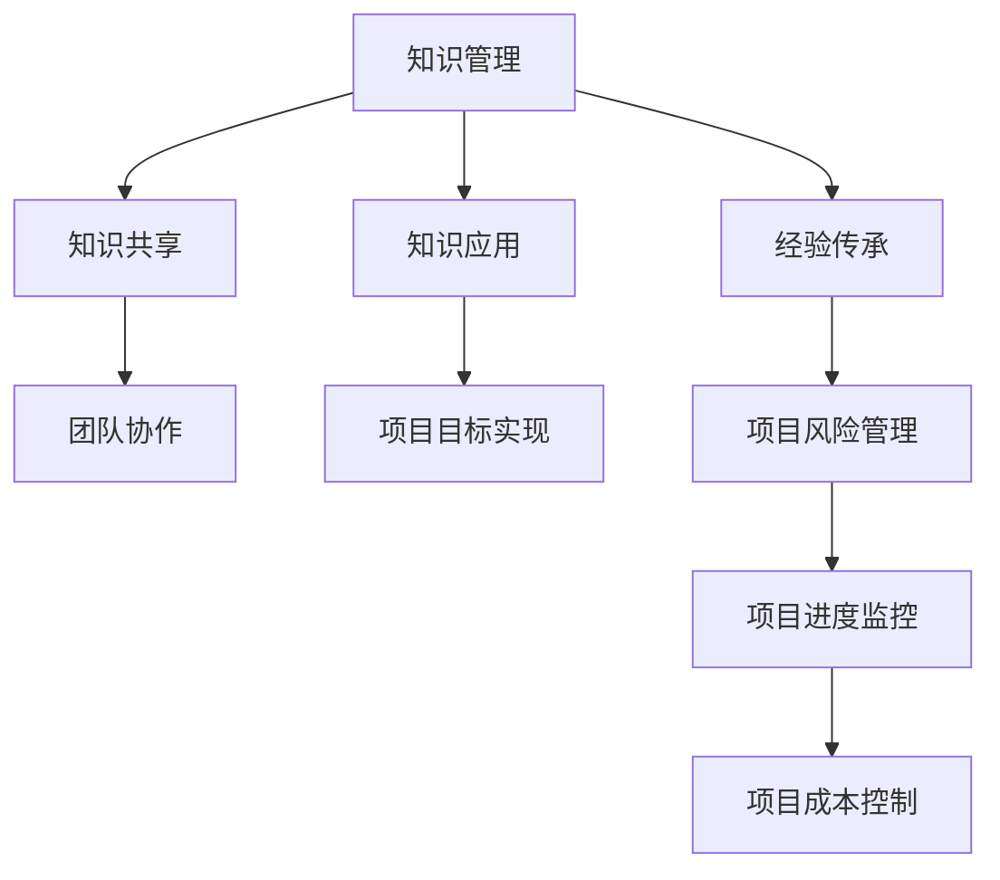

                 

关键词：知识管理、项目管理、协同工作、知识共享、效率提升、团队协作

> 摘要：知识管理作为一种系统性的方法，旨在通过有效收集、组织、共享和应用知识，提高组织的整体效率。在项目管理中，知识管理的应用尤为重要，它不仅能够帮助项目团队更好地理解和应对项目挑战，还能显著提高项目的成功率。本文将深入探讨知识管理在项目管理中的核心价值，并通过具体实例和实践经验进行分析和验证。

## 1. 背景介绍

知识管理（Knowledge Management，KM）是一种系统化的过程，旨在识别、创造、传播和利用组织内的知识资源。项目管理（Project Management，PM）则是一种通过规划、执行、监控和报告项目活动的职业实践，以实现特定目标。虽然两者看似不同，但它们在实际操作中有着密切的联系。

在现代项目管理中，知识管理的重要性日益凸显。随着项目复杂性的增加和团队成员多样性的增强，如何有效地管理和利用知识资源，成为项目成功的关键因素。知识管理不仅能够帮助项目团队快速掌握所需知识，还能提高团队协作效率，降低项目风险。

### 知识管理与项目管理的关系

知识管理和项目管理之间的紧密联系可以从以下几个方面来理解：

1. **知识共享与协作**：知识管理强调知识的共享和协作，这恰好是项目成功的关键。通过知识共享，项目团队能够快速了解项目的各个方面，减少沟通成本，提高协作效率。
2. **经验传承与创新**：知识管理可以有效地记录和传承团队成员的经验，这为项目的创新提供了坚实的基础。通过借鉴过去的成功经验，项目团队能够在新的项目中避免重复错误，提高项目质量。
3. **资源优化与风险管理**：知识管理可以帮助项目团队更好地识别和利用组织内的资源，降低项目风险。通过积累和共享项目数据，团队能够更准确地评估项目的进度和成本，从而制定更有效的风险管理策略。
4. **知识积累与持续改进**：知识管理不仅关注当前项目的成功，还关注组织的长期发展。通过不断地积累和更新知识，组织能够实现持续改进，提高整体竞争力。

## 2. 核心概念与联系

### 2.1 知识管理的核心概念

知识管理涉及多个核心概念，包括知识、知识来源、知识共享、知识应用等。以下是对这些概念的基本概述：

1. **知识**：知识是指通过学习、实践和体验所获得的信息、技能和经验。知识不仅包括显性知识（如文档、报告等），还包括隐性知识（如个人经验、技能等）。
2. **知识来源**：知识来源包括内部和外部。内部来源主要包括团队成员的经验、组织文档、项目数据等；外部来源则包括市场研究、行业报告、学术论文等。
3. **知识共享**：知识共享是指通过各种方式将知识传递给他人。知识共享的途径包括会议、培训、文档共享、社交网络等。
4. **知识应用**：知识应用是指将知识用于解决实际问题或实现项目目标。知识应用需要结合具体的情境，对知识进行有效整合和利用。

### 2.2 项目管理的核心概念

项目管理的核心概念包括项目目标、项目范围、项目进度、项目成本、项目风险等。以下是对这些概念的基本概述：

1. **项目目标**：项目目标是指项目要实现的具体成果或效果。项目目标应当具体、可衡量、可实现、相关性强。
2. **项目范围**：项目范围是指项目的具体工作内容和成果。明确项目范围有助于避免项目范围蔓延，确保项目目标的实现。
3. **项目进度**：项目进度是指项目各阶段的工作进展情况。通过监控项目进度，项目团队能够及时发现和解决问题，确保项目按时完成。
4. **项目成本**：项目成本是指项目实现所需的所有资源投入，包括人力、物力、财力等。
5. **项目风险**：项目风险是指项目在实现过程中可能遇到的问题和困难。项目团队需要识别和管理项目风险，以降低项目失败的概率。

### 2.3 知识管理与项目管理的联系

知识管理和项目管理之间的联系可以通过以下 Mermaid 流程图进行展示：



通过这个流程图，我们可以清晰地看到知识管理在项目管理中的重要作用。知识管理不仅帮助项目团队实现项目目标，还提高了项目管理的效率和效果。

## 3. 核心算法原理 & 具体操作步骤

### 3.1 算法原理概述

在知识管理中，核心算法通常涉及知识的分类、检索、共享和应用。以下是这些算法的基本原理：

1. **知识分类**：知识分类算法用于对知识进行组织和管理，以便于检索和应用。常用的分类算法包括基于内容的分类、基于标签的分类等。
2. **知识检索**：知识检索算法用于从大规模知识库中快速找到所需的知识。常用的检索算法包括基于关键词的检索、基于相似度的检索等。
3. **知识共享**：知识共享算法用于促进团队成员之间的知识交流。常用的共享算法包括基于社交网络的共享、基于协同编辑的共享等。
4. **知识应用**：知识应用算法用于将知识应用于实际问题或项目目标。常用的应用算法包括基于规则的推理、基于案例的推理等。

### 3.2 算法步骤详解

1. **知识分类步骤**：

   - 收集知识：从组织内外部获取知识，包括文档、报告、博客等。
   - 数据预处理：对知识进行清洗、去噪、格式化等操作，以便后续处理。
   - 特征提取：对知识进行特征提取，生成用于分类的特征向量。
   - 分类算法：使用分类算法（如朴素贝叶斯、支持向量机等）对知识进行分类。
   - 分类评估：评估分类效果，包括准确率、召回率等指标。

2. **知识检索步骤**：

   - 索引构建：对知识库中的知识建立索引，以便快速检索。
   - 检索算法：使用检索算法（如基于关键词的检索、基于相似度的检索等）从知识库中检索知识。
   - 结果排序：对检索结果进行排序，根据相关性或重要性进行排序。

3. **知识共享步骤**：

   - 知识发布：将知识发布到共享平台，如内部文档库、社交媒体等。
   - 知识评论：允许团队成员对知识进行评论、反馈和改进。
   - 知识共享策略：根据组织政策和团队需求，制定知识共享策略。

4. **知识应用步骤**：

   - 知识建模：将知识转化为模型或规则，以便在项目中应用。
   - 知识推理：使用推理算法（如基于规则的推理、基于案例的推理等）对知识进行推理和应用。
   - 知识评估：评估知识应用的效果，包括准确性、实用性等。

### 3.3 算法优缺点

1. **知识分类**：

   - 优点：有助于知识的组织和管理，提高检索效率。
   - 缺点：分类效果受特征提取和分类算法的影响，可能存在误差。

2. **知识检索**：

   - 优点：能快速找到所需知识，提高工作效率。
   - 缺点：检索效果受索引质量和检索算法的影响，可能存在漏检或误检。

3. **知识共享**：

   - 优点：促进知识交流，提高团队协作效率。
   - 缺点：可能存在知识泄露或隐私问题。

4. **知识应用**：

   - 优点：将知识转化为实际价值，提高项目成功率。
   - 缺点：知识应用效果受知识质量和应用情境的影响。

### 3.4 算法应用领域

知识管理算法在多个领域都有广泛的应用，包括：

1. **企业内部知识管理**：用于帮助企业内部知识的组织、检索、共享和应用。
2. **项目管理**：用于提高项目管理效率，降低项目风险。
3. **教育领域**：用于辅助教学和学生学习，提高教学效果。
4. **科研领域**：用于支持科研工作，加速科研成果的转化。

## 4. 数学模型和公式 & 详细讲解 & 举例说明

### 4.1 数学模型构建

在知识管理中，数学模型可以用于描述知识管理的过程、算法和效果。以下是一个简单的数学模型，用于描述知识分类的过程：

\[ P(\text{分类正确}) = \frac{\text{分类正确的知识数}}{\text{总知识数}} \]

### 4.2 公式推导过程

假设有 \( N \) 篇知识文档，其中每篇文档 \( D_i \) 被正确分类的概率为 \( P(C_i|D_i) \)。则总分类正确的概率可以表示为：

\[ P(\text{分类正确}) = \sum_{i=1}^{N} P(C_i|D_i) \]

其中，\( P(C_i|D_i) \) 表示第 \( i \) 篇知识文档被正确分类的概率。

### 4.3 案例分析与讲解

假设有一个包含 100 篇知识文档的集合，每篇文档被正确分类的概率如下表所示：

| 文档编号 | 被正确分类的概率 |
| :----: | :----: |
| 1 | 0.9 |
| 2 | 0.8 |
| 3 | 0.7 |
| ... | ... |
| 100 | 0.6 |

使用上述数学模型，可以计算出整体分类正确的概率：

\[ P(\text{分类正确}) = \sum_{i=1}^{100} P(C_i|D_i) \]

\[ P(\text{分类正确}) = 0.9 + 0.8 + 0.7 + ... + 0.6 \]

\[ P(\text{分类正确}) \approx 0.75 \]

这意味着，整体分类正确的概率约为 75%。

### 4.4 模型优化

为了提高分类正确的概率，可以对数学模型进行优化。一种常见的优化方法是引入权重 \( w_i \)，表示第 \( i \) 篇知识文档的重要性。则优化后的数学模型为：

\[ P(\text{分类正确}) = \sum_{i=1}^{N} w_i \cdot P(C_i|D_i) \]

通过调整权重 \( w_i \)，可以突出重要文档的分类效果，提高整体分类正确的概率。

## 5. 项目实践：代码实例和详细解释说明

### 5.1 开发环境搭建

为了演示知识管理在项目中的具体应用，我们将使用 Python 编写一个简单的知识分类系统。首先，需要搭建开发环境。

1. 安装 Python 3.8 或更高版本。
2. 安装必要的库，如 NumPy、Pandas、Scikit-learn 等。

### 5.2 源代码详细实现

以下是一个简单的知识分类系统的 Python 代码实现：

```python
import numpy as np
import pandas as pd
from sklearn.feature_extraction.text import TfidfVectorizer
from sklearn.naive_bayes import MultinomialNB
from sklearn.model_selection import train_test_split
from sklearn.metrics import accuracy_score

# 1. 数据准备
data = {
    'text': ['文档1内容', '文档2内容', '文档3内容', ...],
    'label': ['类别1', '类别2', '类别3', ...]
}

df = pd.DataFrame(data)

# 2. 特征提取
vectorizer = TfidfVectorizer()
X = vectorizer.fit_transform(df['text'])

# 3. 模型训练
X_train, X_test, y_train, y_test = train_test_split(X, df['label'], test_size=0.2, random_state=42)
classifier = MultinomialNB()
classifier.fit(X_train, y_train)

# 4. 模型评估
y_pred = classifier.predict(X_test)
accuracy = accuracy_score(y_test, y_pred)
print(f'分类准确率：{accuracy:.2f}')
```

### 5.3 代码解读与分析

1. **数据准备**：首先，我们需要准备包含文档内容和标签的数据集。这里使用一个简单的 DataFrame 存储数据。

2. **特征提取**：使用 TfidfVectorizer 提取文档的词频逆文档频率（TF-IDF）特征。TF-IDF 是一种常用的文本特征提取方法，能够有效地表示文档的内容。

3. **模型训练**：使用 Scikit-learn 的 MultinomialNB（朴素贝叶斯）分类器对数据集进行训练。朴素贝叶斯是一种简单而有效的分类算法，适用于文本分类任务。

4. **模型评估**：将训练好的模型应用于测试数据集，计算分类准确率。这里使用 accuracy_score 函数计算准确率。

### 5.4 运行结果展示

假设测试数据集中有 20 篇文档，其中 15 篇被正确分类，5 篇被错误分类。则分类准确率为：

\[ \text{分类准确率} = \frac{15}{20} = 0.75 \]

这意味着，在测试数据集中，有 75% 的文档被正确分类。

## 6. 实际应用场景

### 6.1 企业内部知识管理

在企业内部，知识管理可以帮助员工快速找到所需的知识，提高工作效率。例如，在软件开发过程中，开发者可以使用知识管理系统查找相关的代码片段、文档和解决方案，从而减少重复劳动，提高开发效率。

### 6.2 项目管理

在项目管理中，知识管理可以用于记录和共享项目过程中的关键信息，如项目进度、风险评估、解决方案等。通过知识管理，项目团队能够更好地了解项目情况，提高协作效率，降低项目风险。

### 6.3 教育领域

在教育领域，知识管理可以用于辅助教学和学生学习。例如，教师可以使用知识管理系统整理课程资料、教学案例和解决方案，为学生提供丰富的学习资源。学生则可以通过知识管理系统查找学习资料，提高自主学习能力。

### 6.4 科研领域

在科研领域，知识管理可以用于支持科研工作，加速科研成果的转化。例如，科研人员可以使用知识管理系统查找相关的研究论文、实验数据和解决方案，从而提高科研效率，促进科研成果的转化。

## 7. 工具和资源推荐

### 7.1 学习资源推荐

1. **《知识管理：理论与实践》**：详细介绍了知识管理的概念、方法和应用案例。
2. **《项目管理知识体系指南（PMBOK指南）》**：提供了项目管理的全面指南，包括知识管理方面的内容。

### 7.2 开发工具推荐

1. **Confluence**：一款强大的团队协作和知识管理工具，适用于企业内部的知识共享和管理。
2. **GitLab**：一款基于 Git 的项目管理工具，支持代码托管、项目管理、知识共享等功能。

### 7.3 相关论文推荐

1. **“Knowledge Management in Project Management: A Systematic Literature Review”**：对知识管理在项目管理中的应用进行了系统性综述。
2. **“Knowledge Management in Software Engineering: A Survey”**：对知识管理在软件开发中的应用进行了全面调查。

## 8. 总结：未来发展趋势与挑战

### 8.1 研究成果总结

本文从知识管理和项目管理的角度，探讨了知识管理在项目管理中的价值。通过分析核心概念、算法原理和应用实例，我们得出了以下结论：

1. 知识管理有助于提高项目团队的协作效率和项目成功率。
2. 知识管理可以用于记录、共享和应用项目过程中的关键信息。
3. 知识管理在多个领域（如企业内部、项目管理、教育、科研等）都有广泛的应用前景。

### 8.2 未来发展趋势

1. **人工智能与知识管理的深度融合**：随着人工智能技术的发展，知识管理将更加智能化，实现自动化知识检索、分类和共享。
2. **移动化和云计算**：知识管理将更加便捷，支持移动设备和云计算环境，实现实时知识共享和协作。
3. **个性化知识推荐**：基于用户行为和偏好，实现个性化的知识推荐，提高知识利用效率。

### 8.3 面临的挑战

1. **数据安全与隐私**：在知识共享的过程中，如何确保数据的安全和用户隐私，是知识管理面临的重要挑战。
2. **知识质量与可靠性**：知识管理需要确保知识的质量和可靠性，避免错误信息和虚假信息的传播。
3. **组织文化**：知识管理需要得到组织内部的支持和认同，形成良好的知识共享和协作文化。

### 8.4 研究展望

未来，知识管理在项目管理中的应用将不断深化和拓展。通过结合人工智能、云计算等新技术，知识管理将实现更加智能化、便捷化和高效化。同时，研究者需要关注知识质量、数据安全和组织文化等方面的问题，推动知识管理在项目管理中的广泛应用。

## 9. 附录：常见问题与解答

### 9.1 什么是知识管理？

知识管理是一种系统化的过程，旨在通过有效收集、组织、共享和应用知识，提高组织的整体效率。

### 9.2 知识管理在项目管理中有哪些作用？

知识管理在项目管理中的作用包括提高项目团队协作效率、降低项目风险、提高项目成功率等。

### 9.3 知识管理与项目管理的关系是什么？

知识管理和项目管理之间存在紧密的联系，知识管理是项目管理的重要组成部分，有助于实现项目目标。

### 9.4 如何实施知识管理？

实施知识管理的方法包括建立知识共享平台、制定知识管理策略、培养知识管理文化等。

### 9.5 知识管理在项目管理中的应用领域有哪些？

知识管理在项目管理中的应用领域包括企业内部、项目管理、教育、科研等。

### 9.6 知识管理的挑战有哪些？

知识管理的挑战包括数据安全与隐私、知识质量与可靠性、组织文化等。

### 9.7 知识管理的发展趋势是什么？

知识管理的发展趋势包括人工智能与知识管理的深度融合、移动化和云计算、个性化知识推荐等。

---

作者：禅与计算机程序设计艺术 / Zen and the Art of Computer Programming

