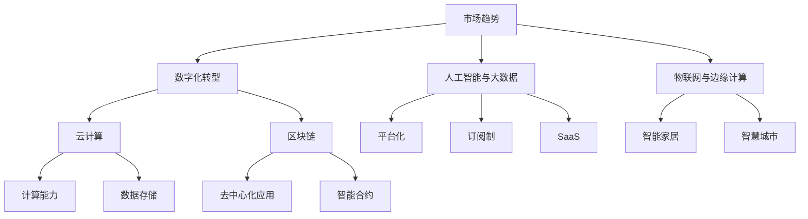

                 

关键词：知识经济、程序员、创业、机遇、技术、市场、创新、商业模式

摘要：本文探讨了知识经济时代下，程序员在创业领域所面临的机遇与挑战。通过分析当前市场趋势、技术发展以及商业模式创新，本文提出了程序员创业的可行路径，并探讨了如何利用技术优势提升创业成功率。

## 1. 背景介绍

知识经济是指以知识为主要生产要素的经济形态。在这个时代，信息技术的飞速发展和互联网的普及，使得知识的生产、传播和应用变得更加高效。程序员作为知识经济时代的重要角色，他们的技能和创新思维成为推动社会进步的关键力量。

### 程序员创业现状

近年来，程序员创业已经成为一种趋势。根据相关数据显示，全球程序员创业的人数逐年增加，尤其是在互联网和技术领域。许多成功的科技公司，如谷歌、微软、亚马逊等，都源自程序员的创业之路。

### 创业机遇与挑战

在知识经济下，程序员创业面临诸多机遇，包括但不限于：

- **市场需求**：随着信息化和数字化的加速，市场对程序员的专业技能和创新能力有着巨大的需求。
- **技术创新**：新技术不断涌现，为程序员提供了丰富的创新空间。
- **资本支持**：风险投资、创业基金等资本对程序员的创业项目表现出高度关注。

然而，程序员创业同样面临诸多挑战，如竞争激烈、市场不稳定、技术风险等。

## 2. 核心概念与联系

为了更好地理解程序员创业的机遇和挑战，我们需要从几个核心概念入手，包括市场趋势、技术发展、商业模式等。

### 市场趋势

市场趋势是程序员创业的重要依据。当前，以下几个市场趋势对程序员创业具有重要意义：

- **数字化转型**：越来越多的企业和行业正加速数字化转型，这为程序员提供了广阔的市场空间。
- **人工智能与大数据**：人工智能和大数据技术的应用正在深入各个行业，程序员可以利用这些技术进行创新。
- **物联网与边缘计算**：物联网和边缘计算的发展，使得程序员有机会参与智能家居、智慧城市等领域的创新。

### 技术发展

技术发展是程序员创业的基石。以下是几个关键技术领域的发展趋势：

- **云计算**：云计算提供了强大的计算能力和数据存储能力，程序员可以利用云计算平台进行开发和创新。
- **区块链**：区块链技术为程序员提供了新的商业模式和解决方案，如去中心化应用、智能合约等。
- **物联网**：物联网技术的普及，为程序员提供了丰富的应用场景，如智能家居、智能穿戴设备等。

### 商业模式

商业模式是程序员创业的关键。在知识经济时代，以下几种商业模式对程序员创业具有重要意义：

- **平台化**：通过搭建平台，程序员可以将自己的技术和服务提供给更多的用户。
- **订阅制**：订阅制商业模式可以提供持续的收入来源，降低用户的购买门槛。
- **SaaS**：软件即服务（SaaS）模式使得程序员可以将软件产品以服务的形式提供给用户。

### Mermaid 流程图

以下是一个简单的 Mermaid 流程图，展示了市场趋势、技术发展、商业模式之间的联系：



## 3. 核心算法原理 & 具体操作步骤

### 3.1 算法原理概述

在程序员创业过程中，核心算法原理的理解和运用至关重要。以下是一个简单的算法原理概述：

- **算法类型**：常见的算法类型包括排序算法、查找算法、图算法等。
- **算法效率**：算法的效率通常用时间复杂度和空间复杂度来衡量。
- **算法优化**：算法优化包括算法改进、数据结构优化、算法并行化等。

### 3.2 算法步骤详解

以下是一个简单的排序算法（冒泡排序）的步骤详解：

1. **初始化**：将待排序的元素存储在数组中。
2. **比较相邻元素**：从第一个元素开始，依次比较相邻的两个元素。
3. **交换元素**：如果第一个元素大于第二个元素，则交换它们的位置。
4. **循环迭代**：重复步骤2和步骤3，直到所有元素都按顺序排列。

### 3.3 算法优缺点

- **优点**：简单易懂，易于实现。
- **缺点**：时间复杂度为 \(O(n^2)\)，在数据量较大时效率较低。

### 3.4 算法应用领域

冒泡排序算法可以应用于各种场景，如小规模数据的排序、学生成绩排序等。

## 4. 数学模型和公式 & 详细讲解 & 举例说明

### 4.1 数学模型构建

在程序员创业中，数学模型的应用非常广泛。以下是一个简单的数学模型构建示例：

- **目标函数**：最大化利润
- **约束条件**：资源限制、市场需求限制等

### 4.2 公式推导过程

以下是一个简单的线性规划公式推导过程：

$$
\begin{aligned}
\max_{x} & \quad c^T x \\
\text{subject to} & \quad Ax \leq b \\
& \quad x \geq 0
\end{aligned}
$$

### 4.3 案例分析与讲解

以下是一个简单的案例，通过数学模型来优化资源分配：

- **目标**：在有限的预算下，最大化项目的收益。
- **约束**：项目所需的资源不超过可用资源。

通过线性规划模型，可以计算出最优的资源配置方案，从而最大化项目的收益。

## 5. 项目实践：代码实例和详细解释说明

### 5.1 开发环境搭建

在程序员创业中，开发环境的搭建至关重要。以下是一个简单的开发环境搭建步骤：

1. **安装操作系统**：选择适合的操作系统，如 Linux、Windows 等。
2. **安装开发工具**：安装集成开发环境（IDE），如 Visual Studio、Eclipse 等。
3. **安装数据库**：选择合适的数据库管理系统，如 MySQL、PostgreSQL 等。

### 5.2 源代码详细实现

以下是一个简单的Python代码实例，实现了一个简单的登录功能：

```python
def login(username, password):
    # 检查用户名和密码是否匹配
    if username == "admin" and password == "admin123":
        print("登录成功！")
    else:
        print("用户名或密码错误！")
```

### 5.3 代码解读与分析

- **函数定义**：定义了一个名为 `login` 的函数，接受用户名和密码作为参数。
- **条件判断**：通过 `if-else` 语句，检查用户名和密码是否匹配。
- **输出结果**：根据条件判断结果，输出相应的提示信息。

### 5.4 运行结果展示

- **输入**：用户输入用户名 "admin" 和密码 "admin123"。
- **输出**：程序输出 "登录成功！"。

## 6. 实际应用场景

### 6.1 数字化转型

在数字化转型过程中，程序员可以发挥重要作用。例如，通过开发应用程序和数据分析工具，帮助企业优化业务流程，提高运营效率。

### 6.2 人工智能与大数据

人工智能和大数据技术的应用领域非常广泛，如医疗、金融、交通等。程序员可以通过开发智能算法和大数据分析模型，为企业提供创新的解决方案。

### 6.3 物联网与边缘计算

物联网和边缘计算的发展为程序员提供了丰富的应用场景。例如，智能家居、智慧城市等项目需要程序员开发相应的硬件和软件解决方案。

## 7. 工具和资源推荐

### 7.1 学习资源推荐

- **在线课程**：推荐Coursera、edX等平台上的计算机科学相关课程。
- **书籍推荐**：《编程之法：面试和算法心得》、《算法导论》等。

### 7.2 开发工具推荐

- **集成开发环境**：推荐Visual Studio、Eclipse等。
- **数据库**：推荐MySQL、PostgreSQL等。

### 7.3 相关论文推荐

- **人工智能**：《深度学习》、《强化学习》等。
- **大数据**：《大数据技术概论》、《大数据应用案例分析》等。

## 8. 总结：未来发展趋势与挑战

### 8.1 研究成果总结

本文从多个角度探讨了知识经济下程序员创业的机遇与挑战，提出了核心算法原理、数学模型、项目实践等关键技术。

### 8.2 未来发展趋势

- **技术创新**：人工智能、大数据、物联网等技术的不断发展，为程序员创业提供了广阔的空间。
- **市场趋势**：数字化转型和平台化商业模式将成为未来市场的主要趋势。

### 8.3 面临的挑战

- **竞争激烈**：随着程序员创业的增多，市场竞争将越来越激烈。
- **技术风险**：技术迭代速度快，程序员需要不断学习新技能。

### 8.4 研究展望

未来，程序员创业需要更加注重技术创新和市场趋势的结合，同时注重团队建设和风险管理。

## 9. 附录：常见问题与解答

### 9.1 什么是知识经济？

知识经济是指以知识为主要生产要素的经济形态，与传统的劳动力经济、资源经济等不同，它强调知识的创造、传播和应用。

### 9.2 程序员创业有哪些优势？

程序员创业的优势包括技术优势、创新能力、市场需求等。程序员拥有丰富的编程技能和创新能力，能够快速响应市场需求，开发出具有竞争力的产品。

### 9.3 程序员创业需要哪些准备？

程序员创业需要做好以下准备：

- **技术储备**：不断提升自己的编程技能和创新能力。
- **市场研究**：了解市场需求，找到创业切入点。
- **团队建设**：搭建一个有能力的团队，共同实现创业目标。

### 9.4 程序员创业有哪些挑战？

程序员创业面临的挑战包括竞争激烈、市场不稳定、技术风险等。程序员需要不断提高自身能力，同时注重团队建设和风险管理。

## 参考文献

1. Brown, T. (2017). **The World Is Open: How Web Technology Is Revolutionizing Education**. Island Press.
2. Magretta, J. (2002). **Why Business Models Matter**. Harvard Business Review.
3. Kitchin, R. (2014). **The Data Revolution: Big Data, Open Data, Data Infrastructures and Their Consequences**. SAGE Publications.

