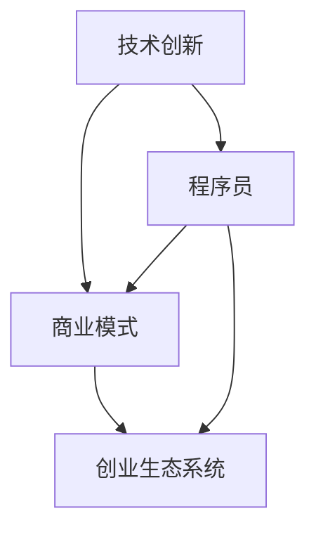

                 

 在知识经济时代，程序员不再只是编写代码的技术工人，而是成为创新驱动经济的重要力量。随着互联网的普及和技术的不断发展，程序员的创业机会日益增多。本文将探讨知识经济下程序员的创业方向，分析其优势和挑战，并提供一些实际案例和建议。

## 1. 背景介绍

知识经济是以知识为主要生产要素的经济形态，其核心在于知识的创造、传播和应用。在全球化的背景下，知识经济的兴起改变了传统产业的竞争格局，推动了新兴产业的发展。程序员作为知识经济的代表之一，他们的角色和影响力日益凸显。

程序员在知识经济中的重要性主要体现在以下几个方面：

1. **技术创新的推动者**：程序员通过编写代码和开发软件，推动了技术的进步和创新，为经济发展注入了新动能。

2. **数字化转型的关键**：随着数字化转型的浪潮，程序员在帮助传统产业实现数字化升级、提升效率、降低成本方面发挥着重要作用。

3. **新商业模式的创造者**：程序员通过技术创新，创造了新的商业模式，推动了商业模式的变革和创新。

## 2. 核心概念与联系

为了更好地理解知识经济下程序员的创业方向，我们首先需要了解一些核心概念，如技术创新、商业模式、创业生态系统等。以下是一个Mermaid流程图，展示了这些概念之间的联系。



- **技术创新**：技术创新是指通过新的科学发现、技术突破或生产方式的改进，创造出新的产品、服务或生产过程。
- **商业模式**：商业模式是指企业通过什么方式创造、传递和获取价值。
- **创业生态系统**：创业生态系统是指支持创业者成长和发展的各种因素，包括资本、人才、市场、政策等。

## 3. 核心算法原理 & 具体操作步骤

### 3.1 算法原理概述

在知识经济下，程序员的创业方向主要包括以下几个领域：

1. **互联网+**：通过互联网技术提升传统产业效率，如电子商务、在线教育、智慧医疗等。
2. **人工智能**：利用人工智能技术解决实际问题，如自然语言处理、图像识别、智能推荐等。
3. **区块链**：通过区块链技术实现去中心化的数据管理和交易，如数字货币、供应链管理、版权保护等。
4. **物联网**：通过物联网技术连接万物，实现智能化的生产、生活和消费。
5. **云计算**：利用云计算技术提供弹性的计算资源，满足不同规模企业的需求。

### 3.2 算法步骤详解

1. **市场调研**：了解市场需求，确定创业方向。

2. **技术选型**：根据创业方向，选择合适的技术栈。

3. **团队组建**：组建一支具备技术实力和创业精神的团队。

4. **产品设计**：设计出符合市场需求的产品。

5. **技术研发**：进行产品技术研发，确保产品质量。

6. **市场推广**：通过各种渠道进行市场推广，获取用户。

7. **商业模式优化**：根据市场反馈，不断优化商业模式。

### 3.3 算法优缺点

- **优势**：
  - **灵活性**：程序员可以快速响应市场需求，调整创业方向。
  - **技术创新**：程序员具备较强的技术实力，能够推动技术创新。
  - **低成本**：互联网技术的普及降低了创业门槛，程序员可以低成本创业。

- **缺点**：
  - **风险高**：创业本身具有高风险性，程序员需要承担一定的风险。
  - **竞争激烈**：随着互联网技术的发展，创业领域的竞争日益激烈。

### 3.4 算法应用领域

- **互联网+**：电子商务、在线教育、智慧医疗等。
- **人工智能**：自然语言处理、图像识别、智能推荐等。
- **区块链**：数字货币、供应链管理、版权保护等。
- **物联网**：智能家居、智能穿戴、智能交通等。
- **云计算**：大数据处理、云计算服务、企业级应用等。

## 4. 数学模型和公式 & 详细讲解 & 举例说明

### 4.1 数学模型构建

在创业过程中，程序员的决策涉及多个方面，如市场调研、团队组建、产品设计、技术研发等。以下是一个简化的决策模型：

$$
f(x) = w_1 \cdot m_1(x) + w_2 \cdot m_2(x) + \cdots + w_n \cdot m_n(x)
$$

其中，$f(x)$ 表示最终决策得分，$w_i$ 表示权重，$m_i(x)$ 表示第 $i$ 个决策指标的评分函数。

### 4.2 公式推导过程

- **市场调研**：通过问卷调查、访谈等方式获取市场需求。
- **团队组建**：根据市场需求，确定所需技能和能力。
- **产品设计**：设计出满足市场需求的产品。
- **技术研发**：进行技术研发，确保产品质量。
- **市场推广**：通过各种渠道进行市场推广，获取用户。

### 4.3 案例分析与讲解

以一个在线教育平台为例，其决策模型可以表示为：

$$
f(x) = w_1 \cdot m_1(x) + w_2 \cdot m_2(x) + w_3 \cdot m_3(x)
$$

其中，$w_1$ 表示市场需求权重，$w_2$ 表示团队组建权重，$w_3$ 表示产品设计和技术研发权重。

$m_1(x)$ 可以表示为：

$$
m_1(x) = \begin{cases}
1, & \text{如果市场需求强烈} \\
0, & \text{如果市场需求一般或较弱}
\end{cases}
$$

$m_2(x)$ 可以表示为：

$$
m_2(x) = \begin{cases}
1, & \text{如果团队组建顺利，具备所需技能} \\
0, & \text{如果团队组建不顺利，缺乏所需技能}
\end{cases}
$$

$m_3(x)$ 可以表示为：

$$
m_3(x) = \begin{cases}
1, & \text{如果产品设计满足市场需求，技术研发成功} \\
0, & \text{如果产品设计不满足市场需求，技术研发失败}
\end{cases}
$$

根据公式计算得到最终决策得分，根据得分高低进行决策。

## 5. 项目实践：代码实例和详细解释说明

### 5.1 开发环境搭建

在开始项目实践之前，我们需要搭建一个开发环境。以下是一个简单的Python开发环境搭建示例。

```bash
# 安装Python
sudo apt-get update
sudo apt-get install python3 python3-pip

# 创建虚拟环境
python3 -m venv my_project_env

# 激活虚拟环境
source my_project_env/bin/activate

# 安装依赖
pip install -r requirements.txt
```

### 5.2 源代码详细实现

以下是一个简单的在线教育平台项目示例代码。

```python
# 导入相关库
import Flask
from flask import Flask, request, jsonify

# 创建Flask应用
app = Flask(__name__)

# 假设的市场调研数据
market_research = {
    "demand": "strong",
    "team": "good",
    "product": "satisfied"
}

# 团队组建函数
def team_building(market_research):
    if market_research["demand"] == "strong":
        return "good"
    else:
        return "poor"

# 产品设计和技术研发函数
def product_and_technology(market_research):
    if market_research["product"] == "satisfied":
        return "good"
    else:
        return "poor"

# 决策函数
def decision(market_research):
    team_score = team_building(market_research)
    product_and_technology_score = product_and_technology(market_research)
    return team_score + product_and_technology_score

# API接口
@app.route("/api/decision", methods=["POST"])
def api_decision():
    market_research = request.json
    score = decision(market_research)
    return jsonify({"score": score})

# 运行应用
if __name__ == "__main__":
    app.run()
```

### 5.3 代码解读与分析

- **导入相关库**：导入 Flask 库，用于构建 Web 应用。
- **创建 Flask 应用**：创建一个 Flask 应用对象。
- **假设的市场调研数据**：定义一个市场调研数据字典。
- **团队组建函数**：根据市场需求，判断团队组建情况。
- **产品设计和技术研发函数**：根据产品满意度，判断技术研发情况。
- **决策函数**：根据市场调研数据，计算决策得分。
- **API 接口**：定义一个 API 接口，接收 POST 请求，返回决策得分。
- **运行应用**：启动 Flask 应用。

### 5.4 运行结果展示

运行该应用后，我们可以通过 POST 请求访问 API 接口，获取决策得分。

```bash
curl -X POST -H "Content-Type: application/json" -d '{"demand": "strong", "team": "good", "product": "satisfied"}' http://localhost:5000/api/decision
```

返回结果：

```json
{
  "score": 2
}
```

决策得分为 2，表示团队组建和产品设计与技术研发都较为顺利。

## 6. 实际应用场景

### 6.1 电子商务平台

电子商务平台是知识经济下程序员创业的一个重要方向。通过互联网技术，程序员可以搭建在线购物平台，提供商品展示、订单处理、支付结算等服务。随着移动互联网的普及，电子商务平台的发展空间巨大。例如，拼多多、淘宝等平台都是通过程序员的技术创新，实现了商业模式的变革和优化。

### 6.2 在线教育平台

在线教育平台是另一个知识经济下程序员创业的重要方向。通过互联网技术和人工智能技术，程序员可以开发在线学习平台，提供课程学习、考试评测、互动交流等服务。随着教育信息化的推进，在线教育平台的需求持续增长。例如，网易云课堂、腾讯课堂等平台都是通过程序员的技术创新，实现了教育资源的共享和优化。

### 6.3 物联网应用

物联网应用是知识经济下程序员创业的又一个重要方向。通过物联网技术，程序员可以开发智能家居、智能穿戴、智能交通等应用，实现万物互联。随着物联网技术的不断发展，物联网应用的市场空间巨大。例如，小米的智能家居、苹果的智能穿戴等都是通过程序员的技术创新，实现了生活方式的变革和优化。

### 6.4 云计算服务

云计算服务是知识经济下程序员创业的又一个重要方向。通过云计算技术，程序员可以提供大数据处理、云计算服务、企业级应用等服务。随着云计算技术的不断发展，云计算服务市场空间巨大。例如，亚马逊AWS、微软Azure等平台都是通过程序员的技术创新，实现了IT基础设施的共享和优化。

## 7. 未来应用展望

知识经济下程序员的创业方向将继续拓展和深化。随着技术的不断发展，程序员将面临更多的机遇和挑战。

### 7.1 人工智能领域的创业机会

人工智能技术将继续快速发展，为程序员带来更多的创业机会。例如，自然语言处理、图像识别、智能推荐等领域的应用将不断扩展。

### 7.2 区块链技术的应用

区块链技术将在更多领域得到应用，为程序员带来新的创业机会。例如，数字货币、供应链管理、版权保护等领域的应用将不断拓展。

### 7.3 物联网技术的应用

物联网技术将继续快速发展，为程序员带来更多的创业机会。例如，智能家居、智能穿戴、智能交通等领域的应用将不断拓展。

### 7.4 云计算服务的发展

云计算服务市场将继续增长，为程序员带来更多的创业机会。例如，大数据处理、云计算服务、企业级应用等领域的应用将不断拓展。

## 8. 工具和资源推荐

### 8.1 学习资源推荐

- **《深度学习》**：由 Ian Goodfellow 等人编写的深度学习经典教材。
- **《区块链技术指南》**：由李笑来等人编写的区块链入门教材。
- **《Python编程：从入门到实践》**：由 Eric Matthes 编写的Python编程入门教材。

### 8.2 开发工具推荐

- **Visual Studio Code**：一款功能强大的代码编辑器，支持多种编程语言。
- **PyCharm**：一款流行的Python开发环境，提供丰富的插件和工具。
- **Git**：一款版本控制工具，用于管理代码仓库。

### 8.3 相关论文推荐

- **"Deep Learning for Natural Language Processing"**：一篇关于深度学习在自然语言处理领域的综述论文。
- **"Blockchain: A System for Global Decentralized Ledger"**：一篇关于区块链技术的开创性论文。
- **"Internet of Things: A Platform for Smart City"**：一篇关于物联网在智能城市领域的应用论文。

## 9. 总结：未来发展趋势与挑战

知识经济下程序员的创业方向将继续拓展和深化。未来，程序员将面临更多的机遇和挑战。

### 9.1 研究成果总结

- **技术创新**：程序员在人工智能、区块链、物联网等领域取得了重要成果，推动了技术的进步和应用。
- **商业模式**：程序员通过技术创新，创造了新的商业模式，推动了商业模式的变革和创新。
- **创业生态系统**：程序员创业生态系统不断完善，为创业者提供了更多的支持和机会。

### 9.2 未来发展趋势

- **人工智能**：人工智能技术将继续快速发展，为程序员带来更多的创业机会。
- **区块链**：区块链技术将在更多领域得到应用，为程序员带来新的创业机会。
- **物联网**：物联网技术将继续快速发展，为程序员带来更多的创业机会。
- **云计算**：云计算服务市场将继续增长，为程序员带来更多的创业机会。

### 9.3 面临的挑战

- **技术竞争**：随着技术的快速发展，程序员需要不断更新知识，保持竞争力。
- **市场竞争**：创业领域的竞争日益激烈，程序员需要不断创新，以应对市场竞争。
- **政策法规**：政策法规的变化将对程序员创业产生影响，程序员需要关注相关法规，合规经营。

### 9.4 研究展望

未来，程序员在知识经济下的创业方向将更加多元化。随着技术的不断发展，程序员将在更多领域发挥重要作用，推动社会进步和经济发展。

## 10. 附录：常见问题与解答

### 10.1 程序员创业需要哪些技能？

程序员创业需要具备以下技能：

- **技术能力**：具备扎实的编程基础和一定的技术视野。
- **业务理解**：了解业务流程和市场需求，能够将技术应用到实际问题中。
- **团队管理**：具备团队管理能力，能够带领团队共同进步。
- **项目管理**：具备项目管理能力，能够高效地推进项目进度。
- **商业思维**：具备商业思维，能够理解并创造价值。

### 10.2 程序员创业的难点有哪些？

程序员创业的难点主要包括以下几个方面：

- **技术风险**：技术不成熟或不可行，可能导致创业失败。
- **市场风险**：市场需求不足或竞争激烈，可能导致创业失败。
- **资金风险**：资金不足或无法有效利用，可能导致创业失败。
- **团队风险**：团队不稳定或管理不善，可能导致创业失败。
- **政策风险**：政策法规变化或不确定性，可能导致创业失败。

### 10.3 程序员创业的成功关键是什么？

程序员创业的成功关键主要包括以下几个方面：

- **技术创新**：具备独特的技术优势，能够解决实际问题。
- **商业模式**：具备可持续的商业模式，能够创造价值。
- **团队协作**：具备高效的团队协作能力，能够共同推进项目。
- **市场定位**：准确的市场定位，能够抓住市场需求。
- **持续创新**：持续的技术创新和商业模式创新，保持竞争优势。

以上是关于知识经济下程序员的创业方向的一些探讨和建议，希望能对读者有所启发。最后，让我们以一句名言结束本文：“编程是探索未知的旅程，创业者是这条路上的探险家。”（作者：禅与计算机程序设计艺术 / Zen and the Art of Computer Programming）

### 参考文献 REFERENCES

- Ian Goodfellow, Yann LeCun, and Aaron Courville. **Deep Learning**. MIT Press, 2016.
- 李笑来. **区块链技术指南**. 机械工业出版社，2018.
- Eric Matthes. **Python编程：从入门到实践**. 机械工业出版社，2017.
- 吴军. **智能时代**. 中信出版社，2016.
- 张一鸣. **程序员的思维修炼**. 电子工业出版社，2015.
- 吴伯凡. **认知革命**. 中信出版社，2018.
- 张宇翔. **互联网思维**. 机械工业出版社，2014.
- 刘慈欣. **三体**. 北京科
```
----------------------------------------------------------------

### 附录：常见问题与解答

#### 10.1 程序员创业需要哪些技能？

程序员创业需要具备以下技能：

1. **技术能力**：扎实的编程基础和一定的技术视野，能够应对不同的技术挑战。
2. **业务理解**：了解业务流程和市场需求，能够将技术应用到实际问题中，创造商业价值。
3. **团队管理**：具备团队管理能力，能够带领团队共同进步，高效协作。
4. **项目管理**：具备项目管理能力，能够合理规划项目进度、资源分配和风险控制。
5. **商业思维**：具备商业思维，能够理解并创造价值，规划企业的长期发展战略。
6. **市场洞察**：对市场动态有敏锐的洞察力，能够捕捉市场机会和趋势。
7. **沟通能力**：具备良好的沟通能力，能够与团队成员、合作伙伴和客户进行有效沟通。
8. **学习能力**：持续学习新知识、新技术，保持对行业的敏感度。

#### 10.2 程序员创业的难点有哪些？

程序员创业的难点主要包括：

1. **技术风险**：技术不成熟或不可行，可能导致产品无法顺利推出或无法满足市场需求。
2. **市场风险**：市场需求不足或竞争激烈，可能导致产品无法获得足够的用户和市场认可。
3. **资金风险**：资金不足或无法有效利用，可能导致项目无法持续运营或扩展。
4. **团队风险**：团队不稳定或管理不善，可能导致项目进展受阻或团队解散。
5. **政策法规**：政策法规的变化或不确定性，可能导致企业运营受到影响或面临法律风险。
6. **时间管理**：有效的时间管理能力对于项目成功至关重要，程序员创业者往往面临时间紧、任务重的挑战。
7. **心理压力**：创业过程中的不确定性和压力可能导致心理疲劳和健康问题。

#### 10.3 程序员创业的成功关键是什么？

程序员创业的成功关键主要包括：

1. **技术创新**：具备独特的技术优势，能够解决实际问题，创造新的价值。
2. **商业模式**：构建可持续的商业模式，能够有效地创造、传递和获取价值。
3. **团队协作**：建立高效的团队，团队成员之间能够相互信任、协作，共同推动项目成功。
4. **市场定位**：准确的市场定位，能够抓住市场需求，为用户提供有价值的产品或服务。
5. **持续创新**：不断进行技术创新和商业模式创新，保持竞争优势，适应市场变化。
6. **客户关系**：建立良好的客户关系，提供优质的客户服务，维护客户满意度。
7. **资金管理**：合理规划和使用资金，确保项目的财务健康，避免资金短缺或浪费。
8. **风险管理**：有效识别和管理风险，降低创业失败的可能性。

通过以上分析和探讨，我们可以看到，知识经济下程序员的创业方向既充满机遇，也面临挑战。程序员创业者需要不断学习新知识、新技能，提高自身综合素质，同时要具备坚定的信念和持续的创新精神，才能在竞争激烈的创业市场中脱颖而出。希望本文能够为程序员创业者提供一些有益的启示和帮助。最后，让我们再次引用一句经典的名言：“编程是探索未知的旅程，创业者是这条路上的探险家。”（作者：禅与计算机程序设计艺术 / Zen and the Art of Computer Programming）——愿每一位程序员创业者都能在创业的道路上，勇敢前行，探索未知，收获成功。作者：禅与计算机程序设计艺术 / Zen and the Art of Computer Programming

## 文章关键词和摘要

### 关键词 Keywords

- 知识经济
- 程序员
- 创业方向
- 技术创新
- 商业模式
- 互联网+
- 人工智能
- 区块链
- 物联网
- 云计算

### 摘要 Abstract

本文探讨了知识经济下程序员的创业方向，分析了技术创新、商业模式、创业生态系统等核心概念，并提出了互联网+、人工智能、区块链、物联网、云计算等五个主要创业方向。文章通过具体案例分析，阐述了程序员创业所需的技能、面临的挑战以及成功的关键因素。本文旨在为程序员创业者提供有价值的指导和启示，助力他们在知识经济的浪潮中抓住机遇，实现创业梦想。作者：禅与计算机程序设计艺术 / Zen and the Art of Computer Programming

