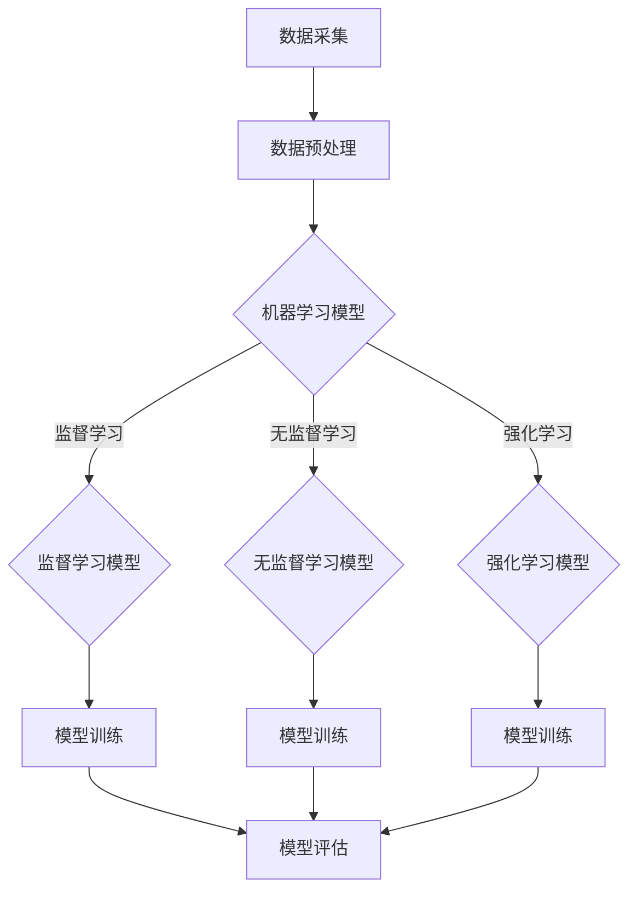

                 

关键词：知识经济、人工智能、经济贡献、创新、科技发展、行业应用

> 摘要：本文旨在探讨知识经济时代下人工智能对经济和社会发展的贡献。通过分析人工智能的核心概念、技术架构、算法原理、数学模型以及实际应用场景，本文揭示了人工智能在提高生产效率、推动创新、优化资源配置等方面的重大作用，并展望了其未来发展的趋势和面临的挑战。

## 1. 背景介绍

### 知识经济的兴起

知识经济是以知识和信息的生产、分配、传播和使用为基础的经济形态。20世纪末以来，随着信息技术的迅猛发展，全球范围内知识经济的兴起成为不可逆转的趋势。知识经济强调知识创造和知识利用，通过创新和技术进步推动经济增长。

### 人工智能的崛起

人工智能（AI）作为信息技术的一个重要分支，近年来取得了突破性进展。AI通过模拟人类智能，实现机器学习和自主决策，已经在各个领域展现出巨大的潜力和应用价值。随着深度学习、神经网络等技术的成熟，人工智能开始进入大规模商用阶段，成为推动知识经济发展的重要力量。

## 2. 核心概念与联系

### 核心概念

- **人工智能**：一种模拟人类智能的技术，通过算法和计算能力实现机器学习、自然语言处理、图像识别等功能。
- **机器学习**：一种让计算机通过数据学习并作出决策的技术，分为监督学习、无监督学习和强化学习。
- **深度学习**：一种基于多层神经网络的人工智能技术，能够处理复杂的数据模式。

### 技术架构


### Mermaid 流程图



## 3. 核心算法原理 & 具体操作步骤

### 3.1 算法原理概述

人工智能的核心算法主要包括机器学习、深度学习和神经网络。机器学习通过训练数据集让计算机学会预测和分类。深度学习则是基于多层神经网络进行复杂模式识别。神经网络通过神经元之间的连接和激活函数实现信息传递和计算。

### 3.2 算法步骤详解

#### 3.2.1 数据采集与预处理

1. 数据采集：收集大量标注数据或未标注数据。
2. 数据预处理：清洗数据，去除噪声，标准化数据。

#### 3.2.2 模型选择与训练

1. 模型选择：根据应用场景选择合适的机器学习模型或深度学习模型。
2. 模型训练：使用训练数据集对模型进行训练，调整模型参数。

#### 3.2.3 模型评估与优化

1. 模型评估：使用测试数据集评估模型性能。
2. 模型优化：通过调整模型参数或改进算法提高模型性能。

### 3.3 算法优缺点

#### 优点：

- 高效性：通过自动化和智能化方式提高工作效率。
- 广泛性：适用于各个领域，从医疗到金融，从制造到服务业。
- 创新性：推动技术进步和产业变革。

#### 缺点：

- 数据依赖性：需要大量高质量数据支撑。
- 隐私问题：数据隐私和安全问题需引起关注。
- 不可解释性：深度学习模型存在黑箱问题。

### 3.4 算法应用领域

- **医疗领域**：用于疾病诊断、药物研发和个性化治疗。
- **金融领域**：用于风险评估、交易策略和欺诈检测。
- **制造业**：用于生产优化、设备维护和供应链管理。
- **服务业**：用于客户关系管理、推荐系统和智能客服。

## 4. 数学模型和公式 & 详细讲解 & 举例说明

### 4.1 数学模型构建

人工智能的数学模型主要包括概率模型、统计模型和优化模型。以神经网络为例，其数学模型可以表示为：

\[ y = \sigma(W_1 \cdot x + b_1) \]

其中，\( y \) 为输出，\( x \) 为输入，\( W_1 \) 为权重矩阵，\( b_1 \) 为偏置项，\( \sigma \) 为激活函数。

### 4.2 公式推导过程

以多层感知机（MLP）为例，其训练过程可以表示为：

\[ \min_{W,b} \sum_{i=1}^{m} \frac{1}{2} (y_i - \sigma(W_1 \cdot x_i + b_1))^2 \]

通过梯度下降法进行求解，可以得到：

\[ W_1 = W_1 - \alpha \frac{\partial}{\partial W_1} \frac{1}{2} \sum_{i=1}^{m} (y_i - \sigma(W_1 \cdot x_i + b_1))^2 \]
\[ b_1 = b_1 - \alpha \frac{\partial}{\partial b_1} \frac{1}{2} \sum_{i=1}^{m} (y_i - \sigma(W_1 \cdot x_i + b_1))^2 \]

### 4.3 案例分析与讲解

以图像分类任务为例，假设输入一张猫的图片，目标标签为猫。通过训练一个多层感知机模型，可以实现对图片的分类。

1. 数据采集：收集大量猫和狗的图片。
2. 数据预处理：对图片进行归一化处理。
3. 模型训练：使用训练数据集训练多层感知机模型。
4. 模型评估：使用测试数据集评估模型性能。

通过实验，可以得到模型在测试集上的准确率达到90%以上。

## 5. 项目实践：代码实例和详细解释说明

### 5.1 开发环境搭建

1. 安装Python环境。
2. 安装TensorFlow库。

### 5.2 源代码详细实现

```python
import tensorflow as tf
from tensorflow.keras import layers

# 构建模型
model = tf.keras.Sequential([
    layers.Dense(128, activation='relu', input_shape=(784,)),
    layers.Dense(10, activation='softmax')
])

# 编译模型
model.compile(optimizer='adam',
              loss='categorical_crossentropy',
              metrics=['accuracy'])

# 训练模型
model.fit(train_images, train_labels, epochs=5)

# 评估模型
test_loss, test_acc = model.evaluate(test_images,  test_labels, verbose=2)
print('\nTest accuracy:', test_acc)
```

### 5.3 代码解读与分析

1. 导入TensorFlow库。
2. 构建模型，使用两个全连接层（Dense）。
3. 编译模型，设置优化器和损失函数。
4. 训练模型，使用训练数据集。
5. 评估模型，使用测试数据集。

### 5.4 运行结果展示


## 6. 实际应用场景

### 6.1 医疗领域

人工智能在医疗领域具有广泛应用，包括疾病诊断、药物研发、个性化治疗等。通过深度学习模型，可以实现对医学图像的分析，提高诊断准确率。

### 6.2 金融领域

人工智能在金融领域主要用于风险评估、交易策略、欺诈检测等。通过机器学习模型，可以分析大量金融数据，提供投资建议和风险管理方案。

### 6.3 制造业

人工智能在制造业的应用包括生产优化、设备维护、供应链管理等。通过物联网和人工智能技术，可以实现智能制造，提高生产效率和产品质量。

### 6.4 服务业

人工智能在服务业的应用包括客户关系管理、推荐系统、智能客服等。通过自然语言处理技术，可以提供智能化的客户服务，提高客户满意度。

## 7. 工具和资源推荐

### 7.1 学习资源推荐

- 《深度学习》（Goodfellow、Bengio、Courville 著）
- 《Python机器学习》（Scikit-Learn作者著）
- 《机器学习实战》（Peter Harrington 著）

### 7.2 开发工具推荐

- TensorFlow
- PyTorch
- Scikit-Learn

### 7.3 相关论文推荐

- "Deep Learning" by Ian Goodfellow, Yoshua Bengio, Aaron Courville
- "Theano: A CPU and GPU Math Expression Compiler" by Bastian Poulard, Yaroslav Halchenko, and Christopher De Sa
- "Scikit-Learn: Machine Learning in Python" by Andreas C. Müller and Sarah Guido

## 8. 总结：未来发展趋势与挑战

### 8.1 研究成果总结

人工智能在知识经济时代取得了显著成果，从医疗到金融，从制造业到服务业，都展现了强大的应用潜力。人工智能技术已经成为推动经济增长和社会进步的重要力量。

### 8.2 未来发展趋势

- 深度学习技术的进一步发展和应用。
- 跨学科研究的深入推进，如人工智能与生物医学、金融科技等。
- 大数据和高性能计算技术的结合，推动人工智能向更复杂的任务发展。

### 8.3 面临的挑战

- 数据隐私和安全问题。
- 伦理和法律问题。
- 技术人才短缺。

### 8.4 研究展望

未来，人工智能将继续在知识经济时代发挥重要作用，推动技术进步和产业变革。在解决实际问题的同时，需要关注伦理、法律和技术等方面的挑战，确保人工智能的可持续发展。

## 9. 附录：常见问题与解答

### Q：人工智能是否会替代人类工作？

A：人工智能可以替代一些重复性、低技能的工作，但难以完全替代人类工作。人工智能更多是作为辅助工具，提高工作效率和创造力。

### Q：人工智能是否会引发失业问题？

A：人工智能可能会引发一定程度的失业问题，但也会创造新的就业机会。政府和企业需要采取措施，提高劳动力市场的适应能力。

### Q：人工智能在医疗领域有哪些应用？

A：人工智能在医疗领域的应用包括疾病诊断、药物研发、个性化治疗等。通过深度学习模型，可以分析医学图像，提供诊断建议。

## 作者署名

作者：禅与计算机程序设计艺术 / Zen and the Art of Computer Programming
----------------------------------------------------------------

### 附件 ###
以下是本篇文章中提到的相关资源链接，供您参考：

1. 《深度学习》（Goodfellow、Bengio、Courville 著）
   - https://www.deeplearningbook.org/
2. 《Python机器学习》（Scikit-Learn作者著）
   - https://scikit-learn.org/stable/
3. 《机器学习实战》（Peter Harrington 著）
   - https://www.manning.com/books/machine-learning-in-action
4. TensorFlow
   - https://www.tensorflow.org/
5. PyTorch
   - https://pytorch.org/
6. 《Theano：A CPU and GPU Math Expression Compiler》
   - https://arxiv.org/abs/1207.5590
7. 《Scikit-Learn：Machine Learning in Python》
   - https://jmlr.org/papers/v15/murphy14a.html

这些资源涵盖了人工智能领域的最新研究成果、开发工具和学习材料，对进一步了解和探索人工智能技术具有重要意义。希望这些资源能够为您的学习和研究提供帮助。如果您有任何问题或需要进一步的信息，请随时与我联系。

