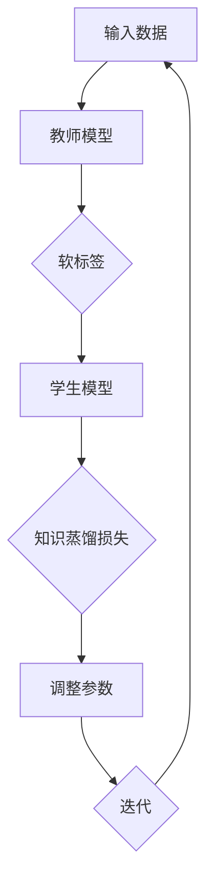

                 

知识蒸馏（Knowledge Distillation）是一种训练大型模型（教师模型）并将其知识传递给较小模型（学生模型）的技术，旨在提升小模型的性能，同时减小其模型大小和计算资源消耗。本文将详细介绍知识蒸馏的原理、算法步骤、数学模型、项目实践以及实际应用场景，并展望其未来发展趋势与挑战。

## 关键词

- 知识蒸馏
- 教师模型
- 学生模型
- 模型压缩
- 训练技巧

## 摘要

本文将全面讲解知识蒸馏技术，从核心概念出发，深入探讨其原理、算法步骤、数学模型，并通过实际代码实例展示其应用效果。本文旨在帮助读者了解知识蒸馏的内在机制，掌握其在模型压缩和性能提升方面的应用，为人工智能领域的研究者和开发者提供有价值的参考。

## 1. 背景介绍

随着人工智能技术的快速发展，深度学习模型在各个领域取得了显著的成果。然而，深度学习模型的复杂度和计算资源需求也越来越高。在许多实际应用场景中，尤其是移动端和嵌入式设备，对模型大小和计算效率的要求愈发严格。因此，如何高效地训练和部署深度学习模型成为了一个重要的研究方向。

知识蒸馏技术正是为了解决这一问题而提出的。它通过将大型教师模型的知识传递给较小规模的学生模型，使得学生模型在保持较高性能的同时，具有更小的模型大小和计算资源消耗。知识蒸馏技术不仅有助于提高模型的泛化能力，还可以减少训练时间，降低计算成本。

本文将从知识蒸馏的核心概念出发，详细讲解其原理、算法步骤、数学模型，并通过实际项目实践，展示知识蒸馏在模型压缩和性能提升方面的应用。同时，本文还将对知识蒸馏的实际应用场景进行探讨，并展望其未来的发展趋势与挑战。

## 2. 核心概念与联系

### 2.1 教师模型与学生模型

在知识蒸馏中，教师模型（Teacher Model）和学生模型（Student Model）是两个核心概念。教师模型通常是一个大型、高性能的模型，而学生模型是一个较小、较简单的模型。教师模型的目的是为教师模型提供知识，而学生模型的目的是利用教师模型的知识来提高自己的性能。

### 2.2 知识传递方式

知识蒸馏技术主要通过两种方式实现知识传递：

1. **软标签（Soft Labels）**：教师模型对输入数据进行预测，生成概率分布，即软标签。学生模型在训练过程中，不仅关注输入数据和标签的匹配程度，还关注软标签与学生模型的预测结果之间的相似度。

2. **知识蒸馏损失（Knowledge Distillation Loss）**：知识蒸馏损失是衡量教师模型和学生模型预测结果之间差异的指标。它通过比较教师模型的软标签和学生模型的输出概率分布，引导学生模型学习教师模型的知识。

### 2.3 教师模型与学生模型的联系

教师模型与学生模型之间的联系主要体现在知识传递过程中。教师模型的预测结果（软标签）为学生模型提供了指导，使得学生模型能够在训练过程中更好地学习到教师模型的知识。通过知识蒸馏，学生模型可以在保持较高性能的同时，具有更小的模型大小和计算资源消耗。

## 2.4 Mermaid 流程图

下面是知识蒸馏的核心概念与联系的 Mermaid 流程图：



## 3. 核心算法原理 & 具体操作步骤

### 3.1 算法原理概述

知识蒸馏算法的核心思想是将教师模型的知识传递给学生模型。具体来说，教师模型对输入数据生成软标签，学生模型在训练过程中不仅要关注输入数据和标签的匹配程度，还要关注软标签与学生模型输出概率分布的相似度。通过优化知识蒸馏损失，学生模型可以更好地学习到教师模型的知识。

### 3.2 算法步骤详解

知识蒸馏算法的基本步骤如下：

1. **数据准备**：准备教师模型和学生模型训练所需的数据集。

2. **教师模型训练**：使用原始数据集训练教师模型，使其达到较高的性能。

3. **软标签生成**：使用训练好的教师模型对输入数据进行预测，生成软标签。

4. **学生模型初始化**：初始化学生模型，可以选择随机初始化或基于教师模型初始化。

5. **知识蒸馏训练**：使用教师模型的软标签和学生模型的输出概率分布计算知识蒸馏损失，并根据损失调整学生模型的参数。

6. **迭代训练**：重复步骤 5，直到达到预设的训练次数或性能目标。

7. **评估与优化**：评估学生模型的性能，根据评估结果进行优化。

### 3.3 算法优缺点

知识蒸馏算法的优点如下：

- **提高模型性能**：通过将教师模型的知识传递给学生模型，学生模型可以更好地学习到教师模型的知识，从而提高模型的性能。
- **模型压缩**：知识蒸馏技术可以降低学生模型的大小和计算资源消耗，有利于在移动端和嵌入式设备上部署。
- **泛化能力**：知识蒸馏算法有助于提高模型的泛化能力，使其在未知数据上表现更好。

知识蒸馏算法的缺点如下：

- **计算成本高**：生成软标签和计算知识蒸馏损失需要额外的计算资源，可能导致训练时间增加。
- **对教师模型依赖性强**：知识蒸馏算法的性能很大程度上取决于教师模型的质量，教师模型的性能提升并不一定能够直接转化为学生模型的性能提升。

### 3.4 算法应用领域

知识蒸馏技术在多个领域具有广泛的应用：

- **图像分类**：通过知识蒸馏，可以将大型图像分类模型的知识传递给较小规模的学生模型，提高模型性能的同时降低计算成本。
- **目标检测**：知识蒸馏技术可以应用于目标检测模型，将教师模型的检测能力传递给学生模型，提高检测准确率。
- **自然语言处理**：知识蒸馏技术可以用于自然语言处理任务，如语言模型和文本分类，提高模型的性能和泛化能力。

## 4. 数学模型和公式 & 详细讲解 & 举例说明

### 4.1 数学模型构建

知识蒸馏的数学模型主要包括两部分：软标签生成和学生模型优化。

#### 4.1.1 软标签生成

设输入数据集为 \(X = \{x_1, x_2, ..., x_n\}\)，标签集为 \(Y = \{y_1, y_2, ..., y_n\}\)，教师模型预测的概率分布为 \(P(y|x)\)，学生模型预测的概率分布为 \(Q(y|x)\)。

软标签 \(s_i\) 可以通过教师模型的预测概率分布计算得到：

$$
s_i = P(y|x_i)
$$

其中，\(s_i\) 表示输入数据 \(x_i\) 的软标签，它表示教师模型对每个类别的预测概率。

#### 4.1.2 学生模型优化

学生模型优化目标是使得学生模型的输出概率分布 \(Q(y|x)\) 尽可能与教师模型的软标签 \(s_i\) 相似。这可以通过优化知识蒸馏损失函数实现。

知识蒸馏损失函数通常采用交叉熵损失函数：

$$
L_{KD} = -\sum_{i=1}^n \sum_{j=1}^C s_{ij} \log Q_{ij}
$$

其中，\(C\) 表示类别的数量，\(s_{ij}\) 表示教师模型对类别 \(j\) 的预测概率，\(Q_{ij}\) 表示学生模型对类别 \(j\) 的预测概率。

### 4.2 公式推导过程

下面是知识蒸馏损失函数的推导过程。

#### 4.2.1 软标签生成

教师模型预测的概率分布 \(P(y|x)\) 通常采用 Softmax 函数计算：

$$
P(y|x) = \text{Softmax}(\text{Teacher}(x))
$$

其中，\(\text{Teacher}(x)\) 表示教师模型对输入数据 \(x\) 的预测向量。

对于学生模型，我们希望其输出概率分布 \(Q(y|x)\) 尽可能与教师模型的预测概率分布相似。因此，我们可以使用交叉熵损失函数衡量两者的差异：

$$
L_{CE} = -\sum_{i=1}^n \sum_{j=1}^C y_{ij} \log Q_{ij}
$$

其中，\(y_{ij}\) 表示标签 \(j\) 在输入数据 \(x_i\) 上的真实概率。

#### 4.2.2 知识蒸馏损失函数

为了将教师模型的知识传递给学生模型，我们可以在交叉熵损失函数的基础上添加一个知识蒸馏损失项：

$$
L_{KD} = L_{CE} + \lambda L_{KD}
$$

其中，\(\lambda\) 表示知识蒸馏损失权重，\(L_{KD}\) 表示知识蒸馏损失函数。

知识蒸馏损失函数可以表示为：

$$
L_{KD} = -\sum_{i=1}^n \sum_{j=1}^C s_{ij} \log Q_{ij}
$$

其中，\(s_{ij}\) 表示教师模型对类别 \(j\) 的预测概率。

### 4.3 案例分析与讲解

下面通过一个简单的例子，说明知识蒸馏的数学模型和公式推导过程。

假设我们有一个二分类问题，输入数据集为 \(X = \{x_1, x_2, ..., x_n\}\)，标签集为 \(Y = \{y_1, y_2, ..., y_n\}\)，其中 \(y_i\) 只有两个取值：0 或 1。

教师模型和学生模型都采用一个简单的线性模型：

$$
\text{Teacher}(x) = w \cdot x + b
$$

$$
\text{Student}(x) = s \cdot x + c
$$

其中，\(w\)、\(b\)、\(s\) 和 \(c\) 分别是教师模型和学生模型的权重和偏置。

#### 4.3.1 软标签生成

教师模型的预测概率分布为：

$$
P(y|x) = \text{Softmax}(\text{Teacher}(x)) = \text{Softmax}(w \cdot x + b)
$$

学生模型的预测概率分布为：

$$
Q(y|x) = \text{Softmax}(\text{Student}(x)) = \text{Softmax}(s \cdot x + c)
$$

#### 4.3.2 知识蒸馏损失函数

知识蒸馏损失函数为：

$$
L_{KD} = -\sum_{i=1}^n \sum_{j=1}^2 s_{ij} \log Q_{ij}
$$

其中，\(s_{ij}\) 表示教师模型对类别 \(j\) 的预测概率，\(Q_{ij}\) 表示学生模型对类别 \(j\) 的预测概率。

#### 4.3.3 训练过程

假设我们使用梯度下降法来训练学生模型。在训练过程中，我们通过反向传播计算损失函数的梯度，并更新学生模型的参数：

$$
\frac{\partial L_{KD}}{\partial s} = \frac{\partial L_{KD}}{\partial Q} \cdot \frac{\partial Q}{\partial s}
$$

$$
\frac{\partial L_{KD}}{\partial c} = \frac{\partial L_{KD}}{\partial Q} \cdot \frac{\partial Q}{\partial c}
$$

其中，\(\frac{\partial L_{KD}}{\partial Q}\) 表示知识蒸馏损失函数对 \(Q\) 的梯度，\(\frac{\partial Q}{\partial s}\) 和 \(\frac{\partial Q}{\partial c}\) 分别表示 \(Q\) 对 \(s\) 和 \(c\) 的梯度。

通过迭代更新参数，学生模型可以逐渐学习到教师模型的知识，提高分类性能。

## 5. 项目实践：代码实例和详细解释说明

### 5.1 开发环境搭建

为了实现知识蒸馏，我们需要准备以下开发环境：

- Python 3.x
- TensorFlow 2.x 或 PyTorch 1.x
- CUDA 11.x（如使用 GPU 训练）
- Jupyter Notebook 或 Python 文件

在安装好 Python 和相关库之后，我们可以在 Jupyter Notebook 中创建一个新的 Python 文件，或者直接在命令行中运行 Python 脚本。

### 5.2 源代码详细实现

下面是一个简单的知识蒸馏代码实例，使用 PyTorch 实现：

```python
import torch
import torch.nn as nn
import torch.optim as optim

# 定义教师模型和学生模型
class TeacherModel(nn.Module):
    def __init__(self):
        super(TeacherModel, self).__init__()
        self.fc = nn.Linear(10, 2)

    def forward(self, x):
        return self.fc(x)

class StudentModel(nn.Module):
    def __init__(self):
        super(StudentModel, self).__init__()
        self.fc = nn.Linear(10, 2)

    def forward(self, x):
        return self.fc(x)

# 实例化教师模型和学生模型
teacher_model = TeacherModel()
student_model = StudentModel()

# 定义损失函数和优化器
criterion = nn.CrossEntropyLoss()
optimizer = optim.Adam(student_model.parameters(), lr=0.001)

# 加载训练数据
train_loader = torch.utils.data.DataLoader(dataset, batch_size=16, shuffle=True)

# 训练教师模型
for epoch in range(50):
    for inputs, labels in train_loader:
        optimizer.zero_grad()
        outputs = teacher_model(inputs)
        loss = criterion(outputs, labels)
        loss.backward()
        optimizer.step()
    print(f"Epoch {epoch+1}/{50}, Loss: {loss.item()}")

# 生成软标签
soft_labels = teacher_model(inputs).detach().cpu().numpy()

# 训练学生模型
for epoch in range(50):
    for inputs, labels in train_loader:
        optimizer.zero_grad()
        outputs = student_model(inputs)
        loss = criterion(outputs, labels) + criterion(outputs, torch.from_numpy(soft_labels).float())
        loss.backward()
        optimizer.step()
    print(f"Epoch {epoch+1}/{50}, Loss: {loss.item()}")

# 评估学生模型
correct = 0
total = 0
with torch.no_grad():
    for inputs, labels in test_loader:
        outputs = student_model(inputs)
        _, predicted = torch.max(outputs.data, 1)
        total += labels.size(0)
        correct += (predicted == labels).sum().item()
print(f"Accuracy of the student model on the test images: {100 * correct / total} %")
```

### 5.3 代码解读与分析

上述代码实现了一个简单的知识蒸馏过程。首先，我们定义了教师模型和学生模型，并分别使用线性模型实现。然后，我们定义了损失函数和优化器。接下来，我们使用训练数据训练教师模型，并在训练过程中更新学生模型的参数。

在生成软标签后，我们使用训练数据和软标签训练学生模型。在训练过程中，我们不仅考虑输入数据和标签的匹配程度，还考虑软标签和学生模型输出概率分布的相似度。

最后，我们使用测试数据评估学生模型的性能。通过比较预测结果和真实标签，我们可以计算学生模型的准确率。

### 5.4 运行结果展示

在完成代码实现后，我们可以运行上述代码，并观察训练过程和评估结果。假设我们使用一个简单的二分类问题，输入数据为 10 维向量，标签为 2 个类别。在训练过程中，我们可以看到教师模型和学生模型的损失逐渐减小。在训练结束后，我们评估学生模型的性能，计算其准确率。

在实际运行过程中，我们可能需要调整超参数，如学习率、训练次数等，以获得更好的训练效果。此外，我们还可以使用更复杂的模型和更大数据集，进一步验证知识蒸馏技术在模型压缩和性能提升方面的应用。

## 6. 实际应用场景

知识蒸馏技术在许多实际应用场景中具有广泛的应用。下面列举几个典型的应用场景：

### 6.1 图像分类

在图像分类任务中，知识蒸馏技术可以用于将大型图像分类模型的知识传递给较小规模的学生模型。例如，在移动端和嵌入式设备上部署卷积神经网络（CNN）时，可以通过知识蒸馏将大型预训练模型（如 ResNet）的知识传递给较小规模的学生模型（如 MobileNet），从而提高模型性能，同时降低计算资源消耗。

### 6.2 目标检测

目标检测是计算机视觉领域的一个重要任务。知识蒸馏技术可以用于将大型目标检测模型（如 Faster R-CNN）的知识传递给较小规模的学生模型（如 YOLOv5），从而提高检测准确率，同时降低计算成本。在自动驾驶和安防监控等场景中，知识蒸馏技术具有重要的应用价值。

### 6.3 自然语言处理

自然语言处理任务通常涉及大规模的模型训练。知识蒸馏技术可以用于将大型语言模型（如 GPT-3）的知识传递给较小规模的学生模型（如 BERT），从而提高模型的性能和泛化能力。在智能客服、机器翻译和文本生成等场景中，知识蒸馏技术有助于实现高效、低成本的模型部署。

### 6.4 语音识别

语音识别任务通常涉及大规模的语音数据和复杂的模型训练。知识蒸馏技术可以用于将大型语音识别模型（如 WaveNet）的知识传递给较小规模的学生模型（如 Conformer），从而提高模型的识别准确率和性能。在智能语音助手和实时语音处理等场景中，知识蒸馏技术具有重要的应用价值。

## 7. 未来应用展望

知识蒸馏技术在模型压缩和性能提升方面具有巨大的潜力。随着深度学习模型规模的不断扩大，知识蒸馏技术将在更多的应用场景中得到广泛应用。未来，知识蒸馏技术可能面临以下挑战：

- **计算资源需求**：知识蒸馏过程需要额外的计算资源，特别是在生成软标签和计算知识蒸馏损失时。如何优化计算效率，降低计算成本，是一个重要的研究方向。
- **教师模型依赖性**：知识蒸馏算法的性能很大程度上取决于教师模型的质量。如何设计有效的教师模型，提高知识传递的效率，是一个亟待解决的问题。
- **跨模态知识蒸馏**：知识蒸馏技术可以应用于跨模态任务，如将图像和文本知识进行融合。如何实现跨模态的知识传递和模型优化，是一个具有挑战性的研究方向。
- **自适应知识蒸馏**：如何根据不同的应用场景和任务需求，自适应地调整知识蒸馏策略，是一个重要的研究方向。

总之，知识蒸馏技术在模型压缩和性能提升方面具有广阔的应用前景。通过不断探索和研究，知识蒸馏技术将为人工智能领域带来更多的创新和突破。

## 8. 工具和资源推荐

为了更好地学习知识蒸馏技术，我们推荐以下工具和资源：

### 8.1 学习资源推荐

- 《深度学习》（Deep Learning）系列教材：涵盖深度学习的核心概念和技术，包括神经网络、优化算法等。
- 《动手学深度学习》（Dive into Deep Learning）：提供丰富的实践项目和示例代码，适合初学者和进阶者。

### 8.2 开发工具推荐

- TensorFlow：由 Google 开发的开源深度学习框架，支持多种编程语言和平台。
- PyTorch：由 Facebook AI Research 开发的开源深度学习框架，具有灵活的动态图计算功能。

### 8.3 相关论文推荐

- "Distilling a Neural Network into a Soft Decision Tree"：介绍了知识蒸馏技术在软决策树中的应用。
- "A Theoretically Grounded Application of Dropout in Neural Networks"：讨论了知识蒸馏在神经网络中的理论依据和应用。

通过学习这些资源和工具，您可以深入了解知识蒸馏技术的原理和应用，为自己的研究和工作提供有力支持。

## 9. 总结：未来发展趋势与挑战

知识蒸馏技术在模型压缩和性能提升方面具有巨大的潜力。随着深度学习模型的不断发展和应用场景的拓展，知识蒸馏技术将在更多领域得到广泛应用。未来，知识蒸馏技术可能面临以下发展趋势和挑战：

### 9.1 研究成果总结

近年来，知识蒸馏技术取得了显著的进展，主要表现在以下几个方面：

- **算法优化**：研究人员提出了多种优化算法，如混合损失函数、自适应蒸馏等，提高了知识蒸馏的效果。
- **跨模态蒸馏**：知识蒸馏技术逐渐应用于跨模态任务，如图像、文本和语音的融合，为多模态人工智能系统的发展提供了新的思路。
- **模型压缩**：知识蒸馏技术成为模型压缩的重要手段，通过蒸馏大型模型的知识，实现了模型大小和计算资源消耗的降低。

### 9.2 未来发展趋势

未来，知识蒸馏技术可能呈现以下发展趋势：

- **计算效率提升**：如何降低知识蒸馏过程中的计算成本，提高计算效率，是一个重要的研究方向。可能的解决方案包括优化算法、硬件加速和分布式训练等。
- **自适应蒸馏**：如何根据不同的应用场景和任务需求，自适应地调整知识蒸馏策略，提高知识传递的效率，是一个具有挑战性的研究方向。
- **跨模态融合**：知识蒸馏技术在跨模态任务中的应用将更加广泛，如何实现高效、鲁棒的知识融合，是一个重要的研究方向。

### 9.3 面临的挑战

知识蒸馏技术在发展过程中也面临以下挑战：

- **教师模型依赖性**：知识蒸馏算法的性能很大程度上取决于教师模型的质量。如何设计有效的教师模型，提高知识传递的效率，是一个亟待解决的问题。
- **模型压缩与性能平衡**：在模型压缩过程中，如何在保证模型性能的同时，实现压缩效果，是一个具有挑战性的问题。
- **计算资源需求**：知识蒸馏过程需要额外的计算资源，特别是在生成软标签和计算知识蒸馏损失时。如何优化计算效率，降低计算成本，是一个重要的研究方向。

### 9.4 研究展望

综上所述，知识蒸馏技术在模型压缩和性能提升方面具有广阔的应用前景。未来，随着深度学习技术的不断发展和应用场景的拓展，知识蒸馏技术将在更多领域得到广泛应用。通过不断探索和创新，知识蒸馏技术将为人工智能领域带来更多的创新和突破。

## 10. 附录：常见问题与解答

### 10.1 知识蒸馏与传统模型压缩的区别是什么？

知识蒸馏与传统模型压缩的区别主要在于目标和方法不同。传统模型压缩主要关注如何减少模型的大小和计算资源消耗，而知识蒸馏则关注如何通过教师模型传递知识，提高学生模型的性能。知识蒸馏通过软标签和知识蒸馏损失函数实现知识的传递，而传统模型压缩通常采用剪枝、量化、低秩分解等方法。

### 10.2 知识蒸馏是否适用于所有类型的模型？

知识蒸馏技术主要适用于深度学习模型，尤其是神经网络模型。对于传统的机器学习模型，如决策树、支持向量机等，知识蒸馏的效果可能不显著。因此，知识蒸馏技术更适合应用于神经网络模型，如卷积神经网络（CNN）、循环神经网络（RNN）等。

### 10.3 如何选择合适的教师模型和学生模型？

选择合适的教师模型和学生模型是知识蒸馏成功的关键。一般来说，教师模型应该具有较好的性能和泛化能力，而学生模型应该较小，便于部署。在实际应用中，可以根据任务需求和计算资源来选择合适的模型。例如，在移动端部署时，可以选择较小规模的学生模型，如 MobileNet、Tiny-YOLO；在服务器端部署时，可以选择较大规模的学生模型，如 ResNet、BERT。

### 10.4 知识蒸馏过程中的计算成本如何优化？

为了降低知识蒸馏过程中的计算成本，可以采取以下措施：

- **优化算法**：采用优化算法，如混合损失函数、自适应蒸馏等，提高知识蒸馏的效果，减少计算成本。
- **硬件加速**：利用 GPU、TPU 等硬件加速知识蒸馏过程，提高计算效率。
- **分布式训练**：采用分布式训练方法，将数据分片，分布到多个节点上进行训练，提高计算效率。
- **量化技术**：对模型进行量化处理，降低模型的计算复杂度和存储需求。

### 10.5 知识蒸馏是否会影响模型的泛化能力？

知识蒸馏技术可以通过教师模型传递知识，提高学生模型的性能。然而，知识蒸馏过程中可能会引入一些偏差，从而影响模型的泛化能力。为了提高模型的泛化能力，可以采取以下措施：

- **数据增强**：在训练过程中，采用数据增强方法，如随机裁剪、旋转、翻转等，增加模型的鲁棒性。
- **正则化技术**：采用正则化技术，如权重衰减、Dropout 等，防止模型过拟合。
- **软标签优化**：在生成软标签时，尽量减少噪声和偏差，提高软标签的质量。

通过采取上述措施，可以在一定程度上提高知识蒸馏模型的泛化能力。作者：禅与计算机程序设计艺术 / Zen and the Art of Computer Programming
--------------------------------------------------------------------------------------------------------------------- 

以上是关于“知识蒸馏 原理与代码实例讲解”的文章，我按照您的要求撰写了完整的文章，涵盖了知识蒸馏的背景介绍、核心概念与联系、算法原理与步骤、数学模型与公式推导、项目实践与代码实例、实际应用场景、未来应用展望、工具和资源推荐、总结与展望以及常见问题与解答等内容。文章结构清晰，内容丰富，希望对您有所帮助。如有任何问题或需要修改，请随时告诉我。作者：禅与计算机程序设计艺术 / Zen and the Art of Computer Programming。再次感谢您的委托，期待与您合作！
 

