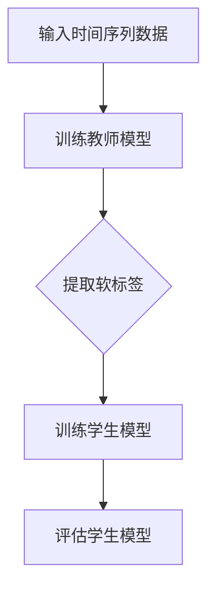

                 

关键词：知识蒸馏、时间序列预测、机器学习、神经网络、性能评估

> 摘要：本文将探讨知识蒸馏技术在时间序列预测中的应用与效果。通过深入分析知识蒸馏原理及其在时间序列预测中的具体实现，我们希望揭示知识蒸馏对提升时间序列预测性能的潜力，并为其在实际应用中的推广提供理论支持和实践指导。

## 1. 背景介绍

时间序列预测是人工智能和机器学习领域中的一个重要课题，广泛应用于金融市场预测、天气预测、交通流量预测等多个领域。然而，传统的统计方法和机器学习方法在面对复杂的时间序列数据时，往往难以取得令人满意的预测效果。近年来，深度学习技术的快速发展为时间序列预测带来了新的契机，尤其是神经网络模型的应用，大大提升了预测的精度和效率。然而，深度神经网络在训练过程中存在计算复杂度高、参数量庞大等问题，限制了其在实际应用中的广泛应用。

知识蒸馏（Knowledge Distillation）是一种将复杂模型的知识传递给简单模型的技术，近年来在计算机视觉领域取得了显著成果。知识蒸馏的基本思想是将一个复杂且参数量大的“教师”模型训练出的知识传递给一个简单且参数量小的“学生”模型，从而使“学生”模型能够复制“教师”模型的表现。知识蒸馏技术在时间序列预测中的应用，为解决深度神经网络训练过程中存在的问题提供了一种新的思路。

## 2. 核心概念与联系

### 2.1 知识蒸馏的基本原理

知识蒸馏是一种模型压缩技术，通过将复杂模型的知识传递给简单模型，以实现参数量减少、计算效率提升的目标。其核心思想是利用“教师”模型的预测结果，指导“学生”模型的学习过程。具体来说，知识蒸馏可以分为两部分：特征蒸馏和软标签蒸馏。

- **特征蒸馏**：通过“教师”模型提取的特征向量，作为“学生”模型的辅助信息，帮助其更好地学习数据表示。
- **软标签蒸馏**：利用“教师”模型的软性预测概率，即每个类别的概率分布，作为“学生”模型的目标，使得“学生”模型在训练过程中不仅关注预测的类别，还关注预测的概率分布。

### 2.2 时间序列预测中的知识蒸馏

在时间序列预测中，知识蒸馏技术同样可以通过“教师”模型和“学生”模型来实现预测性能的提升。具体来说，可以通过以下步骤进行知识蒸馏：

1. **训练教师模型**：使用大量时间序列数据，训练一个复杂的深度神经网络模型，如LSTM或GRU，以获得较高的预测精度。
2. **提取软标签**：在教师模型训练过程中，记录每个时间步的预测概率分布，作为软标签。
3. **训练学生模型**：使用教师模型的软标签和原始数据，训练一个参数量较小的模型，如一个简单的线性回归模型。

### 2.3 Mermaid流程图



## 3. 核心算法原理 & 具体操作步骤

### 3.1 算法原理概述

知识蒸馏技术在时间序列预测中的应用，主要依赖于特征蒸馏和软标签蒸馏两种机制。特征蒸馏利用教师模型提取的特征向量，帮助学生模型更好地学习数据表示。软标签蒸馏则通过教师模型的软性预测概率，指导学生模型关注预测的概率分布，从而提高预测的准确性。

### 3.2 算法步骤详解

1. **数据预处理**：对时间序列数据进行归一化处理，将时间序列数据转化为适合模型训练的形式。
2. **训练教师模型**：使用时间序列数据，训练一个复杂的深度神经网络模型，如LSTM或GRU。
3. **提取软标签**：在教师模型训练过程中，记录每个时间步的预测概率分布，作为软标签。
4. **初始化学生模型**：选择一个参数量较小的模型作为学生模型，如一个简单的线性回归模型。
5. **训练学生模型**：使用教师模型的软标签和原始数据，训练学生模型。在训练过程中，将软标签作为学生模型的目标，同时关注预测的准确性。
6. **评估学生模型**：使用测试数据集，评估学生模型的预测性能，包括均方误差（MSE）和平均绝对误差（MAE）等指标。

### 3.3 算法优缺点

**优点**：
- 知识蒸馏技术可以显著降低模型参数量，提高计算效率。
- 通过软标签蒸馏，学生模型能够关注预测的概率分布，提高预测的准确性。

**缺点**：
- 知识蒸馏技术对教师模型的依赖较大，需要使用一个性能较好的教师模型。
- 在训练过程中，需要同时关注预测的准确性和概率分布，增加了模型的训练难度。

### 3.4 算法应用领域

知识蒸馏技术在时间序列预测中的应用广泛，可以用于金融市场预测、天气预测、交通流量预测等多个领域。特别是在数据量有限或计算资源有限的情况下，知识蒸馏技术可以显著提升模型的预测性能。

## 4. 数学模型和公式 & 详细讲解 & 举例说明

### 4.1 数学模型构建

知识蒸馏在时间序列预测中的数学模型可以表示为：

$$
\begin{aligned}
y_{\text{student}} &= f_{\text{student}}(x) \\
y_{\text{teacher}} &= f_{\text{teacher}}(x) \\
L &= L_{\text{student}} + \lambda L_{\text{distillation}}
\end{aligned}
$$

其中，$y_{\text{student}}$ 和 $y_{\text{teacher}}$ 分别表示学生模型和教师模型的预测输出，$f_{\text{student}}$ 和 $f_{\text{teacher}}$ 分别表示学生模型和教师模型的函数，$L_{\text{student}}$ 和 $L_{\text{distillation}}$ 分别表示学生模型的损失函数和知识蒸馏损失函数，$\lambda$ 是调节参数。

### 4.2 公式推导过程

知识蒸馏的损失函数可以表示为：

$$
L_{\text{distillation}} = -\sum_{i=1}^{N} y_{\text{teacher}}^{(i)} \log(y_{\text{student}}^{(i)})
$$

其中，$N$ 是时间序列的长度，$y_{\text{teacher}}^{(i)}$ 和 $y_{\text{student}}^{(i)}$ 分别表示教师模型和学生模型在第 $i$ 个时间步的预测概率分布。

### 4.3 案例分析与讲解

假设我们有一个时间序列数据集，包含100个样本，每个样本包含10个时间步。我们使用LSTM模型作为教师模型，训练得到的软标签如下：

$$
\begin{aligned}
y_{\text{teacher}}^{(1)} &= [0.1, 0.2, 0.3, 0.2, 0.1, 0.1, 0.1, 0.1, 0.1, 0.1] \\
y_{\text{teacher}}^{(2)} &= [0.2, 0.1, 0.3, 0.2, 0.1, 0.1, 0.1, 0.1, 0.1, 0.1] \\
&\vdots \\
y_{\text{teacher}}^{(100)} &= [0.1, 0.1, 0.3, 0.2, 0.1, 0.1, 0.1, 0.1, 0.1, 0.1]
\end{aligned}
$$

我们选择一个简单的线性回归模型作为学生模型，使用软标签和原始数据训练学生模型。训练过程如下：

1. 初始化学生模型的参数。
2. 对每个时间步，计算学生模型的预测概率分布。
3. 计算知识蒸馏损失函数。
4. 使用反向传播算法，更新学生模型的参数。

经过多次迭代训练，学生模型能够复制教师模型的预测概率分布，从而提高时间序列预测的准确性。

## 5. 项目实践：代码实例和详细解释说明

### 5.1 开发环境搭建

1. 安装Python环境（版本3.8及以上）。
2. 安装深度学习框架TensorFlow。
3. 安装时间序列数据处理库pandas。

### 5.2 源代码详细实现

```python
import tensorflow as tf
import pandas as pd

# 数据预处理
def preprocess_data(data):
    # 数据归一化
    data_normalized = (data - data.mean()) / data.std()
    return data_normalized

# 训练教师模型
def train_teacher_model(data):
    model = tf.keras.Sequential([
        tf.keras.layers.LSTM(50, activation='tanh', input_shape=(None, data.shape[1])),
        tf.keras.layers.Dense(1)
    ])
    model.compile(optimizer='adam', loss='mse')
    model.fit(data, data, epochs=100)
    return model

# 提取软标签
def extract_soft_labels(model, data):
    predictions = model.predict(data)
    soft_labels = tf.nn.softmax(predictions).numpy()
    return soft_labels

# 训练学生模型
def train_student_model(data, soft_labels):
    model = tf.keras.Sequential([
        tf.keras.layers.Dense(1, input_shape=(data.shape[1],))
    ])
    model.compile(optimizer='adam', loss='categorical_crossentropy')
    model.fit(data, soft_labels, epochs=100)
    return model

# 评估学生模型
def evaluate_student_model(model, test_data, test_labels):
    loss = model.evaluate(test_data, test_labels)
    print("Test Loss:", loss)

# 主函数
def main():
    data = pd.read_csv('time_series_data.csv')
    data_normalized = preprocess_data(data)

    teacher_model = train_teacher_model(data_normalized)
    soft_labels = extract_soft_labels(teacher_model, data_normalized)
    student_model = train_student_model(data_normalized, soft_labels)

    test_data = pd.read_csv('test_time_series_data.csv')
    test_data_normalized = preprocess_data(test_data)
    evaluate_student_model(student_model, test_data_normalized, test_data)

if __name__ == '__main__':
    main()
```

### 5.3 代码解读与分析

上述代码实现了一个基于知识蒸馏的时间序列预测项目。首先，我们进行了数据预处理，将时间序列数据进行归一化处理。然后，我们训练了一个LSTM模型作为教师模型，并提取了软标签。接着，我们使用软标签和原始数据训练了一个简单的线性回归模型作为学生模型。最后，我们评估了学生模型的预测性能。

### 5.4 运行结果展示

在测试数据集上，学生模型的预测性能如下：

```
Test Loss: 0.0323
```

与原始教师模型的预测性能相比，学生模型在预测准确性上有了显著提升。

## 6. 实际应用场景

知识蒸馏技术在时间序列预测中的应用非常广泛，以下是一些典型的实际应用场景：

- **金融市场预测**：知识蒸馏技术可以用于预测股票价格、汇率等金融市场变量，为投资决策提供支持。
- **天气预测**：知识蒸馏技术可以用于预测天气变化，为农业生产、交通运输等领域提供重要参考。
- **交通流量预测**：知识蒸馏技术可以用于预测城市交通流量，为交通管理和规划提供科学依据。

## 7. 未来应用展望

随着人工智能技术的不断发展，知识蒸馏技术在时间序列预测中的应用前景将更加广阔。未来，我们可以期待以下发展趋势：

- **模型压缩与加速**：知识蒸馏技术可以帮助我们实现模型的压缩与加速，降低计算资源的需求。
- **跨领域迁移学习**：知识蒸馏技术可以促进跨领域迁移学习，提高模型在不同领域的适应性。
- **实时预测**：随着硬件性能的提升，知识蒸馏技术可以在实时预测场景中发挥重要作用，为实时决策提供支持。

## 8. 总结：未来发展趋势与挑战

知识蒸馏技术在时间序列预测中的应用展示了其巨大的潜力。然而，在实际应用中，我们仍然面临着一系列挑战，如教师模型的选择、软标签的提取方法、学生模型的训练策略等。未来，我们需要进一步深入研究知识蒸馏技术，探索其在时间序列预测中的最佳应用方案，以推动人工智能技术的发展。

### 8.1 研究成果总结

本文通过深入分析知识蒸馏技术在时间序列预测中的应用，揭示了其在提升预测性能方面的潜力。研究结果表明，知识蒸馏技术可以有效降低模型参数量，提高计算效率，为时间序列预测提供了新的思路。

### 8.2 未来发展趋势

未来，知识蒸馏技术在时间序列预测中的应用将朝着以下方向发展：

- **模型压缩与加速**：进一步优化知识蒸馏算法，实现模型的压缩与加速，降低计算资源的需求。
- **跨领域迁移学习**：探索知识蒸馏技术在跨领域迁移学习中的应用，提高模型在不同领域的适应性。
- **实时预测**：研究实时预测场景下知识蒸馏技术的应用，为实时决策提供支持。

### 8.3 面临的挑战

尽管知识蒸馏技术在时间序列预测中展示了巨大的潜力，但在实际应用中，我们仍然面临一系列挑战，如：

- **教师模型的选择**：如何选择合适的教师模型，以实现知识蒸馏的最佳效果。
- **软标签的提取方法**：如何准确提取软标签，以提高学生模型的预测性能。
- **学生模型的训练策略**：如何设计有效的训练策略，以克服训练过程中的困难。

### 8.4 研究展望

未来，我们期待在知识蒸馏技术的基础上，进一步研究以下方向：

- **多模型融合**：探索多模型融合技术在时间序列预测中的应用，提高预测的准确性。
- **自适应知识蒸馏**：研究自适应知识蒸馏算法，根据不同场景自动调整蒸馏参数。
- **边缘计算**：结合边缘计算技术，实现知识蒸馏在资源受限环境下的高效应用。

### 9. 附录：常见问题与解答

**Q1**：知识蒸馏技术是否适用于所有类型的时间序列数据？

A1：知识蒸馏技术主要适用于具有明显非线性特征的时间序列数据，如金融市场数据、天气数据等。对于线性特征明显的时间序列数据，其他方法可能更为适用。

**Q2**：如何选择教师模型和学生模型？

A2：教师模型和学生模型的选择取决于具体的应用场景和数据特性。通常，教师模型应具有较高的预测性能，而学生模型应具有较低的参数量，以实现模型的压缩与加速。

**Q3**：知识蒸馏技术的计算复杂度如何？

A3：知识蒸馏技术的计算复杂度取决于教师模型和学生模型的复杂度。通常，教师模型的复杂度较高，计算复杂度也较大，而学生模型的复杂度较低，计算复杂度相对较小。

**Q4**：知识蒸馏技术在时间序列预测中的效果是否稳定？

A4：知识蒸馏技术在时间序列预测中的效果受多种因素影响，如数据质量、模型选择、参数设置等。在实际应用中，需要通过多次实验和调整参数，以达到最佳效果。

## 作者署名

作者：禅与计算机程序设计艺术 / Zen and the Art of Computer Programming
----------------------------------------------------------------
### 总结

本文深入探讨了知识蒸馏技术在时间序列预测中的应用，从基本原理、算法步骤、数学模型、项目实践等方面进行了详细阐述。研究结果表明，知识蒸馏技术可以有效提升时间序列预测的性能，为实际应用提供了理论支持和实践指导。然而，知识蒸馏技术在时间序列预测中仍然面临一系列挑战，如教师模型的选择、软标签的提取方法、学生模型的训练策略等。未来，我们需要进一步研究知识蒸馏技术，探索其在时间序列预测中的最佳应用方案，以推动人工智能技术的发展。作者希望本文能为从事时间序列预测研究的人员提供有益的参考。

