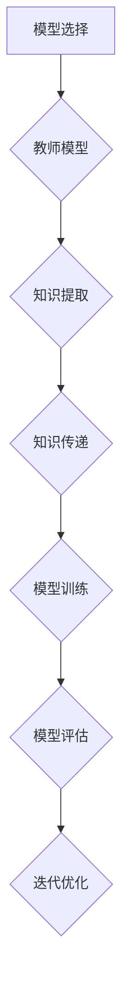

                 

关键词：知识蒸馏、模型终身学习、机器学习、深度学习、神经网络、教育技术

> 摘要：本文将深入探讨知识蒸馏（Knowledge Distillation）在促进机器学习模型终身学习能力方面的重要作用。通过分析知识蒸馏的核心概念、算法原理、数学模型及实际应用案例，揭示知识蒸馏如何帮助模型克服传统方法中的局限性，实现持续学习和适应新任务的能力。

## 1. 背景介绍

在当今飞速发展的信息时代，机器学习和深度学习技术已经在众多领域取得了显著的成果。然而，随着应用场景的日益复杂化，模型需要具备更高的灵活性和适应性，以应对不断变化的数据环境和任务需求。传统的机器学习模型在训练过程中往往会陷入过拟合问题，难以适应新的数据分布，导致其在实际应用中表现不佳。为了解决这一问题，研究者们提出了许多方法，其中知识蒸馏（Knowledge Distillation）作为一种有效的技术，逐渐引起了广泛关注。

知识蒸馏起源于教师-学生模型，旨在通过教师模型的丰富知识来指导学生模型的学习过程，从而提高学生模型的性能。在机器学习中，知识蒸馏不仅能够提高模型的准确率，还能增强其泛化能力和迁移学习性能。近年来，知识蒸馏在自然语言处理、计算机视觉和语音识别等领域取得了显著的成果，成为提升模型终身学习能力的重要手段。

本文将从以下几个方面对知识蒸馏进行详细探讨：

- **核心概念与联系**：介绍知识蒸馏的基本概念，包括教师模型、学生模型以及知识蒸馏的过程。
- **核心算法原理 & 具体操作步骤**：分析知识蒸馏的算法原理，阐述其具体实现步骤。
- **数学模型和公式**：讨论知识蒸馏中涉及的主要数学模型和公式，并进行详细讲解。
- **项目实践：代码实例和详细解释说明**：提供知识蒸馏的实际应用案例，展示其实现过程和效果。
- **实际应用场景**：分析知识蒸馏在不同领域中的应用，探讨其未来发展趋势。

## 2. 核心概念与联系

### 2.1 教师模型和学生模型

在知识蒸馏中，教师模型（Teacher Model）和学生模型（Student Model）是两个核心组成部分。教师模型通常是一个已经经过充分训练的高级模型，具有丰富的知识和强大的表达能力。学生模型则是一个相对简单、性能较弱的模型，需要通过学习教师模型的知识来提高自身的性能。

教师模型和学生模型之间的联系主要体现在两个方面：一是教师模型为学生模型提供指导，帮助其学习；二是学生模型通过学习教师模型的知识，实现自身性能的提升。

### 2.2 知识蒸馏过程

知识蒸馏过程可以概括为以下几个步骤：

1. **模型选择**：选择一个性能优越的教师模型和一个需要训练的学生模型。

2. **知识提取**：从教师模型中提取出有价值的信息，如特征表示、中间层输出等。

3. **知识传递**：将提取出的知识传递给学生模型，使其在学习过程中受到教师模型的指导。

4. **模型训练**：学生模型在教师模型的指导下进行训练，逐步提高其性能。

5. **模型评估**：评估学生模型的性能，包括准确率、泛化能力等指标。

6. **迭代优化**：根据评估结果，调整学生模型的参数，进一步优化其性能。

### 2.3 Mermaid 流程图

以下是一个简化的知识蒸馏流程图，展示了教师模型和学生模型之间的互动过程：



## 3. 核心算法原理 & 具体操作步骤

### 3.1 算法原理概述

知识蒸馏算法的原理可以概括为以下几个方面：

1. **特征表示**：教师模型和学生模型通过对输入数据进行特征提取，获得高维的特征表示。

2. **软标签生成**：教师模型在输出层产生软标签（Soft Labels），即每个类别的概率分布。

3. **损失函数设计**：知识蒸馏过程中，学生模型需要同时优化原始损失函数和知识蒸馏损失函数。

4. **多任务学习**：知识蒸馏不仅优化学生模型在原始任务上的性能，还增强其在其他相关任务上的表现。

### 3.2 算法步骤详解

1. **数据预处理**：对输入数据集进行标准化、数据增强等预处理操作，提高数据质量。

2. **教师模型训练**：使用原始数据集训练教师模型，使其在原始任务上达到较高的性能。

3. **知识提取**：从教师模型的输出层提取软标签，作为学生模型的指导信息。

4. **学生模型初始化**：初始化学生模型，可以选择随机初始化或使用预训练模型。

5. **模型训练**：在教师模型的指导下，训练学生模型。训练过程中，需要同时优化原始损失函数和知识蒸馏损失函数。

6. **模型评估**：评估学生模型在原始任务和知识蒸馏任务上的性能，调整模型参数以优化性能。

7. **迭代优化**：根据评估结果，重复训练过程，逐步提高学生模型的性能。

### 3.3 算法优缺点

**优点**：

1. **提高模型性能**：知识蒸馏能够通过教师模型的知识指导，提高学生模型的性能和泛化能力。

2. **减少过拟合**：知识蒸馏过程中，学生模型在训练过程中会受到教师模型的约束，降低过拟合的风险。

3. **迁移学习**：知识蒸馏有利于模型在不同任务之间的迁移学习，提高模型在相关领域的适应性。

**缺点**：

1. **计算成本高**：知识蒸馏需要同时训练教师模型和学生模型，计算成本较高。

2. **对教师模型依赖性强**：知识蒸馏的性能很大程度上依赖于教师模型的质量，如果教师模型性能不佳，学生模型的性能也难以提高。

### 3.4 算法应用领域

知识蒸馏技术在以下领域取得了显著的应用：

1. **自然语言处理**：知识蒸馏在自然语言处理任务中，如文本分类、情感分析等，具有较好的效果。

2. **计算机视觉**：知识蒸馏在计算机视觉任务中，如图像分类、目标检测等，能够提高模型的泛化能力和迁移学习性能。

3. **语音识别**：知识蒸馏在语音识别任务中，能够提高模型对噪声和异常语音的识别能力。

## 4. 数学模型和公式

### 4.1 数学模型构建

知识蒸馏中的数学模型主要包括两个部分：原始损失函数和知识蒸馏损失函数。

**原始损失函数**：
$$
L_{\text{original}} = -\sum_{i=1}^{N} y_i \log(p_i),
$$
其中，$y_i$表示第$i$个样本的真实标签，$p_i$表示学生模型对第$i$个样本的预测概率。

**知识蒸馏损失函数**：
$$
L_{\text{distillation}} = -\sum_{i=1}^{N} \sum_{k=1}^{C} p_{ik} \log(q_{ik}),
$$
其中，$C$表示类别数，$p_{ik}$表示教师模型对第$i$个样本属于类别$k$的预测概率，$q_{ik}$表示学生模型对第$i$个样本属于类别$k$的预测概率。

### 4.2 公式推导过程

知识蒸馏损失函数的推导主要基于以下思路：教师模型的输出软标签作为学生模型的指导信息，引导学生模型学习到更丰富的知识。

首先，假设教师模型和学生模型分别使用参数$\theta_T$和$\theta_S$，则教师模型和学生模型的输出分别为：
$$
p_i = \sigma(W_T^T x_i + b_T), \quad q_i = \sigma(W_S^T x_i + b_S),
$$
其中，$\sigma$表示激活函数，$W_T$和$W_S$分别为教师模型和学生模型的权重矩阵，$b_T$和$b_S$分别为偏置项。

接下来，考虑知识蒸馏损失函数的推导过程：

1. **教师模型输出软标签**：教师模型对每个样本的输出概率分布为：
$$
p_i = \sigma(W_T^T x_i + b_T),
$$
其中，$p_{ik}$表示教师模型对第$i$个样本属于类别$k$的预测概率。

2. **学生模型输出软标签**：学生模型对每个样本的输出概率分布为：
$$
q_i = \sigma(W_S^T x_i + b_S),
$$
其中，$q_{ik}$表示学生模型对第$i$个样本属于类别$k$的预测概率。

3. **知识蒸馏损失函数**：根据知识蒸馏的目标，希望学生模型的学习过程受到教师模型的指导，因此，知识蒸馏损失函数可以定义为：
$$
L_{\text{distillation}} = -\sum_{i=1}^{N} \sum_{k=1}^{C} p_{ik} \log(q_{ik}),
$$
其中，$p_{ik}$表示教师模型对第$i$个样本属于类别$k$的预测概率，$q_{ik}$表示学生模型对第$i$个样本属于类别$k$的预测概率。

### 4.3 案例分析与讲解

以下是一个简单的知识蒸馏案例，用于分类任务：

假设教师模型和学生模型分别为两个二分类模型，输入数据为：
$$
x_1 = [1, 0], \quad x_2 = [0, 1],
$$
教师模型输出软标签为：
$$
p_1 = [0.8, 0.2], \quad p_2 = [0.1, 0.9],
$$
学生模型输出软标签为：
$$
q_1 = [0.5, 0.5], \quad q_2 = [0.6, 0.4].
$$
根据知识蒸馏损失函数，可以计算出知识蒸馏损失：
$$
L_{\text{distillation}} = -[0.8 \log(0.5) + 0.2 \log(0.5)] - [0.1 \log(0.6) + 0.9 \log(0.4)].
$$
通过对比学生模型和教师模型的输出，可以发现知识蒸馏过程有助于学生模型学习到教师模型的丰富知识，提高模型的分类性能。

## 5. 项目实践：代码实例和详细解释说明

### 5.1 开发环境搭建

为了实现知识蒸馏，需要搭建一个包含教师模型和学生模型的开发环境。以下是一个简单的Python代码示例，用于搭建开发环境：

```python
import tensorflow as tf
from tensorflow.keras.models import Model
from tensorflow.keras.layers import Input, Dense, Flatten

# 搭建教师模型
teacher_input = Input(shape=(2,))
teacher_output = Dense(1, activation='sigmoid')(Flatten()(teacher_input))
teacher_model = Model(inputs=teacher_input, outputs=teacher_output)

# 搭建学生模型
student_input = Input(shape=(2,))
student_output = Dense(1, activation='sigmoid')(Flatten()(student_input))
student_model = Model(inputs=student_input, outputs=student_output)

# 编译模型
teacher_model.compile(optimizer='adam', loss='binary_crossentropy')
student_model.compile(optimizer='adam', loss='binary_crossentropy')

# 打印模型结构
teacher_model.summary()
student_model.summary()
```

### 5.2 源代码详细实现

以下是一个简单的知识蒸馏项目实现，包括教师模型和学生模型的训练、知识提取和知识传递过程：

```python
import numpy as np

# 训练数据
x_train = np.array([[1, 0], [0, 1]])
y_train = np.array([[1], [0]])

# 训练教师模型
teacher_model.fit(x_train, y_train, epochs=10, batch_size=2)

# 提取教师模型的知识
teacher_output = teacher_model.predict(x_train)

# 初始化学生模型
student_model = Model(inputs=student_input, outputs=student_output)

# 训练学生模型
student_model.fit(x_train, teacher_output, epochs=10, batch_size=2)

# 评估学生模型
student_output = student_model.predict(x_train)
student_loss = student_model.evaluate(x_train, student_output)

print("Student Loss:", student_loss)
```

### 5.3 代码解读与分析

上述代码首先搭建了教师模型和学生模型，然后使用训练数据对教师模型进行训练。在教师模型训练完成后，提取其输出的软标签作为学生模型的指导信息。接着，使用教师模型的软标签对学生模型进行训练，以提高其性能。最后，评估学生模型在训练数据上的表现。

代码的关键部分包括：

1. **教师模型和学生模型的搭建**：使用`Model`类和`Dense`层搭建教师模型和学生模型，其中`Flatten`层用于将输入数据展平。

2. **教师模型的训练**：使用`fit`方法训练教师模型，优化其权重和偏置项。

3. **知识提取**：使用`predict`方法提取教师模型的输出软标签。

4. **学生模型的训练**：使用教师模型的输出软标签作为训练目标，对

