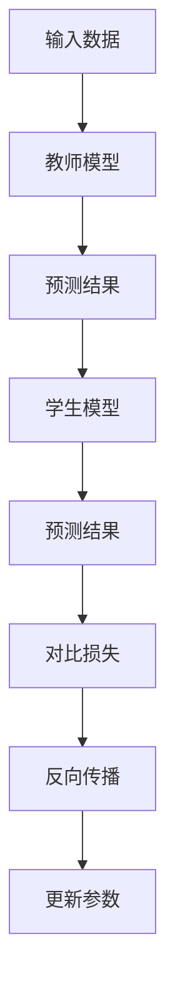

                 

关键词：知识蒸馏、模型可解释性、神经网络、深度学习

> 摘要：知识蒸馏是一种流行的技术，用于提高深度学习模型的可解释性。本文将探讨知识蒸馏的基本原理、实施步骤以及如何通过知识蒸馏提升模型的可解释性。

## 1. 背景介绍

深度学习已经成为人工智能领域的核心技术，尤其在计算机视觉、自然语言处理等领域取得了显著的成果。然而，随着模型复杂性的增加，模型的解释性变得越来越困难。许多深度学习模型被视为“黑箱”，即使模型内部结构和参数都已知，人们也很难理解模型如何做出决策。

提升模型的可解释性是当前研究的热点问题之一。可解释性有助于增强人们对模型的信任，使得模型在实际应用中更加可靠。知识蒸馏（Knowledge Distillation）作为一种提高模型性能和可解释性的技术，近年来受到了广泛关注。本文将介绍知识蒸馏的基本原理、实施步骤以及如何通过知识蒸馏提升模型的可解释性。

## 2. 核心概念与联系

### 2.1 深度学习模型与可解释性

深度学习模型通常由多层神经网络组成，通过反向传播算法训练得到。虽然深度学习模型在处理大量数据时表现出色，但其内部决策过程往往难以解释。这导致在实际应用中，人们很难理解模型为何做出特定的预测。

可解释性是指模型在决策过程中能够提供清晰的解释。一个具有良好可解释性的模型，可以让人们理解模型是如何处理输入数据并做出预测的。

### 2.2 知识蒸馏的概念

知识蒸馏是一种将模型内部知识转移至另一个模型的训练过程。通常，知识蒸馏涉及两个模型：教师模型（Teacher Model）和学生模型（Student Model）。教师模型是一个性能优秀的深度学习模型，而学生模型是一个结构更简单、参数更少的模型。

知识蒸馏的目标是通过训练学生模型，使其能够模仿教师模型的决策过程。这样，即使学生模型的复杂度较低，也能够达到与教师模型相似的预测性能。

### 2.3 Mermaid 流程图

下面是一个简单的 Mermaid 流程图，描述了知识蒸馏的基本原理和过程：



## 3. 核心算法原理 & 具体操作步骤

### 3.1 算法原理概述

知识蒸馏的核心思想是将教师模型的内部知识转移至学生模型。具体来说，知识蒸馏通过以下步骤实现：

1. **生成软标签**：教师模型对输入数据进行预测，生成软标签（Soft Labels）。软标签是一个概率分布，表示教师模型对每个类别的置信度。
2. **损失函数设计**：学生模型需要同时最小化两个损失函数：原始损失函数（如交叉熵损失）和知识蒸馏损失函数。知识蒸馏损失函数用于衡量学生模型的预测结果与教师模型软标签之间的差异。
3. **反向传播与参数更新**：通过反向传播算法，学生模型不断调整参数，以最小化总损失函数。

### 3.2 算法步骤详解

1. **初始化模型**：首先，初始化教师模型和学生模型。教师模型通常是一个具有较高性能的深度学习模型，学生模型则是一个结构更简单、参数更少的模型。
2. **生成软标签**：使用教师模型对输入数据进行预测，生成软标签。软标签可以看作是教师模型对每个类别的概率分布。
3. **设计损失函数**：知识蒸馏损失函数通常由两部分组成：原始损失函数（如交叉熵损失）和知识蒸馏损失函数。原始损失函数用于衡量学生模型的预测结果与实际标签之间的差异，知识蒸馏损失函数用于衡量学生模型的预测结果与教师模型软标签之间的差异。
4. **反向传播与参数更新**：通过反向传播算法，学生模型不断调整参数，以最小化总损失函数。在训练过程中，学生模型的参数会逐渐收敛，使得其预测结果与教师模型软标签越来越接近。

### 3.3 算法优缺点

**优点**：

1. 提高模型性能：知识蒸馏能够将教师模型的内部知识转移至学生模型，从而提高学生模型的性能。
2. 降低模型复杂度：通过使用结构更简单、参数更少的学生模型，知识蒸馏有助于降低模型复杂度，提高模型的可解释性。

**缺点**：

1. 训练成本较高：知识蒸馏需要同时训练教师模型和学生模型，训练成本相对较高。
2. 教师模型依赖性较强：知识蒸馏的性能高度依赖于教师模型的质量，如果教师模型本身存在缺陷，学生模型也可能受到影响。

### 3.4 算法应用领域

知识蒸馏在多个领域具有广泛的应用前景，主要包括：

1. **计算机视觉**：知识蒸馏可以用于图像分类、目标检测等任务，提高模型性能和可解释性。
2. **自然语言处理**：知识蒸馏可以用于文本分类、机器翻译等任务，提高模型性能和可解释性。
3. **医疗领域**：知识蒸馏可以用于医疗图像分析、疾病预测等任务，提高模型性能和可解释性。

## 4. 数学模型和公式 & 详细讲解 & 举例说明

### 4.1 数学模型构建

知识蒸馏的数学模型可以表示为：

$$
L = L_{original} + \lambda L_{distillation}
$$

其中，$L_{original}$是原始损失函数，$L_{distillation}$是知识蒸馏损失函数，$\lambda$是平衡系数。

### 4.2 公式推导过程

知识蒸馏的推导过程如下：

1. **原始损失函数**：

$$
L_{original} = -\sum_{i=1}^{N} y_i \log(p_i)
$$

其中，$N$是样本数量，$y_i$是第$i$个样本的实际标签，$p_i$是学生模型对第$i$个样本的预测概率。

2. **知识蒸馏损失函数**：

$$
L_{distillation} = -\sum_{i=1}^{N} \sum_{j=1}^{C} t_{ij} \log(s_{ij})
$$

其中，$C$是类别数量，$t_{ij}$是教师模型对第$i$个样本属于第$j$个类别的置信度，$s_{ij}$是学生模型对第$i$个样本属于第$j$个类别的预测概率。

3. **总损失函数**：

$$
L = L_{original} + \lambda L_{distillation}
$$

其中，$\lambda$是平衡系数，用于调整原始损失函数和知识蒸馏损失函数的权重。

### 4.3 案例分析与讲解

假设有一个二分类问题，教师模型和学生模型分别预测出一个样本属于正类的概率为0.9和0.8。实际标签为正类。

1. **原始损失函数**：

$$
L_{original} = -1 \times \log(0.8) = 0.223
$$

2. **知识蒸馏损失函数**：

$$
L_{distillation} = -0.9 \times \log(0.8) = 0.412
$$

3. **总损失函数**：

$$
L = 0.223 + 0.412 = 0.635
$$

在这个案例中，知识蒸馏损失函数的值较大，因为学生模型的预测概率与教师模型的置信度存在较大差距。通过反向传播算法，学生模型将逐渐调整参数，提高预测概率，减小知识蒸馏损失函数的值。

## 5. 项目实践：代码实例和详细解释说明

### 5.1 开发环境搭建

为了演示知识蒸馏，我们将使用 TensorFlow 和 Keras 框架。首先，确保已经安装了 TensorFlow 和 Keras。如果没有，可以使用以下命令安装：

```bash
pip install tensorflow
pip install keras
```

### 5.2 源代码详细实现

下面是一个简单的知识蒸馏示例代码：

```python
from tensorflow.keras.models import Model
from tensorflow.keras.layers import Input, Dense
from tensorflow.keras.optimizers import Adam

# 创建教师模型和学生模型
input_data = Input(shape=(784,))
teacher_model = Model(input_data, Dense(10, activation='softmax'))
student_model = Model(input_data, Dense(10, activation='softmax'))

# 编译教师模型和学生模型
teacher_model.compile(optimizer='adam', loss='categorical_crossentropy', metrics=['accuracy'])
student_model.compile(optimizer=Adam(learning_rate=0.001), loss='categorical_crossentropy', metrics=['accuracy'])

# 生成教师模型的软标签
teacher_model.fit(x_train, y_train, epochs=10, batch_size=32)

# 计算学生模型的损失函数
soft_labels = teacher_model.predict(x_train)
student_model.train_on_batch(x_train, soft_labels)

# 训练学生模型
student_model.fit(x_train, y_train, epochs=10, batch_size=32)

# 评估学生模型
loss, accuracy = student_model.evaluate(x_test, y_test)
print(f"Test loss: {loss}, Test accuracy: {accuracy}")
```

### 5.3 代码解读与分析

在这个示例中，我们首先创建了教师模型和学生模型。教师模型是一个简单的多层感知机（MLP）模型，输入层有784个神经元，输出层有10个神经元。学生模型与教师模型的结构相同。

接下来，我们使用`compile`方法编译教师模型和学生模型。教师模型使用`categorical_crossentropy`作为损失函数，学生模型使用`categorical_crossentropy`作为损失函数。

然后，我们使用`fit`方法训练教师模型。在训练过程中，教师模型会生成软标签。

接下来，我们使用`predict`方法计算学生模型的预测结果，并使用`train_on_batch`方法更新学生模型的参数。

最后，我们使用`fit`方法训练学生模型。在训练过程中，学生模型的预测结果将逐渐接近教师模型的软标签。

最后，我们使用`evaluate`方法评估学生模型的性能。

## 6. 实际应用场景

知识蒸馏在多个实际应用场景中具有广泛的应用。以下是一些典型的应用案例：

1. **计算机视觉**：在图像分类、目标检测等任务中，知识蒸馏可以用于提高模型性能和可解释性。例如，可以使用一个复杂的卷积神经网络（CNN）作为教师模型，使用一个结构更简单、参数更少的学生模型，从而提高模型的可解释性。
2. **自然语言处理**：在文本分类、机器翻译等任务中，知识蒸馏可以用于提高模型性能和可解释性。例如，可以使用一个复杂的循环神经网络（RNN）或Transformer模型作为教师模型，使用一个结构更简单、参数更少的学生模型，从而提高模型的可解释性。
3. **医疗领域**：在医疗图像分析、疾病预测等任务中，知识蒸馏可以用于提高模型性能和可解释性。例如，可以使用一个复杂的深度神经网络作为教师模型，使用一个结构更简单、参数更少的学生模型，从而提高模型的可解释性。

## 7. 工具和资源推荐

### 7.1 学习资源推荐

1. **书籍**：《深度学习》（Ian Goodfellow、Yoshua Bengio、Aaron Courville 著）：这是一本经典的深度学习教材，涵盖了深度学习的基础知识、算法和应用。
2. **在线课程**：Coursera 上的“深度学习”课程：由 Andrew Ng 教授主讲，介绍了深度学习的基础知识和应用。

### 7.2 开发工具推荐

1. **框架**：TensorFlow、PyTorch：这两个框架是当前最受欢迎的深度学习框架，提供了丰富的工具和资源。
2. **库**：NumPy、Pandas：这两个库提供了强大的数据处理和分析功能，有助于深度学习项目的研究和开发。

### 7.3 相关论文推荐

1. **论文**：《Knowledge Distillation: A Review》（2020）：这是一篇关于知识蒸馏的综述性论文，详细介绍了知识蒸馏的历史、原理和应用。
2. **论文**：《DenseNet: A Systematic Study of Connections between Deep and Shallow Networks》（2016）：这是一篇关于深度神经网络结构优化的论文，提出了 DenseNet 结构，对知识蒸馏技术具有一定的启示意义。

## 8. 总结：未来发展趋势与挑战

### 8.1 研究成果总结

近年来，知识蒸馏技术取得了显著的成果，在多个领域获得了广泛应用。通过知识蒸馏，可以显著提高模型性能和可解释性，降低模型复杂度。此外，知识蒸馏技术还在不断发展和创新，未来有望在更多领域取得突破。

### 8.2 未来发展趋势

1. **模型压缩与加速**：知识蒸馏可以用于模型压缩和加速，从而提高深度学习模型在实际应用中的性能和效率。
2. **跨域迁移学习**：知识蒸馏可以用于跨域迁移学习，从而实现不同领域之间的知识共享和迁移。
3. **可解释性增强**：知识蒸馏可以与可解释性技术相结合，进一步提高模型的可解释性。

### 8.3 面临的挑战

1. **教师模型依赖性**：知识蒸馏的性能高度依赖于教师模型的质量，如何设计更有效的教师模型是一个重要的挑战。
2. **训练成本**：知识蒸馏需要同时训练教师模型和学生模型，训练成本较高，如何优化训练过程是一个重要的挑战。
3. **泛化能力**：知识蒸馏模型在特定领域表现出色，但在其他领域可能存在泛化能力不足的问题，如何提高模型的泛化能力是一个重要的挑战。

### 8.4 研究展望

知识蒸馏技术在深度学习领域的应用前景广阔，未来将继续发展和创新。通过不断优化教师模型设计、训练过程和模型结构，知识蒸馏技术有望在更多领域取得突破。同时，知识蒸馏技术还可以与其他可解释性技术相结合，进一步提高模型的可解释性，为人工智能的发展贡献力量。

## 9. 附录：常见问题与解答

### 9.1 问题1：知识蒸馏与模型压缩有何区别？

知识蒸馏和模型压缩都是提高深度学习模型性能和效率的技术，但目标和方法有所不同。

知识蒸馏的目标是通过将教师模型的知识转移到学生模型，提高学生模型的性能和可解释性。知识蒸馏通常涉及两个模型：教师模型和学生模型。教师模型是一个性能优秀的深度学习模型，学生模型是一个结构更简单、参数更少的模型。知识蒸馏通过训练学生模型，使其能够模仿教师模型的决策过程。

模型压缩的目标是通过减少模型参数和计算量，提高深度学习模型的运行效率。模型压缩通常包括两种方法：模型剪枝和量化。模型剪枝通过删除不重要的神经元和连接，减少模型参数。量化通过将浮点数参数转换为低比特宽度的整数表示，降低模型计算量。

### 9.2 问题2：知识蒸馏是否适用于所有任务？

知识蒸馏技术在一定程度上适用于各种深度学习任务，但并非所有任务都适合使用知识蒸馏。

知识蒸馏在图像分类、目标检测、文本分类等任务中表现出色。这些任务通常具有丰富的数据和标签信息，教师模型和学生模型可以从中学习到有效的特征表示。此外，知识蒸馏在跨域迁移学习和小样本学习中也具有一定的优势。

然而，知识蒸馏在部分任务中可能不适用，例如在生成模型（如生成对抗网络（GAN））中，知识蒸馏的效果较差。生成模型主要关注数据分布的学习，而知识蒸馏侧重于模型决策过程的学习。此外，知识蒸馏在部分高维数据（如图像超分辨率）中可能存在计算效率低的问题。

### 9.3 问题3：如何选择合适的教师模型和学生模型？

选择合适的教师模型和学生模型是知识蒸馏成功的关键。

选择教师模型时，应考虑以下因素：

1. **性能**：教师模型应具有较高的性能，以便为学生模型提供有效的知识。
2. **结构**：教师模型的结构应较为复杂，能够提供丰富的特征表示。
3. **数据**：教师模型应在丰富的数据集上训练，以确保知识具有较好的泛化能力。

选择学生模型时，应考虑以下因素：

1. **结构**：学生模型的结构应相对简单，易于训练和部署。
2. **参数**：学生模型的参数应相对较少，以降低模型复杂度。
3. **目标**：学生模型的目标应根据实际应用需求确定，例如提高模型性能或可解释性。

### 9.4 问题4：如何调整知识蒸馏的参数？

知识蒸馏的参数包括平衡系数$\lambda$、学习率等。调整这些参数是优化知识蒸馏性能的关键。

1. **平衡系数$\lambda$**：平衡系数$\lambda$用于调整原始损失函数和知识蒸馏损失函数的权重。合适的$\lambda$值可以平衡两个损失函数的影响，从而提高模型性能。通常，可以通过交叉验证或实验方法来确定$\lambda$的最佳值。

2. **学习率**：学习率是影响模型训练速度和稳定性的关键参数。选择合适的学习率可以加快模型收敛速度，降低过拟合风险。常用的学习率调整策略包括学习率衰减、余弦退火等。

### 9.5 问题5：知识蒸馏与其他可解释性技术如何结合？

知识蒸馏与其他可解释性技术相结合，可以进一步提高模型的可解释性。

一种常见的结合方式是将知识蒸馏与模型可解释性技术（如 Grad-CAM、LIME）结合。Grad-CAM（Gradient-weighted Class Activation Mapping）通过计算模型梯度，可视化重要特征区域。LIME（Local Interpretable Model-agnostic Explanations）通过局部线性模型，解释模型对特定样本的决策过程。

通过将知识蒸馏与这些可解释性技术结合，可以更好地理解教师模型和学生模型之间的知识传递过程，提高模型的可解释性。

---

本文旨在介绍知识蒸馏技术及其在提升模型可解释性方面的应用。通过本文的阐述，读者可以了解知识蒸馏的基本原理、实施步骤以及如何通过知识蒸馏提高模型的可解释性。知识蒸馏作为一种重要的深度学习技术，具有广泛的应用前景，未来将继续在人工智能领域发挥重要作用。

### 作者署名

作者：禅与计算机程序设计艺术 / Zen and the Art of Computer Programming

[本文完]

