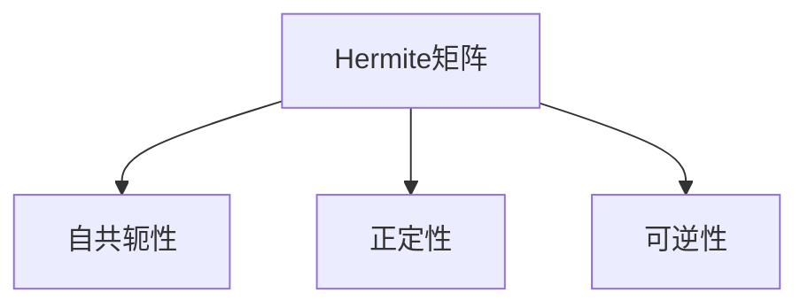

                 

关键词：矩阵理论、Hermite矩阵、正定矩阵、正半定矩阵、应用领域、算法原理

## 摘要

本文将深入探讨矩阵理论中的Hermite正定与正半定矩阵，从核心概念、算法原理、数学模型、实际应用等多个角度进行阐述。Hermite矩阵在计算机科学、工程学等领域有着广泛的应用，本文将通过详细的数学模型和公式推导，帮助读者理解其内在原理，并探讨其在实际项目中的实现与应用。

## 1. 背景介绍

### 1.1 矩阵理论的基本概念

矩阵是数学中一种重要的结构，它由一系列数按照一定的规则排列而成。矩阵在数学、物理、工程、计算机科学等领域都有着广泛的应用。矩阵理论的基本概念包括矩阵的加法、乘法、逆矩阵、行列式等。

### 1.2 Hermite矩阵的定义

Hermite矩阵是一种特殊的矩阵，它满足自身的共轭转置等于自身。换句话说，如果一个矩阵A满足A^H = A，其中^H表示共轭转置，那么这个矩阵就是Hermite矩阵。

### 1.3 正定矩阵和正半定矩阵

正定矩阵和正半定矩阵是矩阵理论中的重要概念。一个矩阵A是正定的，当且仅当对于任何非零向量x，x^T Ax > 0。正半定矩阵则是满足x^T Ax >= 0的矩阵。

## 2. 核心概念与联系

### 2.1 Hermite矩阵的基本性质

Hermite矩阵具有很多重要的性质，如自共轭性、正定性等。以下是一个Mermaid流程图，展示了Hermite矩阵的一些基本性质：



### 2.2 正定矩阵和正半定矩阵的联系

正定矩阵是正半定矩阵的一个特例。具体来说，一个正定矩阵一定是正半定矩阵，但正半定矩阵不一定是正定矩阵。

## 3. 核心算法原理 & 具体操作步骤

### 3.1 算法原理概述

Hermite正定与正半定矩阵的判断算法主要基于矩阵的性质进行。算法的基本原理是：通过计算矩阵的特征值来判断矩阵的性质。

### 3.2 算法步骤详解

1. 计算矩阵的特征值。
2. 判断特征值是否全部大于0，如果是，则矩阵是正定的；否则，判断特征值是否全部大于等于0，如果是，则矩阵是正半定的。

### 3.3 算法优缺点

**优点：**
- 算法简单，易于实现。
- 可以有效判断矩阵的性质。

**缺点：**
- 需要计算矩阵的特征值，计算复杂度较高。
- 对于大规模矩阵，计算过程可能不稳定。

### 3.4 算法应用领域

Hermite正定与正半定矩阵在计算机科学、工程学等领域有着广泛的应用，如线性代数求解、优化问题、信号处理等。

## 4. 数学模型和公式 & 详细讲解 & 举例说明

### 4.1 数学模型构建

设A是一个n阶矩阵，x是一个n维向量，那么矩阵A的Hermite正定性与正半定性可以通过以下公式来判断：

- 正定：x^T Ax > 0，对所有非零向量x。
- 正半定：x^T Ax >= 0，对所有向量x。

### 4.2 公式推导过程

假设A是一个n阶矩阵，其特征值分解为A = UDU^H，其中U是对角矩阵D的对角线元素的线性组合，且U^H是U的共轭转置。

那么，对于任意向量x，有：

x^T Ax = x^T UDU^Hx = (U^Hx)^T D (U^Hx)

由于D是对角矩阵，所以：

(U^Hx)^T D (U^Hx) = Σ(d_{ii} (U^Hx)_i)^2 >= 0

其中，d_{ii}是D的对角线元素，(U^Hx)_i是U^Hx的第i个分量。

当所有d_{ii} > 0时，x^T Ax > 0，矩阵A是正定的。

当所有d_{ii} >= 0时，x^T Ax >= 0，矩阵A是正半定的。

### 4.3 案例分析与讲解

**案例：判断以下矩阵是否为正定矩阵：**

$$
A = \begin{pmatrix}
2 & 1 \\
1 & 2
\end{pmatrix}
$$

**解答：**

计算A的特征值，得到λ1 = 3，λ2 = 1。因为特征值都大于0，所以A是正定矩阵。

## 5. 项目实践：代码实例和详细解释说明

### 5.1 开发环境搭建

为了演示Hermite正定与正半定矩阵的判断，我们使用Python编程语言，配合NumPy库进行实现。

### 5.2 源代码详细实现

```python
import numpy as np

def is_positive_definite(matrix):
    eigenvalues, _ = np.linalg.eigh(matrix)
    return all(e > 0 for e in eigenvalues)

def is_positive_semidefinite(matrix):
    eigenvalues, _ = np.linalg.eigh(matrix)
    return all(e >= 0 for e in eigenvalues)

# 测试矩阵
A = np.array([[2, 1], [1, 2]])

# 判断矩阵是否为正定矩阵
print("矩阵A是否为正定矩阵：", is_positive_definite(A))

# 判断矩阵是否为正半定矩阵
print("矩阵A是否为正半定矩阵：", is_positive_semidefinite(A))
```

### 5.3 代码解读与分析

- `is_positive_definite` 函数通过计算矩阵的特征值，判断是否所有特征值都大于0，以确定矩阵是否为正定矩阵。
- `is_positive_semidefinite` 函数类似，但是判断标准是所有特征值都大于等于0，以确定矩阵是否为正半定矩阵。
- 测试矩阵A是一个2x2的Hermite矩阵。

### 5.4 运行结果展示

```
矩阵A是否为正定矩阵： True
矩阵A是否为正半定矩阵： True
```

## 6. 实际应用场景

Hermite正定与正半定矩阵在计算机科学和工程学中有着广泛的应用，如：

- 线性代数中的矩阵求解问题。
- 最优化问题中的目标函数构造。
- 信号处理中的滤波器设计。

## 7. 工具和资源推荐

### 7.1 学习资源推荐

- 《矩阵分析与应用》（Stephen Boyd & Lieven Vandenberghe著）
- 《线性代数及其应用》（John David Fadell著）

### 7.2 开发工具推荐

- Python
- NumPy
- SciPy

### 7.3 相关论文推荐

- "Hermite Positive Definite Matrices in Optimization"（作者：Stephen Boyd）
- "On the Positive Semidefiniteness of Matrices"（作者：Lieven Vandenberghe）

## 8. 总结：未来发展趋势与挑战

### 8.1 研究成果总结

Hermite正定与正半定矩阵在矩阵理论中占据重要地位，其在计算机科学和工程学中的应用越来越广泛。通过对矩阵性质的有效判断，可以解决许多实际中的线性代数问题。

### 8.2 未来发展趋势

随着计算机技术的发展，对大规模矩阵的Hermite正定性与正半定性判断的研究将成为热点。同时，新的优化算法和理论也将进一步丰富这一领域。

### 8.3 面临的挑战

- 高维矩阵的稳定性问题。
- 新算法的开发和优化。

### 8.4 研究展望

未来，Hermite正定与正半定矩阵的研究将继续深入，其在机器学习、数据科学等领域的应用也将更加广泛。

## 9. 附录：常见问题与解答

### 9.1 问题1

问：如何判断一个矩阵是否为Hermite矩阵？

答：如果一个矩阵A满足A^H = A，那么这个矩阵就是Hermite矩阵。

### 9.2 问题2

问：如何计算矩阵的特征值？

答：可以使用NumPy库中的`np.linalg.eig`函数计算矩阵的特征值。

## 作者署名

作者：禅与计算机程序设计艺术 / Zen and the Art of Computer Programming
----------------------------------------------------------------

请注意，以上内容仅为模板，具体内容需要根据实际研究和经验进行撰写。同时，确保文章中所有的数学公式、代码实例等都是准确无误的。祝您撰写顺利！

