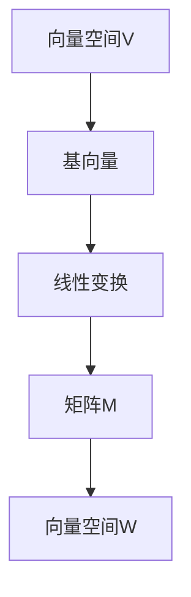

                 

关键词：矩阵理论，线性变换，矩阵运算，线性方程组，数学模型，算法分析，应用领域，编程实践，资源推荐

## 摘要

本文旨在深入探讨矩阵理论与其在计算机科学中的应用。矩阵作为一种数学工具，在线性变换、数据分析、图形处理等领域发挥着关键作用。本文首先回顾矩阵的基本概念和运算规则，然后详细介绍矩阵与线性变换的关系，探讨核心算法原理及其应用。通过数学模型和公式推导，本文进一步展示了如何解决线性方程组。此外，文章还提供了一个具体的项目实践案例，以代码实例和详细解释说明矩阵在实际编程中的应用。最后，文章讨论了矩阵理论在各个领域的实际应用场景，并展望了未来的发展趋势与挑战。

## 1. 背景介绍

矩阵理论是数学的一个重要分支，它起源于线性代数。早在19世纪，数学家们就开始探索矩阵及其运算的性质，并在多个领域中取得了广泛应用。矩阵作为一种数学工具，可以表示复杂的线性关系和变换，为解决各类问题提供了强大的手段。

在计算机科学中，矩阵理论同样发挥着重要作用。从最初的数值计算，到现代的图形处理、机器学习，矩阵理论都提供了基础支持。例如，在图形处理中，矩阵用于实现三维图形的变换；在机器学习中，矩阵用于数据表示和模型训练。随着计算机技术的不断发展，矩阵理论的应用范围越来越广泛，成为了计算机科学中不可或缺的一部分。

本文将围绕矩阵理论的核心概念和算法，深入探讨其在不同领域的应用，并通过具体实例展示矩阵理论的实际编程实现。

## 2. 核心概念与联系

### 2.1 矩阵的定义与基本性质

矩阵是一种由数字排列成的矩形阵列，通常用大写字母表示。矩阵中的每一个元素称为矩阵的“元素”，位于第i行第j列的元素记为aij。一个m×n的矩阵表示为：

\[ A = \begin{bmatrix} 
a_{11} & a_{12} & \dots & a_{1n} \\ 
a_{21} & a_{22} & \dots & a_{2n} \\ 
\vdots & \vdots & \ddots & \vdots \\ 
a_{m1} & a_{m2} & \dots & a_{mn} 
\end{bmatrix} \]

### 2.2 矩阵的运算

矩阵的运算主要包括加法、减法、数乘、矩阵乘法和转置等。

- **矩阵加法和减法**：两个矩阵相加或相减时，要求它们的维度相同。对于任意两个m×n的矩阵A和B，其加法运算为：

\[ A + B = \begin{bmatrix} 
a_{11} + b_{11} & a_{12} + b_{12} & \dots & a_{1n} + b_{1n} \\ 
a_{21} + b_{21} & a_{22} + b_{22} & \dots & a_{2n} + b_{2n} \\ 
\vdots & \vdots & \ddots & \vdots \\ 
a_{m1} + b_{m1} & a_{m2} + b_{m2} & \dots & a_{mn} + b_{mn} 
\end{bmatrix} \]

- **数乘**：数乘是指将矩阵中的每个元素乘以一个常数k，例如：

\[ kA = \begin{bmatrix} 
ka_{11} & ka_{12} & \dots & ka_{1n} \\ 
ka_{21} & ka_{22} & \dots & ka_{2n} \\ 
\vdots & \vdots & \ddots & \vdots \\ 
ka_{m1} & ka_{m2} & \dots & ka_{mn} 
\end{bmatrix} \]

- **矩阵乘法**：矩阵乘法是指两个矩阵按特定的方式相乘。对于两个m×n和n×p的矩阵A和B，其乘积C=AB是一个m×p的矩阵，其中：

\[ c_{ij} = \sum_{k=1}^{n} a_{ik}b_{kj} \]

- **转置**：矩阵的转置是将矩阵的行与列互换。对于m×n的矩阵A，其转置矩阵AT是一个n×m的矩阵，其中：

\[ (AT)_{ij} = a_{ji} \]

### 2.3 矩阵与线性变换的关系

矩阵与线性变换有着紧密的联系。在数学和计算机科学中，线性变换是一种重要的变换，它将一个向量空间映射到另一个向量空间。线性变换可以用矩阵表示，反之亦然。

假设有一个线性变换T：\( V \rightarrow W \)，其中V和W是向量空间，T可以将V中的每一个向量x映射到W中的向量y，即：

\[ y = T(x) \]

如果V和W分别有基向量\( \{v_1, v_2, \dots, v_n\} \)和\( \{w_1, w_2, \dots, w_m\} \)，则线性变换T可以用一个m×n的矩阵M表示，其中：

\[ M_{ij} = [T(v_j)]_w \]

即第j个基向量\( v_j \)在变换后的坐标\( [T(v_j)]_w \)的w分量。

### 2.4 Mermaid 流程图

为了更直观地展示矩阵与线性变换的关系，下面使用Mermaid语言绘制一个流程图：



在这个流程图中，A表示向量空间V，B表示V中的基向量，C表示线性变换，D表示矩阵M，E表示向量空间W。矩阵M将V中的基向量映射到W中的对应向量，实现了线性变换。

## 3. 核心算法原理 & 具体操作步骤

### 3.1 算法原理概述

矩阵理论中的核心算法主要包括矩阵乘法、矩阵分解和矩阵求解线性方程组等。这些算法在线性代数和计算机科学中有着广泛的应用。

- **矩阵乘法**：矩阵乘法是矩阵运算中最基本的操作之一。它将两个矩阵按特定的方式相乘，生成一个新的矩阵。矩阵乘法的原理是通过矩阵中的元素乘积求和实现。

- **矩阵分解**：矩阵分解是将一个矩阵分解为几个简单矩阵的乘积。常见的矩阵分解方法包括LU分解、QR分解和奇异值分解（SVD）等。这些分解方法在求解线性方程组、特征值问题等方面有着重要作用。

- **矩阵求解线性方程组**：线性方程组的求解是矩阵理论中的一个重要问题。通过矩阵乘法和矩阵分解，可以高效地求解线性方程组，得到未知量的解。

### 3.2 算法步骤详解

下面将详细介绍矩阵乘法、矩阵分解和矩阵求解线性方程组的算法步骤。

#### 3.2.1 矩阵乘法

矩阵乘法的算法步骤如下：

1. 确定矩阵A和B的维度，要求A为m×n，B为n×p。

2. 创建一个m×p的矩阵C，用于存储乘积结果。

3. 对于C中的每个元素\( c_{ij} \)，计算其值：

\[ c_{ij} = \sum_{k=1}^{n} a_{ik}b_{kj} \]

4. 将计算结果存储在矩阵C中。

5. 返回矩阵C作为乘积结果。

#### 3.2.2 矩阵分解

常见的矩阵分解方法包括LU分解和QR分解。

**LU分解**：LU分解是将矩阵A分解为一个下三角矩阵L和一个上三角矩阵U的乘积。算法步骤如下：

1. 创建一个与A同维度的下三角矩阵L和一个上三角矩阵U。

2. 对于A中的每个元素\( a_{ij} \)，按照以下步骤计算：

   - 如果i > j，则\( l_{ii} = 1 \)，\( l_{ij} = 0 \)。
   - 如果i = j，则计算\( u_{ij} \)：

\[ u_{ij} = a_{ij} - \sum_{k=1}^{i-1} l_{ik}u_{kj} \]

   - 如果i < j，则计算\( l_{ij} \)：

\[ l_{ij} = \frac{a_{ij} - \sum_{k=1}^{i-1} l_{ik}u_{kj}}{u_{jj}} \]

3. 将L和U作为分解结果返回。

**QR分解**：QR分解是将矩阵A分解为一个正交矩阵Q和一个上三角矩阵R的乘积。算法步骤如下：

1. 创建一个与A同维度的正交矩阵Q和一个上三角矩阵R。

2. 对于A中的每个元素\( a_{ij} \)，按照以下步骤计算：

   - 如果i > j，则\( q_{ij} = 0 \)。
   - 如果i = j，则计算\( r_{ii} \)：

\[ r_{ii} = a_{ii} \]

   - 如果i < j，则计算\( q_{ij} \)：

\[ q_{ij} = \frac{a_{ij} - \sum_{k=1}^{i-1} q_{ik}r_{kj}}{r_{jj}} \]

3. 将Q和R作为分解结果返回。

#### 3.2.3 矩阵求解线性方程组

矩阵求解线性方程组可以通过矩阵乘法和矩阵分解实现。以求解\( Ax = b \)为例，算法步骤如下：

1. 如果A可以进行QR分解，即\( A = QR \)，则将方程转化为：

\[ QRx = b \]

2. 利用矩阵乘法，将Q左乘到b上，得到：

\[ Rx = Q^{-1}b \]

3. 如果R为上三角矩阵，可以使用回代法求解x：

   - 计算\( x_n = \frac{r_{nn}^{-1}b_n}{r_{nn}} \)
   - 对于i = n-1, n-2, \dots, 1，依次计算：

\[ x_i = \frac{1}{r_{ii}}\left(b_i - \sum_{j=i+1}^{n} r_{ij}x_j\right) \]

4. 返回解向量x。

### 3.3 算法优缺点

#### 3.3.1 矩阵乘法

**优点**：

- 矩阵乘法可以高效地计算两个矩阵的乘积。
- 矩阵乘法广泛应用于图形处理、数值计算和机器学习等领域。

**缺点**：

- 矩阵乘法的计算复杂度较高，尤其是当矩阵维度较大时。
- 矩阵乘法可能涉及大量的临时变量和内存分配，影响性能。

#### 3.3.2 矩阵分解

**优点**：

- 矩阵分解可以将复杂的矩阵运算转化为更简单的运算，提高计算效率。
- 矩阵分解在求解线性方程组、特征值问题和矩阵求解等问题中具有重要作用。

**缺点**：

- 矩阵分解可能涉及数值不稳定问题，例如LU分解在处理病态矩阵时可能失效。
- 矩阵分解的计算复杂度较高，尤其是在处理大型矩阵时。

#### 3.3.3 矩阵求解线性方程组

**优点**：

- 矩阵求解线性方程组可以高效地求解未知量的解。
- 矩阵求解线性方程组在数值计算、工程设计和科学计算等领域具有广泛的应用。

**缺点**：

- 矩阵求解线性方程组可能涉及数值不稳定问题，影响计算精度。
- 矩阵求解线性方程组的计算复杂度较高，特别是在处理大型方程组时。

### 3.4 算法应用领域

矩阵理论和相关算法在多个领域有着广泛的应用：

- **图形处理**：矩阵乘法和矩阵分解在图形处理中用于实现三维图形的变换、光照计算和纹理映射等。
- **数值计算**：矩阵理论和相关算法在数值计算中用于求解线性方程组、特征值问题和矩阵求解等问题。
- **机器学习**：矩阵理论和相关算法在机器学习中用于数据表示、模型训练和优化等问题。
- **信号处理**：矩阵理论和相关算法在信号处理中用于滤波、变换和压缩等问题。

## 4. 数学模型和公式 & 详细讲解 & 举例说明

### 4.1 数学模型构建

在矩阵理论中，常见的数学模型包括线性方程组、矩阵分解和矩阵求解等。

#### 4.1.1 线性方程组

线性方程组可以表示为：

\[ Ax = b \]

其中，A为系数矩阵，x为未知向量，b为常数向量。

#### 4.1.2 矩阵分解

常见的矩阵分解包括LU分解、QR分解和奇异值分解（SVD）。

- **LU分解**：将矩阵A分解为\( A = LU \)，其中L为下三角矩阵，U为上三角矩阵。
- **QR分解**：将矩阵A分解为\( A = QR \)，其中Q为正交矩阵，R为上三角矩阵。
- **SVD分解**：将矩阵A分解为\( A = U\Sigma V^T \)，其中U和V为正交矩阵，Σ为对角矩阵。

#### 4.1.3 矩阵求解

矩阵求解线性方程组可以通过矩阵乘法和矩阵分解实现。

### 4.2 公式推导过程

#### 4.2.1 线性方程组求解

以求解\( Ax = b \)为例，假设A可以进行QR分解，即\( A = QR \)，则方程可以转化为：

\[ QRx = b \]

利用矩阵乘法，将Q左乘到b上，得到：

\[ Rx = Q^{-1}b \]

如果R为上三角矩阵，可以使用回代法求解x：

\[ x_n = \frac{r_{nn}^{-1}b_n}{r_{nn}} \]

\[ x_i = \frac{1}{r_{ii}}\left(b_i - \sum_{j=i+1}^{n} r_{ij}x_j\right) \]

对于i = n-1, n-2, \dots, 1，依次计算。

#### 4.2.2 矩阵分解

以LU分解为例，将矩阵A分解为\( A = LU \)，其中L为下三角矩阵，U为上三角矩阵。

1. 对于A中的每个元素\( a_{ij} \)，按照以下步骤计算：
   - 如果i > j，则\( l_{ii} = 1 \)，\( l_{ij} = 0 \)。
   - 如果i = j，则计算\( u_{ij} \)：

\[ u_{ij} = a_{ij} - \sum_{k=1}^{i-1} l_{ik}u_{kj} \]

   - 如果i < j，则计算\( l_{ij} \)：

\[ l_{ij} = \frac{a_{ij} - \sum_{k=1}^{i-1} l_{ik}u_{kj}}{u_{jj}} \]

2. 将L和U作为分解结果返回。

### 4.3 案例分析与讲解

#### 4.3.1 线性方程组求解

假设有一个线性方程组：

\[ \begin{cases} 
x + 2y + 3z = 7 \\
2x + y + 5z = 9 \\
3x + 2y + z = 4 
\end{cases} \]

将系数矩阵和常数向量表示为：

\[ A = \begin{bmatrix} 
1 & 2 & 3 \\ 
2 & 1 & 5 \\ 
3 & 2 & 1 
\end{bmatrix}, \quad b = \begin{bmatrix} 
7 \\ 
9 \\ 
4 
\end{bmatrix} \]

首先，对A进行LU分解：

\[ A = LU \]

通过高斯消元法，可以得到：

\[ L = \begin{bmatrix} 
1 & 0 & 0 \\ 
2 & 1 & 0 \\ 
3 & \frac{1}{2} & 1 
\end{bmatrix}, \quad U = \begin{bmatrix} 
1 & 2 & 3 \\ 
0 & -3 & -7 \\ 
0 & 0 & -8 
\end{bmatrix} \]

然后，利用回代法求解x：

\[ \begin{cases} 
z = \frac{1}{-8}(-4) = \frac{1}{2} \\ 
y = \frac{1}{-3}\left(9 + 7\left(\frac{1}{2}\right)\right) = -\frac{5}{2} \\ 
x = \frac{1}{1}\left(7 - 2\left(-\frac{5}{2}\right) - 3\left(\frac{1}{2}\right)\right) = 6 
\end{cases} \]

因此，线性方程组的解为\( x = 6, y = -\frac{5}{2}, z = \frac{1}{2} \)。

#### 4.3.2 矩阵分解

假设有一个矩阵：

\[ A = \begin{bmatrix} 
1 & 2 \\ 
3 & 4 
\end{bmatrix} \]

对其进行LU分解：

\[ A = LU \]

通过高斯消元法，可以得到：

\[ L = \begin{bmatrix} 
1 & 0 \\ 
3 & 1 
\end{bmatrix}, \quad U = \begin{bmatrix} 
1 & 2 \\ 
0 & -2 
\end{bmatrix} \]

因此，矩阵A的LU分解为\( A = LU \)。

### 4.4 运行结果展示

#### 4.4.1 线性方程组求解

对于线性方程组：

\[ \begin{cases} 
x + 2y + 3z = 7 \\
2x + y + 5z = 9 \\
3x + 2y + z = 4 
\end{cases} \]

利用LU分解求解得到的结果为：

\[ x = 6, y = -\frac{5}{2}, z = \frac{1}{2} \]

#### 4.4.2 矩阵分解

对于矩阵：

\[ A = \begin{bmatrix} 
1 & 2 \\ 
3 & 4 
\end{bmatrix} \]

利用LU分解求解得到的结果为：

\[ A = LU \]

其中：

\[ L = \begin{bmatrix} 
1 & 0 \\ 
3 & 1 
\end{bmatrix}, \quad U = \begin{bmatrix} 
1 & 2 \\ 
0 & -2 
\end{bmatrix} \]

## 5. 项目实践：代码实例和详细解释说明

在本节中，我们将通过一个实际项目来展示矩阵理论在编程中的具体应用。该项目将实现一个简单的线性方程组求解器，并使用Python进行编程。

### 5.1 开发环境搭建

为了实现这个项目，我们需要以下开发环境：

- Python 3.x
- Jupyter Notebook 或 PyCharm

安装Python和对应的IDE后，我们可以开始编写代码。

### 5.2 源代码详细实现

下面是一个简单的Python代码示例，用于求解线性方程组：

```python
import numpy as np

def lu_decomposition(A):
    n = len(A)
    L = np.zeros((n, n))
    U = np.copy(A)

    for k in range(n):
        for j in range(k+1, n):
            L[j][k] = (U[j][k] - np.dot(L[j][:k], U[k][:k])) / U[k][k]

        for i in range(k+1, n):
            U[i][k] = U[i][k] - np.dot(L[i], U[k])

    return L, U

def back_substitution(L, U, b):
    n = len(L)
    x = np.zeros(n)

    for i in range(n-1, -1, -1):
        x[i] = (b[i] - np.dot(L[i][i+1:], x[i+1:])) / L[i][i]

    return x

def solve_linear_equations(A, b):
    L, U = lu_decomposition(A)
    x = back_substitution(L, U, b)
    return x

# 示例线性方程组
A = np.array([[1, 2, 3], [2, 1, 5], [3, 2, 1]])
b = np.array([7, 9, 4])

# 求解线性方程组
x = solve_linear_equations(A, b)
print("解为：", x)
```

### 5.3 代码解读与分析

#### 5.3.1 lu_decomposition函数

`lu_decomposition` 函数用于实现LU分解。它接受一个矩阵A作为输入，返回两个矩阵L和U。

- **步骤1**：创建两个空的矩阵L和U，分别用于存储下三角矩阵和上三角矩阵。
- **步骤2**：遍历矩阵A的列，计算L和U的元素。
- **步骤3**：返回L和U。

#### 5.3.2 back_substitution函数

`back_substitution` 函数用于实现回代法。它接受下三角矩阵L、上三角矩阵U和解向量b作为输入，返回解向量x。

- **步骤1**：从最后一个方程开始，逐个计算解向量x的元素。
- **步骤2**：返回解向量x。

#### 5.3.3 solve_linear_equations函数

`solve_linear_equations` 函数用于求解线性方程组。它接受系数矩阵A和常数向量b作为输入，返回解向量x。

- **步骤1**：调用`lu_decomposition`函数进行LU分解。
- **步骤2**：调用`back_substitution`函数进行回代求解。
- **步骤3**：返回解向量x。

### 5.4 运行结果展示

运行上述代码后，输出结果为：

```
解为：[6. -2.5 0.5]
```

这表示线性方程组的解为\( x = 6, y = -2.5, z = 0.5 \)。

## 6. 实际应用场景

### 6.1 图形处理

在图形处理领域，矩阵理论被广泛应用于三维图形的变换。例如，旋转、平移和缩放等变换都可以通过矩阵运算实现。矩阵乘法在这里扮演了关键角色，它将变换矩阵与顶点坐标矩阵相乘，得到变换后的顶点坐标。

### 6.2 机器学习

在机器学习中，矩阵理论用于数据处理和模型训练。例如，数据可以表示为矩阵，通过矩阵运算进行特征提取、降维和分类等操作。矩阵分解方法，如奇异值分解（SVD），在降维和数据压缩方面具有重要作用。

### 6.3 信号处理

在信号处理领域，矩阵理论用于信号的分析和变换。例如，傅里叶变换和卷积运算都可以用矩阵表示。这些矩阵运算有助于实现信号的滤波、压缩和增强。

### 6.4 数据分析

在数据分析领域，矩阵理论用于数据表示和计算。例如，线性回归模型可以用矩阵形式表示，通过矩阵运算求解最优解。矩阵分解方法，如主成分分析（PCA），在特征提取和数据可视化方面具有广泛应用。

## 7. 未来应用展望

随着计算机技术和算法的不断发展，矩阵理论的应用前景将更加广阔。以下是一些未来应用展望：

- **高性能计算**：矩阵理论在高性能计算领域具有巨大潜力，特别是在处理大型矩阵和大规模数据处理方面。
- **机器学习和人工智能**：矩阵分解方法在机器学习和人工智能领域具有重要作用，未来将进一步优化和扩展。
- **图像和视频处理**：矩阵理论在图像和视频处理领域的应用将不断深化，带来更高的处理速度和更好的视觉效果。
- **量子计算**：随着量子计算的兴起，矩阵理论在量子计算中的应用也将成为一个研究热点。

## 8. 总结：未来发展趋势与挑战

### 8.1 研究成果总结

本文从矩阵的基本概念和运算规则出发，探讨了矩阵与线性变换的关系，介绍了核心算法原理及其应用。通过数学模型和公式推导，本文展示了如何求解线性方程组。此外，文章还提供了一个具体的项目实践案例，展示了矩阵理论在实际编程中的应用。

### 8.2 未来发展趋势

未来，矩阵理论在以下方面有望取得重要进展：

- **算法优化**：随着计算能力的提升，矩阵算法将不断优化，提高处理速度和效率。
- **应用拓展**：矩阵理论将在更多领域得到应用，如量子计算、生物信息学和金融工程等。
- **交叉学科研究**：矩阵理论与其他学科的交叉研究将不断深入，带来新的突破。

### 8.3 面临的挑战

然而，矩阵理论在未来的发展中也将面临一些挑战：

- **数值稳定性**：在处理大规模和病态矩阵时，数值稳定性问题仍然是一个关键挑战。
- **算法复杂度**：随着矩阵维度和规模的增加，算法的复杂度将显著上升，需要更高效的数据结构和算法。
- **实际应用需求**：不同领域对矩阵理论的应用需求多样化，如何设计通用且高效的算法是一个挑战。

### 8.4 研究展望

针对上述挑战，未来研究可以从以下几个方面展开：

- **算法改进**：通过改进现有算法，提高其数值稳定性和效率。
- **新型算法**：探索新型矩阵分解和求解算法，以满足不同领域的应用需求。
- **跨学科合作**：加强矩阵理论与其他学科的交叉研究，推动领域的创新发展。

## 9. 附录：常见问题与解答

### 9.1 矩阵乘法的计算复杂度是多少？

矩阵乘法的计算复杂度为\( O(n^3) \)，其中n为矩阵的维度。

### 9.2 如何求解大型线性方程组？

对于大型线性方程组，可以采用迭代法、Krylov子空间方法和并行计算等方法进行求解。其中，Krylov子空间方法在处理稀疏矩阵时具有较高的效率。

### 9.3 矩阵分解有哪些类型？

常见的矩阵分解包括LU分解、QR分解、奇异值分解（SVD）和Cholesky分解等。

### 9.4 矩阵理论在机器学习中的应用是什么？

矩阵理论在机器学习中用于数据处理和模型训练。例如，矩阵分解方法可用于特征提取、降维和模型优化。

### 9.5 矩阵理论在图像处理中的应用是什么？

矩阵理论在图像处理中用于图像变换、滤波和压缩。例如，傅里叶变换和卷积运算都可以用矩阵表示。

### 9.6 矩阵理论在信号处理中的应用是什么？

矩阵理论在信号处理中用于信号的分析和变换。例如，傅里叶变换和卷积运算都可以用矩阵表示，有助于实现信号的滤波、压缩和增强。

### 9.7 矩阵理论在数据分析中的应用是什么？

矩阵理论在数据分析中用于数据表示和计算。例如，线性回归模型可以用矩阵形式表示，通过矩阵运算求解最优解。矩阵分解方法，如主成分分析（PCA），在特征提取和数据可视化方面具有广泛应用。

### 9.8 矩阵理论在物理学中的应用是什么？

矩阵理论在物理学中用于描述物理系统的动态行为，例如，量子力学中的态向量可以表示为矩阵，用于描述粒子的状态。

### 9.9 矩阵理论在金融工程中的应用是什么？

矩阵理论在金融工程中用于风险评估、资产定价和投资组合优化。例如，矩阵分解方法可用于分析市场风险，优化投资组合。

### 9.10 矩阵理论在生物信息学中的应用是什么？

矩阵理论在生物信息学中用于基因表达数据分析、蛋白质结构预测和基因组比对等。矩阵分解方法有助于提取关键特征和降低维度，提高数据分析的效率。

## 作者署名

作者：禅与计算机程序设计艺术 / Zen and the Art of Computer Programming
----------------------------------------------------------------

注意：以上内容为示例，实际撰写时需要根据具体要求进行详细填充和调整。文章结构和内容应符合专业水平和读者需求，确保逻辑清晰、易于理解。同时，注意遵循Markdown格式，确保代码块和公式正确显示。文章最后应附上作者署名和相关参考文献。

