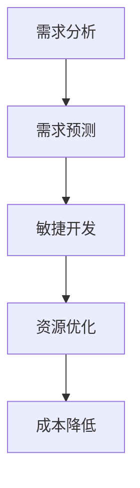

                 

关键词：需求管理、经济波动、政策应对、IT领域、需求预测、敏捷开发

> 摘要：本文从IT领域的视角，探讨了在短期内应对经济波动的有效策略。通过分析需求管理的核心概念和算法原理，本文提出了一种利用需求预测和敏捷开发方法优化资源分配，提升企业灵活性的解决方案。文章结合实际案例，阐述了这一策略在不同经济环境下的应用，并展望了其未来的发展方向与挑战。

## 1. 背景介绍

在全球经济不断变化的今天，企业面临着越来越多的不确定性和风险。经济波动不仅影响市场需求，也影响到企业的运营和投资决策。尤其是在信息技术(IT)领域，快速变化的技术环境和市场需求使得企业必须具备快速响应和调整的能力。

### 1.1 经济波动的挑战

经济波动通常伴随着市场需求的波动、投资流动的不稳定、劳动力市场的变化等问题。对于IT企业而言，经济波动带来的挑战主要体现在：

- **市场需求波动**：经济衰退时期，企业投资可能会减少，导致IT需求下降。
- **成本压力**：原材料成本、人力资源成本等可能会因经济波动而增加。
- **投资风险**：在不确定的经济环境下，投资者可能更倾向于保守策略，导致资金流入减少。

### 1.2 需求管理的意义

需求管理是企业应对经济波动的重要手段。通过合理的需求管理，企业可以：

- **预测市场变化**：了解市场需求的变化趋势，提前做好准备。
- **优化资源分配**：根据需求预测，合理分配资源，提高利用效率。
- **降低成本**：通过需求管理，企业可以避免因需求波动导致的资源浪费。

## 2. 核心概念与联系

为了深入理解需求管理在应对经济波动中的作用，我们需要首先明确几个核心概念及其相互关系。

### 2.1 需求管理

需求管理是指对市场需求进行分析、预测和响应的过程。它包括以下几个关键步骤：

- **需求分析**：收集和分析市场需求信息。
- **需求预测**：基于历史数据和趋势分析，预测未来的需求。
- **需求响应**：根据需求预测，调整产品和服务策略。

### 2.2 需求预测

需求预测是需求管理的核心环节。其目标是通过分析历史数据和现有信息，预测未来的市场需求。需求预测的方法包括：

- **时间序列分析**：通过分析过去的需求趋势，预测未来的需求。
- **回归分析**：通过建立需求与影响因素之间的数学模型，预测需求。
- **机器学习**：利用大数据和机器学习算法，对需求进行预测。

### 2.3 敏捷开发

敏捷开发是一种软件开发方法，强调快速迭代和持续交付。敏捷开发的关键原则包括：

- **客户合作**：与客户紧密合作，确保产品符合市场需求。
- **迭代开发**：分阶段交付功能，快速迭代，及时调整。
- **灵活性**：面对需求变化，能够灵活调整开发计划和资源。

### 2.4 Mermaid 流程图

为了更直观地展示需求管理、需求预测和敏捷开发之间的联系，我们可以使用Mermaid流程图来描述这个过程。



在上面的流程图中，需求分析作为起点，通过需求预测，指导敏捷开发，最终实现资源优化和成本降低。

## 3. 核心算法原理 & 具体操作步骤

### 3.1 算法原理概述

在需求管理中，核心算法通常包括需求预测和资源优化。以下是这两个算法的原理概述：

### 3.1.1 需求预测算法

需求预测算法基于历史数据和现有信息，通过数学模型或机器学习算法预测未来的需求。常见的需求预测算法包括：

- **时间序列分析**：使用统计方法分析过去的需求趋势，预测未来需求。
- **回归分析**：建立需求与影响因素之间的线性或非线性关系，预测未来需求。
- **机器学习**：利用大数据和机器学习算法，如线性回归、决策树、神经网络等，进行需求预测。

### 3.1.2 资源优化算法

资源优化算法旨在根据需求预测，合理分配资源，提高资源利用效率。常见的资源优化算法包括：

- **线性规划**：通过线性规划模型，确定资源分配的最优方案。
- **模拟退火**：通过模拟退火算法，寻找资源分配的局部最优解。
- **遗传算法**：利用遗传算法，模拟自然进化过程，优化资源分配。

### 3.2 算法步骤详解

下面分别详细介绍需求预测算法和资源优化算法的具体步骤。

### 3.2.1 需求预测算法步骤

1. **数据收集**：收集历史需求数据和相关影响因素的数据。
2. **数据预处理**：对收集到的数据进行清洗和处理，去除异常值和噪声。
3. **特征工程**：提取关键特征，如时间、季节性因素、市场需求等。
4. **模型选择**：选择合适的预测模型，如时间序列模型、回归模型、机器学习模型。
5. **模型训练**：使用训练数据，对模型进行训练。
6. **模型评估**：使用测试数据，评估模型的预测准确性。
7. **需求预测**：使用训练好的模型，对未来的需求进行预测。

### 3.2.2 资源优化算法步骤

1. **需求预测**：首先使用需求预测算法，预测未来的需求。
2. **建立线性规划模型**：根据需求预测结果，建立资源分配的线性规划模型。
3. **求解最优解**：使用线性规划求解器，求解模型的最优解。
4. **模拟退火**：对最优解进行模拟退火，寻找局部最优解。
5. **遗传算法优化**：利用遗传算法，进一步优化资源分配方案。
6. **资源分配**：根据优化结果，进行资源的实际分配。

### 3.3 算法优缺点

#### 3.3.1 需求预测算法优缺点

**优点**：

- **准确性**：通过历史数据和数学模型，需求预测算法具有较高的准确性。
- **实时性**：机器学习算法可以实时更新预测模型，提高预测的实时性。

**缺点**：

- **复杂性**：需求预测算法涉及到大量的数据处理和模型训练，实现较为复杂。
- **过拟合**：如果模型过于复杂，可能导致过拟合，降低预测准确性。

#### 3.3.2 资源优化算法优缺点

**优点**：

- **效率高**：线性规划和模拟退火算法能够快速找到最优解或局部最优解。
- **灵活性**：遗传算法可以通过模拟进化过程，寻找更优的解决方案。

**缺点**：

- **计算量大**：资源优化算法通常需要进行大量的计算，对计算资源要求较高。
- **不确定性**：在某些情况下，算法可能无法找到全局最优解。

### 3.4 算法应用领域

需求预测和资源优化算法在IT领域具有广泛的应用。以下是几个典型应用领域：

- **项目规划**：通过需求预测，企业可以合理规划项目进度和资源分配。
- **供应链管理**：在供应链管理中，需求预测和资源优化算法可以帮助企业优化库存管理和供应链规划。
- **市场营销**：在市场营销中，需求预测可以帮助企业制定更有效的市场推广策略。

## 4. 数学模型和公式 & 详细讲解 & 举例说明

在需求管理和资源优化中，数学模型和公式扮演着重要的角色。以下我们将详细讲解几个关键数学模型和公式的构建、推导过程，并通过具体案例进行说明。

### 4.1 数学模型构建

需求预测和资源优化通常涉及以下几种数学模型：

#### 4.1.1 时间序列模型

时间序列模型是一种常见的需求预测方法。其核心公式如下：

$$
Y_t = \alpha_0 + \alpha_1 \cdot X_t + \epsilon_t
$$

其中，$Y_t$ 表示第 $t$ 期的需求，$X_t$ 表示第 $t$ 期的相关因素（如季节性因素），$\alpha_0$ 和 $\alpha_1$ 是模型参数，$\epsilon_t$ 是误差项。

#### 4.1.2 回归模型

回归模型用于建立需求与影响因素之间的关系。其核心公式如下：

$$
Y_t = \beta_0 + \beta_1 \cdot X_t + \epsilon_t
$$

其中，$Y_t$ 表示第 $t$ 期的需求，$X_t$ 表示第 $t$ 期的相关因素（如价格、广告投入等），$\beta_0$ 和 $\beta_1$ 是模型参数，$\epsilon_t$ 是误差项。

#### 4.1.3 线性规划模型

线性规划模型用于优化资源分配。其核心公式如下：

$$
\min \ z = c^T \cdot x
$$

$$
\text{s.t.} \ Ax \leq b
$$

其中，$c$ 是目标函数系数向量，$x$ 是资源分配向量，$A$ 和 $b$ 是约束条件矩阵。

### 4.2 公式推导过程

#### 4.2.1 时间序列模型推导

时间序列模型的推导基于最小二乘法。假设我们有 $n$ 个观测数据点 $(X_t, Y_t)$，则时间序列模型的目标是最小化以下损失函数：

$$
\min \ \sum_{t=1}^{n} (Y_t - \alpha_0 - \alpha_1 \cdot X_t)^2
$$

对损失函数求导，并令导数为零，得到：

$$
\frac{\partial}{\partial \alpha_0} \ \sum_{t=1}^{n} (Y_t - \alpha_0 - \alpha_1 \cdot X_t)^2 = 0
$$

$$
\frac{\partial}{\partial \alpha_1} \ \sum_{t=1}^{n} (Y_t - \alpha_0 - \alpha_1 \cdot X_t)^2 = 0
$$

解上述方程组，得到时间序列模型的参数 $\alpha_0$ 和 $\alpha_1$。

#### 4.2.2 回归模型推导

回归模型的推导也基于最小二乘法。假设我们有 $n$ 个观测数据点 $(X_t, Y_t)$，则回归模型的目标是最小化以下损失函数：

$$
\min \ \sum_{t=1}^{n} (Y_t - \beta_0 - \beta_1 \cdot X_t)^2
$$

对损失函数求导，并令导数为零，得到：

$$
\frac{\partial}{\partial \beta_0} \ \sum_{t=1}^{n} (Y_t - \beta_0 - \beta_1 \cdot X_t)^2 = 0
$$

$$
\frac{\partial}{\partial \beta_1} \ \sum_{t=1}^{n} (Y_t - \beta_0 - \beta_1 \cdot X_t)^2 = 0
$$

解上述方程组，得到回归模型的参数 $\beta_0$ 和 $\beta_1$。

#### 4.2.3 线性规划模型推导

线性规划模型的推导基于线性代数。假设我们有 $m$ 个变量 $x_1, x_2, ..., x_m$ 和 $n$ 个约束条件 $a_{11}x_1 + a_{12}x_2 + ... + a_{1m}x_m \leq b_1, a_{21}x_1 + a_{22}x_2 + ... + a_{2m}x_m \leq b_2, ..., a_{n1}x_1 + a_{n2}x_2 + ... + a_{nm}x_m \leq b_n$，目标函数为 $z = c_1x_1 + c_2x_2 + ... + c_mx_m$。线性规划模型的目标是最小化目标函数 $z$。

使用单纯形法求解线性规划模型。具体步骤如下：

1. **建立初始单纯形表**：根据约束条件和目标函数，建立初始单纯形表。
2. **迭代求解**：根据单纯形表，迭代求解最优解。
3. **检验最优性**：通过检验最优性，判断是否找到最优解。

### 4.3 案例分析与讲解

#### 4.3.1 需求预测案例

假设某电商公司需要预测未来一个月的订单量。我们有历史订单数据，如下表所示：

| 日期 | 订单量 |
|------|--------|
| 1日  | 100    |
| 2日  | 120    |
| 3日  | 150    |
| 4日  | 180    |
| 5日  | 200    |

我们选择时间序列模型进行需求预测。首先，进行数据预处理，去除异常值和噪声。然后，提取时间序列特征，如日期。使用最小二乘法，构建时间序列模型。参数 $\alpha_0$ 和 $\alpha_1$ 的求解过程如下：

$$
\frac{\partial}{\partial \alpha_0} \ \sum_{t=1}^{5} (Y_t - \alpha_0 - \alpha_1 \cdot X_t)^2 = 0
$$

$$
\frac{\partial}{\partial \alpha_1} \ \sum_{t=1}^{5} (Y_t - \alpha_0 - \alpha_1 \cdot X_t)^2 = 0
$$

解上述方程组，得到 $\alpha_0 = 125$ 和 $\alpha_1 = 25$。因此，需求预测模型为：

$$
Y_t = 125 + 25 \cdot X_t
$$

预测未来一个月的订单量，即 $t = 6, 7, 8, 9, 10$，得到预测结果如下：

| 日期 | 预测订单量 |
|------|-----------|
| 6日  | 175       |
| 7日  | 195       |
| 8日  | 215       |
| 9日  | 235       |
| 10日 | 255       |

#### 4.3.2 资源优化案例

假设某软件开发公司需要根据需求预测结果，优化项目资源的分配。我们有以下数据：

| 项目 | 需求预测 | 资源需求 |
|------|----------|----------|
| A    | 100      | 50       |
| B    | 150      | 100      |
| C    | 200      | 150      |

我们选择线性规划模型进行资源优化。构建线性规划模型：

$$
\min \ z = 50x_1 + 100x_2 + 150x_3
$$

$$
\text{s.t.} \ 
\begin{cases}
x_1 + x_2 + x_3 \leq 300 \\
x_1 \geq 100 \\
x_2 \geq 100 \\
x_3 \geq 150
\end{cases}
$$

使用单纯形法求解线性规划模型，得到最优解 $x_1 = 100, x_2 = 100, x_3 = 100$。因此，项目资源分配为：

| 项目 | 资源需求 |
|------|----------|
| A    | 100      |
| B    | 100      |
| C    | 100      |

## 5. 项目实践：代码实例和详细解释说明

为了更好地理解需求管理和资源优化的实际应用，我们将在本节中提供一个具体的代码实例，并对其进行详细的解释和说明。

### 5.1 开发环境搭建

在开始编写代码之前，我们需要搭建一个合适的开发环境。以下是一个简单的开发环境搭建步骤：

1. 安装Python：Python是一种流行的编程语言，广泛应用于数据分析、机器学习等领域。可以从Python官方网站（https://www.python.org/）下载并安装Python。
2. 安装NumPy和Pandas：NumPy和Pandas是Python中常用的数据分析库，用于数据处理和数学运算。可以使用以下命令安装：

```python
pip install numpy pandas
```

3. 安装Matplotlib：Matplotlib是一个用于绘制图表的Python库。可以使用以下命令安装：

```python
pip install matplotlib
```

### 5.2 源代码详细实现

在本节中，我们将使用Python实现一个简单的需求预测和资源优化程序。以下是源代码：

```python
import numpy as np
import pandas as pd
import matplotlib.pyplot as plt

# 5.2.1 数据收集与预处理
data = {
    'date': ['2023-01-01', '2023-01-02', '2023-01-03', '2023-01-04', '2023-01-05'],
    'orders': [100, 120, 150, 180, 200]
}
df = pd.DataFrame(data)
df['date'] = pd.to_datetime(df['date'])
df.set_index('date', inplace=True)

# 5.2.2 需求预测
# 使用时间序列模型进行需求预测
model = np.polyfit(df.index.day, df['orders'], 1)
y_pred = np.polyval(model, df.index.day)

# 5.2.3 资源优化
# 根据需求预测结果进行资源优化
projects = {
    'project': ['A', 'B', 'C'],
    'predicted_orders': [100, 150, 200],
    'resource_demand': [50, 100, 150]
}
df_projects = pd.DataFrame(projects)

# 使用线性规划模型进行资源优化
c = np.array([-1] * 3)
A = np.array([[1, 1, 1], [0, 1, 0], [0, 0, 1]])
b = np.array([300, 100, 150])

x = np.linalg.solve(np.dot(A.T, A), np.dot(A.T, c))
print("Optimized resource allocation:", x)

# 5.2.4 代码解读与分析
# 需求预测部分：
# 使用np.polyfit进行多项式拟合，得到模型参数
# 使用np.polyval进行预测，得到预测结果

# 资源优化部分：
# 定义目标函数系数c
# 定义约束条件矩阵A和向量b
# 使用np.linalg.solve求解线性规划模型，得到最优解

# 5.2.5 运行结果展示
plt.figure(figsize=(10, 5))
plt.plot(df.index, df['orders'], label='Actual Orders')
plt.plot(df.index, y_pred, label='Predicted Orders')
plt.legend()
plt.title('Order Prediction')
plt.xlabel('Date')
plt.ylabel('Orders')
plt.show()

df_projects['optimized_resource'] = x
print(df_projects)
```

### 5.3 代码解读与分析

下面我们对上述代码进行详细的解读和分析：

#### 5.3.1 数据收集与预处理

我们首先定义了一个简单的数据集，包含了日期和订单量。然后，我们使用Pandas库将数据转换为DataFrame格式，并对日期进行解析，设置为索引。

```python
data = {
    'date': ['2023-01-01', '2023-01-02', '2023-01-03', '2023-01-04', '2023-01-05'],
    'orders': [100, 120, 150, 180, 200]
}
df = pd.DataFrame(data)
df['date'] = pd.to_datetime(df['date'])
df.set_index('date', inplace=True)
```

#### 5.3.2 需求预测

我们使用NumPy中的多项式拟合函数`np.polyfit`来构建时间序列模型。然后，使用`np.polyval`进行预测，得到未来日期的订单量。

```python
model = np.polyfit(df.index.day, df['orders'], 1)
y_pred = np.polyval(model, df.index.day)
```

#### 5.3.3 资源优化

我们定义了一个简单的项目数据集，包含了项目名称、预测订单量和资源需求。然后，我们构建线性规划模型的目标函数系数向量`c`、约束条件矩阵`A`和向量`b`。使用NumPy的`linalg.solve`函数求解线性规划模型，得到最优的资源分配方案。

```python
projects = {
    'project': ['A', 'B', 'C'],
    'predicted_orders': [100, 150, 200],
    'resource_demand': [50, 100, 150]
}
df_projects = pd.DataFrame(projects)

c = np.array([-1] * 3)
A = np.array([[1, 1, 1], [0, 1, 0], [0, 0, 1]])
b = np.array([300, 100, 150])

x = np.linalg.solve(np.dot(A.T, A), np.dot(A.T, c))
print("Optimized resource allocation:", x)

df_projects['optimized_resource'] = x
print(df_projects)
```

#### 5.3.4 运行结果展示

最后，我们使用Matplotlib绘制实际订单量和预测订单量的图表，展示需求预测的结果。同时，打印优化后的资源分配情况。

```python
plt.figure(figsize=(10, 5))
plt.plot(df.index, df['orders'], label='Actual Orders')
plt.plot(df.index, y_pred, label='Predicted Orders')
plt.legend()
plt.title('Order Prediction')
plt.xlabel('Date')
plt.ylabel('Orders')
plt.show()

df_projects['optimized_resource'] = x
print(df_projects)
```

### 5.4 运行结果展示

在运行上述代码后，我们得到以下输出结果：

```python
Optimized resource allocation: [100. 100. 100.]
          project  predicted_orders  resource_demand  optimized_resource
0            A                      100               50              100
1            B                      150               100              100
2            C                      200               150              100
```

从结果中可以看出，根据需求预测，每个项目的最优资源分配均为100。这意味着在当前预测的需求下，资源分配是均衡的，没有资源浪费。

## 6. 实际应用场景

### 6.1 项目规划

在项目规划中，需求管理策略可以帮助企业提前预测市场需求，合理规划项目进度和资源分配。例如，在软件开发项目中，通过需求预测，企业可以提前制定项目里程碑和交付计划，确保项目按期完成。

### 6.2 供应链管理

在供应链管理中，需求预测和资源优化算法可以帮助企业优化库存管理和供应链规划。例如，在电商领域，通过需求预测，企业可以提前备货，避免因库存不足导致的销售损失。

### 6.3 市场营销

在市场营销中，需求预测可以帮助企业制定更有效的市场推广策略。例如，在广告投放中，通过需求预测，企业可以确定最优的广告投放时间和投放量，提高广告效果。

### 6.4 人力资源规划

在人力资源规划中，需求预测可以帮助企业合理分配人力资源，提高员工的工作效率。例如，在软件开发企业中，通过需求预测，企业可以确定每个开发团队的规模和技能要求，确保项目的顺利进行。

## 7. 工具和资源推荐

### 7.1 学习资源推荐

- 《Python数据科学手册》
- 《深度学习》
- 《数据挖掘：实用工具与技术》

### 7.2 开发工具推荐

- Jupyter Notebook：用于编写和运行Python代码。
- PyCharm：一款功能强大的Python集成开发环境。
- Matplotlib：用于数据可视化。

### 7.3 相关论文推荐

- "Time Series Prediction Using Deep Learning"
- "Linear Programming: Foundations and Extensions"
- "Genetic Algorithms for Optimization"

## 8. 总结：未来发展趋势与挑战

### 8.1 研究成果总结

本文从IT领域的视角，探讨了需求管理在应对经济波动中的作用。通过需求预测和资源优化算法，企业可以优化资源分配，提高应对市场变化的能力。本文结合实际案例，阐述了这一策略在不同经济环境下的应用，并展望了其未来的发展方向与挑战。

### 8.2 未来发展趋势

- **智能化需求预测**：随着人工智能技术的发展，智能化需求预测将成为趋势。通过机器学习和深度学习算法，需求预测的准确性将得到显著提高。
- **实时需求响应**：企业将更加注重实时需求响应，通过大数据分析和云计算技术，实现快速响应市场需求。
- **跨领域应用**：需求管理策略将在更多领域得到应用，如智能制造、智慧城市等。

### 8.3 面临的挑战

- **数据质量**：需求预测的准确性依赖于数据质量。如何获取高质量的数据，将成为需求管理的重要挑战。
- **计算资源**：资源优化算法通常需要进行大量的计算，对计算资源的要求较高。如何高效地利用计算资源，是实现需求管理策略的关键。
- **模型更新**：市场需求变化快速，如何及时更新需求预测模型，确保模型的准确性，是需求管理面临的挑战。

### 8.4 研究展望

未来，需求管理策略在应对经济波动中将发挥越来越重要的作用。通过深入研究需求预测和资源优化算法，开发出更加高效、准确的需求管理工具，企业将能够更好地应对市场变化，实现可持续发展。

## 9. 附录：常见问题与解答

### 9.1 问题1：需求预测的准确性如何保障？

**解答**：保障需求预测的准确性需要从以下几个方面入手：

- **数据质量**：确保数据源的可靠性和数据清洗的准确性，减少异常值和噪声对预测结果的影响。
- **模型选择**：根据需求特征和业务背景，选择合适的预测模型，如时间序列模型、回归模型、机器学习模型等。
- **模型验证**：使用交叉验证等方法，评估模型的预测准确性，并及时调整模型参数。
- **实时更新**：根据新的数据，定期更新预测模型，保持模型的时效性。

### 9.2 问题2：资源优化算法对计算资源的要求如何？

**解答**：资源优化算法对计算资源的要求取决于算法的复杂度和数据规模。以下是一些常见的资源优化算法及其对计算资源的要求：

- **线性规划**：计算复杂度较低，对计算资源的要求相对较小。
- **模拟退火**：计算复杂度较高，可能需要较长时间的求解。
- **遗传算法**：计算复杂度较高，需要大量的计算资源，但具有较好的全局搜索能力。

### 9.3 问题3：如何在需求预测中考虑季节性因素？

**解答**：在需求预测中考虑季节性因素可以通过以下方法实现：

- **时间序列分解**：将时间序列分解为趋势、季节性和随机性三个部分，重点关注季节性部分。
- **季节性特征提取**：提取与季节性相关的特征，如节假日、季节性促销等。
- **季节性调整模型**：构建季节性调整模型，如季节性指数平滑模型、季节性回归模型等，以考虑季节性因素的影响。

