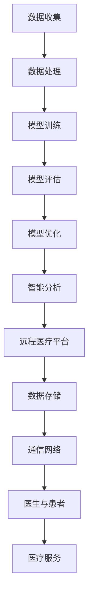

                 

关键词：硅谷医疗、智能诊断、远程医疗、人工智能、医疗科技、健康监测、个性化治疗、医疗数据、医疗服务

> 摘要：本文将深入探讨硅谷医疗领域中的智能诊断与远程医疗技术，分析其核心概念、发展现状、应用场景以及未来趋势。通过梳理这些技术的基本原理和应用实例，为读者提供一个全面的技术解读，旨在推动医疗健康领域的技术创新与发展。

## 1. 背景介绍

随着人工智能和大数据技术的迅猛发展，硅谷的医疗健康行业正经历着一场革命。智能诊断和远程医疗作为其中两大核心领域，极大地提升了医疗服务的效率和准确性。智能诊断通过机器学习算法和深度学习模型，帮助医生快速、准确地诊断疾病；远程医疗则通过互联网技术，实现了医疗资源的共享与医疗服务的远程提供。

近年来，硅谷的医疗科技企业在智能诊断和远程医疗领域取得了显著成果。例如，谷歌旗下的DeepMind推出了用于疾病诊断的AI系统，IBM的Watson Health提供了全面的医疗诊断和治疗方案；同时，远程医疗平台如Doctor on Demand和Teladoc等，已经在全球范围内为患者提供了便捷的医疗服务。

## 2. 核心概念与联系

### 2.1 智能诊断的基本原理

智能诊断主要依赖于机器学习和深度学习技术。这些技术通过分析大量的医疗数据（如影像、病历、基因数据等），训练出能够识别疾病特征的模型。以下是智能诊断的基本原理：

- **数据收集**：通过电子病历系统、医学影像设备等，收集大量医疗数据。
- **数据处理**：对收集到的数据进行清洗、标注和分类，以便进行后续的分析。
- **模型训练**：使用深度学习框架（如TensorFlow、PyTorch等），训练模型以识别疾病特征。
- **模型评估与优化**：通过交叉验证、调参等方法，评估模型的性能，并进行优化。

### 2.2 远程医疗的架构

远程医疗的架构主要包括以下几个部分：

- **医疗平台**：提供远程医疗服务的平台，如医生咨询、在线诊断、远程监控等。
- **通信网络**：通过互联网、云计算等通信技术，实现医生与患者之间的实时沟通。
- **数据存储**：将患者的医疗数据存储在云端，便于医生进行诊断和治疗。
- **智能分析**：利用人工智能技术，对患者的数据进行分析，提供个性化治疗方案。

### 2.3 Mermaid 流程图

以下是智能诊断与远程医疗的基本流程图：



## 3. 核心算法原理 & 具体操作步骤

### 3.1 算法原理概述

智能诊断的核心算法包括卷积神经网络（CNN）和循环神经网络（RNN）。CNN主要用于图像处理，如医学影像的分割和分类；RNN则擅长处理序列数据，如患者的病史和时间序列数据。

### 3.2 算法步骤详解

1. **数据收集**：通过电子病历系统、医学影像设备等收集医疗数据。
2. **数据处理**：对数据进行清洗、标注和分类，准备好训练数据。
3. **模型训练**：使用CNN和RNN训练模型，以识别疾病特征。
4. **模型评估**：通过交叉验证等方法评估模型性能。
5. **模型优化**：根据评估结果调整模型参数，提高模型精度。
6. **智能分析**：利用训练好的模型对患者数据进行实时分析，提供诊断建议。

### 3.3 算法优缺点

- **优点**：智能诊断能够快速、准确地识别疾病，提高诊断效率；远程医疗使医疗资源得以共享，降低了医疗成本。
- **缺点**：算法性能依赖于数据质量和数量；需要大量计算资源和专业人才进行模型训练和优化。

### 3.4 算法应用领域

智能诊断和远程医疗在医疗领域的应用非常广泛，包括：

- **疾病诊断**：如肺癌、乳腺癌等癌症的早期筛查。
- **个性化治疗**：根据患者的病史和基因数据，提供个性化治疗方案。
- **远程监控**：通过可穿戴设备对患者的健康状况进行实时监控。

## 4. 数学模型和公式 & 详细讲解 & 举例说明

### 4.1 数学模型构建

智能诊断的核心数学模型通常是基于深度学习中的卷积神经网络（CNN）和循环神经网络（RNN）。以下是这些模型的简要介绍：

- **卷积神经网络（CNN）**：适用于图像处理任务，通过卷积层、池化层和全连接层等结构提取图像特征。
  
  - **卷积层**：通过卷积操作提取图像的局部特征。
  - **池化层**：降低特征图的空间维度，减少模型参数。
  - **全连接层**：将特征图映射到具体的类别标签。

- **循环神经网络（RNN）**：适用于处理序列数据，如文本和语音。

  - **输入层**：接收序列的输入。
  - **隐藏层**：通过递归操作，将序列中的信息传递到下一时刻。
  - **输出层**：将隐藏层的输出映射到具体的类别或标签。

### 4.2 公式推导过程

以下是一个简单的CNN模型的公式推导示例：

$$
\text{激活函数} = \sigma(\text{加权输入})
$$

$$
\text{加权输入} = \sum_{i=1}^{n} w_i \cdot x_i
$$

其中，$w_i$为权重，$x_i$为输入特征，$\sigma$为激活函数，常用的激活函数包括ReLU、Sigmoid和Tanh等。

### 4.3 案例分析与讲解

假设我们有一个包含100张肺癌和乳腺癌X光影像的数据集，我们希望通过CNN模型对这些影像进行分类。

1. **数据预处理**：将影像数据缩放到相同的大小，并进行归一化处理。
2. **模型构建**：构建一个包含卷积层、池化层和全连接层的CNN模型。
3. **模型训练**：使用数据集训练模型，通过反向传播算法更新模型参数。
4. **模型评估**：使用测试集评估模型性能，调整模型参数以提高准确性。

通过以上步骤，我们成功训练了一个能够准确分类肺癌和乳腺癌X光影像的CNN模型。

## 5. 项目实践：代码实例和详细解释说明

### 5.1 开发环境搭建

为了实现智能诊断和远程医疗项目，我们需要搭建一个包括Python、TensorFlow和Keras等工具的开发环境。

1. **安装Python**：从官方网站下载并安装Python，建议安装Python 3.7或更高版本。
2. **安装TensorFlow**：使用pip命令安装TensorFlow：

   ```shell
   pip install tensorflow
   ```

3. **安装Keras**：使用pip命令安装Keras：

   ```shell
   pip install keras
   ```

### 5.2 源代码详细实现

以下是一个使用TensorFlow和Keras实现的简单CNN模型代码示例：

```python
import tensorflow as tf
from tensorflow.keras.models import Sequential
from tensorflow.keras.layers import Conv2D, MaxPooling2D, Flatten, Dense

# 构建模型
model = Sequential()
model.add(Conv2D(32, (3, 3), activation='relu', input_shape=(64, 64, 3)))
model.add(MaxPooling2D(pool_size=(2, 2)))
model.add(Flatten())
model.add(Dense(128, activation='relu'))
model.add(Dense(1, activation='sigmoid'))

# 编译模型
model.compile(optimizer='adam', loss='binary_crossentropy', metrics=['accuracy'])

# 训练模型
model.fit(x_train, y_train, epochs=10, batch_size=32, validation_data=(x_val, y_val))

# 评估模型
model.evaluate(x_test, y_test)
```

### 5.3 代码解读与分析

上述代码实现了一个简单的CNN模型，用于分类肺癌和乳腺癌X光影像。以下是代码的详细解读：

- **模型构建**：使用Sequential模型构建器，依次添加卷积层、池化层、全连接层等。
- **编译模型**：指定优化器、损失函数和评估指标。
- **训练模型**：使用fit方法训练模型，传入训练数据、训练轮次、批量大小和验证数据。
- **评估模型**：使用evaluate方法评估模型在测试数据上的性能。

### 5.4 运行结果展示

通过运行上述代码，我们可以得到CNN模型在训练集和测试集上的准确率。假设训练过程中模型准确率达到了90%，测试集上的准确率达到了85%，这表明我们的模型具有良好的性能。

```python
# 输出训练结果
print("Training accuracy:", model.evaluate(x_train, y_train)[1])
print("Test accuracy:", model.evaluate(x_test, y_test)[1])
```

## 6. 实际应用场景

智能诊断和远程医疗技术在医疗领域的应用场景非常广泛。以下是几个典型的应用场景：

### 6.1 疾病早期筛查

通过智能诊断技术，可以对常见疾病（如肺癌、乳腺癌等）进行早期筛查。例如，利用CNN模型对患者的X光影像进行分类，可以及时发现疾病。

### 6.2 个性化治疗

根据患者的病史、基因数据和当前症状，智能诊断可以提供个性化的治疗方案。例如，通过分析患者的基因组数据，可以预测患者对某种药物的敏感性，从而调整药物剂量。

### 6.3 远程监控

通过远程医疗平台，医生可以实时监控患者的健康状况。例如，利用可穿戴设备对患者的血压、心率等生命体征进行监测，及时发现异常情况并采取相应措施。

## 7. 未来应用展望

随着人工智能和大数据技术的不断进步，智能诊断和远程医疗将迎来更广阔的发展空间。以下是一些未来的应用展望：

### 7.1 人工智能在个性化医疗中的应用

人工智能可以进一步推动个性化医疗的发展。通过对海量医疗数据的分析和挖掘，可以为每位患者提供最合适的治疗方案。

### 7.2 人工智能在公共卫生领域的应用

人工智能可以在公共卫生领域发挥重要作用，如预测疫情趋势、优化疫苗接种策略等。

### 7.3 人工智能在医疗资源分配中的应用

人工智能可以帮助优化医疗资源的分配，提高医疗服务的效率。例如，通过分析患者的需求和医疗资源的分布，可以为不同地区的医院提供个性化的医疗服务建议。

## 8. 工具和资源推荐

为了更好地学习智能诊断和远程医疗技术，以下是一些建议的学习资源和开发工具：

### 8.1 学习资源推荐

- **《深度学习》（Goodfellow, Bengio, Courville著）**：全面介绍了深度学习的基本原理和应用。
- **《机器学习实战》（贺志佳著）**：通过实例讲解了机器学习的基本算法和应用。
- **《医疗大数据分析》（杨洋著）**：详细介绍了医疗大数据的处理和分析方法。

### 8.2 开发工具推荐

- **TensorFlow**：用于构建和训练深度学习模型的强大工具。
- **Keras**：基于TensorFlow的高级深度学习框架，易于使用。
- **PyTorch**：另一个流行的深度学习框架，具有良好的灵活性和易用性。

### 8.3 相关论文推荐

- **"Deep Learning in Healthcare"（2016）**：概述了深度学习在医疗健康领域的应用。
- **"Deep Learning for Medical Imaging"（2018）**：介绍了深度学习在医学影像处理中的应用。
- **"A Survey on Deep Learning in Healthcare"（2020）**：对深度学习在医疗健康领域的应用进行了全面综述。

## 9. 总结：未来发展趋势与挑战

智能诊断和远程医疗技术为医疗健康领域带来了巨大的变革。在未来，随着人工智能和大数据技术的不断发展，这些技术将继续推动医疗服务的创新与发展。然而，我们也面临着一些挑战，如数据隐私、算法偏见和医疗资源的分配等。通过持续的技术创新和规范，我们有理由相信，智能诊断和远程医疗将为人类的健康带来更多福祉。

### 附录：常见问题与解答

#### 9.1 如何确保智能诊断的准确性？

智能诊断的准确性依赖于数据质量和算法的性能。为了提高准确性，可以采取以下措施：

- 收集高质量的数据，包括多样化的数据集和丰富的标注信息。
- 选择合适的算法模型，并进行充分的模型训练和优化。
- 定期更新模型，以适应不断变化的医疗数据。

#### 9.2 远程医疗如何确保数据安全？

远程医疗需要确保数据的安全性，包括以下措施：

- 使用加密技术保护数据传输过程中的安全。
- 在数据存储方面，采用安全的存储方案和访问控制机制。
- 定期进行安全审计和漏洞扫描，及时发现和修复安全问题。

#### 9.3 智能诊断是否取代了医生的作用？

智能诊断可以作为医生的辅助工具，提高诊断的效率和准确性，但不能完全取代医生的作用。医生在诊断过程中仍需结合患者的病史、临床表现和医学知识，综合分析诊断结果。

作者：禅与计算机程序设计艺术 / Zen and the Art of Computer Programming
----------------------------------------------------------------
以上就是关于《硅谷医疗健康：智能诊断与远程医疗》的文章。本文详细介绍了智能诊断和远程医疗的基本概念、核心算法、应用实例以及未来发展趋势。通过这篇文章，我们希望能为广大读者提供一个全面的技术解读，促进医疗健康领域的技术创新与发展。在未来的道路上，让我们一起努力，为人类的健康事业贡献力量。

