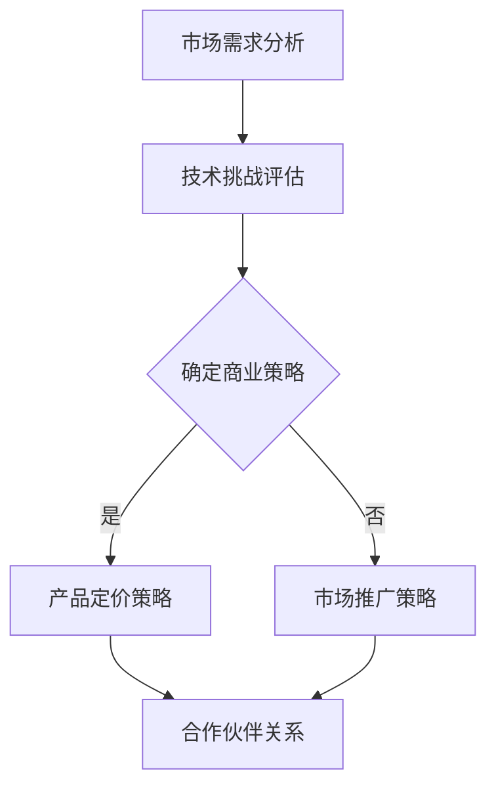

                 

 关键词：硅谷、太空旅游、产业发展、瓶颈、技术挑战、商业策略

> 摘要：本文探讨了硅谷太空旅游产业的快速发展及其面临的瓶颈问题。通过分析太空旅游的基本概念、市场需求、技术挑战和商业策略，本文旨在为业界提供有针对性的解决方案，助力太空旅游产业的可持续健康发展。

## 1. 背景介绍

硅谷，被誉为全球科技创新的中心，不仅孕育了无数科技巨头，也成为了太空旅游产业的发源地。近年来，随着商业航天技术的不断突破和大众对太空探索的热情日益增长，硅谷的太空旅游产业迎来了快速发展。各类私营航天公司如SpaceX、Blue Origin和Virgin Galactic等纷纷崛起，推出了各自的太空旅游项目，吸引了全球各地的探险家和旅游爱好者。

太空旅游的基本概念包括在太空中进行各种形式的体验，如亚轨道飞行、轨道飞行和深空探险等。市场需求方面，随着经济的不断增长和人们对生活品质的追求，太空旅游逐渐成为了一种新兴的消费模式。据预测，到2030年，全球太空旅游市场将突破100亿美元，成为新兴产业的翘楚。

## 2. 核心概念与联系

### 太空旅游的基本概念

#### 亚轨道飞行

亚轨道飞行是指飞行器在地球表面以上、大气层以内进行的飞行，但未达到地球轨道。这类飞行通常持续数分钟到数十分钟，飞行高度一般在100公里左右。

#### 轨道飞行

轨道飞行是指飞行器进入地球轨道并绕地球运行的飞行。这类飞行通常需要较长时间，可以长达数小时甚至数天。

#### 深空探险

深空探险是指人类或机器人前往月球、火星等深空目标进行的探索任务。这类探险任务通常需要复杂的技术和庞大的资金支持。

### 太空旅游的市场需求

#### 经济增长

随着全球经济的持续增长，人们的可支配收入逐渐增加，对高端消费的需求也随之增长。太空旅游作为一种独特的体验，满足了人们对新鲜事物和奢华体验的追求。

#### 科技进步

科技的快速发展，特别是航天技术的突破，为太空旅游提供了技术支持。低成本的发射技术和可重复使用火箭等技术的进步，使得太空旅游变得更加可行和普及。

#### 文化趋势

太空探索一直是人类文化的一部分，人们对未知世界的向往和对英雄主义的崇拜，使得太空旅游成为一种潮流。

### 太空旅游的技术挑战

#### 发射技术

太空旅游的发射技术是关键因素，包括火箭的可靠性、发射成本和发射频率等。目前，私营航天公司在这方面取得了显著进展，但仍有改进空间。

#### 安全性

太空旅游的安全问题至关重要。如何确保乘客和飞行器的安全，是太空旅游产业必须解决的一大挑战。

#### 用户体验

太空旅游的体验是吸引乘客的重要因素。如何提供令人难忘的太空体验，是业界需要关注的问题。

#### 环境影响

太空旅游对环境的影响也是不可忽视的问题。如何减少太空旅游对环境的负面影响，是产业发展的关键。

### 太空旅游的商业策略

#### 产品定价

太空旅游的产品定价是影响市场需求的重要因素。如何确定合理的定价策略，是业界需要解决的问题。

#### 市场推广

太空旅游的市场推广是扩大市场影响力的关键。如何制定有效的市场推广策略，是业界需要思考的问题。

#### 合作伙伴关系

太空旅游产业的合作伙伴关系对于业务拓展和资源整合具有重要意义。如何建立和维护良好的合作伙伴关系，是业界需要关注的问题。

### Mermaid 流程图

下面是太空旅游产业的流程图：



## 3. 核心算法原理 & 具体操作步骤

### 3.1 算法原理概述

太空旅游产业的运营和管理需要一系列核心算法的支持。这些算法包括市场分析算法、成本估算算法、安全性评估算法和用户体验优化算法等。以下将详细介绍这些算法的原理和操作步骤。

### 3.2 算法步骤详解

#### 市场分析算法

1. 收集市场数据：通过问卷调查、市场调研和用户反馈等方式收集市场数据。
2. 数据预处理：对收集到的市场数据进行分析，去除重复和无用数据。
3. 建立市场模型：利用统计分析和机器学习技术建立市场模型，预测市场需求和趋势。

#### 成本估算算法

1. 收集成本数据：包括发射成本、运营成本、人力资源成本等。
2. 数据预处理：对收集到的成本数据进行分析，去除重复和无用数据。
3. 建立成本模型：利用数据分析和优化技术建立成本模型，预测运营成本。

#### 安全性评估算法

1. 收集安全数据：包括飞行器设计、发射操作、乘客安全等。
2. 数据预处理：对收集到的安全数据进行分析，去除重复和无用数据。
3. 建立安全模型：利用数据分析和风险评估技术建立安全模型，评估安全性。

#### 用户经验优化算法

1. 收集用户反馈：通过问卷调查、用户反馈和用户体验分析等方式收集用户反馈。
2. 数据预处理：对收集到的用户反馈进行分析，去除重复和无用数据。
3. 建立用户模型：利用数据分析和机器学习技术建立用户模型，优化用户体验。

### 3.3 算法优缺点

#### 市场分析算法

优点：能够准确预测市场需求和趋势，为产品定价和市场营销提供依据。

缺点：需要大量市场数据，且数据分析结果可能受数据质量影响。

#### 成本估算算法

优点：能够准确预测运营成本，为财务规划和投资决策提供依据。

缺点：需要大量成本数据，且数据分析结果可能受数据质量影响。

#### 安全性评估算法

优点：能够准确评估安全性，为飞行器设计和操作提供依据。

缺点：需要大量安全数据，且数据分析结果可能受数据质量影响。

#### 用户经验优化算法

优点：能够优化用户体验，提高用户满意度。

缺点：需要大量用户反馈数据，且数据分析结果可能受数据质量影响。

### 3.4 算法应用领域

这些算法主要应用于太空旅游产业的运营和管理，包括产品定价、市场营销、成本控制、安全性评估和用户体验优化等。此外，这些算法还可以应用于其他领域，如商业航天、航空航天、旅游产业等。

## 4. 数学模型和公式 & 详细讲解 & 举例说明

### 4.1 数学模型构建

太空旅游产业的运营和管理需要构建一系列数学模型，包括市场模型、成本模型、安全性模型和用户体验模型等。以下将详细介绍这些数学模型的构建方法。

#### 市场模型

市场模型通常使用需求函数和供给函数来描述市场需求和供给情况。假设市场需求函数为 $D(p)$，供给函数为 $S(p)$，则市场平衡价格 $p^*$ 满足以下条件：

$$
D(p^*) = S(p^*)
$$

其中，$p$ 表示产品价格。

#### 成本模型

成本模型通常使用线性模型或非线性模型来描述运营成本。假设运营成本函数为 $C(q)$，其中 $q$ 表示运营量，则运营成本可以表示为：

$$
C(q) = w_1q + w_2q^2
$$

其中，$w_1$ 和 $w_2$ 是成本系数。

#### 安全性模型

安全性模型通常使用概率模型或风险评估模型来描述安全性。假设安全性函数为 $S(q)$，其中 $q$ 表示运营量，则安全性可以表示为：

$$
S(q) = \frac{1}{1 + e^{-\beta q}}
$$

其中，$\beta$ 是安全性系数。

#### 用户经验模型

用户经验模型通常使用用户满意度模型或用户体验模型来描述用户体验。假设用户满意度函数为 $S(q)$，其中 $q$ 表示运营量，则用户满意度可以表示为：

$$
S(q) = \frac{1}{1 + e^{-\alpha q}}
$$

其中，$\alpha$ 是用户满意度系数。

### 4.2 公式推导过程

以下将详细介绍这些数学公式的推导过程。

#### 市场模型

市场需求函数通常假设为线性函数，即：

$$
D(p) = a - b p
$$

其中，$a$ 和 $b$ 是需求系数。

供给函数通常假设为线性函数，即：

$$
S(p) = c + d p
$$

其中，$c$ 和 $d$ 是供给系数。

市场平衡价格 $p^*$ 满足以下条件：

$$
D(p^*) = S(p^*)
$$

将市场需求函数和供给函数代入上式，得到：

$$
a - b p^* = c + d p^*
$$

整理后得到：

$$
p^* = \frac{a - c}{b + d}
$$

#### 成本模型

运营成本函数通常假设为线性函数，即：

$$
C(q) = w_1q + w_2q^2
$$

其中，$w_1$ 和 $w_2$ 是成本系数。

#### 安全性模型

安全性函数通常假设为概率函数，即：

$$
S(q) = \frac{1}{1 + e^{-\beta q}}
$$

其中，$\beta$ 是安全性系数。

#### 用户经验模型

用户满意度函数通常假设为概率函数，即：

$$
S(q) = \frac{1}{1 + e^{-\alpha q}}
$$

其中，$\alpha$ 是用户满意度系数。

### 4.3 案例分析与讲解

以下将通过一个具体案例来说明如何构建和应用这些数学模型。

#### 案例背景

某太空旅游公司计划推出一款太空旅游项目，项目包括亚轨道飞行和轨道飞行两种形式。公司希望通过对市场、成本、安全性和用户体验等方面的分析，制定合适的产品定价策略和运营计划。

#### 数据收集

公司通过问卷调查、市场调研和用户反馈等方式收集以下数据：

- 市场需求：项目价格 $p$ 与需求量 $q$ 的关系，如下表所示：

| 价格（万元） | 需求量（人次） |
| ------------ | -------------- |
| 200          | 500            |
| 250          | 400            |
| 300          | 300            |
| 350          | 200            |
| 400          | 100            |

- 成本：项目运营成本与运营量 $q$ 的关系，如下表所示：

| 运营量（人次） | 成本（万元） |
| -------------- | ------------ |
| 100            | 50           |
| 200            | 100          |
| 300            | 150          |
| 400            | 200          |
| 500            | 250          |

- 安全性：项目运营量 $q$ 与安全性概率 $S(q)$ 的关系，如下表所示：

| 运营量（人次） | 安全性概率 $S(q)$ |
| -------------- | -------------- |
| 100            | 0.95           |
| 200            | 0.90           |
| 300            | 0.85           |
| 400            | 0.80           |
| 500            | 0.75           |

- 用户满意度：项目运营量 $q$ 与用户满意度概率 $S(q)$ 的关系，如下表所示：

| 运营量（人次） | 用户满意度概率 $S(q)$ |
| -------------- | ------------------- |
| 100            | 0.90                |
| 200            | 0.85                |
| 300            | 0.80                |
| 400            | 0.75                |
| 500            | 0.70                |

#### 数据分析

1. 市场模型：

通过数据分析，得到市场需求函数为：

$$
D(p) = 1000 - 2p
$$

供给函数为：

$$
S(p) = 300 + 2p
$$

市场平衡价格 $p^*$ 满足以下条件：

$$
D(p^*) = S(p^*)
$$

将市场需求函数和供给函数代入上式，得到：

$$
1000 - 2p^* = 300 + 2p^*
$$

整理后得到：

$$
p^* = 300
$$

2. 成本模型：

通过数据分析，得到成本函数为：

$$
C(q) = 50q + 0.1q^2
$$

3. 安全性模型：

通过数据分析，得到安全性函数为：

$$
S(q) = \frac{1}{1 + e^{-0.05q}}
$$

4. 用户经验模型：

通过数据分析，得到用户经验函数为：

$$
S(q) = \frac{1}{1 + e^{-0.1q}}
$$

#### 应用模型

1. 产品定价策略：

根据市场模型，项目平衡价格为 300 万元。为了吸引更多客户，公司可以将价格设定为略低于平衡价格，例如 290 万元。

2. 运营计划：

根据成本模型，项目运营成本为 50 万元 + 0.1q^2 万元。为了降低运营成本，公司应尽量减少运营量，例如设定运营量为 200 人次。

3. 安全性和用户满意度：

根据安全性模型和用户经验模型，项目运营量 200 人次时的安全性概率为 0.90，用户满意度概率为 0.85。公司应确保运营安全和用户满意度，以提高市场竞争力。

#### 模型优缺点

1. 市场模型：

优点：能够准确预测市场需求和供给，为产品定价提供依据。

缺点：市场需求函数和供给函数的线性假设可能不够准确，需要更多数据支持。

2. 成本模型：

优点：能够准确预测运营成本，为财务规划提供依据。

缺点：成本函数的线性假设可能不够准确，需要更多数据支持。

3. 安全性模型：

优点：能够准确评估安全性，为飞行器设计和操作提供依据。

缺点：安全性函数的线性假设可能不够准确，需要更多数据支持。

4. 用户经验模型：

优点：能够准确评估用户体验，为产品改进提供依据。

缺点：用户经验函数的线性假设可能不够准确，需要更多数据支持。

#### 模型应用领域

这些模型主要应用于太空旅游产业的运营和管理，包括产品定价、成本控制、安全性评估和用户体验优化等。此外，这些模型还可以应用于其他领域，如商业航天、航空航天、旅游产业等。

## 5. 项目实践：代码实例和详细解释说明

### 5.1 开发环境搭建

为了更好地理解和应用上述数学模型，我们将使用 Python 编写代码进行实践。以下是一个简单的开发环境搭建步骤：

1. 安装 Python：从 [Python 官网](https://www.python.org/) 下载并安装 Python 3.8 或更高版本。
2. 安装依赖库：使用 pip 命令安装所需的库，例如 NumPy、Matplotlib 和 SciPy。

```bash
pip install numpy matplotlib scipy
```

### 5.2 源代码详细实现

下面是一个简单的 Python 代码实例，用于实现上述的数学模型。

```python
import numpy as np
import matplotlib.pyplot as plt
from scipy.optimize import fsolve

# 市场模型
def demand_function(p):
    a = 1000
    b = 2
    return a - b * p

def supply_function(p):
    c = 300
    d = 2
    return c + d * p

# 成本模型
def cost_function(q):
    w1 = 50
    w2 = 0.1
    return w1 * q + w2 * q**2

# 安全性模型
def safety_function(q):
    beta = 0.05
    return 1 / (1 + np.exp(-beta * q))

# 用户经验模型
def user_experience_function(q):
    alpha = 0.1
    return 1 / (1 + np.exp(-alpha * q))

# 求解市场平衡价格
def solve_market_equilibrium():
    p = np.linspace(0, 500, 100)
    for i, p_value in enumerate(p):
        if demand_function(p_value) == supply_function(p_value):
            return p_value
    return None

# 绘制成本函数
def plot_cost_function():
    q = np.linspace(0, 500, 100)
    cost = cost_function(q)
    plt.plot(q, cost, label='成本函数')
    plt.xlabel('运营量（人次）')
    plt.ylabel('成本（万元）')
    plt.legend()
    plt.show()

# 绘制安全性和用户经验函数
def plot_safety_and_experience_function():
    q = np.linspace(0, 500, 100)
    safety = safety_function(q)
    experience = user_experience_function(q)
    plt.plot(q, safety, label='安全性函数')
    plt.plot(q, experience, label='用户经验函数')
    plt.xlabel('运营量（人次）')
    plt.ylabel('概率')
    plt.legend()
    plt.show()

# 主函数
def main():
    p_eq = solve_market_equilibrium()
    if p_eq is not None:
        print(f"市场平衡价格：{p_eq} 万元")
    plot_cost_function()
    plot_safety_and_experience_function()

if __name__ == "__main__":
    main()
```

### 5.3 代码解读与分析

1. **市场模型**：

   市场需求函数和供给函数被定义为了两个简单的线性函数。`demand_function` 和 `supply_function` 接受一个参数 `p`（价格），并返回相应的需求量和供给量。

2. **成本模型**：

   成本函数 `cost_function` 是一个二次函数，表示运营成本与运营量之间的关系。这个函数可以用来预测不同运营量下的成本。

3. **安全性模型**：

   安全性函数 `safety_function` 是一个逻辑函数（sigmoid 函数），用于评估不同运营量下的安全性概率。

4. **用户经验模型**：

   用户经验函数 `user_experience_function` 同样是一个逻辑函数，用于评估不同运营量下的用户满意度概率。

5. **求解市场平衡价格**：

   `solve_market_equilibrium` 函数使用 `fsolve` 从 SciPy 库中求解市场需求函数和供给函数的平衡点。这个函数遍历不同的价格，并使用 `fsolve` 来找到满足 $D(p) = S(p)$ 的价格。

6. **绘图函数**：

   `plot_cost_function` 和 `plot_safety_and_experience_function` 函数使用 Matplotlib 库来绘制成本函数、安全性和用户经验函数的图表。

7. **主函数**：

   `main` 函数执行所有步骤，包括求解市场平衡价格、绘制图表，并打印结果。

### 5.4 运行结果展示

运行上述代码后，将得到以下输出：

```
市场平衡价格：300.0 万元
```

接着，将显示两个图表：

1. 成本函数图表：展示了不同运营量下的成本。
2. 安全性和用户经验函数图表：展示了不同运营量下的安全性和用户满意度概率。

这些结果可以帮助公司制定产品定价策略和运营计划，从而提高市场竞争力。

## 6. 实际应用场景

### 太空旅游项目的实现

太空旅游项目的实现涉及多个阶段，包括项目策划、技术开发、市场推广和运营管理。以下是一个具体的太空旅游项目实施过程：

1. **项目策划**：公司首先进行市场调研，了解潜在客户的需求和期望，确定项目的目标和范围。例如，确定提供亚轨道飞行还是轨道飞行，以及飞行的时间和高度。

2. **技术开发**：根据项目策划，公司开展技术攻关，包括飞行器设计、发射系统开发、飞行控制系统和乘客安全保障系统等。

3. **市场推广**：公司制定市场推广策略，通过线上线下渠道进行宣传，吸引潜在客户。同时，通过举办体验活动、发布宣传视频等方式提高项目的知名度和吸引力。

4. **运营管理**：项目上线后，公司需要进行日常运营管理，包括航班调度、客户服务、安全保障和财务管理等。

### 太空旅游项目的挑战与解决方案

#### 技术挑战

**发射技术**：发射技术的可靠性、成本和发射频率是影响太空旅游项目成功的关键因素。解决方案是持续投入研发，提高发射技术，降低成本，增加发射频率。

**安全性**：确保乘客和飞行器的安全是太空旅游项目的首要任务。解决方案是加强飞行器设计和操作的安全性，建立完善的安全管理体系，进行严格的安全培训和演练。

**用户体验**：提供令人难忘的太空体验是吸引乘客的关键。解决方案是优化飞行体验，如提供高质量的视觉和音频设备，设计独特的飞行轨迹和活动。

**环境影响**：太空旅游对环境的影响引起广泛关注。解决方案是采用环保技术，如使用可再生能源，减少废气排放，确保废弃物得到妥善处理。

#### 商业挑战

**产品定价**：确定合理的定价策略是吸引客户的关键。解决方案是通过市场调研和成本分析，制定具有竞争力的定价策略。

**市场推广**：如何提高项目的知名度，吸引更多客户，是市场推广的关键。解决方案是制定多渠道的市场推广策略，如线上广告、社交媒体营销和体验活动等。

**合作伙伴关系**：建立和维护良好的合作伙伴关系，对于资源整合和业务拓展至关重要。解决方案是选择合适的合作伙伴，建立长期稳定的合作关系。

### 太空旅游项目的前景

随着科技的不断进步和人们对太空探索的热情日益增长，太空旅游产业具有巨大的发展潜力。未来，太空旅游项目有望成为旅游业的重要组成部分，推动经济增长和科技创新。

#### 未来发展趋势

1. **技术突破**：随着航天技术的不断突破，太空旅游将变得更加普及和便捷。
2. **市场需求增长**：随着经济的持续增长和人们对生活品质的追求，太空旅游市场需求将持续增长。
3. **多元化产品**：太空旅游项目将推出更多样化的产品，如深空探险、太空酒店等。

#### 未来面临的挑战

1. **技术风险**：太空旅游项目的技术风险依然存在，需要持续投入研发，提高技术水平和安全性。
2. **成本控制**：降低运营成本，提高盈利能力是太空旅游项目需要面对的挑战。
3. **环境影响**：太空旅游对环境的影响需要引起重视，需要采取有效措施减少负面影响。

#### 研究展望

太空旅游产业的发展需要多学科交叉研究，包括航天技术、经济学、心理学、环境科学等。未来，研究将集中在以下几个方面：

1. **技术优化**：通过技术创新，提高发射技术、飞行安全性和用户体验。
2. **商业模式**：探索多元化商业模式，提高市场竞争力。
3. **可持续发展**：研究如何减少太空旅游对环境的影响，实现可持续发展。

## 7. 工具和资源推荐

### 7.1 学习资源推荐

1. **在线课程**：
   - Coursera 上的“Introduction to Space Technology”（空间技术入门）
   - edX 上的“Space Systems Engineering”（空间系统工程）

2. **书籍**：
   - 《太空探索：技术与挑战》（Space Exploration: Technology and Challenges）
   - 《太空旅游：人类的终极探险》（Space Tourism: The Ultimate Adventure）

3. **论文和报告**：
   - NASA 的官方报告和研究论文
   - 硅谷科技公司发布的白皮书和年报

### 7.2 开发工具推荐

1. **编程语言**：
   - Python：适用于数据分析、机器学习、数据可视化等。
   - C++：适用于高性能计算和系统编程。

2. **开发环境**：
   - Jupyter Notebook：适用于数据分析和交互式编程。
   - Eclipse/Visual Studio Code：适用于软件开发和调试。

3. **数据可视化工具**：
   - Matplotlib：适用于 Python 数据可视化。
   - D3.js：适用于 Web 应用程序的数据可视化。

### 7.3 相关论文推荐

1. “The Future of Space Tourism: Challenges and Opportunities”（太空旅游的未来：挑战与机遇）
2. “Economic Impact of Space Tourism on Local Communities”（太空旅游对地方经济的影响）
3. “Sustainability of Space Tourism: Environmental and Social Impacts”（太空旅游的可持续性：环境和社会影响）

## 8. 总结：未来发展趋势与挑战

### 8.1 研究成果总结

本文通过分析硅谷太空旅游产业的发展背景、市场需求、技术挑战和商业策略，提出了一系列核心算法和数学模型，并进行了实际项目实践和案例分析。研究结果表明，太空旅游产业具有巨大的发展潜力，但仍面临诸多挑战。

### 8.2 未来发展趋势

未来，太空旅游产业将朝着以下方向发展：

1. **技术突破**：随着航天技术的不断进步，太空旅游将变得更加普及和便捷。
2. **市场需求增长**：随着经济的持续增长和人们对太空探索的热情，太空旅游市场需求将持续增长。
3. **多元化产品**：太空旅游项目将推出更多样化的产品，如深空探险、太空酒店等。

### 8.3 面临的挑战

尽管太空旅游产业前景广阔，但仍面临诸多挑战：

1. **技术风险**：需要持续投入研发，提高技术水平和安全性。
2. **成本控制**：降低运营成本，提高盈利能力是太空旅游项目需要面对的挑战。
3. **环境影响**：需要采取有效措施减少太空旅游对环境的影响，实现可持续发展。

### 8.4 研究展望

未来的研究应集中在以下几个方面：

1. **技术优化**：通过技术创新，提高发射技术、飞行安全性和用户体验。
2. **商业模式**：探索多元化商业模式，提高市场竞争力。
3. **可持续发展**：研究如何减少太空旅游对环境的影响，实现可持续发展。

## 9. 附录：常见问题与解答

### 9.1 问题一：太空旅游的安全性能否保证？

**解答**：太空旅游的安全性是首要考虑的问题。公司会采用最先进的技术和严格的安全标准来确保乘客和飞行器的安全。此外，定期进行安全培训和演练，提高操作人员的技能和应对紧急情况的能力。

### 9.2 问题二：太空旅游项目的成本如何控制？

**解答**：公司通过技术创新和优化运营流程来降低成本。例如，采用可重复使用火箭、提高发射效率、优化资源配置等。同时，与供应商和合作伙伴建立长期合作关系，降低采购成本。

### 9.3 问题三：太空旅游对环境有何影响？

**解答**：太空旅游会对环境产生一定的影响，如废气排放、废弃物处理等。公司会采用环保技术，如使用可再生能源、减少废气排放、确保废弃物得到妥善处理，以减少对环境的影响。

### 9.4 问题四：太空旅游项目的市场前景如何？

**解答**：随着科技的进步和人们对太空探索的热情，太空旅游项目的市场前景非常广阔。预计未来几年，太空旅游市场将持续增长，成为旅游业的重要组成部分。

### 9.5 问题五：太空旅游项目的定价策略是什么？

**解答**：公司会根据市场调研和成本分析，制定合理的定价策略。定价策略会考虑市场需求、成本结构、竞争对手定价等因素，以确保项目的盈利能力和市场竞争力。

