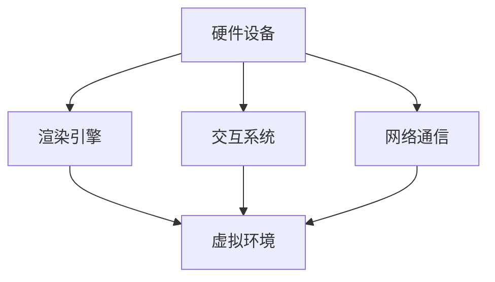

                 

关键词：虚拟现实、远程办公、教育技术、VR应用、VR软件开发、远程协作、沉浸式学习

> 摘要：本文将探讨虚拟现实技术在远程办公与教育领域的应用，分析其核心概念、算法原理、数学模型、实践案例以及未来展望。通过详细的阐述和实例分析，揭示虚拟现实技术如何改变我们的工作与学习方式。

## 1. 背景介绍

随着信息技术的飞速发展，虚拟现实（Virtual Reality，简称VR）技术逐渐从科幻概念走向现实应用。虚拟现实是一种通过计算机技术生成的三维仿真环境，用户可以通过头戴式显示器、手柄等设备进入这个仿真环境，获得沉浸式体验。近年来，VR技术在游戏、娱乐、医疗等多个领域取得了显著成果，但其在远程办公与教育领域的应用却刚刚起步。

远程办公的兴起，源于全球化趋势和互联网的普及。企业员工不再局限于办公室，可以在全球任何地方进行工作。这不仅提升了工作效率，也改善了工作与生活的平衡。然而，远程办公也面临诸多挑战，如沟通不畅、协作困难等。虚拟现实技术为解决这些问题提供了新的思路。

在教育领域，传统教学模式逐渐被在线教育、慕课（MOOC）等新型教育方式所取代。然而，这些方式在提供个性化学习体验方面仍存在不足。虚拟现实技术可以为学习者提供更加沉浸式、互动性的学习环境，从而提高学习效果。

## 2. 核心概念与联系

### 2.1 虚拟现实与远程办公

虚拟现实技术在远程办公中的应用主要体现在以下几个方面：

1. **远程协作**：通过VR技术，团队成员可以在虚拟会议室中进行实时协作，实现面对面的沟通与交流，降低地域限制。
2. **虚拟办公空间**：企业可以为员工创建虚拟办公空间，使其感觉仿佛在现实中的办公室工作，提高工作体验和效率。
3. **虚拟培训**：企业可以利用VR技术为员工提供沉浸式的培训体验，提高培训效果。

### 2.2 虚拟现实与教育

虚拟现实技术在教育领域的应用主要包括：

1. **沉浸式学习**：学生可以通过VR设备进入虚拟场景，进行沉浸式的学习体验，提高学习兴趣和效果。
2. **虚拟实验**：教师可以利用VR技术创建虚拟实验室，让学生进行虚拟实验，降低实验成本，提高实验安全性。
3. **虚拟参观**：学生可以通过VR设备参观历史遗迹、科技馆等，拓宽视野，增加知识储备。

### 2.3 VR架构原理

虚拟现实系统的核心架构包括以下几个部分：

1. **硬件设备**：包括头戴显示器、手柄、位置追踪器等，用于生成和交互虚拟环境。
2. **渲染引擎**：用于渲染虚拟场景，生成逼真的视觉效果。
3. **交互系统**：包括语音识别、手势识别等，用于用户与虚拟环境的交互。
4. **网络通信**：用于实现远程协作和实时数据传输。

以下是虚拟现实系统的架构原理图：



## 3. 核心算法原理 & 具体操作步骤

### 3.1 算法原理概述

虚拟现实技术中的核心算法主要包括：

1. **场景渲染算法**：用于生成虚拟环境的三维模型和纹理。
2. **人机交互算法**：用于处理用户输入，生成相应的输出。
3. **网络通信算法**：用于实现远程协作和实时数据传输。

### 3.2 算法步骤详解

#### 3.2.1 场景渲染算法

场景渲染算法的主要步骤如下：

1. **模型构建**：使用三维建模软件构建虚拟场景的三维模型。
2. **纹理映射**：将纹理贴图映射到三维模型上，增强视觉效果。
3. **光照计算**：根据虚拟环境的光源设置，计算光照效果。
4. **渲染输出**：将渲染结果输出到头戴显示器，供用户观看。

#### 3.2.2 人机交互算法

人机交互算法的主要步骤如下：

1. **输入处理**：接收用户的输入，如键盘、鼠标、手柄等。
2. **姿态估计**：根据用户的输入，估计用户的姿态。
3. **动作生成**：根据用户的姿态，生成相应的动作。
4. **输出反馈**：将用户的动作反馈到虚拟环境中，形成交互反馈。

#### 3.2.3 网络通信算法

网络通信算法的主要步骤如下：

1. **连接建立**：建立远程协作的连接。
2. **数据传输**：传输用户输入、渲染结果等数据。
3. **同步处理**：处理不同设备之间的数据同步。
4. **通信优化**：优化网络通信性能，保证实时性。

### 3.3 算法优缺点

#### 优点：

1. **沉浸式体验**：用户可以沉浸在虚拟环境中，提高参与感和体验感。
2. **实时性**：通过网络通信算法，可以实现实时协作和交互。
3. **个性化**：可以根据用户的输入，动态调整虚拟环境，满足个性化需求。

#### 缺点：

1. **硬件成本**：需要购买头戴显示器、手柄等硬件设备，成本较高。
2. **网络要求**：需要稳定的网络环境，否则会影响交互体验。
3. **技术限制**：现有技术仍存在一定的局限性，如渲染性能、交互准确性等。

### 3.4 算法应用领域

虚拟现实技术的算法主要应用于以下领域：

1. **远程办公**：实现远程协作、虚拟办公空间、虚拟培训等。
2. **教育**：实现沉浸式学习、虚拟实验、虚拟参观等。
3. **游戏与娱乐**：提供沉浸式的游戏和娱乐体验。
4. **医疗**：实现虚拟手术模拟、医疗培训等。

## 4. 数学模型和公式 & 详细讲解 & 举例说明

### 4.1 数学模型构建

在虚拟现实技术中，常用的数学模型包括：

1. **三维模型构建**：使用三维几何模型描述虚拟环境。
2. **纹理映射模型**：使用纹理映射技术，将纹理贴图映射到三维模型上。
3. **光照模型**：使用光照模型计算虚拟环境中的光照效果。
4. **人机交互模型**：使用交互模型描述用户与虚拟环境的交互过程。

### 4.2 公式推导过程

以下是一个简单的三维模型构建公式推导过程：

#### 三角形面积公式

假设有一个三角形，其三个顶点坐标分别为$(x_1, y_1), (x_2, y_2), (x_3, y_3)$，则该三角形的面积$S$可以通过以下公式计算：

$$
S = \frac{1}{2} \left| x_1(y_2 - y_3) + x_2(y_3 - y_1) + x_3(y_1 - y_2) \right|
$$

#### 三角形重心公式

假设有一个三角形，其三个顶点坐标分别为$(x_1, y_1), (x_2, y_2), (x_3, y_3)$，则该三角形的重心坐标$(x_c, y_c)$可以通过以下公式计算：

$$
x_c = \frac{x_1 + x_2 + x_3}{3}, \quad y_c = \frac{y_1 + y_2 + y_3}{3}
$$

### 4.3 案例分析与讲解

假设有一个虚拟环境，其包含一个立方体，立方体的边长为$a$。我们需要计算立方体的表面积和体积。

1. **表面积计算**：

立方体的表面积$S$可以通过以下公式计算：

$$
S = 6a^2
$$

2. **体积计算**：

立方体的体积$V$可以通过以下公式计算：

$$
V = a^3
$$

例如，如果立方体的边长$a=2$，则其表面积$S=6 \times 2^2 = 24$，体积$V=2^3 = 8$。

## 5. 项目实践：代码实例和详细解释说明

### 5.1 开发环境搭建

为了实践虚拟现实技术在远程办公与教育中的应用，我们需要搭建一个基本的开发环境。以下是搭建步骤：

1. **安装操作系统**：推荐使用Linux或MacOS，因为这些系统对VR开发的支持较好。
2. **安装开发工具**：安装Unity 3D引擎、Visual Studio等开发工具。
3. **安装VR硬件**：购买头戴显示器、手柄等VR硬件设备。
4. **配置网络环境**：确保网络环境稳定，以便进行远程协作。

### 5.2 源代码详细实现

以下是一个简单的Unity 3D VR项目示例，用于实现远程协作功能。

```csharp
using UnityEngine;

public class RemoteCollaboration : MonoBehaviour
{
    // 远程协作服务端地址
    private string serverAddress = "127.0.0.1";

    // 远程协作端口
    private int serverPort = 8080;

    // 用户名
    private string username = "User1";

    // 连接远程协作服务器
    private void ConnectToServer()
    {
        // 实现连接远程协作服务器的逻辑
    }

    // 更新远程协作数据
    private void Update()
    {
        // 实现更新远程协作数据的逻辑
    }

    // 用户输入处理
    private void OnGUI()
    {
        // 实现用户输入处理的逻辑
    }

    // 初始化
    private void Start()
    {
        // 实现初始化的逻辑
        ConnectToServer();
    }
}
```

### 5.3 代码解读与分析

上述代码实现了一个简单的远程协作功能，主要包括以下几个部分：

1. **连接远程协作服务器**：通过`ConnectToServer()`方法实现与远程协作服务器的连接。
2. **更新远程协作数据**：通过`Update()`方法实现实时更新远程协作数据。
3. **用户输入处理**：通过`OnGUI()`方法实现用户输入处理。
4. **初始化**：通过`Start()`方法实现初始化操作。

### 5.4 运行结果展示

运行上述代码后，用户可以通过VR设备进入虚拟环境，与其他用户进行实时协作，实现远程办公或教育场景的沉浸式体验。

## 6. 实际应用场景

### 6.1 远程办公

虚拟现实技术可以广泛应用于远程办公场景，以下是一些实际应用场景：

1. **虚拟会议室**：企业可以利用VR技术创建虚拟会议室，实现远程视频会议。
2. **虚拟办公空间**：员工可以在虚拟办公室中工作，提高工作效率。
3. **虚拟培训**：企业可以利用VR技术为员工提供沉浸式的培训体验。

### 6.2 教育

虚拟现实技术在教育领域具有广泛的应用前景，以下是一些实际应用场景：

1. **沉浸式学习**：学生可以通过VR设备进入虚拟课堂，提高学习兴趣和效果。
2. **虚拟实验**：教师可以利用VR技术创建虚拟实验室，提高实验安全性。
3. **虚拟参观**：学生可以通过VR设备参观历史遗迹、科技馆等，拓宽视野。

### 6.3 未来应用展望

虚拟现实技术在未来应用中具有巨大的潜力，以下是一些展望：

1. **医疗**：虚拟现实技术可以应用于医学教学、手术模拟等领域，提高医疗水平。
2. **娱乐**：虚拟现实技术可以提供更加沉浸式的游戏和娱乐体验。
3. **房地产**：虚拟现实技术可以应用于房地产销售，让用户在虚拟环境中感受房屋布局和装修风格。

## 7. 工具和资源推荐

### 7.1 学习资源推荐

1. **《虚拟现实技术基础》**：本书系统地介绍了虚拟现实技术的基本概念、原理和应用。
2. **《Unity 3D游戏开发从入门到精通》**：本书涵盖了Unity 3D引擎的基本使用方法，适合初学者学习。
3. **《虚拟现实项目实战》**：本书通过具体项目案例，讲解了虚拟现实技术的实际应用。

### 7.2 开发工具推荐

1. **Unity 3D引擎**：一款功能强大、易于上手的虚拟现实开发工具。
2. **Unreal Engine**：一款专业的游戏和虚拟现实开发引擎。
3. **Blender**：一款免费的开源三维建模软件，适用于虚拟现实项目。

### 7.3 相关论文推荐

1. **《基于虚拟现实技术的远程协作系统研究》**：本文探讨了虚拟现实技术在远程协作中的应用。
2. **《虚拟现实技术在教育中的应用研究》**：本文分析了虚拟现实技术在教育领域的应用前景。
3. **《虚拟现实技术在医疗领域的应用研究》**：本文探讨了虚拟现实技术在医疗领域的应用。

## 8. 总结：未来发展趋势与挑战

### 8.1 研究成果总结

虚拟现实技术在远程办公与教育领域取得了显著成果，其沉浸式体验、实时协作和个性化特点，为解决远程办公和教育的诸多难题提供了新思路。随着技术的不断进步，虚拟现实技术在未来应用中将具有更大的发展潜力。

### 8.2 未来发展趋势

1. **硬件性能提升**：随着硬件技术的不断发展，VR设备的性能将得到大幅提升，用户体验将更加逼真。
2. **应用场景拓展**：虚拟现实技术将广泛应用于更多领域，如医疗、娱乐、房地产等。
3. **生态体系建设**：虚拟现实产业链将逐步完善，形成完整的生态体系。

### 8.3 面临的挑战

1. **技术限制**：现有技术仍存在一定的局限性，如渲染性能、交互准确性等。
2. **成本问题**：VR设备的成本较高，限制了其大规模普及。
3. **安全性**：虚拟现实技术在应用过程中，需要确保用户数据和隐私的安全。

### 8.4 研究展望

未来，虚拟现实技术将朝着更高效、更智能、更安全的方向发展。研究人员应重点关注以下几个方面：

1. **算法优化**：提高渲染性能、交互准确性等。
2. **生态体系建设**：推动产业链上下游企业协同发展。
3. **安全性研究**：确保用户数据和隐私的安全。

## 9. 附录：常见问题与解答

### 问题1：如何搭建虚拟现实开发环境？

**解答**：搭建虚拟现实开发环境需要以下步骤：

1. 安装操作系统：推荐使用Linux或MacOS。
2. 安装开发工具：安装Unity 3D引擎、Visual Studio等。
3. 安装VR硬件：购买头戴显示器、手柄等VR硬件设备。
4. 配置网络环境：确保网络环境稳定。

### 问题2：虚拟现实技术在教育中的应用有哪些？

**解答**：虚拟现实技术在教育中的应用包括：

1. 沉浸式学习：提高学习兴趣和效果。
2. 虚拟实验：降低实验成本，提高实验安全性。
3. 虚拟参观：拓宽视野，增加知识储备。

### 问题3：如何实现虚拟现实中的远程协作？

**解答**：实现虚拟现实中的远程协作，需要以下步骤：

1. 连接远程协作服务器：通过网络连接到远程协作服务器。
2. 更新远程协作数据：实时更新用户输入和渲染结果。
3. 用户输入处理：处理用户的输入，生成相应的输出。

## 作者署名

作者：禅与计算机程序设计艺术 / Zen and the Art of Computer Programming

----------------------------------------------------------------

以上就是关于"硅谷虚拟现实新应用:远程办公与教育"的技术博客文章的完整内容。希望对您有所帮助。如果您有任何疑问或需要进一步讨论，请随时提出。

