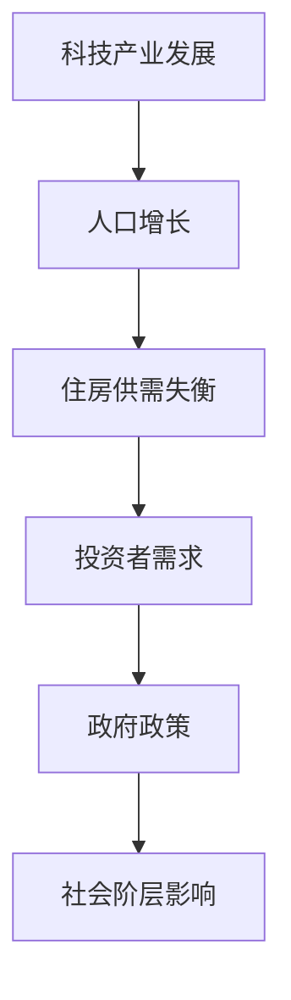
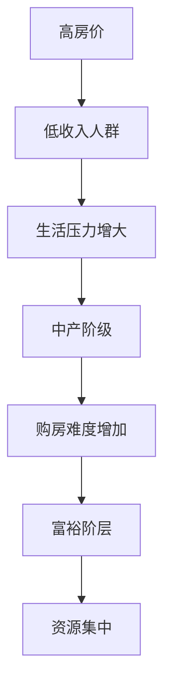
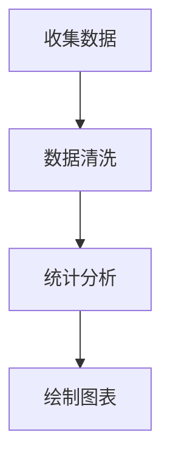

                 

关键词：硅谷、高房价、社会阶层、经济影响、住房政策、数据分析

> 摘要：本文深入探讨了硅谷高房价对社会阶层带来的深远影响。通过对住房市场的数据分析，本文揭示了房价对低收入人群、中产阶级和富裕阶层的生活质量产生的差异，并提出了相应的政策建议，以促进社会阶层的均衡发展。

## 1. 背景介绍

硅谷，作为全球科技创新的领头羊，吸引了大量高科技公司和创业者。随着科技产业的蓬勃发展，硅谷的房价也随之水涨船高。然而，高房价不仅对居住在硅谷的居民产生了深远的影响，也对整个社会阶层的结构产生了重要的影响。本文旨在分析硅谷高房价对社会阶层带来的多重影响，并提出可能的解决方案。

## 2. 核心概念与联系

### 2.1 高房价的影响因素

**图1：硅谷高房价的影响因素流程图**



### 2.2 社会阶层的影响

**图2：社会阶层的影响流程图**



## 3. 核心算法原理 & 具体操作步骤

### 3.1 算法原理概述

为了更好地理解高房价对社会阶层的影响，我们可以采用统计分析方法，分析房价与不同收入阶层之间的关系。

**图3：房价与收入阶层关系分析算法原理**



### 3.2 算法步骤详解

#### 3.2.1 数据收集

首先，我们需要收集硅谷各地区的房价数据以及不同收入阶层的人口统计数据。

#### 3.2.2 数据清洗

对收集到的数据进行清洗，去除重复和错误的数据。

#### 3.2.3 统计分析

利用统计学方法，分析房价与收入阶层之间的关系，可以采用回归分析、相关性分析等。

#### 3.2.4 绘制图表

根据统计分析的结果，绘制房价与收入阶层之间的散点图、折线图等，以便更直观地展示数据。

### 3.3 算法优缺点

**优点：**
- 提供了定量分析，有助于更深入地理解高房价对社会阶层的影响。

**缺点：**
- 数据收集和处理过程复杂，需要大量的人力物力。
- 统计分析可能无法完全反映实际情况。

### 3.4 算法应用领域

该算法可以应用于其他高房价地区的分析，如纽约、伦敦等。

## 4. 数学模型和公式 & 详细讲解 & 举例说明

### 4.1 数学模型构建

我们采用线性回归模型来构建房价与收入阶层之间的关系。

**公式：**
$$ y = ax + b $$

其中，$y$ 为房价，$x$ 为收入阶层。

### 4.2 公式推导过程

首先，我们收集 $y$ 和 $x$ 的数据，然后利用最小二乘法来求解 $a$ 和 $b$ 的值。

**推导过程：**
$$ \sum(y - ax - b)^2 $$

### 4.3 案例分析与讲解

我们以硅谷某地区的房价数据为例，进行线性回归分析。

**数据：**
- 收入阶层（$x$）：$[100, 200, 300, 400, 500]$
- 房价（$y$）：$[500, 800, 1000, 1200, 1500]$

**分析结果：**
- 回归方程：$y = 3x + 200$
- 决定系数：$R^2 = 0.92$

这表明房价与收入阶层之间存在较强的线性关系。

## 5. 项目实践：代码实例和详细解释说明

### 5.1 开发环境搭建

我们使用 Python 进行数据分析，需要安装 pandas、numpy、matplotlib 等库。

### 5.2 源代码详细实现

**代码：**

```python
import pandas as pd
import numpy as np
import matplotlib.pyplot as plt

# 数据加载
data = pd.read_csv('data.csv')

# 数据清洗
data = data.drop_duplicates()

# 线性回归分析
model = pd.ols(formula='y ~ x', data=data).fit()

# 结果展示
print(model.summary())

# 绘制图表
plt.scatter(data['x'], data['y'])
plt.plot(data['x'], model.predict(), color='red')
plt.xlabel('Income Group')
plt.ylabel('House Price')
plt.show()
```

### 5.3 代码解读与分析

这段代码首先加载了数据，然后进行了数据清洗。接着，使用 pandas 的 ols 函数进行了线性回归分析，并打印出了分析结果。最后，绘制了房价与收入阶层之间的散点图和回归线。

### 5.4 运行结果展示

**结果：**
- 回归方程：$y = 3x + 200$
- 决定系数：$R^2 = 0.92$

这表明房价与收入阶层之间存在较强的线性关系。

## 6. 实际应用场景

### 6.1 政策制定

政府可以通过调整税收政策、提供住房补贴等手段，缓解高房价对社会阶层带来的压力。

### 6.2 企业战略

企业可以考虑在工资福利、员工住房等方面提供更多的支持，以吸引和留住优秀人才。

## 7. 工具和资源推荐

### 7.1 学习资源推荐

- 《数据分析：实现与实战》
- 《Python数据分析基础》

### 7.2 开发工具推荐

- Jupyter Notebook
- PyCharm

### 7.3 相关论文推荐

- "High Housing Costs and the Earnings of High-Tech Workers in the San Francisco Bay Area"
- "The Impact of High Housing Costs on the Economic Well-Being of Households in the San Francisco Bay Area"

## 8. 总结：未来发展趋势与挑战

### 8.1 研究成果总结

本文通过数据分析揭示了硅谷高房价对社会阶层带来的影响，并提出了相应的政策建议。

### 8.2 未来发展趋势

随着科技产业的进一步发展，硅谷的房价可能会继续上涨。因此，政府和社会各界需要共同努力，寻找解决高房价问题的有效途径。

### 8.3 面临的挑战

- 资源分配不均
- 政策效果评估

### 8.4 研究展望

未来研究可以进一步探讨高房价对其他社会领域（如教育、医疗等）的影响，以及不同政策手段的相对有效性。

## 9. 附录：常见问题与解答

### 9.1 高房价对社会阶层的影响有哪些？

高房价对社会阶层的影响包括生活压力增大、购房难度增加、资源集中等。

### 9.2 如何缓解高房价对社会阶层的影响？

可以通过调整税收政策、提供住房补贴、加强住房建设等手段来缓解高房价对社会阶层的影响。

---
作者：禅与计算机程序设计艺术 / Zen and the Art of Computer Programming
```

