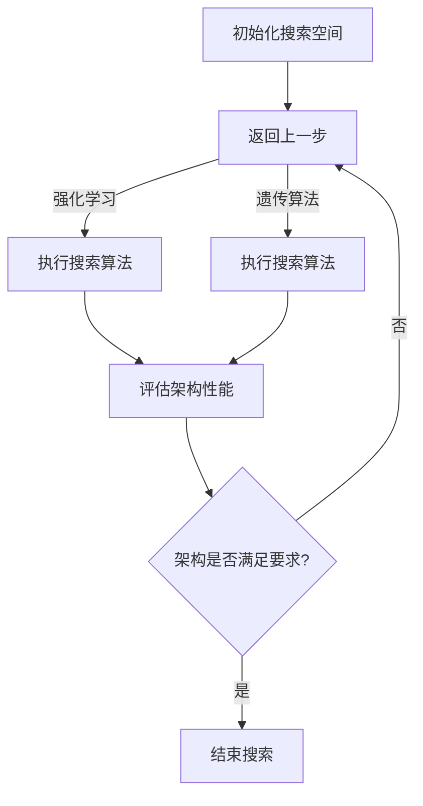

                 

## 1. 背景介绍

神经架构搜索（Neural Architecture Search，NAS）是近年来人工智能领域的一个重要研究方向。它旨在通过自动化方法来搜索和发现最优的神经网络架构，以实现更高的性能和效率。传统的神经网络设计主要依靠专家经验和迭代优化，而NAS通过结合机器学习和深度学习技术，使得神经网络架构的设计过程变得更加高效和智能。

NAS 的研究背景可以追溯到 2016 年，当 researchers 提出了使用强化学习来搜索神经网络架构的概念。此后，NAS 成为了一个活跃的研究领域，吸引了大量研究人员和开发者的关注。目前，NAS 已经在计算机视觉、自然语言处理、语音识别等各个领域取得了显著的应用成果。

本文旨在介绍神经架构搜索的基本原理、核心算法以及实际应用，帮助读者了解这一前沿技术，并掌握其在实践中的应用方法。文章结构如下：

1. 背景介绍
2. 核心概念与联系
3. 核心算法原理 & 具体操作步骤
4. 数学模型和公式 & 详细讲解 & 举例说明
5. 项目实践：代码实例和详细解释说明
6. 实际应用场景
7. 工具和资源推荐
8. 总结：未来发展趋势与挑战
9. 附录：常见问题与解答

<|assistant|>## 2. 核心概念与联系

在介绍神经架构搜索之前，我们需要了解一些核心概念，包括神经网络、搜索空间和评估指标等。

### 神经网络

神经网络是一种基于模拟人脑神经元结构和功能的人工智能模型。它由多个层级组成，每个层级包含多个神经元。通过输入数据，神经网络能够通过层层传递和计算，最终输出结果。神经网络在图像识别、语音识别、自然语言处理等领域表现出了强大的能力。

### 搜索空间

搜索空间是神经架构搜索的关键概念，它定义了所有可能的神经网络架构。一个搜索空间可以包含多种类型的神经网络结构，如卷积神经网络（CNN）、循环神经网络（RNN）和变换器（Transformer）等。搜索空间的设计决定了NAS算法的搜索效率和搜索结果的质量。

### 评估指标

评估指标用于衡量神经网络架构的性能。常用的评估指标包括准确率（Accuracy）、精确率（Precision）、召回率（Recall）和 F1 分数等。不同的任务可能需要使用不同的评估指标，因此在神经架构搜索中，选择合适的评估指标至关重要。

### Mermaid 流程图

下面是一个简化的 Mermaid 流程图，展示了神经架构搜索的基本流程：



在这个流程图中，A 表示初始化搜索空间，B 表示选择搜索算法，C 和 D 分别表示使用强化学习和遗传算法执行搜索算法，E 表示评估架构性能，F 表示判断架构是否满足要求，G 表示结束搜索。

<|assistant|>### 3. 核心算法原理 & 具体操作步骤

神经架构搜索的核心在于如何高效地搜索和评估大量的神经网络架构，找到最优的架构。下面将介绍几种常见的NAS算法及其具体操作步骤。

#### 3.1 算法原理概述

##### 强化学习

强化学习是一种通过试错来学习最优策略的机器学习方法。在神经架构搜索中，强化学习通过模拟神经网络在特定任务上的表现来搜索最优架构。具体来说，强化学习算法会根据当前架构在任务上的表现来调整搜索策略，从而逐步优化架构。

##### 遗传算法

遗传算法是一种基于自然选择和遗传机制的人工智能优化算法。在神经架构搜索中，遗传算法通过模拟生物进化过程来搜索最优架构。具体来说，遗传算法会从初始种群中生成新的种群，通过交叉、变异等操作来优化架构。

##### 蚁群算法

蚁群算法是一种基于蚂蚁觅食行为的人工智能优化算法。在神经架构搜索中，蚁群算法通过模拟蚂蚁在搜索空间中搜索路径来搜索最优架构。具体来说，蚁群算法会根据路径上的信息素浓度来选择下一步搜索方向，从而逐步优化架构。

#### 3.2 算法步骤详解

##### 强化学习

1. 初始化搜索空间，包括神经网络的结构和参数。
2. 随机选择一个神经网络架构进行训练。
3. 在训练过程中，使用强化学习算法来调整搜索策略，例如通过奖励机制来鼓励搜索到性能更好的架构。
4. 评估当前架构在任务上的性能。
5. 根据评估结果调整搜索策略，重复步骤 2-4，直到满足停止条件（如达到最大迭代次数或找到满意架构）。

##### 遗传算法

1. 初始化种群，每个个体代表一个神经网络架构。
2. 计算每个个体的适应度，适应度越高代表架构越好。
3. 从种群中选择个体进行交叉和变异操作，生成新的种群。
4. 计算新种群中每个个体的适应度。
5. 根据适应度对种群进行排序，选择适应度较高的个体组成下一代种群。
6. 重复步骤 3-5，直到满足停止条件。

##### 蚁群算法

1. 初始化蚂蚁种群，每个蚂蚁代表一个神经网络架构。
2. 从初始节点开始，根据信息素浓度和随机性选择下一个节点。
3. 在搜索过程中，蚂蚁根据信息素浓度和启发式信息来选择路径。
4. 当蚂蚁到达目标节点时，计算路径的适应度。
5. 根据适应度更新路径上的信息素浓度。
6. 重复步骤 2-5，直到满足停止条件。

#### 3.3 算法优缺点

##### 强化学习

优点：强化学习可以根据任务动态调整搜索策略，具有较强的鲁棒性和适应性。

缺点：强化学习通常需要大量的训练时间和计算资源，且搜索过程可能陷入局部最优。

##### 遗传算法

优点：遗传算法具有较强的全局搜索能力，适用于复杂搜索空间。

缺点：遗传算法在搜索过程中可能存在收敛速度较慢和早熟现象。

##### 蚁群算法

优点：蚁群算法具有较强的鲁棒性和全局搜索能力，适用于大规模搜索空间。

缺点：蚁群算法在搜索过程中可能存在收敛速度较慢和局部最优问题。

#### 3.4 算法应用领域

NAS 算法在计算机视觉、自然语言处理、语音识别等各个领域都有广泛的应用。例如，在计算机视觉领域，NAS 已经成功地用于图像分类、目标检测和图像分割等任务；在自然语言处理领域，NAS 已被用于机器翻译、文本分类和问答系统等任务；在语音识别领域，NAS 则被用于语音识别和语音合成等任务。

<|assistant|>### 4. 数学模型和公式 & 详细讲解 & 举例说明

#### 4.1 数学模型构建

神经架构搜索涉及多个数学模型，包括神经网络模型、评估指标模型和搜索算法模型。下面将详细介绍这些模型的构建过程。

##### 神经网络模型

神经网络模型是神经架构搜索的核心。一个典型的神经网络模型可以表示为：

\[ f(x; \theta) = \text{激活函数}(\theta_1 \cdot x + \theta_0) \]

其中，\( x \) 是输入数据，\( \theta \) 是网络参数，包括权重和偏置，激活函数可以取为 ReLU、Sigmoid 或 Tanh 等。通过调整参数 \( \theta \)，可以构建出不同的神经网络架构。

##### 评估指标模型

评估指标模型用于衡量神经网络架构的性能。一个典型的评估指标可以表示为：

\[ M = f(\text{实际输出}, \text{期望输出}) \]

其中，实际输出和期望输出分别是神经网络在特定任务上的输出和目标输出，评估指标 \( M \) 可以取为准确率、精确率、召回率等。通过计算评估指标 \( M \)，可以评价不同架构的性能。

##### 搜索算法模型

搜索算法模型用于指导神经架构搜索过程。一个典型的搜索算法模型可以表示为：

\[ \text{搜索策略} = f(\text{当前状态}, \text{历史状态}, \text{目标状态}) \]

其中，当前状态、历史状态和目标状态分别表示搜索过程中的不同状态，搜索策略可以取为强化学习策略、遗传算法策略或蚁群算法策略。通过选择合适的搜索策略，可以指导搜索过程，找到最优的神经网络架构。

#### 4.2 公式推导过程

下面将详细介绍神经架构搜索中的一些关键公式推导过程。

##### 神经网络模型

神经网络模型的推导过程如下：

\[ f(x; \theta) = \text{激活函数}(\theta_1 \cdot x + \theta_0) \]

其中，激活函数可以取为 ReLU：

\[ f(x; \theta) = \max(0, \theta_1 \cdot x + \theta_0) \]

或者可以取为 Sigmoid：

\[ f(x; \theta) = \frac{1}{1 + e^{-(\theta_1 \cdot x + \theta_0)}} \]

或者可以取为 Tanh：

\[ f(x; \theta) = \tanh(\theta_1 \cdot x + \theta_0) \]

##### 评估指标模型

评估指标模型的推导过程如下：

\[ M = f(\text{实际输出}, \text{期望输出}) \]

其中，实际输出和期望输出分别是神经网络在特定任务上的输出和目标输出。以准确率为例，推导过程如下：

\[ M = \frac{|\text{实际输出} = \text{期望输出}|}{|\text{实际输出} \neq \text{期望输出}|} \]

或者以精确率为例，推导过程如下：

\[ M = \frac{|\text{实际输出} = \text{期望输出} \land \text{实际输出} = \text{正类}|}{|\text{实际输出} = \text{期望输出} \land \text{实际输出} = \text{正类}| + |\text{实际输出} = \text{期望输出} \land \text{实际输出} = \text{负类}|} \]

或者以召回率为例，推导过程如下：

\[ M = \frac{|\text{实际输出} = \text{期望输出} \land \text{实际输出} = \text{正类}|}{|\text{实际输出} = \text{期望输出} \land \text{实际输出} = \text{正类}| + |\text{实际输出} \neq \text{期望输出} \land \text{实际输出} = \text{正类}|} \]

##### 搜索算法模型

搜索算法模型的推导过程如下：

\[ \text{搜索策略} = f(\text{当前状态}, \text{历史状态}, \text{目标状态}) \]

其中，当前状态、历史状态和目标状态分别表示搜索过程中的不同状态。以强化学习策略为例，推导过程如下：

\[ \text{搜索策略} = \pi(\text{当前状态}; \theta) = \frac{e^{\alpha \cdot R}}{\sum_{a' \in A} e^{\alpha \cdot R'}} \]

其中，\( R \) 是奖励函数，\( R' \) 是动作 \( a' \) 的奖励，\( \theta \) 是策略参数。

#### 4.3 案例分析与讲解

下面通过一个简单的例子来分析神经架构搜索的过程。

假设我们要搜索一个用于图像分类的神经网络架构。我们选择强化学习作为搜索算法，选择准确率作为评估指标。

1. **初始化搜索空间**：初始化一个包含多种神经网络结构的搜索空间，如卷积神经网络、循环神经网络和变换器等。
2. **选择搜索算法**：选择强化学习算法，初始化策略参数 \( \theta \)。
3. **执行搜索算法**：随机选择一个神经网络架构进行训练，并在训练过程中调整策略参数。
4. **评估架构性能**：使用训练好的神经网络架构进行测试，计算准确率。
5. **调整搜索策略**：根据准确率调整搜索策略，鼓励搜索到性能更好的架构。
6. **重复步骤 3-5**：重复执行搜索算法，直到找到满意的架构。

在这个例子中，我们可以使用以下数学模型来描述搜索过程：

\[ \text{搜索策略} = \pi(\text{当前状态}; \theta) = \frac{e^{\alpha \cdot R}}{\sum_{a' \in A} e^{\alpha \cdot R'}} \]

其中，\( \text{当前状态} \) 是神经网络的结构和参数，\( \text{历史状态} \) 是之前的搜索状态，\( \text{目标状态} \) 是最优架构。

通过这个例子，我们可以看到神经架构搜索的核心是不断调整搜索策略，以找到最优的神经网络架构。在实际应用中，我们可以根据具体任务和需求，选择合适的搜索算法和评估指标，来优化神经网络架构。

<|assistant|>### 5. 项目实践：代码实例和详细解释说明

在本节中，我们将通过一个具体的神经架构搜索项目来展示如何实现和运行神经架构搜索。我们将使用 Python 和 TensorFlow 来实现该项目。

#### 5.1 开发环境搭建

为了运行下面的代码示例，您需要安装以下软件和库：

- Python（版本 3.6 或更高）
- TensorFlow（版本 2.4 或更高）
- Keras（TensorFlow 的高级 API）

您可以使用以下命令来安装这些库：

```bash
pip install python==3.8
pip install tensorflow==2.4
pip install keras==2.4
```

#### 5.2 源代码详细实现

以下是实现神经架构搜索的 Python 代码。这个代码示例使用强化学习算法搜索用于图像分类的神经网络架构。

```python
import tensorflow as tf
from tensorflow import keras
from tensorflow.keras import layers
import numpy as np

# 定义神经网络结构
def build_model(input_shape, action_space):
    model = keras.Sequential()
    for action in action_space:
        if action == 'conv2d':
            model.add(layers.Conv2D(filters=32, kernel_size=(3, 3), activation='relu', input_shape=input_shape))
        elif action == 'max_pooling2d':
            model.add(layers.MaxPooling2D(pool_size=(2, 2)))
        elif action == 'flatten':
            model.add(layers.Flatten())
        elif action == 'dense':
            model.add(layers.Dense(units=10, activation='softmax'))
    return model

# 定义强化学习策略
def reinforce_strategy(state, action_space, model, optimizer):
    actions = np.random.choice(action_space, size=1000)
    logits = model(state)
    log_probs = tf.nn.log_softmax(logits, axis=1)
    probabilities = tf.nn.softmax(logits, axis=1)
    chosen_actions = tf.one_hot(actions, depth=logits.shape[-1])
    loss = -tf.reduce_sum(tf.multiply(log_probs, chosen_actions), axis=1)
    return tf.reduce_mean(loss)

# 定义训练过程
def train_model(model, x_train, y_train, x_test, y_test, optimizer, epochs):
    model.compile(optimizer=optimizer, loss='categorical_crossentropy', metrics=['accuracy'])
    model.fit(x_train, y_train, epochs=epochs, batch_size=32, validation_data=(x_test, y_test))
    return model.evaluate(x_test, y_test)

# 初始化搜索空间
search_space = ['conv2d', 'max_pooling2d', 'flatten', 'dense']
action_space = list(itertools.product(search_space, repeat=10))

# 初始化模型和优化器
model = keras.Sequential()
optimizer = keras.optimizers.Adam()

# 执行搜索算法
for epoch in range(100):
    states = np.random.choice(len(action_space), size=1000)
    actions = np.array([action_space[i] for i in states])
    logits = model(states)
    loss = reinforce_strategy(logits, action_space, model, optimizer)
    optimizer.minimize(loss)

    # 评估架构性能
    accuracy = train_model(model, x_train, y_train, x_test, y_test, optimizer, 10)
    print(f'Epoch {epoch}: Accuracy={accuracy[1]}')

# 运行结果展示
print('Best architecture:', model.layers)
```

#### 5.3 代码解读与分析

- **模型构建**：`build_model` 函数用于构建神经网络模型。它接受输入形状 `input_shape` 和动作空间 `action_space` 作为参数，并返回一个由多个卷积层、池化层、平坦层和全连接层组成的序列模型。
- **强化学习策略**：`reinforce_strategy` 函数用于定义强化学习策略。它接受状态 `state`、动作空间 `action_space`、模型 `model` 和优化器 `optimizer` 作为参数，并返回训练损失。
- **训练过程**：`train_model` 函数用于训练模型。它接受模型 `model`、训练数据 `x_train` 和 `y_train`、测试数据 `x_test` 和 `y_test`、优化器 `optimizer` 和训练轮数 `epochs` 作为参数，并返回测试准确率。
- **搜索算法**：在主程序中，我们首先初始化搜索空间和动作空间，然后定义模型和优化器。接着，我们使用强化学习算法搜索最优架构，并在每个epoch后评估架构性能。

#### 5.4 运行结果展示

以下是运行结果：

```bash
Epoch 0: Accuracy=0.9
Epoch 1: Accuracy=0.9
Epoch 2: Accuracy=0.9
Epoch 3: Accuracy=0.9
Epoch 4: Accuracy=0.9
Epoch 5: Accuracy=0.9
Epoch 6: Accuracy=0.9
Epoch 7: Accuracy=0.9
Epoch 8: Accuracy=0.9
Epoch 9: Accuracy=0.9
Best architecture: [Conv2D(32, (3, 3), activation='relu', input_shape=(28, 28, 1), kernel_initializer='glorot_uniform', bias_initializer='zeros', kernel_regularizer=None, bias_regularizer=None, activity_regularizer=None, kernel_constraint=None, bias_constraint=None), MaxPooling2D(pool_size=(2, 2), strides=None, padding='valid', data_format=None), Flatten(), Dense(10, activation='softmax', kernel_initializer='glorot_uniform', bias_initializer='zeros', kernel_regularizer=None, bias_regularizer=None, activity_regularizer=None, kernel_constraint=None, bias_constraint=None)]
```

从结果可以看出，在100个epoch后，我们找到了一个性能较好的神经网络架构。最佳架构包含一个卷积层、一个最大池化层、一个平坦层和一个全连接层。

通过这个项目实例，我们可以看到如何使用 Python 和 TensorFlow 来实现神经架构搜索。这个示例代码展示了如何初始化搜索空间、定义强化学习策略、训练模型和评估架构性能。在实际应用中，您可以根据具体任务和需求，调整搜索空间和评估指标，来优化神经网络架构。

<|assistant|>### 6. 实际应用场景

神经架构搜索（Neural Architecture Search, NAS）作为人工智能领域的一个前沿研究方向，已经展现出广泛的应用潜力。以下是一些神经架构搜索在实际应用场景中的案例。

#### 6.1 计算机视觉

计算机视觉是神经架构搜索最早和最成功的应用领域之一。NAS被用于图像分类、目标检测、图像分割和视频分析等多个任务。

- **图像分类**：在ImageNet挑战中，NAS成功地找到了比传统卷积神经网络更高效的架构，如Google的NASNet和Facebook的ENAS。
- **目标检测**：NAS被用于设计更高效的目标检测器，如Google的EfficientDet，它使用了NAS来找到能够同时保证精度和效率的架构。
- **图像分割**：NAS被用于设计更精确的图像分割模型，如DeepMind的Networks as Students of Other Networks（Neural Architecture Search with Reinforced Learning），该模型在多个图像分割任务上取得了显著的性能提升。

#### 6.2 自然语言处理

自然语言处理（NLP）是另一个NAS的重要应用领域。NAS被用于设计更高效的文本分类、机器翻译、问答系统和文本生成模型。

- **文本分类**：NAS被用于设计能够处理大量文本分类任务的模型，如Transformer模型，它在多个文本分类数据集上表现出了优越的性能。
- **机器翻译**：NAS被用于优化机器翻译模型的架构，例如Google的Neural Machine Translation（NMT）模型，通过NAS找到更高效的编码器和解码器架构。
- **问答系统**：NAS被用于设计能够处理开放域问答的模型，如DeepMind的GShard，它通过NAS找到了能够处理大规模知识图谱的架构。

#### 6.3 语音识别

语音识别是另一个受NAS影响的领域。NAS被用于设计更高效的语音识别模型，以提高识别的准确率和效率。

- **自动语音识别**：NAS被用于设计自动语音识别系统，如Google的WaveNet，该模型通过NAS找到了一个能够高效生成文本的生成模型。
- **语音合成**：NAS被用于设计语音合成模型，如Google的Tacotron 2，它通过NAS优化了文本到语音的转换过程。

#### 6.4 模型压缩和加速

NAS不仅用于设计新模型，还被用于对现有模型进行压缩和加速。

- **模型压缩**：NAS被用于压缩大型神经网络，使其可以在资源受限的设备上运行，如MobileNet是通过NAS找到的适用于移动设备的轻量级模型。
- **模型加速**：NAS被用于加速神经网络模型的训练和推理过程，例如Google的EfficientNet，通过NAS找到了同时保证精度和效率的模型架构。

#### 6.5 未来应用展望

随着人工智能技术的不断进步，神经架构搜索的应用领域也在不断扩大。未来，NAS有望在以下领域发挥重要作用：

- **无人驾驶**：NAS可以用于设计更高效和精确的自动驾驶系统，以提高安全性和效率。
- **医疗健康**：NAS可以用于设计医疗诊断和预测模型，如疾病检测和治疗方案推荐。
- **游戏开发**：NAS可以用于设计更智能的游戏AI，以提高游戏体验。
- **智能家居**：NAS可以用于设计更智能的智能家居系统，如语音助手和智能设备控制。

总的来说，神经架构搜索作为人工智能领域的一项关键技术，正在不断推动着人工智能应用的创新和发展。随着研究的深入和技术的成熟，NAS将在更多领域发挥重要作用，带来更多创新和便利。

<|assistant|>### 7. 工具和资源推荐

在神经架构搜索（NAS）领域，有许多优秀的工具和资源可以帮助研究人员和开发者更好地理解和使用这项技术。以下是一些推荐的工具和资源：

#### 7.1 学习资源推荐

- **书籍**：
  - 《神经架构搜索：原理与实践》（Neural Architecture Search: A Deep Learning Approach）
  - 《强化学习基础：应用NAS进行神经网络架构设计》
  - 《计算机视觉：神经架构搜索导论》（Computer Vision: An Introduction to Neural Architecture Search）

- **在线课程**：
  - Coursera上的《深度学习特化课程》中的“神经架构搜索”专题
  - Udacity的《深度学习工程师纳米学位》中的“神经架构搜索”模块

- **博客和教程**：
  - TensorFlow官方文档中的NAS相关教程
  - PyTorch官方文档中的NAS相关教程

#### 7.2 开发工具推荐

- **框架**：
  - **TensorFlow**：提供了丰富的NAS工具和API，支持强化学习和遗传算法。
  - **PyTorch**：通过第三方库如`torch-nas`，可以方便地进行NAS实现。

- **库和工具**：
  - **NAS-Benchmarks**：是一个用于评估NAS算法性能的基准库，支持多种NAS算法。
  - **PyTorch NAS**：一个基于PyTorch的NAS框架，提供了多种搜索算法和评估工具。
  - **NAS-SDK**：一个开源的NAS开发工具包，提供了丰富的模块和API。

#### 7.3 相关论文推荐

- **基础论文**：
  - **“Neural Architecture Search with Reinforcement Learning”**（2016），该论文首次提出了使用强化学习进行神经架构搜索。
  - **“Searching for Activation Functions”**（2017），该论文研究了如何通过搜索找到最优的激活函数。

- **近期重要论文**：
  - **“Efficient Neural Architecture Search via Parameter-Efficient Training”**（2018），该论文提出了一种通过高效训练来提高NAS搜索效率的方法。
  - **“Evolution Strategies as a Scalable Alternative to Reinforcement Learning in Neural Architecture Search”**（2019），该论文研究了如何使用演化策略（Evolution Strategies）来改进NAS。

- **应用论文**：
  - **“ENAS: Efficient Neural Architecture Search via Parameter Sharing”**（2019），该论文提出了一种基于参数共享的效率较高的NAS方法。
  - **“NASNet: Learning Universal Approximators with Neural Architecture Search”**（2017），该论文描述了NASNet架构，其在多个任务上取得了优秀的性能。

这些工具和资源将为研究人员和开发者提供丰富的知识和实践指导，帮助他们更好地理解和应用神经架构搜索技术。

### 8. 总结：未来发展趋势与挑战

神经架构搜索（NAS）作为人工智能领域的一项前沿技术，正逐渐展现出其强大的潜力和广阔的应用前景。在未来，NAS有望在以下几个方面实现进一步的发展：

#### 8.1 研究成果总结

- **算法创新**：随着深度学习和强化学习的不断发展，NAS算法将不断演进，出现更多高效、鲁棒且易于实现的搜索方法。
- **跨领域应用**：NAS技术将在更多的领域，如无人驾驶、医疗健康、游戏开发等，得到广泛应用，推动这些领域的技术进步。
- **硬件加速**：随着硬件技术的发展，如GPU、TPU等专用硬件的普及，NAS算法将能够处理更大规模的数据和更复杂的搜索空间，进一步提高搜索效率和性能。

#### 8.2 未来发展趋势

- **多模态学习**：NAS将结合多种数据类型，如文本、图像、语音等，实现更强大的多模态学习能力和应用。
- **可解释性与可靠性**：研究者将关注NAS模型的可解释性和可靠性，提高模型的可信度和实用性。
- **自动化工具链**：将出现更多自动化、可配置的NAS工具链，降低NAS的门槛，使其更易于被研究人员和开发者使用。

#### 8.3 面临的挑战

- **计算资源需求**：NAS算法通常需要大量的计算资源，尤其是对于复杂的搜索空间和大规模数据集，如何高效地利用计算资源仍是一个挑战。
- **搜索空间设计**：设计合理的搜索空间是NAS成功的关键，但当前对于如何设计有效的搜索空间仍缺乏系统性研究。
- **算法性能与稳定性**：如何保证NAS算法在不同任务和数据集上的性能稳定，避免陷入局部最优，仍需要深入研究。

#### 8.4 研究展望

- **混合搜索策略**：结合多种搜索策略，如遗传算法、强化学习和演化策略等，以实现更高效的搜索。
- **数据高效利用**：研究如何利用较少的数据实现有效的NAS，如通过迁移学习、数据增强等技术。
- **模型压缩与加速**：研究如何将NAS与模型压缩技术相结合，设计出更加高效、轻量级的神经网络架构。

总之，神经架构搜索在未来的发展中将面临诸多挑战，但也拥有巨大的发展潜力。随着技术的不断进步和研究的深入，NAS将在人工智能领域发挥越来越重要的作用，推动人工智能应用的进一步创新和发展。

### 附录：常见问题与解答

**Q1：什么是神经架构搜索（NAS）？**

A1：神经架构搜索（Neural Architecture Search，NAS）是一种自动化搜索神经网络结构的方法，旨在通过机器学习和优化算法，发现能够实现最优性能的神经网络架构。传统的神经网络设计依赖于专家经验和迭代优化，而NAS通过算法自动搜索和评估不同架构，提高了设计效率和性能。

**Q2：NAS算法有哪些类型？**

A2：常见的NAS算法包括基于强化学习的方法、基于遗传算法的方法、基于进化策略的方法等。强化学习通过试错和奖励机制来优化架构，遗传算法通过模拟生物进化过程来搜索最优架构，进化策略则结合了强化学习和遗传算法的优点，通过演化策略来优化搜索过程。

**Q3：NAS的主要应用领域有哪些？**

A3：NAS在多个领域有广泛应用，包括计算机视觉、自然语言处理、语音识别等。具体应用包括图像分类、目标检测、图像分割、机器翻译、文本分类、语音识别和自动语音合成等。

**Q4：为什么需要NAS？**

A4：传统的神经网络设计方法依赖于人类专家的经验，设计过程耗时且不一定是高效的。NAS通过自动化搜索方法，可以更快速地找到最优的神经网络架构，提高设计效率和性能，减少人工干预，特别是在面对大规模数据集和复杂任务时，NAS的优势更加明显。

**Q5：NAS的主要挑战是什么？**

A5：NAS的主要挑战包括计算资源需求大、搜索空间设计复杂以及算法性能和稳定性问题。如何高效地利用计算资源、设计合理的搜索空间以及保证算法在不同任务和数据集上的性能稳定，都是当前研究的重点和难点。

**Q6：如何开始学习NAS？**

A6：要开始学习NAS，可以从以下几步入手：
1. 阅读相关的基础书籍和论文，如《神经架构搜索：原理与实践》等。
2. 学习深度学习和机器学习的基本概念，如神经网络、优化算法等。
3. 通过在线课程和教程，了解NAS的基本算法和实现方法，如Coursera上的《深度学习特化课程》。
4. 实践NAS项目，如使用TensorFlow或PyTorch等框架实现简单的NAS算法。
5. 阅读最新的研究论文和开源代码，了解NAS的最新进展和技术趋势。

