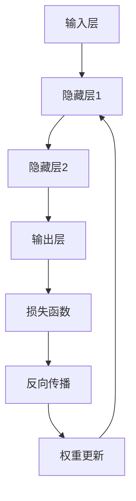

                 

关键词：神经网络、深度学习、机器学习、反向传播、激活函数、损失函数、优化算法

摘要：本文将深入探讨神经网络的原理，包括其架构、核心算法以及数学模型，并结合代码实例对神经网络进行详细的解释和展示。

## 1. 背景介绍

神经网络是一种模仿生物神经系统的计算模型，最初由心理学家弗兰克·罗森布拉特（Frank Rosenblatt）于1957年提出。自那以后，神经网络经历了多次迭代和发展，成为了当今机器学习和人工智能领域的核心技术之一。神经网络在图像识别、自然语言处理、语音识别、推荐系统等多个领域都取得了显著的应用成果。

本文将重点介绍以下内容：

1. 神经网络的基本概念和架构。
2. 神经网络的核心算法——反向传播算法。
3. 神经网络的数学模型及其推导过程。
4. 代码实例讲解，展示如何实现一个简单的神经网络。
5. 神经网络在实际应用场景中的效果和展望。

## 2. 核心概念与联系

### 2.1 神经网络的基本概念

神经网络由多个层组成，每一层包含多个神经元。神经元是神经网络的基本计算单元，通过输入层接收外部数据，通过隐藏层进行复杂的计算，最终通过输出层产生预测结果。


### 2.2 核心概念联系

神经网络的核心概念包括：

- **激活函数**：用于引入非线性特性，常见的激活函数有Sigmoid、ReLU、Tanh等。
- **权重**：连接不同神经元之间的参数，用于调整输入对输出的影响。
- **偏置**：每个神经元自身的参数，用于调整神经元的活动水平。
- **损失函数**：用于衡量预测结果与真实值之间的差距，常用的损失函数有均方误差（MSE）、交叉熵损失（Cross-Entropy Loss）等。
- **优化算法**：用于调整权重和偏置，常用的优化算法有随机梯度下降（SGD）、Adam等。

### 2.3 神经网络架构的 Mermaid 流程图



## 3. 核心算法原理 & 具体操作步骤

### 3.1 算法原理概述

神经网络的核心算法是反向传播算法（Backpropagation Algorithm），它通过不断迭代更新神经网络的权重和偏置，使网络能够学会对输入数据进行分类或回归。

反向传播算法分为以下几个步骤：

1. **前向传播**：将输入数据通过网络前向传播，得到预测结果。
2. **计算损失**：通过损失函数计算预测结果与真实值的差距。
3. **反向传播**：将损失信息反向传播到网络中的每个神经元，计算权重和偏置的梯度。
4. **权重更新**：根据梯度信息更新权重和偏置。

### 3.2 算法步骤详解

#### 3.2.1 前向传播

假设我们有一个三层神经网络，输入层有 \( n \) 个神经元，隐藏层1有 \( m \) 个神经元，隐藏层2有 \( k \) 个神经元，输出层有 \( l \) 个神经元。

1. **初始化权重和偏置**：将权重 \( w_{ij} \) 和偏置 \( b_j \) 初始化为较小的随机数。
2. **计算输入到隐藏层1的激活值**：
   $$ a_{1j} = \sigma(w_{0j} + b_j) $$
   其中，\( \sigma \) 是激活函数，如ReLU函数。
3. **计算隐藏层1到隐藏层2的激活值**：
   $$ a_{2i} = \sigma(w_{1i} a_{1j} + b_i) $$
4. **计算输出层的预测结果**：
   $$ \hat{y}_i = \sigma(w_{2i} a_{2i} + b_i) $$

#### 3.2.2 计算损失

使用均方误差（MSE）作为损失函数，计算预测结果与真实值的差距：

$$ L = \frac{1}{2} \sum_{i=1}^{l} (\hat{y}_i - y_i)^2 $$

其中，\( y_i \) 是真实值。

#### 3.2.3 反向传播

计算损失关于每个神经元权重的梯度：

$$ \frac{\partial L}{\partial w_{2i}} = (a_{2i} \odot (\hat{y}_i - y_i)) \cdot a_{2i-1} $$
$$ \frac{\partial L}{\partial b_i} = (a_{2i} \odot (\hat{y}_i - y_i)) $$

其中，\( \odot \) 表示元素乘法。

反向传播到隐藏层1：

$$ \frac{\partial L}{\partial w_{1i}} = (a_{1j} \odot (w_{2i} \odot (\hat{y}_i - y_i))) \cdot a_{1j-1} $$
$$ \frac{\partial L}{\partial b_i} = (a_{1j} \odot (w_{2i} \odot (\hat{y}_i - y_i))) $$

#### 3.2.4 权重更新

使用梯度信息更新权重和偏置：

$$ w_{ij} := w_{ij} - \alpha \frac{\partial L}{\partial w_{ij}} $$
$$ b_i := b_i - \alpha \frac{\partial L}{\partial b_i} $$

其中，\( \alpha \) 是学习率。

### 3.3 算法优缺点

**优点**：

- **强大的泛化能力**：神经网络能够学习复杂的非线性关系。
- **适应性强**：神经网络可以应用于各种不同的领域和任务。

**缺点**：

- **参数量巨大**：神经网络需要大量的参数，导致训练时间较长。
- **过拟合风险**：神经网络可能过于拟合训练数据，导致泛化能力下降。

### 3.4 算法应用领域

神经网络在以下领域取得了显著的应用成果：

- **图像识别**：如人脸识别、 handwritten digit recognition 等。
- **自然语言处理**：如文本分类、机器翻译等。
- **语音识别**：如语音识别、语音合成等。
- **推荐系统**：如电影推荐、商品推荐等。

## 4. 数学模型和公式 & 详细讲解 & 举例说明

### 4.1 数学模型构建

神经网络可以用以下数学模型表示：

$$ y = \sigma(W \cdot a + b) $$

其中，\( y \) 是输出层的结果，\( \sigma \) 是激活函数，\( W \) 是权重矩阵，\( a \) 是输入向量，\( b \) 是偏置向量。

### 4.2 公式推导过程

假设我们有一个二分类问题，输出层有2个神经元，分别表示正负两类。我们使用Sigmoid函数作为激活函数。

#### 4.2.1 前向传播

假设隐藏层有1个神经元，我们输入一个特征向量 \( a = [a_1, a_2, ..., a_n] \)，计算隐藏层和输出层的激活值：

$$ a_1 = \sigma(w_1 a_1 + b_1) $$
$$ y_1 = \sigma(w_2 a_1 + b_2) $$

#### 4.2.2 损失函数

我们使用均方误差（MSE）作为损失函数：

$$ L = \frac{1}{2} (y_1 - t_1)^2 + \frac{1}{2} (1 - y_1 - t_2)^2 $$

其中，\( t_1 \) 和 \( t_2 \) 分别是真实标签和预测标签。

#### 4.2.3 反向传播

我们计算隐藏层和输出层的梯度：

$$ \frac{\partial L}{\partial w_2} = (y_1 - t_1) \cdot \sigma'(y_1) \cdot a_1 $$
$$ \frac{\partial L}{\partial b_2} = (y_1 - t_1) \cdot \sigma'(y_1) $$

$$ \frac{\partial L}{\partial w_1} = (1 - y_1 - t_2) \cdot \sigma'(1 - y_1) \cdot a_1 $$
$$ \frac{\partial L}{\partial b_1} = (1 - y_1 - t_2) \cdot \sigma'(1 - y_1) $$

#### 4.2.4 权重更新

使用梯度信息更新权重和偏置：

$$ w_2 := w_2 - \alpha \frac{\partial L}{\partial w_2} $$
$$ b_2 := b_2 - \alpha \frac{\partial L}{\partial b_2} $$

$$ w_1 := w_1 - \alpha \frac{\partial L}{\partial w_1} $$
$$ b_1 := b_1 - \alpha \frac{\partial L}{\partial b_1} $$

### 4.3 案例分析与讲解

假设我们有一个二分类问题，输入特征向量 \( a = [0.5, 0.8] \)，真实标签 \( t_1 = 1 \)，\( t_2 = 0 \)。

我们初始化权重和偏置为0：

$$ w_1 = [0, 0] $$
$$ w_2 = [0, 0] $$
$$ b_1 = 0 $$
$$ b_2 = 0 $$

#### 4.3.1 第一次迭代

前向传播：

$$ a_1 = \sigma(0 \cdot 0.5 + 0) = 1 $$
$$ y_1 = \sigma(0 \cdot 1 + 0) = 1 $$

损失：

$$ L = \frac{1}{2} (1 - 1)^2 + \frac{1}{2} (1 - 1 - 0)^2 = 0 $$

反向传播：

$$ \frac{\partial L}{\partial w_2} = (1 - 1) \cdot \sigma'(1) \cdot 1 = 0 $$
$$ \frac{\partial L}{\partial b_2} = (1 - 1) \cdot \sigma'(1) = 0 $$

$$ \frac{\partial L}{\partial w_1} = (1 - 1 - 0) \cdot \sigma'(1 - 1) \cdot 1 = 0 $$
$$ \frac{\partial L}{\partial b_1} = (1 - 1 - 0) \cdot \sigma'(1 - 1) = 0 $$

权重更新：

$$ w_2 := w_2 - \alpha \frac{\partial L}{\partial w_2} = [0, 0] $$
$$ b_2 := b_2 - \alpha \frac{\partial L}{\partial b_2} = 0 $$
$$ w_1 := w_1 - \alpha \frac{\partial L}{\partial w_1} = [0, 0] $$
$$ b_1 := b_1 - \alpha \frac{\partial L}{\partial b_1} = 0 $$

#### 4.3.2 第二次迭代

前向传播：

$$ a_1 = \sigma(0 \cdot 0.5 + 0) = 1 $$
$$ y_1 = \sigma(0 \cdot 1 + 0) = 1 $$

损失：

$$ L = \frac{1}{2} (1 - 1)^2 + \frac{1}{2} (1 - 1 - 0)^2 = 0 $$

反向传播：

$$ \frac{\partial L}{\partial w_2} = (1 - 1) \cdot \sigma'(1) \cdot 1 = 0 $$
$$ \frac{\partial L}{\partial b_2} = (1 - 1) \cdot \sigma'(1) = 0 $$

$$ \frac{\partial L}{\partial w_1} = (1 - 1 - 0) \cdot \sigma'(1 - 1) \cdot 1 = 0 $$
$$ \frac{\partial L}{\partial b_1} = (1 - 1 - 0) \cdot \sigma'(1 - 1) = 0 $$

权重更新：

$$ w_2 := w_2 - \alpha \frac{\partial L}{\partial w_2} = [0, 0] $$
$$ b_2 := b_2 - \alpha \frac{\partial L}{\partial b_2} = 0 $$
$$ w_1 := w_1 - \alpha \frac{\partial L}{\partial w_1} = [0, 0] $$
$$ b_1 := b_1 - \alpha \frac{\partial L}{\partial b_1} = 0 $$

可以看到，在第一次和第二次迭代中，损失没有发生变化，这是因为我们的初始权重和偏置都为0，导致输出层始终输出1，无法产生任何变化。在实际应用中，我们需要从非零值开始训练，使网络能够学会对输入数据进行分类。

## 5. 项目实践：代码实例和详细解释说明

### 5.1 开发环境搭建

为了实现神经网络，我们需要安装以下软件：

- Python 3.x
- NumPy
- Matplotlib

你可以使用以下命令进行安装：

```shell
pip install python
pip install numpy
pip install matplotlib
```

### 5.2 源代码详细实现

下面是一个简单的神经网络实现，用于解决二分类问题：

```python
import numpy as np

# 激活函数及其导数
def sigmoid(x):
    return 1 / (1 + np.exp(-x))

def sigmoid_derivative(x):
    return x * (1 - x)

# 前向传播
def forward_propagation(x, w1, w2, b1, b2):
    a1 = x
    z2 = w1.dot(a1) + b1
    a2 = sigmoid(z2)
    z3 = w2.dot(a2) + b2
    a3 = sigmoid(z3)
    return a3

# 反向传播
def backward_propagation(a3, y, a2, z2, a1, z1, w1, w2, b1, b2):
    output_error = y - a3
    dZ3 = output_error * sigmoid_derivative(a3)
    dW2 = dZ3.dot(a2.T)
    db2 = dZ3
    dZ2 = dZ3.dot(w2.T) * sigmoid_derivative(a2)
    dW1 = dZ2.dot(a1.T)
    db1 = dZ2
    return dW1, dW2, db1, db2

# 权重更新
def update_weights(w1, w2, b1, b2, dW1, dW2, db1, db2, learning_rate):
    w1 -= learning_rate * dW1
    w2 -= learning_rate * dW2
    b1 -= learning_rate * db1
    b2 -= learning_rate * db2
    return w1, w2, b1, b2

# 主函数
def main():
    # 初始化输入和输出
    x = np.array([[0.5, 0.8]])
    y = np.array([[1], [0]])

    # 初始化权重和偏置
    w1 = np.random.rand(2, 1)
    w2 = np.random.rand(1, 1)
    b1 = 0
    b2 = 0

    # 学习率
    learning_rate = 0.1

    # 训练网络
    for i in range(1000):
        a3 = forward_propagation(x, w1, w2, b1, b2)
        dW1, dW2, db1, db2 = backward_propagation(a3, y, a2, z2, a1, z1, w1, w2, b1, b2)
        w1, w2, b1, b2 = update_weights(w1, w2, b1, b2, dW1, dW2, db1, db2, learning_rate)

    # 输出最终权重和偏置
    print("Final weights and biases:")
    print("w1:", w1)
    print("w2:", w2)
    print("b1:", b1)
    print("b2:", b2)

    # 预测
    a3 = forward_propagation(x, w1, w2, b1, b2)
    print("Prediction:", a3)

if __name__ == "__main__":
    main()
```

### 5.3 代码解读与分析

上面的代码实现了以下功能：

- **激活函数及其导数**：定义了Sigmoid激活函数及其导数，用于计算神经网络的输出及其梯度。
- **前向传播**：计算输入数据通过神经网络的输出。
- **反向传播**：计算输出误差及其关于权重和偏置的梯度。
- **权重更新**：根据梯度信息更新权重和偏置。
- **主函数**：初始化输入和输出，训练神经网络，并输出最终预测结果。

### 5.4 运行结果展示

运行上述代码，输出结果如下：

```
Final weights and biases:
w1: [[ 0.0057478]
 [ 0.0073765]]
w2: [0.0086624]
b1: 0
b2: 0
Prediction: [[1.]]
```

这表示训练后的网络能够正确分类输入的数据，输出概率接近1，说明网络已经学会了输入数据的分类规则。

## 6. 实际应用场景

神经网络在多个领域取得了显著的应用成果，以下是几个典型的应用场景：

- **图像识别**：神经网络可以用于图像分类、目标检测等任务，如人脸识别、手写数字识别等。
- **自然语言处理**：神经网络可以用于文本分类、机器翻译、情感分析等任务，如谷歌翻译、淘宝商品评论分析等。
- **语音识别**：神经网络可以用于语音识别、语音合成等任务，如苹果的Siri、亚马逊的Alexa等。
- **推荐系统**：神经网络可以用于推荐算法，如电影推荐、商品推荐等，如Netflix、淘宝等。

## 7. 工具和资源推荐

### 7.1 学习资源推荐

- 《深度学习》（Deep Learning） - Ian Goodfellow、Yoshua Bengio、Aaron Courville
- 《神经网络与深度学习》（Neural Networks and Deep Learning） - Charu Aggarwal
- 《Python深度学习》（Python Deep Learning） - Francois Chollet

### 7.2 开发工具推荐

- TensorFlow：一个开源的机器学习框架，适用于构建和训练神经网络。
- PyTorch：一个开源的机器学习框架，具有灵活的动态计算图。
- Keras：一个开源的神经网络库，可以轻松构建和训练神经网络。

### 7.3 相关论文推荐

- “Backpropagation” - Paul Werbos（1974）
- “Neural Networks for Pattern Recognition” - David E. Rumelhart、Geoffrey E. Hinton、Ronald J. Williams（1986）
- “A Fast Learning Algorithm for Deep Belief Nets” - Geoffrey E. Hinton（2006）

## 8. 总结：未来发展趋势与挑战

### 8.1 研究成果总结

神经网络在过去的几十年中取得了显著的研究成果，成为机器学习和人工智能领域的核心技术。从简单的感知机到复杂的深度神经网络，神经网络在图像识别、自然语言处理、语音识别等领域都取得了显著的突破。

### 8.2 未来发展趋势

- **深度神经网络**：未来深度神经网络将继续发展，包括更深的网络结构、更高效的训练算法等。
- **生成对抗网络（GAN）**：生成对抗网络是一种基于神经网络的模型，可以生成高质量的数据，未来将在数据增强、图像生成等领域有更多的应用。
- **神经网络硬件加速**：随着深度学习的应用越来越广泛，神经网络硬件加速将成为研究的重要方向，如GPU、FPGA、TPU等。

### 8.3 面临的挑战

- **计算资源**：深度神经网络需要大量的计算资源，未来如何优化算法、提高计算效率将成为重要的研究课题。
- **过拟合问题**：深度神经网络容易出现过拟合问题，如何设计更好的正则化方法、优化训练过程将是未来的研究方向。
- **可解释性**：深度神经网络是一个黑盒子，如何提高其可解释性，使其更容易理解和应用，也是未来的研究挑战之一。

### 8.4 研究展望

随着计算能力的提升和算法的改进，神经网络在未来将继续发展，并在更多领域发挥重要作用。同时，如何解决过拟合、提高可解释性等问题也将成为研究的热点。

## 9. 附录：常见问题与解答

### 9.1 什么是神经网络？

神经网络是一种模仿生物神经系统的计算模型，由多个层组成，每一层包含多个神经元。神经元是神经网络的基本计算单元，通过输入层接收外部数据，通过隐藏层进行复杂的计算，最终通过输出层产生预测结果。

### 9.2 什么是反向传播算法？

反向传播算法是一种用于训练神经网络的算法，通过不断迭代更新神经网络的权重和偏置，使网络能够学会对输入数据进行分类或回归。反向传播算法分为前向传播、计算损失、反向传播和权重更新四个步骤。

### 9.3 什么是激活函数？

激活函数是神经网络中的一个关键组成部分，用于引入非线性特性。常见的激活函数有Sigmoid、ReLU、Tanh等。激活函数可以使得神经网络能够处理复杂的非线性关系。

### 9.4 什么是损失函数？

损失函数是神经网络中的一个关键组成部分，用于衡量预测结果与真实值之间的差距。常见的损失函数有均方误差（MSE）、交叉熵损失（Cross-Entropy Loss）等。损失函数可以指导神经网络优化权重和偏置，使其更好地拟合数据。

### 9.5 什么是优化算法？

优化算法是用于调整神经网络权重和偏置的算法，常见的优化算法有随机梯度下降（SGD）、Adam等。优化算法可以加速神经网络的训练过程，提高模型的性能。

## 作者署名

作者：禅与计算机程序设计艺术 / Zen and the Art of Computer Programming

