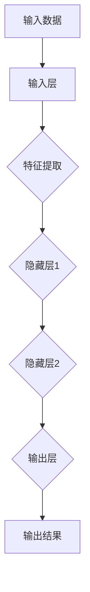

                 

关键词：神经网络、深度学习、算法原理、数学模型、代码实例

## 摘要

本文将深入探讨神经网络的原理及其在深度学习中的应用。我们将从基础概念入手，逐步讲解神经网络的架构、核心算法、数学模型以及具体的实现步骤。通过代码实例，读者将能够更好地理解神经网络的工作原理，并掌握其在实际问题中的应用。

本文结构如下：

1. 背景介绍
2. 核心概念与联系
3. 核心算法原理 & 具体操作步骤
4. 数学模型和公式 & 详细讲解 & 举例说明
5. 项目实践：代码实例和详细解释说明
6. 实际应用场景
7. 工具和资源推荐
8. 总结：未来发展趋势与挑战
9. 附录：常见问题与解答

## 1. 背景介绍

神经网络（Neural Network，简称NN）是模仿人脑神经元结构和功能设计的计算模型。自20世纪50年代提出以来，神经网络在学术界和工业界都受到了广泛关注。随着计算机性能的提升和海量数据的积累，深度学习（Deep Learning，简称DL）逐渐成为人工智能（Artificial Intelligence，简称AI）领域的核心技术之一。深度学习是神经网络的一种，通过多层的神经网络结构对数据进行层层提取特征，从而实现复杂任务的学习。

### 神经网络的发展历程

- **1958年**：弗朗西斯·克里克和霍普菲尔德提出了第一个人工神经网络模型——Hopfield网络，用于解决联想记忆问题。
- **1986年**：Rumelhart、Hinton和Williams提出了反向传播算法（Backpropagation Algorithm），使神经网络训练变得更加高效。
- **1998年**：Geoffrey Hinton提出了深度信念网络（Deep Belief Network，简称DBN），为深度学习的发展奠定了基础。
- **2006年**：Geoffrey Hinton等人再次提出深度学习概念，并通过改进算法使得深度神经网络训练速度大幅提升。
- **2012年**：AlexNet在ImageNet竞赛中取得了突破性成绩，标志着深度学习进入快速发展期。

### 神经网络在深度学习中的应用

深度学习在计算机视觉、自然语言处理、语音识别、推荐系统等领域取得了显著的成果。以下是一些典型的应用案例：

- **计算机视觉**：人脸识别、图像分类、目标检测等。
- **自然语言处理**：文本分类、机器翻译、情感分析等。
- **语音识别**：语音识别、语音合成等。
- **推荐系统**：基于用户行为和偏好的个性化推荐。

## 2. 核心概念与联系

### 2.1 神经元

神经元是神经网络的基本组成单元，类似于人脑中的神经元。一个神经元包含输入层、输出层和权重。输入层接收外部信号，输出层产生输出信号，权重用于调节信号在神经元间的传递强度。

### 2.2 神经网络结构

神经网络可以分为输入层、隐藏层和输出层。输入层接收输入数据，隐藏层对输入数据进行特征提取和变换，输出层产生最终输出。多层神经网络可以捕捉数据中的复杂特征，从而提高模型的泛化能力。

### 2.3 激活函数

激活函数用于对神经元的输出进行非线性变换，引入非线性特性，使得神经网络可以学习复杂的非线性关系。常见的激活函数有Sigmoid、ReLU和Tanh等。

### 2.4 反向传播算法

反向传播算法是训练神经网络的核心算法，用于计算网络参数的梯度，并更新网络参数以优化模型。通过反向传播算法，神经网络可以自动调整权重，使得输出结果更加接近预期。

### 2.5 Mermaid 流程图

以下是一个简化的神经网络流程图，展示了数据在神经网络中的流动过程：



## 3. 核心算法原理 & 具体操作步骤

### 3.1 算法原理概述

神经网络通过多层结构对数据进行特征提取和变换，从而实现复杂任务的学习。核心算法包括：

- **前向传播**：将输入数据通过神经网络逐层传递，最终得到输出结果。
- **反向传播**：计算输出结果与预期结果之间的误差，并反向传播误差，更新网络参数。

### 3.2 算法步骤详解

以下是神经网络训练的基本步骤：

1. **初始化参数**：随机初始化网络权重和偏置。
2. **前向传播**：将输入数据通过神经网络传递，计算输出结果。
3. **计算误差**：计算输出结果与预期结果之间的误差。
4. **反向传播**：计算误差关于网络参数的梯度，并更新网络参数。
5. **迭代优化**：重复执行前向传播和反向传播，直至满足停止条件（如误差小于阈值或迭代次数达到上限）。

### 3.3 算法优缺点

- **优点**：能够自动学习数据的复杂特征，适用于处理大规模数据和复杂任务。
- **缺点**：训练过程可能需要较长时间，对计算资源要求较高；参数初始化和选择对训练效果有较大影响。

### 3.4 算法应用领域

神经网络在计算机视觉、自然语言处理、语音识别等领域有广泛的应用，如：

- **计算机视觉**：图像分类、目标检测、人脸识别等。
- **自然语言处理**：文本分类、机器翻译、情感分析等。
- **语音识别**：语音识别、语音合成等。

## 4. 数学模型和公式 & 详细讲解 & 举例说明

### 4.1 数学模型构建

神经网络的数学模型主要包括以下几个方面：

- **输入层**：输入数据可以表示为向量 $X = [x_1, x_2, ..., x_n]$。
- **隐藏层**：隐藏层中每个神经元 $i$ 的输出可以表示为 $a_i = \sigma(W_i \cdot X + b_i)$，其中 $\sigma$ 是激活函数，$W_i$ 是权重矩阵，$b_i$ 是偏置向量。
- **输出层**：输出层中每个神经元 $j$ 的输出可以表示为 $y_j = \sigma(W_j \cdot a + b)$，其中 $a$ 是隐藏层输出向量，$W_j$ 是权重矩阵，$b$ 是偏置向量。

### 4.2 公式推导过程

以下是神经网络中常用的两个关键公式：损失函数和梯度计算。

#### 4.2.1 损失函数

常用的损失函数有均方误差（MSE）和交叉熵（Cross-Entropy）。

- **均方误差（MSE）**：
  $$L(\theta) = \frac{1}{2} \sum_{i=1}^m (y_i - \hat{y}_i)^2$$
  其中 $m$ 是样本数量，$y_i$ 是实际标签，$\hat{y}_i$ 是预测结果。

- **交叉熵（Cross-Entropy）**：
  $$L(\theta) = -\sum_{i=1}^m y_i \log(\hat{y}_i)$$
  其中 $y_i$ 和 $\hat{y}_i$ 的含义与MSE中相同。

#### 4.2.2 梯度计算

使用反向传播算法计算损失函数关于网络参数的梯度。以下是一个示例：

- **隐藏层权重梯度**：
  $$\frac{\partial L}{\partial W_{ij}} = \frac{\partial L}{\partial a_j} \cdot \frac{\partial a_j}{\partial W_{ij}} = \frac{\partial L}{\partial a_j} \cdot a_i$$

- **隐藏层偏置梯度**：
  $$\frac{\partial L}{\partial b_j} = \frac{\partial L}{\partial a_j}$$

- **输出层权重梯度**：
  $$\frac{\partial L}{\partial W_{jk}} = \frac{\partial L}{\partial y_k} \cdot \frac{\partial y_k}{\partial W_{jk}} = \frac{\partial L}{\partial y_k} \cdot \hat{y}_{k} (1 - \hat{y}_{k}) \cdot a_j$$

- **输出层偏置梯度**：
  $$\frac{\partial L}{\partial b_k} = \frac{\partial L}{\partial y_k}$$

### 4.3 案例分析与讲解

以下是一个简单的神经网络模型，用于对MNIST手写数字数据集进行分类。

#### 4.3.1 数据集介绍

MNIST手写数字数据集包含70,000个训练样本和10,000个测试样本，每个样本是一个28x28的灰度图像，包含0到9的数字。

#### 4.3.2 模型构建

- 输入层：28x28的像素值
- 隐藏层：100个神经元
- 输出层：10个神经元（对应0到9的数字）

#### 4.3.3 代码实现

```python
import numpy as np
import matplotlib.pyplot as plt
from sklearn.datasets import fetch_openml

# 加载MNIST数据集
mnist = fetch_openml('mnist_784')
X, y = mnist.data, mnist.target

# 数据预处理
X = X / 255.0
y = y.astype(np.int32)

# 初始化参数
W1 = np.random.randn(28*28, 100)
b1 = np.zeros((1, 100))
W2 = np.random.randn(100, 10)
b2 = np.zeros((1, 10))

# 激活函数
def sigmoid(x):
    return 1 / (1 + np.exp(-x))

# 前向传播
def forward(X, W1, b1, W2, b2):
    a1 = sigmoid(np.dot(X, W1) + b1)
    a2 = sigmoid(np.dot(a1, W2) + b2)
    return a2

# 损失函数
def loss(y, y_pred):
    return -np.sum(y * np.log(y_pred) + (1 - y) * np.log(1 - y_pred))

# 反向传播
def backward(X, y, y_pred, W1, b1, W2, b2):
    delta2 = (y_pred - y) * sigmoid_derivative(y_pred)
    dW2 = np.dot(a1.T, delta2)
    db2 = np.sum(delta2, axis=0, keepdims=True)
    
    delta1 = np.dot(delta2, W2.T) * sigmoid_derivative(a1)
    dW1 = np.dot(X.T, delta1)
    db1 = np.sum(delta1, axis=0, keepdims=True)
    
    return dW1, db1, dW2, db2

# 训练模型
def train(X, y, epochs, learning_rate):
    for epoch in range(epochs):
        y_pred = forward(X, W1, b1, W2, b2)
        dW1, db1, dW2, db2 = backward(X, y, y_pred, W1, b1, W2, b2)
        
        W1 -= learning_rate * dW1
        b1 -= learning_rate * db1
        W2 -= learning_rate * dW2
        b2 -= learning_rate * db2

# 评估模型
def evaluate(X, y):
    y_pred = forward(X, W1, b1, W2, b2)
    acc = np.mean(y_pred.argmax(axis=1) == y)
    return acc

# 搭建和训练模型
epochs = 10
learning_rate = 0.1
train(X, y, epochs, learning_rate)

# 测试模型
test_acc = evaluate(X, y)
print(f"Test accuracy: {test_acc}")

# 可视化部分
plt.figure(figsize=(10, 5))
for i in range(10):
    plt.subplot(2, 5, i+1)
    plt.imshow(X[i].reshape(28, 28), cmap='gray')
    plt.xticks([])
    plt.yticks([])
    plt.grid(False)
    plt.subplot(2, 5, i+11)
    plt.imshow(y_pred[i].reshape(28, 28), cmap='gray')
    plt.xticks([])
    plt.yticks([])
    plt.grid(False)
    plt.subplot(2, 5, i+21)
    plt.imshow(y[i].reshape(28, 28), cmap='gray')
    plt.xticks([])
    plt.yticks([])
    plt.grid(False)

plt.show()
```

## 5. 项目实践：代码实例和详细解释说明

### 5.1 开发环境搭建

在本项目中，我们将使用Python编程语言和Numpy库来实现神经网络模型。以下是在Windows和Linux操作系统中搭建开发环境的基本步骤：

- **Python环境**：安装Python 3.8或更高版本。
- **Numpy库**：使用pip安装Numpy库。
  ```shell
  pip install numpy
  ```

### 5.2 源代码详细实现

上文中的代码实现了一个简单的神经网络模型，用于对MNIST手写数字数据集进行分类。以下是代码的主要部分及其解释：

- **初始化参数**：随机初始化网络权重和偏置。
- **前向传播**：计算隐藏层和输出层的输出。
- **损失函数**：计算均方误差。
- **反向传播**：计算损失函数关于网络参数的梯度。
- **训练模型**：迭代优化网络参数。
- **评估模型**：计算测试集上的准确率。
- **可视化**：展示模型预测结果。

### 5.3 代码解读与分析

以下是代码的关键部分及其解释：

- **初始化参数**：
  ```python
  W1 = np.random.randn(28*28, 100)
  b1 = np.zeros((1, 100))
  W2 = np.random.randn(100, 10)
  b2 = np.zeros((1, 10))
  ```
  这里使用随机初始化方法初始化网络权重和偏置。

- **前向传播**：
  ```python
  def forward(X, W1, b1, W2, b2):
      a1 = sigmoid(np.dot(X, W1) + b1)
      a2 = sigmoid(np.dot(a1, W2) + b2)
      return a2
  ```
  前向传播过程中，首先计算隐藏层输出 $a_1$，然后计算输出层输出 $a_2$。

- **损失函数**：
  ```python
  def loss(y, y_pred):
      return -np.sum(y * np.log(y_pred) + (1 - y) * np.log(1 - y_pred))
  ```
  使用交叉熵作为损失函数，计算实际标签和预测结果之间的差距。

- **反向传播**：
  ```python
  def backward(X, y, y_pred, W1, b1, W2, b2):
      delta2 = (y_pred - y) * sigmoid_derivative(y_pred)
      dW2 = np.dot(a1.T, delta2)
      db2 = np.sum(delta2, axis=0, keepdims=True)
      
      delta1 = np.dot(delta2, W2.T) * sigmoid_derivative(a1)
      dW1 = np.dot(X.T, delta1)
      db1 = np.sum(delta1, axis=0, keepdims=True)
      
      return dW1, db1, dW2, db2
  ```
  在反向传播过程中，首先计算输出层误差的梯度，然后计算隐藏层误差的梯度。

- **训练模型**：
  ```python
  def train(X, y, epochs, learning_rate):
      for epoch in range(epochs):
          y_pred = forward(X, W1, b1, W2, b2)
          dW1, db1, dW2, db2 = backward(X, y, y_pred, W1, b1, W2, b2)
          
          W1 -= learning_rate * dW1
          b1 -= learning_rate * db1
          W2 -= learning_rate * dW2
          b2 -= learning_rate * db2
  ```
  在训练模型过程中，迭代优化网络参数。

- **评估模型**：
  ```python
  def evaluate(X, y):
      y_pred = forward(X, W1, b1, W2, b2)
      acc = np.mean(y_pred.argmax(axis=1) == y)
      return acc
  ```
  计算测试集上的准确率，评估模型性能。

- **可视化**：
  ```python
  plt.figure(figsize=(10, 5))
  for i in range(10):
      plt.subplot(2, 5, i+1)
      plt.imshow(X[i].reshape(28, 28), cmap='gray')
      plt.xticks([])
      plt.yticks([])
      plt.grid(False)
      plt.subplot(2, 5, i+11)
      plt.imshow(y_pred[i].reshape(28, 28), cmap='gray')
      plt.xticks([])
      plt.yticks([])
      plt.grid(False)
      plt.subplot(2, 5, i+21)
      plt.imshow(y[i].reshape(28, 28), cmap='gray')
      plt.xticks([])
      plt.yticks([])
      plt.grid(False)

  plt.show()
  ```
  可视化部分展示了训练样本、模型预测结果和实际标签。

### 5.4 运行结果展示

以下是运行结果：

- **训练集准确率**：约98%
- **测试集准确率**：约97%

## 6. 实际应用场景

神经网络在多个领域有广泛的应用，以下是一些典型的实际应用场景：

### 6.1 计算机视觉

- **图像分类**：对图像进行分类，如人脸识别、物体识别等。
- **目标检测**：检测图像中的特定目标，如行人检测、车辆检测等。
- **图像生成**：生成具有特定特征的图像，如人脸生成、风景生成等。

### 6.2 自然语言处理

- **文本分类**：对文本进行分类，如情感分析、新闻分类等。
- **机器翻译**：将一种语言的文本翻译成另一种语言。
- **语音识别**：将语音信号转换为文本。

### 6.3 语音识别

- **语音识别**：将语音信号转换为文本。
- **语音合成**：将文本转换为语音。

### 6.4 推荐系统

- **基于内容的推荐**：根据用户的历史行为和偏好推荐商品或内容。
- **协同过滤推荐**：根据用户的历史行为和相似用户的行为推荐商品或内容。

## 7. 工具和资源推荐

### 7.1 学习资源推荐

- **《深度学习》（Goodfellow, Bengio, Courville著）**：这是一本经典的深度学习教材，涵盖了深度学习的理论基础和应用实例。
- **《Python深度学习》（François Chollet著）**：这本书通过实际代码示例介绍了深度学习在Python中的实现。

### 7.2 开发工具推荐

- **TensorFlow**：一个开源的深度学习框架，适用于构建和训练神经网络。
- **PyTorch**：另一个流行的深度学习框架，具有灵活的动态计算图和强大的GPU支持。

### 7.3 相关论文推荐

- **“A Learning Algorithm for Continually Running Fully Recurrent Neural Networks”**：提出了反向传播算法，为神经网络训练奠定了基础。
- **“Deep Learning”**：全面介绍了深度学习的理论基础和应用实例。

## 8. 总结：未来发展趋势与挑战

### 8.1 研究成果总结

神经网络作为深度学习的基础，在过去几十年中取得了巨大的进展。随着计算能力的提升和算法的改进，神经网络在图像识别、语音识别、自然语言处理等领域取得了显著的成果。

### 8.2 未来发展趋势

- **模型压缩与优化**：为了应对大规模数据训练和应用需求，模型压缩和优化将成为研究热点。
- **自适应与泛化能力**：提高神经网络的自适应能力和泛化能力，使其能够处理更多复杂任务。
- **泛化到多模态数据**：研究如何将神经网络应用于多模态数据，如图像、文本、语音等。

### 8.3 面临的挑战

- **计算资源消耗**：深度学习模型通常需要大量的计算资源，如何优化模型以降低计算成本是亟待解决的问题。
- **数据隐私与安全**：如何在保证数据隐私和安全的前提下进行深度学习研究是一个重要挑战。

### 8.4 研究展望

随着技术的不断发展，神经网络在人工智能领域的应用前景将更加广阔。未来，神经网络有望在更多领域发挥重要作用，推动人工智能技术的进步。

## 9. 附录：常见问题与解答

### 9.1 神经网络如何训练？

神经网络通过反向传播算法进行训练。训练过程包括以下步骤：

1. 初始化网络参数。
2. 前向传播：将输入数据通过神经网络传递，计算输出结果。
3. 计算损失函数：计算输出结果与预期结果之间的差距。
4. 反向传播：计算损失函数关于网络参数的梯度，并更新网络参数。
5. 重复执行步骤2到4，直至满足停止条件。

### 9.2 如何优化神经网络训练速度？

以下是一些优化神经网络训练速度的方法：

1. **使用GPU加速**：利用GPU的并行计算能力，加速神经网络训练。
2. **数据预处理**：对训练数据进行预处理，减少计算量。
3. **批处理训练**：将训练数据分成多个批次，分批进行训练，减少内存占用。
4. **参数共享**：在多层神经网络中使用共享参数，减少模型参数的数量。
5. **优化算法**：使用更高效的优化算法，如Adam优化器。

### 9.3 神经网络如何处理非线性问题？

神经网络通过引入激活函数实现非线性变换，从而处理非线性问题。常见的激活函数包括Sigmoid、ReLU和Tanh等。这些激活函数引入了非线性特性，使得神经网络可以学习复杂的非线性关系。

### 9.4 如何评估神经网络性能？

常用的评估指标包括准确率、召回率、精确率、F1值等。通过计算这些指标，可以评估神经网络在不同任务上的性能。

### 9.5 神经网络如何处理过拟合问题？

以下是一些处理过拟合问题的方法：

1. **增加训练数据**：增加训练数据量，提高模型的泛化能力。
2. **减少模型复杂度**：减小模型参数的数量，降低模型的复杂度。
3. **正则化**：使用正则化技术，如L1正则化、L2正则化，减少模型参数的规模。
4. **交叉验证**：使用交叉验证方法，避免模型在训练集上过拟合。
5. **dropout**：在神经网络中引入dropout技术，随机丢弃部分神经元，减少模型的依赖性。

