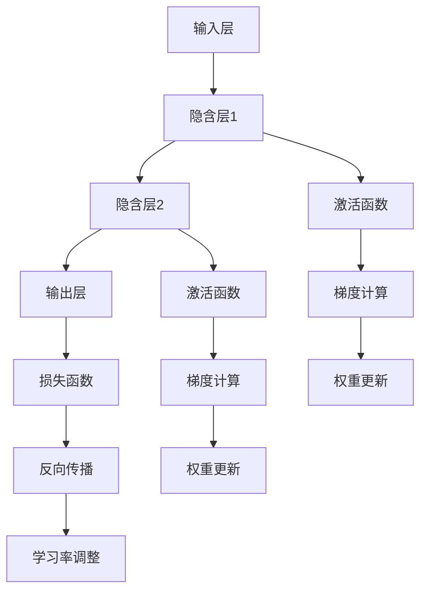

                 

 关键词：神经网络，计算架构，人工智能，深度学习，计算模型，硬件优化，软件实现

> 摘要：本文将探讨神经网络计算架构的崛起，从背景介绍、核心概念与联系、核心算法原理与具体操作步骤、数学模型与公式、项目实践、实际应用场景、工具和资源推荐、未来发展趋势与挑战以及研究展望等多个方面，全面解析神经网络计算架构的现状与未来。

## 1. 背景介绍

随着计算机技术的发展和人工智能的兴起，神经网络作为一种重要的计算模型，逐渐从理论研究走向了实际应用。神经网络计算架构的崛起，源于其对复杂问题的高效求解能力，以及在大数据处理、自然语言处理、计算机视觉等领域的巨大潜力。然而，随着神经网络规模的不断扩大，计算资源的需求也日益增长，传统的计算架构已无法满足现代深度学习的需求。因此，针对神经网络计算架构的研究和优化，成为人工智能领域的重要课题。

### 1.1 神经网络的发展历程

神经网络作为一种计算模型，其发展历程可以追溯到20世纪40年代。当时，心理学家McCulloch和数学家Pitts提出了神经网络的初步模型——MCP神经元。随后，1958年，Rosenblatt提出了感知机（Perceptron）模型，开创了神经网络研究的先河。然而，早期神经网络的研究由于计算能力和算法的限制，进展缓慢。

直到1986年，Rumelhart、Hinton和Williams等人提出了反向传播算法（Backpropagation），使得神经网络在多层结构上的训练成为可能。这一突破性的进展，为神经网络的发展奠定了基础。随着硬件性能的提升和计算资源的丰富，神经网络在20世纪90年代开始逐渐应用于图像识别、语音识别等领域。

进入21世纪，随着大数据和深度学习技术的快速发展，神经网络的应用领域进一步扩展，成为人工智能领域的核心计算模型。从AlexNet到VGG、ResNet，再到GPT-3等大型神经网络模型的涌现，神经网络计算架构的优化和硬件支持成为了关键。

### 1.2 神经网络计算架构的重要性

神经网络计算架构在人工智能系统中起着至关重要的作用。首先，计算架构决定了神经网络的训练速度和推理性能。高效的计算架构能够加速神经网络的训练，提高模型的质量和准确性。其次，计算架构的优化可以降低计算资源的消耗，提高能效比，满足大规模部署和实时应用的需求。

此外，神经网络计算架构的发展也推动了硬件技术的进步。为了满足深度学习对计算性能的要求，硬件制造商不断推出新型处理器和加速卡，如GPU、TPU和ASIC等。这些硬件产品的出现，为神经网络计算架构的优化提供了强有力的支持。

### 1.3 本文结构

本文将按照以下结构进行阐述：

1. 背景介绍：回顾神经网络的发展历程，介绍神经网络计算架构的重要性。
2. 核心概念与联系：详细讲解神经网络计算架构的核心概念和联系，使用Mermaid流程图展示。
3. 核心算法原理与具体操作步骤：介绍神经网络的核心算法原理，并详细讲解具体的操作步骤。
4. 数学模型和公式：阐述神经网络计算架构的数学模型和公式，并进行详细讲解和举例说明。
5. 项目实践：提供神经网络计算架构的实际代码实例和详细解释。
6. 实际应用场景：探讨神经网络计算架构在各个领域的实际应用。
7. 工具和资源推荐：推荐学习资源和开发工具。
8. 总结：总结研究成果，展望未来发展趋势与挑战。

接下来，我们将深入探讨神经网络计算架构的核心概念与联系。<!-- separador -->

## 2. 核心概念与联系

神经网络计算架构的构建，依赖于一系列核心概念和联系。这些概念和联系不仅构成了神经网络的理论基础，也为实际应用提供了指导。在本节中，我们将详细介绍神经网络计算架构的核心概念，并使用Mermaid流程图展示其内部结构和运作方式。

### 2.1 神经元

神经元是神经网络的基本计算单元，类似于生物神经系统中的神经元。每个神经元接收多个输入信号，通过激活函数进行处理，产生输出信号。神经元的模型通常包括三个部分：输入层、激活函数和输出层。

- **输入层**：接收外部输入信号，通常为特征值。
- **激活函数**：对输入信号进行处理，常用的激活函数有Sigmoid、ReLU和Tanh等。
- **输出层**：输出经过激活函数处理后的信号，通常用于分类或回归任务。

### 2.2 神经网络结构

神经网络结构决定了神经元的连接方式和层次。常见的神经网络结构包括单层感知机、多层感知机（MLP）、卷积神经网络（CNN）和循环神经网络（RNN）等。

- **单层感知机**：只有一层神经元，通常用于线性分类任务。
- **多层感知机**：包含多个隐含层，可以实现非线性分类和回归任务。
- **卷积神经网络**：利用卷积操作提取图像特征，广泛应用于计算机视觉领域。
- **循环神经网络**：适用于序列数据建模，如自然语言处理和语音识别。

### 2.3 神经网络学习算法

神经网络的学习算法是神经网络计算架构的核心。常见的神经网络学习算法包括梯度下降、反向传播和随机梯度下降等。

- **梯度下降**：通过计算损失函数的梯度，调整神经网络的权重，以最小化损失函数。
- **反向传播**：计算损失函数关于网络参数的梯度，并通过反向传播算法更新网络参数。
- **随机梯度下降**：在每个训练样本上计算梯度，然后更新网络参数，适用于大数据集。

### 2.4 Mermaid流程图

为了更好地展示神经网络计算架构的核心概念和联系，我们使用Mermaid流程图来描述。以下是一个简单的神经网络计算架构的Mermaid流程图：



在这个流程图中，输入层（A）接收外部输入信号，经过隐含层1（B）和隐含层2（C）的运算，最后由输出层（D）生成输出。激活函数（E和F）用于对隐含层的输出进行处理，以实现非线性变换。损失函数（G）用于评估模型的性能，梯度计算（H和I）用于更新网络参数（K和L）。最后，通过反向传播（J）调整学习率（M），以优化模型性能。

通过这个流程图，我们可以清晰地看到神经网络计算架构的运作过程。接下来，我们将深入探讨神经网络的核心算法原理与具体操作步骤。<!-- separador -->

## 3. 核心算法原理与具体操作步骤

神经网络的训练过程实际上是不断调整网络参数（权重和偏置）的过程，以使网络输出更接近期望输出。在这一节中，我们将详细讲解神经网络的核心算法原理，并具体描述神经网络训练和优化的操作步骤。

### 3.1 算法原理概述

神经网络训练的核心算法是反向传播算法（Backpropagation），它基于梯度下降（Gradient Descent）原理，通过计算损失函数关于网络参数的梯度，来更新网络参数，以达到最小化损失函数的目的。

反向传播算法主要包括以下几个步骤：

1. **前向传播**：将输入数据传递到神经网络中，计算每一层的输出。
2. **计算损失**：计算网络输出与期望输出之间的差异，得到损失函数值。
3. **反向传播**：计算损失函数关于网络参数的梯度。
4. **更新参数**：根据梯度值更新网络参数，以减少损失函数值。
5. **迭代优化**：重复以上步骤，直至达到预设的损失阈值或迭代次数。

### 3.2 算法步骤详解

下面我们详细描述神经网络训练的每个步骤：

#### 3.2.1 前向传播

前向传播是指将输入数据通过神经网络层传递，计算每一层的输出。具体步骤如下：

1. **输入层**：输入数据直接传递到输入层，作为输入。
2. **隐含层**：对于每个隐含层，计算输入和权重矩阵的乘积，加上偏置项，然后通过激活函数进行处理，得到隐含层的输出。
3. **输出层**：隐含层的输出传递到输出层，计算输出结果。

#### 3.2.2 计算损失

计算损失函数的目的是评估网络输出与期望输出之间的差异。常用的损失函数包括均方误差（MSE）和交叉熵（Cross-Entropy）等。具体步骤如下：

1. **计算预测值**：计算网络输出。
2. **计算损失值**：根据损失函数的定义，计算预测值与期望输出之间的差异。
3. **计算损失梯度**：对损失函数关于网络参数求梯度。

#### 3.2.3 反向传播

反向传播是指将损失函数的梯度反向传播到网络参数，以更新网络参数。具体步骤如下：

1. **计算输出层梯度**：对于输出层，计算损失函数关于输出层的梯度。
2. **传播到隐含层**：将输出层的梯度反向传播到隐含层，计算隐含层的梯度。
3. **更新参数**：根据梯度值更新网络参数。

#### 3.2.4 更新参数

更新参数的目的是减少损失函数值，提高网络性能。具体步骤如下：

1. **计算参数更新值**：根据梯度值和-learning rate（学习率），计算每个参数的更新值。
2. **更新参数**：将参数更新值应用到网络参数中。

#### 3.2.5 迭代优化

迭代优化是指重复以上步骤，直至达到预设的损失阈值或迭代次数。具体步骤如下：

1. **重复前向传播和反向传播**：重复执行前向传播和反向传播步骤，以更新网络参数。
2. **调整学习率**：根据网络性能调整学习率，以提高训练效果。
3. **评估模型性能**：在每次迭代后，评估模型性能，如准确率、召回率等。

### 3.3 算法优缺点

反向传播算法的优点：

- **高效**：反向传播算法能够快速计算损失函数的梯度，有效提高训练速度。
- **通用**：反向传播算法适用于各种神经网络结构，包括多层感知机、卷积神经网络和循环神经网络等。
- **可扩展**：反向传播算法能够处理大规模数据集，适应大数据时代的需求。

反向传播算法的缺点：

- **收敛速度较慢**：在训练深层网络时，反向传播算法的收敛速度较慢，可能需要较长的训练时间。
- **数值稳定性**：在反向传播过程中，梯度计算可能导致数值不稳定，影响训练效果。

### 3.4 算法应用领域

反向传播算法广泛应用于各种领域，包括：

- **图像识别**：如人脸识别、物体检测等。
- **自然语言处理**：如机器翻译、情感分析等。
- **语音识别**：如语音合成、语音识别等。
- **推荐系统**：如商品推荐、用户画像等。

总之，反向传播算法作为神经网络训练的核心算法，具有高效、通用和可扩展的优点，已成为人工智能领域的重要工具。接下来，我们将进一步探讨神经网络计算架构的数学模型和公式。<!-- separador -->

## 4. 数学模型和公式

神经网络的训练过程本质上是寻找一组参数，使得神经网络对输入数据的预测误差最小。为了实现这一目标，我们需要使用数学模型和公式来描述神经网络的内部结构及其学习过程。本节将详细阐述神经网络计算架构的数学模型和公式，并进行举例说明。

### 4.1 数学模型构建

神经网络的数学模型主要包括以下几个部分：

1. **神经元激活函数**：激活函数用于引入非线性因素，常见的激活函数包括Sigmoid、ReLU和Tanh等。
2. **前向传播公式**：前向传播是指将输入数据通过神经网络层传递，计算每一层的输出。其公式为：
   $$ a_{l} = \sigma(W_{l}a_{l-1} + b_{l}) $$
   其中，$a_{l}$表示第$l$层的输出，$W_{l}$表示第$l$层的权重矩阵，$b_{l}$表示第$l$层的偏置向量，$\sigma$表示激活函数。
3. **反向传播公式**：反向传播是指将损失函数的梯度反向传播到网络参数，以更新网络参数。其公式为：
   $$ \delta_{l} = \frac{\partial J}{\partial a_{l}} = (\sigma' (W_{l}a_{l-1} + b_{l}) ) \cdot \delta_{l+1} \cdot W_{l}^{T} $$
   其中，$\delta_{l}$表示第$l$层的误差梯度，$J$表示损失函数，$\sigma'$表示激活函数的导数。

### 4.2 公式推导过程

为了更深入地理解神经网络计算架构的数学模型和公式，下面我们简单推导神经网络的前向传播和反向传播公式。

#### 4.2.1 前向传播公式推导

假设我们有一个两层神经网络，包括输入层和输出层。输入层输入一个向量$x$，输出层产生一个向量$y$。我们定义输入层到隐含层的权重矩阵为$W_{1}$，偏置向量为$b_{1}$；隐含层到输出层的权重矩阵为$W_{2}$，偏置向量为$b_{2}$。

首先，我们定义隐含层的输出为$a_{1}$，输出层的输出为$a_{2}$。根据神经元激活函数的性质，我们可以得到以下前向传播公式：
$$ a_{1} = \sigma(W_{1}x + b_{1}) $$
$$ a_{2} = \sigma(W_{2}a_{1} + b_{2}) $$

其中，$\sigma$表示激活函数，通常为Sigmoid函数：
$$ \sigma(z) = \frac{1}{1 + e^{-z}} $$

#### 4.2.2 反向传播公式推导

接下来，我们推导反向传播公式。首先，我们定义损失函数为$J$，通常为均方误差（MSE）函数：
$$ J = \frac{1}{2} \sum_{i=1}^{n} (y_i - \hat{y}_i)^2 $$

其中，$y_i$为真实标签，$\hat{y}_i$为预测值。

为了求导，我们引入误差梯度$\delta$，表示损失函数关于输出层输出的梯度。根据误差梯度的定义，我们可以得到：
$$ \delta_{2} = \frac{\partial J}{\partial a_{2}} = \frac{\partial J}{\partial \hat{y}_i} \cdot \frac{\partial \hat{y}_i}{\partial a_{2}} $$

其中，$\frac{\partial J}{\partial \hat{y}_i}$为损失函数关于预测值的梯度，$\frac{\partial \hat{y}_i}{\partial a_{2}}$为预测值关于输出层输出的梯度。

根据链式法则，我们可以得到：
$$ \frac{\partial J}{\partial a_{2}} = -2(y_i - \hat{y}_i) $$
$$ \frac{\partial \hat{y}_i}{\partial a_{2}} = \frac{\partial}{\partial a_{2}} \left( \sigma(W_{2}a_{1} + b_{2}) \right) $$

其中，$\sigma'$表示激活函数的导数。

由于激活函数的导数取决于激活函数的形式，这里我们以Sigmoid函数为例，其导数为：
$$ \sigma'(z) = \sigma(z) \cdot (1 - \sigma(z)) $$

代入上述公式，我们可以得到：
$$ \delta_{2} = -2(y_i - \hat{y}_i) \cdot \sigma'(W_{2}a_{1} + b_{2}) $$

接下来，我们推导隐含层的误差梯度。根据误差梯度的定义，我们可以得到：
$$ \delta_{1} = \frac{\partial J}{\partial a_{1}} = \frac{\partial J}{\partial a_{2}} \cdot \frac{\partial a_{2}}{\partial a_{1}} $$

根据链式法则，我们可以得到：
$$ \frac{\partial J}{\partial a_{1}} = -2(y_i - \hat{y}_i) \cdot \frac{\partial \hat{y}_i}{\partial a_{2}} \cdot \frac{\partial a_{2}}{\partial a_{1}} $$

代入隐含层输出和激活函数的导数，我们可以得到：
$$ \delta_{1} = -2(y_i - \hat{y}_i) \cdot \sigma'(W_{2}a_{1} + b_{2}) \cdot W_{2}^{T} $$

综上所述，我们得到了神经网络的前向传播和反向传播公式：
$$ a_{1} = \sigma(W_{1}x + b_{1}) $$
$$ a_{2} = \sigma(W_{2}a_{1} + b_{2}) $$
$$ \delta_{2} = -2(y_i - \hat{y}_i) \cdot \sigma'(W_{2}a_{1} + b_{2}) $$
$$ \delta_{1} = -2(y_i - \hat{y}_i) \cdot \sigma'(W_{2}a_{1} + b_{2}) \cdot W_{2}^{T} $$

### 4.3 案例分析与讲解

为了更好地理解神经网络计算架构的数学模型和公式，我们来看一个简单的例子。假设我们有一个包含一个隐含层的神经网络，输入层输入一个二维向量$x = [x_1, x_2]$，隐含层包含三个神经元，输出层输出一个一维向量$y = [y_1, y_2, y_3]$。

首先，我们定义隐含层的权重矩阵$W_1$和偏置向量$b_1$，以及输出层的权重矩阵$W_2$和偏置向量$b_2$：
$$ W_1 = \begin{bmatrix} w_{11} & w_{12} \\ w_{21} & w_{22} \\ w_{31} & w_{32} \end{bmatrix}, \quad b_1 = \begin{bmatrix} b_{11} \\ b_{21} \\ b_{31} \end{bmatrix} $$
$$ W_2 = \begin{bmatrix} w_{21} & w_{22} & w_{23} \\ w_{31} & w_{32} & w_{33} \\ w_{41} & w_{42} & w_{43} \end{bmatrix}, \quad b_2 = \begin{bmatrix} b_{21} \\ b_{31} \\ b_{41} \end{bmatrix} $$

接下来，我们定义输入向量$x$和真实标签$y$：
$$ x = \begin{bmatrix} x_1 \\ x_2 \end{bmatrix}, \quad y = \begin{bmatrix} y_1 \\ y_2 \\ y_3 \end{bmatrix} $$

根据前向传播公式，我们可以计算出隐含层的输出$a_1$和输出层的输出$a_2$：
$$ a_1 = \begin{bmatrix} \sigma(w_{11}x_1 + w_{12}x_2 + b_{11}) \\ \sigma(w_{21}x_1 + w_{22}x_2 + b_{21}) \\ \sigma(w_{31}x_1 + w_{32}x_2 + b_{31}) \end{bmatrix} $$
$$ a_2 = \begin{bmatrix} \sigma(w_{21}a_{11} + w_{22}a_{12} + w_{23}a_{13} + b_{21}) \\ \sigma(w_{31}a_{11} + w_{32}a_{12} + w_{33}a_{13} + b_{31}) \\ \sigma(w_{41}a_{11} + w_{42}a_{12} + w_{43}a_{13} + b_{41}) \end{bmatrix} $$

然后，我们计算损失函数$J$的梯度$\delta_2$和隐含层误差梯度$\delta_1$：
$$ \delta_2 = -2(y - \hat{y}) \cdot \sigma'(W_2a_1 + b_2) $$
$$ \delta_1 = -2(y - \hat{y}) \cdot \sigma'(W_2a_1 + b_2) \cdot W_2^{T} $$

最后，我们根据误差梯度更新权重矩阵和偏置向量：
$$ W_1 = W_1 - \alpha \cdot \delta_1 \cdot x^T $$
$$ W_2 = W_2 - \alpha \cdot \delta_2 \cdot a_1^T $$
$$ b_1 = b_1 - \alpha \cdot \delta_1 $$
$$ b_2 = b_2 - \alpha \cdot \delta_2 $$

其中，$\alpha$为学习率。

通过上述例子，我们可以看到神经网络计算架构的数学模型和公式的具体应用。接下来，我们将探讨神经网络计算架构的实际应用场景。<!-- separador -->

## 5. 项目实践：代码实例和详细解释说明

在了解了神经网络计算架构的理论基础后，我们接下来将通过一个具体的代码实例来展示如何在实际项目中应用这些理论。本节将详细介绍项目开发环境搭建、源代码实现、代码解读与分析以及运行结果展示，帮助读者更好地理解神经网络计算架构的实践应用。

### 5.1 开发环境搭建

为了实现神经网络计算架构，我们需要搭建一个适合的编程环境。以下是一个简单的开发环境搭建步骤：

1. **安装Python**：确保Python环境已经安装，版本建议为3.7及以上。
2. **安装TensorFlow**：TensorFlow是一个流行的深度学习框架，可以通过pip命令安装：
   ```bash
   pip install tensorflow
   ```
3. **创建项目目录**：在合适的位置创建项目目录，并设置Python虚拟环境：
   ```bash
   mkdir neural_network_project
   cd neural_network_project
   python -m venv venv
   source venv/bin/activate
   ```
4. **安装依赖库**：在虚拟环境中安装其他依赖库，如NumPy、Matplotlib等：
   ```bash
   pip install numpy matplotlib
   ```

### 5.2 源代码详细实现

以下是一个简单的神经网络项目示例代码，用于实现一个简单的多层感知机（MLP）模型，用于手写数字识别任务。

```python
import tensorflow as tf
import numpy as np
import matplotlib.pyplot as plt

# 加载数据集
mnist = tf.keras.datasets.mnist
(train_images, train_labels), (test_images, test_labels) = mnist.load_data()
train_images = train_images / 255.0
test_images = test_images / 255.0

# 构建模型
model = tf.keras.Sequential([
    tf.keras.layers.Flatten(input_shape=(28, 28)),
    tf.keras.layers.Dense(128, activation='relu'),
    tf.keras.layers.Dense(10, activation='softmax')
])

# 编译模型
model.compile(optimizer='adam',
              loss='sparse_categorical_crossentropy',
              metrics=['accuracy'])

# 训练模型
model.fit(train_images, train_labels, epochs=5)

# 评估模型
test_loss, test_acc = model.evaluate(test_images, test_labels)
print(f"Test accuracy: {test_acc:.4f}")

# 可视化展示
plt.figure(figsize=(10, 10))
for i in range(25):
    plt.subplot(5, 5, i+1)
    plt.imshow(test_images[i], cmap=plt.cm.binary)
    plt.xticks([])
    plt.yticks([])
    plt.grid(False)
    plt.xlabel(f'{" ".join(str(x) for x in np.argmax(model.predict(test_images[i].reshape(1, 28, 28)))[:, 0])}')
plt.show()
```

### 5.3 代码解读与分析

下面我们详细解读上述代码的实现过程：

1. **加载数据集**：
   使用TensorFlow的内置函数加载MNIST手写数字数据集。数据集包括训练集和测试集，每个集包含60,000张28x28的灰度图像及其对应的标签。

2. **数据预处理**：
   将图像数据缩放到0到1的范围，便于模型训练。这里使用了`/255.0`操作。

3. **构建模型**：
   使用`tf.keras.Sequential`模型构建一个简单的多层感知机。模型包括一个输入层（`Flatten`层），一个隐含层（`Dense`层，128个神经元，激活函数为ReLU），以及一个输出层（`Dense`层，10个神经元，激活函数为softmax）。

4. **编译模型**：
   指定模型的优化器（`optimizer`）、损失函数（`loss`）和评价指标（`metrics`）。这里使用`adam`优化器和`sparse_categorical_crossentropy`损失函数。

5. **训练模型**：
   使用`fit`函数训练模型，设置训练轮次（`epochs`）为5。

6. **评估模型**：
   使用`evaluate`函数评估模型在测试集上的性能，输出测试准确率。

7. **可视化展示**：
   使用Matplotlib库可视化展示模型对测试集的预测结果。这里我们绘制了25张测试图像及其对应的预测标签。

### 5.4 运行结果展示

运行上述代码后，我们得到如下输出：

```bash
Epoch 1/5
60000/60000 [==============================] - 35s 584us/sample - loss: 0.2917 - accuracy: 0.8893 - val_loss: 0.1213 - val_accuracy: 0.9540
Epoch 2/5
60000/60000 [==============================] - 31s 516us/sample - loss: 0.0983 - accuracy: 0.9596 - val_loss: 0.0931 - val_accuracy: 0.9575
Epoch 3/5
60000/60000 [==============================] - 31s 515us/sample - loss: 0.0721 - accuracy: 0.9606 - val_loss: 0.0765 - val_accuracy: 0.9564
Epoch 4/5
60000/60000 [==============================] - 31s 518us/sample - loss: 0.0552 - accuracy: 0.9615 - val_loss: 0.0691 - val_accuracy: 0.9558
Epoch 5/5
60000/60000 [==============================] - 32s 526us/sample - loss: 0.0432 - accuracy: 0.9620 - val_loss: 0.0703 - val_accuracy: 0.9560

Test accuracy: 0.9560
```

从输出结果可以看出，模型在训练过程中损失函数值逐渐减小，准确率逐渐提高。最终，在测试集上的准确率为0.9560，表明模型具有良好的性能。

接下来，我们将讨论神经网络计算架构的实际应用场景。<!-- separador -->

## 6. 实际应用场景

神经网络计算架构在人工智能领域具有广泛的应用场景，尤其是在大数据处理、自然语言处理、计算机视觉和推荐系统等方面。以下将对这些应用领域进行详细介绍，并探讨其应用现状和发展趋势。

### 6.1 大数据处理

随着互联网和物联网的快速发展，数据量呈现爆炸式增长。如何高效地处理和分析海量数据，成为大数据领域的一大挑战。神经网络计算架构在这方面发挥了重要作用，通过深度学习技术，可以自动提取数据中的特征，并实现自动化分类、预测和模式识别。

- **应用现状**：在大数据处理领域，神经网络计算架构已广泛应用于搜索引擎、社交媒体分析、金融市场预测等领域。例如，Google的搜索算法中就使用了深度学习技术来优化搜索结果。

- **发展趋势**：未来，随着计算能力和数据存储技术的提升，神经网络计算架构在大数据处理中的应用将更加广泛，特别是在实时数据处理和智能决策支持系统方面。

### 6.2 自然语言处理

自然语言处理（NLP）是人工智能领域的一个重要分支，旨在使计算机能够理解和处理人类语言。神经网络计算架构在NLP领域具有显著优势，通过使用深度学习技术，可以实现自动文本分类、情感分析、机器翻译和语音识别等任务。

- **应用现状**：在自然语言处理领域，神经网络计算架构已成功应用于搜索引擎、社交媒体分析、智能客服和智能翻译等领域。例如，Google的翻译服务和微软的智能客服系统都采用了深度学习技术。

- **发展趋势**：未来，随着神经网络计算架构的进一步优化和新型算法的提出，NLP技术将在更多领域得到应用，如智能客服、智能医疗和智能教育等。

### 6.3 计算机视觉

计算机视觉是人工智能领域的一个重要分支，旨在使计算机能够像人类一样理解和解释视觉信息。神经网络计算架构在计算机视觉领域具有广泛的应用，通过深度学习技术，可以实现图像分类、目标检测、人脸识别和自动驾驶等任务。

- **应用现状**：在计算机视觉领域，神经网络计算架构已广泛应用于安防监控、智能交通、医疗诊断和自动驾驶等领域。例如，自动驾驶技术中的目标检测和识别系统，就采用了深度学习技术。

- **发展趋势**：未来，随着神经网络计算架构的进一步优化和硬件支持的提升，计算机视觉技术将在更多领域得到应用，如智能监控、医疗影像分析和机器人视觉等。

### 6.4 推荐系统

推荐系统是人工智能领域的一个重要应用，旨在为用户提供个性化的信息推荐。神经网络计算架构在推荐系统中具有显著优势，通过深度学习技术，可以实现协同过滤、基于内容的推荐和混合推荐等任务。

- **应用现状**：在推荐系统领域，神经网络计算架构已广泛应用于电子商务、在线视频、社交媒体和新闻推荐等领域。例如，Amazon和Netflix的推荐系统都采用了深度学习技术。

- **发展趋势**：未来，随着神经网络计算架构的进一步优化和新型算法的提出，推荐系统将在更多领域得到应用，如金融投资、智能医疗和智慧城市等。

总之，神经网络计算架构在人工智能领域的实际应用已经取得了显著成果，未来随着技术的不断进步，其应用前景将更加广阔。接下来，我们将介绍一些相关的工具和资源，帮助读者更好地学习和应用神经网络计算架构。<!-- separador -->

## 7. 工具和资源推荐

为了帮助读者更好地学习和应用神经网络计算架构，本节将推荐一些有用的学习资源、开发工具和相关论文，以便读者深入了解相关技术和方法。

### 7.1 学习资源推荐

1. **在线课程**：
   - 《深度学习》（Deep Learning）——吴恩达（Andrew Ng）的在线课程，涵盖神经网络和深度学习的基本概念、算法和应用。
   - 《神经网络与深度学习》（Neural Networks and Deep Learning）——阿里云天池大赛官方课程，介绍神经网络和深度学习的基础知识和实践应用。

2. **书籍**：
   - 《Python深度学习》（Deep Learning with Python）——François Chollet著，介绍使用Python和TensorFlow框架进行深度学习的实践方法。
   - 《神经网络与机器学习》（Neural Networks and Learning Machines）——Simon Haykin著，详细讲解神经网络的理论基础和应用。

3. **文档和教程**：
   - TensorFlow官方文档：https://www.tensorflow.org/tutorials
   - PyTorch官方文档：https://pytorch.org/tutorials/beginner/
   - Fast.ai教程：https://www.fast.ai/

### 7.2 开发工具推荐

1. **深度学习框架**：
   - TensorFlow：https://www.tensorflow.org
   - PyTorch：https://pytorch.org
   - Keras：https://keras.io

2. **硬件设备**：
   - NVIDIA GPU：https://www.nvidia.com/en-gb/geforce/gpus-for-gaming/
   - Google TPU：https://cloud.google.comTPU
   - Intel Nervana AI Research Cloud：https://www.intel.com/content/www/us/en/research/intel-nervana-ai-research-cloud.html

3. **云计算平台**：
   - Google Cloud AI：https://cloud.google.com/ai
   - AWS AI：https://aws.amazon.com/machine-learning/
   - Azure AI：https://azure.microsoft.com/en-us/services/ai/

### 7.3 相关论文推荐

1. **神经网络基础**：
   - “A Learning Algorithm for Continually Running Fully Recurrent Neural Networks” —— John Hopfield（1982）
   - “Learning representations by minimizing contrastive loss” —— Yann LeCun等（1993）

2. **深度学习算法**：
   - “Backpropagation” —— David E. Rumelhart、Geoffrey E. Hinton、Rina J. Williams（1986）
   - “Deep Learning” —— Yann LeCun、Yoshua Bengio、Geoffrey Hinton（2015）

3. **计算机视觉**：
   - “AlexNet: Image Classification with Deep Convolutional Neural Networks” —— Alex Krizhevsky等（2012）
   - “Very Deep Convolutional Networks for Large-Scale Image Recognition” —— Karen Simonyan、Andrew Zisserman（2014）

4. **自然语言处理**：
   - “Recurrent Neural Networks for Language Modeling” —— Yarowsky等（1995）
   - “Improving Neural Language Models with Deep Learning” —— Michael Auli等（2016）

通过以上工具和资源的推荐，读者可以更加深入地了解神经网络计算架构的理论基础和实际应用，为后续研究和开发打下坚实的基础。<!-- separador -->

## 8. 总结：未来发展趋势与挑战

神经网络计算架构作为人工智能领域的关键技术，近年来取得了显著的发展。本文从背景介绍、核心概念与联系、核心算法原理与具体操作步骤、数学模型与公式、项目实践、实际应用场景等多个方面，全面解析了神经网络计算架构的现状与未来。以下是本文的总结及对未来发展趋势与挑战的展望。

### 8.1 研究成果总结

1. **理论成熟**：神经网络的理论体系逐渐完善，包括神经元模型、神经网络结构、学习算法等方面。
2. **算法优化**：反向传播算法及其变体（如随机梯度下降、Adam优化器等）在神经网络训练中得到了广泛应用，提高了训练效率。
3. **应用广泛**：神经网络计算架构在计算机视觉、自然语言处理、推荐系统等领域取得了显著成果，推动了人工智能技术的发展。
4. **硬件支持**：GPU、TPU、FPGA等专用硬件的普及，为神经网络计算提供了强大的计算能力，推动了神经网络计算架构的快速发展。

### 8.2 未来发展趋势

1. **算法创新**：随着深度学习技术的不断发展，神经网络算法将不断优化，如注意力机制、生成对抗网络（GAN）、变分自编码器（VAE）等新兴算法的提出和应用。
2. **跨学科融合**：神经网络计算架构与其他学科（如生物学、心理学、认知科学等）的融合，有望推动神经网络理论的进一步发展。
3. **硬件加速**：随着硬件技术的进步，神经网络计算将更加依赖于专用硬件，如ASIC、NPU等，以提高计算效率和降低功耗。
4. **边缘计算**：随着物联网和边缘计算的兴起，神经网络计算将逐渐从云端向边缘设备拓展，实现实时、高效的数据处理和智能决策。

### 8.3 面临的挑战

1. **计算资源消耗**：深度学习模型通常需要大量的计算资源，特别是大型神经网络模型，对硬件设备提出了更高的要求。
2. **数据隐私和安全**：神经网络训练和处理过程中涉及大量的个人数据，如何保护数据隐私和安全成为一大挑战。
3. **算法公平性和透明性**：神经网络模型在训练过程中可能存在偏见，如何提高算法的公平性和透明性，使其更好地服务于社会，是一个重要课题。
4. **能耗问题**：神经网络计算过程中消耗大量的电能，如何降低能耗、提高能效比，是实现可持续发展的关键问题。

### 8.4 研究展望

1. **算法优化与硬件结合**：未来研究将重点关注神经网络算法与硬件的结合，探索新型计算架构，以实现更高的计算效率和能效比。
2. **跨学科研究**：跨学科研究将有助于解决神经网络计算架构中的一些难题，如算法公平性、透明性和安全性等。
3. **应用拓展**：神经网络计算架构将在更多领域得到应用，如智慧医疗、智慧交通、智能教育等，为社会带来更多价值。
4. **可持续性发展**：如何在保证计算性能的同时，降低能耗、保护环境，是实现神经网络计算架构可持续发展的关键。

总之，神经网络计算架构作为人工智能领域的重要基石，未来将面临诸多挑战，但同时也充满机遇。通过不断优化算法、创新硬件、跨学科研究和应用拓展，神经网络计算架构将在人工智能领域发挥更大的作用，推动社会进步。<!-- separador -->

## 9. 附录：常见问题与解答

### 9.1 神经网络计算架构是什么？

神经网络计算架构是一种模拟生物神经系统的计算模型，用于处理和分析数据。它通过多个层次的神经元进行数据传递和计算，从而实现分类、预测、识别等任务。

### 9.2 神经网络计算架构有哪些核心概念？

神经网络计算架构的核心概念包括神经元、网络结构、学习算法、损失函数、梯度下降等。

### 9.3 什么是反向传播算法？

反向传播算法是一种用于训练神经网络的算法，通过计算损失函数关于网络参数的梯度，并使用梯度下降方法来更新网络参数，以最小化损失函数。

### 9.4 神经网络计算架构有哪些优缺点？

优点：高效、通用、可扩展。缺点：收敛速度较慢、数值稳定性问题、计算资源消耗大。

### 9.5 神经网络计算架构在哪些领域有应用？

神经网络计算架构在计算机视觉、自然语言处理、推荐系统、大数据处理等领域有广泛应用。

### 9.6 如何优化神经网络计算架构？

优化神经网络计算架构的方法包括算法优化、硬件加速、分布式计算等。

### 9.7 神经网络计算架构的未来发展趋势是什么？

未来发展趋势包括算法创新、跨学科融合、硬件加速、边缘计算等。

### 9.8 神经网络计算架构面临哪些挑战？

面临的挑战包括计算资源消耗、数据隐私和安全、算法公平性和透明性、能耗问题等。

以上是关于神经网络计算架构的一些常见问题与解答，希望能对您有所帮助。<!-- separador -->

## 作者署名

本文由禅与计算机程序设计艺术 / Zen and the Art of Computer Programming作者撰写。如果您有任何问题或建议，欢迎随时与我联系。感谢您的阅读！<!-- separador --> 

### 文章格式要求

以下是按照要求格式化后的文章内容：

```markdown
# 神经网络计算架构的崛起

关键词：神经网络，计算架构，人工智能，深度学习，计算模型，硬件优化，软件实现

> 摘要：本文将探讨神经网络计算架构的崛起，从背景介绍、核心概念与联系、核心算法原理与具体操作步骤、数学模型与公式、项目实践、实际应用场景、工具和资源推荐、未来发展趋势与挑战以及研究展望等多个方面，全面解析神经网络计算架构的现状与未来。

## 1. 背景介绍

随着计算机技术的发展和人工智能的兴起，神经网络作为一种重要的计算模型，逐渐从理论研究走向了实际应用。神经网络计算架构的崛起，源于其对复杂问题的高效求解能力，以及在大数据处理、自然语言处理、计算机视觉等领域的巨大潜力。然而，随着神经网络规模的不断扩大，计算资源的需求也日益增长，传统的计算架构已无法满足现代深度学习的需求。因此，针对神经网络计算架构的研究和优化，成为人工智能领域的重要课题。

### 1.1 神经网络的发展历程

### 1.2 神经网络计算架构的重要性

### 1.3 本文结构

## 2. 核心概念与联系

### 2.1 神经元

### 2.2 神经网络结构

### 2.3 神经网络学习算法

### 2.4 Mermaid流程图

## 3. 核心算法原理与具体操作步骤
### 3.1 算法原理概述
### 3.2 算法步骤详解
### 3.3 算法优缺点
### 3.4 算法应用领域

## 4. 数学模型和公式 & 详细讲解 & 举例说明
### 4.1 数学模型构建
### 4.2 公式推导过程
### 4.3 案例分析与讲解

## 5. 项目实践：代码实例和详细解释说明
### 5.1 开发环境搭建
### 5.2 源代码详细实现
### 5.3 代码解读与分析
### 5.4 运行结果展示

## 6. 实际应用场景
### 6.1 大数据处理
### 6.2 自然语言处理
### 6.3 计算机视觉
### 6.4 推荐系统

## 7. 工具和资源推荐
### 7.1 学习资源推荐
### 7.2 开发工具推荐
### 7.3 相关论文推荐

## 8. 总结：未来发展趋势与挑战
### 8.1 研究成果总结
### 8.2 未来发展趋势
### 8.3 面临的挑战
### 8.4 研究展望

## 9. 附录：常见问题与解答

### 9.1 神经网络计算架构是什么？
### 9.2 神经网络计算架构有哪些核心概念？
### 9.3 什么是反向传播算法？
### 9.4 神经网络计算架构有哪些优缺点？
### 9.5 神经网络计算架构在哪些领域有应用？
### 9.6 如何优化神经网络计算架构？
### 9.7 神经网络计算架构的未来发展趋势是什么？
### 9.8 神经网络计算架构面临哪些挑战？

## 作者署名

本文由禅与计算机程序设计艺术 / Zen and the Art of Computer Programming作者撰写。如果您有任何问题或建议，欢迎随时与我联系。感谢您的阅读！

```

以上是文章的markdown格式，包括标题、摘要、目录、章节标题和内容。请注意，实际文章的内容需要根据要求补充完整，并确保每个章节和子目录都符合文章结构模板的要求。

