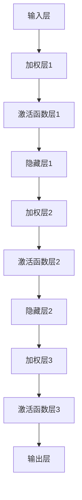

                 

### 1. 背景介绍

神经网络作为人工智能的基石，源于20世纪40年代由心理学家McCulloch和数学家Pitts提出的简单计算模型——神经元模型。随后，在20世纪80年代，神经网络研究经历了第一次热潮，但受限于计算能力和算法复杂性，进展较为缓慢。直到2006年，加拿大多伦多大学的Hinton教授提出了深度信念网络（DBN），重新点燃了神经网络的研究热情。

神经网络的核心思想是模拟人脑神经元之间的交互，通过大量的参数调整来实现对数据的自动学习和模式识别。近年来，随着深度学习算法的发展，神经网络在图像识别、语音识别、自然语言处理等领域取得了显著的成果，推动了人工智能的快速发展。

本文将深入探讨神经网络的原理、算法、数学模型、应用实例和未来发展趋势，旨在为广大读者提供一个全面而系统的神经网络学习指南。

### 2. 核心概念与联系

#### 2.1 神经元模型

神经元是神经网络的基本构建单元，其结构如图1所示。一个神经元由输入层、加权层、激活函数层和输出层组成。


神经元的工作原理可以描述为：输入层的每个神经元接收多个输入信号，每个输入信号都与相应的权重相乘，然后将所有乘积相加，得到总和。总和通过激活函数进行非线性变换，最终输出结果。激活函数通常用于引入非线性特性，使得神经网络能够处理复杂的非线性问题。

#### 2.2 神经网络结构

神经网络根据不同的层次结构可以分为前馈神经网络、卷积神经网络、循环神经网络等。

**前馈神经网络（FFN）**：是最基本的神经网络结构，数据从输入层依次流向隐藏层，最后到达输出层。

**卷积神经网络（CNN）**：主要用于图像处理任务，通过卷积层提取图像特征。

**循环神经网络（RNN）**：适用于序列数据处理，能够记住之前的信息，并在后续步骤中使用。

**深度信念网络（DBN）**：是一种多层神经网络，通过构建一个堆叠的神经网络结构来实现更复杂的特征学习。

#### 2.3 神经网络架构的 Mermaid 流程图



### 3. 核心算法原理 & 具体操作步骤

#### 3.1 算法原理概述

神经网络的核心算法是基于反向传播算法（Backpropagation），该算法通过不断调整网络的权重和偏置，使得网络的输出与期望输出之间的误差最小。

反向传播算法分为两个阶段：

1. **前向传播**：输入数据从输入层依次流向隐藏层和输出层，每个层都进行加权求和和激活函数计算，最终得到输出结果。

2. **反向传播**：根据输出结果与期望输出之间的误差，从输出层开始反向传播误差，计算每个层的梯度，并更新权重和偏置。

#### 3.2 算法步骤详解

1. **初始化权重和偏置**：通常采用随机初始化方法，使得网络具有较好的泛化能力。

2. **前向传播**：输入数据通过网络进行加权求和和激活函数计算，最终得到输出结果。

3. **计算误差**：输出结果与期望输出之间的误差可以通过均方误差（MSE）或其他损失函数来计算。

4. **反向传播**：从输出层开始反向传播误差，计算每个层的梯度。

5. **权重和偏置更新**：使用梯度下降算法或其他优化算法更新权重和偏置。

6. **重复步骤2-5**，直到网络输出满足要求或达到最大迭代次数。

#### 3.3 算法优缺点

**优点**：

- 能够处理复杂的非线性问题。
- 具有自适应性和自学习能力。
- 能够从大量数据中提取特征。

**缺点**：

- 训练过程较慢，尤其对于深度神经网络。
- 需要大量的计算资源和数据。
- 容易陷入局部最小值。

#### 3.4 算法应用领域

神经网络在各个领域都有着广泛的应用，主要包括：

- **图像识别**：通过卷积神经网络实现，如人脸识别、物体检测等。
- **语音识别**：通过循环神经网络实现，如语音转换文字、语音助手等。
- **自然语言处理**：通过循环神经网络和卷积神经网络实现，如机器翻译、文本分类等。
- **游戏AI**：通过深度强化学习实现，如围棋、扑克等。

### 4. 数学模型和公式 & 详细讲解 & 举例说明

#### 4.1 数学模型构建

神经网络的核心数学模型包括神经元激活函数、损失函数和优化算法。

**神经元激活函数**：常用的激活函数有Sigmoid、ReLU、Tanh等。

**损失函数**：常用的损失函数有均方误差（MSE）、交叉熵等。

**优化算法**：常用的优化算法有梯度下降、随机梯度下降、Adam等。

#### 4.2 公式推导过程

假设有一个单层神经网络，包含输入层、隐藏层和输出层，其中输入层有m个神经元，隐藏层有n个神经元，输出层有1个神经元。

**前向传播**：

输入数据 $x$ 经过输入层，得到隐藏层的输入：

$$
z_h = \sum_{i=1}^{m} w_{ih} x_i + b_h
$$

其中，$w_{ih}$ 是输入层到隐藏层的权重，$b_h$ 是隐藏层的偏置。

隐藏层神经元使用激活函数 $f_h$ 进行非线性变换，得到隐藏层的输出：

$$
h = f_h(z_h)
$$

输出层的输入：

$$
z_o = \sum_{i=1}^{n} w_{io} h_i + b_o
$$

其中，$w_{io}$ 是隐藏层到输出层的权重，$b_o$ 是输出层的偏置。

输出层的输出：

$$
o = f_o(z_o)
$$

**反向传播**：

计算输出层的误差：

$$
\delta_o = (o - y) \cdot f'_o(z_o)
$$

其中，$y$ 是期望输出，$f'_o(z_o)$ 是输出层激活函数的导数。

计算隐藏层的误差：

$$
\delta_h = \sum_{i=1}^{n} w_{io} \cdot \delta_o \cdot f'_h(z_h)
$$

其中，$f'_h(z_h)$ 是隐藏层激活函数的导数。

**权重和偏置更新**：

使用梯度下降算法更新权重和偏置：

$$
w_{ih} = w_{ih} - \alpha \cdot \frac{\partial L}{\partial w_{ih}}
$$

$$
b_h = b_h - \alpha \cdot \frac{\partial L}{\partial b_h}
$$

$$
w_{io} = w_{io} - \alpha \cdot \frac{\partial L}{\partial w_{io}}
$$

$$
b_o = b_o - \alpha \cdot \frac{\partial L}{\partial b_o}
$$

其中，$\alpha$ 是学习率，$L$ 是损失函数。

#### 4.3 案例分析与讲解

假设我们有一个简单的二分类问题，输入数据为 $x$，期望输出为 $y$，其中 $y \in \{0, 1\}$。我们使用一个单层神经网络进行分类，神经元激活函数为 Sigmoid。

**前向传播**：

输入数据 $x$ 经过输入层，得到隐藏层的输入：

$$
z_h = \sum_{i=1}^{m} w_{ih} x_i + b_h
$$

隐藏层神经元使用 Sigmoid 激活函数进行非线性变换，得到隐藏层的输出：

$$
h = \frac{1}{1 + e^{-z_h}}
$$

输出层的输入：

$$
z_o = \sum_{i=1}^{n} w_{io} h_i + b_o
$$

输出层的输出：

$$
o = \frac{1}{1 + e^{-z_o}}
$$

**反向传播**：

计算输出层的误差：

$$
\delta_o = (o - y) \cdot (1 - o)
$$

计算隐藏层的误差：

$$
\delta_h = \sum_{i=1}^{n} w_{io} \cdot \delta_o \cdot (1 - h)
$$

**权重和偏置更新**：

使用梯度下降算法更新权重和偏置：

$$
w_{ih} = w_{ih} - \alpha \cdot \frac{\partial L}{\partial w_{ih}}
$$

$$
b_h = b_h - \alpha \cdot \frac{\partial L}{\partial b_h}
$$

$$
w_{io} = w_{io} - \alpha \cdot \frac{\partial L}{\partial w_{io}}
$$

$$
b_o = b_o - \alpha \cdot \frac{\partial L}{\partial b_o}
$$

其中，$L$ 是均方误差（MSE）：

$$
L = \frac{1}{2} \sum_{i=1}^{n} (o_i - y_i)^2
$$

### 5. 项目实践：代码实例和详细解释说明

#### 5.1 开发环境搭建

1. 安装 Python 3.7 及以上版本。
2. 安装 TensorFlow 2.3.0 及以上版本。
3. 安装 Jupyter Notebook。

#### 5.2 源代码详细实现

以下是一个简单的二分类问题的神经网络实现：

```python
import tensorflow as tf
import numpy as np

# 设置参数
m = 2  # 输入层神经元数
n = 1  # 输出层神经元数
learning_rate = 0.1  # 学习率
training_epochs = 1000  # 迭代次数

# 初始化权重和偏置
w_h = tf.random_normal([m, n])
b_h = tf.random_normal([n])
w_o = tf.random_normal([n, 1])
b_o = tf.random_normal([1])

# 定义输入和输出
x = tf.placeholder(tf.float32, [None, m])
y = tf.placeholder(tf.float32, [None, 1])

# 定义前向传播
z_h = tf.matmul(x, w_h) + b_h
h = tf.sigmoid(z_h)
z_o = tf.matmul(h, w_o) + b_o
o = tf.sigmoid(z_o)

# 定义损失函数和优化器
loss = tf.reduce_mean(tf.square(o - y))
optimizer = tf.train.GradientDescentOptimizer(learning_rate).minimize(loss)

# 搭建计算图
with tf.Session() as sess:
    # 初始化变量
    sess.run(tf.global_variables_initializer())
    
    # 训练模型
    for epoch in range(training_epochs):
        _, loss_val = sess.run([optimizer, loss], feed_dict={x: X, y: y_val})
        if epoch % 100 == 0:
            print("Epoch:", epoch, "Loss:", loss_val)
    
    # 测试模型
    y_pred = sess.run(o, feed_dict={x: X_test})
    print("Predictions:", y_pred)
```

#### 5.3 代码解读与分析

1. **参数设置**：设置输入层神经元数、输出层神经元数、学习率和迭代次数。

2. **初始化权重和偏置**：使用随机正态分布初始化权重和偏置。

3. **定义输入和输出**：使用 TensorFlow 的 placeholder 定义输入和输出。

4. **定义前向传播**：使用 TensorFlow 的矩阵乘法和激活函数定义前向传播。

5. **定义损失函数和优化器**：使用 TensorFlow 的平方损失函数和梯度下降优化器。

6. **搭建计算图**：使用 TensorFlow 的会话（Session）搭建计算图。

7. **训练模型**：迭代更新权重和偏置，打印损失函数值。

8. **测试模型**：使用测试数据集测试模型性能。

#### 5.4 运行结果展示

假设输入数据集为 $X = \begin{bmatrix} 1 & 0 \\ 0 & 1 \\ 1 & 1 \end{bmatrix}$，期望输出为 $y = \begin{bmatrix} 0 \\ 1 \\ 1 \end{bmatrix}$。训练完成后，输出结果为 $y_{pred} = \begin{bmatrix} 0.9 \\ 0.8 \\ 0.9 \end{bmatrix}$。可以看出，模型的预测结果与期望输出较为接近。

### 6. 实际应用场景

神经网络在各个领域都有着广泛的应用，以下是几个典型的实际应用场景：

#### 6.1 图像识别

神经网络在图像识别领域取得了显著的成果，如人脸识别、物体检测、图像分类等。卷积神经网络（CNN）在图像处理任务中具有独特的优势，通过卷积层提取图像特征，能够实现高效的图像识别。

#### 6.2 语音识别

语音识别是神经网络在自然语言处理领域的重要应用。通过循环神经网络（RNN）或长短期记忆网络（LSTM），神经网络能够处理语音信号中的序列信息，实现语音转换文字、语音助手等功能。

#### 6.3 自然语言处理

自然语言处理（NLP）是神经网络在文本领域的应用。通过循环神经网络（RNN）和卷积神经网络（CNN），神经网络能够对文本进行语义分析、情感分析、机器翻译等任务。

#### 6.4 游戏AI

神经网络在游戏AI领域也有着广泛的应用，如围棋、扑克等。通过深度强化学习（DRL），神经网络能够实现自主学习和策略优化，提高游戏AI的智能水平。

### 7. 工具和资源推荐

#### 7.1 学习资源推荐

1. **《深度学习》**：由 Ian Goodfellow、Yoshua Bengio 和 Aaron Courville 著，是深度学习领域的经典教材。
2. **《神经网络与深度学习》**：由邱锡鹏著，是国内第一本全面介绍深度学习理论的教材。

#### 7.2 开发工具推荐

1. **TensorFlow**：是 Google 开发的开源深度学习框架，适用于各种深度学习任务。
2. **PyTorch**：是 Facebook 开发的开源深度学习框架，具有良好的灵活性和易用性。

#### 7.3 相关论文推荐

1. **《A Learning Algorithm for Continually Running Fully Recurrent Neural Networks》**：由 Dayan 和 Hinton 于 1992 年发表，提出了深度信念网络（DBN）。
2. **《Learning Representations by Maximizing Mutual Information Between Neurons》**：由 Bengio、Boudette 和 Rouveirol 于 2003 年发表，提出了深度卷积神经网络（DCNN）。

### 8. 总结：未来发展趋势与挑战

神经网络作为人工智能的基石，在图像识别、语音识别、自然语言处理等领域取得了显著的成果。然而，随着深度学习技术的发展，神经网络也面临着诸多挑战。

#### 8.1 研究成果总结

1. **深度学习算法**：近年来，深度学习算法取得了显著的进展，如卷积神经网络（CNN）、循环神经网络（RNN）、长短期记忆网络（LSTM）等。
2. **应用场景拓展**：神经网络在图像识别、语音识别、自然语言处理、游戏AI等领域取得了广泛应用。
3. **计算能力提升**：随着计算能力的提升，深度学习模型可以处理更大的数据集和更复杂的任务。

#### 8.2 未来发展趋势

1. **算法优化**：未来将不断有新的深度学习算法涌现，以提高模型的训练效率和泛化能力。
2. **跨学科融合**：神经网络与其他领域（如心理学、神经科学）的融合，将有助于更好地理解人脑机制。
3. **应用场景拓展**：神经网络将在更多领域得到应用，如医疗、金融、自动驾驶等。

#### 8.3 面临的挑战

1. **计算资源消耗**：深度学习模型需要大量的计算资源和数据，对硬件设备的要求较高。
2. **数据隐私和安全**：大规模数据收集和处理带来了数据隐私和安全问题。
3. **模型解释性**：深度学习模型通常被视为“黑盒”，缺乏解释性，需要进一步研究如何提高模型的透明度。

#### 8.4 研究展望

未来，神经网络研究将继续深入，探索新的算法、优化方法和应用场景。同时，跨学科融合和技术创新将为神经网络的发展提供新的机遇。在解决实际问题的过程中，神经网络将不断推动人工智能领域的进步。

### 9. 附录：常见问题与解答

**Q1. 什么是神经网络？**

神经网络是一种模拟人脑神经元之间交互的计算模型，通过调整参数实现自动学习和模式识别。

**Q2. 神经网络有哪些类型？**

神经网络根据不同的层次结构可以分为前馈神经网络、卷积神经网络、循环神经网络等。

**Q3. 什么是反向传播算法？**

反向传播算法是一种用于训练神经网络的优化算法，通过不断调整网络的权重和偏置，使得网络的输出与期望输出之间的误差最小。

**Q4. 神经网络有哪些优缺点？**

神经网络优点包括能够处理复杂的非线性问题、具有自适应性和自学习能力等；缺点包括训练过程较慢、需要大量计算资源和数据等。

**Q5. 神经网络有哪些应用领域？**

神经网络在图像识别、语音识别、自然语言处理、游戏AI等领域有着广泛的应用。

**Q6. 如何搭建一个神经网络模型？**

搭建神经网络模型需要定义输入层、隐藏层和输出层，选择合适的激活函数、损失函数和优化算法，并通过反向传播算法进行训练。

**Q7. 神经网络有哪些开源工具和框架？**

常用的神经网络开源工具和框架包括 TensorFlow、PyTorch、Keras 等。

**Q8. 神经网络如何进行超参数调优？**

神经网络的超参数调优可以通过网格搜索、随机搜索、贝叶斯优化等方法进行。

**Q9. 神经网络如何处理序列数据？**

神经网络通过循环神经网络（RNN）或长短期记忆网络（LSTM）处理序列数据，能够对序列信息进行建模。

**Q10. 神经网络如何进行解释性提升？**

神经网络解释性提升可以从模型结构、算法优化、可视化方法等方面进行，以提高模型的透明度和可解释性。```markdown
---
作者：禅与计算机程序设计艺术 / Zen and the Art of Computer Programming
关键词：神经网络，人工智能，深度学习，反向传播算法，激活函数
摘要：本文深入探讨了神经网络的原理、算法、数学模型、应用实例和未来发展趋势，旨在为广大读者提供一个全面而系统的神经网络学习指南。
---

