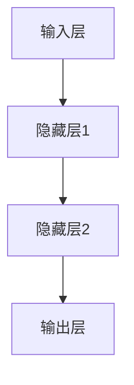
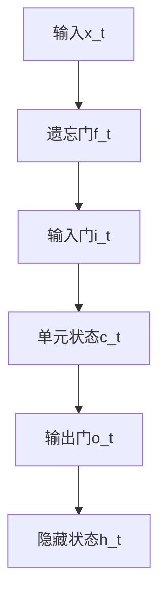

                 

关键词：神经网络，机器翻译，深度学习，自然语言处理，人工智能

> 摘要：本文将深入探讨神经网络在机器翻译领域的应用，分析其核心概念、算法原理、数学模型及其在实际应用中的具体操作步骤和案例。通过本文的阅读，读者将对神经网络在机器翻译中的作用和未来发展趋势有更深刻的理解。

## 1. 背景介绍

### 1.1 机器翻译的发展历程

机器翻译（Machine Translation，MT）是指利用计算机程序将一种自然语言（源语言）自动翻译成另一种自然语言（目标语言）。自1950年代首次提出以来，机器翻译领域经历了从规则驱动到基于统计再到深度学习模型的演变。

- **规则驱动翻译**：基于语言专家手工编写的语法规则和词典，这种方法在早期取得了有限的成果，但随着语言复杂性的增加，其局限性愈发明显。
- **基于统计的翻译**：利用大量双语文本对，通过统计方法提取翻译规则，这种方法在21世纪初取得了显著进步，但仍受到数据不足和翻译质量局限的困扰。
- **基于深度学习的机器翻译**：以神经网络为核心，深度学习模型通过自动学习大量双语数据，大幅提升了翻译质量和效率，成为当前机器翻译的主流方法。

### 1.2 深度学习与神经网络

深度学习（Deep Learning，DL）是机器学习的一个重要分支，通过构建多层次的神经网络来模拟人脑的神经元结构，从而自动提取数据的特征和模式。神经网络（Neural Network，NN）是深度学习的基础，它由大量简单的计算单元（神经元）组成，通过前向传播和反向传播算法来学习输入和输出之间的复杂映射关系。

## 2. 核心概念与联系

### 2.1 神经网络的基本架构

神经网络由输入层、隐藏层和输出层组成。每个神经元接收来自前一层的输入，通过激活函数进行非线性变换，然后将输出传递到下一层。通过多层神经元的叠加，神经网络能够学习到复杂的特征和模式。



### 2.2 循环神经网络（RNN）

循环神经网络（Recurrent Neural Network，RNN）是处理序列数据的常见网络结构。RNN通过在时间步间引入循环，使得网络能够记忆和利用前面的信息。然而，传统RNN在处理长序列时存在梯度消失和梯度爆炸的问题。

```mermaid
graph TD
A[时间步t] --> B[隐藏状态h_t]
B --> C[隐藏状态h_{t+1}]
C --> D[输出y_t]
```

### 2.3 长短期记忆网络（LSTM）

长短期记忆网络（Long Short-Term Memory，LSTM）是RNN的一种改进，通过引入门控机制来有效地解决梯度消失和梯度爆炸问题。LSTM能够记住长期依赖信息，从而在机器翻译等序列建模任务中表现出色。



## 3. 核心算法原理 & 具体操作步骤

### 3.1 算法原理概述

神经网络在机器翻译中的基本原理是通过学习大量双语数据，将源语言序列映射到目标语言序列。这个过程主要分为编码器（Encoder）和解码器（Decoder）两部分：

- **编码器**：接收源语言序列，将其编码为一个固定长度的向量，这个向量包含了源语言序列的所有信息。
- **解码器**：接收编码器的输出，生成目标语言序列。

### 3.2 算法步骤详解

1. **数据预处理**：将源语言和目标语言文本转化为序列，并转换为整数或单词的向量表示。
2. **编码器训练**：通过最小化损失函数，训练编码器将源语言序列映射为固定长度的向量。
3. **解码器训练**：同样通过最小化损失函数，训练解码器将编码器的输出映射为目标语言序列。
4. **翻译生成**：给定一个源语言序列，编码器将其编码为一个向量，然后解码器使用这个向量生成目标语言序列。

### 3.3 算法优缺点

**优点**：
- **强大表达能力**：神经网络能够自动学习复杂的语言特征，大大提高了翻译质量。
- **自适应能力**：通过训练，神经网络能够适应不同语言之间的差异，提高了翻译的准确性。
- **并行处理**：神经网络可以在多个时间步并行处理，提高了翻译速度。

**缺点**：
- **计算资源消耗**：深度学习模型通常需要大量的计算资源和时间进行训练。
- **数据依赖性**：模型的质量高度依赖于训练数据的质量和数量。

### 3.4 算法应用领域

神经网络在机器翻译领域的应用广泛，包括但不限于：

- **跨语言信息检索**：通过机器翻译，将不同语言的文档进行统一检索，提高了信息检索的效率。
- **多语言交流**：使得跨语言交流更加便捷，促进了不同国家和地区之间的交流。
- **自然语言生成**：神经网络不仅可以用于翻译，还可以用于生成自然语言文本，如新闻、文章等。

## 4. 数学模型和公式

### 4.1 数学模型构建

神经网络在机器翻译中的数学模型主要由编码器和解码器两部分组成。编码器和解码器的数学模型如下：

**编码器**：
$$
h_t = \sigma(W_h h_{t-1} + W_x x_t + b_h)
$$

**解码器**：
$$
y_t = \sigma(W_y h_t + b_y)
$$

其中，$h_t$表示隐藏状态，$x_t$表示输入，$y_t$表示输出，$W_h$、$W_x$、$W_y$分别是权重矩阵，$\sigma$是激活函数，$b_h$、$b_y$是偏置项。

### 4.2 公式推导过程

神经网络的训练过程是通过反向传播算法来最小化损失函数。假设我们的目标是最小化平均交叉熵损失：

$$
J = -\frac{1}{N} \sum_{i=1}^{N} \sum_{j=1}^{M} y_{ij} \log (\hat{y}_{ij})
$$

其中，$N$是样本数量，$M$是输出类别数量，$y_{ij}$是真实标签，$\hat{y}_{ij}$是模型预测的概率。

通过梯度下降，我们对每个参数进行更新：

$$
\Delta W_h = -\alpha \frac{\partial J}{\partial W_h}
$$
$$
\Delta W_x = -\alpha \frac{\partial J}{\partial W_x}
$$
$$
\Delta W_y = -\alpha \frac{\partial J}{\partial W_y}
$$
$$
\Delta b_h = -\alpha \frac{\partial J}{\partial b_h}
$$
$$
\Delta b_y = -\alpha \frac{\partial J}{\partial b_y}
$$

其中，$\alpha$是学习率。

### 4.3 案例分析与讲解

假设我们要将英语翻译成法语，具体操作步骤如下：

1. **数据预处理**：将英语和法语文本转化为单词序列，并转换为整数向量。
2. **编码器训练**：使用英语单词序列训练编码器，将其映射为固定长度的向量。
3. **解码器训练**：使用英语单词序列和对应的法语单词序列训练解码器，将编码器的输出映射为法语单词序列。
4. **翻译生成**：给定一个英语句子，编码器将其编码为一个向量，解码器使用这个向量生成法语句子。

通过以上步骤，我们能够实现英语到法语的翻译。

## 5. 项目实践：代码实例和详细解释说明

### 5.1 开发环境搭建

在开始项目实践之前，我们需要搭建一个开发环境。这里我们使用Python和TensorFlow框架来构建神经网络。

```python
pip install tensorflow
```

### 5.2 源代码详细实现

以下是一个简单的神经网络机器翻译模型的实现：

```python
import tensorflow as tf

# 定义编码器和解码器的神经网络结构
def build_model():
    # 编码器
    inputs = tf.keras.layers.Input(shape=(None,))
    encoder_embedding = tf.keras.layers.Embedding(input_dim=vocab_size, output_dim=embedding_size)(inputs)
    encoder_lstm = tf.keras.layers.LSTM(units=lstm_units)(encoder_embedding)
    encoder_model = tf.keras.Model(inputs=inputs, outputs=encoder_lstm)

    # 解码器
    decoder_inputs = tf.keras.layers.Input(shape=(None,))
    decoder_embedding = tf.keras.layers.Embedding(input_dim=vocab_size, output_dim=embedding_size)(decoder_inputs)
    decoder_lstm = tf.keras.layers.LSTM(units=lstm_units)(decoder_embedding)
    decoder_dense = tf.keras.layers.Dense(units=vocab_size, activation='softmax')(decoder_lstm)
    decoder_model = tf.keras.Model(inputs=decoder_inputs, outputs=decoder_dense)

    # 定义模型
    model = tf.keras.Model(inputs=[encoder_model.input, decoder_model.input], outputs=decoder_model.output)
    model.compile(optimizer='adam', loss='categorical_crossentropy', metrics=['accuracy'])
    return model

# 加载数据和预处理
def preprocess_data():
    # 加载英语和法语语料库
    english corpus, french corpus = load_data()
    # 转换为单词序列
    english_sequences = convert_to_sequences(english corpus)
    french_sequences = convert_to_sequences(french corpus)
    return english_sequences, french_sequences

# 训练模型
def train_model(model, english_sequences, french_sequences):
    model.fit([english_sequences, french_sequences], french_sequences, epochs=10, batch_size=32)
    model.save('machine_translation_model.h5')

# 翻译生成
def translate(sentence):
    model = build_model()
    model.load_weights('machine_translation_model.h5')
    # 将句子转换为单词序列
    sentence_sequence = preprocess_sentence(sentence)
    # 进行翻译
    translated_sequence = model.predict(sentence_sequence)
    # 将单词序列转换为句子
    translated_sentence = convert_to_sentence(translated_sequence)
    return translated_sentence

# 主函数
if __name__ == '__main__':
    # 搭建模型
    model = build_model()
    # 加载数据
    english_sequences, french_sequences = preprocess_data()
    # 训练模型
    train_model(model, english_sequences, french_sequences)
    # 进行翻译
    sentence = "Hello, how are you?"
    translated_sentence = translate(sentence)
    print(translated_sentence)
```

### 5.3 代码解读与分析

上述代码实现了一个简单的神经网络机器翻译模型。首先，我们定义了编码器和解码器的神经网络结构，并使用TensorFlow框架构建了模型。接着，我们加载数据并进行预处理，将英语和法语文本转化为单词序列。然后，我们训练模型，并在训练完成后使用模型进行翻译生成。最后，我们通过主函数实现了整个机器翻译流程。

## 6. 实际应用场景

### 6.1 翻译服务提供商

随着深度学习技术的不断发展，许多翻译服务提供商已经开始采用神经网络进行机器翻译。例如，谷歌翻译、百度翻译等平台都采用了深度学习模型，大幅提高了翻译质量和速度。

### 6.2 跨语言信息检索

在跨语言信息检索领域，神经网络机器翻译被广泛应用于将不同语言的文档进行统一检索。例如，谷歌搜索引擎使用神经网络翻译将不同语言的网页统一到用户的母语中，提高了信息检索的准确性和用户体验。

### 6.3 多语言交流

神经网络机器翻译的应用使得多语言交流变得更加便捷。例如，在国际会议、商务谈判等场合，机器翻译可以实时翻译发言者的语言，促进不同国家和地区之间的交流。

### 6.4 自然语言处理

神经网络机器翻译的成功经验也被广泛应用于其他自然语言处理任务，如文本分类、情感分析、问答系统等。这些任务中，神经网络通过学习大量的双语数据，能够自动提取语言特征，提高了模型的性能。

## 7. 工具和资源推荐

### 7.1 学习资源推荐

- **《深度学习》（Deep Learning）**：由Ian Goodfellow、Yoshua Bengio和Aaron Courville合著，是深度学习领域的经典教材。
- **《神经网络与深度学习》**：邱锡鹏博士的中文教材，系统地介绍了神经网络和深度学习的基本原理和应用。

### 7.2 开发工具推荐

- **TensorFlow**：由谷歌开发的开源深度学习框架，适合进行神经网络模型的开发和训练。
- **PyTorch**：由Facebook开发的开源深度学习框架，具有简洁的API和灵活的模型定义方式。

### 7.3 相关论文推荐

- **“Seq2Seq Learning with Neural Networks”**：这篇论文提出了序列到序列学习（Seq2Seq）模型，是神经网络机器翻译的奠基性工作。
- **“Attention Is All You Need”**：这篇论文提出了注意力机制（Attention Mechanism），极大地提高了神经网络机器翻译的性能。

## 8. 总结：未来发展趋势与挑战

### 8.1 研究成果总结

神经网络在机器翻译领域取得了显著成果，通过深度学习模型，翻译质量和速度都有了大幅提升。神经网络能够自动提取语言特征，适应不同语言之间的差异，使得机器翻译更加准确和自然。

### 8.2 未来发展趋势

- **多模态翻译**：随着语音识别、图像识别等技术的发展，神经网络机器翻译将扩展到多模态翻译，实现文本、语音、图像等多种信息的跨语言转换。
- **个性化翻译**：通过用户偏好和学习，神经网络机器翻译将能够提供更加个性化的翻译服务，满足用户的特定需求。
- **实时翻译**：随着计算资源和算法的优化，神经网络机器翻译将实现实时翻译，提高跨语言交流的效率。

### 8.3 面临的挑战

- **数据依赖性**：神经网络机器翻译高度依赖大量的双语数据，缺乏数据将限制其性能。
- **计算资源消耗**：深度学习模型通常需要大量的计算资源和时间进行训练，这对于资源有限的场景是一个挑战。
- **语言差异**：不同语言之间的语法、语义和词汇差异使得神经网络机器翻译面临很大的挑战，需要进一步研究如何提高跨语言的适应能力。

### 8.4 研究展望

神经网络在机器翻译领域仍然有很多研究方向，包括如何提高数据利用效率、如何优化模型结构、如何解决跨语言差异等。随着深度学习技术的不断发展，神经网络机器翻译有望在未来取得更大的突破，为跨语言交流和信息检索提供更加高效、准确的服务。

## 9. 附录：常见问题与解答

### 9.1 什么是神经网络？

神经网络是一种通过模拟人脑神经元结构来实现复杂计算的人工智能模型。它由大量的简单计算单元（神经元）组成，通过前向传播和反向传播算法来学习输入和输出之间的映射关系。

### 9.2 神经网络在机器翻译中的作用是什么？

神经网络在机器翻译中主要充当编码器和解码器的角色，通过学习大量的双语数据，将源语言序列编码为固定长度的向量，然后将这个向量解码为目标语言序列。

### 9.3 如何优化神经网络机器翻译的性能？

优化神经网络机器翻译的性能可以从多个方面进行，包括：

- **增加训练数据**：使用更多的双语数据可以提高模型的泛化能力。
- **改进模型结构**：通过设计更复杂的神经网络结构，可以提高模型的表示能力。
- **调整超参数**：优化学习率、批量大小等超参数可以提高训练效果。
- **引入注意力机制**：注意力机制可以使得模型更加关注重要的信息，提高翻译的准确性。

### 9.4 神经网络机器翻译与基于统计的机器翻译有什么区别？

神经网络机器翻译与基于统计的机器翻译在原理和应用上有所不同：

- **原理**：神经网络机器翻译通过深度学习模型自动提取语言特征，而基于统计的机器翻译通过统计方法提取翻译规则。
- **应用**：神经网络机器翻译能够处理更复杂的语言结构和语义信息，而基于统计的机器翻译在处理简单、规律性较强的语言时效果较好。

### 9.5 如何评估神经网络机器翻译的性能？

评估神经网络机器翻译的性能可以从多个方面进行，包括：

- **BLEU分数**：BLEU（Bilingual Evaluation Understudy）分数是一种常用的自动评估指标，通过比较机器翻译结果和人工翻译结果之间的相似度来评估翻译质量。
- **人类评估**：通过聘请专业翻译人员对机器翻译结果进行评估，这是一种主观性较强的评估方法，但能够提供更准确的质量评价。
- **词汇覆盖**：评估机器翻译结果中出现的词汇是否覆盖了源语言中的大部分词汇，这可以反映翻译的全面性。

## 作者署名

作者：禅与计算机程序设计艺术 / Zen and the Art of Computer Programming

