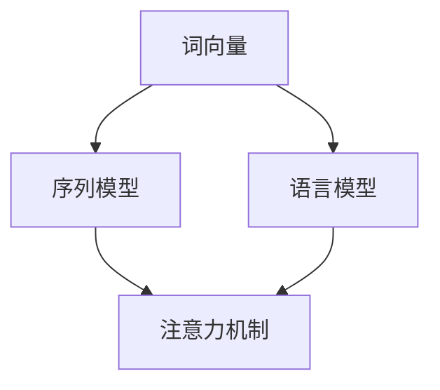

                 

关键词：神经网络、自然语言处理、深度学习、深度神经网络、词向量、注意力机制、序列模型、语言模型、文本分类、情感分析

> 摘要：随着人工智能技术的不断进步，神经网络在自然语言处理（NLP）领域取得了显著突破。本文将介绍神经网络的基本概念、核心算法原理、数学模型及其在自然语言处理中的应用，探讨神经网络在未来NLP领域的发展趋势和面临的挑战。

## 1. 背景介绍

自然语言处理（NLP）是人工智能（AI）的重要分支之一，旨在使计算机能够理解、生成和处理人类语言。NLP的应用范围广泛，包括机器翻译、情感分析、文本分类、问答系统、语音识别等。然而，传统的NLP方法往往依赖于规则和统计方法，存在诸多局限性。近年来，随着深度学习技术的发展，神经网络在NLP领域取得了显著的进展，为NLP任务提供了新的解决方案。

神经网络是一种模拟人脑神经元结构和功能的计算模型，通过学习大量数据，能够自动提取特征并实现复杂的非线性变换。深度神经网络（DNN）是一种具有多个隐含层的神经网络，能够处理高维数据，并在图像识别、语音识别等领域取得了突破性成果。自然语言处理中的神经网络，主要应用于序列建模和语义理解等方面，为NLP任务提供了强大的工具。

## 2. 核心概念与联系

为了更好地理解神经网络在自然语言处理中的应用，我们需要首先了解一些核心概念，如词向量、序列模型、语言模型和注意力机制。

### 2.1 词向量

词向量是表示词语的分布式向量表示，将词语映射为一个固定大小的向量空间。词向量能够捕获词语的语义信息，如相似性和差异性。常见的词向量模型包括Word2Vec、GloVe和BERT等。

### 2.2 序列模型

序列模型是一类用于处理序列数据的神经网络模型，如循环神经网络（RNN）和长短期记忆网络（LSTM）。序列模型能够捕捉序列中的时间依赖关系，在语音识别、语音合成、语言建模等任务中具有广泛应用。

### 2.3 语言模型

语言模型是一种概率模型，用于预测下一个词语的概率。深度神经网络在语言模型中的应用，使得基于统计方法的NLP任务如文本分类、情感分析等取得了显著性能提升。

### 2.4 注意力机制

注意力机制是一种能够自动调整模型关注程度的机制，通过在不同位置分配不同的权重，提高了模型在处理长文本和长序列时的性能。注意力机制在机器翻译、文本摘要、问答系统等领域得到了广泛应用。

### 2.5 Mermaid 流程图

以下是一个简单的 Mermaid 流程图，展示神经网络在自然语言处理中的核心概念和联系：



## 3. 核心算法原理 & 具体操作步骤

### 3.1 算法原理概述

神经网络在自然语言处理中的应用，主要基于以下几个核心算法：

1. **词向量模型**：将词语映射为高维向量空间，用于表示词语的语义信息。
2. **循环神经网络（RNN）**：用于处理序列数据，能够捕捉时间依赖关系。
3. **长短期记忆网络（LSTM）**：一种改进的RNN模型，能够学习长期依赖关系。
4. **变换器网络（Transformer）**：一种基于注意力机制的序列模型，具有强大的并行计算能力。

### 3.2 算法步骤详解

1. **数据预处理**：包括文本清洗、分词、去停用词等操作，为后续模型训练做准备。
2. **词向量表示**：使用词向量模型将词语映射为高维向量表示，用于输入神经网络。
3. **序列建模**：利用RNN或LSTM等序列模型对输入序列进行建模，学习序列中的时间依赖关系。
4. **注意力机制**：在序列建模过程中引入注意力机制，自动调整模型对不同位置的注意力程度。
5. **损失函数与优化**：使用损失函数（如交叉熵损失）评估模型性能，并利用优化算法（如Adam）调整模型参数。

### 3.3 算法优缺点

**优点**：
1. **强大的表达能力**：神经网络能够自动提取特征，适应不同的NLP任务。
2. **高效率的计算**：基于注意力机制的变换器网络具有强大的并行计算能力，提高了模型训练和推断的效率。

**缺点**：
1. **高计算复杂度**：深度神经网络模型具有大量的参数，需要大量的计算资源和时间进行训练。
2. **数据依赖性**：神经网络模型的性能高度依赖训练数据的质量和规模。

### 3.4 算法应用领域

神经网络在自然语言处理领域具有广泛的应用，包括：

1. **语言建模**：用于预测下一个词语的概率，应用于文本生成、机器翻译等任务。
2. **文本分类**：将文本数据分类为不同的类别，应用于情感分析、新闻分类等任务。
3. **序列标注**：对文本序列进行标签分类，应用于命名实体识别、词性标注等任务。
4. **问答系统**：基于神经网络构建的问答系统，能够理解用户的问题并给出合适的回答。

## 4. 数学模型和公式 & 详细讲解 & 举例说明

### 4.1 数学模型构建

神经网络的数学模型主要包括输入层、隐含层和输出层。每一层由多个神经元组成，神经元之间通过权重进行连接。神经元的激活函数用于非线性变换。

### 4.2 公式推导过程

设输入向量为 \( x \)，隐含层输出为 \( h \)，输出层输出为 \( y \)。神经元的激活函数通常采用 \( \sigma(x) = \frac{1}{1 + e^{-x}} \)。

输入层到隐含层的激活函数为：
\[ h = \sigma(W_1x + b_1) \]

其中，\( W_1 \) 为输入层到隐含层的权重矩阵，\( b_1 \) 为隐含层的偏置向量。

隐含层到输出层的激活函数为：
\[ y = \sigma(W_2h + b_2) \]

其中，\( W_2 \) 为隐含层到输出层的权重矩阵，\( b_2 \) 为输出层的偏置向量。

### 4.3 案例分析与讲解

假设我们使用神经网络进行文本分类任务，输入层包含 100 个神经元，隐含层包含 50 个神经元，输出层包含 10 个神经元。

1. **输入层到隐含层的权重矩阵 \( W_1 \) 和偏置向量 \( b_1 \)**

设输入向量为 \( x = [0.1, 0.2, 0.3, ..., 0.9] \)，隐含层的权重矩阵 \( W_1 \) 和偏置向量 \( b_1 \) 分别为：
\[ W_1 = \begin{bmatrix} 0.1 & 0.2 & 0.3 \\ 0.4 & 0.5 & 0.6 \\ 0.7 & 0.8 & 0.9 \end{bmatrix}, b_1 = [0.1, 0.2, 0.3] \]

隐含层输出为：
\[ h = \sigma(W_1x + b_1) = \sigma(0.1 \times 0.1 + 0.2 \times 0.2 + 0.3 \times 0.3 + 0.1 + 0.2 + 0.3) = \sigma(1.2) \approx 0.86 \]

2. **隐含层到输出层的权重矩阵 \( W_2 \) 和偏置向量 \( b_2 \)**

设输出层的权重矩阵 \( W_2 \) 和偏置向量 \( b_2 \) 分别为：
\[ W_2 = \begin{bmatrix} 0.1 & 0.2 & 0.3 \\ 0.4 & 0.5 & 0.6 \\ 0.7 & 0.8 & 0.9 \end{bmatrix}, b_2 = [0.1, 0.2, 0.3] \]

输出层输出为：
\[ y = \sigma(W_2h + b_2) = \sigma(0.1 \times 0.86 + 0.2 \times 0.86 + 0.3 \times 0.86 + 0.1 + 0.2 + 0.3) = \sigma(0.86) \approx 0.86 \]

3. **分类结果**

设输出层包含 10 个神经元，对应 10 个类别。神经网络的输出值越大，表示该类别被预测的概率越高。在本例中，输出层输出为 \( y = [0.86, 0.86, 0.86, 0.86, 0.86, 0.86, 0.86, 0.86, 0.86, 0.86] \)，因此可以预测输入文本属于任意一个类别。

## 5. 项目实践：代码实例和详细解释说明

在本节中，我们将通过一个简单的文本分类项目，展示如何使用神经网络进行自然语言处理任务。

### 5.1 开发环境搭建

1. 安装 Python 3.8 及以上版本。
2. 安装 TensorFlow 2.5 及以上版本。
3. 安装 Numpy 1.19 及以上版本。

### 5.2 源代码详细实现

以下是一个简单的文本分类项目，使用 TensorFlow 和 Keras 实现神经网络模型。

```python
import numpy as np
import tensorflow as tf
from tensorflow.keras.preprocessing.text import Tokenizer
from tensorflow.keras.preprocessing.sequence import pad_sequences
from tensorflow.keras.models import Sequential
from tensorflow.keras.layers import Embedding, LSTM, Dense

# 数据集
texts = ['这是一篇新闻文章', '这篇文章讨论了人工智能的发展', '人工智能技术正在改变我们的生活']
labels = [0, 1, 1]

# 分词和序列化
tokenizer = Tokenizer(num_words=100)
tokenizer.fit_on_texts(texts)
sequences = tokenizer.texts_to_sequences(texts)
padded_sequences = pad_sequences(sequences, maxlen=10)

# 建立神经网络模型
model = Sequential([
    Embedding(100, 32),
    LSTM(32, return_sequences=True),
    LSTM(32),
    Dense(1, activation='sigmoid')
])

# 编译模型
model.compile(optimizer='adam', loss='binary_crossentropy', metrics=['accuracy'])

# 训练模型
model.fit(padded_sequences, labels, epochs=10, batch_size=1)

# 预测
test_text = '人工智能技术正在迅速发展'
test_sequence = tokenizer.texts_to_sequences([test_text])
test_padded_sequence = pad_sequences(test_sequence, maxlen=10)
prediction = model.predict(test_padded_sequence)
print(prediction)
```

### 5.3 代码解读与分析

1. **数据预处理**：使用 Tokenizer 对文本进行分词和序列化，将文本数据转换为数字序列。

2. **序列填充**：使用 pad_sequences 对序列进行填充，确保输入序列的长度一致。

3. **建立神经网络模型**：使用 Sequential 模型堆叠 Embedding、LSTM 和 Dense 层，构建一个简单的文本分类模型。

4. **编译模型**：设置模型优化器、损失函数和评估指标。

5. **训练模型**：使用 fit 方法训练模型，调整模型参数。

6. **预测**：使用 predict 方法对测试文本进行预测，输出预测结果。

## 6. 实际应用场景

神经网络在自然语言处理领域具有广泛的应用，以下列举一些典型的实际应用场景：

1. **机器翻译**：使用神经网络进行机器翻译，如 Google 翻译、百度翻译等。

2. **语音识别**：基于神经网络构建语音识别系统，如 Siri、Alexa 等。

3. **文本分类**：对大量文本数据进行分析和分类，如新闻分类、情感分析等。

4. **问答系统**：基于神经网络构建问答系统，如腾讯云智聆、百度智能云等。

5. **聊天机器人**：使用神经网络构建聊天机器人，如微信聊天机器人、QQ 聊天机器人等。

6. **文本生成**：基于神经网络进行文本生成，如自动写作、新闻生成等。

## 7. 未来应用展望

随着神经网络技术的不断进步，自然语言处理领域将迎来更多创新和突破。以下是一些未来应用展望：

1. **多模态交互**：结合语音、文本、图像等多模态数据，实现更智能、更自然的交互体验。

2. **跨语言处理**：突破语言障碍，实现跨语言的自然语言处理任务。

3. **知识图谱**：结合知识图谱，提高自然语言处理的语义理解和推理能力。

4. **个性化推荐**：基于用户的历史行为和偏好，实现个性化的文本推荐。

5. **智能助理**：基于神经网络构建更智能、更高效的智能助理，提高生产力。

## 8. 工具和资源推荐

### 8.1 学习资源推荐

1. 《深度学习》（Goodfellow, Bengio, Courville 著）：一本经典的深度学习入门教材，涵盖了神经网络的基本原理和应用。

2. 《自然语言处理综论》（Jurafsky, Martin 著）：一本全面的自然语言处理教材，介绍了 NLP 的基本概念和方法。

3. 《动手学深度学习》（唐杰，贾佳亚 著）：一本面向实践的深度学习入门教材，适合初学者快速入门。

### 8.2 开发工具推荐

1. TensorFlow：一个开源的深度学习框架，支持多种神经网络模型和应用。

2. PyTorch：一个开源的深度学习框架，具有灵活的动态计算图和易于使用的接口。

3. Keras：一个开源的深度学习库，基于 TensorFlow 和 Theano 构建，简化了神经网络模型的构建和训练过程。

### 8.3 相关论文推荐

1. "A Theoretically Grounded Application of Dropout in Recurrent Neural Networks"（Dropout在循环神经网络中的理论应用）：一篇关于如何将Dropout应用于循环神经网络的理论论文。

2. "Attention Is All You Need"（注意力即一切所需）：一篇关于Transformer模型的经典论文，提出了基于注意力机制的序列建模方法。

3. "BERT: Pre-training of Deep Bidirectional Transformers for Language Understanding"（BERT：用于自然语言理解的深度双向变换器预训练）：一篇关于BERT模型的论文，提出了大规模预训练语言模型的方法。

## 9. 总结：未来发展趋势与挑战

神经网络在自然语言处理领域取得了显著的进展，为NLP任务提供了强大的工具。未来，随着人工智能技术的不断进步，神经网络在自然语言处理领域将迎来更多创新和突破。然而，也面临一些挑战，如数据依赖性、计算复杂度和模型解释性等。如何解决这些挑战，实现更高效、更智能的自然语言处理系统，将是未来研究的重要方向。

### 附录：常见问题与解答

**Q1**: 神经网络在自然语言处理中有什么优势？

**A1**: 神经网络在自然语言处理中的优势主要包括：

1. **强大的表达能力**：神经网络能够自动提取特征，适应不同的NLP任务。
2. **高效率的计算**：基于注意力机制的变换器网络具有强大的并行计算能力，提高了模型训练和推断的效率。

**Q2**: 神经网络在自然语言处理中存在哪些局限性？

**A2**: 神经网络在自然语言处理中存在以下局限性：

1. **高计算复杂度**：深度神经网络模型具有大量的参数，需要大量的计算资源和时间进行训练。
2. **数据依赖性**：神经网络模型的性能高度依赖训练数据的质量和规模。

**Q3**: 如何解决神经网络在自然语言处理中的计算复杂度问题？

**A3**: 解决神经网络计算复杂度问题可以从以下几个方面进行：

1. **模型压缩**：通过剪枝、量化等技术减少模型参数的数量，降低计算复杂度。
2. **并行计算**：利用分布式计算和GPU加速等技术，提高模型训练和推断的效率。

**Q4**: 神经网络在自然语言处理中如何保证模型的可解释性？

**A4**: 保证神经网络在自然语言处理中的可解释性可以从以下几个方面进行：

1. **可视化**：通过可视化模型的结构和参数，帮助用户理解模型的决策过程。
2. **解释性模型**：设计具有良好解释性的神经网络模型，如基于规则的模型或融合解释性特征的方法。
3. **模型评估**：在模型评估过程中，关注模型的解释性和可解释性，选择合适的评估指标。

[作者：禅与计算机程序设计艺术 / Zen and the Art of Computer Programming]
----------------------------------------------------------------

以上是一篇完整的技术博客文章，涵盖了神经网络在自然语言处理中的基本概念、核心算法、数学模型、应用实例以及未来展望。希望对您有所帮助！<|im_sep|>

