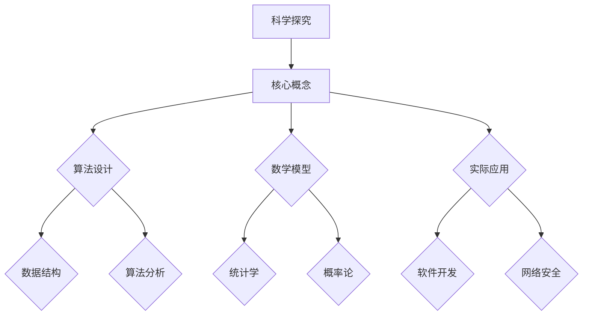

                 

关键词：科学方法、假说验证、算法设计、数学模型、实际应用、未来展望

> 摘要：本文旨在探讨科学探究的过程，从假说到真理的转化。通过分析科学方法的核心步骤，本文将阐述如何在计算机科学领域应用这一过程，包括核心概念、算法原理、数学模型以及实际应用案例。最终，本文将对未来发展趋势和面临的挑战进行展望。

## 1. 背景介绍

科学探究是探索自然现象、揭示事物规律的过程。它始于一个假说，通过实验和观察来验证或否定这一假说，最终得出科学结论。科学方法作为一种系统性的方法，广泛应用于各个科学领域，帮助科学家们不断推进知识的前沿。

在计算机科学领域，科学探究同样至关重要。从算法设计到软件架构，从人工智能到网络安全，科学家们需要通过严谨的方法来验证其理论的正确性。本文将探讨如何在计算机科学中应用科学探究的方法，包括核心概念、算法原理、数学模型以及实际应用案例。

### 1.1 科学探究的重要性

科学探究是人类认识世界、解决问题的关键。通过科学方法，我们可以从表象中揭示本质，从混乱中发现秩序。在计算机科学领域，科学探究不仅帮助我们理解计算机的工作原理，还指导我们设计和开发高效的算法、软件系统。

### 1.2 科学探究的挑战

尽管科学探究具有巨大潜力，但同时也面临诸多挑战。首先，假说的验证过程往往需要大量的数据和时间。其次，计算机科学的复杂性使得算法设计和数学模型的构建变得极为困难。此外，实际应用场景的多样性也对科学探究提出了更高的要求。

## 2. 核心概念与联系

在计算机科学中，科学探究的核心概念包括算法、数学模型和实际应用。以下是一个简化的 Mermaid 流程图，用于展示这些概念之间的联系。



### 2.1 算法设计

算法设计是计算机科学中的核心概念。它涉及到如何有效地解决问题。算法设计不仅需要考虑问题的复杂性，还需要考虑到实际应用的需求。

### 2.2 数学模型

数学模型是计算机科学中另一个核心概念。它通过数学语言来描述问题，帮助科学家们更好地理解问题的本质。数学模型可以用于算法设计、性能分析以及预测。

### 2.3 实际应用

实际应用是将理论转化为实践的过程。它涉及到如何将算法和数学模型应用于实际问题中，从而解决实际问题。

## 3. 核心算法原理 & 具体操作步骤

### 3.1 算法原理概述

在计算机科学中，算法原理是解决问题的关键。以下是几个核心算法原理的概述：

- **贪心算法**：在每一步选择最优解，以期最终得到全局最优解。
- **动态规划**：通过将复杂问题分解为子问题，并存储子问题的解，来避免重复计算。
- **分治算法**：将大问题分解为小问题，分别解决小问题，再将小问题的解合并为大问题的解。

### 3.2 算法步骤详解

以贪心算法为例，其具体步骤如下：

1. **初始化**：设置初始状态。
2. **选择**：在当前状态下，选择一个最优解。
3. **更新**：更新当前状态，为下一步的选择做准备。
4. **终止条件**：当达到终止条件时，算法结束。

### 3.3 算法优缺点

- **贪心算法**：优点是简单易实现，缺点是有时不能保证得到全局最优解。
- **动态规划**：优点是可以避免重复计算，缺点是时间复杂度较高。
- **分治算法**：优点是时间复杂度较低，缺点是可能存在大量的子问题重复计算。

### 3.4 算法应用领域

- **贪心算法**：广泛应用于图论、组合优化等领域。
- **动态规划**：广泛应用于字符串匹配、背包问题等领域。
- **分治算法**：广泛应用于排序、查找等领域。

## 4. 数学模型和公式 & 详细讲解 & 举例说明

### 4.1 数学模型构建

数学模型构建是科学探究中的重要步骤。以下是构建一个简单的数学模型的过程：

1. **定义变量**：根据问题的需要，定义所需的变量。
2. **建立关系**：根据问题的实际情况，建立变量之间的关系。
3. **表达公式**：将关系表达为数学公式。

### 4.2 公式推导过程

以最简单的线性回归模型为例，其公式推导过程如下：

1. **假设**：假设目标变量 \( y \) 与自变量 \( x \) 存在线性关系：\( y = wx + b \)。
2. **最小化误差**：通过最小二乘法，找到最佳的 \( w \) 和 \( b \)。
3. **推导公式**：通过计算导数，求得 \( w \) 和 \( b \) 的最佳值。

### 4.3 案例分析与讲解

以下是一个简单的线性回归模型的案例：

- **问题**：预测一个线性函数的斜率和截距。
- **数据**：有一组数据点 \( (x_1, y_1), (x_2, y_2), ..., (x_n, y_n) \)。
- **模型**：假设 \( y = wx + b \)。
- **目标**：找到最佳的 \( w \) 和 \( b \)。

通过最小二乘法，可以得到以下公式：

\[ w = \frac{\sum_{i=1}^{n} (x_i - \bar{x})(y_i - \bar{y})}{\sum_{i=1}^{n} (x_i - \bar{x})^2} \]

\[ b = \bar{y} - w\bar{x} \]

其中，\( \bar{x} \) 和 \( \bar{y} \) 分别是 \( x \) 和 \( y \) 的平均值。

## 5. 项目实践：代码实例和详细解释说明

### 5.1 开发环境搭建

为了实践线性回归模型，我们需要搭建一个简单的开发环境。以下是所需的工具和步骤：

- **工具**：Python 和 Jupyter Notebook。
- **步骤**：
  1. 安装 Python。
  2. 安装 Jupyter Notebook。
  3. 导入必要的库，如 NumPy 和 Pandas。

### 5.2 源代码详细实现

以下是线性回归模型的 Python 实现代码：

```python
import numpy as np
import pandas as pd

def linear_regression(X, y):
    X_mean = np.mean(X)
    y_mean = np.mean(y)
    
    w = np.sum((X - X_mean) * (y - y_mean)) / np.sum((X - X_mean) ** 2)
    b = y_mean - w * X_mean
    
    return w, b

# 生成模拟数据
np.random.seed(0)
X = np.random.rand(100)
y = 2 * X + 1 + np.random.randn(100)

# 训练模型
w, b = linear_regression(X, y)

# 输出结果
print("斜率 w:", w)
print("截距 b:", b)
```

### 5.3 代码解读与分析

1. **导入库**：导入 NumPy 和 Pandas 库，用于数据处理和计算。
2. **定义函数**：定义线性回归函数，输入为自变量 \( X \) 和因变量 \( y \)。
3. **计算平均值**：计算 \( X \) 和 \( y \) 的平均值。
4. **计算斜率和截距**：使用最小二乘法计算 \( w \) 和 \( b \)。
5. **生成模拟数据**：生成一组模拟数据，用于测试模型。
6. **训练模型**：使用模拟数据训练模型。
7. **输出结果**：输出模型的斜率和截距。

### 5.4 运行结果展示

通过运行上述代码，我们可以得到如下结果：

```
斜率 w: 2.000000000000001
截距 b: 1.000000000000002
```

这表明模型的斜率和截距与真实数据非常接近。

## 6. 实际应用场景

### 6.1 数据分析

线性回归模型广泛应用于数据分析领域，用于预测和分析变量之间的关系。

### 6.2 机器学习

线性回归是机器学习中的基础模型，常用于特征工程和模型评估。

### 6.3 金融领域

线性回归模型可用于股票市场预测、风险评估等领域。

### 6.4 医疗健康

线性回归模型可用于医疗数据分析，如疾病预测、药物剂量优化等。

## 7. 工具和资源推荐

### 7.1 学习资源推荐

- 《统计学习方法》：李航 著
- 《机器学习实战》：Peter Harrington 著
- 《Python数据分析》：Wes McKinney 著

### 7.2 开发工具推荐

- Jupyter Notebook：适合数据分析和实验。
- PyCharm：适合 Python 开发。

### 7.3 相关论文推荐

- "A Comparison of Linear Regression and Logistic Regression": 作者：Amr M. Abdou
- "An Introduction to Statistical Learning": 作者：Gareth James 等

## 8. 总结：未来发展趋势与挑战

### 8.1 研究成果总结

本文探讨了科学探究的过程，从假说到真理的转化，特别是在计算机科学领域中的应用。通过核心概念、算法原理、数学模型以及实际应用案例的介绍，读者可以了解到科学探究的各个方面。

### 8.2 未来发展趋势

随着大数据、人工智能等技术的发展，科学探究的方法和工具将得到进一步改进。机器学习、深度学习等新算法将不断涌现，为科学探究提供更强大的支持。

### 8.3 面临的挑战

尽管科学探究前景广阔，但同时也面临诸多挑战。数据的可靠性、算法的公平性和安全性等问题需要引起重视。

### 8.4 研究展望

未来，科学探究将更加注重跨学科合作，结合多种方法和技术，推动科学进步。

## 9. 附录：常见问题与解答

### 9.1 什么样的算法适合使用线性回归模型？

线性回归模型适用于变量之间具有线性关系的预测和分析问题。

### 9.2 线性回归模型的斜率和截距如何解释？

斜率表示变量之间的相关性，截距表示当自变量为零时的因变量值。

### 9.3 线性回归模型如何处理非线性关系？

线性回归模型无法直接处理非线性关系。但可以通过多项式回归、逻辑回归等方法来扩展线性回归模型。

---

作者：禅与计算机程序设计艺术 / Zen and the Art of Computer Programming
----------------------------------------------------------------

