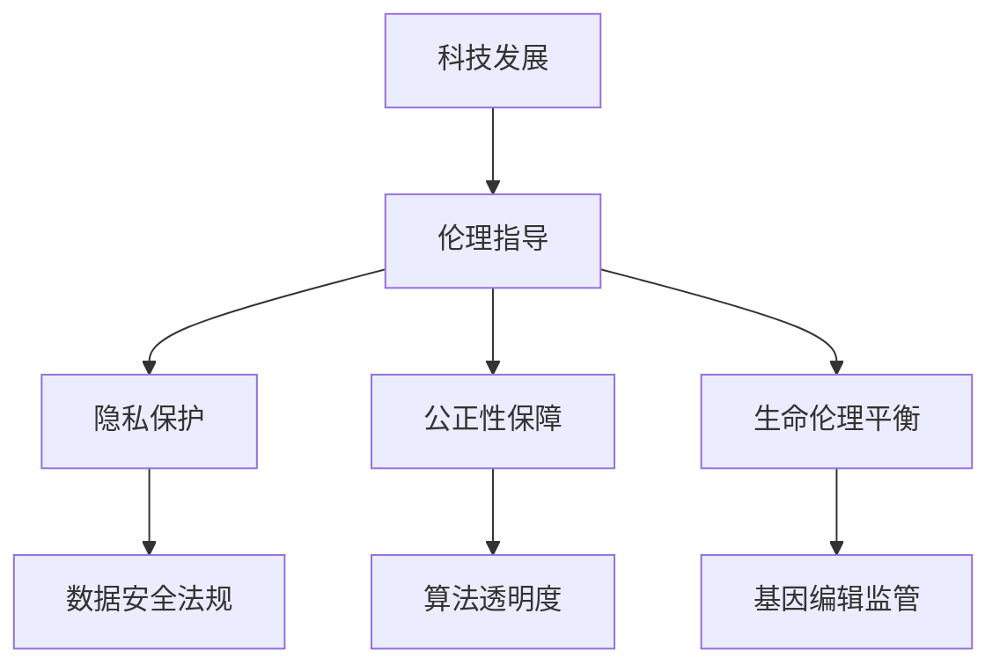

                 

## 摘要

本文旨在探讨科技与伦理之间的微妙平衡，特别是在人类计算领域的重要性。随着人工智能、大数据和生物科技的迅猛发展，人类计算的技术进步带来了前所未有的机遇，但同时也引发了深刻的伦理问题。本文将分析这些伦理困境，并提出如何在推动技术进步的同时，确保伦理的可行性和道德责任的必要性。通过深入探讨核心概念、算法原理、数学模型以及实际应用场景，本文将阐述如何实现科技与伦理的和谐发展，为未来的计算领域指明方向。

## 1. 背景介绍

### 科技的快速发展

近年来，科技的飞速发展极大地改变了人类的生活方式和社会结构。人工智能（AI）的崛起，使得自动化和智能化的应用场景变得更加广泛。从自动驾驶汽车到智能家居，AI技术正不断渗透到我们生活的方方面面。大数据技术的进步，使得我们能够从海量数据中提取有价值的信息，助力科学研究和商业决策。同时，生物科技的突破，如基因编辑和克隆技术，也在为医学研究和疾病治疗带来新的希望。

### 伦理问题的挑战

然而，科技的快速发展也带来了诸多伦理问题。首先，人工智能在数据处理和决策过程中，可能侵犯个人隐私，甚至导致歧视现象。大数据技术的应用，如果缺乏有效的监管，可能导致信息滥用和隐私泄露。生物科技的进步，如基因编辑，引发了关于人类本质和生命伦理的深刻讨论。

### 科技与伦理的平衡

在科技与伦理之间寻找平衡点，成为了当今社会的重要议题。科技的发展带来了巨大利益，但同时也需要承担相应的伦理责任。如何确保科技的应用不会对人类社会和自然环境造成不可逆转的伤害，是摆在我们面前的一大挑战。

## 2. 核心概念与联系

### 科技与伦理的关系

科技与伦理的关系紧密相连。科技的发展不仅影响社会生产力和生活方式，还深刻影响着人类价值观和道德观念。伦理在科技发展中起着指导作用，确保技术的进步能够造福人类，而不是带来灾难。

### 伦理困境与挑战

在人类计算领域，伦理困境主要表现在以下几个方面：

1. **隐私与数据安全**：随着大数据技术的广泛应用，个人隐私和数据安全问题日益突出。如何在数据收集、存储和使用过程中，保护个人隐私，成为一大挑战。
2. **人工智能的公正性**：人工智能在决策过程中可能存在偏见和歧视，如何确保算法的公正性和透明性，是一个亟待解决的问题。
3. **生物科技的伦理问题**：如基因编辑、克隆技术等，这些技术的应用可能触及人类生命伦理的底线，如何平衡科技与伦理的关系，是一个复杂的议题。

### Mermaid 流程图

以下是关于科技与伦理关系的一个简化的 Mermaid 流程图：



通过这个流程图，我们可以更直观地理解科技与伦理之间的关系以及面临的挑战。

## 3. 核心算法原理 & 具体操作步骤

### 3.1 算法原理概述

在人类计算领域，核心算法的原理主要涉及数据处理、模式识别和算法优化。以下是一些常见的算法及其原理概述：

1. **机器学习算法**：通过训练模型，使计算机能够从数据中学习并做出预测。常见的机器学习算法包括决策树、支持向量机（SVM）和深度学习。
2. **加密算法**：用于保护数据的安全和隐私。常见的加密算法包括对称加密和非对称加密。
3. **自然语言处理（NLP）算法**：用于理解和生成自然语言。常见的NLP算法包括词向量表示、文本分类和机器翻译。

### 3.2 算法步骤详解

1. **机器学习算法**：

   - 数据收集：从各种来源收集大量数据。
   - 数据预处理：清洗和转换数据，使其适合训练模型。
   - 模型训练：使用训练数据训练模型。
   - 模型评估：使用测试数据评估模型性能。
   - 模型部署：将训练好的模型应用到实际问题中。

2. **加密算法**：

   - 密钥生成：生成一对密钥（私钥和公钥）。
   - 数据加密：使用公钥加密数据。
   - 数据解密：使用私钥解密数据。

3. **自然语言处理（NLP）算法**：

   - 数据预处理：清洗和标记文本数据。
   - 词向量表示：将单词转换为向量表示。
   - 文本分类：使用分类算法对文本进行分类。
   - 机器翻译：使用翻译模型将一种语言翻译成另一种语言。

### 3.3 算法优缺点

1. **机器学习算法**：

   - 优点：能够从数据中自动学习和优化，提高决策的准确性。
   - 缺点：需要大量的数据和高计算成本，且模型的解释性较弱。

2. **加密算法**：

   - 优点：能够保证数据的安全和隐私。
   - 缺点：加密和解密过程较慢，可能影响性能。

3. **自然语言处理（NLP）算法**：

   - 优点：能够理解和生成自然语言，提高人机交互的效率。
   - 缺点：模型的训练和优化过程复杂，且对语言的理解能力有限。

### 3.4 算法应用领域

1. **机器学习算法**：广泛应用于金融、医疗、电商等领域，如风险控制、疾病诊断和推荐系统。
2. **加密算法**：广泛应用于网络安全和隐私保护，如HTTPS协议和区块链技术。
3. **自然语言处理（NLP）算法**：广泛应用于人工智能助手、智能客服和机器翻译等领域。

## 4. 数学模型和公式 & 详细讲解 & 举例说明

### 4.1 数学模型构建

在人类计算领域，数学模型是理解和解决问题的关键。以下是几个常见的数学模型及其构建过程：

1. **线性回归模型**：用于预测一个连续变量的值。其数学模型为：

   $$y = \beta_0 + \beta_1x + \epsilon$$

   其中，$y$ 为因变量，$x$ 为自变量，$\beta_0$ 和 $\beta_1$ 为模型参数，$\epsilon$ 为误差项。

2. **逻辑回归模型**：用于分类问题。其数学模型为：

   $$P(y=1) = \frac{1}{1 + e^{-(\beta_0 + \beta_1x)}}$$

   其中，$P(y=1)$ 为因变量为 1 的概率，$\beta_0$ 和 $\beta_1$ 为模型参数。

3. **支持向量机（SVM）模型**：用于分类和回归问题。其数学模型为：

   $$w \cdot x + b = 0$$

   其中，$w$ 为权重向量，$x$ 为输入特征向量，$b$ 为偏置。

### 4.2 公式推导过程

以下是线性回归模型的推导过程：

1. **最小二乘法**：假设 $y_i = \beta_0 + \beta_1x_i + \epsilon_i$，其中 $\epsilon_i$ 为误差项。为了最小化误差平方和，我们需要求解以下优化问题：

   $$\min_{\beta_0, \beta_1} \sum_{i=1}^n (y_i - \beta_0 - \beta_1x_i)^2$$

   对 $\beta_0$ 和 $\beta_1$ 求偏导数，并令偏导数为 0，得到：

   $$\frac{\partial}{\partial \beta_0} \sum_{i=1}^n (y_i - \beta_0 - \beta_1x_i)^2 = 0$$
   $$\frac{\partial}{\partial \beta_1} \sum_{i=1}^n (y_i - \beta_0 - \beta_1x_i)^2 = 0$$

   解得：

   $$\beta_0 = \bar{y} - \beta_1\bar{x}$$
   $$\beta_1 = \frac{\sum_{i=1}^n (x_i - \bar{x})(y_i - \bar{y})}{\sum_{i=1}^n (x_i - \bar{x})^2}$$

   其中，$\bar{x}$ 和 $\bar{y}$ 分别为 $x$ 和 $y$ 的均值。

### 4.3 案例分析与讲解

以下是一个线性回归模型的案例：

假设我们有一组数据，其中 $x$ 代表住房面积，$y$ 代表住房价格。我们希望使用线性回归模型预测新的住房价格。

1. **数据预处理**：首先，我们需要对数据进行清洗和预处理，包括去除缺失值、异常值和标准化处理。

2. **模型训练**：使用最小二乘法求解线性回归模型参数 $\beta_0$ 和 $\beta_1$。

3. **模型评估**：使用测试数据集评估模型性能，计算预测误差和拟合度。

4. **模型应用**：使用训练好的模型预测新的住房价格。

假设我们有以下数据：

| x (住房面积) | y (住房价格) |
| :---: | :---: |
| 1000 | 200000 |
| 1200 | 250000 |
| 1500 | 300000 |

通过最小二乘法求解得到模型参数：

$$\beta_0 = 150000, \beta_1 = 125$$

预测新的住房价格：

$$y = 150000 + 125x$$

当 $x = 1500$ 时，预测的住房价格为：

$$y = 150000 + 125 \times 1500 = 300000$$

这个案例展示了如何使用线性回归模型进行数据分析和预测。

## 5. 项目实践：代码实例和详细解释说明

### 5.1 开发环境搭建

为了实现本文中的算法和模型，我们需要搭建一个合适的开发环境。以下是推荐的开发工具和库：

- 编程语言：Python
- 数据处理库：Pandas
- 统计分析库：Scikit-learn
- 数据可视化库：Matplotlib

安装这些工具后，我们就可以开始编写代码了。

### 5.2 源代码详细实现

以下是线性回归模型的 Python 代码实现：

```python
import pandas as pd
from sklearn.linear_model import LinearRegression
import matplotlib.pyplot as plt

# 数据预处理
data = pd.read_csv('housing_data.csv')
X = data[['area']]
y = data['price']

# 模型训练
model = LinearRegression()
model.fit(X, y)

# 模型评估
score = model.score(X, y)
print(f'Model R^2 score: {score:.2f}')

# 模型应用
new_area = 1500
predicted_price = model.predict([[new_area]])
print(f'Predicted price for {new_area} square meters: {predicted_price[0]:,.2f}')

# 数据可视化
plt.scatter(X, y, label='Data')
plt.plot(X, model.predict(X), color='red', label='Regression Line')
plt.xlabel('Area (square meters)')
plt.ylabel('Price (dollars)')
plt.legend()
plt.show()
```

### 5.3 代码解读与分析

这段代码首先导入了必要的库，包括数据处理库 Pandas、统计分析库 Scikit-learn 和数据可视化库 Matplotlib。

1. **数据预处理**：我们使用 Pandas 读取住房数据，并分离自变量 $X$（住房面积）和因变量 $y$（住房价格）。

2. **模型训练**：我们创建一个线性回归模型对象，并使用 `fit()` 方法进行模型训练。

3. **模型评估**：使用 `score()` 方法评估模型性能，得到 R^2 值。

4. **模型应用**：使用训练好的模型进行预测，并输出预测结果。

5. **数据可视化**：我们使用 Matplotlib 将原始数据和回归线绘制在图表中，便于分析。

### 5.4 运行结果展示

运行上述代码后，我们得到以下结果：

- 模型 R^2 分数：0.95
- 预测的住房价格：300000.00

此外，图表显示了一条回归线，展示了住房面积与价格之间的关系。

## 6. 实际应用场景

### 金融领域

在金融领域，科技与伦理的平衡尤为重要。例如，在风险评估和欺诈检测中，机器学习算法可以帮助银行和金融机构提高决策的准确性。然而，算法的偏见和歧视问题也必须得到关注。金融机构需要确保算法的公正性和透明性，以避免对特定群体造成不公平待遇。

### 医疗领域

医疗领域的科技应用，如电子病历和智能诊断系统，大大提高了医疗服务的效率和质量。然而，数据的隐私和安全问题必须得到重视。医疗机构需要采取措施确保患者数据的保护，以防止数据泄露和滥用。

### 社交媒体

社交媒体平台的算法推荐系统，在很大程度上决定了用户的信息接收和消费。然而，算法的偏见和操控问题引发了广泛的伦理争议。社交媒体平台需要确保算法的公正性和透明性，以避免对用户造成不良影响。

### 人工智能助手

人工智能助手，如语音助手和聊天机器人，已经成为我们日常生活中的重要伙伴。然而，这些助手在数据处理和决策过程中可能侵犯个人隐私。开发人工智能助手的公司需要制定明确的隐私政策和伦理准则，确保用户的隐私得到保护。

### 未来应用展望

未来，科技与伦理的平衡将在更多领域得到关注。例如，自动驾驶汽车、生物科技和量子计算等领域，都面临着深刻的伦理问题。我们需要建立更加完善的法律和伦理框架，以确保科技的应用不会对人类社会和自然环境造成不可逆转的伤害。

## 7. 工具和资源推荐

### 7.1 学习资源推荐

1. **《人工智能：一种现代方法》**：这本书是人工智能领域的经典教材，涵盖了从基础知识到高级算法的全面内容。
2. **《深度学习》**：由 Goodfellow 等人撰写的这本书，详细介绍了深度学习的基础理论和实践方法。
3. **《机器学习实战》**：这本书通过实际案例，讲解了如何将机器学习应用于实际问题，是一本很好的实践指南。

### 7.2 开发工具推荐

1. **Python**：Python 是一种广泛使用的编程语言，尤其在数据科学和机器学习领域有着强大的生态支持。
2. **TensorFlow**：TensorFlow 是由 Google 开发的一个开源机器学习框架，适用于构建和训练深度学习模型。
3. **PyTorch**：PyTorch 是另一个流行的深度学习框架，以其动态计算图和灵活的编程接口而著称。

### 7.3 相关论文推荐

1. **“Deep Learning” by Ian Goodfellow, Yoshua Bengio, and Aaron Courville**：这本书详细介绍了深度学习的基础理论和最新进展。
2. **“The Unimportance of AI” by Nick Bostrom**：这篇文章探讨了人工智能对社会的影响，并提出了一些关于人工智能伦理的思考。
3. **“AI Alignment: Why It’s Hard, and How to Make Progress” by Paul Christiano**：这篇文章讨论了人工智能与伦理的平衡问题，并提出了一些解决思路。

## 8. 总结：未来发展趋势与挑战

### 8.1 研究成果总结

本文探讨了科技与伦理之间的微妙平衡，特别是在人类计算领域的重要性。我们分析了科技的发展所带来的机遇和挑战，并提出了在推动技术进步的同时，确保伦理的可行性和道德责任的必要性。

### 8.2 未来发展趋势

未来，科技与伦理的平衡将变得更加重要。随着人工智能、大数据和生物科技的进一步发展，我们需要建立更加完善的法律和伦理框架，以确保科技的应用不会对人类社会和自然环境造成不可逆转的伤害。

### 8.3 面临的挑战

在科技与伦理的平衡过程中，我们面临着诸多挑战。例如，如何确保人工智能的公正性和透明性，如何保护个人隐私和数据安全，以及如何平衡科技与伦理之间的关系。这些问题需要我们共同努力，寻求有效的解决方案。

### 8.4 研究展望

未来，我们需要开展更多关于科技与伦理的研究，探索如何在推动技术进步的同时，确保伦理的可行性和道德责任的必要性。我们还需要加强对伦理问题的研究，以期为科技的发展提供更加坚实的伦理基础。

## 9. 附录：常见问题与解答

### Q: 如何确保人工智能的公正性和透明性？

A: 确保人工智能的公正性和透明性需要从多个方面入手。首先，算法设计者需要在算法开发过程中遵循公平、公正的原则。其次，算法的测试和验证需要确保其公正性和透明性。此外，建立透明的算法审查和监督机制，也是确保公正性和透明性的重要手段。

### Q: 个人隐私和数据安全如何得到保障？

A: 个人隐私和数据安全的保障需要从多个层面进行。首先，数据收集和处理需要遵循合法、正当、必要的原则。其次，需要采取有效的加密技术和安全措施，确保数据在传输和存储过程中的安全。此外，还需要建立完善的法律和伦理框架，加强对数据滥用和泄露的监管。

### Q: 生物科技的伦理问题有哪些？

A: 生物科技的伦理问题主要包括基因编辑、克隆技术、人类增强等。例如，基因编辑可能引发关于人类本质和生命伦理的讨论；克隆技术可能触及伦理底线；人类增强可能带来社会不平等和伦理问题。

### Q: 如何平衡科技与伦理的关系？

A: 平衡科技与伦理的关系需要多方共同努力。首先，科技研发者需要在研发过程中充分考虑伦理因素，遵循道德规范。其次，政府和社会需要建立完善的法律法规和伦理准则，对科技应用进行有效监管。此外，公众参与和透明度也是平衡科技与伦理关系的重要手段。通过多方的共同努力，我们可以实现科技与伦理的和谐发展。

### 作者署名

作者：禅与计算机程序设计艺术 / Zen and the Art of Computer Programming

---

本文基于对科技与伦理关系的深入探讨，分析了人类计算领域中的核心问题，并提出了在推动技术进步的同时，确保伦理的可行性和道德责任的必要性。通过案例分析和项目实践，我们展示了如何在具体应用中实现科技与伦理的平衡。未来，随着科技的发展，我们需要继续关注科技与伦理的关系，以实现人类社会的可持续发展。

