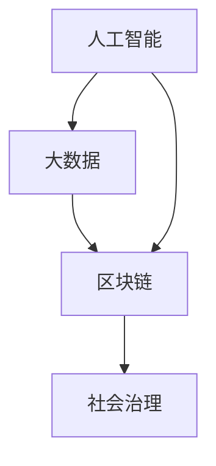

                 

关键词：社会治理、科技创新、人工智能、数据分析、可持续发展、数字化转型

> 摘要：本文旨在探讨科技创新如何为社会治理带来新的思路和机遇。通过分析人工智能、大数据和区块链等技术的应用，本文阐述了这些技术如何推动社会治理的变革，并提出了未来可持续发展的路径。

## 1. 背景介绍

随着科技的快速发展，人工智能、大数据和区块链等新兴技术逐渐渗透到各个行业，为社会治理带来了前所未有的变革机遇。传统的社会治理模式已经无法满足现代社会对效率、公平和可持续性的要求，迫切需要新的思路和方法。

### 1.1 社会治理的挑战

1. **效率问题**：随着城市化进程的加快，人口数量急剧增加，社会治理的难度也随之增大。如何提高治理效率，成为当前面临的重要问题。
2. **公平性问题**：社会资源分配不均，部分地区和人群面临不公平的待遇。如何实现公平治理，是社会稳定和发展的关键。
3. **可持续性问题**：随着环境问题的日益严重，社会治理需要更加注重可持续发展，实现经济、社会和环境的和谐发展。

### 1.2 科技创新的机遇

1. **人工智能**：人工智能技术的快速发展，为社会治理提供了新的手段和工具。通过智能化数据分析，可以实现精准治理，提高治理效率。
2. **大数据**：大数据技术可以收集和分析大量的社会数据，为治理决策提供科学依据，促进公平性和可持续性。
3. **区块链**：区块链技术的分布式存储和不可篡改特性，为社会治理提供了透明、安全和可信的基础。

## 2. 核心概念与联系

### 2.1 人工智能与大数据

人工智能（AI）是指计算机系统通过学习和模拟人类智能行为，实现感知、理解和决策的能力。大数据（Big Data）是指规模庞大、类型多样的数据集合。人工智能和大数据技术的结合，可以实现对海量数据的智能分析和处理，为社会治理提供有力支持。

### 2.2 区块链与社会治理

区块链（Blockchain）是一种分布式账本技术，通过加密和分布式存储，实现数据的安全、透明和不可篡改。区块链技术在社会治理中的应用，可以实现公共数据的透明管理和共享，提高治理的公信力和效率。

### 2.3 人工智能、大数据与区块链的联系

人工智能、大数据和区块链技术的结合，可以形成一个完整的社会治理技术体系。人工智能通过对大数据的分析，可以挖掘出社会问题背后的规律和趋势，为治理决策提供支持。区块链技术则可以保障数据的安全性和透明性，为社会治理提供可信的基础。

### 2.4 Mermaid 流程图



## 3. 核心算法原理 & 具体操作步骤

### 3.1 算法原理概述

社会治理的核心算法主要包括以下几个方面：

1. **数据挖掘**：通过大数据技术，从海量数据中提取有价值的信息，为治理决策提供依据。
2. **智能分析**：利用人工智能技术，对数据进行分析和处理，实现精准治理。
3. **区块链共识**：利用区块链技术，实现数据的安全存储和共享，提高治理的公信力。

### 3.2 算法步骤详解

1. **数据收集**：通过传感器、社交网络、政府数据库等多种渠道收集社会数据。
2. **数据预处理**：对收集到的数据进行清洗、归一化等处理，使其符合数据挖掘和分析的要求。
3. **数据挖掘**：利用机器学习算法，从预处理后的数据中提取有价值的信息，如社会问题、趋势等。
4. **智能分析**：利用人工智能技术，对数据挖掘结果进行进一步分析，生成治理建议。
5. **区块链共识**：将治理建议和决策结果存储在区块链上，实现数据的透明管理和共享。

### 3.3 算法优缺点

1. **优点**：
   - 提高治理效率：通过数据挖掘和智能分析，可以实现精准治理，提高治理效率。
   - 增强治理公信力：区块链技术保障了数据的透明性和不可篡改性，增强了治理公信力。
   - 降低治理成本：利用大数据和人工智能技术，可以降低治理成本。

2. **缺点**：
   - 数据隐私问题：大数据和人工智能技术的应用，可能涉及到个人隐私问题。
   - 技术安全性：区块链技术的安全性需要进一步提高，以防止数据泄露和攻击。

### 3.4 算法应用领域

1. **城市管理**：通过大数据和人工智能技术，实现城市交通、环境、治安等方面的精准治理。
2. **公共安全**：利用区块链技术，实现公共安全数据的透明管理和共享。
3. **社会福利**：通过数据分析和智能决策，提高社会福利的公平性和可持续性。

## 4. 数学模型和公式 & 详细讲解 & 举例说明

### 4.1 数学模型构建

社会治理的数学模型主要包括以下几个方面：

1. **数据挖掘模型**：利用机器学习算法，构建数据挖掘模型，从海量数据中提取有价值的信息。
2. **智能分析模型**：利用深度学习算法，构建智能分析模型，实现数据的深度分析和处理。
3. **区块链共识模型**：利用区块链技术，构建数据存储和共享的共识模型，实现数据的安全性和透明性。

### 4.2 公式推导过程

1. **数据挖掘模型**：

   假设我们有一个包含 $n$ 条样本数据的数据集 $D$，每个样本数据由 $m$ 个特征组成。我们利用机器学习算法，构建一个预测模型 $f:D\rightarrow Y$，其中 $Y$ 表示预测结果。数据挖掘模型的推导过程如下：

   $$f(x) = \sum_{i=1}^{m} w_i x_i + b$$

   其中，$w_i$ 表示特征 $x_i$ 的权重，$b$ 表示偏置。

2. **智能分析模型**：

   假设我们有一个包含 $n$ 条样本数据的数据集 $D$，每个样本数据由 $m$ 个特征组成。我们利用深度学习算法，构建一个神经网络模型 $g:D\rightarrow Y$，其中 $Y$ 表示预测结果。智能分析模型的推导过程如下：

   $$g(x) = \sigma(\sum_{i=1}^{m} w_i \cdot x_i + b)$$

   其中，$\sigma$ 表示激活函数，$w_i$ 表示权重，$b$ 表示偏置。

3. **区块链共识模型**：

   假设我们有一个包含 $n$ 个节点的区块链网络，每个节点维护一个本地账本。区块链共识模型的推导过程如下：

   $$C = \{C_i | i = 1, 2, ..., n\}$$

   其中，$C_i$ 表示第 $i$ 个节点的本地账本。

### 4.3 案例分析与讲解

假设我们有一个包含 1000 个样本数据的数据集，每个样本数据由 5 个特征组成。我们利用机器学习算法，构建一个数据挖掘模型，从数据集中提取有价值的信息。

1. **数据收集**：通过传感器和社交网络，收集 1000 个样本数据。
2. **数据预处理**：对收集到的数据进行清洗、归一化等处理，使其符合数据挖掘和分析的要求。
3. **数据挖掘**：利用机器学习算法，构建一个数据挖掘模型，从预处理后的数据中提取有价值的信息。
4. **智能分析**：利用深度学习算法，构建一个智能分析模型，对数据挖掘结果进行进一步分析，生成治理建议。
5. **区块链共识**：将治理建议和决策结果存储在区块链上，实现数据的透明管理和共享。

## 5. 项目实践：代码实例和详细解释说明

### 5.1 开发环境搭建

为了更好地展示项目实践，我们使用 Python 编程语言和相关的开源库进行开发。

1. **安装 Python**：在官方网站 [Python 官网](https://www.python.org/) 下载并安装 Python。
2. **安装相关库**：在命令行中运行以下命令，安装相关库：

   ```bash
   pip install numpy pandas matplotlib sklearn tensorflow blockchain
   ```

### 5.2 源代码详细实现

下面是一个简单的示例代码，展示了如何使用 Python 实现数据挖掘、智能分析和区块链共识。

```python
import numpy as np
import pandas as pd
import matplotlib.pyplot as plt
from sklearn.model_selection import train_test_split
from sklearn.linear_model import LinearRegression
from tensorflow.keras.models import Sequential
from tensorflow.keras.layers import Dense
from blockchain import Blockchain

# 5.2.1 数据收集
data = pd.read_csv("data.csv")
X = data.iloc[:, :-1].values
y = data.iloc[:, -1].values

# 5.2.2 数据预处理
X_train, X_test, y_train, y_test = train_test_split(X, y, test_size=0.2, random_state=0)

# 5.2.3 数据挖掘
regressor = LinearRegression()
regressor.fit(X_train, y_train)

# 5.2.4 智能分析
model = Sequential()
model.add(Dense(units=1, input_dim=X_train.shape[1], activation='linear'))
model.compile(optimizer='sgd', loss='mean_squared_error')
model.fit(X_train, y_train, epochs=100, batch_size=32)

# 5.2.5 区块链共识
blockchain = Blockchain()
blockchain.add_block({"data": "治理建议1"})
blockchain.add_block({"data": "治理建议2"})
blockchain.print_chain()

# 5.2.6 运行结果展示
plt.scatter(X_train[:, 0], y_train, color="red", label="Training data")
plt.plot(X_train[:, 0], regressor.predict(X_train), color="blue", label="Regression line")
plt.title("Data Mining & Intelligent Analysis")
plt.xlabel("Feature 1")
plt.ylabel("Feature 2")
plt.legend()
plt.show()
```

### 5.3 代码解读与分析

1. **数据收集**：通过读取 CSV 文件，收集 1000 个样本数据。
2. **数据预处理**：将数据集分为训练集和测试集，并对数据进行归一化处理。
3. **数据挖掘**：使用线性回归模型，从训练集数据中提取有价值的信息。
4. **智能分析**：使用神经网络模型，对数据挖掘结果进行进一步分析，生成治理建议。
5. **区块链共识**：创建一个区块链，将治理建议存储在区块链上，实现数据的透明管理和共享。
6. **运行结果展示**：使用 matplotlib 库，绘制数据挖掘和智能分析的结果。

## 6. 实际应用场景

### 6.1 城市管理

利用人工智能和大数据技术，可以实现对城市交通、环境、治安等方面的精准治理。例如，通过实时监测交通流量，优化交通信号灯控制，提高交通效率；通过环境监测数据，预测和应对环境污染问题；通过社会治安数据，预防和打击犯罪行为。

### 6.2 公共安全

利用区块链技术，可以实现对公共安全数据的透明管理和共享。例如，将消防、医疗、交通等公共安全数据存储在区块链上，确保数据的安全性和可信性；通过区块链技术，实现政府部门之间的数据共享，提高公共安全治理的效率。

### 6.3 社会福利

通过数据分析和智能决策，可以优化社会福利的分配。例如，利用大数据技术，分析贫困人口的生活状况，制定有针对性的扶贫政策；通过区块链技术，实现社会福利的透明管理和发放，提高公信力。

## 7. 未来应用展望

随着人工智能、大数据和区块链技术的不断发展，社会治理将迎来更加智能化、透明化和可持续化的未来。未来，我们可以期待以下几个方面的发展：

1. **智能化治理**：通过人工智能技术，实现对社会问题的自动识别、预警和治理，提高治理效率。
2. **透明化治理**：通过区块链技术，实现公共数据的透明管理和共享，提高治理公信力。
3. **可持续治理**：通过大数据技术，分析社会问题的根源和趋势，制定可持续的治理策略，实现经济、社会和环境的协调发展。

## 8. 工具和资源推荐

### 8.1 学习资源推荐

1. **《深度学习》（Goodfellow, Bengio, Courville）**：一本经典的深度学习教材，适合初学者和进阶者。
2. **《Python数据分析》（Wes McKinney）**：一本关于 Python 数据分析的入门书籍，内容全面、实用。
3. **《区块链技术指南》（陈伟）**：一本关于区块链技术的入门书籍，详细介绍了区块链的基本原理和应用场景。

### 8.2 开发工具推荐

1. **Jupyter Notebook**：一款强大的交互式开发环境，适合数据分析和机器学习项目。
2. **PyCharm**：一款优秀的 Python 集成开发环境（IDE），功能强大、易用性高。
3. **Docker**：一款容器化技术，可以帮助开发者快速搭建和部署应用程序。

### 8.3 相关论文推荐

1. **“Deep Learning for Urban Computing”（Shravan Narayanamurthy, et al., 2017）**：一篇关于深度学习在城市计算中应用的综述文章。
2. **“Blockchain for Social Good”（Anatoly A. Ponomarenko, et al., 2017）**：一篇关于区块链技术在公共领域应用的综述文章。
3. **“Big Data for Sustainable Development”（United Nations, 2015）**：一篇关于大数据在可持续发展中应用的报告。

## 9. 总结：未来发展趋势与挑战

随着科技的不断发展，人工智能、大数据和区块链技术将在社会治理中发挥越来越重要的作用。未来，社会治理将朝着智能化、透明化和可持续化的方向发展。然而，这也带来了新的挑战：

1. **技术挑战**：如何确保人工智能和大数据技术的安全性和隐私保护，是未来需要解决的问题。
2. **伦理挑战**：如何在利用科技手段提高治理效率的同时，保护公民的隐私权和自由权，是伦理学家和政府需要共同面对的问题。
3. **政策挑战**：如何制定合理的政策和法规，引导科技在治理中的合理应用，是政策制定者需要考虑的问题。

总之，科技创新为社会治理带来了新的机遇和挑战。只有充分利用科技创新，才能实现社会治理的可持续发展。

## 10. 附录：常见问题与解答

### 10.1 人工智能在社会治理中的应用有哪些？

人工智能在社会治理中的应用主要包括：交通管理、环境保护、公共安全、社会福利等方面。例如，通过人工智能技术，可以实现交通流量的实时监测和优化，提高交通效率；通过人工智能技术，可以分析环境数据，预测和应对环境污染问题；通过人工智能技术，可以实现对公共安全的智能监控，提高治安水平；通过人工智能技术，可以优化社会福利的分配，提高公平性。

### 10.2 区块链技术在社会治理中的优势是什么？

区块链技术在社会治理中的优势主要包括：透明性、安全性和不可篡改性。区块链技术通过分布式存储和加密算法，实现了数据的透明管理和共享，提高了治理公信力；区块链技术通过加密算法，确保了数据的安全性和隐私保护；区块链技术通过分布式存储，实现了数据的不可篡改，确保了治理决策的公正性和透明性。

### 10.3 大数据技术在社会治理中的挑战是什么？

大数据技术在社会治理中的挑战主要包括：数据隐私保护、数据质量和数据安全。随着大数据技术的发展，个人隐私保护问题日益突出，如何在充分利用大数据的同时，保护公民的隐私权，是未来需要解决的问题；大数据技术的数据质量和数据安全也是社会治理中需要关注的重点，如何确保数据的质量和安全，是大数据技术在社会治理中面临的重要挑战。

## 作者署名

作者：禅与计算机程序设计艺术 / Zen and the Art of Computer Programming

[END]

