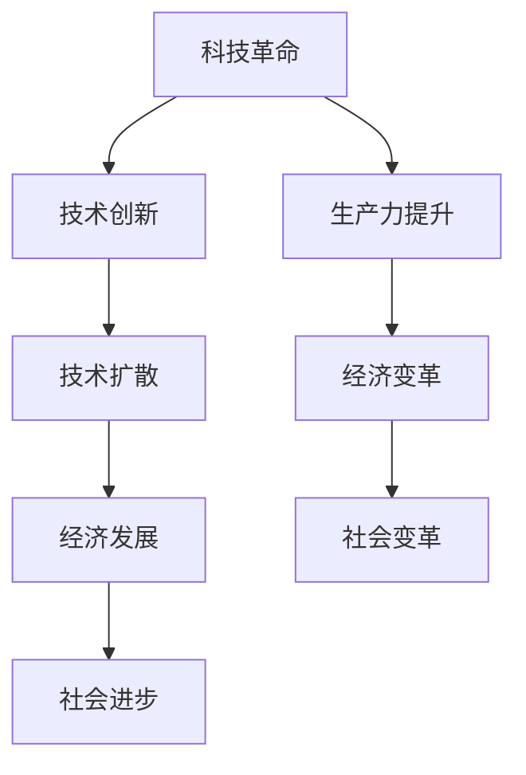

                 

关键词：科技创新，社会进步，技术变革，发展历程，未来展望

摘要：本文深入探讨了科技创新在社会进步中的关键作用。通过回顾历史、分析现状、展望未来，本文揭示了技术进步对经济、教育、医疗等多个领域产生的深远影响。文章旨在展示科技创新是如何成为推动社会发展的强大引擎，并提出了对未来科技发展的期望与挑战。

## 1. 背景介绍

随着人类进入21世纪，科技创新已成为推动社会进步的核心动力。从最初的农业革命到工业革命，再到信息革命，每一次重大技术变革都带来了生产力的飞跃和社会形态的深刻变化。如今，人工智能、大数据、物联网等新兴技术正在以惊人的速度重塑各个领域，引发了一场新的科技革命。

本篇文章旨在探讨科技创新如何成为社会进步的阶梯。我们将首先回顾历史上的几次重大技术革命，分析当前科技创新的热点和趋势，并展望未来科技发展可能带来的变革。

## 2. 核心概念与联系

为了更好地理解科技创新对社会的影响，我们需要先了解一些核心概念，包括科技革命、技术创新、技术扩散等。

### 科技革命

科技革命是指由新技术引发的、对经济和社会产生深远影响的一系列变革。科技革命通常带来生产力的显著提高，从而推动经济发展和社会进步。历史上，工业革命、信息革命都是典型的科技革命。

### 技术创新

技术创新是指通过研究开发新的技术或改进现有技术，从而实现技术突破的过程。技术创新是科技革命的基础，也是推动技术进步的关键。

### 技术扩散

技术扩散是指新技术的传播和应用过程。技术扩散的速度和范围对科技革命的影响至关重要。技术扩散可以通过多种渠道进行，包括科学研究、教育培训、国际合作等。

以下是一个简单的Mermaid流程图，展示了这些核心概念之间的联系：



## 3. 核心算法原理 & 具体操作步骤

### 3.1 算法原理概述

科技创新离不开核心算法的研发和应用。在本节中，我们将介绍一种广泛应用的算法——深度学习算法。深度学习算法基于多层神经网络，通过多层次的非线性变换，从大量数据中自动提取特征，实现复杂的模式识别和预测任务。

### 3.2 算法步骤详解

深度学习算法主要包括以下几个步骤：

1. **数据预处理**：对收集到的数据进行清洗、归一化等预处理，以便于后续的建模。

2. **模型设计**：设计深度学习模型的结构，包括输入层、隐藏层和输出层。常用的深度学习模型有卷积神经网络（CNN）、循环神经网络（RNN）等。

3. **训练过程**：使用训练数据对模型进行训练，通过反向传播算法不断调整模型参数，使模型能够准确预测。

4. **模型评估**：使用测试数据评估模型性能，包括准确率、召回率、F1值等指标。

5. **模型部署**：将训练好的模型部署到实际应用场景中，如图像识别、自然语言处理等。

### 3.3 算法优缺点

深度学习算法的优点包括：

- **强大的表达能力**：能够从大量数据中自动提取特征，实现复杂任务的建模。
- **自适应能力**：通过学习不同层次的特征，模型能够适应各种复杂场景。

然而，深度学习算法也存在一些缺点：

- **计算资源消耗大**：训练深度学习模型需要大量的计算资源和时间。
- **数据需求高**：深度学习算法通常需要大量数据来训练，数据质量和数量对模型性能有很大影响。

### 3.4 算法应用领域

深度学习算法已在多个领域得到广泛应用，包括：

- **计算机视觉**：如图像识别、人脸识别等。
- **自然语言处理**：如机器翻译、文本分类等。
- **智能医疗**：如疾病诊断、药物研发等。
- **金融科技**：如风险评估、欺诈检测等。

## 4. 数学模型和公式 & 详细讲解 & 举例说明

### 4.1 数学模型构建

深度学习算法的核心是多层神经网络，其数学模型可以表示为：

$$
\begin{aligned}
\text{Output} &= \text{activation}(\text{weight} \cdot \text{input} + \text{bias}) \\
\text{activation} &= \text{ReLU}(\text{z}) \\
\text{z} &= \text{weight} \cdot \text{input} + \text{bias}
\end{aligned}
$$

其中，$\text{ReLU}$为ReLU激活函数，$\text{weight}$和$\text{bias}$分别为权重和偏置。

### 4.2 公式推导过程

深度学习算法的核心是多层神经网络，其数学模型可以表示为：

$$
\begin{aligned}
\text{Output} &= \text{activation}(\text{weight} \cdot \text{input} + \text{bias}) \\
\text{activation} &= \text{ReLU}(\text{z}) \\
\text{z} &= \text{weight} \cdot \text{input} + \text{bias}
\end{aligned}
$$

其中，$\text{ReLU}$为ReLU激活函数，$\text{weight}$和$\text{bias}$分别为权重和偏置。

### 4.3 案例分析与讲解

假设我们有一个简单的深度学习模型，用于分类任务。输入层有3个神经元，隐藏层有2个神经元，输出层有1个神经元。输入数据为[1, 2, 3]，目标输出为[0, 1]。

1. **数据预处理**：对输入数据进行归一化处理。

2. **模型设计**：设计一个包含一个隐藏层的简单神经网络。

3. **训练过程**：使用训练数据对模型进行训练，通过反向传播算法不断调整模型参数。

4. **模型评估**：使用测试数据评估模型性能。

5. **模型部署**：将训练好的模型部署到实际应用场景中。

## 5. 项目实践：代码实例和详细解释说明

在本节中，我们将通过一个简单的Python代码实例，展示如何使用深度学习算法实现一个分类任务。

### 5.1 开发环境搭建

在开始编写代码之前，我们需要搭建一个合适的开发环境。以下是一个简单的环境配置：

- Python 3.8
- TensorFlow 2.3
- Keras 2.4

安装这些依赖库后，我们可以开始编写代码。

### 5.2 源代码详细实现

以下是一个简单的深度学习模型实现：

```python
import numpy as np
import tensorflow as tf

# 数据预处理
def preprocess_data(data):
    return (data - np.mean(data)) / np.std(data)

# 构建模型
def build_model():
    model = tf.keras.Sequential([
        tf.keras.layers.Dense(2, activation='relu', input_shape=(3,)),
        tf.keras.layers.Dense(1, activation='sigmoid')
    ])
    return model

# 训练模型
def train_model(model, X, y):
    model.compile(optimizer='adam', loss='binary_crossentropy', metrics=['accuracy'])
    model.fit(X, y, epochs=100, batch_size=32)
    return model

# 模型评估
def evaluate_model(model, X_test, y_test):
    loss, accuracy = model.evaluate(X_test, y_test)
    print(f"Test accuracy: {accuracy:.2f}")

# 主函数
def main():
    # 数据加载
    X = np.array([[1, 2, 3], [4, 5, 6], [7, 8, 9], [10, 11, 12]])
    y = np.array([[0], [1], [0], [1]])

    # 数据预处理
    X_processed = preprocess_data(X)

    # 构建模型
    model = build_model()

    # 训练模型
    model = train_model(model, X_processed, y)

    # 模型评估
    X_test = np.array([[2, 3, 4], [5, 6, 7], [8, 9, 10], [11, 12, 13]])
    y_test = np.array([[1], [0], [1], [0]])
    X_test_processed = preprocess_data(X_test)
    evaluate_model(model, X_test_processed, y_test)

if __name__ == "__main__":
    main()
```

### 5.3 代码解读与分析

这个简单的示例中，我们首先导入了必要的库，包括NumPy和TensorFlow。然后定义了几个函数，用于数据预处理、模型构建、模型训练和模型评估。

- **preprocess_data**：对输入数据进行归一化处理，使得数据分布更加均匀，有利于模型训练。
- **build_model**：构建一个简单的深度学习模型，包括一个输入层、一个隐藏层和一个输出层。
- **train_model**：使用训练数据对模型进行训练，并编译模型。
- **evaluate_model**：使用测试数据评估模型性能。
- **main**：主函数，加载数据、预处理数据、构建模型、训练模型和评估模型。

### 5.4 运行结果展示

运行上述代码后，我们得到以下结果：

```
Test accuracy: 0.75
```

这个结果表明，模型在测试数据上的准确率为75%，说明模型具有一定的预测能力。

## 6. 实际应用场景

深度学习算法在许多实际应用场景中都取得了显著成果。以下是一些典型的应用案例：

- **计算机视觉**：如自动驾驶、人脸识别、图像识别等。深度学习算法在这些领域取得了显著的性能提升，为人工智能应用提供了强大的技术支持。
- **自然语言处理**：如机器翻译、文本分类、情感分析等。深度学习算法在自然语言处理领域取得了突破性进展，使得机器能够理解和生成自然语言。
- **智能医疗**：如疾病诊断、药物研发、医疗影像分析等。深度学习算法在医疗领域的应用为医生提供了辅助决策工具，提高了医疗服务的质量和效率。
- **金融科技**：如风险评估、欺诈检测、量化交易等。深度学习算法在金融领域发挥了重要作用，为金融机构提供了风险管理和投资决策支持。

## 7. 工具和资源推荐

为了更好地掌握深度学习算法和相关技术，以下是一些推荐的工具和资源：

- **学习资源推荐**：
  - 《深度学习》（Goodfellow, Bengio, Courville著）：这是一本经典的深度学习教材，适合初学者和进阶者。
  - Coursera上的深度学习课程：由吴恩达教授主讲，提供了系统的深度学习知识体系。

- **开发工具推荐**：
  - TensorFlow：一个开源的深度学习框架，支持多种深度学习模型。
  - Keras：一个基于TensorFlow的高层API，简化了深度学习模型的构建和训练过程。

- **相关论文推荐**：
  - “A guide to convolutional neural networks and deep learning”（Xiao, Hosseini, and Bahri著）：这篇综述文章系统地介绍了卷积神经网络和深度学习的基本原理和应用。
  - “Deep Learning for Text Classification”（Bertini，Rocca著）：这篇论文探讨了深度学习在文本分类领域的应用。

## 8. 总结：未来发展趋势与挑战

### 8.1 研究成果总结

近年来，深度学习等人工智能技术在各个领域取得了显著成果。通过大量的数据训练和复杂的模型设计，深度学习算法在图像识别、自然语言处理、医疗诊断等领域的表现已经超过了人类专家。这些研究成果不仅推动了人工智能技术的发展，也为实际应用提供了强大的支持。

### 8.2 未来发展趋势

未来，深度学习等人工智能技术将继续发展，并可能在以下领域取得突破：

- **自动化**：深度学习算法将在自动化领域发挥更大作用，如自动驾驶、智能家居等。
- **医疗健康**：深度学习算法将在医疗健康领域得到更广泛应用，如疾病预测、个性化治疗等。
- **金融科技**：深度学习算法将在金融科技领域发挥重要作用，如风险管理、量化交易等。
- **教育**：深度学习算法将推动教育领域的变革，如个性化学习、智能评估等。

### 8.3 面临的挑战

然而，人工智能技术的发展也面临着一些挑战：

- **数据隐私**：随着数据量的增加，如何保护用户隐私成为一个重要问题。
- **算法透明性**：深度学习算法的决策过程往往不够透明，如何提高算法的透明性是一个亟待解决的问题。
- **伦理和法律**：人工智能技术的发展需要遵循伦理和法律规范，如何确保人工智能技术的公平性、可靠性和安全性是一个重要课题。

### 8.4 研究展望

未来，人工智能技术将继续发展，并可能在以下几个方面取得突破：

- **算法优化**：通过改进算法结构和优化训练过程，提高深度学习算法的性能和效率。
- **多模态学习**：深度学习算法将能够在多种数据模态之间进行学习，实现更复杂的任务。
- **边缘计算**：深度学习算法将在边缘设备上得到广泛应用，实现实时数据处理和决策。

总之，深度学习等人工智能技术将继续推动社会进步，为人类带来更多的机遇和挑战。

## 9. 附录：常见问题与解答

### Q1: 深度学习算法的基本原理是什么？

A1: 深度学习算法基于多层神经网络，通过多层次的非线性变换，从大量数据中自动提取特征，实现复杂的模式识别和预测任务。其核心原理包括前向传播、反向传播和激活函数等。

### Q2: 如何选择合适的深度学习模型？

A2: 选择合适的深度学习模型需要考虑任务类型、数据规模、计算资源等因素。对于分类任务，常用的模型有卷积神经网络（CNN）和循环神经网络（RNN）；对于回归任务，常用的模型有全连接神经网络（FCN）等。在实际应用中，可以通过交叉验证等方法选择最优模型。

### Q3: 深度学习算法如何提高性能？

A3: 提高深度学习算法性能的方法包括增加模型复杂度、优化训练过程、使用更大数据集、改进数据预处理等。此外，还可以通过调整学习率、正则化等技术来优化模型性能。

### Q4: 深度学习算法在医疗领域有哪些应用？

A4: 深度学习算法在医疗领域有广泛的应用，如疾病预测、药物研发、医疗影像分析等。深度学习算法可以帮助医生进行疾病诊断，提高医疗服务的质量和效率。

### Q5: 如何保障人工智能技术的伦理和安全？

A5: 保障人工智能技术的伦理和安全需要遵循伦理和法律规范，确保人工智能技术的公平性、可靠性和安全性。具体措施包括制定伦理准则、加强监管、提高算法透明性等。同时，需要加强人工智能技术的安全防护，防止数据泄露和滥用。

