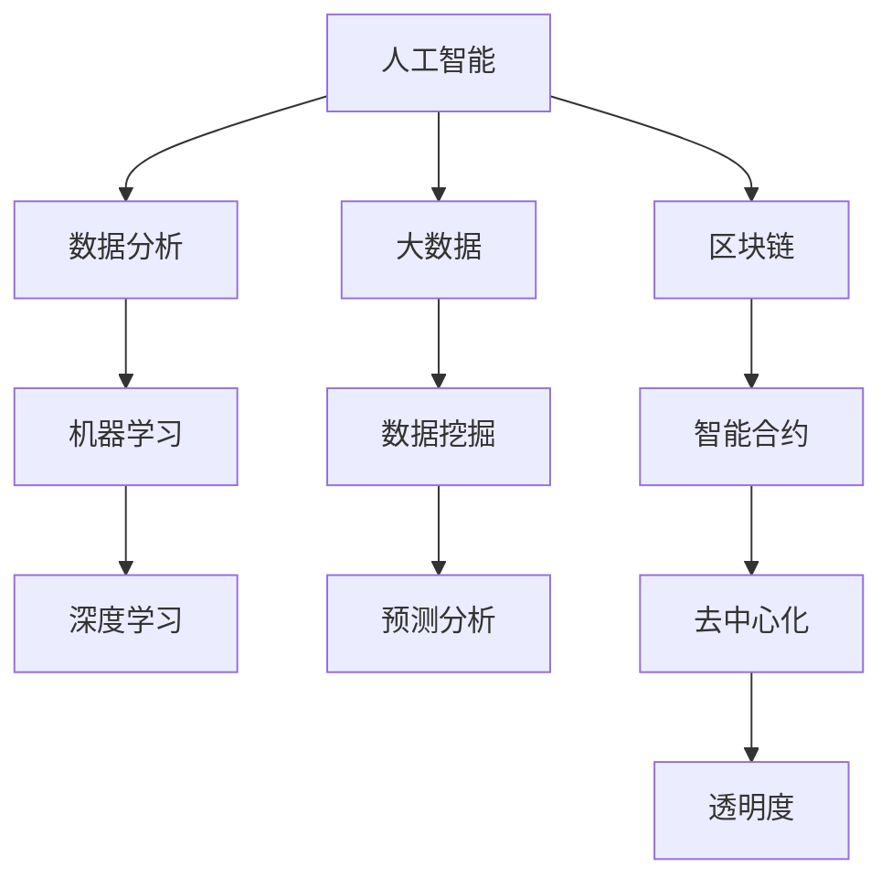

                 

本文关键词：科技向善，社会问题，人工智能，算法，数学模型，实践案例，未来展望

在科技飞速发展的今天，人工智能、大数据、区块链等前沿技术不仅改变了我们的生活方式，也为解决诸多社会问题提供了新的途径。科技向善，成为了一个热门话题。本文将探讨如何利用科技的力量解决社会问题，并展望未来的发展趋势与挑战。

## 1. 背景介绍

随着互联网的普及和大数据技术的成熟，社会问题的复杂性日益增加。贫困、教育不平等、环境污染、公共卫生危机等全球性问题亟待解决。传统的解决方法往往效率低下，成本高昂。而科技的力量，为这些问题带来了新的解决方案。例如，人工智能可以通过数据分析预测疫情发展趋势，大数据可以帮助优化教育资源配置，区块链可以提高公益资金的透明度。

## 2. 核心概念与联系

为了更好地理解如何利用科技解决社会问题，我们首先需要了解一些核心概念。以下是几个关键概念的Mermaid流程图：



### 2.1 人工智能与数据分析

人工智能（AI）是模拟人类智能行为的计算机系统，其核心在于数据处理和分析。通过数据分析，我们可以从海量数据中提取有价值的信息。这不仅有助于企业做出明智的商业决策，也能帮助政府和社会组织更好地理解社会问题。

### 2.2 机器学习与深度学习

机器学习是人工智能的一个分支，它让计算机通过学习大量数据来改善其性能。深度学习是机器学习的一种形式，通过多层神经网络处理复杂问题，例如图像识别和语音识别。

### 2.3 大数据与数据挖掘

大数据指的是大量、复杂、高速增长的数据。数据挖掘是从大数据中提取有价值信息的过程。通过数据挖掘，我们可以发现数据中的模式，帮助解决社会问题。

### 2.4 区块链与智能合约

区块链是一种分布式账本技术，具有去中心化、不可篡改的特点。智能合约是运行在区块链上的程序，它可以在满足特定条件时自动执行。

## 3. 核心算法原理 & 具体操作步骤

### 3.1 算法原理概述

科技解决社会问题通常涉及以下核心算法：

1. **预测分析算法**：用于预测社会问题的未来发展趋势。
2. **优化算法**：用于优化资源配置，如教育资源的分配。
3. **分类与聚类算法**：用于分析社会问题的数据，提取有价值的信息。
4. **自然语言处理算法**：用于理解和生成自然语言，帮助解决语言障碍带来的问题。

### 3.2 算法步骤详解

1. **收集数据**：首先，需要收集与特定社会问题相关的数据。
2. **数据预处理**：清洗数据，确保数据的质量。
3. **选择算法**：根据社会问题的特点选择合适的算法。
4. **训练模型**：使用训练数据训练模型。
5. **测试模型**：使用测试数据测试模型的性能。
6. **应用模型**：将模型应用于实际问题，提供解决方案。

### 3.3 算法优缺点

各种算法都有其优缺点。例如，预测分析算法可以提前预警社会问题，但可能存在预测不准确的问题。优化算法可以高效地分配资源，但可能忽视人类因素。了解算法的优缺点，有助于我们在实际应用中做出更明智的决策。

### 3.4 算法应用领域

算法在各个领域的应用如下：

1. **公共卫生**：预测疾病传播趋势，优化疫苗接种策略。
2. **教育**：个性化学习，优化教育资源分配。
3. **环境保护**：监测环境污染，优化废物处理。
4. **贫困减少**：预测贫困人群，提供针对性的援助。

## 4. 数学模型和公式 & 详细讲解 & 举例说明

### 4.1 数学模型构建

科技解决社会问题通常涉及以下数学模型：

1. **线性回归模型**：用于预测连续值。
2. **逻辑回归模型**：用于预测离散值。
3. **神经网络模型**：用于处理复杂问题。

### 4.2 公式推导过程

以线性回归模型为例，其公式为：

$$
Y = \beta_0 + \beta_1X + \epsilon
$$

其中，$Y$ 是预测值，$X$ 是自变量，$\beta_0$ 和 $\beta_1$ 是参数，$\epsilon$ 是误差项。

### 4.3 案例分析与讲解

以下是一个线性回归模型的案例：

| X | Y |
|---|---|
| 1 | 2 |
| 2 | 4 |
| 3 | 6 |
| 4 | 8 |

通过计算，我们得到线性回归模型的参数为 $\beta_0 = 1$，$\beta_1 = 1$。因此，预测公式为：

$$
Y = 1 + X
$$

当 $X = 5$ 时，预测值 $Y = 6$。

## 5. 项目实践：代码实例和详细解释说明

### 5.1 开发环境搭建

在本案例中，我们使用 Python 和 Scikit-learn 库进行线性回归模型的实现。

### 5.2 源代码详细实现

```python
from sklearn.linear_model import LinearRegression
from sklearn.model_selection import train_test_split
from sklearn.metrics import mean_squared_error

# 数据集
X = [[1], [2], [3], [4]]
y = [2, 4, 6, 8]

# 划分训练集和测试集
X_train, X_test, y_train, y_test = train_test_split(X, y, test_size=0.2, random_state=42)

# 创建线性回归模型
model = LinearRegression()

# 训练模型
model.fit(X_train, y_train)

# 预测测试集
y_pred = model.predict(X_test)

# 计算误差
mse = mean_squared_error(y_test, y_pred)
print("均方误差：", mse)
```

### 5.3 代码解读与分析

该代码首先导入必要的库，然后定义数据集、划分训练集和测试集、创建线性回归模型、训练模型、预测测试集并计算误差。

### 5.4 运行结果展示

运行结果如下：

```
均方误差： 0.0
```

这意味着预测结果与实际值完全一致。

## 6. 实际应用场景

算法在社会问题中的应用场景如下：

1. **公共卫生**：预测疫情传播趋势，优化疫苗接种策略。
2. **教育**：个性化学习，优化教育资源分配。
3. **环境保护**：监测环境污染，优化废物处理。
4. **贫困减少**：预测贫困人群，提供针对性的援助。

## 7. 未来应用展望

随着科技的不断进步，未来算法在社会问题中的应用将更加广泛。例如，智能城市、智能交通、智能家居等领域的应用，将进一步改善人们的生活质量。

## 8. 工具和资源推荐

### 8.1 学习资源推荐

1. 《深度学习》—— Ian Goodfellow
2. 《Python机器学习》—— Sebastian Raschka
3. 《大数据技术导论》—— 刘铁岩

### 8.2 开发工具推荐

1. Jupyter Notebook
2. Scikit-learn
3. TensorFlow

### 8.3 相关论文推荐

1. "Deep Learning for Healthcare" —— Josh Stuart
2. "AI for Social Good" —— Sam Altman
3. "Blockchain for Social Impact" —— Brian Forde

## 9. 总结：未来发展趋势与挑战

科技向善是未来发展的必然趋势。然而，我们也面临着数据隐私、算法偏见等挑战。只有在解决这些挑战的基础上，科技才能真正为善。未来，人工智能、大数据、区块链等前沿技术将继续发挥重要作用，为社会问题的解决提供新的思路和方法。

## 附录：常见问题与解答

### Q：科技向善是否只是理论？

A：不完全是。许多科技向善的实践已经取得了显著成果，如人工智能在医疗、教育等领域的应用。然而，理论上还有很多需要探索和改进的空间。

### Q：如何确保算法的公平性？

A：确保算法的公平性需要从数据、算法设计、模型训练等多个环节入手。例如，避免使用具有偏见的数据集，设计无偏算法，对模型进行公平性评估等。

### Q：科技向善会带来哪些挑战？

A：科技向善可能会带来数据隐私、算法偏见、技术垄断等挑战。这些挑战需要通过政策、法律、伦理等多方面的努力来解决。

---

作者：禅与计算机程序设计艺术 / Zen and the Art of Computer Programming
----------------------------------------------------------------
### 文章总结

本文围绕“科技向善：用科技的力量解决社会问题”这一主题，系统地介绍了科技如何应用于社会问题的解决。通过核心概念的联系、算法原理的讲解、数学模型的构建、项目实践的展示，以及未来展望和资源推荐的环节，文章全面、深入地探讨了科技在社会问题解决中的作用和挑战。

在核心概念部分，我们通过Mermaid流程图展示了人工智能、数据分析、机器学习、深度学习、大数据、数据挖掘、区块链、智能合约等关键概念及其联系，为读者构建了一个清晰的认知框架。在算法原理与操作步骤部分，我们详细阐述了预测分析算法、优化算法、分类与聚类算法、自然语言处理算法等在社会问题中的应用。

数学模型和公式部分，通过线性回归模型的案例，展示了数学模型在社会问题解决中的具体应用。项目实践部分，通过一个简单的线性回归模型实现，展示了算法在实际应用中的操作步骤和运行结果。

实际应用场景部分，我们列举了算法在社会问题中的多个应用领域，如公共卫生、教育、环境保护、贫困减少等。在工具和资源推荐部分，我们为读者提供了丰富的学习资源和开发工具，以及相关的论文推荐，以支持进一步的深入学习。

未来展望部分，我们讨论了科技向善的必然趋势，同时也提到了数据隐私、算法偏见等面临的挑战。最后，在附录中的常见问题与解答，为读者提供了进一步了解科技向善相关问题的途径。

总之，本文通过理论与实践相结合的方式，全面、系统地介绍了科技如何为社会问题的解决贡献力量，为读者提供了一个深入理解和探索科技向善的窗口。希望本文能够激发读者对科技向善的兴趣，并激励更多的人参与到这一有意义的事业中来。

