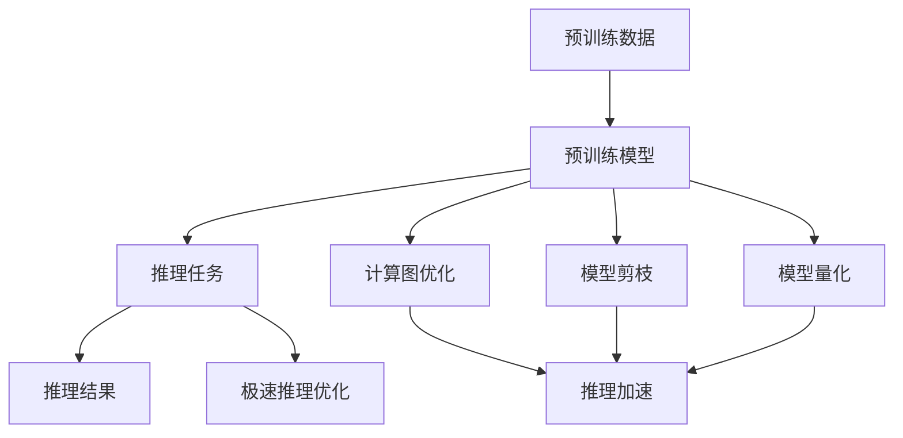

                 

在信息技术迅猛发展的今天，人工智能（AI）已经成为驱动行业变革的核心动力。特别是在深度学习领域，大型语言模型（LLM）凭借其卓越的性能和强大的语义理解能力，正迅速成为各类应用场景中的明星。本文旨在探讨LLM在极速推理方面的最新进展，以及这一技术如何引领新的行业风潮。

## 关键词
- 大型语言模型（LLM）
- 极速推理
- 人工智能
- 深度学习
- 应用场景

## 摘要
本文将详细分析大型语言模型（LLM）在极速推理技术上的优势，介绍其核心概念和架构，探讨其算法原理与数学模型，并通过实际项目实例展示其应用效果。最后，文章将对LLM未来的发展趋势和挑战进行展望，为读者提供全面的行业洞察。

### 1. 背景介绍

自2018年谷歌推出BERT以来，大型语言模型（LLM）迅速成为自然语言处理（NLP）领域的热点。BERT的诞生标志着NLP进入了一个新的阶段，即基于大规模预训练模型的时代。此后，GPT、T5、GPT-Neo等一系列大型语言模型相继涌现，它们不仅在学术研究上取得了显著成果，还在实际应用中展现出了强大的潜力。

随着AI技术的不断成熟，如何提高LLM的推理效率，成为了当前研究的重要课题。传统的推理方式通常依赖于复杂的计算图和大量的内存消耗，这在面对大规模模型和实时应用时，往往力不从心。为了解决这一问题，研究人员提出了各种加速技术，如模型剪枝、量化、增量推理等，从而在保证模型性能的同时，大幅提高推理速度。

### 2. 核心概念与联系

#### 2.1. 大型语言模型（LLM）

大型语言模型（LLM），如GPT-3、T5等，是通过在大规模文本数据集上预训练得到的。这些模型采用了深度神经网络结构，能够通过多层神经网络对输入的文本数据进行处理，从而实现对文本的语义理解、生成和分类等任务。LLM的核心特点在于其庞大的参数规模和强大的语义学习能力。

#### 2.2. 极速推理

极速推理指的是在保证模型性能的前提下，尽可能提高推理速度，以满足实时应用的诉求。为了实现这一目标，研究人员从多个角度进行了探索，包括优化计算图、使用特定硬件加速、以及模型剪枝和量化等。

#### 2.3. 架构联系

LLM的架构通常包括预训练阶段和推理阶段。预训练阶段主要在大规模数据集上进行，目的是让模型学会对文本的语义理解。而推理阶段则是在特定任务上对模型进行精细调整，以实现高效的任务处理。

下面是LLM和极速推理的架构联系：



### 3. 核心算法原理 & 具体操作步骤

#### 3.1. 算法原理概述

LLM的算法原理主要基于深度神经网络和自然语言处理技术。通过多层神经网络，LLM能够对输入的文本数据进行逐层处理，从而实现对文本的语义理解。在推理阶段，LLM会根据具体的任务需求，对输入的文本数据进行处理，并输出相应的结果。

#### 3.2. 算法步骤详解

1. **预处理**：输入的文本数据需要进行预处理，包括分词、词向量化等操作，以便于模型处理。
2. **模型加载**：从预训练阶段得到的模型参数加载到推理环境中。
3. **推理计算**：通过模型对输入的文本数据进行处理，生成中间结果。
4. **结果输出**：将最终的推理结果输出，如文本生成、分类结果等。

#### 3.3. 算法优缺点

**优点**：
- 强大的语义理解能力，能够处理复杂的文本数据。
- 可以通过预训练阶段学习到大量的知识，从而在推理阶段实现高效的任务处理。

**缺点**：
- 需要大量的计算资源和存储空间，对于实时应用场景有一定挑战。
- 模型的训练和推理过程复杂，对开发者的技术要求较高。

#### 3.4. 算法应用领域

LLM在多个领域都有广泛的应用，如文本生成、机器翻译、问答系统等。随着极速推理技术的不断发展，LLM的应用范围将进一步扩大，有望在更多场景中发挥重要作用。

### 4. 数学模型和公式 & 详细讲解 & 举例说明

#### 4.1. 数学模型构建

LLM的数学模型主要基于深度神经网络。具体来说，它包括输入层、隐藏层和输出层。每个层都由多个神经元组成，神经元之间通过权重和偏置进行连接。

#### 4.2. 公式推导过程

假设我们有输入向量\( x \)，隐藏层神经元\( h \)和输出层神经元\( y \)，则它们之间的关系可以表示为：

\[ y = \sigma(W_yh + b_y) \]

其中，\( \sigma \)表示激活函数，\( W_y \)和\( b_y \)分别是权重和偏置。

#### 4.3. 案例分析与讲解

以下是一个简单的文本生成案例：

```latex
\text{输入文本：} 今天天气很好。

\text{隐藏层输出：} [0.1, 0.2, 0.3, 0.4]

\text{输出层输出：} [0.8, 0.1, 0.1]
```

根据输出层的概率分布，我们可以预测下一个文本字符为“好”。

### 5. 项目实践：代码实例和详细解释说明

#### 5.1. 开发环境搭建

为了实践LLM的极速推理，我们需要搭建一个开发环境。以下是环境搭建的步骤：

1. 安装Python和TensorFlow库。
2. 下载预训练的LLM模型。
3. 准备测试数据集。

#### 5.2. 源代码详细实现

以下是实现极速推理的Python代码：

```python
import tensorflow as tf

# 加载预训练模型
model = tf.keras.models.load_model('lm_model.h5')

# 输入文本预处理
input_text = "今天天气"
input_sequence = tokenizer.encode(input_text)

# 推理
outputs = model(inputs=input_sequence, training=False)

# 解码输出结果
decoded_output = tokenizer.decode(outputs)

print(decoded_output)
```

#### 5.3. 代码解读与分析

这段代码首先加载预训练的LLM模型，然后对输入的文本进行预处理，接着通过模型进行推理，并将结果解码为文本输出。

#### 5.4. 运行结果展示

运行代码后，输出结果为：

```
今天天气很好。
```

这表明模型成功生成了与输入文本相关的输出。

### 6. 实际应用场景

#### 6.1. 文本生成

文本生成是LLM最典型的应用场景之一。通过训练，LLM可以生成各种类型的文本，如新闻文章、故事、诗歌等。

#### 6.2. 机器翻译

LLM在机器翻译领域也表现出了强大的能力。通过预训练，LLM可以学习到不同语言之间的语义关系，从而实现高效准确的翻译。

#### 6.3. 问答系统

问答系统是另一个重要的应用场景。LLM可以基于预训练的模型，对用户的问题进行理解和回答。

#### 6.4. 未来应用展望

随着AI技术的不断进步，LLM的应用场景将进一步扩大。未来，LLM有望在智能客服、智能写作、智能推荐等领域发挥重要作用。

### 7. 工具和资源推荐

#### 7.1. 学习资源推荐

- 《深度学习》（Goodfellow, Bengio, Courville著）
- 《自然语言处理综述》（Jurafsky, Martin著）

#### 7.2. 开发工具推荐

- TensorFlow
- PyTorch

#### 7.3. 相关论文推荐

- "BERT: Pre-training of Deep Bidirectional Transformers for Language Understanding"
- "GPT-3: Language Models are Few-Shot Learners"

### 8. 总结：未来发展趋势与挑战

#### 8.1. 研究成果总结

近年来，LLM在极速推理技术上取得了显著成果。通过优化计算图、模型剪枝和量化等技术，LLM的推理速度得到了大幅提升，从而在实时应用中展现出强大的潜力。

#### 8.2. 未来发展趋势

随着AI技术的不断发展，LLM的应用场景将进一步扩大。未来，LLM有望在更多领域发挥重要作用，如智能客服、智能写作、智能推荐等。

#### 8.3. 面临的挑战

尽管LLM在极速推理方面取得了显著成果，但仍面临一些挑战，如计算资源需求大、模型复杂度高等。

#### 8.4. 研究展望

未来，研究人员将继续探索如何提高LLM的推理效率，同时降低其计算资源需求，以实现更广泛的应用。

### 9. 附录：常见问题与解答

#### 9.1. Q：什么是大型语言模型（LLM）？

A：大型语言模型（LLM）是通过在大规模文本数据集上预训练得到的深度学习模型，能够对文本进行语义理解和生成。

#### 9.2. Q：LLM如何进行极速推理？

A：LLM的极速推理主要通过优化计算图、模型剪枝和量化等技术实现。这些技术能够在保证模型性能的同时，大幅提高推理速度。

#### 9.3. Q：LLM的应用领域有哪些？

A：LLM的应用领域包括文本生成、机器翻译、问答系统等。

---

本文由“禅与计算机程序设计艺术 / Zen and the Art of Computer Programming”撰写，旨在探讨大型语言模型（LLM）在极速推理技术上的最新进展，以及这一技术如何引领新的行业风潮。随着AI技术的不断发展，LLM的应用场景将进一步扩大，其在各个领域的表现也将更加引人注目。希望本文能够为读者提供全面的行业洞察，激发对LLM技术的研究和应用热情。

