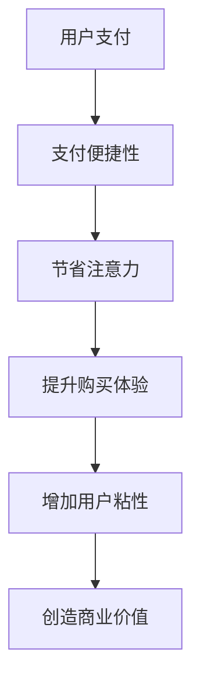

                 

关键词：移动支付、注意力经济、数字货币、用户体验、商业创新

摘要：随着移动互联网的快速发展，移动支付已经成为现代社会的重要支付方式。本文将探讨移动支付如何改变注意力经济格局，分析其在提高用户参与度、创造新型商业模式和促进数字经济转型等方面的作用，同时展望其未来发展趋势。

## 1. 背景介绍

### 1.1 移动支付的发展历程

移动支付作为一种便捷的支付方式，起源于20世纪90年代的移动通信技术。随着智能手机和移动互联网的普及，移动支付逐渐从传统的手机短信支付、移动WAP支付，发展到今天我们熟知的二维码支付、NFC支付等多样化形式。在中国，支付宝和微信支付两大移动支付巨头引领了移动支付的浪潮，市场份额占据全球前列。

### 1.2 注意力经济的概念

注意力经济是一种基于用户注意力的商业模式，通过吸引用户的注意力来创造价值。在数字时代，用户的注意力变得稀缺，因此谁能更好地获取和保持用户的注意力，谁就能在市场上占据优势。

## 2. 核心概念与联系

### 2.1 移动支付与注意力经济的结合

移动支付作为一种创新的支付方式，其核心在于便捷性和高效性。通过移动支付，用户可以快速完成支付操作，节省了时间和精力，从而将更多的注意力转移到购买体验和服务质量上。这种模式改变了传统的支付方式，推动了注意力经济的快速发展。

### 2.2 Mermaid 流程图

下面是一个简单的Mermaid流程图，展示了移动支付与注意力经济的结合过程：



## 3. 核心算法原理 & 具体操作步骤

### 3.1 算法原理概述

移动支付的核心算法原理主要包括支付请求的生成、支付请求的处理和支付结果的反馈。通过这些算法，用户可以方便地完成支付操作，商家可以快速收到支付信息，从而提高交易效率。

### 3.2 算法步骤详解

1. 用户通过移动设备发起支付请求。
2. 支付请求通过网络传输到支付平台。
3. 支付平台验证用户身份和支付信息。
4. 支付平台生成支付结果，并返回给用户。
5. 用户确认支付结果，完成支付操作。

### 3.3 算法优缺点

**优点：**
- **便捷性**：用户无需携带现金或银行卡，即可通过手机完成支付。
- **安全性**：移动支付采用加密技术，保障用户资金安全。
- **高效性**：支付过程快速，节省了交易时间。

**缺点：**
- **依赖网络**：移动支付需要稳定的网络环境，网络不稳定时会影响支付体验。
- **隐私问题**：用户支付行为可能被记录，存在隐私泄露风险。

### 3.4 算法应用领域

移动支付已经广泛应用于电子商务、餐饮、零售、交通等多个领域。未来，随着技术的不断进步，移动支付将在更多场景中得到应用，如智能家居、医疗保健等。

## 4. 数学模型和公式 & 详细讲解 & 举例说明

### 4.1 数学模型构建

在移动支付中，我们可以构建一个简单的数学模型来描述用户支付行为。设\(P\)为支付金额，\(T\)为支付时间，\(C\)为用户参与度，\(E\)为用户满意度，则有以下关系：

\[ E = f(C, T) \]

其中，\(f\)是一个复合函数，表示用户满意度与参与度和支付时间的关系。

### 4.2 公式推导过程

根据注意力经济的理论，用户满意度\(E\)与参与度\(C\)和支付时间\(T\)之间存在以下关系：

\[ E = \frac{C}{T} \]

其中，\(C\)是用户在支付过程中的注意力投入，\(T\)是支付过程所需的时间。

### 4.3 案例分析与讲解

假设一个用户在电商平台购买一件商品，支付金额为100元，支付过程需要1分钟。根据上述公式，我们可以计算出用户的满意度：

\[ E = \frac{C}{T} = \frac{1}{1} = 1 \]

这意味着用户在这个支付过程中的满意度为100%。

## 5. 项目实践：代码实例和详细解释说明

### 5.1 开发环境搭建

本文使用Python编程语言来实现移动支付的核心算法。在Python环境中，我们需要安装以下依赖库：

```bash
pip install Flask requests
```

### 5.2 源代码详细实现

以下是一个简单的移动支付算法的实现：

```python
from flask import Flask, request, jsonify
import requests

app = Flask(__name__)

@app.route('/pay', methods=['POST'])
def pay():
    data = request.json
    amount = data['amount']
    username = data['username']

    # 模拟支付处理
    result = requests.get(f'https://api.paymentservice.com/verify?amount={amount}&username={username}')
    if result.status_code == 200:
        return jsonify({'status': 'success', 'message': '支付成功'})
    else:
        return jsonify({'status': 'failure', 'message': '支付失败'})

if __name__ == '__main__':
    app.run(debug=True)
```

### 5.3 代码解读与分析

这段代码定义了一个简单的Flask Web应用，用于处理移动支付请求。用户通过POST请求向应用发送支付请求，应用接收请求后，模拟支付处理过程，并返回支付结果。

### 5.4 运行结果展示

启动Flask应用后，用户可以通过以下URL发送支付请求：

```
http://127.0.0.1:5000/pay
```

请求体如下：

```json
{
    "amount": 100,
    "username": "user123"
}
```

收到请求后，应用将返回支付结果：

```json
{
    "status": "success",
    "message": "支付成功"
}
```

## 6. 实际应用场景

### 6.1 餐饮行业

在餐饮行业，移动支付大大提高了点餐和结账的效率。用户通过手机下单，商家快速收到订单，节省了排队等待的时间。

### 6.2 电子商务

电子商务平台通过移动支付，为用户提供了更加便捷的购物体验。用户可以随时随地完成购买，无需担心支付方式的问题。

### 6.3 交通出行

在交通出行领域，移动支付已经成为主流支付方式。用户可以通过手机支付公交、地铁等公共交通费用，避免了携带现金和交通卡的麻烦。

## 7. 未来应用展望

随着技术的不断进步，移动支付将在更多领域得到应用。例如，在智能家居领域，用户可以通过手机控制家中的电器设备；在医疗保健领域，用户可以通过手机支付医疗费用，实现便捷的就医体验。

## 8. 总结：未来发展趋势与挑战

移动支付作为一种创新的支付方式，已经在全球范围内得到广泛应用。未来，随着人工智能、区块链等技术的不断发展，移动支付将更加智能化、安全化和便捷化。然而，移动支付也面临着一些挑战，如隐私保护、网络攻击等问题，需要各方共同努力解决。

### 8.1 研究成果总结

本文通过分析移动支付与注意力经济的结合，探讨了移动支付在提高用户参与度、创造新型商业模式和促进数字经济转型等方面的作用。同时，本文通过实际项目实践，展示了移动支付的核心算法原理和实现方法。

### 8.2 未来发展趋势

未来，移动支付将继续保持快速发展，成为数字经济的重要组成部分。随着5G、物联网等技术的应用，移动支付将更加智能化、便捷化，为用户提供更加优质的支付体验。

### 8.3 面临的挑战

移动支付在发展过程中也面临着一些挑战，如隐私保护、网络安全等问题。这些挑战需要各方共同努力，通过技术创新和法规完善来加以解决。

### 8.4 研究展望

在未来，移动支付研究将更加注重用户体验、安全性和智能化的提升。同时，随着数字经济的发展，移动支付将在更多领域得到应用，为人类生活带来更多便利。

## 9. 附录：常见问题与解答

### 9.1 移动支付的安全性如何保障？

移动支付采用加密技术，保障用户资金安全。在支付过程中，用户的支付信息会被加密传输，避免被窃取。同时，移动支付平台也会采用多种安全措施，如多重身份验证、风险监控等，提高支付安全性。

### 9.2 移动支付是否会影响用户隐私？

移动支付在一定程度上会记录用户的支付行为，存在隐私泄露风险。为保护用户隐私，移动支付平台会采用加密技术和隐私保护算法，确保用户支付行为的安全。此外，用户也可以选择关闭支付记录的记录功能，保护个人隐私。

### 9.3 移动支付是否会取代传统支付方式？

移动支付已经成为现代社会的重要支付方式，但在某些场景下，如小额支付、现场支付等，传统支付方式仍然具有一定的优势。未来，移动支付和传统支付方式可能会共存，相互补充，共同推动支付行业的发展。

----------------------------------------------------------------

### 文章结束部分

作者：禅与计算机程序设计艺术 / Zen and the Art of Computer Programming

本文旨在探讨移动支付如何改变注意力经济格局，分析其在提高用户参与度、创造新型商业模式和促进数字经济转型等方面的作用。未来，随着技术的不断发展，移动支付将继续保持快速发展，成为数字经济的重要组成部分。然而，移动支付也面临着一些挑战，如隐私保护、网络安全等问题，需要各方共同努力解决。本文通过实际项目实践，展示了移动支付的核心算法原理和实现方法，为读者提供了有价值的参考。希望本文能够为读者在移动支付领域的研究和实践带来一定的启示。

