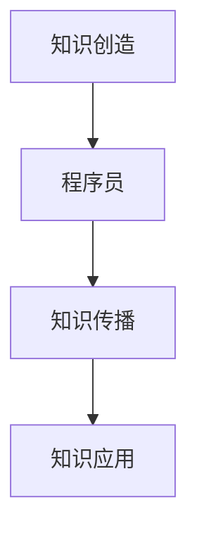

                 

关键词：知识经济、程序员角色、技术变革、职业发展、数字化转型

摘要：随着知识经济的迅猛发展，程序员的职业角色正在发生深刻的变化。本文旨在探讨程序员在知识经济时代的角色重塑，分析技术变革对程序员职业技能的要求，以及如何在数字化转型中把握机遇，实现个人职业发展的新飞跃。

## 1. 背景介绍

知识经济是一种以知识和信息为核心生产要素的经济形态，与传统的以物质资源和劳动力资源为基础的经济模式有本质区别。随着信息技术的飞速发展，知识经济在全球范围内逐渐成为主导经济形式。在这一背景下，程序员作为信息技术领域的重要从业者，其职业角色和职能正面临前所未有的变革。

### 1.1 知识经济的特征

- **信息资源的重要性**：知识经济强调信息资源的有效利用，信息成为企业竞争的核心资源。
- **技术创新的驱动力**：技术创新是推动知识经济发展的重要引擎，新技术的不断涌现要求程序员不断学习新技术。
- **全球化的发展趋势**：知识经济使得全球范围内的信息交流和资源流动变得更加便捷，程序员在全球化的环境中扮演着重要角色。
- **高知识含量的产业链**：知识经济产业链高度依赖知识和技能，程序员在这一产业链中处于关键位置。

### 1.2 程序员职业角色的变化

在知识经济时代，程序员的职业角色发生了显著变化，主要体现在以下几个方面：

- **技术广度的扩展**：程序员需要掌握更多的技术领域，包括前端开发、后端开发、大数据处理、人工智能等。
- **跨领域的合作**：程序员需要与产品经理、设计师、数据分析师等不同角色密切合作，推动项目的顺利进行。
- **持续的学习能力**：知识经济要求程序员具备持续学习的能力，以适应快速变化的技术环境。
- **业务价值的体现**：程序员不再仅仅是一个技术工作者，他们需要深入了解业务需求，将技术应用到解决实际问题中。

## 2. 核心概念与联系

### 2.1 知识经济的核心概念

知识经济以知识为核心，知识的生产、传播、应用是知识经济的关键环节。以下是知识经济中几个重要的核心概念：

- **知识创造**：通过科学研究、技术创新等方式创造新的知识。
- **知识传播**：通过各种媒介和渠道，将知识传播到更广泛的受众。
- **知识应用**：将知识应用于生产、管理、服务等实际领域，实现知识的价值。

### 2.2 程序员的角色与知识经济的联系

程序员在知识经济中的角色至关重要，他们是知识创造和传播的实践者，同时也是知识应用的重要执行者。以下是一个简化的 Mermaid 流程图，展示了程序员与知识经济各环节的关联：



### 2.3 知识经济对程序员角色的重塑

知识经济对程序员角色的重塑体现在以下几个方面：

- **技术深度与广度的提升**：程序员需要掌握更多的技术，不仅限于编程语言，还需要了解算法、数据结构、计算机网络等基础知识。
- **业务理解的增强**：程序员需要更深入地了解业务需求，能够与业务团队进行有效沟通，提供技术解决方案。
- **团队合作能力的提升**：程序员需要具备良好的团队合作能力，与不同角色紧密协作，共同推进项目的进展。

## 3. 核心算法原理 & 具体操作步骤

### 3.1 算法原理概述

在知识经济时代，算法成为解决复杂问题的重要工具。以下是一个核心算法的原理概述：

**算法名称**：深度学习

**原理概述**：深度学习是一种基于多层神经网络的人工智能技术，通过模拟人脑的神经网络结构，实现对复杂数据的处理和模式识别。

### 3.2 算法步骤详解

深度学习算法的步骤通常包括以下几个阶段：

1. **数据预处理**：对数据进行清洗、归一化等处理，为模型训练做好准备。
2. **模型构建**：构建神经网络模型，包括选择合适的网络结构、激活函数、损失函数等。
3. **模型训练**：通过大量数据进行模型训练，不断调整模型参数，使得模型能够更好地拟合训练数据。
4. **模型评估**：使用测试数据对模型进行评估，判断模型性能是否满足预期。
5. **模型部署**：将训练好的模型部署到实际应用场景中，进行问题求解。

### 3.3 算法优缺点

**优点**：

- **强大的模式识别能力**：深度学习能够处理大量的数据，并从中提取出有用的特征，具有强大的模式识别能力。
- **自动特征学习**：深度学习模型能够自动学习数据中的特征，减少人工特征工程的工作量。
- **广泛的应用领域**：深度学习在图像识别、语音识别、自然语言处理等领域取得了显著的应用成果。

**缺点**：

- **计算资源需求大**：深度学习模型的训练需要大量的计算资源，对硬件设施要求较高。
- **数据依赖性强**：深度学习模型的性能高度依赖于训练数据的质量，数据不足或数据质量问题可能导致模型效果不佳。
- **黑箱特性**：深度学习模型的工作原理较为复杂，对于非专业人士来说，理解模型的决策过程较为困难。

### 3.4 算法应用领域

深度学习算法在各个领域都有广泛的应用：

- **计算机视觉**：图像识别、目标检测、图像生成等。
- **自然语言处理**：语言模型、机器翻译、情感分析等。
- **语音识别**：语音识别、语音合成等。
- **推荐系统**：商品推荐、内容推荐等。

## 4. 数学模型和公式 & 详细讲解 & 举例说明

### 4.1 数学模型构建

在深度学习算法中，常用的数学模型是多层感知机（MLP），其数学模型如下：

$$
Z_i = \sigma(W_1 \cdot X + b_1)
$$

$$
Y = W_2 \cdot Z + b_2
$$

其中，$Z_i$ 表示输入层到隐含层的激活值，$Y$ 表示隐含层到输出层的激活值；$\sigma$ 表示激活函数，$W_1$ 和 $W_2$ 分别表示输入层到隐含层和隐含层到输出层的权重矩阵；$b_1$ 和 $b_2$ 分别表示输入层到隐含层和隐含层到输出层的偏置向量。

### 4.2 公式推导过程

深度学习算法的公式推导主要涉及以下几个方面：

- **损失函数**：损失函数用于衡量模型预测值与真实值之间的差距，常用的损失函数包括均方误差（MSE）和交叉熵（Cross-Entropy）。

$$
MSE = \frac{1}{n}\sum_{i=1}^{n}(y_i - \hat{y}_i)^2
$$

$$
Cross-Entropy = -\frac{1}{n}\sum_{i=1}^{n}y_i \cdot \log(\hat{y}_i)
$$

- **反向传播**：反向传播算法用于计算模型参数的梯度，以优化模型性能。

$$
\frac{\partial L}{\partial W} = X^T \cdot (Z \odot \frac{\partial \sigma}{\partial Z})
$$

$$
\frac{\partial L}{\partial b} = Z \odot \frac{\partial \sigma}{\partial Z}
$$

其中，$L$ 表示损失函数，$X$ 和 $Z$ 分别表示输入层和隐含层的激活值，$\odot$ 表示逐元素相乘。

### 4.3 案例分析与讲解

以下是一个简单的深度学习案例，用于分类问题。

**问题**：给定一组图像，将其分类为猫或狗。

**模型**：使用一个简单的全连接神经网络，包括一个输入层、一个隐含层和一个输出层。

**数据**：使用 Kaggle 上的猫狗图像数据集。

**步骤**：

1. **数据预处理**：将图像数据缩放到相同的尺寸，并将其转换为灰度图像。

2. **模型构建**：构建一个全连接神经网络，输入层有 784 个神经元，隐含层有 128 个神经元，输出层有 2 个神经元。

3. **模型训练**：使用训练数据集训练模型，优化模型参数。

4. **模型评估**：使用测试数据集评估模型性能。

5. **模型部署**：将训练好的模型部署到实际应用场景中，对新的图像进行分类。

## 5. 项目实践：代码实例和详细解释说明

### 5.1 开发环境搭建

为了进行深度学习项目的实践，需要搭建一个合适的开发环境。以下是一个简单的开发环境搭建步骤：

1. **安装 Python**：下载并安装 Python 3.8 版本。
2. **安装 Jupyter Notebook**：通过 pip 安装 Jupyter Notebook。
3. **安装深度学习框架**：下载并安装 TensorFlow 或 PyTorch。

### 5.2 源代码详细实现

以下是一个简单的深度学习项目，使用 TensorFlow 实现一个猫狗分类器。

```python
import tensorflow as tf
from tensorflow.keras.models import Sequential
from tensorflow.keras.layers import Dense, Flatten, Conv2D, MaxPooling2D
from tensorflow.keras.preprocessing.image import ImageDataGenerator

# 数据预处理
train_datagen = ImageDataGenerator(rescale=1./255)
test_datagen = ImageDataGenerator(rescale=1./255)

train_generator = train_datagen.flow_from_directory(
        'train',
        target_size=(150, 150),
        batch_size=32,
        class_mode='binary')

validation_generator = test_datagen.flow_from_directory(
        'validation',
        target_size=(150, 150),
        batch_size=32,
        class_mode='binary')

# 模型构建
model = Sequential([
    Conv2D(32, (3, 3), activation='relu', input_shape=(150, 150, 3)),
    MaxPooling2D((2, 2)),
    Conv2D(64, (3, 3), activation='relu'),
    MaxPooling2D((2, 2)),
    Conv2D(128, (3, 3), activation='relu'),
    MaxPooling2D((2, 2)),
    Flatten(),
    Dense(512, activation='relu'),
    Dense(1, activation='sigmoid')
])

# 模型编译
model.compile(optimizer='adam',
              loss='binary_crossentropy',
              metrics=['accuracy'])

# 模型训练
model.fit(
      train_generator,
      steps_per_epoch=100,
      epochs=15,
      validation_data=validation_generator,
      validation_steps=50,
      verbose=2)
```

### 5.3 代码解读与分析

- **数据预处理**：使用 ImageDataGenerator 对图像数据进行预处理，包括缩放和批量读取。
- **模型构建**：使用 Sequential 模型构建一个简单的卷积神经网络，包括卷积层、池化层和全连接层。
- **模型编译**：使用 binary_crossentropy 作为损失函数，adam 作为优化器，accuracy 作为评估指标。
- **模型训练**：使用训练数据和验证数据进行模型训练，设置训练轮次和验证步骤。

### 5.4 运行结果展示

在训练完成后，可以通过以下代码查看模型在训练集和验证集上的表现：

```python
loss, accuracy = model.evaluate(validation_generator)
print('Validation accuracy:', accuracy)
```

通过运行结果可以直观地看到模型在验证集上的准确率，从而评估模型的性能。

## 6. 实际应用场景

### 6.1 金融行业

在金融行业中，深度学习技术被广泛应用于风险管理、股票预测、客户行为分析等领域。例如，通过深度学习模型可以预测市场走势，为投资者提供决策支持。

### 6.2 医疗健康

医疗健康领域是深度学习技术的另一重要应用场景。通过深度学习算法，可以对医疗影像进行诊断，提高诊断的准确率和速度。此外，深度学习还可以用于疾病预测和个性化治疗方案设计。

### 6.3 物流与供应链

在物流与供应链管理中，深度学习技术可以帮助优化运输路线、提高库存管理效率、预测需求波动等。通过深度学习模型，企业可以更好地应对市场变化，提高运营效率。

### 6.4 未来应用展望

随着技术的不断进步，深度学习将在更多领域得到应用，如智能交通、智能家居、教育等。未来，深度学习技术将更加普及，对程序员的要求也将更高，需要他们具备更广泛的技能和知识。

## 7. 工具和资源推荐

### 7.1 学习资源推荐

- **《深度学习》（Goodfellow, Bengio, Courville）**：系统介绍了深度学习的基础知识。
- **吴恩达的深度学习课程**：提供了丰富的深度学习实践经验和资源。
- **Kaggle**：提供了大量的数据集和竞赛，是学习深度学习的实战平台。

### 7.2 开发工具推荐

- **TensorFlow**：谷歌开发的深度学习框架，功能强大，适合初学者。
- **PyTorch**：由 Facebook 开发，具有灵活性和易用性。

### 7.3 相关论文推荐

- **《AlexNet：一种深度卷积神经网络》**：介绍了卷积神经网络在图像识别中的应用。
- **《深度学习中的梯度消失与梯度爆炸问题》**：探讨了深度学习训练过程中的梯度问题。
- **《强化学习》**：介绍了深度学习在决策问题中的应用。

## 8. 总结：未来发展趋势与挑战

### 8.1 研究成果总结

在知识经济时代，深度学习作为人工智能的重要分支，取得了显著的成果。通过深度学习，我们可以更好地处理复杂数据，实现智能化的决策。

### 8.2 未来发展趋势

- **技术普及化**：深度学习技术将在更多领域得到应用，逐渐普及到各行各业。
- **模型优化**：随着计算能力的提升，深度学习模型的性能将进一步提高。
- **跨学科融合**：深度学习与其他学科的融合，将推动新的研究突破。

### 8.3 面临的挑战

- **数据隐私**：深度学习模型的训练需要大量的数据，如何保护数据隐私是一个重要问题。
- **模型解释性**：深度学习模型的工作原理较为复杂，如何提高模型的解释性是一个挑战。
- **资源分配**：在资源有限的条件下，如何合理分配计算资源，提高模型训练效率。

### 8.4 研究展望

未来，深度学习技术将在知识经济中发挥更加重要的作用。通过不断的研究和创新，我们可以期待深度学习在更多领域取得突破，推动社会的进步。

## 9. 附录：常见问题与解答

### 9.1 深度学习模型如何训练？

**解答**：深度学习模型的训练主要包括以下几个步骤：

1. **数据预处理**：对训练数据进行清洗、归一化等处理，为模型训练做好准备。
2. **模型构建**：构建神经网络模型，包括选择合适的网络结构、激活函数、损失函数等。
3. **模型训练**：通过大量数据进行模型训练，不断调整模型参数，使得模型能够更好地拟合训练数据。
4. **模型评估**：使用测试数据对模型进行评估，判断模型性能是否满足预期。
5. **模型部署**：将训练好的模型部署到实际应用场景中，进行问题求解。

### 9.2 深度学习有哪些常见的应用领域？

**解答**：深度学习在许多领域都有广泛的应用，主要包括：

- **计算机视觉**：图像识别、目标检测、图像生成等。
- **自然语言处理**：语言模型、机器翻译、情感分析等。
- **语音识别**：语音识别、语音合成等。
- **推荐系统**：商品推荐、内容推荐等。
- **医疗健康**：疾病预测、医疗影像诊断等。

## 作者署名

作者：禅与计算机程序设计艺术 / Zen and the Art of Computer Programming
----------------------------------------------------------------

以上就是本文的完整内容，感谢您的阅读。希望这篇文章对您在知识经济时代的职业发展有所帮助。如有疑问，欢迎在评论区留言，我将竭诚为您解答。祝您在技术领域取得更大的成就！


