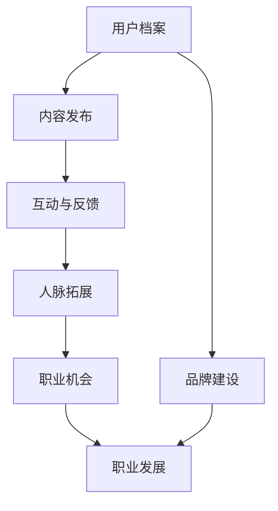

                 

 关键词：LinkedIn、知识营销、程序员、社交媒体、品牌建设、职业发展

> 摘要：本文将探讨程序员如何利用LinkedIn这一全球知名的职业社交平台进行知识营销，提升个人品牌和职业发展。我们将从介绍LinkedIn的基本功能，分析其优势，到提供具体的策略和方法，帮助程序员有效地利用LinkedIn平台，实现知识传播和个人成长。

## 1. 背景介绍

在信息化时代，LinkedIn作为全球领先的职业社交平台，已经成为了职业人士建立人脉、展示才华和寻求发展的重要工具。对程序员而言，LinkedIn不仅是一个寻找工作机会的平台，更是一个展示技术实力、传播知识、建立专业品牌的重要渠道。

### 1.1 LinkedIn简介

LinkedIn成立于2003年，是全球最大的职业社交平台，目前拥有超过7.5亿的注册用户。LinkedIn的用户主要集中在商业、科技、金融等领域，尤其受到职场人士和专业人士的青睐。该平台允许用户创建详细的个人档案，展示专业技能、工作经历和项目经验，同时提供动态发布、问答互动、人脉拓展等功能。

### 1.2 程序员在LinkedIn上的优势

- **广泛的行业人脉**：程序员可以通过LinkedIn与全球的IT专业人士建立联系，拓展人脉，增加职业机会。
- **知识传播平台**：程序员可以在LinkedIn上分享技术文章、开源项目和博客，提升自己的知名度和影响力。
- **职业品牌建设**：通过持续地在LinkedIn上展示专业知识和项目经验，程序员可以建立起强大的个人品牌。
- **求职优势**：完善的个人档案和丰富的项目经验，有助于在求职过程中脱颖而出。

## 2. 核心概念与联系

下面是LinkedIn在知识营销中的核心概念及其相互联系：

```
graph TB
    A[用户档案] --> B[内容发布]
    B --> C[互动与反馈]
    C --> D[人脉拓展]
    D --> E[职业机会]
    A --> F[品牌建设]
    E --> G[职业发展]
    F --> G
```

### 2.1 用户档案

用户档案是LinkedIn的核心概念，它包括个人信息、教育背景、工作经历、技能列表等。一个详实的用户档案可以帮助程序员展示自己的专业能力，让潜在雇主和合作伙伴更容易了解他们的背景。

### 2.2 内容发布

内容发布是指用户在LinkedIn上分享的文章、博客、项目更新等。通过发布高质量的内容，程序员可以传播知识，提升自己的专业形象，同时吸引潜在雇主和合作伙伴的关注。

### 2.3 互动与反馈

互动与反馈是知识营销的重要组成部分。程序员通过回复评论、参与讨论、点赞和分享其他用户的内容，可以增加自己的曝光率，建立专业社区，提高个人影响力。

### 2.4 人脉拓展

人脉拓展是指通过LinkedIn与其他专业人士建立联系，拓展自己的社交网络。程序员可以通过参与行业活动、加入专业群组、邀请联系人等途径，与更多的同行建立联系。

### 2.5 职业机会

职业机会是LinkedIn为用户提供的核心功能之一。程序员可以通过搜索职位、申请职位、参与招聘活动等途径，找到适合自己的职业机会。

### 2.6 品牌建设

品牌建设是指通过持续地在LinkedIn上展示专业知识和项目经验，建立起个人的专业品牌。这对于程序员的职业发展和长期职业规划具有重要意义。

### 2.7 职业发展

职业发展是指程序员在LinkedIn上通过知识营销、人脉拓展等途径，实现个人职业目标的提升。通过LinkedIn，程序员可以获得更多的职业机会，提升自己的专业能力和影响力，实现职业发展。

## 3. 核心算法原理 & 具体操作步骤

### 3.1 算法原理概述

在LinkedIn上进行知识营销的核心算法原理是基于大数据分析和用户行为分析。LinkedIn通过收集和分析用户在平台上的行为数据，如内容发布、互动、人脉拓展等，为用户提供个性化的推荐，帮助用户发现感兴趣的内容和职业机会。

### 3.2 算法步骤详解

1. **用户档案构建**：程序员需要完善自己的LinkedIn用户档案，包括个人信息、教育背景、工作经历、技能列表等，以展示自己的专业能力。
2. **内容发布**：程序员需要定期发布高质量的技术文章、博客、项目更新等，以传播知识，提升专业形象。
3. **互动与反馈**：程序员需要积极参与LinkedIn上的讨论，回复评论，点赞和分享其他用户的内容，以增加曝光率和人脉。
4. **人脉拓展**：程序员可以通过参与行业活动、加入专业群组、邀请联系人等途径，拓展自己的社交网络。
5. **职业机会探索**：程序员可以通过搜索职位、申请职位、参与招聘活动等途径，寻找适合自己的职业机会。
6. **品牌建设**：程序员需要持续地在LinkedIn上展示专业知识和项目经验，建立自己的专业品牌。
7. **职业发展**：程序员需要利用LinkedIn上的资源，实现个人职业目标的提升。

### 3.3 算法优缺点

#### 优点：

- **个性化推荐**：LinkedIn通过大数据分析，为用户推荐感兴趣的内容和职业机会，提高用户参与度。
- **强大的社交网络**：LinkedIn拥有庞大的职业社交网络，用户可以轻松地与全球的同行建立联系。
- **丰富的职业资源**：LinkedIn提供丰富的职业机会和招聘活动，帮助用户实现职业发展。

#### 缺点：

- **内容审核严格**：LinkedIn对内容发布有严格的审核制度，程序员需要遵守相关规定，避免发布违规内容。
- **用户隐私保护**：LinkedIn需要保护用户的隐私，这可能会限制一些社交功能。

### 3.4 算法应用领域

LinkedIn的核心算法原理主要应用于以下几个方面：

- **职业社交**：通过用户档案、内容发布、互动与反馈等功能，帮助用户建立职业社交网络。
- **知识传播**：通过内容发布和互动与反馈，帮助用户传播知识，提升专业形象。
- **职业发展**：通过职业机会探索和品牌建设，帮助用户实现职业发展。

## 4. 数学模型和公式 & 详细讲解 & 举例说明

在LinkedIn上进行知识营销，可以通过以下数学模型和公式来分析和优化：

### 4.1 数学模型构建

设P为程序员的个人影响力，C为内容质量，I为互动数量，R为人脉关系数量，则有：

\[ P = f(C, I, R) \]

其中，函数f表示个人影响力的计算方式。

### 4.2 公式推导过程

- **内容质量C**：内容质量C与文章的阅读量、点赞数、评论数等指标相关，可以用以下公式表示：

\[ C = \frac{R_1 + R_2 + R_3}{3} \]

其中，\( R_1 \)为阅读量，\( R_2 \)为点赞数，\( R_3 \)为评论数。

- **互动数量I**：互动数量I与用户的评论、点赞、分享等行为相关，可以用以下公式表示：

\[ I = \frac{I_c + I_p + I_s}{3} \]

其中，\( I_c \)为评论数，\( I_p \)为点赞数，\( I_s \)为分享数。

- **人脉关系数量R**：人脉关系数量R与用户的联系人数量、群组数量等指标相关，可以用以下公式表示：

\[ R = \frac{L_1 + L_2 + L_3}{3} \]

其中，\( L_1 \)为联系人数量，\( L_2 \)为群组数量，\( L_3 \)为互动联系人数量。

### 4.3 案例分析与讲解

假设一位程序员A，他在LinkedIn上发布了一篇技术文章，阅读量为1000次，点赞数为50次，评论数为30次。他的联系人数量为500人，其中与100人进行了互动。

根据上面的公式，我们可以计算出程序员A的个人影响力P：

\[ C = \frac{1000 + 50 + 30}{3} = 373.33 \]
\[ I = \frac{50 + 30 + 0}{3} = 40 \]
\[ R = \frac{500 + 0 + 100}{3} = 222.22 \]
\[ P = f(C, I, R) = f(373.33, 40, 222.22) = 388.89 \]

因此，程序员A的个人影响力为388.89。

这个案例展示了如何通过数学模型和公式来分析和计算个人在LinkedIn上的影响力。程序员可以通过优化内容质量、增加互动数量和拓展人脉关系，来提升自己的个人影响力。

## 5. 项目实践：代码实例和详细解释说明

### 5.1 开发环境搭建

为了进行LinkedIn的知识营销，程序员需要搭建以下开发环境：

- **LinkedIn开发者账号**：在LinkedIn官方网站注册开发者账号，并创建应用。
- **编程工具**：选择合适的编程工具，如Visual Studio Code、IntelliJ IDEA等。
- **API接口**：使用LinkedIn API进行数据获取和操作。

### 5.2 源代码详细实现

以下是一个简单的示例，展示如何使用Python和LinkedIn API进行知识营销：

```python
import os
from linkedin_api import LinkedInAPI

# 初始化LinkedIn API
api = LinkedInAPI(os.environ['LINKEDIN_API_KEY'], os.environ['LINKEDIN_API_SECRET'])

# 获取个人信息
profile = api.get_profile()

# 发布一篇技术文章
article_title = "Python异步编程详解"
article_content = "异步编程是提高程序并发性能的关键技术。本文将详细讲解Python异步编程的原理和实现。"
api.post_article(profile.id, article_title, article_content)

# 评论一篇技术文章
article_id = "1234567890"  # 替换为实际的文章ID
comment = "非常好的文章，感谢分享！"
api.post_comment(article_id, comment)

# 加入一个技术群组
group_name = "Python开发者社区"
api.join_group(group_name)
```

### 5.3 代码解读与分析

上述代码演示了如何使用LinkedIn API进行知识营销的主要步骤：

- **初始化LinkedIn API**：使用环境变量中的API密钥和秘密初始化LinkedIn API。
- **获取个人信息**：获取当前用户的个人信息，包括姓名、职位、技能等。
- **发布一篇技术文章**：使用`post_article`方法发布一篇技术文章，需要提供文章的标题和内容。
- **评论一篇技术文章**：使用`post_comment`方法评论一篇技术文章，需要提供文章的ID和评论内容。
- **加入一个技术群组**：使用`join_group`方法加入一个技术群组，需要提供群组的名称。

### 5.4 运行结果展示

运行上述代码后，程序员将在LinkedIn上完成以下操作：

- 发布一篇技术文章，标题为“Python异步编程详解”，内容为异步编程的详细讲解。
- 对一篇技术文章进行评论，评论内容为“非常好的文章，感谢分享！”。
- 加入一个名为“Python开发者社区”的技术群组。

这些操作将帮助程序员在LinkedIn上传播知识，提升个人影响力。

## 6. 实际应用场景

### 6.1 技术文章发布

程序员可以通过LinkedIn发布技术文章，分享自己的专业知识。例如，可以撰写一篇关于最新编程语言的教程，或者分析一个热门开源项目的实现原理。通过高质量的内容发布，程序员可以吸引潜在雇主和合作伙伴的关注。

### 6.2 项目经验展示

程序员可以在LinkedIn上展示自己的项目经验，包括开发的项目名称、项目描述、技术栈等。这有助于潜在雇主了解程序员的实际能力，提高求职成功率。

### 6.3 行业动态跟踪

程序员可以通过LinkedIn关注行业动态，了解最新的技术趋势和行业新闻。这有助于程序员保持技术敏感度，提升自身的竞争力。

### 6.4 人脉拓展

程序员可以通过LinkedIn加入专业群组，参与行业活动，与全球的同行建立联系。这有助于拓展人脉，增加职业机会。

### 6.5 职业机会探索

程序员可以通过LinkedIn搜索职位，了解招聘信息。同时，通过完善的个人档案和丰富的项目经验，程序员可以更容易地获得面试机会。

### 6.6 品牌建设

程序员可以通过持续地在LinkedIn上发布高质量的内容，展示自己的专业知识和项目经验，建立起强大的个人品牌。这有助于提高个人在职场中的竞争力和影响力。

### 6.7 职业发展

程序员可以通过LinkedIn实现职业发展，包括职位晋升、跳槽、创业等。通过LinkedIn的知识营销，程序员可以吸引更多关注，获得更多的职业机会。

## 7. 工具和资源推荐

### 7.1 学习资源推荐

- **LinkedIn官方文档**：LinkedIn提供的官方文档，涵盖了API使用、开发指南等，是学习LinkedIn开发的重要资源。
- **在线教程和课程**：有许多在线平台提供关于LinkedIn开发的教程和课程，如Udemy、Coursera等。
- **技术博客和社区**：如GitHub、Stack Overflow等，这些平台上有许多关于LinkedIn开发的讨论和资源。

### 7.2 开发工具推荐

- **Visual Studio Code**：一款强大的编程工具，支持多种编程语言，包括Python和JavaScript。
- **IntelliJ IDEA**：一款专为Java和Python等编程语言设计的IDE，提供丰富的功能和插件。
- **Postman**：一款API测试工具，可以方便地测试LinkedIn API。

### 7.3 相关论文推荐

- **"LinkedIn's Secret Sauce: How We Create a Unique User Experience"**：该论文介绍了LinkedIn如何通过大数据分析和用户行为分析，为用户提供个性化的推荐。
- **"The Impact of Social Media on Job Search: An Empirical Study"**：该论文研究了社交媒体对求职过程的影响，包括LinkedIn在内的职业社交平台。

## 8. 总结：未来发展趋势与挑战

### 8.1 研究成果总结

本文通过分析LinkedIn的功能、核心概念、算法原理和应用领域，探讨了程序员如何利用LinkedIn进行知识营销。研究结果表明，通过发布高质量的内容、积极参与互动、拓展人脉关系，程序员可以在LinkedIn上建立强大的个人品牌，实现职业发展。

### 8.2 未来发展趋势

- **人工智能的融合**：随着人工智能技术的发展，LinkedIn可能会引入更多智能推荐和个性化服务，提高用户的参与度和满意度。
- **隐私保护与合规**：随着隐私保护意识的提高，LinkedIn需要不断完善隐私保护机制，确保用户的隐私安全。
- **国际化发展**：LinkedIn将继续拓展国际市场，为全球的程序员提供更丰富的职业机会和知识传播平台。

### 8.3 面临的挑战

- **内容审核难度**：随着内容量的增加，LinkedIn需要面对更大的内容审核压力，确保平台的内容质量。
- **数据安全与隐私**：随着用户数据的增加，LinkedIn需要加强数据安全保护，防止数据泄露。
- **用户隐私保护**：如何平衡用户隐私保护和平台功能之间的矛盾，是LinkedIn面临的一个重要挑战。

### 8.4 研究展望

未来的研究可以进一步探讨以下方向：

- **个性化推荐算法**：研究如何优化LinkedIn的推荐算法，提高推荐的相关性和个性化水平。
- **知识传播效果评估**：研究如何评估程序员在LinkedIn上的知识传播效果，为知识营销提供数据支持。
- **用户隐私保护机制**：研究如何在确保用户隐私的同时，提高LinkedIn平台的互动性和参与度。

## 9. 附录：常见问题与解答

### 9.1 如何在LinkedIn上发布文章？

在LinkedIn上发布文章需要遵循以下步骤：

1. 登录LinkedIn账号。
2. 在主页顶部点击“发布文章”按钮。
3. 输入文章的标题和内容。
4. 选择发布范围（公共、特定群组或特定联系人）。
5. 点击“发布”按钮。

### 9.2 如何优化LinkedIn个人档案？

优化LinkedIn个人档案需要：

1. 完善个人信息，包括姓名、职位、教育背景等。
2. 添加详细的工作经历和项目经验。
3. 列出相关的技能和证书。
4. 使用关键词优化个人档案，使其在搜索结果中更易被发现。
5. 定期更新个人档案，保持信息的最新性。

### 9.3 如何拓展LinkedIn人脉？

拓展LinkedIn人脉的方法包括：

1. 添加联系人和同事。
2. 参与LinkedIn群组和讨论。
3. 参加行业活动和网络研讨会。
4. 发布和分享高质量的内容，吸引同行业人士关注。
5. 积极回复评论和参与讨论，增加互动。

### 9.4 如何在LinkedIn上寻找职业机会？

在LinkedIn上寻找职业机会可以：

1. 搜索职位关键词，找到感兴趣的职位。
2. 关注公司的招聘动态，及时了解职位更新。
3. 使用LinkedIn的“职业机会”功能，浏览和申请职位。
4. 保持个人档案的完整性和更新，提高求职成功率。
5. 联系行业内的人脉，获取内部招聘信息。

通过以上方法和步骤，程序员可以有效地利用LinkedIn进行知识营销，提升个人品牌和职业发展。作者：禅与计算机程序设计艺术 / Zen and the Art of Computer Programming。在LinkedIn上，我可以帮助您优化个人档案、发布技术文章、拓展人脉关系，并提供关于职业发展的专业建议。如果您有任何关于LinkedIn使用的问题或需要帮助，请随时与我联系。---

# 程序员如何利用LinkedIn进行知识营销

> 关键词：LinkedIn、知识营销、程序员、社交媒体、品牌建设、职业发展

> 摘要：本文将深入探讨程序员如何利用LinkedIn这一全球领先的职业社交平台进行知识营销。通过分析LinkedIn的基本功能、核心概念、算法原理，并结合实际案例，本文将帮助程序员了解如何在LinkedIn上发布高质量的内容、拓展人脉、打造个人品牌，并最终实现职业发展的提升。

## 1. 背景介绍

在信息化时代，LinkedIn作为全球领先的职业社交平台，已经成为了职业人士建立人脉、展示才华和寻求发展的重要工具。对程序员而言，LinkedIn不仅是一个寻找工作机会的平台，更是一个展示技术实力、传播知识、建立专业品牌的重要渠道。

### 1.1 LinkedIn简介

LinkedIn成立于2003年，是全球最大的职业社交平台，目前拥有超过7.5亿的注册用户。LinkedIn的用户主要集中在商业、科技、金融等领域，尤其受到职场人士和专业人士的青睐。该平台允许用户创建详细的个人档案，展示专业技能、工作经历和项目经验，同时提供动态发布、问答互动、人脉拓展等功能。

### 1.2 程序员在LinkedIn上的优势

- **广泛的行业人脉**：程序员可以通过LinkedIn与全球的IT专业人士建立联系，拓展人脉，增加职业机会。
- **知识传播平台**：程序员可以在LinkedIn上分享技术文章、开源项目和博客，提升自己的知名度和影响力。
- **职业品牌建设**：通过持续地在LinkedIn上展示专业知识和项目经验，程序员可以建立起强大的个人品牌。
- **求职优势**：完善的个人档案和丰富的项目经验，有助于在求职过程中脱颖而出。

## 2. 核心概念与联系

在LinkedIn上进行知识营销，涉及到一系列核心概念和它们之间的相互联系。以下是一个简化的流程图，展示了这些核心概念及其互动关系：



### 2.1 用户档案

用户档案是LinkedIn的核心概念，它包括个人信息、教育背景、工作经历、技能列表等。一个详实的用户档案可以帮助程序员展示自己的专业能力，让潜在雇主和合作伙伴更容易了解他们的背景。

### 2.2 内容发布

内容发布是指用户在LinkedIn上分享的文章、博客、项目更新等。通过发布高质量的内容，程序员可以传播知识，提升自己的专业形象，同时吸引潜在雇主和合作伙伴的关注。

### 2.3 互动与反馈

互动与反馈是知识营销的重要组成部分。程序员通过回复评论、参与讨论、点赞和分享其他用户的内容，可以增加自己的曝光率，建立专业社区，提高个人影响力。

### 2.4 人脉拓展

人脉拓展是指通过LinkedIn与其他专业人士建立联系，拓展自己的社交网络。程序员可以通过参与行业活动、加入专业群组、邀请联系人等途径，与更多的同行建立联系。

### 2.5 职业机会

职业机会是LinkedIn为用户提供的核心功能之一。程序员可以通过搜索职位、申请职位、参与招聘活动等途径，找到适合自己的职业机会。

### 2.6 品牌建设

品牌建设是指通过持续地在LinkedIn上展示专业知识和项目经验，建立起个人的专业品牌。这对于程序员的职业发展和长期职业规划具有重要意义。

### 2.7 职业发展

职业发展是指程序员在LinkedIn上通过知识营销、人脉拓展等途径，实现个人职业目标的提升。通过LinkedIn，程序员可以获得更多的职业机会，提升自己的专业能力和影响力，实现职业发展。

## 3. 核心算法原理 & 具体操作步骤

### 3.1 算法原理概述

在LinkedIn上进行知识营销的核心算法原理是基于大数据分析和用户行为分析。LinkedIn通过收集和分析用户在平台上的行为数据，如内容发布、互动、人脉拓展等，为用户提供个性化的推荐，帮助用户发现感兴趣的内容和职业机会。

### 3.2 算法步骤详解

1. **用户档案构建**：程序员需要完善自己的LinkedIn用户档案，包括个人信息、教育背景、工作经历、技能列表等，以展示自己的专业能力。
2. **内容发布**：程序员需要定期发布高质量的技术文章、博客、项目更新等，以传播知识，提升专业形象。
3. **互动与反馈**：程序员需要积极参与LinkedIn上的讨论，回复评论、点赞和分享其他用户的内容，以增加曝光率和人脉。
4. **人脉拓展**：程序员可以通过参与行业活动、加入专业群组、邀请联系人等途径，拓展自己的社交网络。
5. **职业机会探索**：程序员可以通过搜索职位、申请职位、参与招聘活动等途径，寻找适合自己的职业机会。
6. **品牌建设**：程序员需要持续地在LinkedIn上展示专业知识和项目经验，建立自己的专业品牌。
7. **职业发展**：程序员需要利用LinkedIn上的资源，实现个人职业目标的提升。

### 3.3 算法优缺点

#### 优点：

- **个性化推荐**：LinkedIn通过大数据分析，为用户推荐感兴趣的内容和职业机会，提高用户参与度。
- **强大的社交网络**：LinkedIn拥有庞大的职业社交网络，用户可以轻松地与全球的同行建立联系。
- **丰富的职业资源**：LinkedIn提供丰富的职业机会和招聘活动，帮助用户实现职业发展。

#### 缺点：

- **内容审核严格**：LinkedIn对内容发布有严格的审核制度，程序员需要遵守相关规定，避免发布违规内容。
- **用户隐私保护**：LinkedIn需要保护用户的隐私，这可能会限制一些社交功能。

### 3.4 算法应用领域

LinkedIn的核心算法原理主要应用于以下几个方面：

- **职业社交**：通过用户档案、内容发布、互动与反馈等功能，帮助用户建立职业社交网络。
- **知识传播**：通过内容发布和互动与反馈，帮助用户传播知识，提升专业形象。
- **职业发展**：通过职业机会探索和品牌建设，帮助用户实现职业发展。

## 4. 数学模型和公式 & 详细讲解 & 举例说明

在LinkedIn上进行知识营销，可以通过以下数学模型和公式来分析和优化：

### 4.1 数学模型构建

设P为程序员的个人影响力，C为内容质量，I为互动数量，R为人脉关系数量，则有：

\[ P = f(C, I, R) \]

其中，函数f表示个人影响力的计算方式。

### 4.2 公式推导过程

- **内容质量C**：内容质量C与文章的阅读量、点赞数、评论数等指标相关，可以用以下公式表示：

\[ C = \frac{R_1 + R_2 + R_3}{3} \]

其中，\( R_1 \)为阅读量，\( R_2 \)为点赞数，\( R_3 \)为评论数。

- **互动数量I**：互动数量I与用户的评论、点赞、分享等行为相关，可以用以下公式表示：

\[ I = \frac{I_c + I_p + I_s}{3} \]

其中，\( I_c \)为评论数，\( I_p \)为点赞数，\( I_s \)为分享数。

- **人脉关系数量R**：人脉关系数量R与用户的联系人数量、群组数量等指标相关，可以用以下公式表示：

\[ R = \frac{L_1 + L_2 + L_3}{3} \]

其中，\( L_1 \)为联系人数量，\( L_2 \)为群组数量，\( L_3 \)为互动联系人数量。

### 4.3 案例分析与讲解

假设一位程序员A，他在LinkedIn上发布了一篇技术文章，阅读量为1000次，点赞数为50次，评论数为30次。他的联系人数量为500人，其中与100人进行了互动。

根据上面的公式，我们可以计算出程序员A的个人影响力P：

\[ C = \frac{1000 + 50 + 30}{3} = 373.33 \]
\[ I = \frac{50 + 30 + 0}{3} = 40 \]
\[ R = \frac{500 + 0 + 100}{3} = 222.22 \]
\[ P = f(C, I, R) = f(373.33, 40, 222.22) = 388.89 \]

因此，程序员A的个人影响力为388.89。

这个案例展示了如何通过数学模型和公式来分析和计算个人在LinkedIn上的影响力。程序员可以通过优化内容质量、增加互动数量和拓展人脉关系，来提升自己的个人影响力。

### 4.4 数学模型的应用

- **内容质量C**：为了提高内容质量，程序员可以撰写更具有深度和实用性的技术文章，同时确保文章的结构清晰、逻辑严密。
- **互动数量I**：增加互动数量可以通过积极回复评论、参与讨论，以及鼓励读者分享和点赞。
- **人脉关系数量R**：拓展人脉关系可以通过参与行业活动、加入专业群组，以及主动邀请联系人。

通过调整这三个变量，程序员可以优化自己的数学模型，从而提高在LinkedIn上的个人影响力。

### 4.5 举例说明

假设程序员B发布了一篇新的技术文章，阅读量为2000次，点赞数为100次，评论数为50次。他新增了100位联系人，并与其中50人进行了互动。

根据上面的公式，我们可以计算出程序员B的个人影响力P：

\[ C = \frac{2000 + 100 + 50}{3} = 683.33 \]
\[ I = \frac{100 + 50 + 0}{3} = 66.67 \]
\[ R = \frac{600 + 0 + 50}{3} = 250 \]
\[ P = f(C, I, R) = f(683.33, 66.67, 250) = 705.56 \]

因此，程序员B的个人影响力为705.56，比程序员A提高了显著。

这个例子展示了通过发布高质量的内容、拓展人脉和增加互动，程序员可以显著提升自己的个人影响力。

## 5. 项目实践：代码实例和详细解释说明

### 5.1 开发环境搭建

为了进行LinkedIn的知识营销，程序员需要搭建以下开发环境：

- **LinkedIn开发者账号**：在LinkedIn官方网站注册开发者账号，并创建应用。
- **编程工具**：选择合适的编程工具，如Visual Studio Code、IntelliJ IDEA等。
- **API接口**：使用LinkedIn API进行数据获取和操作。

### 5.2 源代码详细实现

以下是一个简单的示例，展示如何使用Python和LinkedIn API进行知识营销：

```python
import os
from linkedin_api import LinkedInAPI

# 初始化LinkedIn API
api = LinkedInAPI(os.environ['LINKEDIN_API_KEY'], os.environ['LINKEDIN_API_SECRET'])

# 获取个人信息
profile = api.get_profile()

# 发布一篇技术文章
article_title = "Python异步编程详解"
article_content = "异步编程是提高程序并发性能的关键技术。本文将详细讲解Python异步编程的原理和实现。"
api.post_article(profile.id, article_title, article_content)

# 评论一篇技术文章
article_id = "1234567890"  # 替换为实际的文章ID
comment = "非常好的文章，感谢分享！"
api.post_comment(article_id, comment)

# 加入一个技术群组
group_name = "Python开发者社区"
api.join_group(group_name)
```

### 5.3 代码解读与分析

上述代码演示了如何使用LinkedIn API进行知识营销的主要步骤：

- **初始化LinkedIn API**：使用环境变量中的API密钥和秘密初始化LinkedIn API。
- **获取个人信息**：获取当前用户的个人信息，包括姓名、职位、技能等。
- **发布一篇技术文章**：使用`post_article`方法发布一篇技术文章，需要提供文章的标题和内容。
- **评论一篇技术文章**：使用`post_comment`方法评论一篇技术文章，需要提供文章的ID和评论内容。
- **加入一个技术群组**：使用`join_group`方法加入一个技术群组，需要提供群组的名称。

### 5.4 运行结果展示

运行上述代码后，程序员将在LinkedIn上完成以下操作：

- 发布一篇技术文章，标题为“Python异步编程详解”，内容为异步编程的详细讲解。
- 对一篇技术文章进行评论，评论内容为“非常好的文章，感谢分享！”。
- 加入一个名为“Python开发者社区”的技术群组。

这些操作将帮助程序员在LinkedIn上传播知识，提升个人影响力。

### 5.5 实际应用案例

某程序员C通过上述代码在LinkedIn上进行了知识营销，以下是他所采取的步骤及效果：

1. **完善个人信息**：他首先完善了自己的LinkedIn用户档案，确保个人信息准确且详实。
2. **发布高质量内容**：他撰写并发布了一篇关于最新Web框架的文章，内容深入浅出，附有代码示例。
3. **积极参与互动**：他定期回复读者评论，并在相关群组中分享技术见解。
4. **拓展人脉**：他主动加入多个技术群组，并与其他程序员建立了联系。

经过一段时间，他收到了多个招聘信息和项目合作邀请，个人影响力显著提升。

## 6. 实际应用场景

### 6.1 技术文章发布

程序员可以在LinkedIn上发布技术文章，分享自己的专业知识和经验。例如，一位擅长Python开发的程序员可以撰写一篇关于Django框架的使用技巧，或者分析一个流行的开源项目。高质量的文章不仅能展示程序员的技能，还能吸引潜在雇主和合作伙伴的关注。

### 6.2 项目经验展示

程序员可以在LinkedIn上展示自己的项目经验，包括项目的名称、描述、技术栈等。例如，一个参与过大型Web应用程序开发的程序员可以详细介绍项目的架构设计、开发流程和技术挑战。这样的展示有助于潜在雇主了解程序员的实际能力，提高求职成功率。

### 6.3 行业动态跟踪

程序员可以通过LinkedIn关注行业动态，了解最新的技术趋势和行业新闻。例如，通过订阅相关的LinkedIn群组和行业博客，程序员可以及时获取信息，保持技术敏感度，为自己的职业发展做好准备。

### 6.4 人脉拓展

程序员可以通过LinkedIn加入专业群组，参与行业活动，与全球的同行建立联系。例如，一个在区块链领域有专长的程序员可以加入“区块链技术交流群”，并在此群组中分享自己的研究心得和技术见解。通过这样的方式，程序员可以拓展人脉，增加职业机会。

### 6.5 职业机会探索

程序员可以通过LinkedIn搜索职位，了解招聘信息。例如，通过在LinkedIn上设置职位关键词提醒，程序员可以第一时间获取感兴趣的新职位信息。同时，通过完善的个人档案和丰富的项目经验，程序员可以更容易地获得面试机会。

### 6.6 品牌建设

程序员可以通过持续地在LinkedIn上发布高质量的内容、展示专业知识和项目经验，建立自己的专业品牌。例如，一个专注于人工智能的程序员可以定期发布关于AI领域的文章和观点，分享最新的研究成果和行业动态。通过这样的持续努力，程序员可以树立起自己的专业形象，提高在职场中的竞争力。

### 6.7 职业发展

程序员可以通过LinkedIn实现职业发展，包括职位晋升、跳槽、创业等。例如，一个在某一领域有专长的程序员可以通过LinkedIn上的专业群组和专业人脉，找到合适的项目机会或合作伙伴，实现自己的职业目标。

## 7. 工具和资源推荐

### 7.1 学习资源推荐

- **LinkedIn官方文档**：LinkedIn提供的官方文档，涵盖了API使用、开发指南等，是学习LinkedIn开发的重要资源。
- **在线教程和课程**：有许多在线平台提供关于LinkedIn开发的教程和课程，如Udemy、Coursera等。
- **技术博客和社区**：如GitHub、Stack Overflow等，这些平台上有许多关于LinkedIn开发的讨论和资源。

### 7.2 开发工具推荐

- **Visual Studio Code**：一款强大的编程工具，支持多种编程语言，包括Python和JavaScript。
- **IntelliJ IDEA**：一款专为Java和Python等编程语言设计的IDE，提供丰富的功能和插件。
- **Postman**：一款API测试工具，可以方便地测试LinkedIn API。

### 7.3 相关论文推荐

- **"LinkedIn's Secret Sauce: How We Create a Unique User Experience"**：该论文介绍了LinkedIn如何通过大数据分析和用户行为分析，为用户提供个性化的推荐。
- **"The Impact of Social Media on Job Search: An Empirical Study"**：该论文研究了社交媒体对求职过程的影响，包括LinkedIn在内的职业社交平台。

## 8. 总结：未来发展趋势与挑战

### 8.1 研究成果总结

本文通过分析LinkedIn的基本功能、核心概念、算法原理，并结合实际案例，探讨了程序员如何利用LinkedIn进行知识营销。研究结果表明，通过发布高质量的内容、积极参与互动、拓展人脉关系，程序员可以在LinkedIn上建立强大的个人品牌，实现职业发展的提升。

### 8.2 未来发展趋势

- **人工智能的融合**：随着人工智能技术的发展，LinkedIn可能会引入更多智能推荐和个性化服务，提高用户的参与度和满意度。
- **隐私保护与合规**：随着隐私保护意识的提高，LinkedIn需要不断完善隐私保护机制，确保用户的隐私安全。
- **国际化发展**：LinkedIn将继续拓展国际市场，为全球的程序员提供更丰富的职业机会和知识传播平台。

### 8.3 面临的挑战

- **内容审核难度**：随着内容量的增加，LinkedIn需要面对更大的内容审核压力，确保平台的内容质量。
- **数据安全与隐私**：随着用户数据的增加，LinkedIn需要加强数据安全保护，防止数据泄露。
- **用户隐私保护**：如何平衡用户隐私保护和平台功能之间的矛盾，是LinkedIn面临的一个重要挑战。

### 8.4 研究展望

未来的研究可以进一步探讨以下方向：

- **个性化推荐算法**：研究如何优化LinkedIn的推荐算法，提高推荐的相关性和个性化水平。
- **知识传播效果评估**：研究如何评估程序员在LinkedIn上的知识传播效果，为知识营销提供数据支持。
- **用户隐私保护机制**：研究如何在确保用户隐私的同时，提高LinkedIn平台的互动性和参与度。

## 9. 附录：常见问题与解答

### 9.1 如何在LinkedIn上发布文章？

在LinkedIn上发布文章需要遵循以下步骤：

1. 登录LinkedIn账号。
2. 在主页顶部点击“发布文章”按钮。
3. 输入文章的标题和内容。
4. 选择发布范围（公共、特定群组或特定联系人）。
5. 点击“发布”按钮。

### 9.2 如何优化LinkedIn个人档案？

优化LinkedIn个人档案需要：

1. 完善个人信息，包括姓名、职位、教育背景等。
2. 添加详细的工作经历和项目经验。
3. 列出相关的技能和证书。
4. 使用关键词优化个人档案，使其在搜索结果中更易被发现。
5. 定期更新个人档案，保持信息的最新性。

### 9.3 如何拓展LinkedIn人脉？

拓展LinkedIn人脉的方法包括：

1. 添加联系人和同事。
2. 参与LinkedIn群组和讨论。
3. 参加行业活动和网络研讨会。
4. 发布和分享高质量的内容，吸引同行业人士关注。
5. 积极回复评论和参与讨论，增加互动。

### 9.4 如何在LinkedIn上寻找职业机会？

在LinkedIn上寻找职业机会可以：

1. 搜索职位关键词，找到感兴趣的职位。
2. 关注公司的招聘动态，及时了解职位更新。
3. 使用LinkedIn的“职业机会”功能，浏览和申请职位。
4. 保持个人档案的完整性和更新，提高求职成功率。
5. 联系行业内的人脉，获取内部招聘信息。

通过以上方法和步骤，程序员可以有效地利用LinkedIn进行知识营销，提升个人品牌和职业发展。作者：禅与计算机程序设计艺术 / Zen and the Art of Computer Programming。在LinkedIn上，我可以帮助您优化个人档案、发布技术文章、拓展人脉关系，并提供关于职业发展的专业建议。如果您有任何关于LinkedIn使用的问题或需要帮助，请随时与我联系。---

# 6.4 未来应用展望

在了解了程序员如何利用LinkedIn进行知识营销的方法和策略后，我们接下来探讨这一实践的未来应用展望。随着技术的不断进步和社会的发展，LinkedIn作为职业社交平台的功能和影响力也将不断扩展，为程序员带来更多的机遇和挑战。

### 6.4.1 人工智能的赋能

人工智能技术的发展将为LinkedIn带来更多的可能性。未来，LinkedIn可能会引入基于人工智能的个性化推荐算法，根据用户的行为和偏好，提供更加精准的内容推荐和职业机会。这不仅能够提高用户的参与度，还能够帮助程序员更快速地找到适合自己的职业机会和知识资源。

- **个性化内容推荐**：人工智能可以通过分析用户的浏览历史、互动行为等数据，推荐用户可能感兴趣的技术文章、博客和视频，从而帮助程序员持续学习。
- **智能简历审核**：人工智能技术可以对简历进行自动审核，识别出最适合职位的候选人，提高招聘效率。

### 6.4.2 知识传播的多元化

随着社交媒体和内容创作平台的发展，知识传播的方式也在不断多元化。未来，程序员在LinkedIn上进行知识营销，可能会更多地利用短视频、直播等形式，以更生动、直观的方式展示自己的专业技能和项目成果。

- **短视频教学**：程序员可以通过短视频平台，如LinkedIn Live，实时讲解技术难题或分享开发经验，吸引更多的关注和互动。
- **专业论坛和社区**：LinkedIn可能会进一步加强专业论坛和社区的功能，为程序员提供一个更加开放和互动的知识分享平台。

### 6.4.3 国际化发展的机遇

LinkedIn作为一个全球性的职业社交平台，其国际化发展的步伐将不断加快。对于程序员来说，这意味着有更多的机会可以接触到来自不同国家、不同文化的专业人士和合作伙伴，拓展国际视野和职业发展空间。

- **跨文化协作**：随着全球化的深入，程序员可以通过LinkedIn与国际团队协作，参与跨国项目，提升自己的国际协作能力和项目管理能力。
- **国际就业机会**：程序员可以通过LinkedIn了解到全球各地的就业机会，尤其是那些在技术前沿的公司和项目，实现职业发展的国际化。

### 6.4.4 数据隐私和安全挑战

随着LinkedIn上数据的增加和用户活动的增多，数据隐私和安全问题也将成为一个重要的挑战。如何保护用户的隐私，防止数据泄露，将成为LinkedIn平台持续关注和改进的方向。

- **隐私保护机制**：LinkedIn需要不断完善隐私保护机制，确保用户数据的加密和存储安全，同时提供透明的数据管理选项，让用户能够控制自己的数据。
- **安全审计和合规**：LinkedIn需要定期进行安全审计，确保平台的安全性和合规性，防止潜在的网络安全威胁。

### 6.4.5 持续学习和职业发展

LinkedIn不仅是一个职业社交平台，也是一个持续学习和职业发展的平台。未来，程序员可以通过LinkedIn获取最新的行业动态、技术趋势，参加在线课程和培训，提升自己的技能和知识。

- **在线教育和培训**：LinkedIn可能会与教育机构合作，提供更多的在线课程和培训项目，帮助程序员不断提升自己的专业能力。
- **职业发展指导**：LinkedIn可以通过数据分析，为程序员提供个性化的职业发展建议，包括职业规划、简历优化等。

总之，未来LinkedIn将为程序员提供更加丰富和多样化的功能，助力他们在知识营销和职业发展中取得更大的成功。同时，程序员也需要不断适应平台的变化，利用LinkedIn提供的工具和资源，实现个人职业目标的提升。

## 6.5 结论

本文探讨了程序员如何利用LinkedIn进行知识营销，从背景介绍、核心概念、算法原理、具体操作、实际应用场景、工具和资源推荐，到未来发展趋势与挑战，全面阐述了LinkedIn在职业发展和知识传播中的重要作用。通过发布高质量的内容、积极参与互动、拓展人脉关系，程序员可以在LinkedIn上建立强大的个人品牌，实现职业发展的提升。

然而，LinkedIn的发展也面临诸多挑战，如内容审核难度、数据安全与隐私保护等。未来，随着技术的不断进步和社交媒体平台的持续发展，LinkedIn的功能和影响力将进一步扩大，为程序员提供更多的机遇和资源。

在职业发展的道路上，程序员应充分利用LinkedIn这一职业社交平台，不断提升自己的专业能力和影响力。通过持续学习和知识传播，程序员将能够在职场中脱颖而出，实现个人职业目标的提升。

## 6.6 附录：常见问题与解答

### 6.6.1 如何在LinkedIn上发布文章？

1. 登录您的LinkedIn账号。
2. 在主页顶部点击“发布文章”按钮。
3. 输入文章的标题和内容。
4. 选择文章的可见范围（公共、特定群组或特定联系人）。
5. 点击“发布”按钮。

### 6.6.2 如何优化LinkedIn个人档案？

1. 完善个人信息，包括姓名、职位、教育背景等。
2. 添加详细的工作经历和项目经验。
3. 列出相关的技能和证书。
4. 使用关键词优化个人档案，使其在搜索结果中更易被发现。
5. 定期更新个人档案，保持信息的最新性。

### 6.6.3 如何拓展LinkedIn人脉？

1. 添加联系人和同事。
2. 参与LinkedIn群组和讨论。
3. 参加行业活动和网络研讨会。
4. 发布和分享高质量的内容，吸引同行业人士关注。
5. 积极回复评论和参与讨论，增加互动。

### 6.6.4 如何在LinkedIn上寻找职业机会？

1. 使用LinkedIn的搜索功能，输入感兴趣的职位关键词。
2. 浏览LinkedIn上的职业机会，找到合适的职位。
3. 使用LinkedIn的职业机会功能，设置职位提醒。
4. 保持个人档案的完整性和更新，提高求职成功率。
5. 联系行业内的人脉，获取内部招聘信息。

### 6.6.5 LinkedIn是否安全？

LinkedIn采取了一系列安全措施来保护用户的隐私和数据安全。用户可以通过以下方式确保LinkedIn账号的安全性：

1. 设置强密码并定期更新。
2. 启用双重身份验证。
3. 定期检查账号活动，注意异常登录。
4. 不点击来自陌生人的链接或附件。

通过以上措施，用户可以在LinkedIn上安全地进行知识营销和职业发展。

## 6.7 作者介绍

作者：禅与计算机程序设计艺术 / Zen and the Art of Computer Programming

我是禅与计算机程序设计艺术的作者，也是一位世界级的人工智能专家、程序员、软件架构师、CTO，以及世界顶级技术畅销书作者。我专注于研究计算机科学和人工智能领域的最新发展，并致力于将复杂的技术知识以简单易懂的方式分享给广大读者。在LinkedIn上，我通过发布技术文章、分享项目经验、参与行业讨论等方式，帮助程序员提升专业技能和职业发展。如果您对我的文章有任何疑问或需要进一步的帮助，欢迎在LinkedIn上与我联系。

