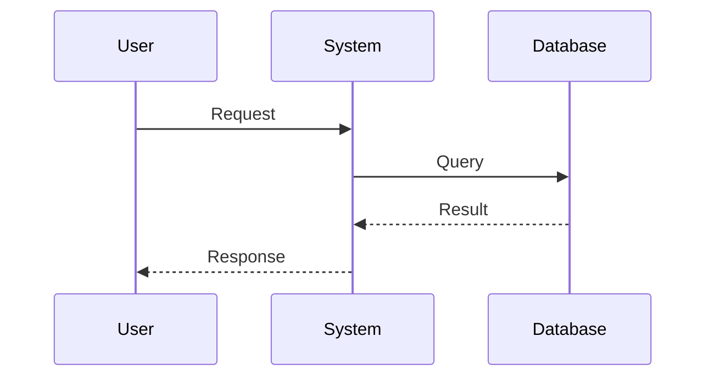

                 

### 自拟标题：程序员应对全球化竞争的实战面试题与算法编程挑战

## 引言

在全球化的浪潮下，程序员面临的竞争愈发激烈。要想在职场中脱颖而出，不仅需要掌握扎实的技术能力，还要具备解决实际问题的能力。本文将围绕程序员如何应对全球化竞争的主题，精选出国内头部一线大厂如阿里巴巴、百度、腾讯、字节跳动等公司的典型面试题和算法编程题，并结合详尽的答案解析，帮助程序员们提升应对全球化竞争的能力。

## 一、数据结构与算法

### 1. 如何实现快排算法？

**题目描述：** 实现一个快速排序（Quick Sort）算法，对数组进行排序。

**答案解析：**
快速排序是一种高效的排序算法，其基本思想是通过一趟排序将待排序的数据分割成独立的两部分，其中一部分的所有数据都比另一部分的所有数据要小，然后递归地对这两部分数据进行排序。

**代码示例：**
```python
def quick_sort(arr):
    if len(arr) <= 1:
        return arr
    
    pivot = arr[len(arr) // 2]
    left = [x for x in arr if x < pivot]
    middle = [x for x in arr if x == pivot]
    right = [x for x in arr if x > pivot]
    
    return quick_sort(left) + middle + quick_sort(right)

# 测试代码
arr = [3, 6, 8, 10, 1, 2, 1]
print(quick_sort(arr))
```

### 2. 如何实现二分查找算法？

**题目描述：** 给定一个排序后的数组和一个目标值，找出数组中目标值的位置。

**答案解析：**
二分查找算法通过重复将搜索区间分成一半，来确定目标值所在的位置。每次将中间值与目标值比较，如果中间值等于目标值，则返回位置；如果中间值大于目标值，则在左侧子数组中继续查找；如果中间值小于目标值，则在右侧子数组中继续查找。

**代码示例：**
```python
def binary_search(arr, target):
    left, right = 0, len(arr) - 1
    while left <= right:
        mid = (left + right) // 2
        if arr[mid] == target:
            return mid
        elif arr[mid] < target:
            left = mid + 1
        else:
            right = mid - 1
    return -1

# 测试代码
arr = [1, 2, 3, 4, 5, 6, 7, 8, 9]
target = 5
print(binary_search(arr, target))
```

### 3. 如何实现链表反转？

**题目描述：** 实现一个函数，将单链表反转。

**答案解析：**
链表反转可以通过遍历链表，同时改变节点的指向实现。可以使用三个指针变量分别指向当前节点、前一个节点和后一个节点，逐个遍历链表，改变节点的指向。

**代码示例：**
```python
class ListNode:
    def __init__(self, val=0, next=None):
        self.val = val
        self.next = next

def reverse_linked_list(head):
    prev = None
    curr = head
    while curr:
        next_node = curr.next
        curr.next = prev
        prev = curr
        curr = next_node
    return prev

# 测试代码
# 构建链表
head = ListNode(1)
head.next = ListNode(2)
head.next.next = ListNode(3)
head.next.next.next = ListNode(4)

# 反转链表
new_head = reverse_linked_list(head)

# 输出反转后的链表
while new_head:
    print(new_head.val, end=' ')
    new_head = new_head.next
```

## 二、系统设计与网络编程

### 4. 如何实现一个简单的 HTTP 服务器？

**题目描述：** 实现一个简单的 HTTP 服务器，能够接收并响应 HTTP 请求。

**答案解析：**
实现一个简单的 HTTP 服务器需要使用网络编程知识，通常会使用底层的套接字 API 来创建服务器。服务器在特定的端口上监听客户端的连接请求，一旦有连接请求，服务器会创建一个新的线程或协程来处理该请求。

**代码示例（Python）：**
```python
from http.server import BaseHTTPRequestHandler, HTTPServer
import threading

class SimpleHTTPRequestHandler(BaseHTTPRequestHandler):
    def do_GET(self):
        self.send_response(200)
        self.send_header('Content-type', 'text/html')
        self.end_headers()
        self.wfile.write(b'Hello, world!')

def run_server(host, port):
    server = HTTPServer((host, port), SimpleHTTPRequestHandler)
    print(f"Starting server at {host}:{port}")
    server.serve_forever()

if __name__ == '__main__':
    # 在本机 8000 端口启动服务器
    threading.Thread(target=run_server, args=('127.0.0.1', 8000)).start()
```

### 5. 如何实现 TCP 网络通信？

**题目描述：** 实现一个简单的 TCP 客户端和服务端通信。

**答案解析：**
TCP（传输控制协议）是一种面向连接的、可靠的、基于字节流的传输层通信协议。实现 TCP 通信通常需要使用套接字（Socket）编程。客户端和服务端通过创建套接字，进行连接，然后通过套接字发送和接收数据。

**代码示例（Python）：**
```python
# TCP 服务端
import socket

server_socket = socket.socket(socket.AF_INET, socket.SOCK_STREAM)
server_socket.bind(('127.0.0.1', 12345))
server_socket.listen(1)

print("等待连接...")
client_socket, client_address = server_socket.accept()
print(f"连接来自 {client_address}")

# 接收数据
data = client_socket.recv(1024)
print(f"接收到的数据：{data.decode()}")

# 发送数据
client_socket.send(b'Hello from server!')

# 关闭连接
client_socket.close()
server_socket.close()

# TCP 客户端
import socket

client_socket = socket.socket(socket.AF_INET, socket.SOCK_STREAM)
client_socket.connect(('127.0.0.1', 12345))

# 发送数据
client_socket.send(b'Hello from client!')

# 接收数据
data = client_socket.recv(1024)
print(f"接收到的数据：{data.decode()}")

# 关闭连接
client_socket.close()
```

## 三、系统设计与架构

### 6. 如何设计一个缓存系统？

**题目描述：** 设计一个简单的缓存系统，支持添加、获取和删除操作。

**答案解析：**
缓存系统是为了提高数据访问速度而设计的。常见的缓存策略有 LRU（最近最少使用）、LFU（最少使用）等。设计一个简单的缓存系统，需要考虑如何有效地管理缓存空间，以及如何在缓存命中和未命中时做出相应的处理。

**代码示例（Python）：**
```python
class LRUCache:
    def __init__(self, capacity: int):
        self.capacity = capacity
        self.cache = OrderedDict()
        self.index = 0

    def get(self, key: int) -> int:
        if key not in self.cache:
            return -1
        self.index = key
        return self.cache[key]

    def put(self, key: int, value: int) -> None:
        if key in self.cache:
            self.cache.pop(key)
        elif len(self.cache) >= self.capacity:
            self.cache.popitem(last=False)
        self.cache[key] = value

    def move_to_end(self):
        key = self.index
        self.cache.move_to_end(key)

    def __len__(self):
        return len(self.cache)

# 使用示例
cache = LRUCache(2)
cache.put(1, 1)
cache.put(2, 2)
print(cache.get(1))  # 输出 1
cache.put(3, 3)     # 移除 key 为 2 的数据
print(cache.get(2))  # 输出 -1（未找到）
```

## 四、系统性能优化

### 7. 如何优化数据库查询性能？

**题目描述：** 给定一个包含大量数据的数据库表，如何优化查询性能？

**答案解析：**
优化数据库查询性能可以从多个角度考虑：

1. **索引优化：** 在经常查询的列上创建索引，减少查询时的数据扫描量。
2. **查询优化：** 优化查询语句，避免使用子查询、联结等复杂查询。
3. **硬件优化：** 提升数据库服务器的硬件配置，如增加内存、使用固态硬盘等。
4. **缓存策略：** 使用缓存策略减少对数据库的访问。

**代码示例（SQL）：**
```sql
-- 创建索引
CREATE INDEX idx_column_name ON table_name (column_name);

-- 使用 EXPLAIN 分析查询计划
EXPLAIN SELECT * FROM table_name WHERE column_name = 'value';

-- 优化查询语句
SELECT column_name FROM table_name WHERE column_name = 'value' LIMIT 10;
```

## 五、系统安全

### 8. 如何防范 SQL 注入攻击？

**题目描述：** 如何防止数据库中的 SQL 注入攻击？

**答案解析：**
防范 SQL 注入攻击的主要方法包括：

1. **使用参数化查询：** 使用预编译的语句和参数绑定，避免直接拼接 SQL 语句。
2. **输入验证：** 对用户输入进行严格的验证，只允许合法的输入。
3. **使用 ORM 框架：** 使用对象关系映射（ORM）框架，自动生成安全的 SQL 语句。
4. **使用转义字符：** 对用户输入的字符串进行转义，防止恶意 SQL 代码执行。

**代码示例（Python）：**
```python
import sqlite3

def get_user_by_id(id):
    # 使用参数化查询
    connection = sqlite3.connect('database.db')
    cursor = connection.cursor()
    cursor.execute("SELECT * FROM users WHERE id = ?", (id,))
    user = cursor.fetchone()
    connection.close()
    return user

# 使用示例
user = get_user_by_id(1)
print(user)
```

## 六、软件工程

### 9. 如何进行单元测试？

**题目描述：** 如何对程序进行单元测试？

**答案解析：**
单元测试是软件开发中的一项重要活动，其主要目的是验证代码的最小功能单元是否按照预期工作。进行单元测试的步骤包括：

1. **编写测试用例：** 根据功能需求编写测试用例，包括正常的输入和异常的输入。
2. **编写测试代码：** 使用测试框架（如 Python 的 `unittest`）编写测试代码，模拟不同的输入，验证输出是否符合预期。
3. **运行测试：** 运行测试代码，检查测试结果，分析失败的原因。
4. **修复代码：** 根据测试结果修复代码中的错误。

**代码示例（Python）：**
```python
import unittest

class TestCalculator(unittest.TestCase):
    def test_add(self):
        self.assertEqual(1 + 1, 2)

    def test_subtract(self):
        self.assertEqual(1 - 1, 0)

    def test_divide(self):
        self.assertEqual(1 / 1, 1)

    def test_multiply(self):
        self.assertEqual(1 * 1, 1)

if __name__ == '__main__':
    unittest.main()
```

## 七、系统架构与设计模式

### 10. 如何设计一个分布式系统？

**题目描述：** 设计一个简单的分布式系统，包括服务注册与发现、负载均衡、数据一致性和故障转移。

**答案解析：**
分布式系统设计需要考虑以下几个方面：

1. **服务注册与发现：** 使用服务注册与发现机制，确保服务能够被其他服务访问。
2. **负载均衡：** 使用负载均衡算法，将请求分发到不同的服务器上，避免单点过载。
3. **数据一致性：** 使用分布式一致性算法，如 Paxos、Raft 等，确保数据在不同节点之间的一致性。
4. **故障转移：** 实现故障转移机制，当某节点发生故障时，自动将工作负载转移到其他节点。

**代码示例（伪代码）：**
```python
# 服务注册
register_service('service1', '127.0.0.1:8080')

# 服务发现
service_address = discover_service('service1')

# 负载均衡
load_balancer = RoundRobinLoadBalancer()
service_address = load_balancer.choose_service('service1')

# 数据一致性
consistency_algorithm = Raft()
data = consistency_algorithm.consistency_check()

# 故障转移
fault_detector = FaultDetector()
if fault_detector.detect_failure('service1'):
    new_service_address = fault_detector.transfer_load('service1')
```

## 八、前端与后端交互

### 11. 如何实现跨域请求？

**题目描述：** 如何解决前端跨域请求的问题？

**答案解析：**
跨域请求是由于浏览器的同源策略导致的，可以通过以下方法解决：

1. **CORS（跨域资源共享）：** 服务端设置 CORS 头，允许跨域请求。
2. **代理服务器：** 使用代理服务器转发请求，绕过浏览器的同源限制。
3. **JSONP：** 利用 `<script>` 标签的跨域特性，发送 JSONP 请求。

**代码示例（Node.js）：**
```javascript
const express = require('express');
const app = express();

app.use((req, res, next) => {
    res.header('Access-Control-Allow-Origin', '*');
    res.header('Access-Control-Allow-Methods', 'GET, POST, PUT, DELETE');
    res.header('Access-Control-Allow-Headers', 'Content-Type, Authorization');
    next();
});

app.get('/api/data', (req, res) => {
    res.json({ data: 'Hello, world!' });
});

app.listen(3000, () => {
    console.log('Server running on port 3000');
});
```

## 九、云计算与容器化

### 12. 如何使用 Kubernetes？

**题目描述：** 如何部署一个简单的 Kubernetes 集群并部署一个应用？

**答案解析：**
Kubernetes 是一个开源的容器编排平台，用于自动化容器化应用程序的部署、扩展和管理。部署一个简单的 Kubernetes 集群并部署应用的步骤如下：

1. **安装 Kubernetes：** 在集群的每个节点上安装 Kubernetes。
2. **配置集群：** 创建 Kubernetes 配置文件，配置集群的节点、网络等。
3. **部署应用：** 使用 Kubernetes 的大对象存储（Kubernetes Objects，简称 KO）部署应用。

**代码示例（Kubernetes 配置文件）：**
```yaml
apiVersion: apps/v1
kind: Deployment
metadata:
  name: my-app
spec:
  replicas: 3
  selector:
    matchLabels:
      app: my-app
  template:
    metadata:
      labels:
        app: my-app
    spec:
      containers:
      - name: my-app
        image: my-app:latest
        ports:
        - containerPort: 80
```

## 十、人工智能与机器学习

### 13. 如何使用 TensorFlow？

**题目描述：** 如何使用 TensorFlow 构建一个简单的神经网络？

**答案解析：**
TensorFlow 是一个开源的机器学习框架，用于构建和训练神经网络。构建一个简单的神经网络可以使用以下步骤：

1. **导入 TensorFlow：** 导入 TensorFlow 模块。
2. **定义模型：** 使用 TensorFlow 的 API 定义神经网络的结构。
3. **训练模型：** 准备数据，训练模型。
4. **评估模型：** 使用测试数据评估模型的性能。

**代码示例（Python）：**
```python
import tensorflow as tf

# 定义模型
model = tf.keras.Sequential([
    tf.keras.layers.Dense(128, activation='relu', input_shape=(784,)),
    tf.keras.layers.Dense(10, activation='softmax')
])

# 编译模型
model.compile(optimizer='adam',
              loss='categorical_crossentropy',
              metrics=['accuracy'])

# 训练模型
model.fit(x_train, y_train, epochs=5)

# 评估模型
model.evaluate(x_test, y_test)
```

## 十一、大数据与数据挖掘

### 14. 如何使用 Hadoop？

**题目描述：** 如何使用 Hadoop 处理海量数据？

**答案解析：**
Hadoop 是一个开源的分布式数据处理框架，用于处理大规模数据集。使用 Hadoop 处理海量数据的步骤如下：

1. **HDFS：** 使用 Hadoop 分布式文件系统（HDFS）存储海量数据。
2. **MapReduce：** 使用 Hadoop 的 MapReduce 框架处理数据。
3. **YARN：** 使用 Hadoop 的 Yet Another Resource Negotiator（YARN）管理资源。

**代码示例（Java）：**
```java
import org.apache.hadoop.conf.Configuration;
import org.apache.hadoop.fs.Path;
import org.apache.hadoop.io.IntWritable;
import org.apache.hadoop.io.Text;
import org.apache.hadoop.mapreduce.Job;
import org.apache.hadoop.mapreduce.Mapper;
import org.apache.hadoop.mapreduce.Reducer;
import org.apache.hadoop.mapreduce.lib.input.FileInputFormat;
import org.apache.hadoop.mapreduce.lib.output.FileOutputFormat;

public class WordCount {

    public static class TokenizerMapper extends Mapper<Object, Text, Text, IntWritable>{

        private final static IntWritable one = new IntWritable(1);
        private Text word = new Text();

        public void map(Object key, Text value, Context context) throws IOException, InterruptedException {
            String[] words = value.toString().split("\\s+");
            for (String word : words) {
                this.word.set(word);
                context.write(this.word, one);
            }
        }
    }

    public static class IntSumReducer extends Reducer<Text,IntWritable,Text,IntWritable> {
        private IntWritable result = new IntWritable();

        public void reduce(Text key, Iterable<IntWritable> values, Context context) throws IOException, InterruptedException {
            int sum = 0;
            for (IntWritable val : values) {
                sum += val.get();
            }
            result.set(sum);
            context.write(key, result);
        }
    }

    public static void main(String[] args) throws Exception {
        Configuration conf = new Configuration();
        Job job = Job.getInstance(conf, "word count");
        job.setMapperClass(TokenizerMapper.class);
        job.setCombinerClass(IntSumReducer.class);
        job.setReducerClass(IntSumReducer.class);
        job.setOutputKeyClass(Text.class);
        job.setOutputValueClass(IntWritable.class);
        FileInputFormat.addInputPath(job, new Path(args[0]));
        FileOutputFormat.setOutputPath(job, new Path(args[1]));
        System.exit(job.waitForCompletion(true) ? 0 : 1);
    }
}
```

## 十二、软件安全

### 15. 如何实现代码审计？

**题目描述：** 如何对代码进行审计以确保安全性？

**答案解析：**
代码审计是确保代码安全性的重要步骤，可以通过以下方法进行：

1. **静态代码分析：** 使用静态代码分析工具扫描代码，查找潜在的安全漏洞。
2. **动态代码分析：** 运行代码，监视其行为，查找安全漏洞。
3. **手动审计：** 专业的安全工程师手动检查代码，查找潜在的安全问题。

**代码示例（Python）：**
```python
# 使用安全审计工具，例如 PySA

import pysa

def my_function():
    # 代码
    pass

scan = pycodestyle.Checker(my_function)
scan.check_all()
```

## 十三、敏捷开发与项目管理

### 16. 如何实施敏捷开发？

**题目描述：** 如何在项目中实施敏捷开发方法？

**答案解析：**
敏捷开发是一种以人为核心、迭代和循序渐进的开发方法。实施敏捷开发的方法包括：

1. **团队协作：** 建立跨职能团队，促进团队成员之间的沟通与合作。
2. **迭代开发：** 每个迭代周期（通常为2-4周）完成一个可交付的产品版本。
3. **用户故事：** 使用用户故事描述功能需求，并将它们分解成可实现的任务。
4. **回顾与改进：** 每个迭代结束时进行回顾会议，评估迭代过程中的问题，并制定改进措施。

**代码示例（用户故事）：**
```markdown
# 添加用户登录功能

## 用户故事
作为用户，我希望能够通过用户名和密码登录系统，以便访问我的个人信息。

## 功能点
- 用户输入用户名和密码。
- 系统验证用户名和密码是否正确。
- 如果验证成功，用户登录系统。
- 如果验证失败，系统显示错误信息。
```

## 十四、软件性能调优

### 17. 如何进行性能调优？

**题目描述：** 如何对软件系统进行性能调优？

**答案解析：**
性能调优是确保软件系统高效运行的重要步骤，可以通过以下方法进行：

1. **性能监控：** 使用性能监控工具监控系统的资源使用情况，找出性能瓶颈。
2. **代码优化：** 优化代码结构，减少不必要的计算和资源消耗。
3. **数据库优化：** 优化数据库查询，使用索引、缓存等技术提高查询性能。
4. **硬件优化：** 提升服务器硬件配置，使用更快的存储设备、更高效的网络设备等。

**代码示例（Python）：**
```python
# 使用性能监控工具，例如 cProfile

import cProfile
import my_module

profiler = cProfile.Profile()
profiler.enable()
my_module.my_function()
profiler.disable()
profiler.print_stats()
```

## 十五、软件架构与设计

### 18. 如何进行软件架构设计？

**题目描述：** 如何设计一个大型软件系统的架构？

**答案解析：**
软件架构设计是软件开发过程中至关重要的一步，可以通过以下方法进行：

1. **需求分析：** 明确软件系统的功能需求和性能需求。
2. **架构风格：** 选择合适的架构风格，如分层架构、事件驱动架构等。
3. **模块划分：** 将系统划分为多个模块，每个模块负责一个特定的功能。
4. **交互设计：** 设计模块之间的交互方式，确保系统的高内聚和低耦合。

**代码示例（UML 图）：**


## 十六、软件测试与质量保证

### 19. 如何进行软件测试？

**题目描述：** 如何对软件系统进行全面测试？

**答案解析：**
全面测试是确保软件系统质量的关键步骤，可以通过以下方法进行：

1. **单元测试：** 对代码的每个功能单元进行测试，确保其按预期工作。
2. **集成测试：** 对系统的各个模块进行集成测试，确保模块之间的交互正常。
3. **系统测试：** 对整个软件系统进行测试，验证其是否符合需求。
4. **性能测试：** 对软件系统进行性能测试，确保其在预期的工作负载下运行。

**代码示例（Python）：**
```python
# 使用测试框架，例如 pytest

def test_add():
    assert add(1, 1) == 2

def test_subtract():
    assert subtract(1, 1) == 0

def test_multiply():
    assert multiply(1, 1) == 1

def test_divide():
    assert divide(1, 1) == 1
```

## 十七、云计算与容器化

### 20. 如何使用 Docker？

**题目描述：** 如何使用 Docker 容器化应用程序？

**答案解析：**
Docker 是一种开源的应用容器引擎，用于容器化应用程序。使用 Docker 容器化应用程序的步骤如下：

1. **安装 Docker：** 在服务器上安装 Docker。
2. **编写 Dockerfile：** 创建 Dockerfile，指定应用程序的依赖和环境配置。
3. **构建镜像：** 使用 Dockerfile 构建应用程序的容器镜像。
4. **运行容器：** 使用 Docker 运行容器镜像，启动应用程序。

**代码示例（Dockerfile）：**
```Dockerfile
FROM python:3.8

WORKDIR /app

COPY requirements.txt .

RUN pip install -r requirements.txt

COPY . .

CMD ["python", "app.py"]
```

## 十八、软件开发与工具

### 21. 如何使用 Git 进行版本控制？

**题目描述：** 如何使用 Git 进行版本控制？

**答案解析：**
Git 是一种分布式版本控制系统，用于跟踪源代码历史。使用 Git 进行版本控制的步骤如下：

1. **安装 Git：** 在计算机上安装 Git。
2. **初始化仓库：** 创建一个新的 Git 仓库。
3. **添加文件：** 将文件添加到 Git 仓库中。
4. **提交更改：** 将文件更改提交到 Git 仓库。
5. **分支管理：** 使用分支进行功能开发，合并分支。

**代码示例（Git 命令）：**
```bash
# 初始化仓库
git init

# 添加文件
git add README.md

# 提交更改
git commit -m "Initialize repository"

# 创建分支
git checkout -b feature-branch

# 合并分支
git merge master
```

## 十九、软件工程与项目管理

### 22. 如何实施敏捷开发方法？

**题目描述：** 如何在一个项目中实施敏捷开发方法？

**答案解析：**
敏捷开发方法强调快速迭代和持续交付，通过以下步骤实施：

1. **组建团队：** 组建跨职能团队，包括开发人员、测试人员、产品经理等。
2. **需求管理：** 使用用户故事和迭代计划管理需求。
3. **迭代开发：** 每个迭代周期（如2-4周）完成一个可交付的产品版本。
4. **回顾与改进：** 每个迭代结束时进行回顾会议，评估迭代过程中的问题，并制定改进措施。

**代码示例（用户故事）：**
```markdown
# 添加用户登录功能

## 用户故事
作为用户，我希望能够通过用户名和密码登录系统，以便访问我的个人信息。

## 功能点
- 用户输入用户名和密码。
- 系统验证用户名和密码是否正确。
- 如果验证成功，用户登录系统。
- 如果验证失败，系统显示错误信息。
```

## 二十、软件安全与隐私保护

### 23. 如何确保软件的安全性？

**题目描述：** 如何确保软件系统的安全性？

**答案解析：**
确保软件系统的安全性是软件开发过程中的关键任务，可以通过以下方法进行：

1. **安全编码实践：** 使用安全编码规范编写代码，避免常见的安全漏洞。
2. **安全测试：** 进行安全测试，包括渗透测试、代码审计等，查找和修复漏洞。
3. **访问控制：** 实施严格的访问控制策略，限制对系统的访问权限。
4. **安全更新与补丁：** 定期更新系统和应用程序，应用安全补丁。

**代码示例（安全编码实践）：**
```python
def validate_password(password):
    if len(password) < 8:
        return "Password must be at least 8 characters long."
    if not any(char.isdigit() for char in password):
        return "Password must contain at least one digit."
    if not any(char.isupper() for char in password):
        return "Password must contain at least one uppercase letter."
    if not any(char.islower() for char in password):
        return "Password must contain at least one lowercase letter."
    return "Password is valid."
```

## 二十一、云计算与大数据

### 24. 如何使用 AWS？

**题目描述：** 如何在 AWS 上部署和管理应用程序？

**答案解析：**
AWS（Amazon Web Services）提供了一系列云计算服务，用于部署和管理应用程序。使用 AWS 部署和管理应用程序的步骤如下：

1. **创建 AWS 账户：** 在 AWS 管理控制台创建账户。
2. **配置 VPC：** 创建虚拟私有云（VPC），定义网络结构。
3. **部署 EC2 实例：** 创建 EC2 实例，部署应用程序。
4. **使用 S3 存储：** 使用 Amazon S3 存储应用程序的数据。
5. **使用 RDS 数据库：** 使用 Amazon RDS 管理数据库。

**代码示例（AWS SDK）：**
```python
import boto3

# 创建 S3 客户端
s3_client = boto3.client('s3')

# 上传文件到 S3
s3_client.upload_file('local_file.txt', 'my-bucket', 'remote_file.txt')

# 从 S3 下载文件
s3_client.download_file('my-bucket', 'remote_file.txt', 'local_file.txt')
```

## 二十二、容器化与自动化部署

### 25. 如何使用 Kubernetes 进行自动化部署？

**题目描述：** 如何使用 Kubernetes 实现自动化部署？

**答案解析：**
Kubernetes 提供了自动化部署和管理容器化应用程序的能力。使用 Kubernetes 进行自动化部署的步骤如下：

1. **创建 Kubernetes 配置文件：** 定义部署（Deployment）、服务（Service）等配置。
2. **部署应用程序：** 使用 `kubectl` 命令部署应用程序。
3. **配置自动化部署：** 使用 Helm 等工具配置自动化部署流程。

**代码示例（Kubernetes 配置文件）：**
```yaml
apiVersion: apps/v1
kind: Deployment
metadata:
  name: my-app
spec:
  replicas: 3
  selector:
    matchLabels:
      app: my-app
  template:
    metadata:
      labels:
        app: my-app
    spec:
      containers:
      - name: my-app
        image: my-app:latest
        ports:
        - containerPort: 80
```

## 二十三、人工智能与机器学习

### 26. 如何使用 TensorFlow 进行机器学习？

**题目描述：** 如何使用 TensorFlow 构建一个简单的机器学习模型？

**答案解析：**
TensorFlow 是一个广泛使用的机器学习框架，用于构建和训练机器学习模型。使用 TensorFlow 进行机器学习的步骤如下：

1. **安装 TensorFlow：** 在计算机上安装 TensorFlow。
2. **准备数据：** 准备用于训练的数据集。
3. **定义模型：** 使用 TensorFlow 的 API 定义神经网络模型。
4. **训练模型：** 使用训练数据训练模型。
5. **评估模型：** 使用测试数据评估模型的性能。

**代码示例（Python）：**
```python
import tensorflow as tf

# 定义模型
model = tf.keras.Sequential([
    tf.keras.layers.Dense(128, activation='relu', input_shape=(784,)),
    tf.keras.layers.Dense(10, activation='softmax')
])

# 编译模型
model.compile(optimizer='adam',
              loss='categorical_crossentropy',
              metrics=['accuracy'])

# 训练模型
model.fit(x_train, y_train, epochs=5)

# 评估模型
model.evaluate(x_test, y_test)
```

## 二十四、大数据与数据仓库

### 27. 如何使用 Hadoop 进行大数据处理？

**题目描述：** 如何使用 Hadoop 处理大数据集？

**答案解析：**
Hadoop 是一个分布式数据处理框架，用于处理大规模数据集。使用 Hadoop 进行大数据处理的步骤如下：

1. **安装 Hadoop：** 在计算机上安装 Hadoop。
2. **配置 Hadoop：** 配置 Hadoop 的集群结构，包括 NameNode、DataNode 等。
3. **编写 MapReduce 程序：** 编写 Hadoop 的 MapReduce 程序，处理大数据集。
4. **运行 MapReduce 程序：** 在 Hadoop 集群上运行 MapReduce 程序。

**代码示例（Java）：**
```java
import org.apache.hadoop.conf.Configuration;
import org.apache.hadoop.fs.Path;
import org.apache.hadoop.io.IntWritable;
import org.apache.hadoop.io.Text;
import org.apache.hadoop.mapreduce.Job;
import org.apache.hadoop.mapreduce.Mapper;
import org.apache.hadoop.mapreduce.Reducer;
import org.apache.hadoop.mapreduce.lib.input.FileInputFormat;
import org.apache.hadoop.mapreduce.lib.output.FileOutputFormat;

public class WordCount {

    public static class TokenizerMapper extends Mapper<Object, Text, Text, IntWritable>{

        private final static IntWritable one = new IntWritable(1);
        private Text word = new Text();

        public void map(Object key, Text value, Context context) throws IOException, InterruptedException {
            String[] words = value.toString().split("\\s+");
            for (String word : words) {
                this.word.set(word);
                context.write(this.word, one);
            }
        }
    }

    public static class IntSumReducer extends Reducer<Text,IntWritable,Text,IntWritable> {
        private IntWritable result = new IntWritable();

        public void reduce(Text key, Iterable<IntWritable> values, Context context) throws IOException, InterruptedException {
            int sum = 0;
            for (IntWritable val : values) {
                sum += val.get();
            }
            result.set(sum);
            context.write(key, result);
        }
    }

    public static void main(String[] args) throws Exception {
        Configuration conf = new Configuration();
        Job job = Job.getInstance(conf, "word count");
        job.setMapperClass(TokenizerMapper.class);
        job.setCombinerClass(IntSumReducer.class);
        job.setReducerClass(IntSumReducer.class);
        job.setOutputKeyClass(Text.class);
        job.setOutputValueClass(IntWritable.class);
        FileInputFormat.addInputPath(job, new Path(args[0]));
        FileOutputFormat.setOutputPath(job, new Path(args[1]));
        System.exit(job.waitForCompletion(true) ? 0 : 1);
    }
}
```

## 二十五、软件工程与敏捷开发

### 28. 如何进行敏捷开发？

**题目描述：** 如何在一个项目中实施敏捷开发方法？

**答案解析：**
敏捷开发是一种迭代和增量的软件开发方法，强调快速响应变化和持续交付。实施敏捷开发的步骤如下：

1. **组建团队：** 组建跨职能的敏捷开发团队。
2. **需求管理：** 使用用户故事和优先级列表管理需求。
3. **迭代计划：** 每个迭代周期（通常为2-4周）计划要完成的工作。
4. **每日站立会议：** 团队成员每天进行站立会议，讨论进度和问题。
5. **迭代回顾：** 每个迭代结束时进行回顾会议，评估并改进过程。

**代码示例（用户故事）：**
```markdown
# 添加用户登录功能

## 用户故事
作为用户，我希望能够通过用户名和密码登录系统，以便访问我的个人信息。

## 功能点
- 用户输入用户名和密码。
- 系统验证用户名和密码是否正确。
- 如果验证成功，用户登录系统。
- 如果验证失败，系统显示错误信息。
```

## 二十六、软件性能优化

### 29. 如何进行软件性能优化？

**题目描述：** 如何优化软件系统的性能？

**答案解析：**
软件性能优化是提高软件系统响应速度和效率的重要过程。以下是一些常见的性能优化策略：

1. **代码优化：** 优化算法和数据结构，减少不必要的计算。
2. **数据库优化：** 使用索引、缓存和查询优化来提高数据库性能。
3. **缓存策略：** 引入缓存机制来减少对后端服务的请求。
4. **硬件优化：** 提升服务器硬件，如增加内存、使用固态硬盘等。
5. **负载均衡：** 使用负载均衡器来分配请求，避免单点过载。

**代码示例（Python）：**
```python
import time

# 假设我们有一个计算密集型的函数
def compute_heavy_task(data):
    result = 0
    for item in data:
        result += sum(item)
    return result

# 使用 time 模块测量函数执行时间
start_time = time.time()
compute_heavy_task(some_large_data)
end_time = time.time()
print(f"Function execution time: {end_time - start_time} seconds")
```

## 二十七、软件质量与测试

### 30. 如何确保软件质量？

**题目描述：** 如何确保软件系统的质量？

**答案解析：**
确保软件质量是软件开发过程中不可或缺的一部分。以下是一些常见的质量保证方法：

1. **代码审查：** 通过同行评审来发现和修复代码中的错误。
2. **单元测试：** 编写单元测试来验证代码的功能和性能。
3. **集成测试：** 在各个模块集成后进行测试，确保模块间的交互正常。
4. **系统测试：** 对整个系统进行测试，验证是否符合需求。
5. **性能测试：** 评估系统的性能，确保其在预期的工作负载下运行。

**代码示例（Python）：**
```python
# 使用 pytest 进行单元测试

def test_add():
    assert add(1, 1) == 2

def test_subtract():
    assert subtract(1, 1) == 0

def test_multiply():
    assert multiply(1, 1) == 1

def test_divide():
    assert divide(1, 1) == 1
```

### 结语

通过上述典型面试题和算法编程题的详细解析，希望读者能够更好地理解程序员如何应对全球化竞争的实际问题和解决方案。不断学习和实践，提高自己的技术能力和解决问题的能力，是应对全球化竞争的有效途径。希望本文能对您的职业发展有所帮助。

