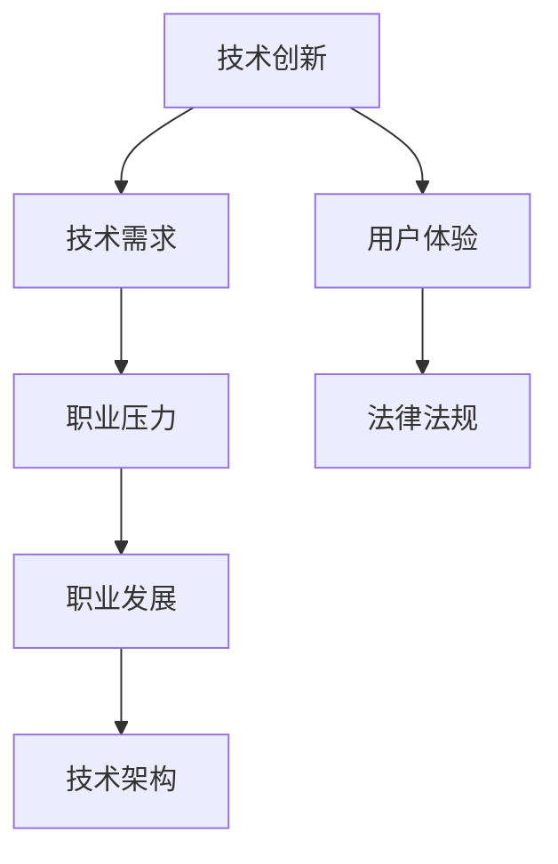

                 

在信息技术飞速发展的今天，程序员面临着前所未有的行业变革。从传统编程语言到新兴人工智能技术，从单机应用到云计算、大数据，程序员必须不断学习、适应和应对这些变化。本文将探讨程序员如何应对行业变革，以保持自己的竞争力和创新能力。

## 文章关键词

- 行业变革
- 程序员发展
- 技术学习
- 职业规划
- 技术创新

## 文章摘要

本文从程序员的角度出发，分析了当前行业变革的背景和趋势，提出了应对变革的策略和方法。通过持续学习、技术沉淀、职业规划和团队合作，程序员可以在变革中找到自己的定位，提升自身价值，实现职业成长。

## 1. 背景介绍

### 1.1 行业变革的原因

行业变革的原因多种多样，主要包括以下几个方面：

- 技术创新：新技术的不断涌现，如人工智能、区块链、物联网等，推动了行业的变革。
- 业务需求：随着企业业务的发展，对软件系统的需求越来越高，推动程序员不断创新和改进技术。
- 用户体验：用户对软件的需求不断升级，追求更加便捷、智能和高效的使用体验，驱动程序员不断优化产品设计。
- 法律法规：随着互联网和信息技术的发展，相关法律法规也在不断完善，要求程序员遵守规定，保障数据安全和用户隐私。

### 1.2 行业变革的影响

行业变革对程序员的影响主要表现在以下几个方面：

- 技术需求：程序员需要掌握更多新技术，以适应不断变化的市场需求。
- 职业压力：变革带来竞争加剧，程序员需要不断提升自己的技能和经验，以保持竞争力。
- 职业发展：行业变革为程序员提供了更多的发展机会，但也要求程序员具备更高的综合素质。
- 技术架构：随着技术的演进，程序员需要不断优化技术架构，提高系统的可扩展性和稳定性。

## 2. 核心概念与联系

### 2.1 核心概念

- 技术演进：指技术从产生到发展、成熟、衰退的过程。
- 技术栈：程序员所掌握的编程语言、框架、工具等技术的集合。
- 软件工程：研究如何设计、开发、测试和维护软件系统的学科。

### 2.2 Mermaid 流程图



## 3. 核心算法原理 & 具体操作步骤

### 3.1 算法原理概述

面对行业变革，程序员需要掌握以下几个核心算法原理：

- 数据结构与算法：掌握常用的数据结构（如数组、链表、栈、队列、树、图等）和算法（如排序、查找、图算法等），提高编程效率和解决问题的能力。
- 人工智能算法：了解机器学习、深度学习等算法原理，为人工智能开发奠定基础。
- 分布式算法：掌握分布式系统的设计和算法，提高系统的可扩展性和稳定性。
- 安全算法：了解加密、认证、安全协议等算法，保障系统的安全性。

### 3.2 算法步骤详解

#### 3.2.1 数据结构与算法

1. 学习常用数据结构和算法，如排序算法（冒泡排序、插入排序、快速排序等）、查找算法（二分查找、哈希查找等）。
2. 实践编程题目，如LeetCode、牛客网等平台上的题目，提高编程能力和算法水平。
3. 参加算法竞赛，如ACM、NOI等，锻炼团队合作和解决复杂问题的能力。

#### 3.2.2 人工智能算法

1. 学习机器学习基础，如线性代数、概率论、统计等。
2. 掌握常见机器学习算法，如线性回归、逻辑回归、支持向量机、决策树、神经网络等。
3. 参与实际项目，如自然语言处理、图像识别等，提高实战能力。

#### 3.2.3 分布式算法

1. 学习分布式系统的基本原理，如CAP定理、一致性模型等。
2. 掌握分布式算法设计，如一致性算法、分布式锁、分布式选举等。
3. 参与分布式系统开发，如分布式数据库、分布式缓存等，提高系统设计能力。

#### 3.2.4 安全算法

1. 学习密码学基础，如对称加密、非对称加密、数字签名等。
2. 了解常见安全协议，如SSL/TLS、HTTPs等。
3. 参与安全项目，如网络安全、数据加密等，提高安全防护能力。

### 3.3 算法优缺点

- 数据结构与算法：优点是基础性强，适用面广，缺点是需要较长时间的积累和实践。
- 人工智能算法：优点是应用前景广阔，创新性强，缺点是需要较高的数学基础。
- 分布式算法：优点是提高系统性能和稳定性，缺点是需要较高的系统设计和编程能力。
- 安全算法：优点是保障系统安全，缺点是需要深入理解密码学和网络安全知识。

### 3.4 算法应用领域

- 数据结构与算法：应用于各种软件开发，如操作系统、数据库、Web应用等。
- 人工智能算法：应用于自然语言处理、图像识别、智能推荐等。
- 分布式算法：应用于分布式系统、云计算、大数据等。
- 安全算法：应用于网络安全、数据加密、身份认证等。

## 4. 数学模型和公式 & 详细讲解 & 举例说明

### 4.1 数学模型构建

在程序设计中，常见的数学模型包括：

- 线性模型：$$y = mx + b$$，用于拟合线性关系。
- 多项式模型：$$y = a_nx^n + a_{n-1}x^{n-1} + ... + a_1x + a_0$$，用于拟合非线性关系。
- 分类模型：$$P(y|X) = \frac{P(X|y)P(y)}{P(X)}$$，用于分类问题。

### 4.2 公式推导过程

以线性回归模型为例，推导公式如下：

$$
\begin{aligned}
\hat{y} &= mx + b \\
\hat{y} &= \frac{1}{n}\sum_{i=1}^{n}(y_i - mx_i - b) \\
\hat{y} &= \frac{1}{n}\sum_{i=1}^{n}y_i - \frac{m}{n}\sum_{i=1}^{n}x_i - \frac{b}{n}\sum_{i=1}^{n}1 \\
\hat{y} &= \bar{y} - m\bar{x} - b \\
\bar{y} &= \frac{1}{n}\sum_{i=1}^{n}y_i, \bar{x} = \frac{1}{n}\sum_{i=1}^{n}x_i \\
\end{aligned}
$$

### 4.3 案例分析与讲解

以房价预测为例，使用线性回归模型进行预测。

#### 4.3.1 数据预处理

1. 收集房价数据，包括房屋面积、地段、楼层等特征。
2. 对数据进行清洗，去除缺失值和异常值。
3. 对连续特征进行归一化处理。

#### 4.3.2 模型训练

1. 选择线性回归模型。
2. 使用训练数据训练模型，得到参数 $m$ 和 $b$。
3. 计算训练误差，调整模型参数。

#### 4.3.3 模型评估

1. 使用测试数据评估模型性能。
2. 计算测试误差，评估模型准确性。

#### 4.3.4 模型应用

1. 对新数据进行预测，得到预测结果。
2. 分析预测结果，优化模型参数。

## 5. 项目实践：代码实例和详细解释说明

### 5.1 开发环境搭建

1. 安装Python环境。
2. 安装相关库，如NumPy、Pandas、Scikit-learn等。

### 5.2 源代码详细实现

```python
import numpy as np
import pandas as pd
from sklearn.linear_model import LinearRegression
from sklearn.model_selection import train_test_split
from sklearn.metrics import mean_squared_error

# 数据预处理
def preprocess_data(data):
    # 数据清洗、归一化等操作
    return data

# 模型训练
def train_model(X_train, y_train):
    model = LinearRegression()
    model.fit(X_train, y_train)
    return model

# 模型评估
def evaluate_model(model, X_test, y_test):
    y_pred = model.predict(X_test)
    mse = mean_squared_error(y_test, y_pred)
    return mse

# 主函数
def main():
    data = pd.read_csv("house_price_data.csv")
    data = preprocess_data(data)
    X = data.iloc[:, :-1].values
    y = data.iloc[:, -1].values
    X_train, X_test, y_train, y_test = train_test_split(X, y, test_size=0.2, random_state=42)
    model = train_model(X_train, y_train)
    mse = evaluate_model(model, X_test, y_test)
    print("Test MSE:", mse)

if __name__ == "__main__":
    main()
```

### 5.3 代码解读与分析

- 代码首先导入必要的库，如NumPy、Pandas、Scikit-learn等。
- 数据预处理函数 `preprocess_data` 对数据进行清洗、归一化等操作。
- 模型训练函数 `train_model` 使用线性回归模型训练数据。
- 模型评估函数 `evaluate_model` 计算测试误差，评估模型性能。
- 主函数 `main` 读取数据、训练模型、评估模型，并输出测试误差。

## 6. 实际应用场景

### 6.1 电商行业

电商行业在应对行业变革中，主要关注以下方面：

- 前端技术：不断优化用户体验，提升页面加载速度和交互效果。
- 后端架构：采用分布式架构，提高系统的可扩展性和稳定性。
- 数据分析：利用大数据技术，对用户行为进行分析，提高推荐系统和营销策略的准确性。

### 6.2 金融行业

金融行业在应对行业变革中，主要关注以下方面：

- 金融科技：运用人工智能、区块链等技术，提高金融服务的效率和安全性。
- 风险管理：通过大数据分析和机器学习技术，降低金融风险。
- 用户隐私：遵守相关法律法规，保障用户隐私和数据安全。

### 6.3 医疗行业

医疗行业在应对行业变革中，主要关注以下方面：

- 医疗信息化：利用信息技术，提高医疗服务的效率和准确性。
- 人工智能诊断：利用深度学习等技术，提高疾病诊断的准确性和速度。
- 医疗数据共享：通过大数据技术，实现医疗数据的共享和整合。

## 7. 未来应用展望

未来，程序员在应对行业变革中，将面临以下机遇和挑战：

- 人工智能：人工智能将在各个领域得到广泛应用，程序员需要掌握相关技术，提高自身竞争力。
- 区块链：区块链技术将在金融、医疗等领域得到推广，程序员需要了解其原理和应用。
- 云计算：云计算将推动软件架构和开发模式的变革，程序员需要适应云原生开发。
- 安全：随着网络攻击的加剧，程序员需要提高安全意识和技能，保障系统安全。

## 8. 工具和资源推荐

### 8.1 学习资源推荐

- 网络课程：网易云课堂、慕课网、极客时间等平台提供了丰富的编程和人工智能课程。
- 技术博客：CSDN、博客园、掘金等博客平台，可以找到大量优质的技术文章。
- 社交媒体：GitHub、Stack Overflow、Twitter等，可以交流学习、分享技术成果。

### 8.2 开发工具推荐

- 开发环境：Visual Studio Code、PyCharm、Eclipse等，提供强大的开发插件和工具。
- 持续集成：Jenkins、GitLab CI等，实现自动化测试和部署。
- 版本控制：Git、SVN等，方便代码管理和协作开发。

### 8.3 相关论文推荐

- "Deep Learning" by Ian Goodfellow、Yoshua Bengio 和 Aaron Courville
- "Blockchain: Blueprint for a New Economy" by Melanie Swan
- "The Art of Programming" by Knuth
- "Distributed Systems: Concepts and Design" by George Coulouris、Jean Dollimore、Tim Kindberg 和 Gordon Blair

## 9. 总结：未来发展趋势与挑战

### 9.1 研究成果总结

本文总结了程序员应对行业变革的策略和方法，主要包括：

- 持续学习：不断学习新技术，提升自身竞争力。
- 技术沉淀：深入研究核心技术，提高解决实际问题的能力。
- 职业规划：明确职业发展方向，制定合理的学习和成长计划。
- 团队合作：积极参与团队合作，提高沟通和协作能力。

### 9.2 未来发展趋势

未来，程序员将面临以下发展趋势：

- 技术创新：人工智能、区块链、云计算等新兴技术将继续快速发展。
- 跨界融合：程序员需要掌握更多跨学科的知识，以应对复杂问题。
- 自主学习：程序员将更加依赖自主学习和自我提升。

### 9.3 面临的挑战

未来，程序员将面临以下挑战：

- 技术更新：新技术层出不穷，程序员需要不断更新知识体系。
- 竞争压力：市场竞争加剧，程序员需要不断提升自身能力。
- 职业发展：程序员需要适应不断变化的市场需求，规划职业发展路径。

### 9.4 研究展望

本文从程序员的角度分析了行业变革的背景和趋势，提出了应对策略。未来，可以从以下方面进行深入研究：

- 程序员技能图谱：构建完整的程序员技能图谱，明确不同阶段的学习路径。
- 跨学科研究：探讨程序员在跨学科领域的学习和应用。
- 教育改革：研究如何改进编程教育和人才培养模式。

## 10. 附录：常见问题与解答

### 10.1 什么是区块链？

区块链是一种去中心化的分布式数据库技术，通过加密算法和共识机制，实现数据的不可篡改和透明性。它被广泛应用于金融、供应链、医疗等领域。

### 10.2 人工智能和机器学习有什么区别？

人工智能（AI）是指使计算机模拟人类智能行为的技术，包括机器学习、深度学习、自然语言处理等。机器学习是人工智能的一个分支，主要研究如何从数据中学习规律，提高系统的预测和决策能力。

### 10.3 如何选择合适的编程语言？

选择编程语言时，应考虑以下几个方面：

- 项目需求：根据项目类型和需求选择合适的编程语言。
- 开发效率：选择开发效率高的编程语言，提高开发速度。
- 社区支持：选择社区支持好的编程语言，方便学习和解决问题。
- 性能要求：根据性能要求选择合适的编程语言。

## 文章结束
----------------------------------------------------------------

### 10. 附录：常见问题与解答

#### 10.1 什么是区块链？

区块链是一种去中心化的分布式数据库技术，通过加密算法和共识机制，实现数据的不可篡改和透明性。它被广泛应用于金融、供应链、医疗等领域。

#### 10.2 人工智能和机器学习有什么区别？

人工智能（AI）是指使计算机模拟人类智能行为的技术，包括机器学习、深度学习、自然语言处理等。机器学习是人工智能的一个分支，主要研究如何从数据中学习规律，提高系统的预测和决策能力。

#### 10.3 如何选择合适的编程语言？

选择编程语言时，应考虑以下几个方面：

- **项目需求**：根据项目类型和需求选择合适的编程语言。
  - 例如，Python适合快速开发和数据分析，Java适合企业级应用开发。
- **开发效率**：选择开发效率高的编程语言，提高开发速度。
  - 如Python、JavaScript等语言具有简洁的语法和丰富的库，能够加快开发进程。
- **社区支持**：选择社区支持好的编程语言，方便学习和解决问题。
  - 例如，Java、Python拥有庞大的开发者社区，有大量的文档、教程和开源项目可供学习。
- **性能要求**：根据性能要求选择合适的编程语言。
  - 如C/C++适合性能敏感型应用，而Python则适合快速原型开发和数据处理。

#### 10.4 如何评估算法的性能？

评估算法性能的方法包括：

- **时间复杂度**：分析算法运行所需的时间，通常用大O表示法表示。
- **空间复杂度**：分析算法运行所需的空间。
- **实际运行时间**：在特定硬件环境下，实际运行算法所花费的时间。
- **误差率**：对于机器学习算法，评估其在测试集上的预测准确率或误差率。

#### 10.5 如何保持技术新鲜度？

- **持续学习**：定期阅读技术博客、书籍，参加线上或线下的技术会议。
- **项目实践**：参与实际项目，将理论知识应用到实践中。
- **开源贡献**：参与开源项目，了解最新的技术动态。
- **社交网络**：加入技术社群，与同行交流，分享经验。

### 10.6 如何提升团队协作能力？

- **明确的沟通**：确保团队成员了解项目的目标和进度。
- **代码审查**：进行代码审查，提高代码质量，减少错误。
- **敏捷开发**：采用敏捷开发方法，快速迭代，及时调整。
- **团队建设**：定期组织团队活动，增强团队凝聚力。

### 10.7 如何提高软件的可维护性？

- **良好的命名规范**：使用有意义的变量和函数名。
- **模块化设计**：将系统划分为多个模块，降低复杂度。
- **文档注释**：为代码添加注释，便于后续维护。
- **测试覆盖**：编写测试用例，确保代码的正确性和稳定性。

## 文章结束

### 作者署名

作者：禅与计算机程序设计艺术 / Zen and the Art of Computer Programming

### 附加声明

本文内容仅供参考，部分数据和观点可能存在时效性。如需引用本文，请注明作者和出处。如对本文有任何疑问或建议，请随时联系作者。谢谢阅读！

