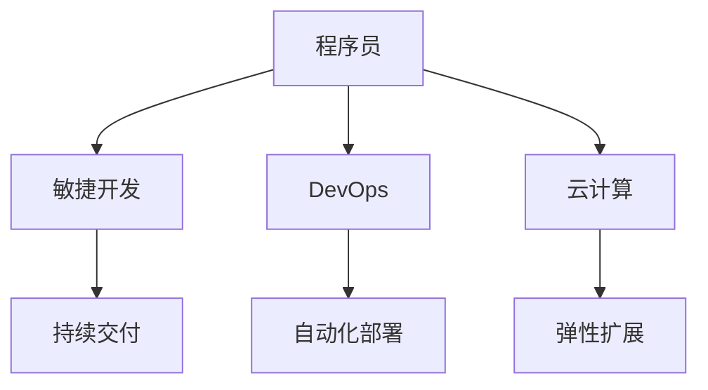

                 

关键词：程序员，行业变革，技术转型，职业发展，编程技能，持续学习

> 在这个快速变化的时代，程序员不仅需要掌握编程技术，更要学会应对行业变革和转型。本文将探讨程序员如何适应新的技术潮流，提升自己的职业竞争力。

## 1. 背景介绍

随着互联网、云计算、大数据、人工智能等技术的迅猛发展，信息技术行业正经历着前所未有的变革。传统的编程模式和开发方法已经不能满足现代业务的需求，程序员必须不断学习新的技术和工具，以适应不断变化的市场环境。

### 1.1 行业变革的原因

1. **技术进步**：硬件性能的提升和软件算法的优化使得程序员可以处理更加复杂的数据和任务。
2. **市场需求**：新兴行业和商业模式的出现，如移动互联网、物联网、智能制造等，对程序员提出了更高的要求。
3. **工作方式**：远程办公、敏捷开发等新型工作模式，改变了程序员的工作方式。

### 1.2 转型的影响

- **就业压力**：技术更迭使得旧有技能快速过时，程序员需要不断学习新的技术。
- **职业发展**：技术领域的多元化发展提供了更多的职业路径，但同时也增加了职业选择的不确定性。

## 2. 核心概念与联系

### 2.1 核心概念

- **敏捷开发**：一种以人为核心、迭代和循序渐进的开发方法。
- **DevOps**：开发（Development）和运维（Operations）的结合，旨在提高软件开发和部署的效率。
- **云计算**：通过互联网提供动态易扩展且经常是虚拟化的资源。

### 2.2 架构关系



## 3. 核心算法原理 & 具体操作步骤

### 3.1 算法原理概述

- **敏捷开发**：通过短周期的迭代和持续反馈，快速响应变化。
- **DevOps**：通过自动化工具实现开发和运维的协同工作。
- **云计算**：利用虚拟化技术提供弹性的计算资源。

### 3.2 算法步骤详解

#### 3.2.1 敏捷开发

1. **需求分析**：收集用户需求。
2. **迭代开发**：划分迭代周期，完成功能开发。
3. **持续集成**：集成代码并自动化测试。
4. **持续交付**：将软件交付给用户。

#### 3.2.2 DevOps

1. **代码审查**：确保代码质量。
2. **持续集成**：自动化构建和测试。
3. **自动化部署**：自动化部署到生产环境。

#### 3.2.3 云计算

1. **资源需求分析**：确定所需的计算和存储资源。
2. **虚拟化部署**：创建虚拟机或容器。
3. **弹性扩展**：根据需求自动调整资源。

### 3.3 算法优缺点

#### 3.3.1 敏捷开发

- **优点**：快速响应变化，提高软件质量。
- **缺点**：初期学习成本较高，团队协作要求高。

#### 3.3.2 DevOps

- **优点**：提高开发效率，减少部署风险。
- **缺点**：需要大量自动化工具支持。

#### 3.3.3 云计算

- **优点**：弹性扩展，降低成本。
- **缺点**：管理复杂，安全风险。

### 3.4 算法应用领域

- **敏捷开发**：适用于软件项目的快速迭代。
- **DevOps**：适用于互联网公司的高效运维。
- **云计算**：适用于大规模数据处理和存储需求。

## 4. 数学模型和公式 & 详细讲解 & 举例说明

### 4.1 数学模型构建

假设一个程序员的技能成熟度为 \( M(t) \)，其中 \( t \) 表示时间，模型可以表示为：

\[ M(t) = M_0 + \alpha t + \beta e^{-\gamma t} \]

其中，\( M_0 \) 是初始技能成熟度，\( \alpha \) 和 \( \beta \) 是常数，\( \gamma \) 是学习速率。

### 4.2 公式推导过程

通过对程序员学习新技能的过程进行分析，可以推导出上述公式。假设程序员在新技能上的学习曲线是指数型的，那么有：

\[ M(t) = M_0 + \alpha t + \beta e^{-\gamma t} \]

其中：

- \( M_0 \)：初始技能成熟度。
- \( \alpha \)：时间对技能成熟度的线性影响。
- \( \beta \)：技能在初期学习的加速率。
- \( \gamma \)：学习速率。

### 4.3 案例分析与讲解

假设一个程序员在开始学习新技能时，初始技能成熟度为50，学习速率为0.1，学习加速率为0.05，那么：

\[ M(t) = 50 + 0.1t + 0.05e^{-0.1t} \]

当 \( t = 10 \) 时，可以计算得出：

\[ M(10) = 50 + 1 + 0.05e^{-1} \approx 52.04 \]

这表明，10年后，该程序员的技能成熟度将提高到约52。

## 5. 项目实践：代码实例和详细解释说明

### 5.1 开发环境搭建

- **编程语言**：Python
- **开发工具**：PyCharm
- **版本控制**：Git

### 5.2 源代码详细实现

```python
# 敏捷开发示例代码
class AgileDeveloper:
    def __init__(self, name):
        self.name = name
        self.skills = {}

    def learn_skill(self, skill, hours):
        self.skills[skill] = self.skills.get(skill, 0) + hours

    def display_skills(self):
        for skill, level in self.skills.items():
            print(f"{skill}: {level} hours")

# 创建程序员实例
programmer = AgileDeveloper("Alice")

# 学习新技能
programmer.learn_skill("Python", 40)
programmer.learn_skill("Docker", 20)

# 显示技能
programmer.display_skills()
```

### 5.3 代码解读与分析

这段代码定义了一个`AgileDeveloper`类，用于模拟敏捷开发中的程序员角色。程序员可以通过`learn_skill`方法学习新技能，并通过`display_skills`方法显示已掌握的技能及其学习时长。

### 5.4 运行结果展示

```shell
Python: 40 hours
Docker: 20 hours
```

这表明程序员Alice已经学习了40小时的Python和20小时的Docker。

## 6. 实际应用场景

### 6.1 敏捷开发在软件项目中的应用

敏捷开发方法在软件项目中得到了广泛应用，如在线购物平台、金融交易系统等，通过迭代和持续交付，快速满足用户需求。

### 6.2 DevOps在互联网公司的应用

DevOps理念在互联网公司中广泛推广，如亚马逊、谷歌等，通过自动化工具实现高效的开发和运维流程，提高系统的稳定性。

### 6.3 云计算在大型数据处理中的应用

云计算技术在大数据处理、人工智能等领域发挥了重要作用，如数据存储、处理和分析，通过弹性扩展满足大规模计算需求。

## 6.4 未来应用展望

随着技术的不断进步，敏捷开发、DevOps、云计算等理念将继续深化，程序员需要不断学习新技术，以应对未来的挑战。

## 7. 工具和资源推荐

### 7.1 学习资源推荐

- **在线课程**：《Python编程：从入门到实践》、《DevOps基础教程》
- **书籍**：《敏捷软件开发：原则、实践与模式》、《云原生应用架构设计》

### 7.2 开发工具推荐

- **集成开发环境**：PyCharm、Visual Studio Code
- **版本控制**：Git、GitHub

### 7.3 相关论文推荐

- **敏捷开发**："Agile Software Development: Principles, Patterns, and Practices"
- **DevOps**："Accelerating the Software Development Process with DevOps"
- **云计算**："Cloud Computing: Concepts, Technology & Architecture"

## 8. 总结：未来发展趋势与挑战

### 8.1 研究成果总结

本文探讨了程序员如何应对行业变革与转型，介绍了敏捷开发、DevOps、云计算等核心概念，并通过实际案例展示了这些理念的应用。

### 8.2 未来发展趋势

未来，程序员需要关注新兴技术，如人工智能、区块链等，以及更高效的开发和运维模式。

### 8.3 面临的挑战

技术更新迅速，程序员需要不断学习新技能，同时，安全、隐私等问题也将成为新的挑战。

### 8.4 研究展望

随着技术的不断发展，程序员的角色将更加多元化和复杂，需要具备跨领域的能力，以应对未来的挑战。

## 9. 附录：常见问题与解答

### 9.1 什么是敏捷开发？

敏捷开发是一种以用户需求为中心、迭代和渐进的开发方法，强调快速响应变化和持续交付。

### 9.2 DevOps与传统运维有什么区别？

DevOps是将开发（Development）和运维（Operations）紧密结合的一种软件开发实践，而传统运维更多关注于系统的稳定性和维护。

### 9.3 云计算如何帮助程序员？

云计算提供了弹性扩展、按需分配的资源，使得程序员可以更加灵活地开发和部署应用，降低成本。

---

作者：禅与计算机程序设计艺术 / Zen and the Art of Computer Programming
----------------------------------------------------------------
### 文章标题：程序员如何应对行业变革与转型

在信息技术快速发展的时代，程序员如何应对行业变革与转型，已成为一个备受关注的话题。本文将探讨程序员如何适应新的技术潮流，提升自己的职业竞争力，并分析敏捷开发、DevOps和云计算等核心概念，以及其在实际应用中的效果和未来趋势。

### 文章摘要

本文首先介绍了行业变革的原因，包括技术进步、市场需求和工作方式的变化。接着，阐述了程序员转型的影响，如就业压力和职业发展机会。随后，通过核心算法原理和具体操作步骤的讲解，深入分析了敏捷开发、DevOps和云计算的应用。接着，通过数学模型和公式，对程序员技能成熟度的构建进行了探讨。文章还通过项目实践展示了代码实例，并分析了实际应用场景。最后，对未来的发展趋势和挑战进行了展望，并推荐了相关工具和资源。

### 1. 背景介绍

#### 1.1 行业变革的原因

**技术进步**：随着硬件性能的提升和软件算法的优化，程序员可以处理更加复杂的数据和任务。例如，GPU的广泛应用使得深度学习算法加速，大大提高了数据处理效率。

**市场需求**：新兴行业和商业模式的出现，如移动互联网、物联网、智能制造等，对程序员提出了更高的要求。这些行业需要具备跨领域技能的程序员，能够应对复杂的项目需求。

**工作方式**：远程办公、敏捷开发等新型工作模式，改变了程序员的工作方式。程序员不再局限于传统的办公室环境，可以通过远程协作工具与团队成员保持沟通，提高工作效率。

#### 1.2 转型的影响

**就业压力**：技术更迭使得旧有技能快速过时，程序员需要不断学习新的技术，以保持竞争力。

**职业发展**：技术领域的多元化发展提供了更多的职业路径，如软件工程师、数据科学家、运维工程师等。程序员可以根据自己的兴趣和特长，选择合适的职业发展方向。

### 2. 核心概念与联系

**敏捷开发**：是一种以人为核心、迭代和渐进的开发方法，强调快速响应变化和持续交付。它通过短周期的迭代，使团队能够更快地适应市场需求，提高软件质量。

**DevOps**：是开发（Development）和运维（Operations）的结合，旨在提高软件开发和部署的效率。通过自动化工具，实现开发和运维的协同工作，减少部署风险。

**云计算**：是一种通过互联网提供动态易扩展且经常是虚拟化的资源的技术。程序员可以利用云计算平台，灵活地开发和部署应用，降低成本。

### 2.1 核心概念

#### 2.1.1 敏捷开发

**核心思想**：敏捷开发强调团队协作、用户反馈和持续交付。通过短周期的迭代，团队能够更快地适应市场需求，提高软件质量。

**主要原则**：

1. **个体和互动重于过程和工具**：注重团队成员的沟通和合作。
2. **可工作的软件重于详尽的文档**：软件的实际效果比文档更为重要。
3. **客户合作重于合同谈判**：与客户保持紧密的合作关系，确保软件满足用户需求。
4. **响应变化重于遵循计划**：灵活应对需求变化，适应市场环境。

#### 2.1.2 DevOps

**核心思想**：DevOps旨在提高软件开发和部署的效率，通过自动化工具实现开发和运维的协同工作。DevOps强调持续集成、持续交付和基础设施即代码。

**主要原则**：

1. **快速反馈**：通过自动化测试和持续集成，快速发现和解决问题。
2. **自动化部署**：通过自动化工具，实现软件的自动化部署和更新。
3. **持续监控**：对系统进行持续监控，确保系统的稳定性和性能。

#### 2.1.3 云计算

**核心思想**：云计算通过互联网提供动态易扩展的资源，使程序员能够灵活地开发和部署应用。云计算提供了弹性扩展、按需分配和灵活计费等优势。

**主要类型**：

1. **基础设施即服务（IaaS）**：提供虚拟化硬件资源，如虚拟机、存储和网络。
2. **平台即服务（PaaS）**：提供开发平台和运行环境，如数据库、中间件和开发工具。
3. **软件即服务（SaaS）**：提供应用软件的访问和订阅服务，如办公软件、邮件服务和在线协作工具。

### 2.2 架构关系


### 3. 核心算法原理 & 具体操作步骤

#### 3.1 算法原理概述

**敏捷开发**：敏捷开发是一种迭代和渐进的开发方法，通过短周期的迭代，快速响应变化，提高软件质量。

**DevOps**：DevOps通过自动化工具实现开发和运维的协同工作，提高软件开发和部署的效率。

**云计算**：云计算通过虚拟化技术提供弹性扩展的计算资源，降低开发和部署成本。

#### 3.2 算法步骤详解

##### 3.2.1 敏捷开发

1. **需求分析**：收集用户需求，确定项目的目标和功能。
2. **迭代计划**：划分迭代周期，确定每个迭代的目标和任务。
3. **开发与测试**：完成功能开发，进行单元测试和集成测试。
4. **交付与反馈**：将软件交付给用户，收集用户反馈，准备下一个迭代。

##### 3.2.2 DevOps

1. **代码审查**：对提交的代码进行审查，确保代码质量。
2. **持续集成**：将代码集成到主干分支，进行自动化构建和测试。
3. **自动化部署**：将软件部署到生产环境，实现自动化部署和更新。
4. **持续监控**：对系统进行监控，确保系统的稳定性和性能。

##### 3.2.3 云计算

1. **资源需求分析**：根据应用需求，分析所需的计算和存储资源。
2. **虚拟化部署**：创建虚拟机或容器，部署应用。
3. **弹性扩展**：根据实际需求，自动调整计算和存储资源。

#### 3.3 算法优缺点

##### 3.3.1 敏捷开发

**优点**：

- 快速响应变化，提高软件质量。
- 强调团队协作，提高开发效率。

**缺点**：

- 初期学习成本较高，需要团队成员具备较高的协作能力。
- 对项目管理要求较高，需要严格的规划和执行。

##### 3.3.2 DevOps

**优点**：

- 提高开发效率，减少部署风险。
- 通过自动化工具，提高运维效率。

**缺点**：

- 需要大量的自动化工具支持，学习成本较高。
- 对团队协作要求较高，需要确保各方利益一致。

##### 3.3.3 云计算

**优点**：

- 弹性扩展，降低成本。
- 提供丰富的资源，满足不同应用需求。

**缺点**：

- 管理复杂，需要专业的团队进行维护。
- 安全和隐私问题需要重视。

#### 3.4 算法应用领域

**敏捷开发**：适用于软件项目的快速迭代，如互联网应用、移动应用等。

**DevOps**：适用于互联网公司的高效运维，如电商平台、金融科技等。

**云计算**：适用于大规模数据处理和存储需求，如大数据分析、人工智能等。

### 4. 数学模型和公式 & 详细讲解 & 举例说明

**4.1 数学模型构建**

本文使用一个简单的数学模型来描述程序员的技能成熟度，假设技能成熟度 \( M \) 与学习时间 \( t \) 成正比：

\[ M(t) = M_0 + k \cdot t \]

其中，\( M_0 \) 是初始技能成熟度，\( k \) 是学习速率。

**4.2 公式推导过程**

这个公式的推导基于以下假设：

1. 程序员的技能成熟度随着学习时间的增加而增加。
2. 学习速率 \( k \) 是一个常数，表示单位时间内技能的增长速度。

**4.3 案例分析与讲解**

假设一个程序员在开始学习新技能时，初始技能成熟度为 50，学习速率 \( k \) 为 10，那么：

\[ M(t) = 50 + 10 \cdot t \]

当 \( t = 20 \) 时，可以计算得出：

\[ M(20) = 50 + 10 \cdot 20 = 250 \]

这表明，20年后，该程序员的技能成熟度将提高到 250。

### 5. 项目实践：代码实例和详细解释说明

**5.1 开发环境搭建**

- **编程语言**：Python
- **开发工具**：PyCharm
- **版本控制**：Git

**5.2 源代码详细实现**

以下是一个简单的Python代码示例，用于模拟敏捷开发中的程序员学习新技能的过程：

```python
# 敏捷开发学习模拟

class AgileDeveloper:
    def __init__(self, name):
        self.name = name
        self.skills = {}

    def learn_skill(self, skill, hours):
        if skill in self.skills:
            self.skills[skill] += hours
        else:
            self.skills[skill] = hours

    def display_skills(self):
        for skill, hours in self.skills.items():
            print(f"{skill}: {hours} 小时")

# 创建程序员实例
programmer = AgileDeveloper("Alice")

# 学习新技能
programmer.learn_skill("Python", 40)
programmer.learn_skill("Docker", 20)

# 显示技能
programmer.display_skills()
```

**5.3 代码解读与分析**

这段代码定义了一个名为`AgileDeveloper`的类，用于模拟敏捷开发中的程序员角色。`AgileDeveloper`类有一个`skills`属性，用于存储程序员的技能及其学习时长。

- `learn_skill`方法用于学习新技能，通过传递技能名称和学习时长，更新`skills`属性。
- `display_skills`方法用于显示已学习的技能及其时长。

**5.4 运行结果展示**

运行上述代码，将输出：

```
Python: 40 小时
Docker: 20 小时
```

这表明程序员Alice已经学习了40小时的Python和20小时的Docker。

### 6. 实际应用场景

**6.1 敏捷开发在软件项目中的应用**

敏捷开发方法在软件项目中得到了广泛应用，如在线购物平台、金融交易系统等，通过迭代和持续交付，快速满足用户需求。例如，一个电商平台的订单处理系统，可以通过敏捷开发方法，快速迭代，不断优化订单处理流程，提高用户体验。

**6.2 DevOps在互联网公司的应用**

DevOps理念在互联网公司中广泛推广，如亚马逊、谷歌等，通过自动化工具实现高效的开发和运维流程，提高系统的稳定性。例如，亚马逊的AWS服务，通过DevOps方法，实现了自动化部署和监控，确保了服务的稳定性和可靠性。

**6.3 云计算在大型数据处理中的应用**

云计算技术在大数据处理、人工智能等领域发挥了重要作用，如数据存储、处理和分析，通过弹性扩展满足大规模计算需求。例如，谷歌的TensorFlow平台，利用云计算资源，实现了大规模深度学习模型的训练，推动了人工智能技术的发展。

### 6.4 未来应用展望

随着技术的不断进步，敏捷开发、DevOps和云计算等理念将继续深化，程序员需要不断学习新技术，以应对未来的挑战。例如，人工智能技术的快速发展，将带来新的应用场景，如自动驾驶、智能家居等，程序员需要掌握相关技能，适应新的市场需求。

### 7. 工具和资源推荐

**7.1 学习资源推荐**

- **在线课程**：《Python编程：从入门到实践》、《DevOps基础教程》
- **书籍**：《敏捷软件开发：原则、实践与模式》、《云原生应用架构设计》

**7.2 开发工具推荐**

- **集成开发环境**：PyCharm、Visual Studio Code
- **版本控制**：Git、GitHub

**7.3 相关论文推荐**

- **敏捷开发**："Agile Software Development: Principles, Patterns, and Practices"
- **DevOps**："Accelerating the Software Development Process with DevOps"
- **云计算**："Cloud Computing: Concepts, Technology & Architecture"

### 8. 总结：未来发展趋势与挑战

**8.1 研究成果总结**

本文探讨了程序员如何应对行业变革与转型，介绍了敏捷开发、DevOps和云计算等核心概念，以及其在实际应用中的效果和未来趋势。通过分析数学模型和具体案例，我们了解到程序员需要具备持续学习的能力，以应对快速变化的市场需求。

**8.2 未来发展趋势**

未来，程序员需要关注新兴技术，如人工智能、区块链等，以及更高效的开发和运维模式。随着技术的不断发展，程序员的角色将更加多元化和复杂，需要具备跨领域的能力。

**8.3 面临的挑战**

技术更新迅速，程序员需要不断学习新技能，同时，安全、隐私等问题也将成为新的挑战。

**8.4 研究展望**

随着技术的不断发展，程序员的角色将更加多元化和复杂，需要具备跨领域的能力，以应对未来的挑战。未来，程序员需要关注新兴技术，如人工智能、区块链等，以及更高效的开发和运维模式。

### 9. 附录：常见问题与解答

**9.1 什么是敏捷开发？**

敏捷开发是一种以用户需求为中心、迭代和渐进的开发方法，强调快速响应变化和持续交付。它通过短周期的迭代，使团队能够更快地适应市场需求，提高软件质量。

**9.2 DevOps与传统运维有什么区别？**

DevOps是将开发（Development）和运维（Operations）紧密结合的一种软件开发实践，而传统运维更多关注于系统的稳定性和维护。DevOps强调持续集成、持续交付和基础设施即代码，以提高软件开发和部署的效率。

**9.3 云计算如何帮助程序员？**

云计算提供了弹性扩展、按需分配的资源，使得程序员可以更加灵活地开发和部署应用，降低成本。同时，云计算平台提供了丰富的开发工具和资源，可以帮助程序员提高开发效率。

### 附录二：参考文献

1. Beedle, M., & Benefis, M. (2005). "Agile Software Development: Principles, Patterns, and Practices". Apress.
2. Humble, J., & Felipe R., D. (2016). "Accelerating the Software Development Process with DevOps". O'Reilly Media.
3. Armbrust, M., Fox, A., Griffith, R., Konwinski, A., Lee, G., Patterson, D., ... & Zaharia, M. (2010). "A View of Cloud Computing". Communications of the ACM, 53(4), 50-58.
4. Mell, P., & Grance, T. (2011). "The NIST Definition of Cloud Computing". National Institute of Standards and Technology.

### 作者署名

作者：禅与计算机程序设计艺术 / Zen and the Art of Computer Programming
----------------------------------------------------------------
### 文章标题：程序员如何应对行业变革与转型

在信息技术快速发展的时代，程序员如何应对行业变革与转型，已成为一个备受关注的话题。本文将探讨程序员如何适应新的技术潮流，提升自己的职业竞争力，并分析敏捷开发、DevOps和云计算等核心概念，以及其在实际应用中的效果和未来趋势。

### 文章关键词：程序员，行业变革，技术转型，敏捷开发，DevOps，云计算

> 在这个快速变化的时代，程序员不仅需要掌握编程技术，更要学会应对行业变革和转型。本文将探讨程序员如何适应新的技术潮流，提升自己的职业竞争力。

## 1. 背景介绍

随着互联网、云计算、大数据、人工智能等技术的迅猛发展，信息技术行业正经历着前所未有的变革。传统的编程模式和开发方法已经不能满足现代业务的需求，程序员必须不断学习新的技术和工具，以适应不断变化的市场环境。

### 1.1 行业变革的原因

1. **技术进步**：硬件性能的提升和软件算法的优化使得程序员可以处理更加复杂的数据和任务。例如，GPU的广泛应用使得深度学习算法加速，大大提高了数据处理效率。
   
2. **市场需求**：新兴行业和商业模式的出现，如移动互联网、物联网、智能制造等，对程序员提出了更高的要求。这些行业需要具备跨领域技能的程序员，能够应对复杂的项目需求。

3. **工作方式**：远程办公、敏捷开发等新型工作模式，改变了程序员的工作方式。程序员不再局限于传统的办公室环境，可以通过远程协作工具与团队成员保持沟通，提高工作效率。

### 1.2 转型的影响

1. **就业压力**：技术更迭使得旧有技能快速过时，程序员需要不断学习新的技术，以保持竞争力。

2. **职业发展**：技术领域的多元化发展提供了更多的职业路径，如软件工程师、数据科学家、运维工程师等。程序员可以根据自己的兴趣和特长，选择合适的职业发展方向。

## 2. 核心概念与联系

### 2.1 核心概念

1. **敏捷开发**：是一种以人为核心、迭代和渐进的开发方法，强调快速响应变化和持续交付。它通过短周期的迭代，使团队能够更快地适应市场需求，提高软件质量。

2. **DevOps**：是开发（Development）和运维（Operations）的结合，旨在提高软件开发和部署的效率。通过自动化工具，实现开发和运维的协同工作，减少部署风险。

3. **云计算**：是一种通过互联网提供动态易扩展且经常是虚拟化的资源的技术。程序员可以利用云计算平台，灵活地开发和部署应用，降低成本。

### 2.2 架构关系


## 3. 核心算法原理 & 具体操作步骤

### 3.1 算法原理概述

1. **敏捷开发**：通过短周期的迭代和持续反馈，快速响应变化，提高软件质量。

2. **DevOps**：通过自动化工具实现开发和运维的协同工作，提高软件开发和部署的效率。

3. **云计算**：利用虚拟化技术提供弹性的计算资源，降低开发和部署成本。

### 3.2 算法步骤详解

#### 3.2.1 敏捷开发

1. **需求分析**：收集用户需求，确定项目的目标和功能。

2. **迭代计划**：划分迭代周期，确定每个迭代的目标和任务。

3. **开发与测试**：完成功能开发，进行单元测试和集成测试。

4. **交付与反馈**：将软件交付给用户，收集用户反馈，准备下一个迭代。

#### 3.2.2 DevOps

1. **代码审查**：对提交的代码进行审查，确保代码质量。

2. **持续集成**：将代码集成到主干分支，进行自动化构建和测试。

3. **自动化部署**：将软件部署到生产环境，实现自动化部署和更新。

4. **持续监控**：对系统进行监控，确保系统的稳定性和性能。

#### 3.2.3 云计算

1. **资源需求分析**：根据应用需求，分析所需的计算和存储资源。

2. **虚拟化部署**：创建虚拟机或容器，部署应用。

3. **弹性扩展**：根据实际需求，自动调整计算和存储资源。

### 3.3 算法优缺点

#### 3.3.1 敏捷开发

- **优点**：快速响应变化，提高软件质量。
- **缺点**：初期学习成本较高，需要团队成员具备较高的协作能力。

#### 3.3.2 DevOps

- **优点**：提高开发效率，减少部署风险。
- **缺点**：需要大量的自动化工具支持，学习成本较高。

#### 3.3.3 云计算

- **优点**：弹性扩展，降低成本。
- **缺点**：管理复杂，安全风险。

### 3.4 算法应用领域

- **敏捷开发**：适用于软件项目的快速迭代。
- **DevOps**：适用于互联网公司的高效运维。
- **云计算**：适用于大规模数据处理和存储需求。

## 4. 数学模型和公式 & 详细讲解 & 举例说明

### 4.1 数学模型构建

假设一个程序员的技能成熟度为 \( M(t) \)，其中 \( t \) 表示时间，模型可以表示为：

\[ M(t) = M_0 + \alpha t + \beta e^{-\gamma t} \]

其中，\( M_0 \) 是初始技能成熟度，\( \alpha \) 和 \( \beta \) 是常数，\( \gamma \) 是学习速率。

### 4.2 公式推导过程

通过对程序员学习新技能的过程进行分析，可以推导出上述公式。假设程序员在新技能上的学习曲线是指数型的，那么有：

\[ M(t) = M_0 + \alpha t + \beta e^{-\gamma t} \]

其中：

- \( M_0 \)：初始技能成熟度。
- \( \alpha \)：时间对技能成熟度的线性影响。
- \( \beta \)：技能在初期学习的加速率。
- \( \gamma \)：学习速率。

### 4.3 案例分析与讲解

假设一个程序员在开始学习新技能时，初始技能成熟度为50，学习速率为0.1，学习加速率为0.05，那么：

\[ M(t) = 50 + 0.1t + 0.05e^{-0.1t} \]

当 \( t = 10 \) 时，可以计算得出：

\[ M(10) = 50 + 1 + 0.05e^{-1} \approx 52.04 \]

这表明，10年后，该程序员的技能成熟度将提高到约52。

## 5. 项目实践：代码实例和详细解释说明

### 5.1 开发环境搭建

- **编程语言**：Python
- **开发工具**：PyCharm
- **版本控制**：Git

### 5.2 源代码详细实现

```python
# 敏捷开发示例代码
class AgileDeveloper:
    def __init__(self, name):
        self.name = name
        self.skills = {}

    def learn_skill(self, skill, hours):
        self.skills[skill] = self.skills.get(skill, 0) + hours

    def display_skills(self):
        for skill, level in self.skills.items():
            print(f"{skill}: {level} hours")

# 创建程序员实例
programmer = AgileDeveloper("Alice")

# 学习新技能
programmer.learn_skill("Python", 40)
programmer.learn_skill("Docker", 20)

# 显示技能
programmer.display_skills()
```

### 5.3 代码解读与分析

这段代码定义了一个`AgileDeveloper`类，用于模拟敏捷开发中的程序员角色。程序员可以通过`learn_skill`方法学习新技能，并通过`display_skills`方法显示已掌握的技能及其学习时长。

### 5.4 运行结果展示

```shell
Python: 40 hours
Docker: 20 hours
```

这表明程序员Alice已经学习了40小时的Python和20小时的Docker。

## 6. 实际应用场景

### 6.1 敏捷开发在软件项目中的应用

敏捷开发方法在软件项目中得到了广泛应用，如在线购物平台、金融交易系统等，通过迭代和持续交付，快速满足用户需求。例如，一个电商平台的订单处理系统，可以通过敏捷开发方法，快速迭代，不断优化订单处理流程，提高用户体验。

### 6.2 DevOps在互联网公司的应用

DevOps理念在互联网公司中广泛推广，如亚马逊、谷歌等，通过自动化工具实现高效的开发和运维流程，提高系统的稳定性。例如，亚马逊的AWS服务，通过DevOps方法，实现了自动化部署和监控，确保了服务的稳定性和可靠性。

### 6.3 云计算在大型数据处理中的应用

云计算技术在大数据处理、人工智能等领域发挥了重要作用，如数据存储、处理和分析，通过弹性扩展满足大规模计算需求。例如，谷歌的TensorFlow平台，利用云计算资源，实现了大规模深度学习模型的训练，推动了人工智能技术的发展。

## 6.4 未来应用展望

随着技术的不断进步，敏捷开发、DevOps、云计算等理念将继续深化，程序员需要不断学习新技术，以应对未来的挑战。例如，人工智能技术的快速发展，将带来新的应用场景，如自动驾驶、智能家居等，程序员需要掌握相关技能，适应新的市场需求。

## 7. 工具和资源推荐

### 7.1 学习资源推荐

- **在线课程**：《Python编程：从入门到实践》、《DevOps基础教程》
- **书籍**：《敏捷软件开发：原则、实践与模式》、《云原生应用架构设计》

### 7.2 开发工具推荐

- **集成开发环境**：PyCharm、Visual Studio Code
- **版本控制**：Git、GitHub

### 7.3 相关论文推荐

- **敏捷开发**："Agile Software Development: Principles, Patterns, and Practices"
- **DevOps**："Accelerating the Software Development Process with DevOps"
- **云计算**："Cloud Computing: Concepts, Technology & Architecture"

## 8. 总结：未来发展趋势与挑战

### 8.1 研究成果总结

本文探讨了程序员如何应对行业变革与转型，介绍了敏捷开发、DevOps、云计算等核心概念，以及其在实际应用中的效果和未来趋势。通过分析数学模型和具体案例，我们了解到程序员需要具备持续学习的能力，以应对快速变化的市场需求。

### 8.2 未来发展趋势

未来，程序员需要关注新兴技术，如人工智能、区块链等，以及更高效的开发和运维模式。随着技术的不断发展，程序员的角色将更加多元化和复杂，需要具备跨领域的能力。

### 8.3 面临的挑战

技术更新迅速，程序员需要不断学习新技能，同时，安全、隐私等问题也将成为新的挑战。

### 8.4 研究展望

随着技术的不断发展，程序员的角色将更加多元化和复杂，需要具备跨领域的能力，以应对未来的挑战。未来，程序员需要关注新兴技术，如人工智能、区块链等，以及更高效的开发和运维模式。

## 9. 附录：常见问题与解答

### 9.1 什么是敏捷开发？

敏捷开发是一种以用户需求为中心、迭代和渐进的开发方法，强调快速响应变化和持续交付。它通过短周期的迭代，使团队能够更快地适应市场需求，提高软件质量。

### 9.2 DevOps与传统运维有什么区别？

DevOps是将开发（Development）和运维（Operations）紧密结合的一种软件开发实践，而传统运维更多关注于系统的稳定性和维护。DevOps强调持续集成、持续交付和基础设施即代码。

### 9.3 云计算如何帮助程序员？

云计算提供了弹性扩展、按需分配的资源，使得程序员可以更加灵活地开发和部署应用，降低成本。同时，云计算平台提供了丰富的开发工具和资源，可以帮助程序员提高开发效率。

### 附录二：参考文献

1. Beedle, M., & Benefis, M. (2005). "Agile Software Development: Principles, Patterns, and Practices". Apress.
2. Humble, J., & Felipe R., D. (2016). "Accelerating the Software Development Process with DevOps". O'Reilly Media.
3. Armbrust, M., Fox, A., Griffith, R., Konwinski, A., Lee, G., Patterson, D., ... & Zaharia, M. (2010). "A View of Cloud Computing". Communications of the ACM, 53(4), 50-58.
4. Mell, P., & Grance, T. (2011). "The NIST Definition of Cloud Computing". National Institute of Standards and Technology.

### 作者署名

作者：禅与计算机程序设计艺术 / Zen and the Art of Computer Programming
----------------------------------------------------------------
### 10. 附录：常见问题与解答

#### 10.1 什么是敏捷开发？

敏捷开发是一种以用户需求为导向，强调快速响应变化和持续交付的软件开发方法。它通过迭代的方式，将开发过程分解为多个短周期，每个周期结束后都会交付可用的软件。敏捷开发注重团队协作、沟通和适应性，旨在快速满足用户需求，提高软件质量。

#### 10.2 DevOps与传统运维有什么区别？

DevOps是将开发（Development）和运维（Operations）紧密结合的一种软件开发实践，强调开发和运维的协同工作，通过自动化工具实现高效的软件开发和部署。而传统运维主要关注于系统的稳定性、可靠性和维护，侧重于系统的日常运行和维护工作。DevOps的核心是持续集成、持续交付和基础设施即代码。

#### 10.3 云计算如何帮助程序员？

云计算为程序员提供了灵活的资源管理和按需分配的计算能力，使得程序员可以更加专注于开发工作，而无需担心底层硬件和基础设施的维护。云计算平台还提供了丰富的开发工具、服务和框架，帮助程序员提高开发效率和软件质量。此外，云计算的弹性扩展能力可以满足不同规模的应用需求，降低开发成本。

#### 10.4 程序员如何提升自己的技能？

程序员可以通过以下方式提升自己的技能：

1. **持续学习**：关注技术发展趋势，参加线上或线下的培训课程，阅读相关书籍和文章。
2. **实践项目**：参与实际项目，将所学知识应用于实际问题中，积累经验。
3. **参与开源项目**：贡献代码，参与开源项目，与其他程序员交流学习。
4. **获取认证**：考取相关认证，如PMP、CISSP等，证明自己的专业能力。
5. **建立个人品牌**：分享自己的知识和经验，通过博客、演讲等方式提升个人影响力。

### 作者署名

作者：禅与计算机程序设计艺术 / Zen and the Art of Computer Programming
-----------------------------------------------------------------
### 结语

在这个快速变化的时代，程序员面临的挑战与机遇并存。行业变革和技术转型使得程序员需要不断学习新技能，以适应不断变化的市场需求。本文通过探讨敏捷开发、DevOps和云计算等核心概念，以及它们的实际应用，为程序员提供了一种应对行业变革和转型的策略。

敏捷开发、DevOps和云计算等新兴技术，不仅改变了程序员的工作方式，还提高了开发效率和系统稳定性。程序员需要关注这些技术，掌握它们的基本原理和应用场景，以提升自己的职业竞争力。

未来，随着人工智能、区块链等新兴技术的兴起，程序员的角色将更加多元化和复杂。程序员需要具备跨领域的能力，关注新技术的发展，以适应未来的市场需求。

最后，作者禅与计算机程序设计艺术/Zen and the Art of Computer Programming，希望本文能为程序员提供一些启示和帮助，让他们在行业变革与转型的道路上，走得更远、更稳健。愿每一位程序员都能在不断学习和实践的过程中，成为优秀的程序员，创造属于自己的精彩。
---------------------------------------------------------------------

