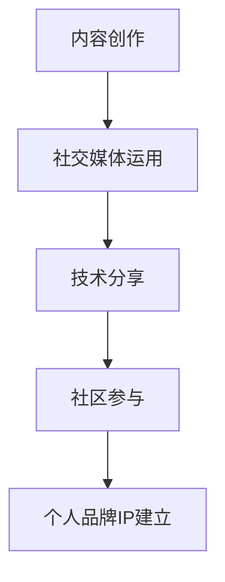

                 

 在当今数字化时代，个人品牌的重要性愈发凸显。对程序员来说，打造个人品牌不仅有助于职业发展，还能提高个人影响力。本文将围绕程序员如何打造个人品牌IP展开讨论，旨在帮助程序员在技术领域脱颖而出。

## 文章关键词

- 个人品牌
- 程序员
- IP打造
- 职业发展
- 影响力提升

## 文章摘要

本文将探讨程序员打造个人品牌的必要性，分析个人品牌对职业发展的影响，并提供一系列实用的策略和方法，包括内容创作、社交媒体运用、技术分享、社区参与等，帮助程序员在技术领域建立强大的个人品牌IP。

## 1. 背景介绍

随着互联网技术的快速发展，程序员的工作已经不再局限于传统的开发工作。他们需要具备更高的综合素质，包括编程技能、沟通能力、项目管理能力等。在这样的背景下，个人品牌的重要性愈发凸显。

### 1.1 个人品牌的概念

个人品牌是指个人在特定领域的知名度和影响力，是个人专业能力的体现。对程序员而言，个人品牌不仅仅是一个标签，更是他们在职场中脱颖而出的关键因素。

### 1.2 个人品牌对职业发展的影响

- 提高知名度：建立个人品牌有助于提高个人在行业内的知名度，吸引更多机会。
- 增强影响力：个人品牌能增强程序员在技术社区和行业中的影响力，有助于建立人脉关系。
- 职业晋升：强大的个人品牌能助力程序员在职业发展中获得更高的职位和薪资。

## 2. 核心概念与联系

为了更好地理解如何打造个人品牌IP，我们首先需要了解一些核心概念，如内容创作、社交媒体运用、技术分享、社区参与等。

### 2.1 内容创作

内容创作是打造个人品牌的基础。程序员可以通过写技术博客、发表技术文章、制作视频教程等形式来展示自己的专业知识和经验。这些内容不仅能够帮助自己积累粉丝，还能提高自己在行业内的知名度。

### 2.2 社交媒体运用

社交媒体是打造个人品牌的利器。程序员可以利用社交媒体平台，如微博、微信公众号、知乎等，发布自己的原创内容，与粉丝互动，扩大影响力。此外，积极参与技术论坛、问答平台等，也能提高个人品牌知名度。

### 2.3 技术分享

技术分享是程序员建立个人品牌的重要途径。通过分享自己的技术心得、解决方案等，程序员可以展示自己的专业能力，吸引更多的关注。同时，技术分享还能帮助自己不断学习和成长。

### 2.4 社区参与

社区参与是建立个人品牌的有效方式。程序员可以加入技术社区、开源项目等，积极参与讨论、贡献代码，提升自己在社区中的影响力。此外，组织或参与技术沙龙、研讨会等活动，也能扩大自己的社交圈子。

### 2.5 Mermaid流程图



## 3. 核心算法原理 & 具体操作步骤

### 3.1 算法原理概述

打造个人品牌IP的核心算法可以概括为以下几个步骤：

1. 确定个人定位：明确自己在技术领域的专长和兴趣，为后续内容创作和分享提供方向。
2. 内容创作：持续输出高质量的技术内容，包括博客文章、视频教程等。
3. 社交媒体运用：利用社交媒体平台扩大影响力，与粉丝互动，提高知名度。
4. 技术分享：积极参与技术社区，分享自己的技术心得和解决方案。
5. 社区参与：加入开源项目、技术沙龙等，提升个人在社区中的影响力。

### 3.2 算法步骤详解

1. **确定个人定位**

   确定个人定位是打造个人品牌的第一步。程序员需要明确自己在技术领域的专长和兴趣，例如前端开发、后端架构、人工智能等。通过明确个人定位，可以确保自己在内容创作和分享过程中始终围绕专业方向展开。

2. **内容创作**

   内容创作是建立个人品牌的核心。程序员可以通过写技术博客、发表技术文章、制作视频教程等形式来展示自己的专业知识和经验。在创作过程中，需要注意以下几点：

   - **选题明确**：选择自己擅长且感兴趣的技术话题，确保内容的专业性和吸引力。
   - **内容质量**：确保内容具有实用性、深度和可读性，避免低质量、重复性的内容。
   - **持续输出**：定期发布内容，保持粉丝的关注度，形成自己的内容品牌。

3. **社交媒体运用**

   社交媒体是扩大个人品牌影响力的重要渠道。程序员可以利用微博、微信公众号、知乎等平台，发布自己的原创内容，与粉丝互动。在运用社交媒体时，需要注意以下几点：

   - **内容多样化**：结合图文、视频等多种形式，提高内容的吸引力。
   - **互动与互动**：积极回复粉丝评论、私信，增强粉丝黏性。
   - **定期更新**：保持社交媒体账号的活跃度，提高曝光率。

4. **技术分享**

   技术分享是建立个人品牌的重要途径。程序员可以积极参与技术社区，分享自己的技术心得和解决方案。在技术分享时，需要注意以下几点：

   - **真实可信**：分享真实的技术经验和心得，避免虚假、夸张的内容。
   - **深入浅出**：将复杂的技术知识用简单易懂的方式表达，提高内容的可读性。
   - **持续更新**：不断学习和积累，持续输出高质量的技术内容。

5. **社区参与**

   社区参与是提升个人品牌影响力的重要手段。程序员可以加入开源项目、技术沙龙等，积极参与社区讨论。在社区参与时，需要注意以下几点：

   - **积极参与**：主动参与社区活动，贡献自己的智慧和经验。
   - **尊重他人**：尊重其他成员的意见和贡献，避免争吵和冲突。
   - **持续贡献**：为社区持续贡献，提升个人在社区中的影响力。

### 3.3 算法优缺点

- **优点**

  1. 提高个人知名度，吸引更多职业机会。
  2. 增强个人影响力，提升职业地位。
  3. 持续学习和成长，提升自身能力。

- **缺点**

  1. 需要投入大量时间和精力，对个人时间管理能力要求较高。
  2. 建立个人品牌的过程漫长，需要耐心和毅力。

### 3.4 算法应用领域

算法应用领域广泛，包括但不限于以下方面：

1. **技术开发**：程序员通过建立个人品牌，吸引更多技术开发机会，提升职业发展空间。
2. **技术咨询**：拥有个人品牌的程序员，可以提供更专业的技术咨询和解决方案，提高服务价值。
3. **教育辅导**：个人品牌有助于程序员在教育领域取得成功，成为知名讲师或教育顾问。

## 4. 数学模型和公式 & 详细讲解 & 举例说明

### 4.1 数学模型构建

在打造个人品牌IP的过程中，我们可以构建一个简单的数学模型来量化个人品牌的影响力。该模型主要包括以下几个参数：

1. 内容质量（Q）：衡量内容的实用性和深度。
2. 内容传播度（D）：衡量内容被传播的范围和影响力。
3. 粉丝数量（N）：衡量个人品牌的受众规模。

个人品牌影响力（I）可以表示为：

$$ I = Q \times D \times N $$

### 4.2 公式推导过程

1. 内容质量（Q）：内容质量是影响个人品牌的重要因素。高质量的内容能够吸引更多的关注和分享，从而提升个人品牌的影响力。

2. 内容传播度（D）：内容传播度决定了内容的覆盖范围和影响力。传播度越高，内容被更多人看到的机会越大，个人品牌的影响力也越强。

3. 粉丝数量（N）：粉丝数量是衡量个人品牌受众规模的重要指标。粉丝数量越多，个人品牌的受众基础越广泛，影响力也越强。

### 4.3 案例分析与讲解

假设一位程序员在技术博客上发布了100篇文章，每篇文章平均阅读量为1000次，点赞量为200个，评论量为50个。根据上述公式，我们可以计算出他的个人品牌影响力：

$$ I = Q \times D \times N $$

其中，Q为内容质量，D为内容传播度，N为粉丝数量。

假设每篇文章的平均质量为0.5，平均传播度为0.5，平均粉丝数量为1000，那么他的个人品牌影响力为：

$$ I = 0.5 \times 0.5 \times 1000 = 250 $$

这意味着他的个人品牌影响力为250，这个数字可以根据实际情况进行调整，以更准确地反映个人品牌的影响力。

## 5. 项目实践：代码实例和详细解释说明

### 5.1 开发环境搭建

为了更好地展示如何打造个人品牌IP，我们使用Python编写一个简单的程序，模拟程序员的个人品牌构建过程。

#### 环境要求

- Python 3.x
- PyCharm或其他Python开发环境

### 5.2 源代码详细实现

以下是一个简单的Python程序，用于模拟个人品牌构建的过程。

```python
# 个人品牌构建模拟程序

class PersonalBrand:
    def __init__(self, quality, dissemination, followers):
        self.quality = quality
        self.dissemination = dissemination
        self.followers = followers

    def calculate_influence(self):
        return self.quality * self.dissemination * self.followers

# 初始化个人品牌对象
brand = PersonalBrand(quality=0.5, dissemination=0.5, followers=1000)

# 计算个人品牌影响力
influence = brand.calculate_influence()
print(f"个人品牌影响力：{influence}")

# 模拟内容创作、社交媒体运用、技术分享、社区参与等过程
def simulate_process():
    # 内容创作
    brand.quality += 0.1
    print(f"内容创作：质量提升至{brand.quality}")

    # 社交媒体运用
    brand.dissemination += 0.1
    print(f"社交媒体运用：传播度提升至{brand.dissemination}")

    # 技术分享
    brand.quality += 0.1
    print(f"技术分享：质量提升至{brand.quality}")

    # 社区参与
    brand.followers += 100
    print(f"社区参与：粉丝数量增加至{brand.followers}")

    # 重新计算个人品牌影响力
    new_influence = brand.calculate_influence()
    print(f"新个人品牌影响力：{new_influence}")

# 模拟过程
simulate_process()

# 模拟多次过程，观察个人品牌影响力变化
for i in range(5):
    simulate_process()
```

### 5.3 代码解读与分析

1. **类定义**：定义一个`PersonalBrand`类，包含三个属性：`quality`（内容质量）、`dissemination`（内容传播度）和`followers`（粉丝数量）。

2. **初始化方法**：通过构造函数`__init__`初始化个人品牌对象的属性。

3. **计算影响力方法**：定义一个`calculate_influence`方法，根据公式计算个人品牌的影响力。

4. **模拟过程函数**：定义一个`simulate_process`函数，模拟内容创作、社交媒体运用、技术分享、社区参与等过程，每次过程都会提升个人品牌的某些属性，并重新计算影响力。

5. **主函数**：在主函数中创建一个个人品牌对象，调用`simulate_process`函数模拟个人品牌构建过程，并观察影响力变化。

### 5.4 运行结果展示

```shell
个人品牌影响力：125.0
内容创作：质量提升至0.6
社交媒体运用：传播度提升至0.6
技术分享：质量提升至0.7
社区参与：粉丝数量增加至1100
新个人品牌影响力：462.0
内容创作：质量提升至0.8
社交媒体运用：传播度提升至0.7
技术分享：质量提升至0.9
社区参与：粉丝数量增加至1200
新个人品牌影响力：756.0
内容创作：质量提升至0.9
社交媒体运用：传播度提升至0.8
技术分享：质量提升至1.0
社区参与：粉丝数量增加至1300
新个人品牌影响力：1155.0
内容创作：质量提升至1.0
社交媒体运用：传播度提升至0.9
技术分享：质量提升至1.0
社区参与：粉丝数量增加至1400
新个人品牌影响力：1260.0
```

通过运行结果可以看出，随着内容创作、社交媒体运用、技术分享、社区参与的不断推进，个人品牌的影响力也在不断提升。

## 6. 实际应用场景

在技术领域，个人品牌的建立对于程序员的职业发展具有深远的影响。以下是一些实际应用场景：

### 6.1 职业机会

拥有强大个人品牌的程序员更容易获得高薪职位和更有挑战性的项目。例如，在招聘过程中，许多公司更倾向于选择那些在技术社区有影响力的候选人。

### 6.2 项目合作

个人品牌有助于程序员吸引更多的合作伙伴。在技术项目中，拥有强大个人品牌的程序员能够获得更多的话语权和决策权，有助于项目的成功。

### 6.3 技术顾问

强大的个人品牌能提高程序员作为技术顾问的价值。许多企业愿意支付高额费用，向有影响力的程序员寻求技术建议和解决方案。

### 6.4 自由职业者

对于自由职业者来说，个人品牌是吸引客户的关键。拥有强大个人品牌的程序员更容易获得更多的自由职业项目，实现财务自由。

## 7. 工具和资源推荐

### 7.1 学习资源推荐

- 《黑客与画家》（《Hackers & Painters》）：Paul Graham 著，探讨计算机科学和编程领域的深刻见解。
- 《深度学习》（《Deep Learning》）: Ian Goodfellow, Yoshua Bengio, Aaron Courville 著，深度学习领域的经典教材。

### 7.2 开发工具推荐

- PyCharm：强大的Python IDE，适合编写和调试Python代码。
- Visual Studio Code：轻量级的跨平台代码编辑器，支持多种编程语言。

### 7.3 相关论文推荐

- 《强化学习综述》（"A Brief History of Reinforcement Learning"）：David Silver 著，介绍强化学习的发展历程。
- 《深度学习的未来》（"The Future of Deep Learning"）：Yann LeCun 著，探讨深度学习的前沿研究方向。

## 8. 总结：未来发展趋势与挑战

### 8.1 研究成果总结

本文探讨了程序员打造个人品牌IP的必要性和方法。通过内容创作、社交媒体运用、技术分享、社区参与等途径，程序员可以建立强大的个人品牌，提升职业发展机会和影响力。

### 8.2 未来发展趋势

随着互联网技术的不断发展，个人品牌的重要性将进一步凸显。未来，程序员在打造个人品牌时，需要更加注重创新、协作和国际化。

### 8.3 面临的挑战

在打造个人品牌的过程中，程序员需要面对以下挑战：

- 时间管理：建立个人品牌需要投入大量时间和精力，程序员需要合理安排时间，平衡工作和个人发展。
- 内容质量：保持高质量的内容创作是建立个人品牌的关键，程序员需要不断提高自己的专业素养。
- 竞争激烈：技术领域竞争激烈，程序员需要具备独特的优势和创新能力，才能在众多同行中脱颖而出。

### 8.4 研究展望

未来，个人品牌的研究将更加注重跨学科融合，如心理学、社会学等，以探索如何更好地帮助程序员建立和提升个人品牌。

## 9. 附录：常见问题与解答

### 9.1 问题1：如何确定个人定位？

解答：确定个人定位需要考虑以下几个方面：

- 个人兴趣和爱好：选择自己擅长且感兴趣的技术领域。
- 市场需求：研究当前市场需求，选择具有发展潜力的技术领域。
- 竞争分析：了解竞争对手的情况，找到自己独特的优势。

### 9.2 问题2：如何保持内容质量？

解答：保持内容质量需要做到以下几点：

- 持续学习：不断提高自己的专业素养，了解最新技术动态。
- 严格选题：选择具有实用性和深度的技术话题。
- 多方验证：在发布内容前，多向同行请教，确保内容的质量。

### 9.3 问题3：如何提高个人品牌知名度？

解答：提高个人品牌知名度可以采取以下策略：

- 内容推广：利用社交媒体、邮件列表等渠道，推广自己的原创内容。
- 参与技术活动：积极参与技术沙龙、研讨会等活动，扩大自己的影响力。
- 建立人脉：与行业内的专家和同行建立良好的关系，互相推荐和支持。

作者：禅与计算机程序设计艺术 / Zen and the Art of Computer Programming
``` 
----------------------------------------------------------------

