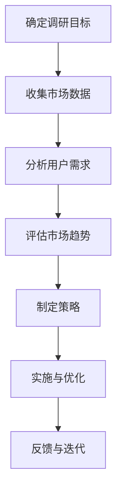

                 

 关键词：知识付费、市场调研、程序员、IT行业、策略、数据分析、用户体验

> 摘要：本文将探讨程序员如何有效进行知识付费的市场调研，包括调研目标、方法论、数据分析以及市场趋势等内容，旨在为程序员在知识付费领域提供实用策略和建议。

## 1. 背景介绍

随着互联网和信息技术的快速发展，知识付费逐渐成为许多程序员获取知识和技能的重要途径。在这一背景下，如何有效地进行市场调研，了解用户需求，制定合理的知识付费策略，成为了每个程序员需要面对的重要课题。市场调研不仅是了解市场状况的途径，更是指导决策、优化服务的必要手段。

## 2. 核心概念与联系

为了更好地进行知识付费的市场调研，首先需要明确几个核心概念：

### 2.1 知识付费

知识付费指的是用户为获取特定知识、技能或信息而支付的费用。在IT行业，知识付费形式多样，包括在线课程、专业书籍、技能培训、一对一辅导等。

### 2.2 市场调研

市场调研是指通过收集、分析和解读市场信息，以了解市场需求、用户行为和竞争对手状况的过程。在知识付费领域，市场调研有助于发现潜在用户、评估市场潜力、优化产品和服务。

### 2.3 用户需求

用户需求是指用户对于知识、技能或服务的期望和需求。理解用户需求是知识付费产品成功的关键，通过调研可以获取用户的真实需求，从而提供更有针对性的内容。

### 2.4 市场趋势

市场趋势是指市场在一定时间内呈现出的总体发展方向和特点。了解市场趋势有助于预测未来需求，及时调整战略，抢占市场先机。

### 2.5 Mermaid 流程图

为了更好地理解知识付费市场调研的流程，以下是使用Mermaid绘制的流程图：



## 3. 核心算法原理 & 具体操作步骤

### 3.1 算法原理概述

知识付费市场调研的核心算法原理是基于数据分析的方法论，主要包括以下几个步骤：

- **数据收集**：通过线上调查、用户访谈、市场报告等方式获取原始数据。
- **数据分析**：运用统计学和机器学习算法对数据进行分析，提取关键信息。
- **用户需求识别**：通过分析用户行为和反馈，识别用户真实需求。
- **市场趋势预测**：基于历史数据和当前市场状况，预测未来市场趋势。
- **策略制定与优化**：根据分析结果制定相应的策略，并通过实施与反馈不断优化。

### 3.2 算法步骤详解

#### 3.2.1 确定调研目标

首先，需要明确调研的目标，例如：了解程序员对于特定技能的需求、评估在线课程的市场潜力、分析竞争对手的营销策略等。

#### 3.2.2 收集市场数据

根据调研目标，采用多种方式收集数据，如：

- **在线调查**：通过设计问卷，收集程序员对知识付费的态度和需求。
- **用户访谈**：通过与程序员进行一对一访谈，深入了解他们的需求和痛点。
- **市场报告**：购买或参考相关的市场研究报告，获取行业数据和趋势。

#### 3.2.3 分析用户需求

通过对收集到的数据进行统计分析，提取出关键信息，如：

- **技能需求分布**：分析程序员对各种技能的需求程度。
- **学习偏好**：了解程序员在知识付费方面的学习习惯和偏好。
- **支付意愿**：评估程序员对知识付费的支付意愿和价格敏感度。

#### 3.2.4 评估市场趋势

通过分析历史数据和当前市场状况，预测未来市场趋势，如：

- **技术发展趋势**：预测未来哪些技能将成为热门，从而指导内容创作。
- **市场增长预测**：预测知识付费市场的未来增长趋势，制定相应策略。

#### 3.2.5 制定策略

根据分析结果，制定相应的知识付费策略，如：

- **课程设计**：根据用户需求设计有针对性的课程。
- **营销推广**：根据市场趋势制定有效的营销策略。
- **价格策略**：根据用户支付意愿制定合理的价格策略。

#### 3.2.6 实施与优化

根据制定的策略实施市场调研，并在过程中不断收集用户反馈，进行策略优化。

### 3.3 算法优缺点

#### 优点

- **全面性**：通过多渠道收集数据，可以全面了解市场状况。
- **针对性**：根据用户需求和趋势制定策略，提高知识付费产品的针对性。
- **实时性**：通过实时数据分析，可以快速调整策略，应对市场变化。

#### 缺点

- **成本较高**：市场调研需要投入大量的人力、物力和财力。
- **数据质量**：数据收集和处理的准确性直接影响调研结果。

### 3.4 算法应用领域

知识付费市场调研算法主要应用于IT行业，包括：

- **在线教育平台**：通过调研了解用户需求，优化课程设计和推广策略。
- **技术培训公司**：通过调研评估市场潜力，制定招生和培训策略。
- **软件公司**：通过调研了解客户需求，优化产品功能和用户体验。

## 4. 数学模型和公式 & 详细讲解 & 举例说明

### 4.1 数学模型构建

在知识付费市场调研中，常用的数学模型包括：

- **用户行为模型**：描述用户在学习过程中的行为和偏好。
- **市场需求模型**：预测市场对知识付费的需求。
- **价格敏感性模型**：评估用户对价格变化的敏感度。

### 4.2 公式推导过程

以下是一个简单的用户行为模型推导过程：

假设用户行为由三个因素决定：兴趣、能力和支付意愿。

兴趣（Interest）可以用兴趣度（I）表示，取值范围为[0,1]。

能力（Ability）可以用技能水平（A）表示，取值范围为[0,1]。

支付意愿（Willingness to Pay，简称WTP）可以用价格敏感度（P）表示，取值范围为[0,1]。

用户行为（Behavior）可以表示为这三个因素的加权和：

$$
Behavior = Interest \times Ability \times Willingness\ to\ Pay
$$

### 4.3 案例分析与讲解

以下是一个关于技能培训市场调研的案例分析：

假设一个在线教育平台想要了解程序员对于前端开发技能的需求。

**步骤 1：数据收集**

通过在线调查和用户访谈，收集程序员对前端开发技能的兴趣度、技能水平和价格敏感度。

**步骤 2：数据分析**

通过统计分析，得到以下关键数据：

- **兴趣度**：80%的程序员对前端开发技能感兴趣。
- **技能水平**：60%的程序员认为自己的前端开发技能处于中等水平。
- **价格敏感度**：50%的程序员认为当前前端开发课程价格适中。

**步骤 3：用户需求识别**

根据数据分析结果，可以识别出以下用户需求：

- **提升技能**：大部分程序员希望通过学习前端开发技能提升自己的职业竞争力。
- **性价比**：程序员在支付前端开发课程时，更关注课程的性价比。

**步骤 4：市场趋势预测**

通过分析历史数据和当前市场状况，预测前端开发技能在未来将继续受到欢迎，市场潜力较大。

**步骤 5：策略制定**

根据分析结果，平台可以制定以下策略：

- **课程优化**：增加前端开发课程的内容和质量，提高用户满意度。
- **价格策略**：推出价格适中的优惠课程，吸引更多用户。

## 5. 项目实践：代码实例和详细解释说明

### 5.1 开发环境搭建

为了进行知识付费市场调研，我们需要搭建一个数据分析和可视化工具。本文选择Python作为主要编程语言，使用Jupyter Notebook作为开发环境。以下是在Jupyter Notebook中搭建开发环境的基本步骤：

```python
!pip install pandas numpy matplotlib seaborn
```

### 5.2 源代码详细实现

以下是一个简单的市场调研数据分析和可视化示例代码：

```python
import pandas as pd
import numpy as np
import matplotlib.pyplot as plt
import seaborn as sns

# 读取数据
data = pd.read_csv('knowledge付费市场调研数据.csv')

# 数据清洗
data = data.dropna()

# 数据分析
# 用户兴趣度分布
interest_distribution = data['兴趣度'].value_counts()
interest_distribution.plot(kind='bar')
plt.title('用户兴趣度分布')
plt.xlabel('兴趣度')
plt.ylabel('用户数量')
plt.show()

# 技能水平分布
ability_distribution = data['技能水平'].value_counts()
ability_distribution.plot(kind='bar')
plt.title('技能水平分布')
plt.xlabel('技能水平')
plt.ylabel('用户数量')
plt.show()

# 价格敏感度分布
price_sensitivity_distribution = data['价格敏感度'].value_counts()
price_sensitivity_distribution.plot(kind='bar')
plt.title('价格敏感度分布')
plt.xlabel('价格敏感度')
plt.ylabel('用户数量')
plt.show()

# 相关性分析
correlation_matrix = data.corr()
sns.heatmap(correlation_matrix, annot=True)
plt.title('相关性分析')
plt.show()
```

### 5.3 代码解读与分析

以上代码首先导入必要的Python库，然后读取市场调研数据，进行数据清洗和统计分析。具体步骤如下：

- **数据读取和清洗**：使用pandas库读取CSV文件，并删除缺失值。
- **数据分析**：分别统计用户兴趣度、技能水平和价格敏感度的分布，并绘制柱状图。
- **相关性分析**：计算各变量之间的相关性，并使用热力图进行可视化。

通过以上步骤，我们可以直观地了解市场调研数据，为后续策略制定提供依据。

### 5.4 运行结果展示

运行以上代码后，会得到以下可视化结果：

- **用户兴趣度分布**：显示不同兴趣度用户的数量。
- **技能水平分布**：显示不同技能水平用户的数量。
- **价格敏感度分布**：显示不同价格敏感度用户的数量。
- **相关性分析**：显示各变量之间的相关性，帮助我们识别用户需求之间的关联。

## 6. 实际应用场景

### 6.1 在线教育平台

在线教育平台通过市场调研，可以了解用户对各种课程的需求和偏好，从而优化课程设计，提高用户满意度。

### 6.2 技术培训公司

技术培训公司通过市场调研，可以评估市场潜力，调整培训策略，吸引更多学员。

### 6.3 软件公司

软件公司通过市场调研，可以了解用户对产品的需求和期望，优化产品功能和用户体验。

## 7. 未来应用展望

随着人工智能和大数据技术的发展，知识付费市场调研的方法和工具将更加智能化和高效化。未来，我们将看到更多基于大数据和机器学习的市场调研算法，帮助程序员更好地了解市场趋势，制定更科学的策略。

## 8. 工具和资源推荐

### 8.1 学习资源推荐

- 《数据科学入门》
- 《Python数据分析》
- 《机器学习实战》

### 8.2 开发工具推荐

- Jupyter Notebook
- Pandas
- Matplotlib
- Seaborn

### 8.3 相关论文推荐

- "Data-Driven Strategies for Knowledge Discovery in Big Data"
- "An Introduction to Market Research"
- "User Behavior Prediction in Online Education Platforms"

## 9. 总结：未来发展趋势与挑战

### 9.1 研究成果总结

本文探讨了程序员如何进行知识付费的市场调研，从核心概念、算法原理、数学模型到实际应用，提供了完整的调研方法和步骤。

### 9.2 未来发展趋势

未来，知识付费市场调研将更加智能化和高效化，借助人工智能和大数据技术，为程序员提供更精准的市场洞察。

### 9.3 面临的挑战

尽管市场调研方法不断进步，但数据质量和分析方法仍存在挑战。如何提高数据质量，提高分析精度，将是未来研究的重要方向。

### 9.4 研究展望

随着技术的不断发展，知识付费市场调研将更加深入和精细，为程序员提供更全面的市场洞察，助力他们在知识付费领域取得成功。

## 附录：常见问题与解答

### Q：市场调研需要多长时间？

A：市场调研的时间取决于调研的目标和范围。一般来说，从数据收集到分析结果输出，可能需要数周甚至数月的时间。

### Q：如何保证数据质量？

A：保证数据质量的关键在于数据收集的方法和过程。采用多渠道收集数据，确保数据的多样性和准确性。在数据分析前，对数据进行严格的清洗和预处理。

### Q：市场调研的成本如何控制？

A：市场调研的成本可以通过以下方式控制：

- **优化调研方法**：采用高效的调研方法，如线上调查、用户访谈等，降低人力和时间成本。
- **利用现有资源**：充分利用现有的市场报告和公开数据，减少购买数据的成本。

### Q：市场调研的结果如何应用？

A：市场调研的结果可以应用于多个方面：

- **课程设计**：根据用户需求调整课程内容和结构。
- **营销策略**：根据市场趋势制定有效的营销策略。
- **产品优化**：根据用户反馈优化产品功能和用户体验。

---

作者：禅与计算机程序设计艺术 / Zen and the Art of Computer Programming

---

本文通过对知识付费市场的深入分析，为程序员提供了系统的市场调研方法和策略。随着技术的不断发展，市场调研将更加高效和精准，为程序员在知识付费领域的发展提供有力支持。希望本文能够为您的市场调研实践提供有益的启示和指导。

