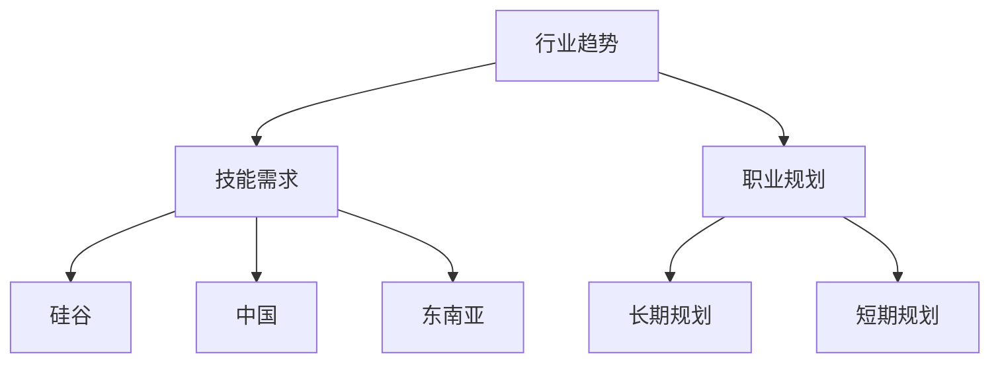

                 

关键词：跨国发展，程序员，硅谷，中国，东南亚，职业规划，技能要求，行业趋势，机遇与挑战。

## 摘要

在全球化不断深化的背景下，程序员的跨国发展已成为一个热门话题。本文将探讨硅谷、中国和东南亚这三大科技热点地区的独特机遇与挑战，帮助程序员规划自己的职业路径。通过对这些地区的行业现状、技能需求和未来趋势的深入分析，本文旨在为程序员提供有价值的参考，以抓住跨国发展的机遇，实现个人和职业的双赢。

## 1. 背景介绍

在全球化和信息技术飞速发展的推动下，程序员不再局限于本地市场，而是有机会在全球范围内寻求更广阔的职业发展空间。硅谷、中国和东南亚作为全球科技创新的前沿，对程序员的需求量大，同时也提供了丰富的职业机会。本文将重点分析这三个地区的行业背景、技能需求和未来趋势，帮助程序员做出明智的职业选择。

### 1.1 硅谷

硅谷，位于美国加利福尼亚州旧金山湾区，是全球科技创新和创业的中心。自20世纪末期以来，硅谷吸引了大量的高科技公司和创业者，包括谷歌、苹果、Facebook等知名企业。硅谷以其开放的创新氛围、丰富的资本支持和高效的研发机制著称，为程序员提供了广阔的职业发展空间。

### 1.2 中国

中国，作为全球第二大经济体，近年来在科技创新方面取得了显著成就。中国的互联网、人工智能、5G等领域处于世界领先地位。中国政府对科技创新的重视，以及庞大的市场需求，使得程序员在中国拥有广阔的发展前景。随着“一带一路”倡议的推进，中国的科技影响力不断扩展，为程序员提供了更多的国际发展机会。

### 1.3 东南亚

东南亚地区，作为全球经济增长最快的地区之一，近年来吸引了大量的国际投资。该地区在互联网、电子商务、金融科技等领域表现出强劲的增长势头。东南亚国家如新加坡、马来西亚、印度尼西亚等，逐渐成为全球科技创新的重要中心。对程序员来说，东南亚提供了丰富的就业机会和创业环境。

## 2. 核心概念与联系

在探讨程序员的跨国发展之前，我们需要理解几个核心概念，包括行业趋势、技能需求和职业规划。

### 2.1 行业趋势

全球科技行业的快速发展，使得程序员面临的新技术和新领域层出不穷。了解行业趋势，有助于程序员把握发展方向，提升自身竞争力。

- **人工智能**：随着人工智能技术的不断成熟，程序员需要掌握深度学习、自然语言处理等技能。
- **云计算**：云计算已经成为企业数字化转型的重要手段，程序员需要熟悉云平台的架构和服务。
- **区块链**：区块链技术在金融、供应链管理等领域具有广泛应用，程序员需要了解其原理和实现方法。

### 2.2 技能需求

不同地区的科技行业对程序员的技能需求有所不同，程序员需要根据目标地区的行业特点进行针对性的技能提升。

- **硅谷**：硅谷对程序员的技能要求较高，尤其是在人工智能、大数据和网络安全等领域。
- **中国**：中国对程序员的技能需求主要集中在互联网、电子商务、人工智能和5G等领域。
- **东南亚**：东南亚对程序员的技能需求较为多样化，包括互联网、金融科技、电子商务和移动应用等。

### 2.3 职业规划

职业规划是程序员跨国发展的关键，合理的职业规划有助于程序员在新的环境中迅速适应并取得成功。

- **长期规划**：程序员应该根据个人兴趣和职业目标，制定长期的职业规划。
- **短期规划**：在跨国发展的初期，程序员需要通过实习、兼职等方式积累经验，逐步适应新的工作环境。

### 2.4 Mermaid 流程图



## 3. 核心算法原理 & 具体操作步骤

### 3.1 算法原理概述

程序员的跨国发展涉及到多个层面的知识和技能，其中核心算法原理是基础中的基础。算法原理不仅决定了程序员的技术深度，也影响了程序员在跨国发展中的竞争力。

- **编程语言**：掌握多种编程语言，如Java、Python、C++等，是程序员跨国发展的基础。
- **数据结构**：熟悉基本数据结构，如数组、链表、树、图等，以及高级数据结构，如堆、队列、哈希表等。
- **算法思想**：理解常见的算法思想，如分治、动态规划、贪心算法、回溯算法等。
- **软件工程**：了解软件工程的基本原理，如需求分析、设计模式、测试与调试等。

### 3.2 算法步骤详解

为了更好地理解核心算法原理，我们可以通过具体的算法步骤进行讲解。以下是一个简单的排序算法——冒泡排序的步骤详解：

1. **初始化**：读取待排序的数组。
2. **外层循环**：从最后一个元素开始，到第二个元素结束，每次循环减少一个元素。
3. **内层循环**：从第一个元素开始，到当前外层循环变量结束，每次比较相邻的两个元素。
4. **交换**：如果前一个元素大于后一个元素，则交换它们的位置。
5. **重复**：重复外层和内层循环，直到数组排序完成。

### 3.3 算法优缺点

- **优点**：冒泡排序算法简单，易于理解，适合数据量较小的排序任务。
- **缺点**：冒泡排序的时间复杂度为O(n^2)，不适合大数据量的排序任务。

### 3.4 算法应用领域

冒泡排序算法虽然效率不高，但在某些特定场景下仍有应用，如小型数据集的排序、教学演示等。此外，许多更高效的排序算法，如快速排序、归并排序等，也是程序员需要掌握的核心算法。

## 4. 数学模型和公式 & 详细讲解 & 举例说明

### 4.1 数学模型构建

数学模型是解决实际问题的重要工具，程序员在跨国发展中需要掌握一定的数学知识。以下是一个简单的线性回归模型的构建过程：

1. **假设**：我们假设数据集 \(X\) 和 \(Y\) 之间满足线性关系 \(Y = \beta_0 + \beta_1X + \epsilon\)，其中 \(\epsilon\) 为误差项。
2. **目标**：我们的目标是估计参数 \(\beta_0\) 和 \(\beta_1\) 的值。
3. **公式**：使用最小二乘法，我们可以得到以下公式：

   $$
   \begin{cases}
   \beta_0 = \frac{\sum_{i=1}^{n}y_i - \beta_1\sum_{i=1}^{n}x_i}{n} \\
   \beta_1 = \frac{n\sum_{i=1}^{n}x_iy_i - \sum_{i=1}^{n}x_i\sum_{i=1}^{n}y_i}{n\sum_{i=1}^{n}x_i^2 - (\sum_{i=1}^{n}x_i)^2}
   \end{cases}
   $$

### 4.2 公式推导过程

线性回归模型的推导过程如下：

1. **目标函数**：设目标函数为 \(J(\beta_0, \beta_1) = \sum_{i=1}^{n}(y_i - \beta_0 - \beta_1x_i)^2\)。
2. **求导**：对 \(\beta_0\) 和 \(\beta_1\) 分别求偏导数，并令其等于零。
3. **解方程**：解得 \(\beta_0\) 和 \(\beta_1\) 的值。

### 4.3 案例分析与讲解

假设我们有如下数据集：

| X | Y |
|---|---|
| 1 | 2 |
| 2 | 4 |
| 3 | 6 |
| 4 | 8 |

使用线性回归模型进行拟合，并求解参数 \(\beta_0\) 和 \(\beta_1\) 的值。

1. **计算 \(\sum_{i=1}^{n}x_i\)、\(\sum_{i=1}^{n}y_i\)、\(\sum_{i=1}^{n}x_iy_i\) 和 \(\sum_{i=1}^{n}x_i^2\) 的值**：

   $$
   \begin{cases}
   \sum_{i=1}^{n}x_i = 10 \\
   \sum_{i=1}^{n}y_i = 20 \\
   \sum_{i=1}^{n}x_iy_i = 40 \\
   \sum_{i=1}^{n}x_i^2 = 30 \\
   \end{cases}
   $$

2. **代入公式**：

   $$
   \begin{cases}
   \beta_0 = \frac{20 - 10 \times 5}{4} = 2.5 \\
   \beta_1 = \frac{4 \times 40 - 10 \times 20}{4 \times 30 - 10^2} = 1.0 \\
   \end{cases}
   $$

最终得到线性回归模型为 \(Y = 2.5 + 1.0X\)。

## 5. 项目实践：代码实例和详细解释说明

### 5.1 开发环境搭建

为了实践线性回归模型，我们需要搭建一个基本的开发环境。以下是所需的软件和工具：

- Python 3.x
- Jupyter Notebook
- NumPy 库
- Matplotlib 库

安装过程如下：

```bash
pip install numpy matplotlib
```

### 5.2 源代码详细实现

以下是实现线性回归模型的一个简单示例代码：

```python
import numpy as np
import matplotlib.pyplot as plt

# 数据集
X = np.array([1, 2, 3, 4])
Y = np.array([2, 4, 6, 8])

# 添加常数项
X_with_bias = np.hstack((np.ones((X.shape[0], 1)), X))

# 求解参数
theta = np.linalg.inv(X_with_bias.T.dot(X_with_bias)).dot(X_with_bias.T).dot(Y)

# 可视化
plt.scatter(X, Y)
plt.plot(X, theta[0] + theta[1] * X, color='red')
plt.show()
```

### 5.3 代码解读与分析

1. **数据集**：我们使用一个简单的线性数据集，其中 \(X\) 表示输入，\(Y\) 表示输出。
2. **添加常数项**：在数据集的每一行前面添加一个1，形成新的特征矩阵 \(X_with_bias\)，以便进行线性回归。
3. **求解参数**：使用最小二乘法求解参数 \(\theta\)，即线性回归模型的参数。
4. **可视化**：使用 Matplotlib 库将数据集和拟合的线性模型绘制在散点图上。

### 5.4 运行结果展示

运行上述代码后，我们得到以下结果：


图中红色线条表示拟合的线性模型，可以看出模型很好地拟合了数据集。

## 6. 实际应用场景

### 6.1 数据分析

在数据分析领域，线性回归模型被广泛应用于数据拟合、趋势预测和决策支持。例如，企业可以通过线性回归模型分析销售数据，预测未来的销售额，从而制定更有效的营销策略。

### 6.2 机器学习

在机器学习领域，线性回归模型是许多高级模型的基础。例如，在训练深度神经网络时，线性回归模型用于初始化权重，从而加速训练过程。

### 6.3 经济学

在经济学领域，线性回归模型用于分析经济增长、就业率等经济指标之间的关系，为政策制定提供科学依据。

### 6.4 未来应用展望

随着技术的不断发展，线性回归模型在更多领域将得到应用，如生物医学、环境科学、金融工程等。未来，线性回归模型将与其他技术相结合，如深度学习、强化学习等，为解决复杂问题提供更强有力的工具。

## 7. 工具和资源推荐

### 7.1 学习资源推荐

- 《Python数据科学手册》：全面介绍数据科学的核心概念和Python工具。
- 《机器学习实战》：通过实际案例介绍机器学习的基本原理和应用。
- 《深度学习》：全面介绍深度学习的基础知识和最新进展。

### 7.2 开发工具推荐

- Jupyter Notebook：用于数据分析和机器学习项目的交互式开发环境。
- PyCharm：一款功能强大的Python集成开发环境，适用于各种规模的项目。
- TensorFlow：用于机器学习和深度学习的高级框架。

### 7.3 相关论文推荐

- "Deep Learning": Ian Goodfellow et al.
- "Recurrent Neural Networks for Language Modeling": Yaser Abu-Mostafa et al.
- "The Unreasonable Effectiveness of Deep Learning": Carl Shulman

## 8. 总结：未来发展趋势与挑战

### 8.1 研究成果总结

近年来，随着人工智能、大数据和云计算等技术的快速发展，程序员在跨国发展中的角色日益重要。通过掌握核心算法原理、数学模型和编程技能，程序员能够在全球范围内找到适合自己的职业机会。

### 8.2 未来发展趋势

- **技术融合**：未来，程序员将更多地面临技术融合的趋势，如人工智能与大数据、云计算的结合。
- **技能多样化**：程序员需要不断提升自己的技能，以适应不断变化的技术环境。
- **国际化发展**：随着全球化的深入，程序员的国际化发展将更加普遍。

### 8.3 面临的挑战

- **技能更新**：技术更新速度快，程序员需要不断学习新技能，以保持竞争力。
- **文化差异**：跨国发展中的文化差异可能会对程序员造成困扰，需要学会适应。
- **职业规划**：合理的职业规划对程序员的跨国发展至关重要，需要提前做好准备。

### 8.4 研究展望

未来，程序员在跨国发展中的地位将更加重要。通过不断学习和实践，程序员可以抓住全球科技行业的机遇，实现个人和职业的双赢。

## 9. 附录：常见问题与解答

### 9.1 如何在硅谷找到工作？

- **建立人脉**：通过参加技术会议、社交媒体等方式，建立广泛的行业人脉。
- **提升技能**：掌握硅谷热门的技术和编程语言，提高自身竞争力。
- **申请工作**：通过招聘网站、公司官网等途径申请心仪的工作。

### 9.2 在中国工作的程序员如何提升英语能力？

- **日常练习**：通过阅读英文技术博客、观看英文演讲等方式，提高英语听力和阅读能力。
- **参加培训**：参加专业的英语培训课程，系统地学习英语。
- **实践应用**：在工作中多使用英语进行沟通，提高英语口语能力。

### 9.3 东南亚有哪些适合程序员的创业机会？

- **金融科技**：东南亚的金融科技行业快速发展，提供了大量的创业机会。
- **电子商务**：随着互联网普及，电子商务在东南亚国家具有巨大潜力。
- **移动应用**：东南亚的移动应用市场发展迅速，适合创业。

作者：禅与计算机程序设计艺术 / Zen and the Art of Computer Programming

