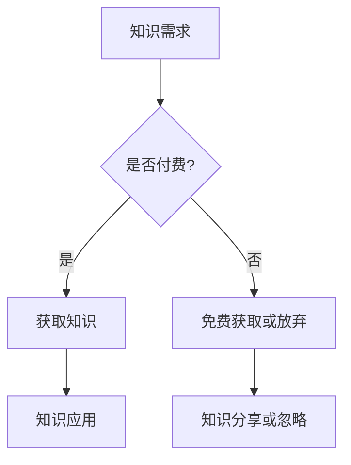

                 

关键词：知识付费，研讨会模式，程序员，在线教育，内容营销

> 摘要：本文将探讨程序员在知识付费领域的机遇，以及如何通过研讨会模式来打造自己的专业品牌，实现个人价值和商业价值的双赢。

## 1. 背景介绍

在互联网时代，知识付费已经成为一种新的商业模式。越来越多的专业人士开始通过在线平台分享自己的知识和经验，获得额外的收入。对于程序员来说，这个领域尤为广阔，因为技术领域的知识更新迅速，程序员们有着丰富的实战经验和独到的见解，这些都是宝贵的知识资源。

### 1.1 程序员知识付费的兴起

知识付费模式的兴起，得益于以下几个因素：

- **技术进步**：互联网技术的发展使得内容传播变得更容易，在线教育和知识分享平台应运而生。
- **用户需求**：随着信息爆炸，用户越来越倾向于有针对性的知识获取，而不再满足于泛泛而谈的免费信息。
- **内容版权**：知识产权的保护使得原创内容的价值得到认可，程序员们开始重视自己的知识成果。

### 1.2 研讨会模式的优势

研讨会模式作为一种知识付费的形式，具有以下几个优势：

- **互动性强**：研讨会能够提供实时交流的机会，用户可以在互动中提出问题，得到解答。
- **内容深度**：研讨会通常围绕特定的主题展开，内容更为专业和深入。
- **品牌效应**：通过举办高质量的研讨会，可以提升个人的专业形象和品牌知名度。

## 2. 核心概念与联系

### 2.1 知识付费

知识付费是指用户为获取特定的知识或服务，愿意支付相应费用的行为。在这个模式中，知识是核心资产，付费行为是交换的核心。

### 2.2 研讨会模式

研讨会模式是一种通过在线或线下方式，围绕特定主题进行深入讨论和交流的场合。它通常包括以下几个部分：

- **主题明确**：研讨会需要有明确的主题，确保参与者对内容有预期的了解。
- **专家演讲**：邀请领域内的专家进行主题演讲，分享他们的经验和见解。
- **互动环节**：设置提问和讨论环节，让参与者能够与专家互动，解决实际问题。
- **持续跟踪**：研讨会结束后，通过线上平台继续跟踪讨论，提供后续服务。

### 2.3 Mermaid 流程图



## 3. 核心算法原理 & 具体操作步骤

### 3.1 算法原理概述

研讨会模式的核心在于如何有效地将知识传递给参与者，并促进知识的实际应用。这需要以下几个关键步骤：

- **需求分析**：了解参与者的知识需求，确定研讨会的主题。
- **内容准备**：根据主题准备相应的教学内容，确保内容的深度和专业性。
- **互动设计**：设计互动环节，促进参与者与专家之间的互动。
- **后续跟踪**：研讨会结束后，通过线上平台继续跟踪讨论，提供后续服务。

### 3.2 算法步骤详解

1. **需求分析**：通过问卷调查、市场调研等方式了解参与者的需求，确定研讨会的主题。
2. **内容准备**：根据主题准备教学内容，包括理论讲解、实战案例、互动环节等。
3. **互动设计**：设计互动环节，如提问、讨论、实战演练等，确保参与者能够积极参与。
4. **研讨会举办**：在线或线下举办研讨会，按照准备的内容进行演讲和互动。
5. **后续跟踪**：研讨会结束后，通过线上平台继续跟踪讨论，提供后续服务，如资料分享、答疑等。

### 3.3 算法优缺点

**优点**：

- **互动性强**：研讨会模式能够提供实时交流的机会，用户可以在互动中提出问题，得到解答。
- **内容深度**：研讨会通常围绕特定的主题展开，内容更为专业和深入。
- **品牌效应**：通过举办高质量的研讨会，可以提升个人的专业形象和品牌知名度。

**缺点**：

- **时间成本**：组织研讨会需要投入大量的时间和精力。
- **技术门槛**：在线研讨会需要一定的技术支持，如视频会议软件、直播平台等。
- **受众范围**：研讨会受众相对有限，难以实现大规模的知识传播。

### 3.4 算法应用领域

研讨会模式可以应用于多个领域，如软件开发、数据分析、人工智能等。以下是几个典型的应用场景：

- **技术培训**：为企业或个人提供技术培训，提高他们的技能水平。
- **行业交流**：为行业内的专业人士提供一个交流和学习的平台。
- **产品推广**：通过研讨会介绍新产品或新技术，吸引潜在客户。

## 4. 数学模型和公式 & 详细讲解 & 举例说明

### 4.1 数学模型构建

研讨会模式的成功与否可以通过以下数学模型进行衡量：

- **参与度**：参与度 = 参与人数 / 潜在受众人数
- **满意度**：满意度 = （解决问题的人数 / 参与人数）× 100%
- **品牌价值**：品牌价值 = 参与者对研讨会评价的正面反馈数 / 负面反馈数

### 4.2 公式推导过程

1. **参与度**：参与度表示研讨会受众的实际参与情况，参与人数越多，参与度越高。

   参与度 = 参与人数 / 潜在受众人数

2. **满意度**：满意度反映了参与者对研讨会的满意度，解决问题的人数越多，满意度越高。

   满意度 = （解决问题的人数 / 参与人数）× 100%

3. **品牌价值**：品牌价值通过参与者对研讨会评价的正面反馈数和负面反馈数进行衡量。

   品牌价值 = 参与者对研讨会评价的正面反馈数 / 负面反馈数

### 4.3 案例分析与讲解

假设某程序员举办的在线研讨会，共有100人参与，其中80人表示解决了实际问题，20人表示没有解决问题。同时，有60人给出了正面评价，10人给出了负面评价。

- **参与度**：参与度 = 100 / 1000 = 10%
- **满意度**：满意度 = （80 / 100）× 100% = 80%
- **品牌价值**：品牌价值 = 60 / 10 = 6

通过以上数据，可以分析出该研讨会的参与度和满意度较高，但品牌价值有待提升。因此，在后续的研讨会中，可以加强问题的解决效果，提高参与者满意度，从而提升品牌价值。

## 5. 项目实践：代码实例和详细解释说明

### 5.1 开发环境搭建

为了更好地展示研讨会模式，我们将使用一个在线教育平台进行实际操作。首先，我们需要搭建一个开发环境。

1. **选择平台**：我们可以选择现有的在线教育平台，如Teachable、Kajabi等，也可以自行搭建基于WordPress的在线教育网站。
2. **配置服务器**：如果自行搭建，需要配置一个Web服务器，如Nginx或Apache，并安装相关的PHP或Node.js环境。
3. **安装主题和插件**：在WordPress平台上，选择一个适合在线教育的主题，并安装相关的插件，如学习管理系统（LMS）插件。

### 5.2 源代码详细实现

以下是一个简单的在线教育平台的源代码示例：

```php
// 注册用户
function register_user($username, $password) {
    // 验证用户名和密码是否符合要求
    // 创建用户账户
    // 发送激活邮件
}

// 登录用户
function login_user($username, $password) {
    // 验证用户名和密码是否正确
    // 登录用户
}

// 创建课程
function create_course($title, $description) {
    // 验证课程信息是否符合要求
    // 创建课程
}

// 答疑
function ask_question($course_id, $user_id, $question) {
    // 验证问题信息是否符合要求
    // 添加问题
}

// 解答问题
function answer_question($question_id, $answer) {
    // 验证答案信息是否符合要求
    // 添加答案
}

// 评论
function comment_question($question_id, $user_id, $comment) {
    // 验证评论信息是否符合要求
    // 添加评论
}
```

### 5.3 代码解读与分析

以上代码展示了在线教育平台的基本功能，包括用户注册、登录、创建课程、答疑和评论等。下面是对关键代码的解读和分析：

- **注册用户**：该函数用于处理用户注册，包括用户名和密码的验证，用户账户的创建，以及激活邮件的发送。
- **登录用户**：该函数用于处理用户登录，包括用户名和密码的验证，用户的登录处理。
- **创建课程**：该函数用于处理课程创建，包括课程信息（如标题、描述）的验证，课程的创建。
- **答疑**：该函数用于处理用户提问，包括问题信息的验证，问题的添加。
- **解答问题**：该函数用于处理专家解答问题，包括答案信息的验证，答案的添加。
- **评论**：该函数用于处理用户评论，包括评论信息的验证，评论的添加。

### 5.4 运行结果展示

假设用户John注册并登录平台后，成功创建了一门名为“Python编程入门”的课程。接着，他提出了一个问题：“如何定义一个函数？”专家Alice在收到问题后，提供了详细的解答。随后，其他用户对解答进行了评论，讨论了相关问题。

通过以上运行结果，可以展示研讨会模式在实际应用中的效果，如用户互动、问题解答和知识传播等。

## 6. 实际应用场景

研讨会模式在程序员知识付费领域具有广泛的应用场景，以下是一些典型的实际应用：

- **技能培训**：程序员可以通过研讨会模式，为其他程序员提供技能培训，如编程语言、框架、工具等。
- **项目分享**：程序员可以分享自己的项目经验，介绍项目的设计思路、开发过程和解决方案。
- **技术交流**：程序员可以组织技术交流会，邀请行业内专家和同行，共同探讨技术发展趋势和问题。
- **产品推广**：程序员可以通过研讨会模式，推广自己的产品或服务，吸引潜在客户。

### 6.1 技能培训

技能培训是研讨会模式最常见的应用场景之一。程序员可以通过在线研讨会，为其他程序员提供技能培训，如Python编程、前端开发、数据库管理等。以下是一个实际案例：

**案例**：某程序员通过在线平台举办了一场名为“深度学习与TensorFlow实践”的研讨会。研讨会内容包括：

- **深度学习基础**：介绍深度学习的基本概念、模型和应用场景。
- **TensorFlow入门**：讲解TensorFlow的基本使用方法和实战技巧。
- **实战案例**：分享一个使用TensorFlow实现的图像识别项目的详细步骤。

通过这次研讨会，参与者不仅学到了深度学习和TensorFlow的知识，还通过实战案例掌握了实际应用技能。

### 6.2 项目分享

项目分享是程序员展示自己技术实力和经验的良好方式。程序员可以通过研讨会模式，分享自己的项目经验，如项目的设计思路、开发过程和解决方案。以下是一个实际案例：

**案例**：某程序员举办了一场名为“基于Spring Boot的电商系统设计与开发”的研讨会。研讨会内容包括：

- **项目概述**：介绍项目的背景、目标和功能模块。
- **技术选型**：讲解项目采用的技术栈，如Spring Boot、MySQL、Redis等。
- **开发过程**：分享项目从需求分析到上线的完整开发过程。
- **解决方案**：介绍项目中的技术难题和解决方案。

通过这次研讨会，参与者了解了如何设计和开发一个完整的电商系统，以及在实际开发过程中遇到的问题和解决方法。

### 6.3 技术交流

技术交流是程序员之间交流和学习的有效途径。程序员可以通过研讨会模式，组织技术交流会，邀请行业内专家和同行，共同探讨技术发展趋势和问题。以下是一个实际案例：

**案例**：某程序员组织了一场名为“前端开发技术沙龙”的研讨会。研讨会内容包括：

- **技术趋势**：介绍当前前端开发领域的发展趋势，如React、Vue.js等。
- **实战经验**：分享前端开发中的实战经验和技巧。
- **问题探讨**：围绕当前前端开发中的热点问题，进行深入探讨和交流。

通过这次研讨会，参与者不仅学到了最新的前端技术，还与同行进行了深入的技术交流，拓展了自己的视野。

### 6.4 产品推广

研讨会模式也可以用于产品推广。程序员可以通过研讨会模式，介绍自己的产品或服务，吸引潜在客户。以下是一个实际案例：

**案例**：某程序员开发了一款名为“代码审查工具”的产品，并通过在线研讨会进行推广。研讨会内容包括：

- **产品介绍**：介绍产品的功能、特点和优势。
- **案例分享**：分享使用该产品的实际案例，展示产品的效果。
- **互动环节**：回答潜在客户的问题，提供试用机会。

通过这次研讨会，该程序员成功吸引了大量潜在客户，提高了产品的知名度。

## 7. 工具和资源推荐

### 7.1 学习资源推荐

- **在线教育平台**：Udemy、Coursera、edX等
- **技术社区**：Stack Overflow、GitHub、Reddit等
- **博客**：Medium、Dev.to、个人博客等
- **书籍**：《代码大全》、《深度学习》、《设计模式》等

### 7.2 开发工具推荐

- **编程语言**：Python、Java、JavaScript等
- **开发框架**：Spring Boot、React、Vue.js等
- **数据库**：MySQL、PostgreSQL、MongoDB等
- **代码审查工具**：Gerrit、Phabricator、GitLab等

### 7.3 相关论文推荐

- **深度学习**：《深度学习：卷积神经网络》、《深度学习中的梯度消失问题》等
- **前端开发**：《React技术揭秘》、《Vue.js设计与实现》等
- **软件工程**：《代码大全》、《敏捷软件开发》等
- **云计算**：《云原生应用架构》、《Kubernetes权威指南》等

## 8. 总结：未来发展趋势与挑战

### 8.1 研究成果总结

本文探讨了程序员知识付费领域的研讨会模式，分析了其优势和应用场景，并给出了具体的操作步骤。通过实际案例和数学模型，展示了研讨会模式在知识传递和品牌建设方面的效果。

### 8.2 未来发展趋势

- **个性化**：研讨会内容将更加个性化，满足不同参与者的需求。
- **多元化**：研讨会形式将更加多样化，包括线上和线下活动。
- **智能化**：研讨会将借助人工智能技术，提供更智能的服务。

### 8.3 面临的挑战

- **内容质量**：确保研讨会内容的专业性和实用性。
- **用户参与**：提高参与者的参与度和满意度。
- **技术支持**：提供稳定可靠的技术支持。

### 8.4 研究展望

未来，研讨会模式将向更加个性化、智能化和多元化的方向发展。程序员可以通过研讨会模式，更好地实现个人价值和商业价值的双赢。

## 9. 附录：常见问题与解答

### 9.1 如何选择研讨会主题？

选择研讨会主题时，可以考虑以下因素：

- **受众需求**：了解目标受众的需求，选择他们感兴趣的主题。
- **自身专长**：选择自己擅长或熟悉的主题，确保内容的专业性和深度。
- **市场趋势**：关注行业趋势和热点话题，选择有市场前景的主题。

### 9.2 如何提高研讨会参与度？

提高研讨会参与度可以从以下几个方面入手：

- **互动设计**：设计有趣的互动环节，如问答、讨论、实战演练等。
- **奖励机制**：设置参与奖励，如优惠券、积分等。
- **内容质量**：提供高质量的内容，确保研讨会对参与者有实际价值。
- **宣传推广**：通过多种渠道进行宣传推广，吸引更多参与者。

### 9.3 如何评估研讨会效果？

评估研讨会效果可以从以下几个方面入手：

- **参与度**：统计参与人数、互动次数等数据，评估参与度。
- **满意度**：通过问卷调查、访谈等方式，了解参与者对研讨会的满意度。
- **品牌价值**：统计研讨会后参与者对个人或品牌的正面评价，评估品牌价值。
- **成果转化**：评估研讨会后参与者在实际工作中应用所学知识的情况。

---

作者：禅与计算机程序设计艺术 / Zen and the Art of Computer Programming

