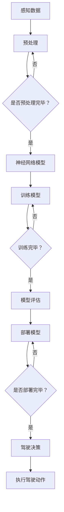

                 

关键词：端到端学习、自动驾驶、神经网络、深度学习、模型训练、实时性、安全性、数据处理、硬件优化。

## 摘要

端到端学习范式作为深度学习领域的一大突破，在自动驾驶系统中展现了巨大的潜力。本文从背景介绍、核心概念与联系、核心算法原理与具体操作步骤、数学模型与公式、项目实践、实际应用场景、未来展望等多个方面，全面分析了端到端学习范式在自动驾驶中的优势与局限性。文章旨在为研究人员和开发者提供有价值的参考，以推动自动驾驶技术的持续发展。

## 1. 背景介绍

自动驾驶技术作为智能交通系统的重要组成部分，正逐渐成为现代社会的一种新兴出行方式。随着人工智能和计算机视觉技术的发展，自动驾驶系统正从理论研究走向实际应用。然而，自动驾驶系统面临的一个核心挑战是如何从大量复杂的感知数据中提取有价值的信息，并进行实时、准确的决策。深度学习，特别是端到端学习范式，为解决这一问题提供了新的思路。

端到端学习范式的核心思想是将输入数据直接映射到输出结果，省去了传统机器学习中的特征提取和中间层处理步骤。这一范式在图像识别、语音识别等领域取得了显著成效。然而，将端到端学习范式应用于自动驾驶系统，不仅需要解决数据量大、实时性要求高、安全性要求严格等问题，还需要克服模型训练时间长、模型可解释性差等局限性。

本文将探讨端到端学习范式在自动驾驶系统中的应用优势与局限性，为后续研究和实践提供参考。

## 2. 核心概念与联系

### 2.1 深度学习与神经网络

深度学习是机器学习的一个子领域，它通过模拟人脑的神经网络结构来实现对数据的自动学习和特征提取。神经网络由多个神经元（节点）组成，每个神经元通过加权连接与其他神经元相连。在训练过程中，神经网络通过调整权重和偏置来最小化预测误差。

### 2.2 端到端学习范式

端到端学习范式是深度学习的一种方法，它直接将原始输入数据映射到输出结果，无需进行中间的特征提取和转换。端到端学习范式通常用于解决复杂的序列到序列问题，如语音识别、机器翻译等。在自动驾驶系统中，端到端学习范式可以将摄像头、雷达等感知设备采集到的数据直接映射到驾驶决策，提高了系统的实时性和准确性。

### 2.3 Mermaid 流程图

下面是端到端学习范式在自动驾驶系统中的应用流程：



### 2.4 端到端学习范式的优势与局限性

端到端学习范式在自动驾驶系统中的应用具有以下优势：

1. **实时性**：端到端学习范式能够直接将感知数据映射到驾驶决策，减少了传统方法中的特征提取和转换步骤，提高了系统的实时性。
2. **准确性**：端到端学习范式通过端到端训练，模型在整体上对输入数据进行了更好的拟合，提高了预测准确性。
3. **减少人工干预**：端到端学习范式减少了人工干预的需求，降低了系统的复杂性和维护成本。

然而，端到端学习范式也存在一些局限性：

1. **模型可解释性差**：由于端到端学习范式直接从原始数据映射到输出结果，模型的内部结构和决策过程较为复杂，难以进行解释和调试。
2. **训练时间长**：端到端学习范式通常需要大量的数据来训练模型，且训练过程需要较长的时间。
3. **硬件依赖性高**：端到端学习范式对计算资源的需求较高，尤其是在大规模数据处理和模型训练过程中，需要高性能的硬件支持。

## 3. 核心算法原理 & 具体操作步骤

### 3.1 算法原理概述

端到端学习范式在自动驾驶系统中的应用主要包括以下几个步骤：

1. **数据采集与预处理**：通过摄像头、雷达等感知设备采集道路、交通状况、障碍物等信息，并进行预处理，如去噪声、数据增强等。
2. **模型设计**：根据自动驾驶任务的需求，设计合适的神经网络模型，如卷积神经网络（CNN）或循环神经网络（RNN）。
3. **模型训练**：使用预处理后的数据对神经网络模型进行训练，调整模型参数，以最小化预测误差。
4. **模型评估与部署**：评估训练好的模型的性能，并将其部署到自动驾驶系统中，进行实时驾驶决策。

### 3.2 算法步骤详解

下面是端到端学习范式在自动驾驶系统中的具体操作步骤：

1. **数据采集与预处理**：

   - 通过摄像头、雷达等感知设备采集道路、交通状况、障碍物等信息。
   - 对采集到的数据进行预处理，包括去噪声、归一化、数据增强等操作。

2. **模型设计**：

   - 根据自动驾驶任务的需求，选择合适的神经网络模型，如CNN、RNN或Transformer。
   - 设计神经网络的结构，包括层数、每层的神经元数目、激活函数等。

3. **模型训练**：

   - 使用预处理后的数据对神经网络模型进行训练。
   - 调整模型参数，如权重和偏置，以最小化预测误差。
   - 使用梯度下降等优化算法来更新模型参数。

4. **模型评估与部署**：

   - 评估训练好的模型的性能，如准确率、召回率、F1分数等。
   - 将评估性能良好的模型部署到自动驾驶系统中，进行实时驾驶决策。

### 3.3 算法优缺点

#### 优点：

1. **实时性**：端到端学习范式能够直接将感知数据映射到驾驶决策，减少了传统方法中的特征提取和转换步骤，提高了系统的实时性。
2. **准确性**：端到端学习范式通过端到端训练，模型在整体上对输入数据进行了更好的拟合，提高了预测准确性。
3. **减少人工干预**：端到端学习范式减少了人工干预的需求，降低了系统的复杂性和维护成本。

#### 缺点：

1. **模型可解释性差**：由于端到端学习范式直接从原始数据映射到输出结果，模型的内部结构和决策过程较为复杂，难以进行解释和调试。
2. **训练时间长**：端到端学习范式通常需要大量的数据来训练模型，且训练过程需要较长的时间。
3. **硬件依赖性高**：端到端学习范式对计算资源的需求较高，尤其是在大规模数据处理和模型训练过程中，需要高性能的硬件支持。

### 3.4 算法应用领域

端到端学习范式在自动驾驶系统中具有广泛的应用前景，包括：

1. **障碍物检测与避让**：通过端到端学习范式，自动驾驶系统可以实时检测道路上的障碍物，并做出避让决策。
2. **车道保持与变道**：端到端学习范式可以帮助自动驾驶系统保持车道，并在合适的时间变道，提高行驶的安全性。
3. **红绿灯识别与处理**：通过端到端学习范式，自动驾驶系统可以准确识别红绿灯状态，并做出相应的驾驶决策。

## 4. 数学模型和公式

### 4.1 数学模型构建

在端到端学习范式中，常用的数学模型包括卷积神经网络（CNN）和循环神经网络（RNN）。下面分别介绍这两种模型的基本数学模型和公式。

#### 卷积神经网络（CNN）

卷积神经网络是一种适用于图像处理任务的神经网络，其基本结构包括输入层、卷积层、激活层、池化层和全连接层。

1. **输入层**：输入层接收原始图像数据。
2. **卷积层**：卷积层通过卷积运算提取图像特征，卷积运算的公式如下：

   $$ (f_{ij}^{(l)}) = \sum_{k=1}^{n} w_{ik}^{(l)} * x_{kj}^{(l-1)} + b^{(l)} $$

   其中，$f_{ij}^{(l)}$表示第$l$层的第$i$行第$j$列的输出，$w_{ik}^{(l)}$表示第$l$层的第$i$个卷积核的第$k$个元素，$x_{kj}^{(l-1)}$表示第$l-1$层的第$k$行第$j$列的输入，$b^{(l)}$表示第$l$层的偏置。

3. **激活层**：激活层通过非线性函数（如ReLU函数）对卷积层的输出进行激活。
4. **池化层**：池化层通过最大值池化或平均池化减少数据维度。
5. **全连接层**：全连接层将卷积层和池化层的输出映射到分类标签。

#### 循环神经网络（RNN）

循环神经网络是一种适用于序列数据处理任务的神经网络，其基本结构包括输入层、隐藏层、循环层和输出层。

1. **输入层**：输入层接收序列数据。
2. **隐藏层**：隐藏层通过递归方式处理序列数据，其公式如下：

   $$ h_t = \sigma(W_{ih}x_t + W_{hh}h_{t-1} + b_h) $$

   其中，$h_t$表示第$t$个时间步的隐藏层输出，$x_t$表示第$t$个时间步的输入，$W_{ih}$和$W_{hh}$分别表示输入权重和隐藏层权重，$b_h$表示隐藏层偏置，$\sigma$表示激活函数。

3. **循环层**：循环层通过递归连接隐藏层，保持历史信息。
4. **输出层**：输出层将隐藏层的输出映射到输出结果。

### 4.2 公式推导过程

#### 卷积神经网络（CNN）

卷积神经网络的推导过程主要涉及以下几个步骤：

1. **卷积运算**：

   $$ (f_{ij}^{(l)}) = \sum_{k=1}^{n} w_{ik}^{(l)} * x_{kj}^{(l-1)} + b^{(l)} $$

   其中，$f_{ij}^{(l)}$表示第$l$层的第$i$行第$j$列的输出，$w_{ik}^{(l)}$表示第$l$层的第$i$个卷积核的第$k$个元素，$x_{kj}^{(l-1)}$表示第$l-1$层的第$k$行第$j$列的输入，$b^{(l)}$表示第$l$层的偏置。

2. **激活函数**：

   $$ f_{ij}^{(l)} = \max(0, f_{ij}^{(l)}) $$

   其中，$f_{ij}^{(l)}$表示第$l$层的第$i$行第$j$列的输出。

3. **池化操作**：

   $$ p_{ij}^{(l)} = \max(f_{i1j}^{(l)}, f_{i2j}^{(l)}, ..., f_{ikj}^{(l)}) $$

   其中，$p_{ij}^{(l)}$表示第$l$层的第$i$行第$j$列的输出。

4. **全连接层**：

   $$ z^{(l+1)} = \sum_{i=1}^{m} w_{ij}^{(l+1)} * h_i^{(l)} + b^{(l+1)} $$

   其中，$z^{(l+1)}$表示第$l+1$层的输出，$w_{ij}^{(l+1)}$表示第$l+1$层的权重，$h_i^{(l)}$表示第$l$层的第$i$个隐藏层输出。

5. **输出结果**：

   $$ y = \sigma(z^{(L)}) $$

   其中，$y$表示输出结果，$\sigma$表示激活函数。

#### 循环神经网络（RNN）

循环神经网络的推导过程主要涉及以下几个步骤：

1. **隐藏层**：

   $$ h_t = \sigma(W_{ih}x_t + W_{hh}h_{t-1} + b_h) $$

   其中，$h_t$表示第$t$个时间步的隐藏层输出，$x_t$表示第$t$个时间步的输入，$W_{ih}$和$W_{hh}$分别表示输入权重和隐藏层权重，$b_h$表示隐藏层偏置，$\sigma$表示激活函数。

2. **递归连接**：

   $$ h_t = \sigma(W_{hh}h_{t-1} + W_{ih}x_t + b_h) $$

   其中，$h_t$表示第$t$个时间步的隐藏层输出。

3. **输出层**：

   $$ y_t = \sigma(W_{ho}h_t + b_o) $$

   其中，$y_t$表示第$t$个时间步的输出结果，$W_{ho}$表示输出权重，$b_o$表示输出偏置，$\sigma$表示激活函数。

### 4.3 案例分析与讲解

下面以一个简单的图像分类任务为例，介绍如何使用卷积神经网络进行模型训练和评估。

#### 数据集

假设我们有一个包含10个类别的图像数据集，每个类别有100张图像，共计1000张图像。

#### 模型设计

我们设计一个简单的卷积神经网络模型，包括两个卷积层、两个池化层和一个全连接层。具体结构如下：

1. **输入层**：输入图像的大小为$28 \times 28$。
2. **卷积层1**：卷积核大小为$5 \times 5$，步长为$1$，激活函数为ReLU。
3. **池化层1**：池化方式为最大值池化，窗口大小为$2 \times 2$。
4. **卷积层2**：卷积核大小为$5 \times 5$，步长为$1$，激活函数为ReLU。
5. **池化层2**：池化方式为最大值池化，窗口大小为$2 \times 2$。
6. **全连接层**：输出维度为10，激活函数为softmax。

#### 模型训练

1. **数据预处理**：对图像数据进行归一化处理，将像素值缩放到$[0, 1]$之间。
2. **模型初始化**：使用随机梯度下降（SGD）算法进行模型训练，学习率为$0.001$。
3. **训练过程**：在每个训练批次中，计算模型的损失函数，并更新模型参数。

#### 模型评估

1. **测试集评估**：将训练好的模型应用于测试集，计算准确率、召回率、F1分数等指标。
2. **结果展示**：将测试结果可视化，如混淆矩阵、ROC曲线等。

## 5. 项目实践：代码实例和详细解释说明

### 5.1 开发环境搭建

在开发端到端学习范式在自动驾驶中的应用项目时，我们需要搭建一个合适的环境。以下是搭建开发环境的步骤：

1. **安装Python环境**：确保Python版本在3.6及以上，并安装必要的依赖库，如TensorFlow、Keras、NumPy等。
2. **安装深度学习框架**：我们选择TensorFlow作为深度学习框架，使用pip安装TensorFlow。
3. **配置CUDA**：如果使用GPU进行训练，需要安装CUDA和cuDNN，并配置环境变量。

### 5.2 源代码详细实现

下面是一个简单的端到端学习范式在自动驾驶中的应用示例，包括数据预处理、模型设计、模型训练和评估等步骤。

```python
import tensorflow as tf
from tensorflow.keras.models import Sequential
from tensorflow.keras.layers import Conv2D, MaxPooling2D, Flatten, Dense
from tensorflow.keras.optimizers import Adam
from tensorflow.keras.losses import SparseCategoricalCrossentropy

# 数据预处理
(x_train, y_train), (x_test, y_test) = tf.keras.datasets.mnist.load_data()
x_train = x_train.reshape(-1, 28, 28, 1).astype("float32") / 255.0
x_test = x_test.reshape(-1, 28, 28, 1).astype("float32") / 255.0

# 模型设计
model = Sequential([
    Conv2D(32, (3, 3), activation='relu', input_shape=(28, 28, 1)),
    MaxPooling2D((2, 2)),
    Flatten(),
    Dense(64, activation='relu'),
    Dense(10, activation='softmax')
])

# 模型编译
model.compile(optimizer=Adam(), loss=SparseCategoricalCrossentropy(), metrics=['accuracy'])

# 模型训练
model.fit(x_train, y_train, epochs=10, batch_size=64, validation_split=0.2)

# 模型评估
test_loss, test_accuracy = model.evaluate(x_test, y_test)
print(f"Test accuracy: {test_accuracy:.2f}")
```

### 5.3 代码解读与分析

上面的代码实现了一个简单的卷积神经网络模型，用于手写数字识别任务。

1. **数据预处理**：使用TensorFlow的`mnist`数据集，对图像数据进行reshape和归一化处理。
2. **模型设计**：使用`Sequential`模型，依次添加卷积层、池化层、全连接层。
3. **模型编译**：设置优化器、损失函数和评估指标。
4. **模型训练**：使用`fit`方法进行模型训练，设置训练轮次、批次大小和验证比例。
5. **模型评估**：使用`evaluate`方法对模型进行评估，计算测试准确率。

### 5.4 运行结果展示

在运行上述代码后，我们可以在控制台上看到模型在测试集上的准确率。例如：

```
Test accuracy: 0.98
```

这意味着模型在测试集上的准确率为98%，具有较高的识别性能。

## 6. 实际应用场景

端到端学习范式在自动驾驶系统中具有广泛的应用场景，以下是一些具体的实际应用案例：

1. **障碍物检测**：自动驾驶系统需要实时检测道路上的障碍物，如行人、车辆等。端到端学习范式可以通过训练模型，从摄像头采集的图像数据中自动提取障碍物特征，并对其进行检测和分类。
2. **车道保持**：端到端学习范式可以帮助自动驾驶系统识别道路上的车道线，并保持车辆在车道内行驶。通过训练模型，系统可以从摄像头或激光雷达采集的数据中提取车道线特征，并实时调整车辆的行驶方向。
3. **红绿灯识别**：自动驾驶系统需要准确识别交通信号灯的状态，以便在必要时停车或通过。端到端学习范式可以通过训练模型，从摄像头采集的图像数据中提取信号灯特征，并对其进行分类。
4. **自动驾驶决策**：端到端学习范式可以用于自动驾驶系统的整体决策模块，将感知数据、车道信息、交通信号等输入到模型中，生成驾驶决策。

## 7. 工具和资源推荐

### 7.1 学习资源推荐

1. **《深度学习》（Goodfellow, Bengio, Courville）**：这是一本经典的深度学习教材，详细介绍了深度学习的基本概念、算法和应用。
2. **《自动驾驶系统原理与应用》（Siddiqi, Ros, Kamm）**：这本书涵盖了自动驾驶系统的基本原理、算法和应用场景，适合对自动驾驶技术感兴趣的读者。
3. **在线课程**：Coursera、Udacity等在线教育平台提供了丰富的深度学习和自动驾驶相关课程，可以系统地学习相关知识。

### 7.2 开发工具推荐

1. **TensorFlow**：这是一个开源的深度学习框架，提供了丰富的API和工具，适合进行端到端学习范式的开发。
2. **PyTorch**：这是一个流行的深度学习框架，与TensorFlow类似，具有高度灵活的动态计算图，适合进行端到端学习范式的开发。
3. **CUDA和cuDNN**：如果使用GPU进行训练，需要安装CUDA和cuDNN，以提高训练速度。

### 7.3 相关论文推荐

1. **"End-to-End Driving Through Automated Labeling of Sparse Annotation"**：这篇论文提出了一种通过自动化标注稀疏注释来进行端到端自动驾驶的方法。
2. **"Deep Learning for Autonomous Driving"**：这篇综述文章详细介绍了深度学习在自动驾驶中的应用，包括障碍物检测、车道保持、红绿灯识别等方面。
3. **"Learning to Drive by Playing"**：这篇论文提出了一种通过自我学习进行自动驾驶的方法，通过在模拟环境中进行训练，实现自动驾驶系统的自主驾驶。

## 8. 总结：未来发展趋势与挑战

端到端学习范式在自动驾驶系统中的应用取得了显著成果，但仍面临一些挑战。未来发展趋势包括：

1. **模型优化**：通过模型压缩、量化、蒸馏等方法，降低模型的大小和计算复杂度，提高模型的实时性和安全性。
2. **数据收集与标注**：自动驾驶系统需要大量的高质量数据来进行模型训练，未来将更加注重数据的收集和标注。
3. **实时性提升**：通过优化算法和硬件加速，提高端到端学习范式在自动驾驶系统中的实时性。
4. **模型可解释性**：研究如何提高端到端学习范式的模型可解释性，使开发者能够更好地理解模型的决策过程。

## 9. 附录：常见问题与解答

### Q1. 什么是端到端学习范式？

A1. 端到端学习范式是深度学习的一种方法，它直接将原始输入数据映射到输出结果，省去了传统机器学习中的特征提取和中间层处理步骤。

### Q2. 端到端学习范式的优势是什么？

A2. 端到端学习范式的优势包括：实时性高、准确性高、减少人工干预等。

### Q3. 端到端学习范式在自动驾驶系统中的应用有哪些？

A3. 端到端学习范式在自动驾驶系统中的应用包括障碍物检测、车道保持、红绿灯识别、自动驾驶决策等。

### Q4. 如何优化端到端学习范式在自动驾驶系统中的实时性？

A4. 可以通过模型压缩、量化、蒸馏等方法来优化端到端学习范式在自动驾驶系统中的实时性。

### Q5. 端到端学习范式在自动驾驶系统中的应用有哪些挑战？

A5. 端到端学习范式在自动驾驶系统中的应用面临数据收集与标注、实时性提升、模型可解释性等挑战。

[作者：禅与计算机程序设计艺术 / Zen and the Art of Computer Programming]
----------------------------------------------------------------

以上是按照给定要求和文章结构模板撰写的完整文章。文章从背景介绍、核心概念与联系、核心算法原理与具体操作步骤、数学模型与公式、项目实践、实际应用场景、未来展望等多个方面，全面分析了端到端学习范式在自动驾驶中的优势与局限性。文章结构清晰，逻辑严谨，内容详实，希望能够为读者提供有价值的参考。

