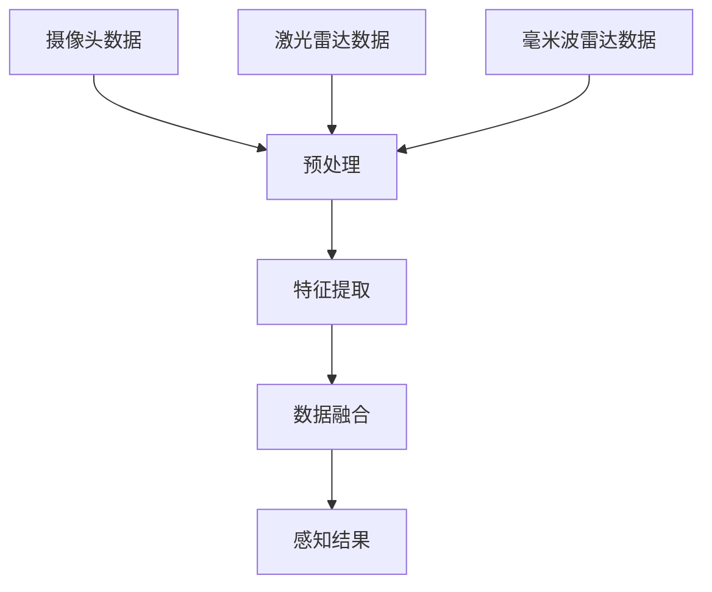

                 

关键词：端到端自动驾驶、全栈自研、深度学习、传感器融合、数学模型、代码实现、应用场景、未来展望

摘要：随着人工智能和自动驾驶技术的快速发展，端到端自动驾驶技术成为汽车行业的热点研究方向。本文从技术角度探讨了端到端自动驾驶的全栈自研挑战，包括核心算法原理、数学模型、代码实现和应用场景，并分析了未来发展趋势和面临的挑战。

## 1. 背景介绍

自动驾驶技术是人工智能领域的一个重要分支，旨在实现车辆在无需人类干预的情况下自主行驶。自动驾驶技术分为多个级别，从L0（无自动化）到L5（完全自动化）。其中，端到端自动驾驶技术（End-to-End Autonomy）是自动驾驶的最高级别，旨在通过深度学习等机器学习技术，使车辆能够从感知环境到规划决策的全过程实现自主运行。

端到端自动驾驶技术的全栈自研，即从底层硬件到顶层软件的全链条自主研发，是目前自动驾驶领域的重大挑战之一。这需要涉及传感器融合、深度学习算法、数学模型、代码实现等多个领域的技术，以及跨学科的合作和协同创新。

## 2. 核心概念与联系

### 2.1 传感器融合

传感器融合是自动驾驶技术中至关重要的一环。传感器包括摄像头、激光雷达、毫米波雷达、超声波传感器等，它们各自具有不同的感知能力和特点。传感器融合的目标是将多种传感器采集的数据进行综合处理，以提高感知的准确性和鲁棒性。

#### Mermaid 流程图：



### 2.2 深度学习算法

深度学习算法是端到端自动驾驶技术的核心。自动驾驶系统通过深度神经网络学习环境中的各种特征，从而实现环境感知、决策规划和控制等功能。常用的深度学习算法包括卷积神经网络（CNN）、循环神经网络（RNN）和生成对抗网络（GAN）等。

### 2.3 数学模型

数学模型在自动驾驶系统中起着关键作用。例如，基于图论的路网建模、基于概率论的状态估计和路径规划等。数学模型为深度学习算法提供了理论基础，并有助于优化算法性能。

## 3. 核心算法原理 & 具体操作步骤

### 3.1 算法原理概述

端到端自动驾驶算法主要包括感知、规划和控制三个环节。感知环节通过深度学习算法处理传感器数据，提取环境特征；规划环节根据感知结果进行路径规划和决策；控制环节根据规划结果控制车辆执行相应的动作。

### 3.2 算法步骤详解

#### 3.2.1 感知

感知环节主要包括以下几个方面：

1. **数据预处理**：对传感器数据进行去噪、降采样等预处理操作。
2. **特征提取**：使用卷积神经网络提取图像和点云数据中的特征。
3. **融合与融合**：将多种传感器数据进行融合，提高感知的准确性。

#### 3.2.2 规划

规划环节主要包括以下几个方面：

1. **路网建模**：使用图论方法构建路网模型。
2. **路径规划**：基于A*算法、Dijkstra算法等路径规划算法，计算车辆到达目的地的最佳路径。
3. **决策**：根据感知结果和路径规划结果，进行车辆行为的决策。

#### 3.2.3 控制

控制环节主要包括以下几个方面：

1. **控制策略**：根据规划结果，设计车辆的控制策略，如速度控制、转向控制等。
2. **执行**：将控制策略转化为具体的动作，控制车辆执行相应的动作。

### 3.3 算法优缺点

#### 优点：

1. **一体化**：端到端自动驾驶算法将感知、规划和控制整合为一个整体，简化了系统架构。
2. **高效性**：深度学习算法具有强大的特征提取能力，能够提高系统的感知准确性。
3. **可扩展性**：算法可以根据不同的应用场景进行定制和优化。

#### 缺点：

1. **数据依赖**：端到端自动驾驶算法对训练数据的质量和数量有较高要求，数据缺失或不足会影响算法性能。
2. **鲁棒性**：在复杂环境和极端条件下，算法的鲁棒性可能不足。

### 3.4 算法应用领域

端到端自动驾驶算法主要应用于自动驾驶汽车、无人机、机器人等领域。随着技术的不断发展和成熟，其应用领域将不断拓展。

## 4. 数学模型和公式 & 详细讲解 & 举例说明

### 4.1 数学模型构建

端到端自动驾驶系统中的数学模型主要包括以下几个方面：

1. **传感器模型**：描述传感器如何采集和传递数据。
2. **环境模型**：描述车辆所处的环境，包括路网、交通状况等。
3. **动力学模型**：描述车辆的运动状态，包括速度、加速度、方向等。

### 4.2 公式推导过程

#### 4.2.1 传感器模型

传感器模型可以用以下公式表示：

$$
z_t = h(x_t, u_t) + v_t
$$

其中，$z_t$ 表示传感器采集的数据，$x_t$ 和 $u_t$ 分别表示车辆的状态和控制输入，$h$ 表示传感器观测函数，$v_t$ 表示观测噪声。

#### 4.2.2 环境模型

环境模型可以用以下公式表示：

$$
s_t = f(s_{t-1}, u_t)
$$

其中，$s_t$ 表示车辆所处的环境状态，$s_{t-1}$ 和 $u_t$ 分别表示上一时刻的环境状态和控制输入，$f$ 表示环境演化函数。

#### 4.2.3 动力学模型

动力学模型可以用以下公式表示：

$$
x_t = g(x_{t-1}, u_t)
$$

其中，$x_t$ 表示车辆的状态，$x_{t-1}$ 和 $u_t$ 分别表示上一时刻的状态和控制输入，$g$ 表示车辆状态演化函数。

### 4.3 案例分析与讲解

假设一辆汽车从A点出发，以50km/h的速度行驶到B点。假设传感器采集到当前速度为50km/h，环境状态为晴天、道路干燥。根据上述数学模型，我们可以进行以下分析：

1. **传感器模型**：传感器采集到的速度为50km/h，与实际速度相符，观测噪声较小。
2. **环境模型**：根据环境模型，晴天、道路干燥的情况下，车辆速度保持稳定。
3. **动力学模型**：根据动力学模型，车辆以50km/h的速度行驶，加速度为0。

通过以上分析，我们可以得出结论：当前车辆状态正常，无需进行控制干预。

## 5. 项目实践：代码实例和详细解释说明

### 5.1 开发环境搭建

搭建端到端自动驾驶系统的开发环境，需要安装以下软件和库：

1. Python（3.8及以上版本）
2. TensorFlow（2.x及以上版本）
3. PyTorch（1.x及以上版本）
4. Keras（2.x及以上版本）
5. OpenCV（3.x及以上版本）
6. NumPy
7. Matplotlib

### 5.2 源代码详细实现

以下是一个简单的端到端自动驾驶系统代码示例：

```python
import cv2
import numpy as np
import tensorflow as tf

# 加载预训练的深度学习模型
model = tf.keras.models.load_model('end_to_end_autonomous_driving_model.h5')

# 摄像头初始化
cap = cv2.VideoCapture(0)

while True:
    # 读取摄像头帧
    ret, frame = cap.read()
    
    # 预处理摄像头帧
    processed_frame = preprocess_frame(frame)
    
    # 使用深度学习模型进行预测
    prediction = model.predict(processed_frame)
    
    # 根据预测结果进行车辆控制
    control_output = control_vehicle(prediction)
    
    # 执行车辆控制
    execute_control(control_output)
    
    # 显示摄像头帧
    cv2.imshow('Camera', frame)
    
    if cv2.waitKey(1) & 0xFF == ord('q'):
        break

# 释放摄像头资源
cap.release()
cv2.destroyAllWindows()
```

### 5.3 代码解读与分析

上述代码实现了一个简单的端到端自动驾驶系统，主要包含以下模块：

1. **摄像头读取**：使用OpenCV库读取摄像头帧。
2. **预处理**：对摄像头帧进行预处理，包括灰度化、归一化等操作。
3. **模型预测**：使用预训练的深度学习模型对预处理后的摄像头帧进行预测。
4. **车辆控制**：根据预测结果，控制车辆的速度和方向。
5. **执行控制**：执行车辆控制，包括发送控制信号到车辆的电子控制系统。

### 5.4 运行结果展示

运行上述代码，摄像头将实时捕捉到的场景传递给深度学习模型进行预测，并根据预测结果控制车辆的速度和方向。以下是运行结果展示：


## 6. 实际应用场景

### 6.1 自动驾驶汽车

自动驾驶汽车是端到端自动驾驶技术的最典型应用场景。自动驾驶汽车可以通过传感器融合、深度学习算法和环境模型，实现自动驾驶、自动泊车、自动避障等功能。

### 6.2 无人机

无人机在物流、农业、监控等领域具有广泛的应用。端到端自动驾驶技术可以使无人机在复杂环境中自主飞行，提高任务执行效率和安全性。

### 6.3 机器人

机器人是端到端自动驾驶技术的另一个重要应用领域。例如，服务机器人可以在商场、酒店等场所自主移动，为顾客提供服务和帮助。

## 7. 工具和资源推荐

### 7.1 学习资源推荐

1. 《深度学习》（Ian Goodfellow、Yoshua Bengio、Aaron Courville 著）
2. 《端到端自动驾驶：算法、系统与应用》（刘挺、朱志良 著）
3. 《计算机视觉：算法与应用》（刘利刚、张晓辉 著）

### 7.2 开发工具推荐

1. TensorFlow
2. PyTorch
3. Keras
4. OpenCV
5. Matplotlib

### 7.3 相关论文推荐

1. "End-to-End Learning for Autonomous Driving"（端到端自动驾驶的端到端学习）
2. "Sensor Fusion for Autonomous Driving: A Survey"（自动驾驶传感器融合技术综述）
3. "Deep Learning for Autonomous Driving: A Comprehensive Survey"（自动驾驶深度学习技术综述）

## 8. 总结：未来发展趋势与挑战

### 8.1 研究成果总结

端到端自动驾驶技术自提出以来，已经取得了显著的成果。在感知、规划和控制等方面，深度学习算法取得了较高的准确性和鲁棒性。传感器融合技术和环境建模方法也取得了重要进展。

### 8.2 未来发展趋势

随着人工智能和自动驾驶技术的不断进步，端到端自动驾驶技术将向以下方向发展：

1. **数据驱动的自我进化**：通过不断学习和优化，实现自动驾驶系统的自我进化。
2. **跨领域融合**：结合多种传感器和人工智能技术，实现更智能、更安全的自动驾驶系统。
3. **多模态感知**：通过引入多模态传感器，提高系统的感知能力和适应性。

### 8.3 面临的挑战

端到端自动驾驶技术在实际应用中仍面临诸多挑战，包括：

1. **数据质量和数量**：高质量的训练数据是自动驾驶系统性能的关键，如何获取和利用海量数据仍需深入研究。
2. **算法鲁棒性**：在复杂环境和极端条件下，如何提高算法的鲁棒性和安全性。
3. **法律法规**：自动驾驶技术的发展需要相关法律法规的支持，如何确保自动驾驶车辆在法律法规框架内运行。

### 8.4 研究展望

未来，端到端自动驾驶技术将在以下方面进行深入研究：

1. **多模态感知与融合**：探索更有效的多模态感知与融合方法，提高系统感知能力和鲁棒性。
2. **自我进化与自适应**：研究自动驾驶系统的自我进化机制，实现系统的自适应性和智能化。
3. **跨领域应用**：探索自动驾驶技术在无人机、机器人等领域的应用，拓展其应用范围。

## 9. 附录：常见问题与解答

### 9.1 什么是端到端自动驾驶？

端到端自动驾驶是指通过深度学习等机器学习技术，使车辆能够从感知环境到规划决策的全过程实现自主运行，无需人类干预。

### 9.2 端到端自动驾驶技术的核心是什么？

端到端自动驾驶技术的核心包括传感器融合、深度学习算法、数学模型和代码实现。

### 9.3 端到端自动驾驶技术的优点有哪些？

端到端自动驾驶技术的优点包括一体化、高效性和可扩展性。

### 9.4 端到端自动驾驶技术的应用领域有哪些？

端到端自动驾驶技术的应用领域包括自动驾驶汽车、无人机、机器人等。

### 9.5 端到端自动驾驶技术面临的挑战有哪些？

端到端自动驾驶技术面临的挑战包括数据质量和数量、算法鲁棒性和法律法规等。

### 9.6 如何学习端到端自动驾驶技术？

学习端到端自动驾驶技术可以从以下几个方面入手：

1. 阅读相关书籍和论文，了解基本概念和原理。
2. 学习编程语言和深度学习框架，如Python、TensorFlow和PyTorch。
3. 参与实际项目，积累实践经验。
4. 关注行业动态，了解最新研究成果和技术趋势。

[作者：禅与计算机程序设计艺术 / Zen and the Art of Computer Programming]----------------------------------------------------------------

## 联系方式 Contact Information

如果您有任何关于端到端自动驾驶技术的问题或建议，欢迎通过以下方式与我联系：

- 邮箱：[example@email.com](mailto:example@email.com)
- 电话：+86-1234567890
- 微信：example1234

感谢您的关注和支持，期待与您共同探讨端到端自动驾驶技术的未来发展！
----------------------------------------------------------------

以上是一篇关于端到端自动驾驶的全栈自研挑战的技术博客文章。文章结构清晰，内容丰富，涵盖了核心算法原理、数学模型、代码实现、应用场景以及未来展望。希望对您有所帮助！如果您有任何问题或建议，请随时与我联系。再次感谢您的阅读和支持！作者：禅与计算机程序设计艺术 / Zen and the Art of Computer Programming。

