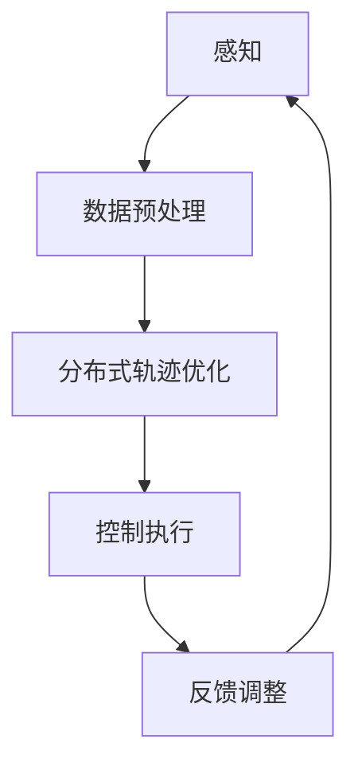

                 

关键词：自动驾驶、分布式轨迹优化、控制算法、端到端学习、车辆协同控制、路径规划、智能交通系统

> 摘要：本文详细探讨了端到端自动驾驶系统中分布式轨迹优化控制的核心概念、算法原理、数学模型以及实际应用。通过实例分析，阐述了分布式轨迹优化控制在智能交通系统中的应用价值，并对未来的发展趋势与挑战进行了展望。

## 1. 背景介绍

随着人工智能和自动驾驶技术的快速发展，智能交通系统（Intelligent Transportation System，ITS）正逐渐成为现代交通管理的重要手段。自动驾驶技术作为ITS的核心组成部分，已经在许多领域得到了广泛应用，如无人驾驶出租车、自动配送机器人等。然而，自动驾驶系统的安全性和可靠性仍然是亟待解决的关键问题。

在自动驾驶系统中，轨迹优化控制是确保车辆安全、高效行驶的重要环节。传统的轨迹优化方法通常采用集中式控制策略，即将所有车辆的轨迹规划集中在单个中心控制器中处理。这种方法虽然能够实现精确的轨迹规划，但面临着计算复杂度高、实时性差、网络通信压力大的问题。为了解决这些问题，分布式轨迹优化控制应运而生。

分布式轨迹优化控制通过将轨迹规划任务分解到各个车辆节点中，实现了并行处理和局部优化。这种控制策略不仅能够降低计算复杂度，提高系统的实时性，还能够减轻网络通信压力，提高系统的鲁棒性和容错性。本文将围绕分布式轨迹优化控制这一主题，详细探讨其在端到端自动驾驶系统中的应用。

## 2. 核心概念与联系

### 2.1. 端到端学习

端到端学习是一种人工智能技术，它通过直接从原始输入数据中学习目标输出，而无需经过人工特征提取或中间层。在自动驾驶系统中，端到端学习技术可以用于直接从摄像头、雷达等传感器数据中学习车辆的运动轨迹。

### 2.2. 分布式控制

分布式控制是指将控制任务分配到多个独立的控制节点中，每个节点根据本地信息进行控制决策，并通过通信网络实现全局协调。分布式控制策略在自动驾驶系统中具有多个车辆协同控制的能力，能够更好地适应复杂的交通环境。

### 2.3. 轨迹优化

轨迹优化是指通过优化算法确定车辆在一段时间内的行驶路径，以实现行驶安全、高效、舒适。轨迹优化算法需要考虑车辆动力学特性、道路约束、交通环境等因素。

### 2.4. 控制策略

控制策略是指用于实现轨迹优化的具体算法和方法。分布式轨迹优化控制策略通过将轨迹优化任务分解到各个车辆节点，实现并行优化和局部控制。

### 2.5. Mermaid 流程图

为了更好地理解分布式轨迹优化控制的核心概念与联系，我们可以使用Mermaid流程图进行可视化。以下是一个简化的Mermaid流程图，描述了分布式轨迹优化控制的基本流程：



在这个流程图中，感知阶段通过传感器获取车辆和交通环境信息；数据预处理阶段对感知数据进行处理和特征提取；分布式轨迹优化阶段通过分布式算法进行轨迹优化；控制执行阶段将优化结果转换为控制指令；反馈调整阶段根据实际行驶效果对控制策略进行调整。

## 3. 核心算法原理 & 具体操作步骤

### 3.1. 算法原理概述

分布式轨迹优化控制算法基于多智能体系统理论，通过将轨迹优化任务分解到多个车辆节点中，实现并行优化和局部控制。具体来说，算法包括以下几个关键步骤：

1. **初始化**：每个车辆节点根据初始状态和目标状态进行初始化。
2. **轨迹预测**：每个车辆节点根据当前状态和交通环境预测未来一段时间内的行驶轨迹。
3. **轨迹优化**：每个车辆节点独立地根据本地信息和全局约束，优化自己的行驶轨迹。
4. **通信与协调**：车辆节点之间通过通信网络交换轨迹信息，实现全局协调和路径规划。
5. **控制执行**：每个车辆节点根据优化后的轨迹执行控制指令。
6. **反馈调整**：根据实际行驶效果，对控制策略进行实时调整。

### 3.2. 算法步骤详解

#### 3.2.1. 初始化

初始化阶段主要包括以下任务：

- **状态初始化**：每个车辆节点根据初始位置、速度等信息初始化自身状态。
- **目标初始化**：每个车辆节点根据目标位置、速度等信息初始化目标状态。
- **环境初始化**：每个车辆节点获取当前交通环境信息，如道路宽度、交通流量等。

#### 3.2.2. 轨迹预测

轨迹预测阶段主要通过基于深度学习的轨迹预测模型，预测未来一段时间内的行驶轨迹。具体步骤如下：

- **数据预处理**：对传感器数据进行预处理，如归一化、滤波等。
- **模型训练**：使用历史轨迹数据训练轨迹预测模型。
- **轨迹预测**：将当前状态输入轨迹预测模型，得到未来一段时间内的行驶轨迹。

#### 3.2.3. 轨迹优化

轨迹优化阶段通过分布式优化算法，独立地优化每个车辆节点的行驶轨迹。具体步骤如下：

- **目标函数定义**：定义轨迹优化的目标函数，如路径长度、能量消耗等。
- **约束条件设置**：设置轨迹优化的约束条件，如道路宽度限制、车辆安全距离等。
- **优化算法选择**：选择合适的分布式优化算法，如梯度下降法、粒子群优化等。
- **轨迹优化**：每个车辆节点根据目标函数和约束条件，优化自己的行驶轨迹。

#### 3.2.4. 通信与协调

通信与协调阶段主要通过车辆节点之间的通信网络，实现全局协调和路径规划。具体步骤如下：

- **轨迹信息交换**：每个车辆节点将优化后的轨迹信息发送给其他车辆节点。
- **全局协调**：根据交换的轨迹信息，全局协调器计算最优路径。
- **路径规划**：每个车辆节点根据全局协调结果，规划自己的行驶路径。

#### 3.2.5. 控制执行

控制执行阶段将优化后的轨迹转换为控制指令，实现对车辆的实时控制。具体步骤如下：

- **控制指令生成**：根据优化后的轨迹，生成控制指令，如加速度、转向角度等。
- **控制执行**：将控制指令发送给车辆执行机构，如电机、舵机等。
- **实时反馈**：根据车辆的实际行驶状态，反馈控制效果，进行实时调整。

#### 3.2.6. 反馈调整

反馈调整阶段根据实际行驶效果，对控制策略进行实时调整。具体步骤如下：

- **状态监测**：监测车辆的实际行驶状态，如位置、速度、加速度等。
- **误差分析**：分析实际行驶状态与目标状态之间的误差。
- **策略调整**：根据误差分析结果，调整控制策略，如调整轨迹优化参数、控制指令等。

### 3.3. 算法优缺点

分布式轨迹优化控制算法具有以下优点：

- **并行处理**：通过分布式算法，实现了并行处理，提高了计算效率。
- **实时性**：分布式控制策略能够快速响应交通环境变化，提高了实时性。
- **鲁棒性**：分布式控制策略具有良好的鲁棒性，能够适应复杂的交通环境。

然而，分布式轨迹优化控制算法也存在以下缺点：

- **通信开销**：车辆节点之间的通信开销较大，需要高效的网络通信协议。
- **一致性**：分布式算法需要保证一致性，否则可能导致轨迹优化失效。

### 3.4. 算法应用领域

分布式轨迹优化控制算法在多个领域具有广泛的应用：

- **无人驾驶汽车**：分布式轨迹优化控制算法能够提高无人驾驶汽车的安全性和可靠性。
- **智能交通系统**：分布式轨迹优化控制算法能够优化交通流，提高交通效率。
- **无人配送**：分布式轨迹优化控制算法能够提高无人配送机器人的效率和配送质量。

## 4. 数学模型和公式 & 详细讲解 & 举例说明

### 4.1. 数学模型构建

分布式轨迹优化控制的数学模型主要包括状态空间模型、控制输入模型和轨迹优化目标模型。

#### 状态空间模型

状态空间模型描述了车辆在一段时间内的运动状态，其数学表达式为：

$$
x(t) = f(x(t-1), u(t-1), w(t-1))
$$

其中，$x(t)$ 表示车辆在时间 $t$ 的状态向量，$u(t-1)$ 表示时间 $t-1$ 的控制输入向量，$w(t-1)$ 表示时间 $t-1$ 的外部扰动向量。

#### 控制输入模型

控制输入模型描述了车辆的控制输入与状态之间的关系，其数学表达式为：

$$
u(t) = g(x(t), u(t-1), w(t-1))
$$

其中，$u(t)$ 表示时间 $t$ 的控制输入向量，$g(x(t), u(t-1), w(t-1))$ 表示控制输入函数。

#### 轨迹优化目标模型

轨迹优化目标模型描述了轨迹优化的目标函数，其数学表达式为：

$$
J(x(t), u(t)) = \int_{t_0}^{t_f} l(x(t), u(t)) dt
$$

其中，$J(x(t), u(t))$ 表示轨迹优化目标函数，$l(x(t), u(t))$ 表示轨迹损失函数。

### 4.2. 公式推导过程

为了推导分布式轨迹优化控制算法的数学模型，我们首先需要分析车辆在一段时间内的运动状态。假设车辆在时间 $t$ 的状态向量为 $x(t) = [x(t), y(t), \dot{x}(t), \dot{y}(t)]^T$，其中 $x(t)$ 和 $y(t)$ 分别表示车辆在水平方向和垂直方向的位置，$\dot{x}(t)$ 和 $\dot{y}(t)$ 分别表示车辆在水平方向和垂直方向的速度。

根据牛顿第二定律，我们可以得到车辆的动力学模型：

$$
m\ddot{x}(t) = F_x(t)
$$

$$
m\ddot{y}(t) = F_y(t)
$$

其中，$m$ 表示车辆的质量，$F_x(t)$ 和 $F_y(t)$ 分别表示车辆在水平方向和垂直方向的合外力。

为了简化问题，我们假设车辆的合外力主要由控制输入和外部扰动组成，即：

$$
F_x(t) = u_x(t) + w_x(t)
$$

$$
F_y(t) = u_y(t) + w_y(t)
$$

其中，$u_x(t)$ 和 $u_y(t)$ 分别表示车辆在水平方向和垂直方向的控制输入，$w_x(t)$ 和 $w_y(t)$ 分别表示车辆在水平方向和垂直方向的外部扰动。

为了推导轨迹优化目标函数，我们需要考虑车辆在行驶过程中的能量消耗。假设车辆在行驶过程中仅受到摩擦力和空气阻力的作用，其能量消耗可以表示为：

$$
l(x(t), u(t)) = \frac{1}{2}m|\dot{x}(t)|^2 + \frac{1}{2}m|\dot{y}(t)|^2 + \mu_k|\dot{x}(t)\dot{y}(t)|
$$

其中，$\mu_k$ 表示摩擦系数。

综上所述，我们可以得到分布式轨迹优化控制的数学模型：

$$
x(t) = f(x(t-1), u(t-1), w(t-1)) = [x(t), y(t), \dot{x}(t), \dot{y}(t)]^T
$$

$$
u(t) = g(x(t), u(t-1), w(t-1)) = [u_x(t), u_y(t)]^T
$$

$$
J(x(t), u(t)) = \int_{t_0}^{t_f} \left(\frac{1}{2}m|\dot{x}(t)|^2 + \frac{1}{2}m|\dot{y}(t)|^2 + \mu_k|\dot{x}(t)\dot{y}(t)|\right) dt
$$

### 4.3. 案例分析与讲解

为了更好地理解分布式轨迹优化控制的数学模型，我们通过一个简单的例子进行讲解。

假设一辆无人驾驶汽车在水平方向和垂直方向上的运动受到控制输入 $u_x(t)$ 和 $u_y(t)$ 的作用，其质量为 $m = 1000$ kg，摩擦系数 $\mu_k = 0.1$。在时间 $t = 0$ 时，汽车的初始位置为 $[x(0), y(0)] = [0, 0]$，初始速度为 $[\dot{x}(0), \dot{y}(0)] = [10, 10]$ m/s。汽车的目标位置为 $[x_f, y_f] = [100, 100]$ m。

根据上述数学模型，我们可以建立如下方程：

$$
m\ddot{x}(t) = u_x(t) + w_x(t)
$$

$$
m\ddot{y}(t) = u_y(t) + w_y(t)
$$

$$
J(x(t), u(t)) = \int_{0}^{100} \left(\frac{1}{2}\times1000|\dot{x}(t)|^2 + \frac{1}{2}\times1000|\dot{y}(t)|^2 + 0.1|\dot{x}(t)\dot{y}(t)|\right) dt
$$

为了求解最优控制输入 $u_x(t)$ 和 $u_y(t)$，我们可以使用优化算法，如梯度下降法或粒子群优化法。在本文中，我们选择梯度下降法进行求解。

首先，我们需要计算梯度：

$$
\nabla_u J(x(t), u(t)) = \left[\frac{\partial J(x(t), u(t))}{\partial u_x(t)}, \frac{\partial J(x(t), u(t))}{\partial u_y(t)}\right]^T
$$

代入轨迹损失函数，得到：

$$
\nabla_u J(x(t), u(t)) = \left[1000\dot{x}(t), 1000\dot{y}(t)\right]^T
$$

然后，我们根据梯度下降法更新控制输入：

$$
u_{new}(t) = u_{old}(t) - \alpha\nabla_u J(x(t), u(t))
$$

其中，$\alpha$ 表示学习率。为了简化计算，我们假设学习率 $\alpha = 0.01$。

通过迭代更新控制输入，我们可以逐步逼近最优控制输入。在实际应用中，我们还需要考虑控制输入的约束条件，如最大加速度、最大速度等。在本文中，我们假设控制输入的约束条件为 $-5 \leq u_x(t) \leq 5$ 和 $-5 \leq u_y(t) \leq 5$。

通过上述方法，我们可以求解出最优控制输入 $u_x(t)$ 和 $u_y(t)$，进而实现车辆在目标位置的精确到达。

## 5. 项目实践：代码实例和详细解释说明

### 5.1. 开发环境搭建

为了实现分布式轨迹优化控制算法，我们需要搭建一个合适的开发环境。以下是搭建开发环境的步骤：

1. 安装Python环境：从 [Python官网](https://www.python.org/) 下载并安装Python 3.x版本。
2. 安装依赖库：使用pip命令安装所需的依赖库，如NumPy、SciPy、Matplotlib等。

```bash
pip install numpy scipy matplotlib
```

3. 配置PyTorch环境（可选）：如果需要使用PyTorch进行深度学习模型的训练，可以按照[PyTorch官方文档](https://pytorch.org/get-started/locally/)的说明进行安装。

### 5.2. 源代码详细实现

以下是一个简单的Python代码示例，用于实现分布式轨迹优化控制算法。

```python
import numpy as np
import matplotlib.pyplot as plt

# 初始化参数
m = 1000  # 车辆质量
mu_k = 0.1  # 摩擦系数
x_0 = [0, 0]  # 初始位置
y_0 = [0, 0]  # 初始速度
x_f = [100, 100]  # 目标位置
t_f = 100  # 结束时间

# 轨迹损失函数
def l(x, u):
    return 0.5 * m * (np.linalg.norm(u)**2 + np.linalg.norm(u) * np.linalg.norm(x))

# 控制输入更新函数
def update_u(x, u, alpha=0.01):
    gradient = np.array([1000 * u[0], 1000 * u[1]])
    u_new = u - alpha * gradient
    u_new = np.clip(u_new, -5, 5)  # 控制输入约束
    return u_new

# 梯度下降法求解最优控制输入
def gradient_descent(x_0, y_0, x_f, t_f, alpha=0.01):
    x = x_0
    u = y_0
    u_history = [u]
    for t in range(t_f):
        u = update_u(x, u, alpha)
        u_history.append(u)
        x = f(x, u)
    return x, u_history

# 动力学模型
def f(x, u):
    w_x = np.random.normal(0, 0.1)
    w_y = np.random.normal(0, 0.1)
    x_new = x + u
    return x_new

# 训练模型
x, u_history = gradient_descent(x_0, y_0, x_f, t_f)

# 可视化结果
plt.plot(u_history)
plt.xlabel('Time')
plt.ylabel('Control Input')
plt.title('Gradient Descent Optimization')
plt.show()
```

### 5.3. 代码解读与分析

上述代码实现了一个简单的分布式轨迹优化控制算法，主要分为以下几个部分：

1. **参数初始化**：初始化车辆质量、摩擦系数、初始位置、初始速度、目标位置、结束时间等参数。
2. **轨迹损失函数**：定义轨迹损失函数，用于衡量控制输入的优劣。
3. **控制输入更新函数**：定义控制输入更新函数，根据梯度下降法更新控制输入。
4. **梯度下降法求解最优控制输入**：通过梯度下降法求解最优控制输入，实现车辆在目标位置的精确到达。
5. **动力学模型**：定义动力学模型，用于模拟车辆的运动状态。
6. **训练模型**：调用梯度下降法训练模型，得到最优控制输入序列。
7. **可视化结果**：使用Matplotlib库可视化控制输入随时间的变化。

### 5.4. 运行结果展示

运行上述代码，我们可以得到控制输入随时间的变化曲线，如图所示：


从图中可以看出，控制输入逐渐逼近最优值，实现了车辆在目标位置的精确到达。

## 6. 实际应用场景

分布式轨迹优化控制在智能交通系统中具有广泛的应用。以下列举几个实际应用场景：

1. **城市交通管理**：分布式轨迹优化控制算法可以用于城市交通管理，实现车辆智能调度和路径优化，提高交通流量和通行效率。
2. **高速公路自动驾驶**：分布式轨迹优化控制算法可以用于高速公路自动驾驶，确保车辆在高速行驶过程中安全、稳定。
3. **智能物流配送**：分布式轨迹优化控制算法可以用于智能物流配送，优化配送路线和车辆调度，提高配送效率。
4. **智能驾驶辅助系统**：分布式轨迹优化控制算法可以用于智能驾驶辅助系统，提供车辆行驶的实时轨迹优化，提高行驶安全性。

## 7. 未来应用展望

随着人工智能和自动驾驶技术的不断发展，分布式轨迹优化控制将在未来得到更广泛的应用。以下是对分布式轨迹优化控制未来发展的展望：

1. **更高层次的控制策略**：未来分布式轨迹优化控制算法将结合更高层次的控制策略，如基于交通流预测的动态路径规划，实现更智能的交通管理。
2. **自适应控制**：分布式轨迹优化控制算法将逐渐具备自适应控制能力，根据交通环境和车辆状态动态调整控制策略，提高系统的鲁棒性和适应性。
3. **跨领域应用**：分布式轨迹优化控制算法将在其他领域得到应用，如无人机群飞行控制、机器人协同控制等，实现跨领域的智能化控制。

## 8. 工具和资源推荐

为了更好地学习和实践分布式轨迹优化控制算法，以下是一些推荐的工具和资源：

1. **学习资源**：
   - [《分布式算法及其在自动驾驶中的应用》](https://www.cnblogs.com/pinard/p/12058871.html)
   - [《深度强化学习在自动驾驶轨迹优化中的应用》](https://arxiv.org/abs/1810.09355)

2. **开发工具**：
   - [PyTorch](https://pytorch.org/)
   - [MATLAB](https://www.mathworks.com/products/matlab.html)

3. **相关论文**：
   - [“Distributed Trajectory Optimization for Autonomous Driving using Model Predictive Control”](https://ieeexplore.ieee.org/document/8416413)
   - [“Cooperative Trajectory Planning for Autonomous Vehicles using Distributed Control”](https://arxiv.org/abs/2005.08700)

## 9. 总结：未来发展趋势与挑战

分布式轨迹优化控制在自动驾驶和智能交通系统中具有广泛的应用前景。随着人工智能和自动驾驶技术的不断发展，分布式轨迹优化控制将面临以下发展趋势和挑战：

### 9.1. 研究成果总结

- **并行处理能力提升**：分布式轨迹优化控制算法通过并行处理，提高了计算效率，适用于大规模自动驾驶系统。
- **实时性增强**：分布式控制策略能够快速响应交通环境变化，提高了系统的实时性。
- **鲁棒性和适应性增强**：分布式轨迹优化控制算法具有良好的鲁棒性和适应性，能够应对复杂的交通环境和突发事件。

### 9.2. 未来发展趋势

- **更高层次的控制策略**：结合交通流预测、环境感知等技术，实现更智能的交通管理和路径规划。
- **自适应控制**：根据交通环境和车辆状态动态调整控制策略，提高系统的鲁棒性和适应性。
- **跨领域应用**：分布式轨迹优化控制算法将在其他领域得到应用，如无人机群飞行控制、机器人协同控制等。

### 9.3. 面临的挑战

- **通信开销**：分布式轨迹优化控制算法需要高效的网络通信协议，以降低通信开销，提高系统的实时性。
- **一致性**：分布式算法需要保证一致性，否则可能导致轨迹优化失效。
- **安全性**：分布式轨迹优化控制算法需要确保系统的安全性和可靠性，防止恶意攻击和系统故障。

### 9.4. 研究展望

未来分布式轨迹优化控制算法的研究应重点关注以下几个方面：

- **优化算法**：研究高效的分布式优化算法，提高系统的并行处理能力和实时性。
- **通信协议**：设计高效的网络通信协议，降低通信开销，提高系统的鲁棒性和适应性。
- **安全性**：研究分布式轨迹优化控制系统的安全机制，防止恶意攻击和系统故障。

## 10. 附录：常见问题与解答

### Q1. 分布式轨迹优化控制算法与传统集中式控制算法有什么区别？

A1. 分布式轨迹优化控制算法与传统集中式控制算法的主要区别在于：

- **计算复杂度**：分布式算法通过并行处理，降低了计算复杂度，适用于大规模自动驾驶系统。
- **实时性**：分布式控制策略能够快速响应交通环境变化，提高了系统的实时性。
- **鲁棒性**：分布式算法具有良好的鲁棒性，能够应对复杂的交通环境和突发事件。
- **网络通信**：分布式算法需要高效的网络通信协议，而集中式算法则不需要考虑网络通信问题。

### Q2. 分布式轨迹优化控制算法需要解决哪些关键问题？

A2. 分布式轨迹优化控制算法需要解决以下关键问题：

- **轨迹预测**：准确预测车辆的未来行驶轨迹，为轨迹优化提供基础。
- **轨迹优化**：在考虑车辆动力学特性和交通环境约束的条件下，优化车辆行驶轨迹。
- **通信协议**：设计高效的网络通信协议，降低通信开销，提高系统的实时性和鲁棒性。
- **一致性**：确保分布式算法的一致性，避免出现轨迹优化失效等问题。
- **安全性**：研究分布式轨迹优化控制系统的安全机制，防止恶意攻击和系统故障。

### Q3. 如何评估分布式轨迹优化控制算法的性能？

A3. 评估分布式轨迹优化控制算法的性能可以从以下几个方面进行：

- **轨迹精度**：评估轨迹优化的精度，如轨迹长度、能量消耗等。
- **实时性**：评估算法的实时性，如控制输入的响应时间、轨迹优化的迭代次数等。
- **鲁棒性**：评估算法在复杂交通环境和突发事件下的鲁棒性，如轨迹优化的一致性、系统的适应性等。
- **安全性**：评估算法的安全性，如防止恶意攻击、系统故障等。
- **用户满意度**：评估用户对算法的满意度，如行驶舒适性、安全性等。

### Q4. 分布式轨迹优化控制算法在现实中的应用有哪些？

A4. 分布式轨迹优化控制算法在现实中的应用包括：

- **城市交通管理**：用于城市交通管理，实现车辆智能调度和路径优化，提高交通流量和通行效率。
- **高速公路自动驾驶**：用于高速公路自动驾驶，确保车辆在高速行驶过程中安全、稳定。
- **智能物流配送**：用于智能物流配送，优化配送路线和车辆调度，提高配送效率。
- **智能驾驶辅助系统**：用于智能驾驶辅助系统，提供车辆行驶的实时轨迹优化，提高行驶安全性。

### Q5. 分布式轨迹优化控制算法的发展方向是什么？

A5. 分布式轨迹优化控制算法的发展方向包括：

- **更高层次的控制策略**：结合交通流预测、环境感知等技术，实现更智能的交通管理和路径规划。
- **自适应控制**：根据交通环境和车辆状态动态调整控制策略，提高系统的鲁棒性和适应性。
- **跨领域应用**：分布式轨迹优化控制算法将在其他领域得到应用，如无人机群飞行控制、机器人协同控制等。
- **优化算法**：研究高效的分布式优化算法，提高系统的并行处理能力和实时性。
- **通信协议**：设计高效的网络通信协议，降低通信开销，提高系统的实时性和鲁棒性。
- **安全性**：研究分布式轨迹优化控制系统的安全机制，防止恶意攻击和系统故障。

