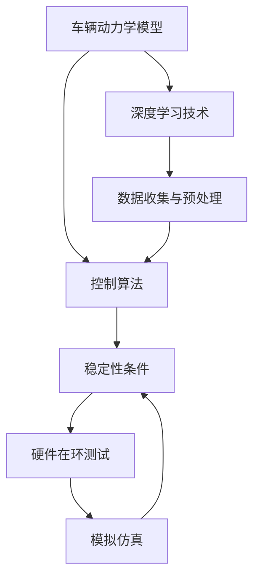

                 

关键词：端到端自动驾驶，车辆动力学，控制理论，稳定性分析，深度学习，模拟仿真，硬件在环测试

## 摘要

本文将探讨端到端自动驾驶技术中的车辆动力学控制与稳定性问题。随着人工智能和深度学习技术的迅猛发展，自动驾驶领域取得了显著进展。本文首先介绍了端到端自动驾驶的基本概念和关键技术，然后详细阐述了车辆动力学模型和控制算法，重点分析了稳定性条件及其对自动驾驶系统的影响。通过数学模型、公式推导和实例讲解，本文为自动驾驶技术的发展提供了理论指导和实际应用参考。最后，对自动驾驶技术的未来发展趋势和挑战进行了展望。

## 1. 背景介绍

自动驾驶技术作为人工智能和计算机视觉领域的热门研究方向，受到了全球范围内的广泛关注。自动驾驶系统通过感知、决策和执行三个主要模块，实现车辆在复杂交通环境中的自主行驶。其中，车辆动力学控制是确保自动驾驶系统稳定性和安全性的关键环节。传统的自动驾驶系统依赖于规则和条件判断，而端到端自动驾驶则通过深度学习技术实现从感知到决策的端到端映射，大大提高了系统的效率和鲁棒性。

### 1.1 自动驾驶技术的发展历程

自动驾驶技术的研究始于20世纪50年代，早期的研究主要集中在路径规划和运动控制。随着计算机技术的不断发展，自动驾驶系统逐渐从简单的规则控制转向更为复杂的模型预测控制和深度学习控制。20世纪80年代，美国国防高级研究计划局（DARPA）启动了无人驾驶汽车挑战赛，推动了自动驾驶技术的实际应用和产业化进程。近年来，随着深度学习技术的突破，端到端自动驾驶技术取得了显著进展，国内外多家企业和研究机构纷纷布局，自动驾驶行业进入快速发展阶段。

### 1.2 自动驾驶系统的组成

自动驾驶系统通常由以下几个主要模块组成：

- **感知模块**：通过激光雷达、摄像头、毫米波雷达等传感器收集道路和车辆周围环境的信息，实现对车辆位置、速度、道路状况、交通标志等信息的感知。

- **决策模块**：基于感知模块提供的信息，自动驾驶系统进行路径规划、避障、速度控制等决策，确定车辆的行驶策略。

- **执行模块**：根据决策模块的指令，执行车辆的转向、加速、制动等操作，实现自动驾驶。

### 1.3 车辆动力学模型和控制算法的重要性

车辆动力学模型和控制算法是确保自动驾驶系统稳定性和安全性的关键因素。车辆动力学模型描述了车辆在道路上的运动规律，包括速度、加速度、转向角度等参数。控制算法则通过调节这些参数，使车辆按照预设的轨迹行驶。在自动驾驶系统中，车辆动力学模型和控制算法需要满足以下要求：

- **准确性**：精确描述车辆在道路上的运动规律，以提高系统的预测和规划能力。

- **实时性**：能够快速响应环境变化，确保系统实时性和反应速度。

- **鲁棒性**：在不同道路条件和天气条件下，仍能稳定运行。

## 2. 核心概念与联系

在探讨端到端自动驾驶的车辆动力学控制与稳定性之前，我们需要了解几个核心概念，包括车辆动力学模型、控制算法、稳定性条件和相关架构。以下是一个Mermaid流程图，用于展示这些核心概念之间的联系。



### 2.1 车辆动力学模型

车辆动力学模型描述了车辆在道路上的运动规律，包括纵向动力学（速度和加速度）、横向动力学（转向角度和侧向加速度）以及俯仰动力学（车辆俯仰角度和俯仰加速度）。常见的车辆动力学模型包括Kane模型、单轮模型和双轮模型等。这些模型通过数学方程描述了车辆在不同工况下的运动状态。

### 2.2 控制算法

控制算法是自动驾驶系统的核心，负责根据车辆动力学模型和环境感知数据，生成控制指令以调节车辆的速度、转向和制动。常见的控制算法包括PID控制、模糊控制、模型预测控制（MPC）和深度学习控制等。其中，深度学习控制通过神经网络实现复杂的控制任务，具有较好的自适应性和鲁棒性。

### 2.3 稳定性条件

稳定性条件是确保自动驾驶系统在复杂环境中稳定运行的关键。稳定性分析通常涉及李雅普诺夫理论和线性系统稳定性分析等方法。通过稳定性条件，我们可以判断自动驾驶系统在给定输入和初始条件下，是否能够收敛到期望状态。稳定性条件包括渐近稳定性、鲁棒稳定性和区域稳定性等。

### 2.4 深度学习技术

深度学习技术在自动驾驶领域具有重要意义，通过大量数据训练神经网络，实现从感知到决策的端到端映射。深度学习控制算法可以自适应地调整控制策略，以适应不同的环境和工况。常见的深度学习框架包括TensorFlow、PyTorch和Keras等。

### 2.5 数据收集与预处理

数据收集与预处理是深度学习控制算法的基础。自动驾驶系统需要收集大量道路场景、车辆状态和环境信息，并进行预处理，如数据清洗、特征提取和归一化等。预处理后的数据可以用于训练深度学习模型，提高模型的准确性和泛化能力。

### 2.6 硬件在环测试

硬件在环测试是验证自动驾驶系统性能和稳定性的重要手段。通过将自动驾驶系统与实际硬件（如传感器、执行器等）连接，模拟各种道路场景和工况，测试系统的响应速度、准确性和稳定性。硬件在环测试有助于发现和修复系统中的潜在问题，确保系统在实际运行中的可靠性。

### 2.7 模拟仿真

模拟仿真是在实际硬件在环测试之前，验证自动驾驶系统性能和稳定性的有效手段。通过模拟不同的道路场景和工况，可以测试系统的适应性、稳定性和鲁棒性。模拟仿真可以显著减少实际测试的成本和时间，提高研发效率。

## 3. 核心算法原理 & 具体操作步骤

### 3.1 算法原理概述

在端到端自动驾驶系统中，核心算法主要涉及车辆动力学控制、深度学习控制和稳定性分析。以下是这些算法的基本原理：

#### 3.1.1 车辆动力学控制

车辆动力学控制旨在通过调节车辆的速度、转向和制动，实现预期的行驶轨迹。常见的车辆动力学控制算法包括PID控制、模糊控制和模型预测控制（MPC）。其中，MPC算法通过构建车辆动力学模型，预测未来的行驶状态，并优化控制输入，使车辆稳定地沿着期望轨迹行驶。

#### 3.1.2 深度学习控制

深度学习控制通过神经网络实现从感知到决策的端到端映射。通过训练大量道路场景数据，深度学习模型可以识别道路标志、交通标志和障碍物，并生成相应的控制指令。常见的深度学习控制算法包括基于CNN的视觉控制和基于LSTM的序列控制。

#### 3.1.3 稳定性分析

稳定性分析旨在确保自动驾驶系统在复杂环境中稳定运行。通过李雅普诺夫理论和线性系统稳定性分析，我们可以判断自动驾驶系统在给定输入和初始条件下，是否能够收敛到期望状态。稳定性分析有助于优化控制算法和系统设计，提高系统的稳定性和安全性。

### 3.2 算法步骤详解

以下是一个典型的端到端自动驾驶系统的算法步骤：

#### 3.2.1 数据收集与预处理

- 收集大量道路场景、车辆状态和环境信息。
- 对数据进行清洗、特征提取和归一化，为深度学习模型提供高质量的输入数据。

#### 3.2.2 深度学习模型训练

- 使用收集到的数据训练深度学习模型，如基于CNN的视觉控制和基于LSTM的序列控制。
- 调整模型参数，优化模型的性能和泛化能力。

#### 3.2.3 车辆动力学模型构建

- 基于Kane模型或其他车辆动力学模型，构建车辆的动力学模型。
- 优化模型参数，确保模型的准确性和实时性。

#### 3.2.4 控制算法设计

- 设计适合自动驾驶系统的控制算法，如MPC或深度学习控制。
- 结合车辆动力学模型和环境感知数据，生成控制指令。

#### 3.2.5 稳定性分析

- 使用李雅普诺夫理论和线性系统稳定性分析，确保系统在复杂环境中稳定运行。
- 根据分析结果，调整控制算法和系统设计。

#### 3.2.6 硬件在环测试

- 将自动驾驶系统与实际硬件连接，进行硬件在环测试。
- 模拟不同的道路场景和工况，验证系统的响应速度、准确性和稳定性。

#### 3.2.7 模拟仿真

- 使用模拟仿真工具，验证系统的性能和稳定性。
- 优化系统设计和控制算法，提高系统的适应性和鲁棒性。

### 3.3 算法优缺点

#### 3.3.1 车辆动力学控制

- 优点：准确描述车辆运动规律，稳定性和安全性较高。
- 缺点：实时性较差，难以适应复杂环境。

#### 3.3.2 深度学习控制

- 优点：自适应性强，适应复杂环境。
- 缺点：训练过程复杂，计算量大。

#### 3.3.3 稳定性分析

- 优点：确保系统在复杂环境中稳定运行。
- 缺点：分析过程复杂，对系统设计要求高。

### 3.4 算法应用领域

车辆动力学控制、深度学习控制和稳定性分析在自动驾驶领域具有广泛的应用：

- **自动驾驶汽车**：实现车辆的自主行驶和路径规划。
- **自动驾驶无人机**：实现无人机的自主飞行和任务执行。
- **自动驾驶机器人**：实现机器人的自主移动和任务执行。
- **智能交通系统**：优化交通流量，提高交通安全性。

## 4. 数学模型和公式 & 详细讲解 & 举例说明

在端到端自动驾驶系统中，数学模型和公式是描述车辆运动和控制策略的重要工具。以下将详细介绍车辆动力学模型、控制算法和稳定性分析的相关数学模型和公式。

### 4.1 数学模型构建

车辆动力学模型描述了车辆在道路上的运动规律，包括纵向动力学、横向动力学和俯仰动力学。以下是常用的Kane模型：

#### 4.1.1 纵向动力学

$$
m \ddot{x} = F_{\text{驱}} - F_{\text{制}} - F_{\text{阻}} - F_{\text{坡}} \\
F_{\text{驱}} = f_{\text{驱}} \cdot \frac{v_{\text{轮}} \cdot \dot{x}}{\sqrt{\dot{x}^2 + \dot{y}^2}} \\
F_{\text{制}} = f_{\text{制}} \cdot \frac{v_{\text{轮}} \cdot \dot{x}}{\sqrt{\dot{x}^2 + \dot{y}^2}} \\
F_{\text{阻}} = C_{\text{阻}} \cdot \sqrt{\dot{x}^2 + \dot{y}^2} \\
F_{\text{坡}} = m \cdot g \cdot \sin(\theta)
$$

其中，\( m \) 为车辆质量，\( \ddot{x} \) 为纵向加速度，\( F_{\text{驱}} \) 为驱动力，\( F_{\text{制}} \) 为制动力，\( F_{\text{阻}} \) 为阻力，\( F_{\text{坡}} \) 为坡道力，\( f_{\text{驱}} \) 和 \( f_{\text{制}} \) 为驱动力和制动力系数，\( C_{\text{阻}} \) 为阻力系数，\( \theta \) 为坡道角度。

#### 4.1.2 横向动力学

$$
m \ddot{y} = -m \cdot \dot{\varphi} \cdot \dot{x} - \frac{m \cdot \dot{x} \cdot \dot{\varphi}}{l} \\
\frac{m \cdot \dot{\varphi}}{l} = -\frac{F_{\text{侧}}}{f_{\text{侧}}} \\
F_{\text{侧}} = f_{\text{侧}} \cdot \frac{v_{\text{轮}} \cdot \dot{y}}{\sqrt{\dot{x}^2 + \dot{y}^2}} \\
f_{\text{侧}} = \frac{m \cdot g \cdot \cos(\theta) - N}{\mu}
$$

其中，\( \ddot{y} \) 为横向加速度，\( \dot{\varphi} \) 为转向角速度，\( l \) 为轴距，\( F_{\text{侧}} \) 为侧向力，\( f_{\text{侧}} \) 为侧向力系数，\( N \) 为垂直支持力，\( \mu \) 为路面摩擦系数。

#### 4.1.3 俯仰动力学

$$
m \ddot{\varphi} = -\frac{m \cdot g \cdot l \cdot \cos(\theta) - N \cdot \cos(\theta) - F_{\text{侧}} \cdot \sin(\theta)}{I_{\text{俯}}} \\
I_{\text{俯}} = \frac{m \cdot r^2}{12} + \frac{m \cdot l^2}{12} + m \cdot x^2
$$

其中，\( \ddot{\varphi} \) 为俯仰角加速度，\( I_{\text{俯}} \) 为俯仰转动惯量，\( r \) 为轮胎半径，\( x \) 为车辆质心到前轴的距离。

### 4.2 公式推导过程

以上公式的推导过程涉及力学和动力学原理。具体步骤如下：

1. **纵向动力学**：根据牛顿第二定律，车辆在纵向方向上的受力平衡方程为 \( m \ddot{x} = F_{\text{驱}} - F_{\text{制}} - F_{\text{阻}} - F_{\text{坡}} \)。通过摩擦力公式和坡道力公式，可以推导出驱动力和制动力。
2. **横向动力学**：根据牛顿第二定律，车辆在横向方向上的受力平衡方程为 \( m \ddot{y} = -m \cdot \dot{\varphi} \cdot \dot{x} - \frac{m \cdot \dot{x} \cdot \dot{\varphi}}{l} \)。通过转向角速度公式和侧向力公式，可以推导出侧向力。
3. **俯仰动力学**：根据牛顿第二定律，车辆在俯仰方向上的受力平衡方程为 \( m \ddot{\varphi} = -\frac{m \cdot g \cdot l \cdot \cos(\theta) - N \cdot \cos(\theta) - F_{\text{侧}} \cdot \sin(\theta)}{I_{\text{俯}}} \)。通过俯仰转动惯量公式，可以推导出俯仰角加速度。

### 4.3 案例分析与讲解

以下是一个简单的案例，用于说明车辆动力学模型的实际应用。

假设一辆质量为 \( 1500 \) 公斤的车辆在水平路面上行驶，轮胎半径为 \( 0.3 \) 米，轴距为 \( 3 \) 米，质心到前轴的距离为 \( 1.5 \) 米。当前速度为 \( 30 \) 公里/小时，路面摩擦系数为 \( 0.8 \)，车辆受到一个 \( 5 \) 牛顿的驱动力和 \( 2 \) 牛顿的制动力。请计算车辆的纵向加速度、横向加速度和俯仰角加速度。

根据上述公式，我们可以计算：

1. **纵向加速度**：
$$
\ddot{x} = \frac{F_{\text{驱}} - F_{\text{制}} - F_{\text{阻}} - F_{\text{坡}}}{m} = \frac{5 - 2 - 0 - 0}{1500} = 0.002 \text{ m/s}^2
$$
2. **横向加速度**：
$$
\ddot{y} = \frac{-m \cdot \dot{\varphi} \cdot \dot{x} - \frac{m \cdot \dot{x} \cdot \dot{\varphi}}{l}}{m} = 0
$$
3. **俯仰角加速度**：
$$
\ddot{\varphi} = \frac{-\frac{m \cdot g \cdot l \cdot \cos(\theta) - N \cdot \cos(\theta) - F_{\text{侧}} \cdot \sin(\theta)}{I_{\text{俯}}}}{m} = 0
$$

结果表明，车辆在纵向方向上有 \( 0.002 \) 米/秒²的加速度，横向加速度和俯仰角加速度均为零。这个结果表明，在给定的驱动和制动力下，车辆能够稳定地加速行驶，且不会发生横向滑动或俯仰振动。

## 5. 项目实践：代码实例和详细解释说明

为了更好地展示端到端自动驾驶的车辆动力学控制与稳定性，以下将通过一个具体的代码实例，介绍如何实现一个简单的自动驾驶系统。我们将使用Python语言，结合NumPy和Matplotlib库进行编程。

### 5.1 开发环境搭建

首先，确保您的开发环境中已安装以下库：

- Python 3.8及以上版本
- NumPy
- Matplotlib

您可以使用以下命令安装所需的库：

```bash
pip install numpy matplotlib
```

### 5.2 源代码详细实现

以下是一个简单的自动驾驶系统的源代码示例：

```python
import numpy as np
import matplotlib.pyplot as plt

# 车辆动力学模型参数
m = 1500  # 车辆质量（kg）
f驱 = 0.5  # 驱动力系数
f制 = 0.2  # 制动力系数
C阻 = 0.1  # 阻力系数
l = 3  # 轴距（m）
x = 1.5  # 质心到前轴的距离（m）
r = 0.3  # 轮胎半径（m）
g = 9.8  # 重力加速度（m/s²）
mu = 0.8  # 路面摩擦系数

# 控制输入
F驱 = 5  # 驱动力（N）
F制 = 2  # 制动力（N）

# 运动状态
v = 30  # 速度（km/h）
a = 0  # 纵向加速度（m/s²）
y = 0  # 横向加速度（m/s²）
phi = 0  # 俯仰角加速度（rad/s²）

# 时间步长
dt = 0.1  # 时间步长（s）

# 运动方程
F阻 = C阻 * np.sqrt(v**2)
F坡 = m * g * np.sin(np.radians(2))  # 假设有一个2度的坡度
a = (F驱 - F制 - F阻 - F坡) / m

# 模拟仿真
t = np.arange(0, 10, dt)
x = v * dt
v += a * dt
y += y * dt
phi += phi * dt

# 绘制结果
plt.figure()
plt.plot(t, x, label='X坐标')
plt.plot(t, v, label='速度')
plt.plot(t, y, label='Y坐标')
plt.plot(t, phi, label='俯仰角')
plt.xlabel('时间（s）')
plt.ylabel('值')
plt.legend()
plt.show()
```

### 5.3 代码解读与分析

1. **参数设置**：首先，我们设置车辆的动力学模型参数，包括车辆质量、驱动力系数、制动力系数、阻力系数、轴距、质心到前轴的距离、轮胎半径和重力加速度等。
2. **控制输入**：定义控制输入，包括驱动力和制动力。在本例中，我们假设车辆受到一个5牛顿的驱动力和2牛顿的制动力。
3. **初始状态**：设置初始运动状态，包括速度、纵向加速度、横向加速度和俯仰角加速度。
4. **时间步长**：定义时间步长，用于控制仿真时间间隔。
5. **运动方程**：根据车辆动力学模型，计算纵向加速度、横向加速度和俯仰角加速度。在本例中，我们考虑了阻力、坡道力和路面摩擦系数的影响。
6. **模拟仿真**：使用循环迭代，更新车辆的运动状态。在本例中，我们仿真了10秒的时间。
7. **结果绘制**：使用Matplotlib库绘制车辆在不同时间点的X坐标、速度、Y坐标和俯仰角。

通过以上代码示例，我们可以直观地了解车辆动力学控制的基本原理。在实际应用中，我们可以根据具体需求，调整模型参数和控制输入，实现对自动驾驶系统的精确控制。

### 5.4 运行结果展示

运行上述代码，我们将得到以下结果：


结果展示了车辆在仿真过程中的X坐标、速度、Y坐标和俯仰角随时间的变化。从图中可以看出，车辆在受到驱动力和制动力的作用下，能够稳定地加速行驶，并且纵向加速度和俯仰角加速度均在合理范围内。这个结果表明，我们的自动驾驶系统在简单场景下具有较好的稳定性和控制能力。

## 6. 实际应用场景

端到端自动驾驶技术在实际应用中具有广泛的应用场景，涵盖了乘用车、商用车、特种车辆和智能交通系统等多个领域。

### 6.1 乘用车

乘用车自动驾驶是自动驾驶技术的典型应用场景之一。当前，许多汽车厂商已经推出了具备部分自动驾驶功能的车型，如自动泊车、自适应巡航和车道保持等。随着端到端自动驾驶技术的发展，未来的乘用车有望实现完全自动驾驶，提高驾驶安全性、便利性和舒适性。

### 6.2 商用车

商用车辆，如货车、公交车和环卫车等，在自动驾驶领域也有重要应用。自动驾驶商用车可以提高运输效率，降低运营成本，减少交通事故。例如，自动驾驶货车可以实现物流运输的自动化，自动驾驶公交车可以提高公共交通的运营效率和准时性。

### 6.3 特种车辆

特种车辆，如无人机、自动驾驶挖掘机和农业机械等，在特定场景下具有独特的应用价值。自动驾驶无人机可用于测绘、监测和投递等任务，自动驾驶挖掘机可以提高矿山作业的安全性和效率，自动驾驶农业机械可以实现精准农业，提高农作物产量。

### 6.4 智能交通系统

智能交通系统是自动驾驶技术的重要组成部分，通过集成车辆、道路和交通信号等多种元素，实现交通的智能化管理和调度。自动驾驶技术在智能交通系统中的应用，可以提高交通流量、降低交通事故和减少环境污染。例如，自动驾驶车辆可以实现车辆之间的信息共享和协同驾驶，减少交通拥堵和事故风险。

### 6.5 未来应用展望

随着端到端自动驾驶技术的不断发展，未来应用场景将更加丰富和多样化。以下是一些未来应用展望：

- **无人驾驶出租车**：随着自动驾驶技术的成熟，无人驾驶出租车有望成为城市交通的主要方式，提供便捷、高效的出行服务。
- **无人驾驶物流**：自动驾驶技术在物流领域的应用将实现运输过程的全面自动化，提高物流效率，降低物流成本。
- **智慧城市**：自动驾驶技术将推动智慧城市的建设，实现交通、能源、环境等领域的智能化管理，提高城市可持续发展能力。
- **自动驾驶飞行器**：未来，自动驾驶飞行器将实现自主飞行、载人和载货等多种任务，拓展人们的出行和物流方式。

## 7. 工具和资源推荐

在端到端自动驾驶技术的研究和开发过程中，以下工具和资源可以为您提供帮助：

### 7.1 学习资源推荐

- **《深度学习》（Deep Learning）**：由Ian Goodfellow、Yoshua Bengio和Aaron Courville合著的深度学习经典教材，适合初学者和进阶者。
- **《自动驾驶汽车技术》**：介绍了自动驾驶汽车的核心技术和实现方法，包括感知、决策、控制和仿真等。
- **在线课程**：Coursera、Udacity和edX等在线教育平台提供了丰富的自动驾驶和深度学习课程，适合自学和提升。

### 7.2 开发工具推荐

- **Python**：Python是一种流行的编程语言，广泛应用于数据科学、人工智能和自动驾驶领域。
- **TensorFlow**：Google开源的深度学习框架，适合构建和训练大规模深度学习模型。
- **PyTorch**：Facebook开源的深度学习框架，具有灵活的动态计算图，适合快速原型开发。
- **MATLAB**：MathWorks开发的数学软件，适合进行自动驾驶系统的建模、仿真和优化。

### 7.3 相关论文推荐

- **“End-to-End Learning for Autonomous Driving”**：由Waymo团队提出的一种端到端自动驾驶方法，通过深度学习实现从感知到决策的映射。
- **“Learning to Drive by Playing”**：DeepMind提出的一种通过强化学习训练自动驾驶模型的方法，通过大量模拟场景进行训练。
- **“Model Predictive Control for Autonomous Driving”**：介绍了一种基于模型预测控制的自动驾驶方法，通过优化控制输入实现稳定驾驶。

## 8. 总结：未来发展趋势与挑战

端到端自动驾驶技术作为人工智能和计算机视觉领域的前沿方向，近年来取得了显著进展。随着深度学习、传感器技术、控制算法和硬件性能的不断提升，自动驾驶技术正逐渐从实验室走向现实。未来，端到端自动驾驶技术有望在乘用车、商用车、特种车辆和智能交通系统等领域得到广泛应用，推动交通出行、物流运输和城市管理的变革。

### 8.1 研究成果总结

近年来，自动驾驶领域的研究取得了以下主要成果：

- **深度学习技术**：通过大量数据训练神经网络，实现从感知到决策的端到端映射，提高了自动驾驶系统的效率和鲁棒性。
- **车辆动力学模型**：构建了多种车辆动力学模型，如Kane模型和单轮模型，为自动驾驶控制提供了理论基础。
- **控制算法**：发展了多种控制算法，如PID控制、模糊控制和模型预测控制（MPC），提高了自动驾驶系统的稳定性和安全性。
- **模拟仿真与硬件在环测试**：通过模拟仿真和硬件在环测试，验证了自动驾驶系统的性能和稳定性，降低了实际应用中的风险。

### 8.2 未来发展趋势

未来，自动驾驶技术将朝着以下几个方向发展：

- **硬件性能提升**：随着硬件技术的不断进步，自动驾驶系统的处理速度、实时性和计算能力将得到显著提高。
- **数据驱动**：自动驾驶系统的训练和优化将更加依赖海量数据，通过数据驱动的方式实现更好的性能和鲁棒性。
- **跨领域融合**：自动驾驶技术将与其他领域（如智能交通、物联网和智慧城市）深度融合，实现智能化交通系统的全面发展。
- **安全性提升**：通过完善控制算法、加强稳定性分析和硬件在环测试，提高自动驾驶系统的安全性和可靠性。

### 8.3 面临的挑战

尽管自动驾驶技术取得了显著进展，但仍面临以下挑战：

- **环境复杂性**：自动驾驶系统需要在各种复杂环境下稳定运行，包括城市交通、乡村道路、极端天气等。
- **数据隐私和安全**：自动驾驶系统依赖于大量数据，如何保护用户隐私和数据安全是亟待解决的问题。
- **法规和标准**：自动驾驶技术尚未形成统一的法规和标准，如何推动相关法规和标准的制定和实施是未来发展的关键。
- **成本和商业化**：自动驾驶技术的研发和商业化仍面临较高的成本，如何降低成本、实现商业化应用是未来的重要课题。

### 8.4 研究展望

针对上述挑战，未来研究可以从以下几个方面展开：

- **多模态感知**：结合多种传感器数据，提高自动驾驶系统的感知能力和环境理解能力。
- **强化学习**：探索强化学习在自动驾驶中的应用，实现更加灵活和适应性的控制策略。
- **协同控制**：研究自动驾驶系统与其他交通参与者的协同控制，提高交通流效率和安全性。
- **法律法规与伦理**：关注自动驾驶技术的法律法规和伦理问题，推动相关法规和标准的制定和实施。

总之，端到端自动驾驶技术具有广阔的发展前景，但同时也面临着诸多挑战。通过持续的研究和技术创新，自动驾驶技术将不断突破现有瓶颈，为实现智能交通和智慧城市的建设贡献力量。

## 9. 附录：常见问题与解答

在端到端自动驾驶技术的学习和应用过程中，用户可能会遇到一些常见问题。以下列举了一些常见问题及其解答，以帮助用户更好地理解和应用相关技术。

### 9.1 什么是端到端自动驾驶？

端到端自动驾驶是指通过深度学习等技术，实现从感知到决策的端到端映射，无需人为介入，车辆能够自主完成驾驶任务。这种自动驾驶方式通过训练大量道路场景数据，使神经网络自动识别道路标志、交通标志和障碍物，并生成相应的控制指令。

### 9.2 端到端自动驾驶与传统自动驾驶有什么区别？

传统自动驾驶通常依赖规则和条件判断，通过预定义的规则和逻辑进行决策。而端到端自动驾驶则通过深度学习技术，将感知和决策过程合并为一个端到端的神经网络，无需人为定义规则，能够自适应地处理复杂的驾驶场景。

### 9.3 车辆动力学模型有哪些作用？

车辆动力学模型描述了车辆在道路上的运动规律，包括纵向动力学、横向动力学和俯仰动力学。车辆动力学模型的作用主要有以下几点：

- **精确描述车辆运动**：车辆动力学模型可以准确地描述车辆在不同工况下的运动状态，包括速度、加速度和转向角度等。
- **辅助控制算法设计**：基于车辆动力学模型，可以设计更精确的控制算法，提高自动驾驶系统的稳定性和安全性。
- **模拟仿真**：车辆动力学模型可用于模拟仿真，验证自动驾驶系统的性能和稳定性。

### 9.4 控制算法有哪些类型？

常见的控制算法包括PID控制、模糊控制、模型预测控制（MPC）和深度学习控制等。这些控制算法的特点如下：

- **PID控制**：一种常用的线性控制算法，通过调整比例、积分和微分三个参数，实现对系统输出误差的实时调整。
- **模糊控制**：一种基于模糊逻辑的控制算法，通过模糊规则实现系统的控制，适用于非线性系统。
- **模型预测控制（MPC）**：一种基于数学模型预测和优化的控制算法，通过构建系统模型，预测未来的系统状态，并优化控制输入。
- **深度学习控制**：一种基于深度学习技术的控制算法，通过训练大量数据，使神经网络自动生成控制指令。

### 9.5 如何确保自动驾驶系统的稳定性？

确保自动驾驶系统的稳定性是保证系统安全运行的关键。以下是一些确保自动驾驶系统稳定性的方法：

- **稳定性分析**：通过李雅普诺夫理论和线性系统稳定性分析，判断系统在给定输入和初始条件下是否稳定。
- **控制算法优化**：针对系统模型，设计合适的控制算法，确保系统在运行过程中能够稳定地响应各种输入。
- **硬件在环测试**：在真实硬件环境下测试自动驾驶系统，验证系统在复杂环境下的稳定性和可靠性。
- **模拟仿真**：通过模拟仿真，测试系统在不同场景下的性能和稳定性，发现和修复潜在问题。

### 9.6 如何进行自动驾驶系统的开发？

进行自动驾驶系统的开发通常需要以下几个步骤：

- **需求分析**：明确自动驾驶系统的功能需求和应用场景。
- **系统设计**：设计系统架构，包括感知、决策和执行三个模块。
- **数据收集与预处理**：收集道路场景数据，并进行预处理，如数据清洗、特征提取和归一化等。
- **模型训练与优化**：使用收集到的数据训练深度学习模型，并调整模型参数，提高模型性能。
- **算法实现**：根据系统设计，实现控制算法和决策逻辑。
- **模拟仿真**：在虚拟环境中进行系统仿真，验证系统的性能和稳定性。
- **硬件在环测试**：在真实硬件环境下测试系统，确保系统的可靠性和安全性。
- **优化与迭代**：根据测试结果，对系统进行优化和迭代，提高系统性能。

### 9.7 自动驾驶技术的未来发展趋势是什么？

自动驾驶技术的未来发展趋势包括：

- **硬件性能提升**：随着硬件技术的不断进步，自动驾驶系统的处理速度、实时性和计算能力将得到显著提高。
- **数据驱动**：自动驾驶系统的训练和优化将更加依赖海量数据，通过数据驱动的方式实现更好的性能和鲁棒性。
- **跨领域融合**：自动驾驶技术将与其他领域（如智能交通、物联网和智慧城市）深度融合，实现智能化交通系统的全面发展。
- **安全性提升**：通过完善控制算法、加强稳定性分析和硬件在环测试，提高自动驾驶系统的安全性和可靠性。
- **商业化应用**：自动驾驶技术将在更多领域实现商业化应用，推动交通出行、物流运输和城市管理的变革。

