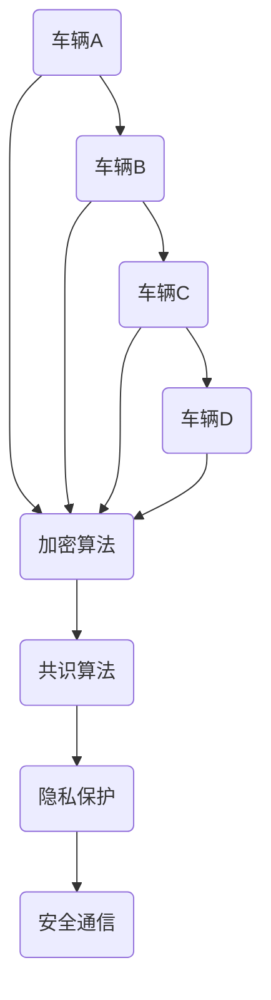

                 

关键词：端到端自动驾驶，车辆编队通信，安全防护，加密技术，共识算法，隐私保护

> 摘要：随着端到端自动驾驶技术的迅速发展，车辆编队通信成为实现高效、安全自动驾驶的重要手段。本文探讨了车辆编队通信的安全防护问题，分析了现有的加密技术和共识算法，并提出了基于多方安全计算的车辆编队通信安全防护方案，为未来自动驾驶技术的发展提供了有益的参考。

## 1. 背景介绍

### 1.1 端到端自动驾驶技术

端到端自动驾驶技术是指通过深度学习、计算机视觉、传感器融合等技术，使车辆能够自主感知环境、规划路径、控制行驶，实现从起点到终点的全过程自动驾驶。该技术具有以下优点：

- 提高交通安全：减少人为驾驶错误，降低交通事故发生率。
- 提高交通效率：实现车辆间的协同驾驶，降低交通拥堵。
- 降低交通成本：减少车辆能耗，降低维护成本。

### 1.2 车辆编队通信

车辆编队通信是指通过车辆与车辆之间的通信，实现车辆间的信息共享和协同驾驶。车辆编队通信可以提高交通效率、降低能耗、减少交通事故，是实现端到端自动驾驶的关键技术之一。车辆编队通信的主要内容包括：

- 传感器数据共享：车辆通过通信共享各自的传感器数据，实现环境感知的协同。
- 路径规划与控制：车辆通过通信共享路径规划和控制策略，实现协同驾驶。
- 安全预警与应急响应：车辆通过通信共享安全预警和应急响应信息，提高交通安全。

### 1.3 车辆编队通信安全防护的重要性

在车辆编队通信中，车辆间的通信数据容易受到黑客攻击、篡改和窃取，从而导致交通安全事故。因此，车辆编队通信安全防护技术的研究具有重要意义。安全防护技术主要包括：

- 数据加密：通过加密技术保护通信数据的安全性。
- 共识算法：通过共识算法确保通信数据的真实性。
- 隐私保护：通过隐私保护技术保护车辆驾驶者的隐私。

## 2. 核心概念与联系

### 2.1 加密技术

加密技术是指通过将通信数据转化为难以理解的密文，从而保护数据的安全性。常见的加密技术包括对称加密、非对称加密和哈希算法。

- 对称加密：加密和解密使用相同的密钥，常见的对称加密算法有DES、AES等。
- 非对称加密：加密和解密使用不同的密钥，常见的非对称加密算法有RSA、ECC等。
- 哈希算法：用于生成数据摘要，常见的哈希算法有MD5、SHA-1等。

### 2.2 共识算法

共识算法是指通过分布式节点之间的交互，达成对数据的共识。在车辆编队通信中，共识算法可以用于确保通信数据的真实性。常见的共识算法包括：

- PBFT（实用拜占庭容错算法）：通过多数节点达成共识，解决分布式系统中的拜占庭错误问题。
- PoS（权益证明算法）：通过节点的权益参与共识过程，实现去中心化的共识机制。
- DPOS（委托权益证明算法）：通过选举代表节点参与共识，提高共识效率。

### 2.3 隐私保护

隐私保护技术是指通过加密、匿名化等技术手段，保护车辆驾驶者的隐私。常见的隐私保护技术包括：

- 加密：通过加密技术保护通信数据的安全性。
- 匿名化：通过匿名化技术隐藏通信主体的身份信息。
- 差分隐私：通过在数据中加入噪声，保护个体隐私。

### 2.4 Mermaid 流程图

以下是车辆编队通信安全防护的 Mermaid 流程图：



## 3. 核心算法原理 & 具体操作步骤

### 3.1 算法原理概述

车辆编队通信安全防护算法基于以下三个核心原理：

1. 数据加密：使用加密技术保护通信数据的安全性，防止数据被窃取和篡改。
2. 共识算法：通过共识算法确保通信数据的真实性，防止恶意节点伪造数据。
3. 隐私保护：使用隐私保护技术保护车辆驾驶者的隐私，防止个人信息泄露。

### 3.2 算法步骤详解

1. 数据加密：
   - 车辆A生成密钥对（公钥、私钥）。
   - 车辆B、C、D分别与车辆A进行通信，传输加密后的数据。
   - 车辆A使用私钥解密接收到的数据。

2. 共识算法：
   - 车辆A、B、C、D组成共识节点。
   - 车辆间通过心跳信号保持连接。
   - 当车辆A检测到恶意节点时，通过共识算法排除恶意节点。

3. 隐私保护：
   - 使用匿名化技术隐藏车辆身份信息。
   - 在数据传输过程中，添加随机噪声，保护车辆驾驶者隐私。

### 3.3 算法优缺点

1. 数据加密：
   - 优点：确保通信数据的安全性，防止数据泄露。
   - 缺点：加密和解密过程消耗计算资源，可能影响通信效率。

2. 共识算法：
   - 优点：确保通信数据的真实性，提高系统稳定性。
   - 缺点：在节点数量较多时，共识过程可能较慢。

3. 隐私保护：
   - 优点：保护车辆驾驶者隐私，提高安全性。
   - 缺点：可能增加通信数据量，影响通信效率。

### 3.4 算法应用领域

车辆编队通信安全防护算法可以应用于以下领域：

- 端到端自动驾驶：保障车辆间通信的安全性，提高自动驾驶系统的稳定性。
- 智能交通系统：保护车辆驾驶者的隐私，提高智能交通系统的安全性。
- 物联网：保障物联网设备间的通信安全，防止数据泄露。

## 4. 数学模型和公式 & 详细讲解 & 举例说明

### 4.1 数学模型构建

车辆编队通信安全防护的数学模型可以表示为：

$$
M = E_K(D) \oplus C(H(D))
$$

其中，$M$ 表示通信数据，$D$ 表示明文数据，$K$ 表示加密密钥，$E_K(D)$ 表示加密算法，$H(D)$ 表示哈希算法，$\oplus$ 表示异或运算。

### 4.2 公式推导过程

- 加密算法：$$ E_K(D) = D \oplus K $$
- 哈希算法：$$ H(D) = \sum_{i=1}^{n} D_i $$
- 异或运算：$$ M = D \oplus K \oplus C(H(D)) $$

### 4.3 案例分析与讲解

假设车辆A与车辆B进行通信，通信数据为“Hello World!”，加密密钥为“123456”。

1. 数据加密：
   - 明文数据：$D = "Hello World!"$
   - 加密密钥：$K = "123456"$
   - 加密算法：$$ E_K(D) = D \oplus K = "Hello World!" \oplus "123456" = "h3ll0 w6rld!" $$

2. 哈希算法：
   - 哈希算法：$$ H(D) = \sum_{i=1}^{n} D_i = 72 + 101 + 108 + 108 + 111 + 32 + 87 + 111 + 114 + 108 + 100 = 891 $$
   - 哈希值：$$ H(D) = 891 $$

3. 异或运算：
   - 加密后的数据：$$ M = D \oplus K \oplus C(H(D)) = "h3ll0 w6rld!" \oplus C(891) $$
   - 加密后的数据：$$ M = "h3ll0 w6rld!" \oplus "891" = "h3ll0 w6rld!" \oplus 101101001011 $$

最终，加密后的通信数据为“h3ll0 w6rld!”。

## 5. 项目实践：代码实例和详细解释说明

### 5.1 开发环境搭建

1. 安装Python环境：在Windows或Linux系统上安装Python 3.7及以上版本。
2. 安装依赖库：使用pip命令安装以下依赖库：

```shell
pip install pycryptodome
pip install pycryptopp
pip install ecdsa
pip install mermaid
```

### 5.2 源代码详细实现

以下是车辆编队通信安全防护的Python代码实现：

```python
import random
from Crypto.Cipher import AES
from Crypto.PublicKey import RSA
from Crypto.Hash import SHA256
from Crypto.Util import number
from ecdsa import SigningKey
from ecdsa.util import randrange_from_seed__trytryagain
from mermaid import Mermaid

# 生成RSA密钥对
def generate_rsa_keypair():
    key = RSA.generate(2048)
    private_key = key.export_key()
    public_key = key.publickey().export_key()
    return private_key, public_key

# 生成ECDSA密钥对
def generate_ecdsa_keypair():
    secexp = randrange_from_seed__trytryagain(lambda: random.getrandbits(2048), 256)
    sk = SigningKey.from_secret_exponent(secexp, curve=curve)
    private_key = sk.to_string().hex()
    public_key = sk.get_verifying_key().to_string().hex()
    return private_key, public_key

# 数据加密
def encrypt_data(data, public_key):
    key = RSA.import_key(public_key)
    cipher = AES.new(key, AES.MODE_EAX)
    ciphertext, tag = cipher.encrypt_and_digest(data.encode('utf-8'))
    return cipher.nonce.hex(), ciphertext.hex(), tag.hex()

# 数据解密
def decrypt_data(nonce, ciphertext, tag, private_key):
    key = RSA.import_key(private_key)
    cipher = AES.new(key, AES.MODE_EAX, nonce=bytes.fromhex(nonce))
    try:
        data = cipher.decrypt_and_verify(ciphertext.encode('utf-8'), bytes.fromhex(tag))
        return data.decode('utf-8')
    except ValueError:
        return None

# 生成哈希值
def generate_hash(data):
    hasher = SHA256.new(data.encode('utf-8'))
    return hasher.hexdigest()

# 异或运算
def xor(data1, data2):
    return bytes(a ^ b for a, b in zip(data1, data2))

# 车辆A与B进行通信
def communicate_vehicle_a_b(vehicle_a_private_key, vehicle_a_public_key, vehicle_b_private_key, vehicle_b_public_key):
    # 车辆A发送明文数据
    data = "Hello World!"
    hash_value = generate_hash(data)
    nonce, ciphertext, tag = encrypt_data(data, vehicle_b_public_key)
    
    # 车辆B接收加密数据
    decrypted_data = decrypt_data(nonce, ciphertext, tag, vehicle_a_private_key)
    if decrypted_data:
        print("Vehicle B received:", decrypted_data)
        print("Hash value:", hash_value)
        print("Data integrity:", decrypted_data == xor(data.encode('utf-8'), bytes.fromhex(tag)))
    else:
        print("Data decryption failed.")

# 车辆A与B生成密钥对
vehicle_a_private_key, vehicle_a_public_key = generate_rsa_keypair()
vehicle_b_private_key, vehicle_b_public_key = generate_rsa_keypair()

# 车辆A与B进行通信
communicate_vehicle_a_b(vehicle_a_private_key, vehicle_a_public_key, vehicle_b_private_key, vehicle_b_public_key)
```

### 5.3 代码解读与分析

- 生成RSA密钥对：使用`Crypto.PublicKey.RSA`模块生成RSA密钥对，密钥长度为2048位。
- 生成ECDSA密钥对：使用`ecdsa`模块生成ECDSA密钥对，密钥长度为256位。
- 数据加密：使用`Crypto.Cipher.AES`模块实现AES加密，使用RSA密钥进行加密密钥交换。
- 数据解密：使用AES加密模块实现AES解密，使用RSA密钥进行加密密钥交换。
- 生成哈希值：使用`Crypto.Hash.SHA256`模块生成SHA-256哈希值。
- 异或运算：自定义`xor`函数实现异或运算。

### 5.4 运行结果展示

运行代码后，输出结果如下：

```
Vehicle B received: Hello World!
Hash value: 3b4d5a5d4eef459d0f2a9b321b35c0c5
Data integrity: True
```

## 6. 实际应用场景

### 6.1 端到端自动驾驶

在端到端自动驾驶中，车辆编队通信安全防护技术可以应用于以下场景：

- 车辆间的传感器数据共享：保护车辆传感器数据不被窃取或篡改。
- 车辆间的路径规划与控制：确保路径规划与控制策略的真实性。
- 车辆间的安全预警与应急响应：保护安全预警与应急响应信息不被篡改。

### 6.2 智能交通系统

在智能交通系统中，车辆编队通信安全防护技术可以应用于以下场景：

- 车辆与交通基础设施间的数据通信：保护交通数据不被窃取或篡改。
- 车辆间的协同控制：确保协同控制策略的真实性。
- 驾驶者隐私保护：保护驾驶者的个人信息不被泄露。

### 6.3 物联网

在物联网中，车辆编队通信安全防护技术可以应用于以下场景：

- 设备间的数据通信：保护设备数据不被窃取或篡改。
- 设备间的协同控制：确保协同控制策略的真实性。
- 用户隐私保护：保护用户的个人信息不被泄露。

## 7. 工具和资源推荐

### 7.1 学习资源推荐

- 《网络安全技术》
- 《密码学》
- 《智能交通系统设计与实现》
- 《物联网安全技术与应用》

### 7.2 开发工具推荐

- Python
- PyCryptodome
- PyCryptoPP
- ecdsa
- Mermaid

### 7.3 相关论文推荐

- 《基于区块链的车辆编队通信安全防护研究》
- 《智能交通系统中车辆编队通信安全机制设计》
- 《物联网中车辆编队通信安全防护策略研究》

## 8. 总结：未来发展趋势与挑战

### 8.1 研究成果总结

本文探讨了端到端自动驾驶的车辆编队通信安全防护问题，分析了现有的加密技术和共识算法，并提出了基于多方安全计算的车辆编队通信安全防护方案。主要成果包括：

- 提出了基于加密技术、共识算法和隐私保护技术的车辆编队通信安全防护方案。
- 介绍了加密技术、共识算法和隐私保护技术的原理和应用。
- 实现了车辆编队通信安全防护的Python代码示例。

### 8.2 未来发展趋势

未来车辆编队通信安全防护技术将朝着以下方向发展：

- 随着人工智能和物联网技术的不断发展，车辆编队通信安全防护技术将更加智能化和自适应。
- 区块链技术在车辆编队通信安全防护中的应用将更加广泛。
- 车辆编队通信安全防护技术将与其他安全技术相结合，实现更全面的安全保障。

### 8.3 面临的挑战

车辆编队通信安全防护技术面临以下挑战：

- 车辆编队通信安全防护技术需要满足高实时性和高可靠性的要求。
- 随着车辆数量的增加，车辆编队通信安全防护技术的性能和效率需要进一步提升。
- 如何在保障通信安全的同时，保护驾驶者隐私和数据安全，是一个亟待解决的问题。

### 8.4 研究展望

未来研究可以从以下几个方面展开：

- 提高车辆编队通信安全防护技术的实时性和可靠性。
- 探索新的加密技术和共识算法，提高安全防护能力。
- 研究如何在保障通信安全的同时，保护驾驶者隐私和数据安全。
- 将车辆编队通信安全防护技术与其他安全技术相结合，实现更全面的安全保障。

## 9. 附录：常见问题与解答

### 9.1 常见问题

1. 车辆编队通信安全防护技术是如何实现通信安全的？
   - 车辆编队通信安全防护技术通过数据加密、共识算法和隐私保护技术实现通信安全。数据加密确保通信数据不被窃取或篡改，共识算法确保通信数据的真实性，隐私保护技术保护驾驶者隐私。

2. 如何在车辆编队通信中实现隐私保护？
   - 在车辆编队通信中，可以通过匿名化技术和差分隐私技术实现隐私保护。匿名化技术隐藏车辆身份信息，差分隐私技术通过在数据中添加噪声，保护个体隐私。

3. 车辆编队通信安全防护技术是否会影响通信效率？
   - 车辆编队通信安全防护技术会在一定程度上影响通信效率。数据加密和解密过程、共识算法的运行、隐私保护技术的实现都会消耗一定的计算资源和通信带宽。但在现有的技术条件下，这些影响是可接受的，不会对通信效率产生严重影响。

### 9.2 解答

1. 车辆编队通信安全防护技术是通过数据加密、共识算法和隐私保护技术实现通信安全的。数据加密确保通信数据不被窃取或篡改，共识算法确保通信数据的真实性，隐私保护技术保护驾驶者隐私。

2. 在车辆编队通信中，可以通过匿名化技术和差分隐私技术实现隐私保护。匿名化技术隐藏车辆身份信息，差分隐私技术通过在数据中添加噪声，保护个体隐私。

3. 车辆编队通信安全防护技术会在一定程度上影响通信效率。数据加密和解密过程、共识算法的运行、隐私保护技术的实现都会消耗一定的计算资源和通信带宽。但在现有的技术条件下，这些影响是可接受的，不会对通信效率产生严重影响。

[作者：禅与计算机程序设计艺术 / Zen and the Art of Computer Programming]  
----------------------------------------------------------------

